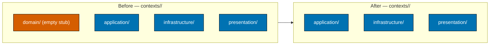

# Tech Docs — ose-web-remove-ddd

## Architecture Context

`apps/ose-web/` organizes feature concerns under `src/contexts/<name>/`. Today each context has up
to four layer folders: `domain/`, `application/`, `infrastructure/`, `presentation/`. The
`domain/` folder in all seven contexts is an empty stub — every `domain/index.ts` contains exactly
`export {};` [Repo-grounded], and nothing outside those barrels imports from `domain/`
[Repo-grounded, verified via grep].

Governance (`repo-governance/development/pattern/hexagonal-architecture-web.md`) describes the web
`contexts/` pattern as Effect.ts-named feature modules and explicitly says "DDD applies only to
backend apps". The general layout in that doc allows a `domain/` layer, but `ose-web` is a
content/marketing site with **no** domain logic (no Effect TS, no XState) — its real layers are
`application/`, `infrastructure/`, `presentation/`. Deleting the empty `domain/` stubs tidies the
tree to match reality; it does not contradict the governance doc, which permits a domain layer but
does not require one.

## Design Decisions

### DD-1: Delete empty `domain/` layers rather than populate them

`ose-web` has no domain logic to add. Keeping empty layers invites misplaced code and misleads
readers. Deleting them is the simplest behavior-preserving option (Simplicity Over Complexity).
Verified safe: no importers outside the stub barrels. [Repo-grounded]

### DD-2: Express the `rhino-cli` allowlist edit relatively

Two sibling plans (`ayokoding-web-remove-ddd`, `wahidyankf-web-remove-ddd-and-hexagonal`) edit the
same `allowlist.rs` and the same `membership` test in arbitrary order. Absolute assertions (e.g.
"set `len` to 4") would conflict. Instead: remove the `ose-platform` entry and **decrement the
expected `len` by 1** relative to whatever value is present when this plan executes. The current
`membership` test asserts `assert_eq!(v.len(), 5)` and `contains` for `organiclever`, `ayokoding`,
`ose-app` (no `ose-platform` assertion to remove) [Repo-grounded], so the load-bearing change is
the `len` decrement.

### DD-3: Remove only the two `ddd/...` `inputs` globs, keep all others

`test:quick` `inputs` currently includes src, test, content, vitest, behavior/web gherkin,
behavior/api gherkin, and the two `ddd/...` globs [Repo-grounded]. Removing only the two DDD globs
preserves the cache semantics for all other tracked inputs and keeps `spec-coverage` intact.

### DD-4: Keep the coverage threshold and vitest command unchanged

The `test:quick` command runs `npx vitest run ... --coverage` followed by a `rhino-cli test-coverage
validate ... 86` call [Repo-grounded]. The `86` threshold and the vitest invocation are unrelated
to DDD and stay exactly as-is.

### DD-5: README rewrite mirrors governance terminology

The README Architecture/Project-Structure/Specs/Bounded-Contexts sections are rewritten to use the
three real layers (`application`, `infrastructure`, `presentation`) and to link
`repo-governance/development/pattern/hexagonal-architecture-web.md`. DDD terms ("DDD", "bounded
context", "Per-BC", the `ddd/bounded-contexts.yaml` and `ddd/ubiquitous-language/` rows, "schema
v2") are removed.

## File-Impact Map

| File / Path                                                      | Action | Detail                                                                                                                                |
| ---------------------------------------------------------------- | ------ | ------------------------------------------------------------------------------------------------------------------------------------- |
| `specs/apps/ose-platform/ddd/` (11 files)                        | Delete | `git rm -r` the whole directory (bounded-contexts.yaml, bounded-context-map.md, README.md, ubiquitous-language/\*\*). [Repo-grounded] |
| `apps/ose-web/project.json` (lines ~72-73)                       | Edit   | Remove the two `(cd ../../apps/rhino-cli && cargo run ... ddd bc/ul ose-platform)` command lines.                                     |
| `apps/ose-web/project.json` (lines ~86-87)                       | Edit   | Remove the `.../ddd/bounded-contexts.yaml` and `.../ddd/ubiquitous-language/**/*.md` inputs globs.                                    |
| `apps/rhino-cli/src/internal/allowlist.rs` (slice, line ~23)     | Edit   | Remove `"ose-platform",` from `apps_with_ddd()`.                                                                                      |
| `apps/rhino-cli/src/internal/allowlist.rs` (test, line ~38)      | Edit   | Decrement `assert_eq!(v.len(), N)` by 1 (relative).                                                                                   |
| `apps/rhino-cli/src/internal/allowlist.rs` (doc, line ~10)       | Edit   | Remove the `- ose-platform: ...` `//!` bullet.                                                                                        |
| `apps/ose-web/src/contexts/*/domain/` (7 dirs + barrels)         | Delete | `git rm -r` each `domain/` folder (app-shell, content, health, landing, rss-feed, search, seo).                                       |
| `apps/ose-web/README.md` (Architecture, Specs, Bounded Contexts) | Edit   | Rewrite to hexagonal feature-module framing; remove DDD references. [Repo-grounded]                                                   |

## Dependencies

- `rhino-cli` is a pre-push dependency for other apps (drives `test:quick` coverage validation,
  `spec-coverage`, and the `ddd` validators). It must be rebuilt (`nx build rhino-cli`) and
  retested (`cargo test`) after the allowlist edit. [Repo-grounded]
- No npm/Cargo dependency version changes. No new dependencies.

## Testing Strategy

| AC   | Level                    | Mechanism                                                                                   |
| ---- | ------------------------ | ------------------------------------------------------------------------------------------- |
| AC-1 | Guard (grep/test -d)     | `test -d specs/apps/ose-platform/ddd` exits non-zero; `git status` shows 11 deletions.      |
| AC-2 | Guard (grep)             | `grep` of `project.json` finds no `ddd bc/ul` commands and no `ddd/` inputs globs.          |
| AC-3 | Unit (cargo)             | `rhino-cli` `membership` test (RED before `len` decrement, GREEN after). [Repo-grounded]    |
| AC-4 | Guard (find) + typecheck | `find ... -name domain` returns zero; `nx run ose-web:typecheck` exits 0.                   |
| AC-5 | Guard (grep)             | `grep` of README finds no DDD terms; link to governance doc present.                        |
| AC-6 | Build + E2E smoke        | `nx build ose-web`; Playwright MCP smoke of `/`, `/updates`, `/about`; zero console errors. |

## Rollback

Each change group is independently revertible via `git revert` / `git checkout` of the affected
files. The safest rollback unit is the whole plan branch — because deletions and the allowlist edit
are coupled to the README narrative, revert the plan's commits in reverse order. The Phase gates
ensure the tree is coherent at every boundary, so a mid-plan abort leaves a buildable tree.
