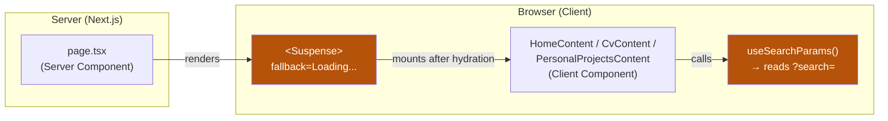
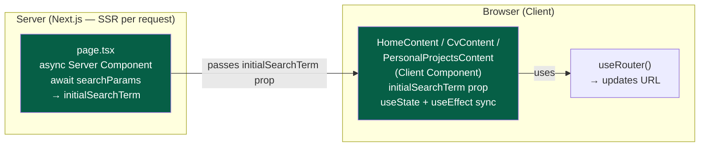

# Technical Documentation — wahidyankf-web SSR + SEO Refactor

## Architecture Overview

### Current Architecture (Before)

Crawlers see only the `Loading...` fallback because `useSearchParams` forces client-side
resolution after hydration.

### Target Architecture (After)

Crawlers receive full HTML because the server component resolves `searchParams` and renders content
before the response is sent. The client component hydrates and takes over interactivity.

## Design Decisions

### DD-1: Use `searchParams` prop (not `cookies` or `headers`) for SSR

**Decision**: Opt routes into dynamic SSR by accepting the `searchParams: Promise<{search?: string; scrollTop?: string}>` prop on each `page.tsx` async server component and awaiting it.

**Rationale**: `searchParams` is the idiomatic Next.js 15+ mechanism for per-request dynamic
rendering triggered by URL query parameters. It does not require any middleware or cookie handling.
Awaiting it in an async server component is the minimal change needed — no additional API surface.

**Alternative considered**: `cookies()` / `headers()` for forcing dynamic rendering — rejected
because it is indirect and semantically incorrect (we are reading query params, not cookies).

### DD-2: `useState(initialSearchTerm)` + `useEffect` for client-side sync

**Decision**: Content components keep a local `searchTerm` state seeded from `initialSearchTerm`
and add `useEffect(() => setSearchTerm(initialSearchTerm), [initialSearchTerm])` to sync on
subsequent client-side navigations (e.g., back/forward).

**Rationale**: This is the canonical Next.js SSR + client-state sync pattern. Server renders with
the initial value; the client takes over. Without the `useEffect`, navigating back to a page
with a different `?search=` param would not update the displayed results because React does not
re-mount the component.

### DD-3: Remove `<Suspense>` wrappers entirely

**Decision**: Remove all `<Suspense fallback={
Loading...
}>` wrappers from page files
and from the internal `ProjectsContent` wrapper inside `PersonalProjectsContent.tsx`.

**Rationale**: `<Suspense>` was required only because `useSearchParams` cannot be called outside
a Suspense boundary in Next.js. Once `useSearchParams` is removed from all client components, no
component in the tree needs to suspend during rendering, so the wrapper is redundant and its
removal is safe.

### DD-4: Explicit `"use client"` on `Navigation.tsx`

**Decision**: Add `"use client"` to the top of `Navigation.tsx`.

**Rationale**: `Navigation.tsx` calls `usePathname()`, which is a client-only hook. Currently it
works only because it is always rendered inside a client component tree (the content components
are all `"use client"`). After the refactor, `Navigation` is still rendered from a client
component, but the explicit directive removes the implicit dependency and makes the module boundary
unambiguous. This follows the "explicit over implicit" principle from `repo-governance/principles/`.

### DD-5: `scrollTop` prop on `CvContent` via `page.tsx`

**Decision**: `cv/page.tsx` reads `scrollTop` from `searchParams` and passes `scrollTop={scrollTop === 'true'}` as a boolean prop to `CvContent`. `CvContent` handles scroll-to-top + param removal in a `useEffect`.

**Rationale**: Previously `CvContent` read `searchParams.get("scrollTop")` directly. Post-refactor
the component has no `useSearchParams` at all. Passing the resolved boolean as a prop keeps the
component's interface clean and the server/client boundary explicit.

### DD-6: Remove `output: "standalone"` from `next.config.ts`

**Decision**: Remove the `output: "standalone"` field from `apps/wahidyankf-web/next.config.ts`.

**Rationale**: `output: "standalone"` bundles a self-contained Node server under `.next/standalone/`
which is designed for self-hosted (non-Vercel) Docker deployments. Vercel's native build system
does not use `.next/standalone/` — it reads the full `.next/` output directly. Keeping
`output: "standalone"` adds unnecessary build weight and creates divergence between what runs in
CI (Docker) and what runs on Vercel.

### DD-7: Dockerfile update — use `next start` instead of `node server.js`

**Decision**: Update the Dockerfile final stage to:

1. Copy `.next/`, `public/`, `node_modules/`, `package.json` from the build stage.
2. Change `CMD` to `["node_modules/.bin/next", "start", "-p", "3201", "-H", "0.0.0.0"]`.

**Rationale**: Without `output: "standalone"`, there is no `.next/standalone/server.js`. The
standard way to run a Next.js production build is `next start`. The Dockerfile is used only by
the CI Docker-compose stack for E2E tests; Vercel uses its own deployment pipeline.

### DD-8: Static `export const metadata` is compatible with dynamic `searchParams` prop

**Note**: `export const metadata: Metadata = {...}` (static metadata export) and
`async function CV({ searchParams })` (dynamic route via `searchParams` prop) can coexist in the
same `page.tsx` file. Next.js 15+ handles this correctly: the static metadata object is collected
at build time for the HTML `<head>`, while the `searchParams` prop triggers per-request dynamic
rendering for the page body. There is no conflict between these two mechanisms — static metadata
does not force static rendering of the route, and dynamic `searchParams` does not prevent static
metadata from being used.

## File Impact Map

[Repo-grounded — verified via Read]

| File                                                                             | Change Type | Summary                                                                                                                                                                     |
| -------------------------------------------------------------------------------- | ----------- | --------------------------------------------------------------------------------------------------------------------------------------------------------------------------- |
| `apps/wahidyankf-web/src/app/page.tsx`                                           | Modify      | Add `searchParams` prop; `async`; remove `<Suspense>`; pass `initialSearchTerm` to `HomeContent`                                                                            |
| `apps/wahidyankf-web/src/app/cv/page.tsx`                                        | Modify      | Add `searchParams` prop; `async`; remove `<Suspense>`; add `export const metadata`; pass `initialSearchTerm` + `scrollTop` to `CvContent`                                   |
| `apps/wahidyankf-web/src/app/personal-projects/page.tsx`                         | Modify      | Add `searchParams` prop; `async`; add `export const metadata`; pass `initialSearchTerm` to `PersonalProjectsContent`                                                        |
| `apps/wahidyankf-web/src/features/app-shell/Navigation.tsx`                      | Modify      | Add `"use client"` directive at top                                                                                                                                         |
| `apps/wahidyankf-web/src/features/home/HomeContent.tsx`                          | Modify      | Accept `initialSearchTerm: string` prop; remove `useSearchParams` import and call; keep `useRouter`                                                                         |
| `apps/wahidyankf-web/src/features/cv/CvContent.tsx`                              | Modify      | Accept `initialSearchTerm: string` + `scrollTop: boolean` props; remove `useSearchParams` import and call; handle scrollTop via `useEffect`                                 |
| `apps/wahidyankf-web/src/features/personal-projects/PersonalProjectsContent.tsx` | Modify      | Accept `initialSearchTerm: string` prop; remove `useSearchParams`; remove internal `<Suspense>`; flatten `ProjectsContent` into `PersonalProjectsContent` or pass prop down |
| `apps/wahidyankf-web/src/app/page.unit.test.tsx`                                 | Modify      | Remove `useSearchParams` mock; pass `initialSearchTerm` prop directly; remove Suspense import                                                                               |
| `apps/wahidyankf-web/src/app/cv/page.unit.test.tsx`                              | Modify      | Remove `useSearchParams` mock; pass `initialSearchTerm` + `scrollTop` props; add `mockReplace` for `router.replace`                                                         |
| `apps/wahidyankf-web/src/app/personal-projects/page.unit.test.tsx`               | Modify      | Remove `useSearchParams` mock; pass `initialSearchTerm` prop directly                                                                                                       |
| `apps/wahidyankf-web/next.config.ts`                                             | Modify      | Remove `output: "standalone"` field                                                                                                                                         |
| `apps/wahidyankf-web/Dockerfile`                                                 | Modify      | Update final stage: copy `.next/` + `public/` + `node_modules/` + `package.json`; change `CMD` to `next start`                                                              |

## Dependencies

All dependencies are already present in the project. No new packages are required.

[Repo-grounded — verified via Read of `apps/wahidyankf-web/package.json` and `next.config.ts`]

- **Next.js** (version in `apps/wahidyankf-web/package.json`): `searchParams` as a `Promise` is
  the Next.js 15+ API. The project is on Next.js 16. [Repo-grounded]
- **React**: `useState`, `useEffect` already used throughout. [Repo-grounded]
- **`next/navigation`**: `useRouter`, `usePathname` remain; `useSearchParams` is removed from
  content components. [Repo-grounded]

## Testing Strategy

Tests are written **before** implementation (Red → Green → Refactor) per the
[Test-Driven Development Convention](../../../repo-governance/development/workflow/test-driven-development.md).

### Test Level Mapping

| Acceptance Criterion                                      | Test Level                         | File                                                            |
| --------------------------------------------------------- | ---------------------------------- | --------------------------------------------------------------- |
| Full HTML on server (no `Loading...`)                     | Unit (render test) + Manual (curl) | `page.unit.test.tsx` files                                      |
| `initialSearchTerm` prop seeds search                     | Unit                               | Content component render assertions                             |
| `scrollTop` prop scrolls and removes param                | Unit (`window.scrollTo` mock)      | `cv/page.unit.test.tsx`                                         |
| `export const metadata` exports correct title/description | Unit (export check)                | `cv/page.unit.test.tsx`, `personal-projects/page.unit.test.tsx` |
| Client-side search interactivity after SSR                | E2E                                | `wahidyankf-web-fe-e2e` existing test suite                     |
| Docker image starts without `output: standalone`          | Manual (docker build + curl)       | Delivery Phase 3 gate                                           |

### Unit Test Approach

After the refactor, unit tests become simpler:

- No `useSearchParams` mock needed — tests call the component with `initialSearchTerm=""` (or a
  test value) directly as a prop.
- `page.tsx` tests render the page async server component; since `searchParams` is now a prop, tests
  pass a resolved object directly: `render(<Home searchParams={Promise.resolve({})} />)` or
  render the content component directly with the resolved prop.
- `CvContent` tests pass `scrollTop={false}` (default) or `scrollTop={true}` to test the scroll
  behavior.

### Rollback Strategy

If the refactor introduces a regression:

1. Revert is a single `git revert <commit>` — all changes are scoped to `apps/wahidyankf-web/`.
2. The `<Suspense>` approach can be restored without affecting any other app or shared library.
