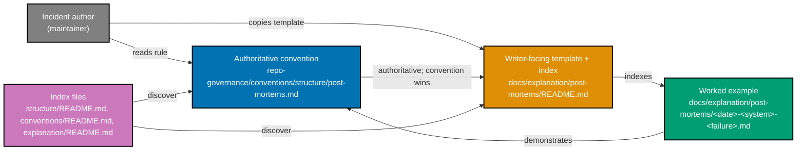

# Technical Documentation — Adopt Post-Mortem Convention

## Architecture: Dual-File Design

The convention mirrors `ose-infra`'s split between an authoritative governance rule and a
writer-facing working surface. This separates the **normative rule** (rarely changes, governed,
validated by `repo-rules-checker`) from the **ergonomic surface** (copy-paste template + growing
index, lives in the Diátaxis explanation tier).

**Why dual-file** (preserved from ose-infra rationale): the governance rule belongs in
`repo-governance/` where `repo-rules-checker` governs it; the copy-paste template and index belong
in `docs/explanation/post-mortems/` because post-mortems are understanding-oriented (Diátaxis
explanation tier — they answer "why did this happen?"). The convention is authoritative; the docs
README is the working surface; when the two disagree, the convention wins.

## Design Decisions

### Decision 1: Keep structure, reframe examples (RESOLVED — macro decision)

Adopt ose-infra's section list, severity scale, blameless rules, action-item table, and
`doc_status` lifecycle verbatim in **shape**, but replace every infrastructure example with a
software example. Rationale: the value of the convention is its structure and discipline, which are
domain-independent; only the illustrative content must match `ose-public`'s software reality.

### Decision 2: Real worked example, not fiction (RESOLVED — macro decision)

Ground the worked example in the genuine `.amazonq/` Prettier parity-guard incident already
documented in this repo's operational memory and CLAUDE.md. [Repo-grounded: CLAUDE.md notes
"Prettier breaks generated byte-equality guards — add emitter-generated files (e.g. `.amazonq/`)
to `.prettierignore` or pre-commit prettier trips the parity guard."] Rationale: a real-pattern
example earns trust and demonstrates the blameless, software-flavored style authentically.

### Decision 3: Frontmatter follows ose-public sibling norms (RESOLVED — delta)

Match sibling structure-convention frontmatter (e.g., `diataxis-framework.md`): `title`,
`description`, `category: explanation`, `subcategory: conventions`, `tags:`, and `created: YYYY-MM-DD`.
[Repo-grounded: verified `diataxis-framework.md` frontmatter shape.] Do **not** carry ose-infra's
exact tag list blindly. `doc_status` is a document-status field (not a date), so it does not
conflict with `no-date-metadata.md`; it appears on post-mortem documents, while the convention file
itself follows the sibling-convention frontmatter shape (no `doc_status`). The worked example uses
the post-mortem frontmatter shape including `doc_status` and a `created:` date.

## ose-infra to ose-public Adaptation Map

| Dimension                | ose-infra (source)                                                      | ose-public (target — this plan)                                                                                                                   |
| ------------------------ | ----------------------------------------------------------------------- | ------------------------------------------------------------------------------------------------------------------------------------------------- |
| Domain framing           | On-premise infrastructure (Proxmox, Tailscale, dual-WAN)                | Software platform (Nx monorepo: Next.js on Vercel, Rust/Go/F# CLIs+backends, GitHub Actions + Nx Cloud)                                           |
| Incident examples        | Tailscale outages, dual-WAN egress flap, host-down                      | CI/CD pipeline failures, Vercel site outages, dependency-bump regressions, coverage regressions, generated-artifact/byte-equality guard breakages |
| No-secrets reference     | `repo-governance/conventions/security/no-secrets-in-committed-files.md` | `repo-governance/conventions/security/no-secrets-in-git.md` [Repo-grounded — verified exists]                                                     |
| Secret placeholder types | tailnet IP, tailnet name, LAN subnet, SSH key, API token                | API token/key, deploy hook URL, CI secret, connection string (generic software placeholders)                                                      |
| Severity scale           | Sev-1..Sev-4 (Critical/Major/Moderate/Minor)                            | **Identical** — kept verbatim in shape                                                                                                            |
| Blameless rules          | "second story", no human-error root cause, no buck-passing              | **Identical** — kept verbatim in shape                                                                                                            |
| Action-item table        | `# / Action / Owner / Priority / Ticket / Status`                       | **Identical** — kept verbatim in shape                                                                                                            |
| doc_status lifecycle     | draft to reviewed to closed                                             | **Identical** — kept verbatim in shape                                                                                                            |
| Owner vocabulary         | "Operator", "Maintainer"                                                | "Maintainer" (solo-maintainer repo)                                                                                                               |
| Timezone                 | WIB UTC+7                                                               | **Identical** — WIB UTC+7 [Repo-grounded: `timestamp.md`]                                                                                         |
| Diagram palette          | #0173B2 #DE8F05 #029E73 #CC78BC #CA9161 #808080                         | **Identical** — same WCAG AA palette                                                                                                              |
| Diátaxis tier            | explanation                                                             | **Identical** — explanation                                                                                                                       |

## Referenced ose-public Files (all verified to exist)

[All paths below verified present via `test -f` at authoring time — `[Repo-grounded]`.]

- `repo-governance/conventions/structure/diataxis-framework.md`
- `repo-governance/conventions/structure/plans.md`
- `repo-governance/conventions/formatting/diagrams.md`
- `repo-governance/conventions/formatting/color-accessibility.md`
- `repo-governance/conventions/formatting/timestamp.md`
- `repo-governance/conventions/security/no-secrets-in-git.md`
- `repo-governance/principles/content/documentation-first.md`
- `repo-governance/principles/general/root-cause-orientation.md`
- `repo-governance/principles/general/deliberate-problem-solving.md`
- `repo-governance/principles/software-engineering/explicit-over-implicit.md`
- `repo-governance/conventions/structure/README.md` (index to update)
- `repo-governance/conventions/README.md` (index to update)
- `docs/explanation/README.md` (index to update)
- `repo-governance/workflows/repo/repo-rules-quality-gate.md` (validation workflow)

## New Files Created by This Plan

- `repo-governance/conventions/structure/post-mortems.md` — _New file_
- `docs/explanation/post-mortems/README.md` — _New file_ (new directory `docs/explanation/post-mortems/`)
- `docs/explanation/post-mortems/<incident-date>-amazonq-prettier-parity-guard-break.md` — _New file_
  (exact incident-date chosen at authoring time; software-flavored worked example)

## Worked-Example Incident Summary (for the docs-maker authoring step)

- **System**: cross-vendor agent-binding emitter (`rhino-cli agents emit-bindings` / the
  `.amazonq/` generated artifacts). [Repo-grounded: CLAUDE.md documents the `.amazonq/` bridge and
  the emitter.]
- **Trigger**: Prettier (pre-commit / format step) reformatted generated files under `.amazonq/`,
  changing their bytes.
- **Root cause**: emitter-generated artifacts were not excluded from Prettier, so a generic
  formatting step rewrote bytes that a byte-equality parity guard expected to remain emitter-exact.
- **Symptom**: the cross-vendor parity / byte-equality guard failed in CI / pre-commit.
- **Applied fix**: add emitter-generated files (e.g. `.amazonq/**`) to `.prettierignore`.
- **Severity**: software-incident classification on the adopted scale (a CI/pre-commit gate break,
  no data loss, fast workaround — classify as Sev-3 Moderate; the authoring agent confirms tier
  against the scale text).
- **No secrets**: this incident involves none; still reference `no-secrets-in-git.md` and use
  placeholders for any token if one were to appear.

## Testing Strategy

This plan ships documentation/governance, not code, so there is no unit/integration/E2E test suite.
The Gherkin acceptance criteria in `prd.md` are validated by:

| Acceptance criterion family                  | Validation mechanism                                                                    |
| -------------------------------------------- | --------------------------------------------------------------------------------------- |
| Convention sections + severity scale present | `repo-rules-quality-gate` (strict) + manual section-presence check (delivery gate)      |
| Software (not infra) framing                 | `grep` scan for forbidden infra terms; `repo-rules-quality-gate` semantic review        |
| Dual structure + cross-links                 | Link validation (`npm run lint:md` link rules) + manual cross-link check                |
| Worked example naming + sections + diagram   | Manual filename/section check + Mermaid palette check against approved hex codes        |
| Index files updated                          | `grep` for the new entry in each of the three index files                               |
| Governance consistency                       | `repo-rules-quality-gate` strict, double-zero                                           |
| Harness-neutrality                           | `repo-rules-quality-gate` vendor-audit category (no vendor terms outside binding heads) |

## Rollback

All changes are additive new files plus index-entry additions. Rollback is `git revert` of the
delivery commits; no data migration, no schema change, no runtime impact.
