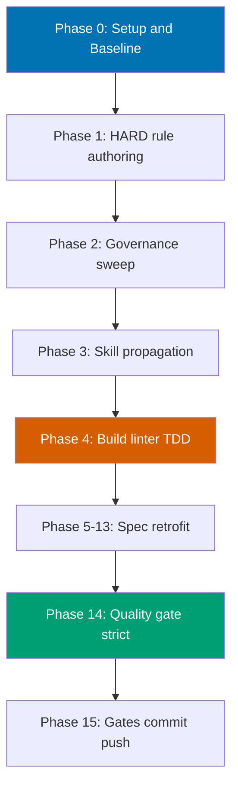

# Gherkin Step-Keyword Cardinality Rule

> Plan identifier: `gherkin-step-keyword-cardinality` — stage: `in-progress`.

## Context

The repository's Gherkin conventions today only **demonstrate** the canonical
single-`Given`/single-`When`/single-`Then` shape by example (the "Complete Syntax"
template in
[`repo-governance/development/infra/acceptance-criteria.md`](../../../repo-governance/development/infra/acceptance-criteria.md))
[Repo-grounded] but never state it as an explicit, enforceable rule. Authors and AI
agents are therefore free to write scenarios with multiple primary `When` or `Then`
keyword lines, which weakens the "one action / one behavior per scenario" norm and
makes the BDD-to-test mapping ambiguous.

This plan adds an **explicit HARD rule**: each `Scenario` uses exactly **one** primary
`Given`, **one** `When`, and **one** `Then` keyword line; every additional
precondition / action / outcome MUST be chained with `And` or `But`. `Background`
blocks and `Scenario Outline` `Examples` tables are explicitly exempt. The rule is
authored into the canonical convention, propagated across the governance surface (both
**with** and **without** `repo-rules-maker`), enforced by a new deterministic
`rhino-cli` audit category, and retrofitted into the real `specs/**/*.feature` files
that violate it.

## Scope

**In scope**:

- Author the HARD rule in
  [`repo-governance/development/infra/acceptance-criteria.md`](../../../repo-governance/development/infra/acceptance-criteria.md)
  and normalize its illustrative snippets to conform.
- Broad governance sweep (via `repo-rules-maker`) across all Gherkin-referencing
  `repo-governance/` docs and the `plan-maker` / `plan-checker` / `repo-rules-checker`
  agent prompts.
- Manual propagation (without `repo-rules-maker`) of the two skill packages
  `.claude/skills/plan-writing-gherkin-criteria/SKILL.md` and
  `.claude/skills/plan-creating-project-plans/SKILL.md`, then `npm run generate:bindings`.
- A new deterministic `rhino-cli` `repo-governance` audit category
  `gherkin-keyword-cardinality` (TDD-shaped Rust), wired into the audit orchestrator,
  the `repo-rules-quality-gate` preflight, and CI.
- Per-app/lib retrofit of violating `specs/**/*.feature` files **and** their
  Godog / cucumber-rs step definitions in lockstep.
- A `repo-rules-quality-gate` (strict) double-zero pass validating repo-wide consistency.

**Out of scope**:

- Changing the BDD-to-test mapping semantics beyond keyword cardinality.
- Rewriting scenarios for reasons other than keyword cardinality (no behavioral changes).
- Adding new feature files or new test coverage beyond what the retrofit requires.
- Any vendor-specific content in `repo-governance/` (harness-neutrality preserved).

## Approach Summary

The change is **purely internal** (governance + tooling). No external library or
version claims are involved, so web research was **skipped** — all factual claims in
this plan carry `[Repo-grounded]` or `[Judgment call]` confidence labels; there are no
`[Web-cited]` claims.

## Sibling Plans

This plan is part of a three-repo parity set created by the
[plan-multi-repo-parity-planning workflow](../../../repo-governance/workflows/plan/plan-multi-repo-parity-planning.md).
See the sibling plans for context (paths are repo-relative in each sibling repository):

- `ose-infra`: `plans/in-progress/gherkin-step-keyword-cardinality/README.md`
- `ose-primer`: `plans/in-progress/gherkin-step-keyword-cardinality/README.md`

The full cross-repo deviation matrix (13 rows, 4 deliberate deviations) lives in
[`tech-docs.md`](./tech-docs.md) §"Cross-Repo Parity: Deviation Matrix", and the
plain-language rationale is delivered to
`docs/explanation/gherkin-step-keyword-cardinality-parity-decisions.md` in each repo.

## Plan Documents

- [`brd.md`](./brd.md) — Business Requirements (WHY).
- [`prd.md`](./prd.md) — Product Requirements (WHAT) — user stories + Gherkin
  acceptance criteria (the criteria themselves obey the new HARD rule).
- [`tech-docs.md`](./tech-docs.md) — Architecture, design decisions, file impact.
- [`delivery.md`](./delivery.md) — Phased delivery checklist (the executable blueprint).

## Definition of Done

All delivery checklist items ticked; the new HARD rule is authored, propagated
(with and without `repo-rules-maker`), and enforced by a green deterministic linter;
all violating `.feature` files and their step definitions are retrofitted; the
`repo-rules-quality-gate` (strict) passes with double-zero; local quality gates
(`npx nx affected -t typecheck lint test:quick spec-coverage`) and post-push CI are
green; the plan is archived to `plans/done/`.
