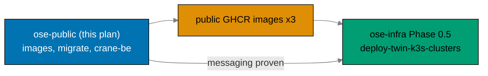

# Business Requirements: Bootstrap BE Messaging and Crane Media Service

## Deliverable Handoff At A Glance

## Business Goal

Deliver the application-side artifacts the `ose-infra` `deploy-twin-k3s-clusters` plan depends
on, so that the twin k3s clusters can be deployed with **real, working** application images
rather than placeholders. Specifically: stand up a shared media-processing service, wire
asynchronous messaging into both Rust backends, and produce the production images, migration
wiring, and publish pipeline the infra plan's Phase 0.5 enumerates as a dependency on
`ose-public`.

## Rationale and Pain Points

- **Blocked infra deployment** `[Repo-grounded]`: the `ose-infra` plan's Phase 0.5 cannot
  complete because no production Dockerfiles, run-on-boot migration wiring, or GHCR publish
  workflow exist for the backends, and `crane-be` has no code at all (the infra plan describes it
  as "deferred — no code exists yet"). This plan removes that block.
- **NATS provisioned but unproven**: the infra plan ships NATS JetStream per backend but the
  backends "do NOT consume it yet". Provisioned-but-unconsumed infrastructure is untested
  infrastructure. A walking-skeleton that publishes, consumes, and acks proves the provisioning
  works before real workloads depend on it.
- **No shared media capability**: PDF→Markdown logic exists only inside `apps/crane-cli/`
  `[Repo-grounded]` and cannot be reused by a service because Nx forbids app→app imports. A
  shared library unlocks reuse without duplicating domain logic.
- **First F# library, first messaging context**: the repo has no F# library and no messaging
  bounded context yet. Establishing both correctly now sets the pattern for future media ops and
  future async features.

## Affected Roles

This is a solo-maintainer repository; "roles" denote the hats the maintainer wears and the agents
that consume the artifacts. No sign-off ceremonies apply.

- **Backend maintainer hat**: owns the Rust messaging wiring and the F# service.
- **Platform/infra maintainer hat**: consumes the produced GHCR images and migration wiring in
  the `ose-infra` deployment.
- **Spec maintainer hat**: owns the new DDD spec sets and Gherkin features.
- **Consuming agents**: `swe-rust-dev`, `swe-fsharp-dev` (implementation), `repo-setup-manager`
  (Phase 0), `swe-e2e-dev` / integration verification, `ci-checker` / `ci-fixer` (CI gate).

## Business Success Criteria

All criteria are observable facts checkable by command or inspection — no fabricated KPIs.

- **Images exist and are public** (observable): `ghcr.io/wahidyankf/organiclever-be`,
  `ghcr.io/wahidyankf/ose-app-be`, and `ghcr.io/wahidyankf/crane-be` resolve to publicly
  pullable images after the publish workflow runs.
- **Infra dependency satisfied** (observable): production Dockerfiles for all three services and
  run-on-boot `sqlx::migrate!` wiring in both Rust backends exist in the tree, matching the
  artifact list the `ose-infra` Phase 0.5 enumerates.
- **Messaging proven, not assumed** (observable): the JetStream durable publish+consume+ack demo
  and the crane NATS request/reply path pass at the **e2e** level for each backend against a real
  NATS service in `docker-compose.e2e.yml` (NATS is network I/O and is kept out of integration per
  the strict Three-Level Testing Standard).
- **Media path works both ways** (observable): `crane-be` returns markdown for a sample PDF over
  both `POST /media/pdf-to-md` (HTTP) and the `crane.convert` NATS request/reply subject.
- **Three-level testing, Gherkin-everywhere, strict boundaries** (observable): `crane-be` passes
  `test:unit` (mocks, no I/O), `test:integration` (real adapter + filesystem, **no network**), and
  (via `crane-be-e2e`) `test:e2e` (real HTTP + real NATS), with all three levels consuming the
  shared Gherkin tree `specs/apps/crane/behavior/crane-be/gherkin/`. Both `apps/crane-be` and
  `apps/crane-be-e2e` pass `spec-coverage`. This satisfies the
  [Three-Level Testing Standard](../../../repo-governance/development/quality/three-level-testing-standard.md)
  including its "No Network in Integration Tests" rule.
- **Black-box e2e proven** (observable): `apps/crane-be-e2e/` exercises a running containerized
  `crane-be` over real HTTP (Playwright) and real NATS (`nats` client); the run passes. Each backend
  e2e runner additionally proves the crane NATS path over the wire through an HTTP endpoint.
- **No regression** (observable): `crane-cli`'s existing unit + integration tests stay green
  after the library extraction.
- **Drift guard clean** (observable): `rhino-cli env validate` passes with all new env vars
  registered in `env-contract.yaml` and annotated in each `.env.example`.

## Cost

This plan incurs **no vendor charges** — every cost surface it touches is free under current policy:

- **GHCR images** (observable): "GitHub Packages usage is free for public packages", and public
  packages do not count toward storage or data-transfer quotas
  `[Web-cited: GitHub Docs — About billing for GitHub Packages —
https://docs.github.com/en/billing/managing-billing-for-your-products/managing-billing-for-github-packages/about-billing-for-github-packages —
accessed 2026-06-11 — "GitHub Packages usage is free for public packages"]`. Phase 8 flips all
  three packages (`organiclever-be`, `ose-app-be`, `crane-be`) to public, so storage + egress cost
  nothing. (Private packages would consume the data-transfer quota — the public-visibility step is
  what guarantees zero cost.)
- **GitHub Actions** (the new `publish-images.yml` + existing CI): free on two grounds —
  `ose-public` is a public repo (free/unlimited GitHub-hosted minutes), and CI runs on the
  **self-hosted runner stack in `ose-infra`** (no GitHub-billed minutes at all). The only "cost" is
  the maintainer's already-running self-hosted compute.
- **Dependencies** are all free/open-source: `NATS.Net`, `nats` (NATS.js), `Giraffe`,
  `playwright-bdd`, `@playwright/test`, `PdfPig`, `TesseractOCR`, `TickSpec`. No paid SaaS, no
  metered API keys.
- **Deployment cost** (k3s runtime, NATS, ClusterIP) is owned by the downstream `ose-infra`
  `deploy-twin-k3s-clusters` plan and runs on self-hosted clusters — not a vendor invoice, and out
  of scope here.

## Non-Goals (Business Scope)

- Not delivering production deployment, cluster manifests, or networking — those belong to
  `ose-infra`.
- Not building a general media-processing product; the single PDF→Markdown op is a deliberate
  walking skeleton `[Judgment call]`.
- Not adding new end-user backend features.
- Not federating the two NATS servers; they remain independent per the infra topology.

## Risks and Mitigations

| Risk                                                                                      | Impact                                        | Mitigation                                                                                                                                                 |
| ----------------------------------------------------------------------------------------- | --------------------------------------------- | ---------------------------------------------------------------------------------------------------------------------------------------------------------- |
| NATS.Net version drifts inside the 60-day soak before execution                           | Path-B violation, blocked dependency          | Phase 0 re-confirms the exact Path-B-eligible 2.7.x version and date before any .NET NATS code is written `[Repo-grounded: dependency-bump-policy]`        |
| Library extraction breaks crane-cli tests                                                 | Regression in shipped CLI                     | Extract behind green tests; crane-cli unit + integration suites must stay green at the Phase 1 gate                                                        |
| Env drift guard fails on new vars                                                         | pre-push / CI blocked                         | Every new var registered in `env-contract.yaml` and `.env.example` in the same phase that introduces it                                                    |
| Agents touch real `.env*` files                                                           | Secrets guardrail violation                   | The autonomous path needs no real `.env*` — all test env comes from committed non-secret `docker-compose` files; agents only edit `.env.example`           |
| crane-be cannot reach both NATS servers (federation assumption)                           | Broken media async path                       | Design uses two independent connections + same queue group, confirmed by research; no federation assumed                                                   |
| GHCR package visibility defaults to private                                               | Infra cannot pull images                      | Package-visibility flip tagged `[HUMAN]` as an out-of-band GitHub setting                                                                                  |
| Same Gherkin scenario diverges across the three step layers                               | Silent behavioral gap                         | One Gherkin tree is the single contract; `spec-coverage` enforces every step is bound; integration/e2e steps stick to Gherkin exactly (no extras)          |
| crane-be e2e flakiness (HTTP + two NATS conns in one container)                           | Unreliable e2e gate                           | e2e runs against a docker-compose-started service with a healthcheck wait; `test:e2e` stays non-cacheable; retries configured in Playwright                |
| Standard says spec-coverage compulsory for e2e runners, yet existing e2e projects omit it | Inconsistent governance                       | crane-be-e2e adds the target; a follow-up `repo-rules-checker` pass reconciles the repo-wide standard-vs-practice gap (flagged, not silently ignored)      |
| Strict no-network integration leaves backend NATS only at e2e                             | Heavier e2e infra (backend + NATS + crane-be) | e2e compose brings up the full stack with a healthcheck gate; backend NATS proof is observable over HTTP so Playwright needs no broker client for backends |
