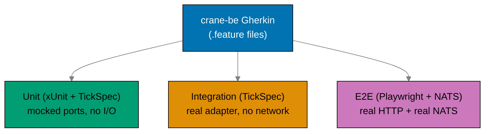
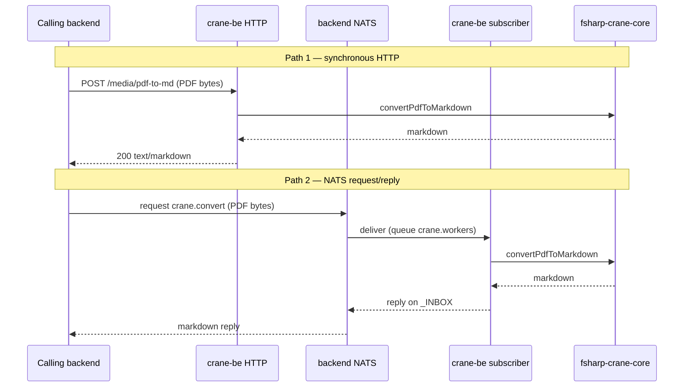
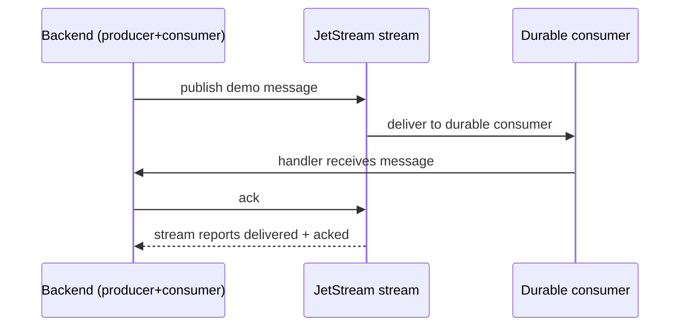

# Product Requirements: Bootstrap BE Messaging and Crane Media Service

## Product Overview

A walking-skeleton (infra-ready) bundle of three product capabilities:

1. A shared F# media Core library reused by the existing CLI and a new service.
2. A deployable F# media service (`crane-be`) exposing PDF→Markdown over HTTP and NATS.
3. Real NATS messaging in both Rust backends — service RPC over core NATS plus a JetStream
   durable demo that exercises the provisioned streams.

The product is "deployable by the infra plan" and "TDD-clean" rather than feature-rich; it
delivers exactly one media op and one demo per backend.

`crane-be` ships with the full mandatory testing pyramid — `test:unit`, `test:integration`, and
`test:e2e` (the last hosted in a new paired runner `crane-be-e2e`). Per the
[Three-Level Testing Standard](../../../repo-governance/development/quality/three-level-testing-standard.md),
**all three levels consume the same Gherkin specs**; only the step implementations differ (mocks →
real adapter/NATS → real HTTP via Playwright).



## Personas

This solo-maintainer repo's personas are the hats worn and the agents/services that consume the
output.

- **Backend maintainer** — wires messaging and the F# service; wants TDD-clean, drift-guard-clean
  code.
- **Infra operator (ose-infra)** — pulls the public GHCR images and deploys them; wants images
  that build, migrate on boot, and connect to NATS.
- **Calling backend service** — `organiclever-be` / `ose-app-be` acting as clients of `crane-be`
  over HTTP and NATS.
- **Media service (`crane-be`)** — subscribes to each backend's NATS and serves HTTP requests.
- **E2E runners (`crane-be-e2e`, `organiclever-be-e2e`, `ose-app-be-e2e`)** — Playwright-BDD
  black-box clients that drive a running service over real HTTP (and, for `crane-be-e2e`, real
  NATS), asserting the same Gherkin scenarios the unit and integration layers verify in-process.

## User Stories

- As the **backend maintainer**, I want the PDF→Markdown Core in a shared F# library so that both
  `crane-cli` and `crane-be` reuse it without app→app imports.
- As the **infra operator**, I want production Dockerfiles and a GHCR publish workflow so that the
  twin-cluster deployment can pull real images.
- As the **infra operator**, I want both Rust backends to run `sqlx::migrate!` on boot so that a
  fresh cluster database is schema-current without a manual step.
- As a **calling backend service**, I want to convert a PDF to markdown via both an HTTP call and
  a NATS request/reply so that I can choose sync or async integration.
- As the **backend maintainer**, I want each backend to publish to and consume from a JetStream
  durable stream so that the provisioned JetStream is proven working, not assumed.
- As the **backend maintainer**, I want every new env var registered in the drift guard so that
  pre-push and CI stay green.
- As the **backend maintainer**, I want `crane-be` to have unit, integration, and e2e tests that
  all consume the same Gherkin specs so that the service follows the Three-Level Testing Standard
  and no behavior is verified at only one boundary.
- As the **E2E runner**, I want to assert `crane-be`'s health and PDF→Markdown HTTP behavior
  against a real running service so that the deployable image is proven over the wire, not just
  in-process.

## Acceptance Criteria (Gherkin)

> Every scenario uses exactly one primary `Given`, one `When`, one `Then`; extras chain with
> `And`/`But`. These scenarios seed the first failing tests for the matching delivery phases.
>
> **Level tags**: `crane-be` scenarios carry `@unit`, `@integration`, and/or `@e2e` tags marking
> which test level(s) implement each scenario. Per the
> [Three-Level Testing Standard](../../../repo-governance/development/quality/three-level-testing-standard.md)
> the unit layer is a superset (it binds every scenario it can plus edge cases), and **integration
> introduces exactly one real dependency with NO network** — for `crane-be` that is the real
> PdfPig/Tesseract adapter reading a real PDF from the filesystem. **All NATS scenarios (real
> network) are therefore `@e2e`, not `@integration`** — they run against a running service with
> real NATS. This honors the standard's "No Network in Integration Tests" rule strictly. The
> Gherkin file is the single shared contract; `spec-coverage` enforces that every step is bound
> somewhere (F# steps for `@unit`/`@integration`; TypeScript steps in `crane-be-e2e` for `@e2e`).

The two media request paths `crane-be` exposes:



### Shared library extraction

```gherkin
Scenario: crane-cli consumes the extracted Core library and stays green
  Given the PDF-to-Markdown Core has been extracted to libs/fsharp-crane-core
  And apps/crane-cli references the library instead of its in-app Core
  When the crane-cli unit and integration test suites run
  Then all crane-cli tests pass
  And no app-to-app import exists between crane-cli and crane-be
```

### crane-be health

```gherkin
@unit @e2e
Scenario: crane-be reports healthy over HTTP
  Given the crane-be service is running on its configured port
  When a client sends GET to /health
  Then the response status is 200
  And the response body indicates the service is healthy
```

### Media PDF to Markdown over HTTP

```gherkin
@unit
Scenario: crane-be converts a PDF to markdown over HTTP using the fake adapter
  Given crane-be is configured with the fake media adapter
  When a client sends POST /media/pdf-to-md with sample PDF bytes
  Then the response status is 200
  And the response body contains the canned markdown output
```

```gherkin
@integration @e2e
Scenario: crane-be converts a real PDF to markdown over HTTP using the real adapter
  Given crane-be is configured with the real PdfPig/Tesseract adapter
  When a client sends POST /media/pdf-to-md with a real sample PDF
  Then the response status is 200
  And the response body contains markdown extracted from the PDF
```

```gherkin
@unit @e2e
Scenario: crane-be rejects an empty request body
  Given the crane-be service is running on its configured port
  When a client sends POST /media/pdf-to-md with an empty body
  Then the response status is 400
  And the response body indicates the PDF payload was missing
```

```gherkin
@unit @e2e
Scenario: crane-be rejects a non-PDF payload
  Given the crane-be service is running on its configured port
  When a client sends POST /media/pdf-to-md with bytes that are not a PDF
  Then the response status is 422
  And the response body indicates the payload could not be parsed as a PDF
```

```gherkin
@e2e
Scenario: crane-be returns markdown with the text/markdown content type
  Given the crane-be service is running on its configured port
  When a client sends POST /media/pdf-to-md with a real sample PDF
  Then the response status is 200
  And the response Content-Type is text/markdown
```

### Media PDF to Markdown over NATS request/reply

> NATS is real network I/O, so these are `@e2e` scenarios run against a running `crane-be` (the
> `crane-be-e2e` runner issues the requests via a NATS client). They are NOT integration-level.

```gherkin
@e2e
Scenario: crane-be answers a NATS core request/reply on crane.convert
  Given crane-be has subscribed to subject crane.convert on a backend NATS server
  When a backend publishes a request to crane.convert with sample PDF bytes
  Then crane-be replies on the auto _INBOX subject with markdown
  And the requesting backend receives the markdown reply
```

```gherkin
@e2e
Scenario: crane-be replies with an error envelope for an unparseable NATS payload
  Given crane-be has subscribed to subject crane.convert on a backend NATS server
  When a backend publishes a request to crane.convert with bytes that are not a PDF
  Then crane-be replies on the auto _INBOX subject with an error envelope
  And the error envelope names the parse failure
```

### NATS connect and health per backend

> Establishing a real NATS connection is network I/O, so the connect scenarios are `@e2e` (proven
> against a running backend + NATS stack). The missing/invalid-URL fail-fast is pure config logic
> and is additionally covered at `@unit` (no network).

```gherkin
@unit
Scenario: organiclever-be fails fast when its NATS URL is missing
  Given ORGANICLEVER_BE_NATS_URL is unset
  When organiclever-be reads its messaging configuration
  Then startup aborts with a clear missing-variable error
```

```gherkin
@e2e
Scenario: organiclever-be connects to its NATS server at startup
  Given ORGANICLEVER_BE_NATS_URL points to a running NATS server with JetStream enabled
  When organiclever-be starts up
  Then the NATS connection is established
  And the backend reports healthy after connecting
```

```gherkin
@unit
Scenario: ose-app-be fails fast when its NATS URL is missing
  Given OSE_APP_BE_NATS_URL is unset
  When ose-app-be reads its messaging configuration
  Then startup aborts with a clear missing-variable error
```

```gherkin
@e2e
Scenario: ose-app-be connects to its NATS server at startup
  Given OSE_APP_BE_NATS_URL points to a running NATS server with JetStream enabled
  When ose-app-be starts up
  Then the NATS connection is established
  And the backend reports healthy after connecting
```

### JetStream durable publish + consume + ack demo per backend

> JetStream is real network I/O, so these are `@e2e` scenarios. Each backend runs the demo at
> startup against a running JetStream and exposes the outcome on a status surface the e2e runner
> asserts over HTTP (no internal-state assertion required from outside the process).



```gherkin
@e2e
Scenario: organiclever-be publishes and durably consumes its demo subject with ack
  Given organiclever-be has a JetStream durable stream and consumer for its demo subject
  When organiclever-be publishes a demo message to that subject
  Then the durable consumer receives the message
  And the message is acknowledged
  And the messaging status surface reports the demo delivered and acked
```

```gherkin
@e2e
Scenario: ose-app-be publishes and durably consumes its demo subject with ack
  Given ose-app-be has a JetStream durable stream and consumer for its demo subject
  When ose-app-be publishes a demo message to that subject
  Then the durable consumer receives the message
  And the message is acknowledged
  And the messaging status surface reports the demo delivered and acked
```

### Backend messaging over the wire (e2e)

> Per the "Add backend messaging e2e" decision, each backend exposes an HTTP endpoint that drives
> the crane PDF→Markdown conversion via the NATS `crane.convert` request/reply path. The paired
> Playwright runner (`organiclever-be-e2e` / `ose-app-be-e2e`) asserts the full chain
> (HTTP → backend → NATS → crane-be → reply → HTTP) over the wire against a running stack.

```gherkin
@e2e
Scenario: organiclever-be converts a PDF via the crane NATS path over HTTP
  Given a running stack of organiclever-be, its NATS server, and crane-be
  When a client sends POST to the organiclever-be media-convert endpoint with a sample PDF
  Then the response status is 200
  And the response body contains markdown produced by crane-be
```

```gherkin
@e2e
Scenario: ose-app-be converts a PDF via the crane NATS path over HTTP
  Given a running stack of ose-app-be, its NATS server, and crane-be
  When a client sends POST to the ose-app-be media-convert endpoint with a sample PDF
  Then the response status is 200
  And the response body contains markdown produced by crane-be
```

### Shared single crane-be against two NATS servers

```gherkin
@e2e
Scenario: the single crane-be serves both backends over independent NATS connections
  Given crane-be has opened one NATS connection to each backend's NATS server
  And each subscription uses the same queue group crane.workers
  When each backend independently issues a crane.convert request
  Then each backend receives a markdown reply from crane-be
  And neither backend's request is delivered to the other backend's NATS server
```

### crane-be e2e (black-box over real HTTP)

> The `@e2e` scenarios run from `apps/crane-be-e2e/` against a running containerized `crane-be`
> started via `docker-compose.e2e.yml` (service + two NATS servers). HTTP scenarios use Playwright;
> the NATS request/reply, error-envelope, and dual-connection-isolation scenarios use a NATS client
> (`nats` npm package) inside the BDD step definitions. All `@e2e` scenarios consume the same
> Gherkin files as the unit and integration layers.

```gherkin
@e2e
Scenario: crane-be-e2e verifies health against the running service
  Given a containerized crane-be is running and reachable over HTTP
  When the e2e runner sends GET /health
  Then the response status is 200
  And the response body indicates the service is healthy
```

```gherkin
@e2e
Scenario: crane-be-e2e converts a real PDF end-to-end over HTTP
  Given a containerized crane-be is running and reachable over HTTP
  When the e2e runner sends POST /media/pdf-to-md with a real sample PDF
  Then the response status is 200
  And the response body contains markdown extracted from the PDF
```

### Env drift guard with new vars

```gherkin
Scenario: env drift guard passes with the new messaging and crane vars
  Given the new env vars are annotated in each app .env.example
  And the new env vars are registered in env-contract.yaml for each surface
  When rhino-cli env validate runs
  Then it reports no drift
  And the pre-push and CI env-validate checks pass
```

### Production images build

```gherkin
Scenario: production Dockerfiles build for all three services
  Given production Dockerfiles exist for organiclever-be, ose-app-be, and crane-be
  When each production image is built locally
  Then each image builds successfully
  And each image is distinct from the existing Dockerfile.integration
```

### Run-on-boot migrations

```gherkin
Scenario: a Rust backend runs sqlx migrations on boot
  Given a backend production image starts against an empty database
  When the backend process boots
  Then sqlx::migrate! applies all pending migrations before serving requests
  And the backend reports healthy after migrations complete
```

### GHCR publish

```gherkin
Scenario: the affected-aware GHCR workflow publishes only changed images
  Given the GHCR publish workflow is triggered by a push to main
  When only crane-be source changed in that push
  Then the workflow builds and publishes the crane-be image
  And it does not republish unchanged backend images
```

## Product Scope

### In Scope (Product Features)

- Shared F# media Core library and crane-cli migration to it.
- `crane-be` service: `/health`, `POST /media/pdf-to-md`, NATS `crane.convert` request/reply, fake
  - real adapters.
- `crane-be` three-level tests: `test:unit` (xUnit + TickSpec, mocked ports, no I/O),
  `test:integration` (TickSpec, real PdfPig/Tesseract adapter + filesystem, NO network), all
  consuming the shared Gherkin tree.
- `crane-be-e2e` runner: a new Playwright-BDD project running the `@e2e` Gherkin against a
  containerized `crane-be` — HTTP via Playwright and NATS request/reply via a `nats` client; owns
  its own `spec-coverage` target.
- Both backends: NATS client, HTTP + NATS clients to `crane-be`, JetStream durable demo, plus an
  HTTP media-convert endpoint that drives the crane NATS path; backend messaging is proven at
  `@e2e` in the paired `organiclever-be-e2e` / `ose-app-be-e2e` runners (NATS stays out of
  integration).
- Production Dockerfiles (x3), run-on-boot migrations (x2), affected-aware GHCR publish workflow.
- Spec sets and Gherkin features for the new messaging context and `crane-be` (behavior surface +
  `components/be/`).
- New env vars and drift-guard registration.

### Out of Scope (Product Features)

- Additional media operations beyond PDF→Markdown.
- Authentication/authorization on `crane-be` (internal ClusterIP only).
- Cross-cluster or federated NATS.
- Frontend or web-app changes.
- Production deployment manifests (owned by `ose-infra`).

## Product Risks

- **Adapter parity**: the real adapter must produce markdown comparable to `crane-cli`'s existing
  PDF path; mitigated by reusing the same PdfPig/Tesseract logic via the shared library.
- **NATS test flakiness**: the JetStream and request/reply `@e2e` scenarios depend on a real NATS
  container; mitigated by keeping `test:e2e` non-cacheable and gating the runner behind a `/health`
  healthcheck wait (NATS is exercised at e2e only, never at the integration level).
- **Queue-group semantics**: same queue group on two servers must not cross-deliver; mitigated by
  the two-independent-connections design and an explicit isolation scenario above.
