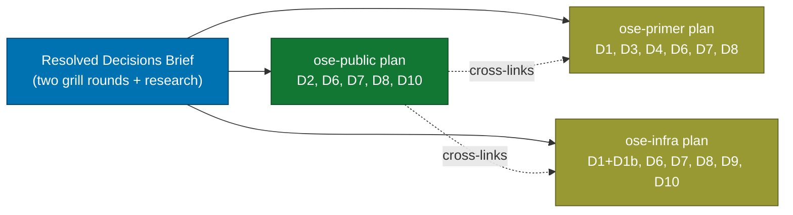

# lint-safety-parity (ose-public)

> Status: In Progress (planning stage — this is a PLANNING-ONLY plan; the terminal
> deliverable is this validated five-document plan, not an executed config change).

## Context

`ose-public`, `ose-primer`, and `ose-infra` are three independent sibling repositories that
share a scaffolding layer (governance, CI harness, lint configs). Their linting strictness and
unsafe-code posture have **drifted** apart over time. This plan is the `ose-public` member of a
three-repo parity effort that brings linting/rules strictness and unsafe-Rust posture to an
**equal** standard across all three siblings, produced via the `plan-multi-repo-parity-planning`
workflow.

This plan covers **only the `ose-public`-specific work**. The two sibling plans (one per other
repo) are cross-linked under [Sibling Plans](#sibling-plans).

## Scope

### In scope (ose-public dimensions)

`ose-public` executes the following dimensions from the shared deviation matrix (full matrix with
per-row resolutions lives in [`tech-docs.md`](./tech-docs.md#resolved-deviation-matrix-verbatim)):

- **D2 — F# strict stack** (LARGEST item): align all F# projects UP to the primer F# standard —
  `TreatWarningsAsErrors`, G-Research.FSharp.Analyzers (version-pinned), `fantomas --check` format
  gate. `ose-public` has **8 `.fsproj` files** `[Repo-grounded]` across `crane-be`, `crane-cli`,
  and `fsharp-crane-core`. Budget per-project latent-warning cleanup before flipping the gate on
  (clean-then-gate).
- **D6 — Dockerfile lint (hadolint)**: add `.hadolint.yaml` + CI gate + local hook.
- **D7 — Shell lint (shellcheck)**: add `.shellcheckrc` + CI gate + local hook.
- **D8 — CI YAML lint (actionlint)**: add actionlint CI gate + local hook.
- **D10 — Remove dead `.golangci.yml`**: `ose-public` has no active Go (Go lives only in
  `archived/`) `[Repo-grounded]`, so the root `.golangci.yml` is dead config — remove it.

### Out of scope (not applicable to ose-public)

- **D1 / D1b — Rust `forbid(unsafe_code)` + `[lints]` standard**: `ose-public` is **already
  compliant** — its Rust crates are the **reference standard** the siblings align to (verified:
  `apps/rhino-cli/Cargo.toml` already sets `unsafe_code = "forbid"` + pedantic `[lints]`)
  `[Repo-grounded]`. Documented as the reference, not executed.
- **D3 — C# strict baseline**: no C# projects in `ose-public`.
- **D4 — Python strict**: no Python projects in `ose-public`.
- **D5 — TS DDD import-boundaries**: **DROPPED** from this whole effort (too language-divergent;
  deferred to a future dedicated plan). The rationale doc documents the deferral + exemption
  philosophy.
- **D9 — Terraform + Ansible/YAML lint**: no IaC (`.tf`/ansible) in `ose-public`; infra-only.

## Approach Summary

**Rollout policy: clean-then-gate.** Each new lint gate (D6/D7/D8) and the F# strict stack (D2)
is sequenced as a TDD-shaped cycle: the **RED** state is "the gate fails on the existing
violation backlog", **GREEN** is cleaning up the violations, and the **REFACTOR/flip** is wiring
the gate ON in both CI (`pr-quality-gate.yml`) and the local hooks (`.husky/pre-commit` /
`.husky/pre-push`). This prevents the first CI/hook run from breaking on a pre-existing backlog.

**Gating policy.** New linters gate at the **error-threshold = warning-and-above** in BOTH CI and
local hooks (matching how markdown/prettier are already gated): `shellcheck --severity=warning`,
`hadolint --failure-threshold warning`, `actionlint` (non-zero on any finding).

## Document Map

| Document                         | Purpose                                                           |
| -------------------------------- | ----------------------------------------------------------------- |
| [`brd.md`](./brd.md)             | WHY — business rationale, impact, success metrics, risks          |
| [`prd.md`](./prd.md)             | WHAT — personas, user stories, Gherkin acceptance criteria        |
| [`tech-docs.md`](./tech-docs.md) | HOW — deviation matrix (verbatim), per-dimension configs, sources |
| [`delivery.md`](./delivery.md)   | DO — phased, TDD-shaped, gated delivery checklist                 |

## Sibling Plans

This plan is one of three in the `lint-safety-parity` parity set. Each sibling plan lives at the
same relative path in its own repository:

- **ose-public** (this plan): `plans/in-progress/lint-safety-parity/README.md`
- **ose-primer**: [`plans/in-progress/lint-safety-parity/README.md`](https://github.com/wahidyankf/ose-primer/blob/main/plans/in-progress/lint-safety-parity/README.md)
  — covers D1 (`crud-be-rust-axum`), D3 (C#), D4 (Python), D6, D7, D8; keeps golangci (active Go);
  primer is the **F# reference** (no D2 work).
- **ose-infra**: `plans/in-progress/lint-safety-parity/README.md` (private repo — not publicly
  linkable) — covers D1 + D1b (`coralpolyp-be` + test refactor), D6, D7, D8, D9 (Terraform +
  Ansible + yamllint, infra-only LARGEST item), D10 (remove dead golangci).

> **Note**: `ose-infra` is a private repository; its plan is referenced by relative path only.

## Delivery Mode

**main-to-main** — this plan and its rationale/governance edits are pushed directly to
`ose-public`'s `origin main` (no PR). See [`delivery.md`](./delivery.md#delivery-mode) for the
note. `ose-public` is not bound by the ose-primer Sync Convention's draft-PR invariant (that
applies to the primer plan, recorded as deviation M1 in the primer plan — not here).
