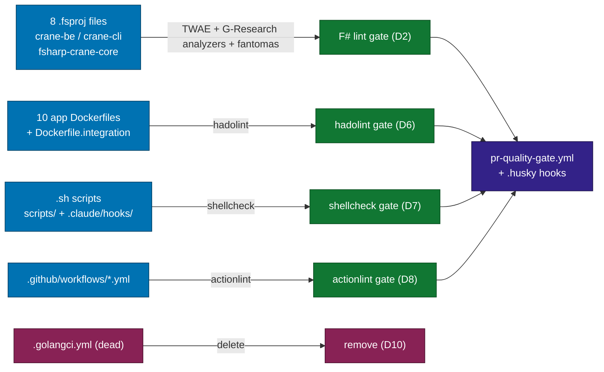
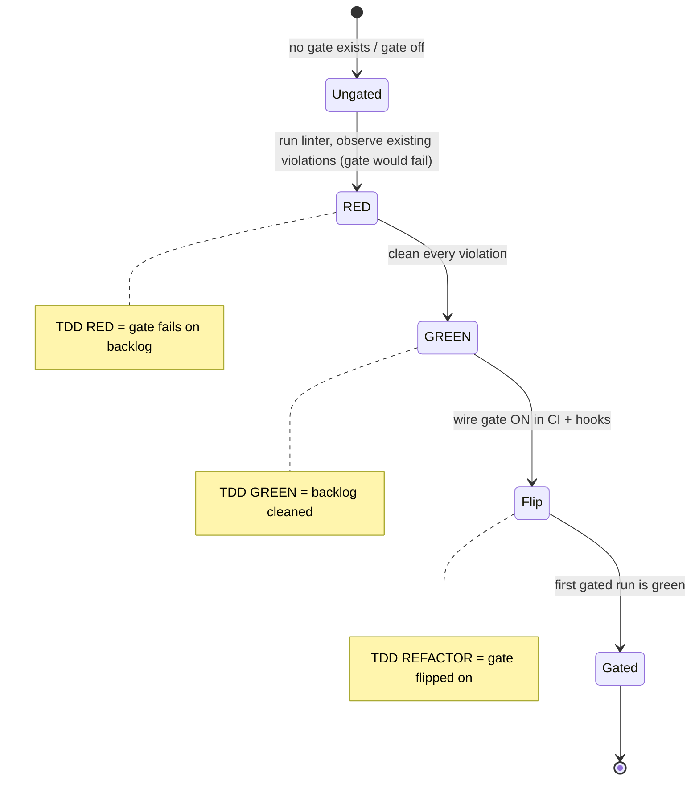
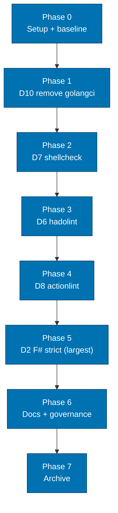

# Technical Documentation — lint-safety-parity (ose-public)

## Architecture Overview

The change touches four surfaces, each gated identically in CI and local hooks:

### Clean-then-gate state machine (applies to D2/D6/D7/D8)

### Delivery phase flow

> Ordering rationale: D10 (delete) and D7 (smallest surface — 14 shell scripts) are the cheapest,
> lowest-risk wins first; D2 (8 `.fsproj`, latent-warning cleanup) is the largest and is sequenced
> last among the code dimensions so its backlog does not block the quick wins.

## Resolved Deviation Matrix (VERBATIM)

The following matrix is reproduced **verbatim** from the resolved-decisions brief
(`local-temp/lint-safety-parity-decisions.md`). The **"ose-public executes?"** column marks which
rows this repo's plan actually carries out; the rest are documented for parity context.

| #      | Dimension                                                   | Resolution                                                                                                                                                                                                                                                 | Which repos do work                                                                          | ose-public executes?                   |
| ------ | ----------------------------------------------------------- | ---------------------------------------------------------------------------------------------------------------------------------------------------------------------------------------------------------------------------------------------------------- | -------------------------------------------------------------------------------------------- | -------------------------------------- |
| D1     | Rust `forbid(unsafe_code)` + full public `[lints]` standard | Align ALL Rust crates to public's verbatim standard                                                                                                                                                                                                        | primer: `crud-be-rust-axum`; infra: `coralpolyp-be`. public = reference (already compliant). | **NO** — public IS the reference       |
| D1b    | Rust 2024 `env::set_var`/`remove_var` unsafe in tests       | Refactor tests to inject `Config` directly (no process-env mutation) → enables `forbid`                                                                                                                                                                    | infra: `coralpolyp-be/src/config.rs` test module                                             | **NO** — infra only                    |
| D2     | F# strict stack                                             | Align public F# UP to primer's standard                                                                                                                                                                                                                    | public: all 11 F# projects. primer = reference (already strong).                             | **YES** — largest item                 |
| D3     | C# strict baseline                                          | Add full strict gate                                                                                                                                                                                                                                       | primer: 2 C# projects                                                                        | **NO** — no C# in public               |
| D4     | Python strict                                               | Swap pyright→basedpyright strict + expand ruff                                                                                                                                                                                                             | primer: 1 Python project                                                                     | **NO** — no Python in public           |
| ~~D5~~ | ~~TS DDD import-boundaries~~                                | **DROPPED** from this effort — too language-divergent; deferred to a dedicated future plan. Document the deferral + exemption philosophy (DDD enforcement targets business-domain backends only; demo/content/frontend apps exempt) in each rationale doc. | none                                                                                         | **NO** — dropped (deferral documented) |
| D6     | Dockerfile lint (hadolint)                                  | Add to all 3 repos                                                                                                                                                                                                                                         | all 3                                                                                        | **YES**                                |
| D7     | Shell lint (shellcheck)                                     | Add to all 3 repos                                                                                                                                                                                                                                         | all 3                                                                                        | **YES**                                |
| D8     | CI YAML lint (actionlint)                                   | Add to all 3 repos                                                                                                                                                                                                                                         | all 3                                                                                        | **YES**                                |
| D9     | Terraform + Ansible/YAML lint                               | Add (tflint + `terraform fmt -check` + `terraform validate`; ansible-lint production+strict; yamllint)                                                                                                                                                     | infra ONLY (only repo with `.tf`/ansible)                                                    | **NO** — no IaC in public              |
| D10    | Dead `.golangci.yml` (no active Go)                         | Remove from public + infra; KEEP primer's (has active Go)                                                                                                                                                                                                  | public, infra remove; primer keeps                                                           | **YES** — remove                       |

> **Discrepancy note (D2 project count)**: the brief states "all 11 F# projects". A
> `[Repo-grounded]` survey of the current `ose-public` commit finds **8 `.fsproj` files**, not 11:
> `apps/crane-be/{crane-be,tests/unit/crane-be-unit-tests,tests/integration/crane-be-integration-tests}.fsproj`,
> `apps/crane-cli/{crane-cli,tests/unit/crane-cli-unit-tests,tests/integration/crane-cli-integration-tests}.fsproj`,
> `libs/fsharp-crane-core/{fsharp-crane-core,tests/unit/fsharp-crane-core-unit-tests}.fsproj`.
> The plan executes against the **8 actually-present** files. The "11" figure is treated as a
> stale estimate; the delivery checklist enumerates all 8 explicitly.

## Repo-Specific Work Scope (ose-public)

Reproduced from the brief's "Repo-specific work scope":

> **ose-public**: D2 (F# projects — LARGEST item), D6, D7, D8, D10 (remove). NOT D1 work (already
> compliant — public is the Rust reference; document as such). NOT D3/D4 (no C#/Python). NOT D9
> (no IaC). NOT D5 (dropped).

### D1 / D1b — Documented reference, not executed

`ose-public` is the **Rust reference standard** the siblings align to. Verified `[Repo-grounded]`:
`apps/rhino-cli/Cargo.toml` already declares `[lints.rust] unsafe_code = "forbid"` plus a pedantic
`[lints.clippy]` block with documented allows. No D1/D1b work is performed in `ose-public`.

## Per-Dimension Concrete Strict Configs

> Configs below are reproduced from the resolved-decisions brief; research sources are cited per
> dimension. Where the brief and the current repo state differ, the repo state governs and the
> divergence is noted.

### D2 — F# strict stack (target standard = primer's existing stack)

Current `ose-public` F# `lint` target (per `apps/crane-be/project.json`) already runs
`fantomas --check` + `dotnet fsharplint` `[Repo-grounded]`. The strict stack ADDS:

- `<TreatWarningsAsErrors>true</TreatWarningsAsErrors>` in every `.fsproj`; requires .NET SDK ≥ 8
  (older SDKs ignore TWAE in F# — dotnet/sdk#9767). `ose-public` targets `net10.0`
  `[Repo-grounded]` (`apps/crane-be/crane-be.fsproj`), so TWAE is honored.
- **G-Research.FSharp.Analyzers**, with the version **PINNED** (e.g. `0.17.0`) to avoid silent
  rule additions breaking TWAE builds, plus a `dotnet fsharp-analyzers` CI invocation.
- `dotnet fantomas --check` format gate (already present — keep).
- public work spans all F# projects → plan MUST budget cleanup of latent warnings across all of
  them before flipping TWAE on (clean-then-gate).
- **Source**: g-research.github.io/fsharp-analyzers; Ionide FSharp.Analyzers.SDK CI docs;
  dotnet/sdk#9767. Repo-local: `docs/explanation/software-engineering/programming-languages/rust/code-quality-standards.md`
  is the Rust analogue precedent for "strict + documented allows".

> **Implementation note**: there is **no** `Directory.Build.props` in `ose-public`
> `[Repo-grounded]`, so TWAE + the analyzer `PackageReference` must be added to each of the 8
> `.fsproj` files individually (or a new shared `Directory.Build.props` introduced as part of D2 —
> a design choice the executor records; the delivery checklist defaults to per-`.fsproj` edits and
> notes the shared-props alternative).

### D6 — Dockerfile (hadolint, all 3 repos)

- `.hadolint.yaml` with `failure-threshold: warning`, `trustedRegistries: [docker.io, ghcr.io]`,
  justified per-rule `ignore` (e.g. DL3008 for dev images).
- CI: `hadolint --failure-threshold warning <Dockerfile>` + local hook.
- `ose-public` Dockerfile surface `[Repo-grounded]`: 10 app Dockerfiles under `apps/*/` (incl.
  `Dockerfile.integration` for `organiclever-be` and `ose-app-be`). `infra/dev/**` and
  `archived/**` Dockerfiles exist; the executor decides scope (recommend: gate `apps/**`, optionally
  `infra/dev/**`; exclude `archived/**`).
- **Source**: github.com/hadolint/hadolint.

### D7 — Shell (shellcheck, all 3 repos)

- `.shellcheckrc` (`shell=bash`, `external-sources=true`, justified disables).
- CI + hook: `shellcheck --severity=warning <scripts>`.
- `ose-public` shell surface `[Repo-grounded]`: 14 `.sh` files across `scripts/`, `.claude/hooks/`,
  and `apps/rhino-cli/scripts/`. Exclude vendored/generated (`.husky/_/husky.sh`) and `archived/**`.
- **Source**: github.com/koalaman/shellcheck man page.

### D8 — GitHub Actions (actionlint, all 3 repos)

- actionlint in CI + local hook; optional `.github/actionlint.yaml` for self-hosted runner labels
  (relevant to infra's self-hosted runners) + config-variables. `ose-public` uses GitHub-hosted
  runners (`runs-on: ubuntu-latest`) `[Repo-grounded]`, so the runner-label config is optional here.
- `ose-public` workflow surface `[Repo-grounded]`: 22 files under `.github/workflows/*.yml`.
- **Source**: github.com/rhysd/actionlint.

### D10 — Dead golangci

- Remove `.golangci.yml` from public (Go only in `archived/`) and infra (no go.mod). Keep
  primer's (has active go.mod). Record removal rationale.
- `ose-public` verification `[Repo-grounded]`: no `go.mod` exists outside `archived/`; the apps
  formerly described as "Go CLIs" in `AGENTS.md` (`ayokoding-cli`, `ose-cli`) are now Rust
  (`Cargo.toml` present). The root `.golangci.yml` is therefore dead config.

> **Side observation (out of this plan's scope, flag for follow-up)**: `AGENTS.md` still describes
> `ayokoding-cli` and `ose-cli` as "Go CLI" — they are Rust now. Recorded as a doc-accuracy nit;
> not fixed here.

## Gating Policy (from brief)

- Error-threshold in BOTH CI quality-gate AND local pre-commit/pre-push hooks (matching how
  markdown/prettier are already gated).
- "Error threshold" operationally = fail on warning-and-above: shellcheck `--severity=warning`,
  hadolint `failure-threshold: warning`, actionlint non-zero on any finding, F# `TreatWarningsAsErrors`.

## CI + Hook Wiring (current state → target)

- **CI**: `.github/workflows/pr-quality-gate.yml` `[Repo-grounded]` has per-language jobs
  (`typescript`, `golang`, `dotnet`, `rust`, `markdown`, `naming`, `specs-gate`) gated through a
  final `quality-gate` aggregator job. The new D6/D7/D8 gates are added as **new jobs** (e.g.
  `dockerfile`, `shell`, `actions`) and registered in the `quality-gate` `needs:` list +
  failure-check loop. The F# (D2) TWAE/analyzer change rides the existing `dotnet` job.
- **Local hooks** `[Repo-grounded]`: `.husky/pre-commit` runs `rhino-cli git pre-commit`;
  `.husky/pre-push` runs `nx affected -t typecheck lint test:quick spec-coverage ...`. New gates
  hook in as additional pre-commit/pre-push invocations (the executor chooses pre-commit vs
  pre-push per gate cost; recommend hadolint/shellcheck/actionlint at pre-commit on changed files,
  matching markdown/prettier).
- **Nx targets**: new lint targets (`lint:dockerfile`, `lint:shell`, `lint:actions`, or a
  workspace-level target) are added consistent with the existing `nx.json` `lint` targetDefault.
  Exact target names/placement are an execution decision; the delivery checklist names candidate
  targets and requires the executor to confirm against `nx.json` before wiring.

## Dependencies / Tooling

| Tool                         | Purpose | Notes                                                            |
| ---------------------------- | ------- | ---------------------------------------------------------------- |
| `hadolint`                   | D6      | Install in CI (action or binary); local via `npm run doctor` add |
| `shellcheck`                 | D7      | Install in CI; local via doctor                                  |
| `actionlint`                 | D8      | Install in CI; local via doctor                                  |
| G-Research.FSharp.Analyzers  | D2      | Pinned `PackageReference`; `dotnet fsharp-analyzers` CLI         |
| .NET SDK ≥ 8 (repo on net10) | D2      | Required for F# TWAE to be honored (dotnet/sdk#9767)             |

> Tool installation wiring (CI setup actions + `npm run doctor` entries) is an execution concern;
> the delivery checklist includes steps to add each tool to the toolchain converger.

## Research Sources (cited from brief — M4 web-research-maker findings)

- **D2 F#**: g-research.github.io/fsharp-analyzers; Ionide FSharp.Analyzers.SDK CI docs;
  dotnet/sdk#9767 (TWAE-in-F# SDK behavior). `[Web-cited]` (per brief's M4 research record)
  - Access date: 2026-06-12
  - g-research excerpt: "A curated set of Ionide SDK analyzers for F#. These are based on
    real-world production scenarios encountered within G-Research."
  - dotnet/sdk#9767 excerpt: "TreatWarningsAsErrors option is not respected in F# projects
    [in SDK < 8.0]" — confirmed fixed in .NET SDK ≥ 8; repo targets net10 (satisfies this).
- **D6 hadolint**: github.com/hadolint/hadolint. `[Web-cited]`
  - Access date: 2026-06-12
  - Excerpt: "A smarter Dockerfile linter that helps you build best practice Docker images.
    `--failure-threshold`: Exit with failure code only when rules with a severity equal to or
    above THRESHOLD are violated (error|warning|info|style|ignore|none)."
- **D7 shellcheck**: github.com/koalaman/shellcheck man page. `[Web-cited]`
  - Access date: 2026-06-12
  - Excerpt: "ShellCheck is a GPLv3 tool that gives warnings and suggestions for bash/sh shell
    scripts. `--severity=warning`: Optionally only show errors and warnings."
- **D8 actionlint**: github.com/rhysd/actionlint. `[Web-cited]`
  - Access date: 2026-06-12
  - Excerpt: "A static checker for GitHub Actions workflow files. Detects errors in GitHub
    Actions workflow YAML files before execution."
- **Rust reference (D1 context)**: Rust Edition Guide 2024 "Newly unsafe functions"; Clippy
  configuration book; repo's `docs/explanation/software-engineering/programming-languages/rust/code-quality-standards.md`.
  `[Web-cited]` / `[Repo-grounded]`

> All external claims above were resolved by `web-research-maker` during the orchestrator's two
> grill rounds (brief decision M4: "research DONE"). They are reproduced here as the cited source
> set; execution should re-verify tool flag syntax via `<tool> --help` before wiring.

## Rollback

- Each gate flips on independently and is a single commit; reverting one gate's flip-on commit
  removes that gate without touching the others.
- Cleanup commits (GREEN) are pure code/script/config quality fixes and are independently safe to
  keep even if a gate's flip-on is reverted.
- D10 removal is reversible by `git revert` (the deleted `.golangci.yml` remains in history).

## Delivery Mode

main-to-main — pushed directly to `ose-public`'s `origin main`, no PR. `ose-public` is the
upstream source of truth and is **not** bound by the ose-primer Sync Convention's draft-PR
invariant (deviation M1 applies only to the **primer** plan and is recorded there). See
[`delivery.md`](./delivery.md#delivery-mode).
