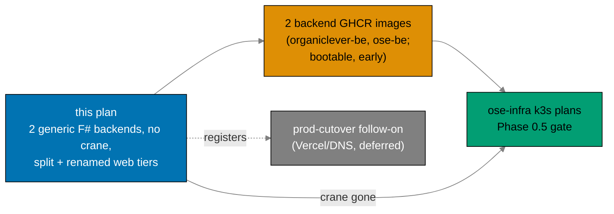

# Business Requirements: Restructure Backends to F# and Split Web Tiers

## Deliverable Handoff At A Glance

## Business Goal

Consolidate the platform's application tier onto consistent, idiomatic patterns and shrink the deploy
surface. Concretely:

1. Move both production backends to a single F# stack (Giraffe / EF Core 10 / DbUp / NATS.Net) as
   **generic `<product>-be` backends** (cost-driven — self-hosted k8s runs one backend per product):
   rewrite `organiclever-be` **in place** (name kept) into a **real** backend (minimal `journal`
   CRUD) instead of an empty shell, and rename + port `ose-app-be` → **`ose-be`** preserving its
   public contract and its **OpenRouter LLM integration** (gap-analysis; core, not media).
2. **Remove the crane media service** (and the PDF-to-Markdown feature) entirely — leaving exactly two
   deployable backend images (`organiclever-be`, `ose-be`) for the downstream `ose-infra` k3s plans to
   pull. Web tiers deploy via Vercel and ship no container images.
3. Bring **OrganicLever's web tier into structural parity with OSE**: split the single
   `organiclever-web` into a simple marketing site (`organiclever-www`) and a CSR app
   (`organiclever-app-web`); the backend keeps its generic name `organiclever-be` (in-place rewrite).
4. Adopt a **repo-wide `-www` public-website naming rule** — `-www` = public website served at the
   domain root (deployment role, Vercel); `-app-web` = an application's web client served at `app.*` —
   renaming the existing public-website sites `ose-web` → `ose-www`, `wahidyankf-web` →
   `wahidyankf-www`, and `ayokoding-web` → `ayokoding-www` so each project's deployment role is legible
   from its name.
5. Stop frontend drift by introducing a **shared design-system lib** (`libs/ts-ui`) consumed by the
   app web clients + the new simple `organiclever-www`, and by **simplifying the new marketing site**
   (`organiclever-www`) to the lightweight `wahidyankf-www` pattern. Established content platforms
   (`ose-www`, `ayokoding-www`) keep their existing internals.

The new www/app **production cutover** (Vercel projects, DNS, prod branches, including the
`prod-ose-web` → `prod-ose-www`, `prod-wahidyankf-web` → `prod-wahidyankf-www`, and
`prod-ayokoding-web` → `prod-ayokoding-www` prod-branch renames) is deliberately **deferred
downstream**; this plan ends with everything restructured, built, and CI-green but not yet live at the
new domains.

## Rationale and Pain Points

- **Backend-tier language split** `[Repo-grounded]`: the backends are Rust while `apps/crane-cli` and
  `libs/fsharp-crane-core` are F#. The primer (`crud-be-fsharp-giraffe`) proves a production
  Giraffe/EF Core/DbUp/NATS.Net stack, so consolidating onto F# removes the split.
- **Two walking-skeleton backends** `[Repo-grounded]`: crane (media) and `organiclever-be` both shipped
  as NATS skeletons with no end-user consumer. `organiclever-web` is local-first (PGlite); its only
  backend link is an optional `/health` status page. Crane is **dropped**; `organiclever-be` is instead
  **promoted to a real backend** (journal CRUD) — the maintainer's product call, not a port of an
  empty shell.
- **Web-tier inconsistency** `[Repo-grounded]`: OSE runs the clean two-tier split (`ose-web` marketing
  - `ose-app-web` app + `ose-app-be`); OrganicLever crams marketing and the journal app into one
    `organiclever-web`. A `www`/`app` split lets the app go CSR with its own stack and complexity budget
    while the marketing site stays lightweight and SEO-friendly.
- **Web-tier naming ambiguity** `[Repo-grounded]`: `-web` is used both for public content sites
  (`ose-web`, `wahidyankf-web`, `ayokoding-web`) and as part of the OSE app's web client
  (`ose-app-web`), so a project's deployment role is not legible from its name. Adopting `-www` =
  public website at the domain root and `-app-web` = app web client at `app.*` makes the role
  explicit; the existing public-website sites are renamed to the `-www` suffix accordingly.
- **Per-tier vs generic backends** `[Repo-grounded]`: a `<product>-app-be` name implies a per-tier
  backend split, but the team self-hosts Kubernetes and runs **one backend per product**. Generic
  `<product>-be` naming (revert `ose-app-be` → `ose-be`; keep `organiclever-be`) matches reality and
  stays forward-compatible with a future split if one is ever needed.
- **Frontend drift risk**: product frontends with no shared design system guarantee brand and
  component drift, especially across each product's `www → app` jump. A shared `libs/ts-ui` (consumed
  by the app clients + the new simple marketing site) plus a common simple pattern for new marketing
  sites removes that risk.
- **Smaller, consistent deploy surface for k3s**: dropping crane takes the image roster from three to
  two (`organiclever-be`, `ose-be`); the renames give a consistent `<product>-be` / `*-app-web` /
  `*-www` shape across the repo.
- **Contract continuity**: `ose-app-be`'s OpenAPI contract (and its `generated-contracts/` codegen) is
  preserved minus media under the new `ose-be` name, so `ose-app-web` (codegen source pointer updated
  to `ose-be`) sees no breaking change beyond the removed media path.

## Affected Roles

This is a solo-maintainer repository; "roles" denote the hats the maintainer wears and the agents that
consume the artifacts. No sign-off ceremonies apply.

- **Backend maintainer hat**: owns the Rust→F# rewrite of both backends, the journal CRUD, and crane
  removal.
- **Frontend maintainer hat**: owns the organiclever web split + rename, the `-www` public-site
  renames (`ose-web` → `ose-www`, `wahidyankf-web` → `wahidyankf-www`, `ayokoding-web` →
  `ayokoding-www`), the `libs/ts-ui` design system, and the new-marketing-site simplification.
- **Platform / infra maintainer hat**: consumes the two F# GHCR images and the DbUp/NATS.Net wiring in
  the downstream `ose-infra` k3s deployments; owns the deferred prod cutover.
- **Spec maintainer hat**: owns the `specs/` restructure (renames, marketing tier, crane-be/media
  removal).
- **Consuming agents**: `swe-rust-dev` / `swe-fsharp-dev` (backends), `swe-typescript-dev` +
  `swe-ui-maker` (frontends + `ts-ui`), `swe-e2e-dev` (e2e), `specs-maker` / `specs-fixer` (specs),
  `docs-maker` (docs + archival), `repo-setup-manager` (Phase 0), `ci-checker` / `ci-fixer` (CI gate).

## Business Success Criteria

All criteria are observable facts checkable by command or inspection.

- **Two F# backends build and run** (observable): `nx build ose-be` and `nx build organiclever-be`
  produce .NET release artifacts; each boots, runs DbUp migrations, connects NATS, and serves
  `/health`.
- **ose-be contract preserved minus media** (observable): its OpenAPI contract still validates and
  bundles, every previously documented non-media path is still served, the OpenRouter LLM integration
  is intact, and the media path is absent.
- **organiclever-be is real** (observable): it serves `journal` CRUD endpoints whose schema mirrors
  the PGlite client model; a contract smoke-probe exercises them; the journal contract is generated.
- **Crane is gone** (observable): `apps/crane-be/` and `apps/crane-be-e2e/` no longer exist; no
  `crane_client`, no `/media/pdf-to-md`, no `crane.convert` anywhere in `apps/` or `specs/`; `grep`
  finds zero references (excluding `crane-cli` / `fsharp-crane-core`).
- **Two images, public, early** (observable): `ghcr.io/wahidyankf/organiclever-be` and
  `ghcr.io/wahidyankf/ose-be` resolve to publicly pullable F# images after Phase 2; the crane-be
  image/job is gone from `publish-images.yml`; no web tier ships a container image.
- **organiclever web split + rename** (observable): `apps/organiclever-app-web` (the app) and a new
  simple `apps/organiclever-www` (marketing) both build; `apps/organiclever-be` builds (name kept);
  the old single `organiclever-web` web project name no longer exists in `nx show projects`.
- **Backend renamed to generic name** (observable): `nx show projects` lists `ose-be` and `ose-be-e2e`;
  the old `ose-app-be`/`ose-app-be-e2e` project names no longer exist; `organiclever-be` is unchanged.
- **Public-website tier renamed to `-www`** (observable): `nx show projects` lists `ose-www`,
  `organiclever-www`, `wahidyankf-www`, and `ayokoding-www` (plus their renamed e2e pairs); the old
  `ose-web`, `wahidyankf-web`, and `ayokoding-web` project names no longer exist.
- **Shared design system adopted** (observable): `libs/ts-ui` builds and is listed as a dependency of
  its three consumers (`organiclever-www`, `organiclever-app-web`, `ose-app-web`) in `nx graph`;
  `ose-www`/`ayokoding-www` keep their content internals (not consumers).
- **New marketing site simplified** (observable): the new `apps/organiclever-www` uses the
  `src/features/` layout matching `wahidyankf-www`; `apps/ose-www` retains its tRPC + content pipeline
  after its structure-only simplification; `apps/ayokoding-www` keeps its existing structure.
- **Messaging proven** (observable): the JetStream durable demo per backend passes at e2e on NATS.Net.
- **Dependencies stay** (observable): `apps/crane-cli` → `libs/fsharp-crane-core`, and
  `apps/ayokoding-cli` + `apps/ose-cli` → `libs/rust-commons`; `nx graph` confirms.
- **Specs restructured** (observable): organiclever **web** spec surfaces renamed to the `*-app-*`
  shape (backend `behavior/organiclever-be/` kept), a marketing-tier spec surface
  (`behavior/organiclever-www/` + marketing `components/web/`) exists; OSE backend spec surfaces
  renamed `app-be` → `be`; ayokoding-web spec references renamed to `ayokoding-www`; crane-be specs
  removed (crane-cli kept); no media references.
- **Quality gate green** (observable): `nx affected -t typecheck lint test:quick specs:coverage` and the
  adapted e2e runs pass locally and in CI; F# coverage thresholds met.
- **Drift guard clean** (observable): `rhino-cli env validate` passes with the renamed/F# env vars and
  the crane vars removed.

## Cost

This plan incurs **no vendor charges** — every cost surface it touches is free under current policy:

- **GHCR images**: public GitHub Packages are free; the roster shrinks three → two, so cost decreases.
- **GitHub Actions**: `ose-public` is a public repo (free minutes) and CI also runs on the self-hosted
  `ose-infra` runner stack.
- **Dependencies** are all free / open-source: Giraffe, EF Core, Npgsql, DbUp, NATS.Net,
  FSharp.SystemTextJson, analyzers, Playwright (backends); Next.js, React, Tailwind, shadcn/Radix, CVA
  (frontends). No paid SaaS introduced by this plan. `ose-be`'s OpenRouter integration is a metered
  third-party LLM API in production, but **this plan adds no live LLM traffic**: the
  `OSE_BE_OPENROUTER_API_KEY` stays a **placeholder-only var in committed files** (the real key is
  uncommitted, env-only), and no test path exercises real OpenRouter calls.
- **Deferred prod cutover** (new Vercel project for `app.organiclever.com`, DNS, and the
  prod-branch renames `prod-ose-web` → `prod-ose-www` / `prod-wahidyankf-web` → `prod-wahidyankf-www` /
  `prod-ayokoding-web` → `prod-ayokoding-www`): Vercel Hobby/free projects, DNS records, and branch
  renames are free; that work is downstream regardless.
- **Deployment cost** (k3s runtime, NATS, PostgreSQL) is owned by the downstream `ose-infra` plans on
  self-hosted clusters — out of scope here.

## Non-Goals (Business Scope)

- Not making the organiclever www/app split **live in production** — Vercel/DNS/prod-branch wiring is a
  deferred downstream follow-on.
- Not resolving the organiclever **sync-vs-server-authoritative** product decision.
- Not authoring the converged toolchain (`standardize-repo-toolchain-parity`, assumed DONE).
- Not adding end-user backend features beyond `journal` CRUD (organiclever) / current non-media parity
  (ose).
- Not keeping or reimplementing PDF-to-Markdown anywhere — the feature is removed.
- Not changing `libs/fsharp-crane-core`, `apps/crane-cli`, `libs/rust-commons` internals, or the
  `wahidyankf-web` / `ayokoding-web` content/structure (each is renamed to its `-www` form only —
  `wahidyankf-web` → `wahidyankf-www`, `ayokoding-web` → `ayokoding-www` — mechanical rename, no
  content or structure work; `ayokoding-www` keeps its tRPC).
- Not delivering k3s manifests or production deployment — owned by `ose-infra`.

## Risks and Mitigations

| Risk                                                                                                                                                             | Impact                                     | Mitigation                                                                                                                                                                                                  |
| ---------------------------------------------------------------------------------------------------------------------------------------------------------------- | ------------------------------------------ | ----------------------------------------------------------------------------------------------------------------------------------------------------------------------------------------------------------- |
| EF Core / Npgsql schema diverges from the Rust `sqlx` schema (ose-app-be)                                                                                        | Data-layer regression                      | Reuse the exact migration SQL via DbUp-embedded `db/migrations/*.sql`; assert schema match before porting handlers (Phase 3 gate)                                                                           |
| organiclever journal CRUD built blind to the deferred consumption decision                                                                                       | Rework when sync-vs-server is decided      | Mirror the **existing PGlite client schema**; keep it minimal (one context); ship unconsumed but contract-smoke-tested so the contract is validated                                                         |
| F#/.NET dependency versions drift inside the Path-B soak before execution                                                                                        | Path-B violation, blocked dependency       | Phase 0 re-confirms each pin against the primer fsproj + release dates; cutoff = exec date minus 60 days                                                                                                    |
| Removing crane leaves dangling references (routes, subjects, env, specs)                                                                                         | Build/lint/spec-coverage failures          | A single removal phase (Phase 2) does media + crane in one sweep; a `grep` gate asserts zero `crane`/`media`/`pdf-to-md`/`crane.convert` references                                                         |
| Any wide rename half-applies and breaks CI / Nx graph / imports (organiclever web `*-app-*`; `ose-app-be`→`ose-be`; the three `-www` renames)                    | Broken build across many projects          | Each rename is **its own atomic commit**; a post-rename gate runs `nx show projects` + full affected build before any further work                                                                          |
| `libs/ts-ui` built after its consumers → rework adopting it                                                                                                      | Wasted frontend effort                     | **ts-ui first** (Phase 5) before the organiclever split, so each consumer consumes it natively                                                                                                              |
| ose-www simplification breaks its tRPC + content/feed pipeline                                                                                                   | Broken updates/feed/rss                    | **Structure-only** simplification (contexts/ → features/) keeps tRPC + content infra intact; e2e asserts updates/feed still render                                                                          |
| The `-www` renames (`ose-web`→`ose-www`, `wahidyankf-web`→`wahidyankf-www`, `ayokoding-web`→`ayokoding-www`) half-apply, leaving dangling project/e2e references | Broken Nx graph / CI for the renamed sites | The three `-www` renames (dirs + `project.json` + e2e pairs + README + env-contract `root:`) are applied as one atomic Phase 7 commit, gated by `nx show projects` + affected build before the phase closes |
| OpenRouter LLM integration dropped or mishandled as "media" during the `ose-be` port                                                                             | Lost gap-analysis capability; secret leak  | Treat OpenRouter as **core** (carry the HTTP client adapter forward); `OSE_BE_OPENROUTER_API_KEY` stays placeholder-only in committed files (hard iron rule); Phase 3 gate greps for the OpenRouter wiring  |
| k3s critical path waits on the full web-tier restructure                                                                                                         | Infra deploy blocked                       | Bootable images publish **early (Phase 2)**; the k3s Phase 0.5 gate unblocks before Phases 3–9                                                                                                              |
| `standardize-repo-toolchain-parity` not actually DONE at execution                                                                                               | Missing F# targets / coverage tooling      | Phase 0 hard-stops on a prerequisite check before any rewrite work begins                                                                                                                                   |
| GHCR package visibility defaults to private for the renamed `ose-be` image                                                                                       | Infra cannot pull image                    | Phase 2 verifies anonymous `docker pull`; `ose-be` is a new package and may need a one-time `[HUMAN]` visibility flip; `organiclever-be` keeps its existing package                                         |
| ose-be (was ose-app-be) has six bounded contexts; porting drops one silently                                                                                     | Lost functionality                         | Port context-by-context against an enumerated list; Phase 3 gate checks all six bound                                                                                                                       |
| Long-lived mega-plan worktree diverges from main                                                                                                                 | Painful integration                        | **Incremental push per phase gate**; main stays green throughout; Rust sources retained in history for per-phase rollback                                                                                   |
