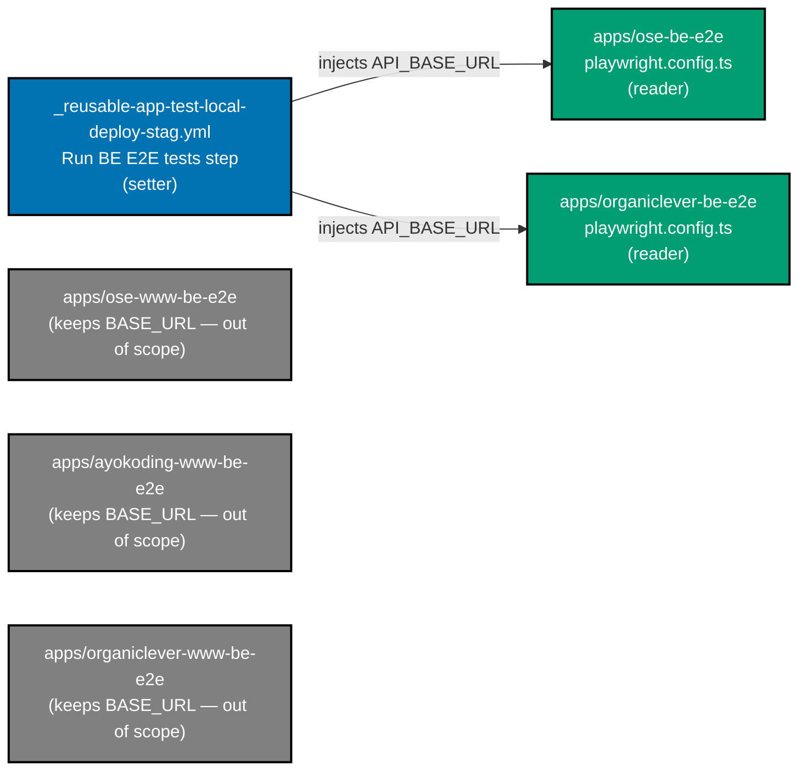

# Tech Docs — Backend E2E `API_BASE_URL` Standardization

## Variable data-flow overview

The diagram below shows the single CI setter and its two readers after the rename, alongside the three
`www-be-e2e` readers that remain on `BASE_URL` (out of scope).



## Blast radius — every `BASE_URL` site

`git grep -nE '\bBASE_URL\b'` (excluding `WEB_BASE_URL`) returns five Playwright config readers and one
workflow setter. Only the two **product-backend** suites and the single setter are in scope:

| Site                                                             | Role             | In scope?          | Reason                                           |
| ---------------------------------------------------------------- | ---------------- | ------------------ | ------------------------------------------------ |
| `apps/ose-be-e2e/playwright.config.ts:22`                        | reader (be)      | ✅ rename          | product backend API origin                       |
| `apps/organiclever-be-e2e/playwright.config.ts:22`               | reader (be)      | ✅ rename          | product backend API origin                       |
| `.github/workflows/_reusable-app-test-local-deploy-stag.yml:161` | setter (be step) | ✅ rename          | injects the var for the two backend suites above |
| `apps/ose-www-be-e2e/playwright.config.ts:21`                    | reader (www-be)  | ❌ keep `BASE_URL` | targets the Next.js **web** server (port 3100)   |
| `apps/ayokoding-www-be-e2e/playwright.config.ts:21`              | reader (www-be)  | ❌ keep `BASE_URL` | targets the Next.js **web** server (port 3101)   |
| `apps/organiclever-www-be-e2e/playwright.config.ts:21`           | reader (www-be)  | ❌ keep `BASE_URL` | targets the Next.js **web** server (port 3200)   |

### Why the setter and readers must move together

`_reusable-app-test-local-deploy-stag.yml` is the **app-web stack** test workflow. Its "Run BE E2E tests"
step runs `nx run ${{ inputs.be-project }}-e2e:test:e2e` where `be-project ∈ {ose-be, organiclever-be}`,
and sets `BASE_URL: http://localhost:${{ inputs.be-port }}`. That single line is the only place the
variable is _set_ for the two in-scope suites. If a reader is renamed but the setter is not, the CI run
loses its injected URL and silently falls back to the `localhost:<default-port>` literal — which is the
wrong host inside the compose network only if the port differs, but is in all cases an undeclared
dependency on the fallback. Therefore the readers and the setter are renamed in **one commit**, and the
Phase 1 gate re-runs both suites + `actionlint`.

### Why `www-be-e2e` stays on `BASE_URL`

The three `*-www-be-e2e` suites exercise the tRPC API embedded in the Next.js **web** app; their base URL
is the web server origin itself (`http://localhost:3100/3101/3200`), not a distinct backend service. They
run through a **different** reusable workflow (`_reusable-www-test-local`), so they share no setter line
with the in-scope suites — renaming them is neither required by this plan's goal nor coupled to it.
Whether `www-be-e2e` should adopt `WEB_BASE_URL` (since it is a web origin) is a separate naming question,
deliberately out of scope.

## Exact edits (Phase 1)

### 1. `apps/ose-be-e2e/playwright.config.ts`

```diff
-    baseURL: process.env.BASE_URL || "http://localhost:8302",
+    baseURL: process.env.API_BASE_URL || "http://localhost:8302",
```

### 2. `apps/organiclever-be-e2e/playwright.config.ts`

```diff
-    baseURL: process.env.BASE_URL || "http://localhost:8202",
+    baseURL: process.env.API_BASE_URL || "http://localhost:8202",
```

### 3. `.github/workflows/_reusable-app-test-local-deploy-stag.yml` (the "Run BE E2E tests" step)

```diff
       - name: Run BE E2E tests
         run: npx nx run ${{ inputs.be-project }}-e2e:test:e2e
         env:
-          BASE_URL: http://localhost:${{ inputs.be-port }}
+          API_BASE_URL: http://localhost:${{ inputs.be-port }}
```

### 4. `apps/ose-be-e2e/README.md` and `apps/organiclever-be-e2e/README.md`

Update the env-var table row and any prose from `BASE_URL` to `API_BASE_URL` (keep the documented
localhost default).

### 5. `env-injection.yaml` — `ci-harness` section

Add an entry modeled on `WEB_BASE_URL`:

```yaml
- key: API_BASE_URL
  class: var
  # Injected inline (localhost:<be-port>) by _reusable-app-test-local-deploy-stag.yml today.
  # Staging-environment consumption (running BE E2E against a deployed staging backend) is
  # deferred — see plans/in-progress/rename-be-e2e-api-base-url Phase 2.
  environments: [organiclever-app-staging, ose-app-staging]
```

The `environments` list mirrors where the operator created the variable. `API_BASE_URL` is a CI-harness
key and MUST NOT appear in any `apps/<app>/.env.example` (the drift guard would flag a declared-but-unread
app key), exactly like the existing `WEB_BASE_URL` and `VERCEL_AUTOMATION_BYPASS_SECRET` entries.

## Deferred — Phase 2 (staging backend E2E consumption)

For the `*-app-staging` `API_BASE_URL` variable to be _consumed_, the backend E2E suites would have to run
against a deployed **staging backend URL** in a staging gate. The backends ship to self-hosted k3s via
ose-infra `coralpolyp` (no public Vercel URL), and the current `_reusable-app-test-stag.yml` gate runs
only the **frontend** E2E (`WEB_BASE_URL` + `VERCEL_AUTOMATION_BYPASS_SECRET`). Wiring a backend staging
gate therefore depends on ose-infra exposing a reachable staging backend URL and on adding a backend E2E
job that reads `API_BASE_URL` from the GitHub Environment. That work is **not** in this plan — Phase 2 is
documentation of the dependency only.

## Verification commands

```bash
# No BASE_URL read remains in the two in-scope suites
git grep -nE '\bBASE_URL\b' -- apps/ose-be-e2e apps/organiclever-be-e2e   # expect: no hits

# www-be-e2e suites still use BASE_URL (unchanged)
git grep -nE '\bBASE_URL\b' -- apps/ose-www-be-e2e apps/ayokoding-www-be-e2e apps/organiclever-www-be-e2e  # expect: 3 hits

# Suites pass against compose (run from the local-stack harness or manual compose)
npx nx run ose-be-e2e:test:e2e
npx nx run organiclever-be-e2e:test:e2e

actionlint .github/workflows/_reusable-app-test-local-deploy-stag.yml
cargo run --release --quiet --manifest-path apps/rhino-cli/Cargo.toml -- env validate   # env-injection drift guard
```
