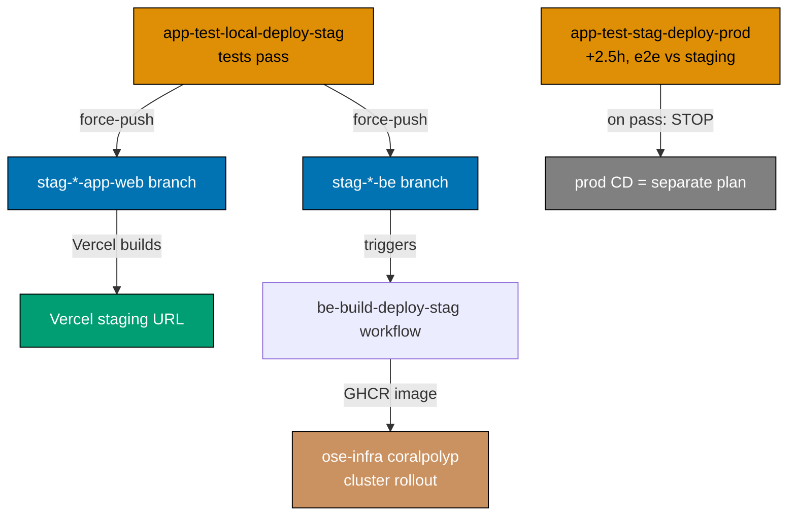

# Technical Documentation

Wiring architecture, the complete before→after inventory, per-workflow mechanics, resolved decisions,
and rollback for the GitHub Actions pipeline-naming + tiered-deploy restructure.

## Naming grammar (authoritative)

```text
[_reusable-]{domain}-{action-chain}.yml
```

| Token            | Allowed values                                                                                                                                                                                                        |
| ---------------- | --------------------------------------------------------------------------------------------------------------------------------------------------------------------------------------------------------------------- |
| `{domain}`       | App/group: `ose-www`, `ayokoding-www`, `organiclever-www`, `wahidyankf-www`, `organiclever-app`, `ose-app`, `organiclever-be`, `ose-be`. Cross-cutting: `commons`, `markdown`, `docs`, `crane-cli` (any `{cli-name}`) |
| `{action-chain}` | Ordered verbs + env qualifiers: `test`, `local`, `stag`, `prod`, `deploy`, `build`, `quality-gate`, `validate`, `env-validate` — joined with `-`                                                                      |
| `_reusable-`     | Prefix for `workflow_call` reusables only                                                                                                                                                                             |

**Verb/qualifier vocabulary** (compose left-to-right in execution order):

- `test-local` — run tests against a locally-spun stack (docker-compose: integration + e2e)
- `test-stag` — run e2e against the deployed **staging** environment (no docker-compose)
- `deploy-stag` / `deploy-prod` — **`git push --force` to the `stag-*` / `prod-*` branch.** That branch
  push is the deploy trigger: Vercel builds from it for web projects; a container-build-deploy workflow
  fires from it for backends (below).
- `build-deploy-stag` / `build-deploy-prod` — for non-Vercel backends: build the container image, push
  it to GHCR, and hand the cluster rollout to ose-infra `coralpolyp`.

Composite actions (`.github/actions/setup-*`) and the `name:`-mirrors-filename rule are unchanged.

## Deploy model (what "deploy" means here)

"Deploy" in every workflow name is a **branch force-push**, never a direct cluster/Vercel call:



- **Web** (Vercel): the branch push is the whole deploy — Vercel listens to `stag-*`/`prod-*` and
  builds. This plan only pushes the branch.
- **Backend** (non-Vercel): the app-tier deploy also force-pushes the `stag-*-be` branch. A separate
  `{product}-be-build-deploy-stag.yml` (triggered **on push** to that be branch) builds + pushes the
  GHCR image. The actual k3s rollout is orchestrated by ose-infra `coralpolyp` — out of this repo.

## Complete before → after inventory

### Reusable workflows

| Before                          | After                                      | Change                                                                                                                     |
| ------------------------------- | ------------------------------------------ | -------------------------------------------------------------------------------------------------------------------------- |
| `_reusable-test-and-deploy.yml` | `_reusable-www-test-local-deploy.yml`      | Rename; uniform `be-e2e`+`fe-e2e` runner pair (see www mechanics)                                                          |
| _(none)_                        | `_reusable-app-test-local-deploy-stag.yml` | **New** — factor the be+fe integration/e2e + dual-branch deploy job graph out of the two app dev workflows                 |
| _(none)_                        | `_reusable-app-test-stag.yml`              | **New** — factor the staging-e2e job out of the two staging workflows                                                      |
| _(none)_                        | `_reusable-be-build-deploy.yml`            | **New** — factor the GHCR build+push logic out of `publish-images.yml` (inputs: `be-project`, `image-name`, `environment`) |

### www tier — direct deploy (callers of `_reusable-www-test-local-deploy.yml`)

| Before                               | After                                         | Branch (after)          | Notes                                                         |
| ------------------------------------ | --------------------------------------------- | ----------------------- | ------------------------------------------------------------- |
| `test-and-deploy-ose-web.yml`        | `ose-www-test-local-deploy-prod.yml`          | `prod-ose-www`          | Fix stale `app-name: ose-web` → `ose-www`                     |
| `test-and-deploy-ayokoding-web.yml`  | `ayokoding-www-test-local-deploy-prod.yml`    | `prod-ayokoding-www`    | `app-name: ayokoding-web` → `ayokoding-www`                   |
| `test-and-deploy-wahidyankf-web.yml` | `wahidyankf-www-test-local-deploy-prod.yml`   | `prod-wahidyankf-www`   | `app-name: wahidyankf-web` → `wahidyankf-www`; fe-e2e only    |
| _(none — missing)_                   | `organiclever-www-test-local-deploy-prod.yml` | `prod-organiclever-www` | **New** caller + new `infra/dev/organiclever-www` local stack |

### app tier — gated promotion (deploy = force-push web **and** be stag branches)

| Before                                             | After                                         | Force-pushes (after)                                 | Notes                                                                          |
| -------------------------------------------------- | --------------------------------------------- | ---------------------------------------------------- | ------------------------------------------------------------------------------ |
| `test-and-deploy-organiclever-web-development.yml` | `organiclever-app-test-local-deploy-stag.yml` | `stag-organiclever-app-web` + `stag-organiclever-be` | Calls `_reusable-app-test-local-deploy-stag.yml`; env `organiclever-app-local` |
| `test-organiclever-web-staging.yml`                | `organiclever-app-test-stag-deploy-prod.yml`  | _(nothing — stops on pass)_                          | Folds the staging-e2e gate; env `organiclever-app-staging`; prod push deferred |
| `deploy-organiclever-web-to-production.yml`        | **removed**                                   | —                                                    | Prod CD deferred to a separate plan                                            |
| `test-and-deploy-ose-app-web-development.yml`      | `ose-app-test-local-deploy-stag.yml`          | `stag-ose-app-web` + `stag-ose-be`                   | Calls `_reusable-app-test-local-deploy-stag.yml`; env `ose-app-local`          |
| `test-ose-app-web-staging.yml`                     | `ose-app-test-stag-deploy-prod.yml`           | _(nothing — stops on pass)_                          | env `ose-app-staging`                                                          |
| `deploy-ose-app-web-to-production.yml`             | **removed**                                   | —                                                    | Prod CD deferred                                                               |

### backend container build+deploy (triggered on push to `stag-*-be`)

| Before               | After                                   | Trigger                     | Notes                                                                  |
| -------------------- | --------------------------------------- | --------------------------- | ---------------------------------------------------------------------- |
| `publish-images.yml` | `organiclever-be-build-deploy-stag.yml` | push `stag-organiclever-be` | Calls `_reusable-be-build-deploy.yml`; GHCR image → coralpolyp rollout |
| `publish-images.yml` | `ose-be-build-deploy-stag.yml`          | push `stag-ose-be`          | Calls `_reusable-be-build-deploy.yml`; GHCR image → coralpolyp rollout |

`publish-images.yml`'s old trigger was **push to `main`** (build affected be images continuously). The
new model is **gated**: images build only when a tested commit reaches a `stag-*-be` branch. This trigger
swap is **cross-repo** — ose-infra `coralpolyp` must watch the new branch-triggered images, not the
old main-push `:latest`. See [Cross-repo coordination](#cross-repo-coordination). Prod be
build-deploy (`*-be-build-deploy-prod.yml`, push `prod-*-be`) is deferred to the app-tier CD plan,
symmetric with web prod.

### Cross-cutting workflows

| Before                           | After                      | Domain     | Notes                                                                   |
| -------------------------------- | -------------------------- | ---------- | ----------------------------------------------------------------------- |
| `pr-quality-gate.yml`            | `commons-quality-gate.yml` | `commons`  | Full rename incl. `name:`; **branch protection updated** (D1)           |
| `validate-env.yml`               | `commons-env-validate.yml` | `commons`  | Repo-wide `.env.example` contract validation + injection-manifest check |
| `validate-markdown.yml`          | `markdown-validate.yml`    | `markdown` | Mermaid + link + heading-hierarchy validation                           |
| `test-crane-cli-integration.yml` | **removed**                | —          | CLI is not a service — out of scope this PR; revisited later (D5)       |

Net: **15 files today → 17 after** (4 reusables, 4 www, 4 app, 2 be-build-deploy, 3 cross-cutting:
`commons-quality-gate`, `commons-env-validate`, `markdown-validate`), accounting for the 2 removed
prod-dispatch workflows, the deleted `test-crane-cli-integration.yml`, and `publish-images.yml`
absorbed into the 2 be-build-deploy workflows, plus the new `infra/dev/organiclever-www/` compose stack
and the `organiclever-www-e2e` → `-be-e2e`/`-fe-e2e` split. Scope is **service workflows only**
(BE / FE / Web); CLI-tool CI is deferred.

## Fast-gate test policy (no integration/e2e in the gates)

`test:integration` and `test:e2e` are heavy (docker-compose, Playwright, real services). They belong
**only** to the scheduled tiered pipelines and must never sit on the fast feedback path:

| Surface                          | Runs                                                            | Integration / e2e? |
| -------------------------------- | --------------------------------------------------------------- | ------------------ |
| `.husky/pre-commit`              | `nx affected -t test:quick`                                     | **no**             |
| `.husky/pre-push`                | `specs:coverage`, `test-coverage`, specs/markdown/naming        | **no**             |
| `commons-quality-gate` (PR gate) | `typecheck`, `lint`, `test:quick`, `specs:coverage` + lint jobs | **no**             |
| `*-test-local-*` (CRON)          | `test:integration` + `test:e2e` via docker-compose              | **yes**            |
| `*-test-stag-*` (CRON)           | `test:e2e` vs deployed staging                                  | **yes**            |

Current state is **already compliant** on the PR gate, pre-commit, and pre-push (verified: they run
only `test:quick`/`typecheck`/`lint`/`specs:coverage`/coverage+validators). The **one violation** is
`test-crane-cli-integration.yml`, which runs `crane-cli:test:integration` on `pull_request` — making
an integration suite a PR gate. **Decision 5 (D5)**: rather than reschedule it, this plan **deletes**
`test-crane-cli-integration.yml` outright — crane-cli is a CLI tool, not a service, and CLI-tool CI is
out of scope this PR (revisited in a later plan). Deletion removes the violation cleanly. This plan
also codifies the invariant in `ci-conventions.md` so no
future reusable/caller wires integration/e2e back into a gate.

## Per-tier mechanics

### www `_reusable-www-test-local-deploy.yml`

Inputs: `app-name`, `prod-branch`, `health-url`, `health-timeout`. Job graph: `lint` → `unit` →
`specs-coverage` → `integration` → `e2e` (docker-compose `infra/dev/{app-name}`, runs
`{app-name}-be-e2e` then `{app-name}-fe-e2e`) → `specs-gate` → `detect-changes` → `deploy`
(force-push `prod-branch` when `apps/{app-name}/` changed).

**Uniform runner pair (Decision 3 — split).** The reusable assumes every www site exposes the
`{app-name}-be-e2e` + `{app-name}-fe-e2e` pair. To keep it uniform, `organiclever-www-e2e` is **split**
into `organiclever-www-be-e2e` + `organiclever-www-fe-e2e` (Nx project split). Sites without a backend
(`wahidyankf-www`) keep only `-fe-e2e`; the reusable's be-e2e step tolerates absence (`|| true`).

| Site               | E2E runners (after)                              | `infra/dev` stack | Action                                                         |
| ------------------ | ------------------------------------------------ | ----------------- | -------------------------------------------------------------- |
| `ose-www`          | `ose-www-be-e2e`, `ose-www-fe-e2e`               | exists            | repoint app-name only                                          |
| `ayokoding-www`    | `ayokoding-www-be-e2e`, `-fe-e2e`                | exists            | repoint app-name only                                          |
| `wahidyankf-www`   | `wahidyankf-www-fe-e2e` (fe only)                | exists            | repoint; be-e2e tolerated absent                               |
| `organiclever-www` | `organiclever-www-be-e2e`, `-fe-e2e` (**split**) | **create**        | split the runner; create `infra/dev/organiclever-www/` compose |

### app `_reusable-app-test-local-deploy-stag.yml`

Inputs: `web-project`, `be-project`, `contracts-project`, `compose-dir`, `stag-web-branch`,
`stag-be-branch`, `be-port`, `web-port`, `environment`. Job graph: `specs-coverage` → `fe-lint` →
`be-integration` (docker-compose) → `fe-integration` → `e2e` (full stack via `compose-dir`, be-e2e +
fe-e2e) → `specs-gate` → `deploy` (force-push **both** `stag-web-branch` and `stag-be-branch`). The
web push triggers Vercel; the be push triggers `{product}-be-build-deploy-stag.yml`.

### app `_reusable-app-test-stag.yml`

Inputs: `fe-e2e-project`, `environment`, `web-base-url-var`. Job `e2e-staging` — run
`{fe-e2e-project}:test:e2e` against `${{ vars.WEB_BASE_URL }}` with the Vercel bypass secret and
`PLAYWRIGHT_GREP_INVERT: "@local-fullstack"`. On pass it **stops**; no promote job (prod CD deferred).

### be `_reusable-be-build-deploy.yml`

Inputs: `be-project`, `image-name` (e.g. `ghcr.io/wahidyankf/organiclever-be`), `environment`. Job:
codegen → docker login → `docker build -f apps/{be-project}/Dockerfile` → push `:latest` + `:${sha}`.
Lifted verbatim from `publish-images.yml`'s per-be job. coralpolyp (ose-infra) consumes the pushed
image; rollout is out of scope here.

## CRON schedule (staggered, 2× WIB daily; 2.5 h staging→prod gap)

The prod-side run depends on the staging deploy from the local-deploy-stag run being **live** (Vercel
build + coralpolyp rollout). A **2.5-hour gap** guarantees both have settled.

| Pipeline                       | WIB           | UTC           | Rationale                                                        |
| ------------------------------ | ------------- | ------------- | ---------------------------------------------------------------- |
| `*-app-test-local-deploy-stag` | 03:00 / 15:00 | 20:00 / 08:00 | Earliest — produces the staging deploy the later run verifies    |
| `*-app-test-stag-deploy-prod`  | 05:30 / 17:30 | 22:30 / 10:30 | **+2.5 h** after staging, so Vercel + coralpolyp have rolled out |
| `*-www-test-local-deploy-prod` | 06:00 / 18:00 | 23:00 / 11:00 | Independent of the app tier (direct to prod)                     |

`*-be-build-deploy-stag` is **not** scheduled — it fires on the `stag-*-be` branch push from the
local-deploy-stag deploy job.

## GitHub Environments + branches (referenced here, created by wire-vercel)

**Three stages only — `local`, `staging`, `production`. There is no `development`.** The old
`*-development` environments are renamed to `*-local` (the local-test phase runs entirely on
docker-compose, so this env carries only local-CI secrets — drop the `environment:` key if it ends up
empty). `production` environments are gone with the removed prod-dispatch workflows (prod CD = separate
plan).

| Before (per workflow)          | After                                 | Holds                                             |
| ------------------------------ | ------------------------------------- | ------------------------------------------------- |
| `organiclever-web-development` | `organiclever-app-local`              | local-CI secrets only (or omit if empty)          |
| `organiclever-web-staging`     | `organiclever-app-staging`            | `WEB_BASE_URL`, `VERCEL_AUTOMATION_BYPASS_SECRET` |
| `organiclever-web-production`  | _(removed with the prod-dispatch wf)_ | —                                                 |
| `ose-app-web-development`      | `ose-app-local`                       | local-CI secrets only (or omit if empty)          |
| `ose-app-web-staging`          | `ose-app-staging`                     | staging vars/secrets                              |

**Branches this plan's workflows push** (created by wire-vercel; until then a push fails loudly):

- Web prod: `prod-ose-www`, `prod-ayokoding-www`, `prod-organiclever-www`, `prod-wahidyankf-www`
- App-web staging: `stag-organiclever-app-web`, `stag-ose-app-web`
- Backend staging: `stag-organiclever-be`, `stag-ose-be`
- Deferred to the CD plan: `prod-*-app-web`, `prod-*-be`

This plan writes only the **references**. Creating Environments/branches and setting secret **values**
is a `wire-vercel-www-app-cutover` `[HUMAN]` step. Staging URLs/secrets are never committed —
placeholder/secret only.

## Tiered env & secret injection standard

The repo already standardizes how each app **declares** its env vars locally:
[`secrets-and-env-standards.md`](../../../repo-governance/conventions/security/secrets-and-env-standards.md)
fixes the naming convention (`{APP}_` prefix), the `apps/<app>/.env.example` layout, the annotation
format, the `rhino-cli env validate` code↔template drift guard, and the `env-contract.yaml` surface
registry. What it does **not** yet standardize is how a declared key is **injected** into each
running surface — GitHub Actions, Vercel, and the backend container/k3s path — across the three
deploy stages. This plan introduces a pipeline whose `environment:` scoping and `vars.`/`secrets.`
reads must be uniform, so it is the right place to close that gap.

**Source of truth.** `apps/<app>/.env.example` is the canonical key set for every app-runtime
variable. Every injection target (GitHub Environment, Vercel project, k3s secret) uses the **same key
names** — the existing rule that **a tier qualifier never appears in a key** (`DATABASE_URL`, not
`PROD_DATABASE_URL`; §2 of the standard) is what makes one key set serve all three stages. The stage
is encoded by **which injection target** holds the value, never by the key.

### Variable classes (extends §2 of the standard with injection homes)

| Class                      | Example                                                                     | `.env.example`?    | Injection home                                                                 |
| -------------------------- | --------------------------------------------------------------------------- | ------------------ | ------------------------------------------------------------------------------ |
| App-runtime (server)       | `DATABASE_URL`, `ORGANICLEVER_BE_NATS_URL`                                  | **yes**            | local `.env.local` · GitHub Env (CI) · Vercel encrypted env · k3s secret       |
| App-runtime (public build) | `NEXT_PUBLIC_*`                                                             | **yes**            | same, but **build-time** + bundled (never a secret)                            |
| CI test-harness            | `WEB_BASE_URL`, `VERCEL_AUTOMATION_BYPASS_SECRET`, `PLAYWRIGHT_GREP_INVERT` | **no** (test-only) | GitHub Environment `vars.`/`secrets.` only; registered in `env-injection.yaml` |
| Platform-injected          | `VERCEL_GIT_COMMIT_REF`, `PORT`, `HOSTNAME`                                 | allowlisted        | supplied by the platform/framework; never declared, never set by us            |

The CI test-harness class is new and important: `WEB_BASE_URL` + `VERCEL_AUTOMATION_BYPASS_SECRET`
(read by `_reusable-app-test-stag.yml`) are **not** app config — they describe the deployed staging
target the e2e job probes. They must never leak into `apps/<app>/.env.example` (the drift guard would
wrongly flag them `declared-but-unread`), so they get their own registry (below).

`VERCEL_AUTOMATION_BYPASS_SECRET` is **load-bearing, not optional**: every app-web Vercel deployment
has Deployment Protection on, which returns `401` to unauthenticated requests to the staging/preview
URL. The staging e2e job runs Playwright against that protected URL, so it must send Vercel's
**Protection Bypass for Automation** token — exactly as the current `test-organiclever-web-staging.yml`
already does. Without it every staging run 401s. The token's real value is created in
`wire-vercel-www-app-cutover` (enable Protection Bypass per project → set the GitHub Environment
secret); this plan only declares the key in the manifest + reads it in the reusable.

### Injection matrix (app × stage × platform)

| App type         | Stage      | Platform / target                                   | Injection home                                                          | Values owned by                           |
| ---------------- | ---------- | --------------------------------------------------- | ----------------------------------------------------------------------- | ----------------------------------------- |
| www / app-web    | local      | dev machine                                         | `apps/<app>/.env.local` (gitignored), auto-loaded by Next.js            | developer                                 |
| www / app-web    | local (CI) | GitHub Actions + docker-compose                     | `infra/dev/<stack>/` compose env, sourced from the app `.env.example`   | this plan (refs) / committed placeholders |
| www              | production | Vercel **Production** target (`prod-*-www` branch)  | Vercel project env, keys from `.env.example`                            | wire-vercel `[HUMAN]`                     |
| app-web          | staging    | Vercel **Preview** target (`stag-*-app-web` branch) | Vercel project env (Preview scope)                                      | wire-vercel `[HUMAN]`                     |
| app-web e2e gate | staging    | GitHub Env `{group}-app-staging`                    | `vars.WEB_BASE_URL`, `secrets.VERCEL_AUTOMATION_BYPASS_SECRET`          | wire-vercel `[HUMAN]`                     |
| be (F#)          | local (CI) | GitHub Actions + docker-compose                     | `infra/dev/<group>/` compose env, sourced from the app `.env.example`   | this plan (refs) / committed placeholders |
| be (F#)          | staging    | k3s via ose-infra `coralpolyp`                      | container env from the ose-infra secret store, keys from `.env.example` | ose-infra (cross-repo)                    |

Two boundaries fall out of the matrix and are load-bearing for the plan split:

- **This plan writes only references** — the `environment:` names, the `vars.`/`secrets.` reads, the
  compose env wiring sourced from committed placeholders, and the value-less `env-injection.yaml`
  manifest. It creates **no real values**.
- **`wire-vercel` populates the values** — GitHub Environment secrets/vars and Vercel project env at
  each target. **coralpolyp (ose-infra)** owns the backend k3s secret values. The contract (key set)
  is defined here; the cutover plan and ose-infra fill it in.

### `infra/dev/<stack>` compose env — no duplicate templates

§3 of the standard forbids a second template per app. Compose stacks therefore **must not** introduce
their own `.env.example` key list. Today they load a gitignored local `.env` (e.g.
`infra/dev/organiclever/.env`, already `.gitignore`d) and override with inline `environment:` in
`docker-compose.ci.yml` for CI — never a committed second template. Any value a CI job needs is set
inline in the compose override or sourced from the app's canonical `apps/<app>/.env.example` keys
(placeholders only), so the drift guard still sees one source of truth. The new
`infra/dev/organiclever-www/` stack (delivery Phase 3) follows this rule, and the `{group}` stack
rename (`infra/dev/organiclever` → `infra/dev/organiclever-app`) keeps the gitignored `.env` in place.

### GitHub Environment ↔ key registry

Each `environment:` named by the pipeline holds exactly the keys that stage's jobs read, split into
non-secret `vars.` and secret `secrets.`. Values are placeholders/secret only in-repo (created by
wire-vercel):

| Environment               | `vars.`                 | `secrets.`                        | Read by                                |
| ------------------------- | ----------------------- | --------------------------------- | -------------------------------------- |
| `{group}-app-local`       | _(none — compose-only)_ | local-CI secrets, if any          | `_reusable-app-test-local-deploy-stag` |
| `{group}-app-staging`     | `WEB_BASE_URL`          | `VERCEL_AUTOMATION_BYPASS_SECRET` | `_reusable-app-test-stag`              |
| _(www has no GitHub Env)_ | —                       | —                                 | www e2e runs entirely on local compose |

If `{group}-app-local` ends up empty, **omit the `environment:` key** rather than bind an empty
environment (already noted in the Environments section above).

### `env-injection.yaml` — the value-less injection manifest

A new committed registry at repo root declares, per app, the injection home for every key at every
stage it runs in — **names only, never values**. It is the static contract that `commons-env-validate`
checks for internal consistency (every app-runtime key in `.env.example` has a documented home at each
stage the app runs; every CI test-harness key is registered and has no `.env.example` entry). It is
also the **checklist wire-vercel works from** when populating real values.

```yaml
# env-injection.yaml — value-less injection contract (extends env-contract.yaml)
apps:
  - app: organiclever-app-web
    runtime: { local: env-local, staging: vercel-preview, production: vercel-production }
    keys-from: apps/organiclever-app-web/.env.example
  - app: organiclever-be
    runtime: { local-ci: compose, staging: k3s-coralpolyp }
    keys-from: apps/organiclever-be/.env.example
ci-harness:
  # test-only keys, never in any .env.example
  - key: WEB_BASE_URL
    class: var
    environments: [organiclever-app-staging, ose-app-staging]
  - key: VERCEL_AUTOMATION_BYPASS_SECRET
    class: secret
    environments: [organiclever-app-staging, ose-app-staging]
```

`rhino-cli env validate` gains a manifest-consistency pass — **not** a separate target. The manifest
and `.env.example` are the same conceptual surface (the env contract), and `env validate` is already
wired into `.husky/pre-push` and `commons-env-validate.yml`, so extending it adds the check with **no
new target wiring**. It stays a **static, value-free** check. Actual presence of secret **values** in
GitHub/Vercel/k3s is **not** machine-checkable from this repo and stays a wire-vercel / ose-infra
`[HUMAN]` responsibility — the manifest is what they verify against.

### Testing strategy

The only code change in this plan is the extension of `rhino-cli env validate` with a
manifest-consistency pass (delivery step 6.3). All other changes are YAML/Markdown edits,
which are tested by linters, not unit tests.

**Unit-test approach for the `env validate` extension**:

- Tests live in `apps/rhino-cli/src/` alongside existing `env validate` tests, following the
  repo's TDD shape: RED (write a failing test asserting the new manifest-consistency rule),
  GREEN (implement the pass), REFACTOR (clean up).
- Test fixture: a deliberately mismatched `env-injection.yaml` + `.env.example` pair that causes
  the new pass to fail. The test asserts the command exits non-zero and emits a diagnostic naming
  the mismatched key.
- A correctly-matched fixture asserts the command exits zero (happy path).
- The Nx target `rhino-cli:env:validation` already runs `env validate` against the repo's live
  files; the new pass rides the same target — no new target wiring required.
- TDD fixture files are committed under `apps/rhino-cli/tests/fixtures/env-injection/` (_New
  directory_).

**Coverage for workflow YAML changes**:

- `actionlint` validates every `.github/workflows/*.yml` file — syntax, job references, and input
  types are all checked.
- `rhino-cli:links:validation` confirms no cross-reference points at an old (pre-rename) filename.
- The PRD validation grep (`git grep`) confirms no stale project names remain in workflow files.

### Docs & rules this introduces or amends

The env-injection standard touches a fixed governance surface; the delivery sweep updates all of it:

- `repo-governance/conventions/security/secrets-and-env-standards.md` — new "Tiered injection"
  section (matrix, classes, Environment registry, manifest); §7 census gains the GitHub/Vercel/k3s rows.
- `env-contract.yaml` — cross-reference the new `env-injection.yaml`; `env-injection.yaml` — **new**.
- `repo-governance/development/infra/ci-conventions.md` — env injection in the workflow `environment:`
  conventions.
- `docs/reference/system-architecture/ci-cd.md` — injection matrix in the deploy topology.
- `repo-governance/development/workflow/reproducible-environments.md`,
  `repo-governance/conventions/security/{README,env-file-access,no-secrets-in-committed-files}.md`,
  `repo-governance/conventions/README.md` — cross-links to the injection section.

## Resolved decisions

1. **PR quality gate — full rename, branch protection updated.** Rename file **and** `name:` to
   `commons-quality-gate`. Because `main` branch protection requires the status check derived from it,
   delivery includes a `[HUMAN]` step to update the required-status-check binding in the **same** window
   so pushes to `main` stay gated. (User confirmed: "we will update the branch protection.")
2. **App-tier be deploy — force-push the be branch + separate build-deploy.** The deploy job force-pushes
   `stag-*-be`; `{product}-be-build-deploy-stag.yml` builds the image on that push; coralpolyp rolls it
   out. (User confirmed.)
3. **`organiclever-www` e2e — split the runner.** Split `organiclever-www-e2e` into
   `organiclever-www-be-e2e` + `organiclever-www-fe-e2e` so the www reusable stays uniform. (User
   confirmed: "split it. it will make it easier.")
4. **Env/secret injection — references + manifest here, values in wire-vercel.** This plan defines the
   tiered injection standard (matrix, classes, GitHub Environment registry, the value-less
   `env-injection.yaml`) and wires every workflow's `environment:`/`vars.`/`secrets.` reads uniformly;
   it sets **no** real values. `wire-vercel` populates GitHub Environment + Vercel values; ose-infra
   `coralpolyp` owns the backend k3s secret values. (User asked to standardize env/secret injection
   across local/staging/prod on GitHub, Vercel, and anything else.)
5. **No integration/e2e in the fast gates; delete crane-cli CI.** `test:integration` + `test:e2e` run
   only in the scheduled tiered **service** pipelines. The PR gate / pre-commit / pre-push are already
   compliant; the lone violation, `test-crane-cli-integration.yml` (integration on `pull_request`), is
   **deleted** — CLI-tool CI is out of scope this PR and revisited later. The invariant is codified in
   `ci-conventions.md`. (User: "no `test:integration` and `test:e2e` run in the PR gate, or pre-push, or
   pre-commit. it is too heavy." + "we can also remove/delete `test-crane-cli-integration.yml` … we will
   only focus on the 'service' type (BE, FE, Web, etc) workflow for this PR.")

## Cross-repo coordination

The `publish-images` trigger swap (main-push → `stag-*-be` branch push) changes when/what images
appear in GHCR. **ose-infra `coralpolyp` must be updated to watch the branch-triggered images** before
this repo stops the main-push publish, or staging backend rollout will silently stall. Track this as a
hand-off to the ose-infra owner; do **not** remove `publish-images` behavior until coralpolyp confirms
the new source. The removal is therefore deferred to the consolidated `[HUMAN]` hand-off (delivery
Phase 9), where it sits alongside every other human-gated action; until then `publish-images.yml`
stays in place (transitional).

## Rollback

Every change is a file rename + content edit on `main`; git history retains the originals. To roll
back: `git revert` the commit range, or restore individual files via `git checkout <sha>~1 -- <path>`.
No Vercel/branch/Environment wiring is brought live by this plan (only YAML that _references_ names the
cutover plan will create), so reverting cannot break a live deployment — the worst case is the scheduled
workflows resume their pre-plan (already-stale) behavior. The new branches do not exist until wire-vercel
creates them, so a half-applied state simply means a scheduled run fails its `git push` to a missing
branch (loud, non-destructive).
