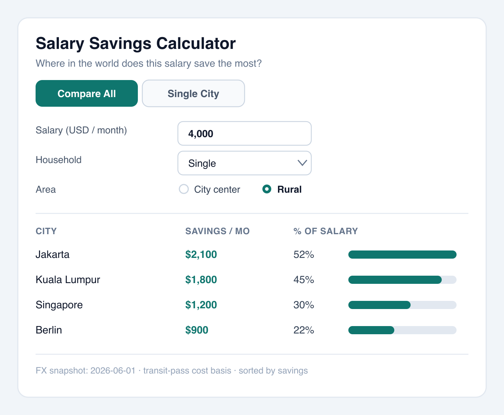
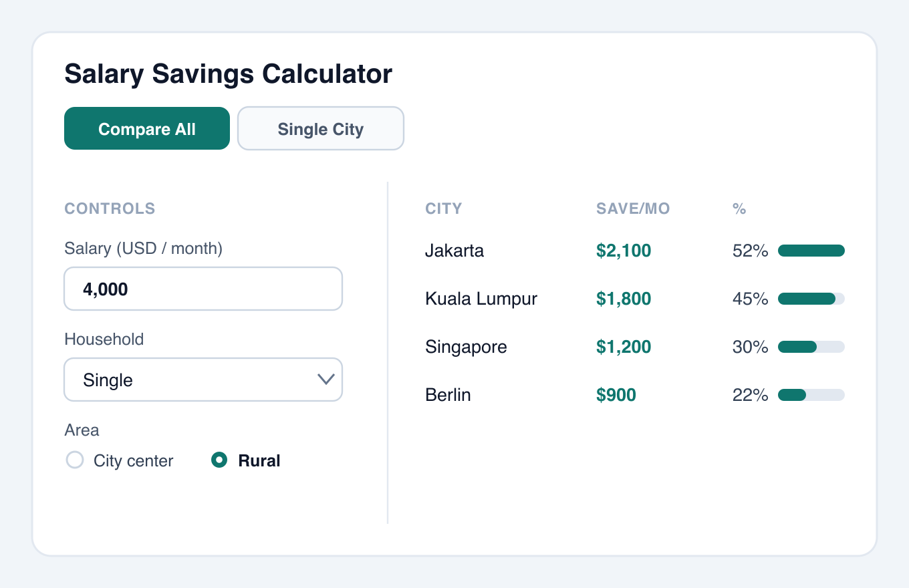

# Assets — Worked Example of the Design Funnel

These files walk the full **diverge → narrow → select → justify** funnel for one screen — the Salary
Savings Calculator compare-all view — so the process and both mockup tiers can be seen end-to-end.
All artefacts reuse the shared `libs/web-ui` kit (tabs, inputs, dropdown, radio, card, table) and its
token palette (teal primary, slate neutrals), per the grounding rule (R5).

| File                                                                                 | Funnel stage         | Tier   | Renders: VSCode / GitHub |
| ------------------------------------------------------------------------------------ | -------------------- | ------ | ------------------------ |
| [example-low-fi-wireframe.md](./example-low-fi-wireframe.md)                         | 1. Diverge           | Low-fi | Yes / Yes                |
| [example-hi-fi-option-a-ranked-table.png](./example-hi-fi-option-a-ranked-table.png) | 2. Narrow (finalist) | Hi-fi  | Yes / Yes                |
| [example-hi-fi-option-c-split.png](./example-hi-fi-option-c-split.png)               | 2. Narrow (finalist) | Hi-fi  | Yes / Yes                |

## Stage 1 — Diverge (low-fi)

Three genuinely different layouts, named Option A / B / C, in
[example-low-fi-wireframe.md](./example-low-fi-wireframe.md): **A — Ranked Table**, **B — Card Grid**,
**C — Split**. Cheap ASCII, so divergence is painless and diffable.

## Stage 2 — Narrow (hi-fi shortlist)

The two strongest low-fi options are promoted to high fidelity. Option B (Card Grid) is dropped here.

### Finalist 1 — Option A (Ranked Table)



### Finalist 2 — Option C (Split)



## Stage 3 — Selection

**Selected: Option A — Ranked Table.**

## Stage 4 — Rationale (decision record)

| Option               | Outcome           | Why                                                                                                                                                                  |
| -------------------- | ----------------- | -------------------------------------------------------------------------------------------------------------------------------------------------------------------- |
| **A — Ranked Table** | **Chosen**        | Densest scan of many cities; native sort; reuses the `web-ui` `Table`; collapses cleanly to one column on mobile. Best fit for a content-site comparison tool.       |
| C — Split            | Runner-up         | Comfortable on wide screens, but the left control rail wastes horizontal space and forces an awkward stack on mobile; no advantage over A for the core compare task. |
| B — Card Grid        | Dropped (Stage 2) | Attractive but shows few cities per screen and is weak for precise side-by-side number comparison — the primary job of this screen.                                  |

## How the hi-fi artefacts were produced

- The real plan workflow uses **Excalidraw `.excalidraw.png`** (the PNG carries an editable scene;
  edit it with the `pomdtr.excalidraw-editor` VSCode extension).
- These examples are instead **hand-authored SVGs** rasterised to PNG with `rsvg-convert -z 2`, so
  the source is fully diffable and reproducible from text. A hand-authored SVG uses system fonts, so —
  unlike `.excalidraw.svg` — it renders correctly on GitHub without the custom-font CSP fallback.
  Either route satisfies the hi-fi tier; pick Excalidraw for a drawing canvas, hand-SVG for a
  text-diffable vector source.
- Regenerate a PNG after editing its SVG:

  ```bash
  rsvg-convert -z 2 example-hi-fi-option-a-ranked-table.svg -o example-hi-fi-option-a-ranked-table.png
  rsvg-convert -z 2 example-hi-fi-option-c-split.svg -o example-hi-fi-option-c-split.png
  ```
