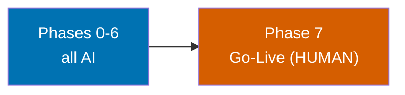

# Unify Web UI Kit and Deploy Storybook

> **Status**: In Progress (plan authoring complete; execution not started)
> **Created**: 2026-06-15
> **Execution model**: DIRECT TO `main` — no worktree, no PR (per explicit user override)

## Context

The repository ships six frontend web applications and a shared component library
`@open-sharia-enterprise/web-ui` (`libs/web-ui` [Repo-grounded]). UI-kit adoption is currently
**uneven**: four apps consume `web-ui`, two content sites (`ose-www`, `ayokoding-www`) maintain
their own local shadcn primitives and do not consume `web-ui` at all, and only two apps wire the
design-token library `@open-sharia-enterprise/web-ui-token` (`libs/web-ui-token` [Repo-grounded]).

This plan **unifies all six FE web apps onto the single `web-ui` component kit, themed per brand
via `web-ui-token`**, and **deploys the existing `web-ui` Storybook as a public static site on
Vercel at `web-ui.oseplatform.com`** so the kit is browsable with a live brand-theme switcher.

This is a **refactor, not a redesign**: every migration must render pixel-identical to each site's
current look. Brand differences live only in token CSS files.

## Scope

### In Scope (affected apps and libs, named explicitly)

| Project                                                | Path                                               | What changes                                                                                |
| ------------------------------------------------------ | -------------------------------------------------- | ------------------------------------------------------------------------------------------- |
| `@open-sharia-enterprise/web-ui` [Repo-grounded]       | `libs/web-ui/`                                     | Add `src/primitives/` shadcn base layer; pin exact deps; author stories for full kit        |
| `@open-sharia-enterprise/web-ui-token` [Repo-grounded] | `libs/web-ui-token/`                               | Add brand token CSS: `ose.css`, `ayokoding.css`, `wahidyankf.css` (organiclever.css exists) |
| `ose-www` [Repo-grounded]                              | `apps/ose-www/`                                    | Migrate off local `features/app-shell/presentation/ui/` onto `web-ui`; delete local `ui/`   |
| `ayokoding-www` [Repo-grounded]                        | `apps/ayokoding-www/`                              | Migrate off local `contexts/app-shell/presentation/ui/` onto `web-ui`; delete local `ui/`   |
| `organiclever-www` [Repo-grounded]                     | `apps/organiclever-www/`                           | Already on web-ui + token; verify token wiring                                              |
| `ose-app-web` [Repo-grounded]                          | `apps/ose-app-web/`                                | Already on web-ui + token; verify token wiring                                              |
| `organiclever-app-web` [Repo-grounded]                 | `apps/organiclever-app-web/`                       | Wire token lib (uses web-ui, NOT token today)                                               |
| `wahidyankf-www` [Repo-grounded]                       | `apps/wahidyankf-www/`                             | Wire token lib (uses web-ui, NOT token today)                                               |
| New Vercel project + CI                                | `.github/workflows/`, `libs/web-ui/vercel.json`    | Storybook static deploy at `web-ui.oseplatform.com` via `prod-web-ui` branch                |
| New deployer agent                                     | `.claude/agents/apps-web-ui-storybook-deployer.md` | On-demand Storybook deploy agent (Fast/haiku tier)                                          |

### Out of Scope

- Redesigning any app's look or visual identity (zero-visual-change mandate)
- Touching backend / F# code (`ose-be`, `organiclever-be`, `crane-cli`, etc.)
- Non-FE apps (CLIs, E2E runner projects beyond gating)
- Introducing any NEW dependency version (Path A reuse only — see `tech-docs.md`)
- Bumping Storybook (already at 10.2.10 [Repo-grounded])

## Document Map

| Document                         | Purpose                                                                      |
| -------------------------------- | ---------------------------------------------------------------------------- |
| [`brd.md`](./brd.md)             | WHY — business goal, impact, affected roles, success metrics, business risks |
| [`prd.md`](./prd.md)             | WHAT — personas, user stories, Gherkin acceptance criteria, product scope    |
| [`tech-docs.md`](./tech-docs.md) | HOW — architecture, dependency table + CVE clearance, vercel.json, risks     |
| [`delivery.md`](./delivery.md)   | DO — phased `[AI]`/`[HUMAN]` checklist with TDD substeps and phase gates     |

## Approach Summary

A single sequenced mega-plan in eight phases. All design work, story authoring, token files,
migrations, the deployer agent, the CI workflow, the `vercel.json`, and the `prod-web-ui` branch
are `[AI]`. The **only** `[HUMAN]` actions — Vercel dashboard project creation, framework/Node/Root
config, branch connection, custom-domain binding, and the DNS-registrar CNAME — are clustered into a
**single final go-live phase**. See [`delivery.md`](./delivery.md) for the full phase sequence.

