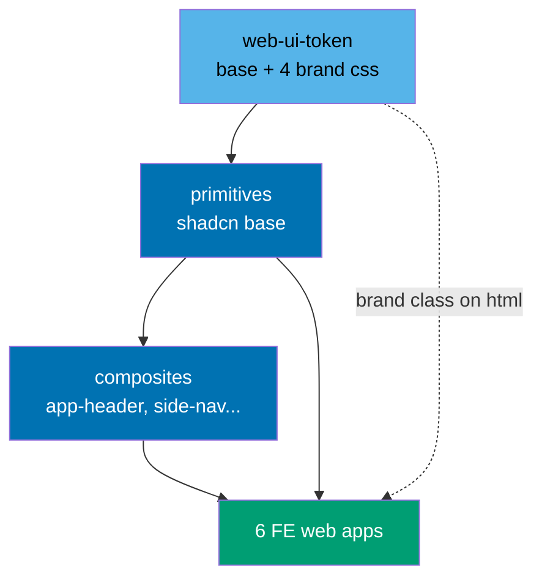
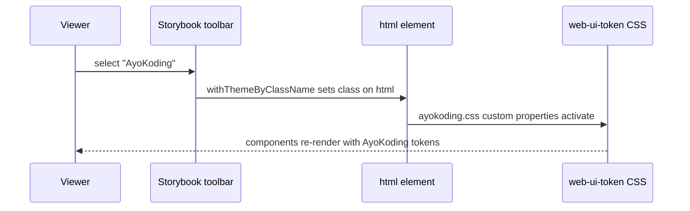

# Technical Documentation — Unify Web UI Kit and Deploy Storybook

## Architecture

### Layering: primitives + composites + tokens

`web-ui` adopts a two-layer component model on top of a token layer:



- **Primitives** (`src/primitives/`, _new directory_) — the shadcn base components. The superset is
  built from the two content sites' local copies [Repo-grounded]: `ose-www` ships 11
  (`button, badge, sheet, command, dialog, dropdown-menu, tabs, card, tooltip, scroll-area,
separator`); `ayokoding-www` ships 8 (a subset). The primitives layer holds the **union**.
- **Composites** (`src/components/`, _exists_) — the higher-level components already in `web-ui`
  (`app-header`, `side-nav`, `stat-card`, `tab-bar`, `hue-picker`, `info-tip`, `card`, `alert`,
  `dialog`, `input`, `label`, `toggle`, `badge`, etc. [Repo-grounded]).
- **Barrel** (`src/index.ts`, _exists_) — re-exports both layers so apps import from one package.
- **Tokens** (`web-ui-token`) — base `tokens.css` plus one CSS file per brand; the brand file sets a
  class on `<html>` that overrides token custom properties.

### Brand theme switching mechanism

The Storybook preview already imports `withThemeByClassName` from `@storybook/addon-themes` and uses
it for a light/dark toggle [Repo-grounded — `libs/web-ui/.storybook/preview.ts`]. This plan extends
that decorator to map four brand labels to four token classes on the `html` element:



## Dependency Policy Compliance (Path A — reuse exact repo-consistent pins)

Per [Dependency Bump Stability & Safety Policy](../../../repo-governance/development/workflow/dependency-bump-policy.md),
this plan introduces **no new version**. Every primitive dependency already exists in the repo and
is reused at the exact version resolved in the repo-root `package-lock.json`. This is **Path A**
(lowest risk — no new version introduced). All pins are **exact** (no caret/tilde).

> **Authoring correction (important)**: the handoff brief listed the caret-range _floors_ from app
> `package.json` files (e.g. `@radix-ui/react-slot ^1.1.0`). The values below are the **resolved
> versions** from `package-lock.json` [Repo-grounded — extracted via `node -e` against
>
> > `package-lock.json` on 2026-06-15], which is what an exact pin must equal. Where they differ from
> > the brief, the lockfile value wins.

### Dependency Table (exact pins)

| Package                         | Exact pin (from lockfile) | Currently in repo | New version? |
| ------------------------------- | ------------------------- | ----------------- | ------------ |
| `radix-ui`                      | `1.4.3`                   | Yes               | No           |
| `@radix-ui/react-slot`          | `1.2.4`                   | Yes               | No           |
| `@radix-ui/react-dialog`        | `1.1.15`                  | Yes               | No           |
| `@radix-ui/react-dropdown-menu` | `2.1.16`                  | Yes               | No           |
| `@radix-ui/react-tabs`          | `1.1.13`                  | Yes               | No           |
| `@radix-ui/react-tooltip`       | `1.2.8`                   | Yes               | No           |
| `@radix-ui/react-scroll-area`   | `1.2.10`                  | Yes               | No           |
| `@radix-ui/react-separator`     | `1.1.8`                   | Yes               | No           |
| `class-variance-authority`      | `0.7.1`                   | Yes               | No           |
| `clsx`                          | `2.1.1`                   | Yes               | No           |
| `tailwind-merge`                | `2.6.1`                   | Yes               | No           |
| `lucide-react`                  | `0.577.0`                 | Yes               | No           |
| `storybook` (+ `@storybook/*`)  | `10.2.10`                 | Yes               | No (no bump) |

> **Verify-at-delivery note**: re-resolve each pin with
> `node -e 'const l=require("./package-lock.json"); ...'` (or `npm ls <pkg>`) at execution time and
> use the value the lockfile reports. The table above is a 2026-06-15 snapshot. Also align
> `web-ui`'s existing `radix-ui ^1.0.0` declaration up to the exact pin `1.4.3`. [Repo-grounded —
>
> > `libs/web-ui/package.json` currently declares `radix-ui ^1.0.0`]

### CVE Clearance Record

Because no new version is introduced, the soak requirement is satisfied (versions already in
production). CVE clearance must still be recorded against the policy's **five sources** at execution
time and entered here:

| Source               | Check                                   | Status at delivery (2026-06-15)                                                                                              |
| -------------------- | --------------------------------------- | ---------------------------------------------------------------------------------------------------------------------------- |
| NVD                  | Search each package@version             | **CLEAN** — no CVE records found for any of the 12 packages; adjacent CVE-2025-55182 is React RSC (unrelated package family) |
| GitHub Advisories    | advisory DB per package                 | **CLEAN** — 0 reviewed npm advisories for radix-ui, CVA, clsx, tailwind-merge, lucide-react                                  |
| Snyk DB              | snyk.io package pages                   | **CLEAN** — "No direct vulnerabilities found" for all 12 packages; 0 Critical/High/Medium/Low                                |
| Vendor security page | radix-ui/primitives GitHub security tab | **CLEAN** — security page: "There aren't any published security advisories." (accessed 2026-06-15)                           |
| CISA KEV feed        | KEV catalogue lookup per package        | **CLEAN** — none of the 12 packages appear in the CISA KEV catalog as of 2026-06-15                                          |

- **KEV Fast-Track**: NOT triggered — no KEV entries for any of these packages.
- **EPSS Escalation**: NOT triggered — no unpatched CVEs found.
- **Clearance cutoff date**: **2026-06-15** — re-check recommended in 6 months (2026-12-15) or on major radix-ui release.

Sources consulted at delivery:

- [radix-ui — Snyk](https://security.snyk.io/package/npm/radix-ui) (accessed 2026-06-15)
- [@radix-ui/react-dialog — Snyk](https://security.snyk.io/package/npm/%40radix-ui%2Freact-dialog) (accessed 2026-06-15)
- [class-variance-authority — Snyk](https://security.snyk.io/package/npm/class-variance-authority) (accessed 2026-06-15)
- [clsx — Snyk](https://security.snyk.io/package/npm/clsx) (accessed 2026-06-15)
- [tailwind-merge — Snyk](https://security.snyk.io/package/npm/tailwind-merge) (accessed 2026-06-15)
- [lucide-react — Snyk](https://security.snyk.io/package/npm/lucide-react) (accessed 2026-06-15)
- [GitHub Advisory Database](https://github.com/advisories) (accessed 2026-06-15)
- [radix-ui/primitives Security Page](https://github.com/radix-ui/primitives/security) (accessed 2026-06-15)
- [NVD — National Vulnerability Database](https://nvd.nist.gov/) (accessed 2026-06-15)

## Storybook-on-Vercel Mechanics

[Web-cited — verified against repo state and Storybook/Vercel docs; flagged items need a preview deploy.]

- The repo is on **Storybook 10.2.10** (not 9) — `storybook`, `@storybook/nextjs-vite`,
  `@storybook/addon-themes`, `@storybook/addon-a11y`, `@storybook/addon-docs` all `10.2.10`
  [Repo-grounded — `libs/web-ui/package.json`]. Use "Storybook 10" nomenclature. SB10 is ESM-only and
  needs Node 20.16+/22.19+/24+; the repo is on Node 24.13.1 (OK), and the Vercel project must be set
  to Node 20.16+.
- `storybook build` produces a **self-contained static** site in `storybook-static/` — no Next.js
  server runs at runtime even though the framework is `@storybook/nextjs-vite`.
- The existing `build-storybook` Nx target runs `npx storybook build -o storybook-static` via
  `nx:run-commands` with `outputs: [{projectRoot}/storybook-static]` [Repo-grounded —
  `libs/web-ui/project.json` exposes `storybook` and `build-storybook` targets]. Keep this; do **not**
  switch to `@nx/storybook:build` (webpack-oriented; the Vite builder uses the CLI directly).
- Disable Storybook telemetry in CI via `STORYBOOK_DISABLE_TELEMETRY=1`.

### `vercel.json` design

Place `vercel.json` at `libs/web-ui/vercel.json` (_new file_). The critical setting is
`"framework": null` — without it Vercel auto-detects Next.js and runs `next build`, the #1 failure
mode for Storybook-on-Vercel.

```json
{
  "framework": null,
  "buildCommand": "npx nx run web-ui:build-storybook",
  "outputDirectory": "libs/web-ui/storybook-static",
  "rewrites": [{ "source": "/(.*)", "destination": "/index.html" }]
}
```

**Monorepo Root Directory caveat** [Needs Verification in a preview deploy]:

- If Vercel **Root Directory = monorepo root**: `buildCommand` = `npx nx run web-ui:build-storybook`,
  `outputDirectory` = `libs/web-ui/storybook-static` (as above).
- If Vercel **Root Directory = `libs/web-ui`**: `buildCommand` = `npx nx run web-ui:build-storybook`
  (run from root via Nx) and `outputDirectory` = `storybook-static`.
- Resolve which Root Directory the human selects during go-live, then confirm the build output path
  in a Vercel preview deploy before binding the production domain.

The `rewrites` SPA fallback ensures deep links to a story URL load `index.html` rather than 404.

## Deploy Model (mirrors existing prod-\* Vercel sites)

The repo deploys Vercel sites by force-pushing `main` to a `prod-*` branch that Vercel watches
[Repo-grounded — `.github/workflows/ose-www-test-local-deploy-prod.yml` and
`.claude/agents/apps-ose-www-deployer.md`]. This plan adds:

- A `prod-web-ui` environment branch (deployment-only; no direct commits).
- A deployer agent `apps-web-ui-storybook-deployer` (Fast/haiku tier), modeled on
  `apps-ose-www-deployer.md`, that force-pushes `main` → `prod-web-ui`.
- A CI gate workflow. Per
  [GitHub Actions Workflow Naming Convention](../../../repo-governance/development/infra/github-actions-workflow-naming.md),
  the compliant filename is **`web-ui-build-deploy-prod.yml`** (domain `web-ui` — registered in the
  convention's target file set table as a library deploy workflow; action-chain `build-deploy-prod`,
  with `name:` mirroring the filename). `build-deploy-prod` is chosen over `deploy-prod` because the
  workflow has an explicit build job (`nx run web-ui:build-storybook`) before the deploy job
  (force-push to `prod-web-ui`), and over the www-tier `test-local-deploy-prod` because the
  Storybook site has **no docker-compose backend and no fe/be e2e**. Trigger on **`schedule` +
  `workflow_dispatch`** (not `push`), matching the other `*-deploy-prod` workflows.


## File-Impact Analysis

| Path                                                                  | Action      | Notes                                                       |
| --------------------------------------------------------------------- | ----------- | ----------------------------------------------------------- |
| `libs/web-ui/src/primitives/*.tsx`                                    | Create      | Superset of content-site primitives                         |
| `libs/web-ui/src/index.ts`                                            | Edit        | Re-export primitives layer                                  |
| `libs/web-ui/package.json`                                            | Edit        | Exact-pin deps; align `radix-ui` to `1.4.3`                 |
| `libs/web-ui-token/src/ose.css`                                       | Create      | OSE brand tokens                                            |
| `libs/web-ui-token/src/ayokoding.css`                                 | Create      | AyoKoding brand tokens                                      |
| `libs/web-ui-token/src/wahidyankf.css`                                | Create      | wahidyankf brand tokens                                     |
| `libs/web-ui/.storybook/preview.ts`                                   | Edit        | Four-brand `withThemeByClassName` switcher                  |
| `libs/web-ui/src/**/*.stories.tsx`                                    | Create      | One story per primitive and composite                       |
| `libs/web-ui/vercel.json`                                             | Create      | `framework: null` + SPA rewrite                             |
| `.claude/agents/apps-web-ui-storybook-deployer.md`                    | Create      | Vendor-neutral deployer agent                               |
| `.github/workflows/web-ui-build-deploy-prod.yml`                      | Create      | Schedule + dispatch; build-storybook smoke + deploy         |
| `repo-governance/development/infra/github-actions-workflow-naming.md` | Edit        | Add `web-ui-build-deploy-prod.yml` to target file set table |
| `apps/ose-www/src/features/app-shell/presentation/ui/`                | Delete (P6) | After import repoint                                        |
| `apps/ayokoding-www/src/contexts/app-shell/presentation/ui/`          | Delete (P6) | After import repoint                                        |
| Each app's entry CSS (6 apps)                                         | Edit        | Import base + brand token sheets                            |

## Harness Neutrality

The new `apps-web-ui-storybook-deployer` agent definition is authored in `.claude/agents/` and must
stay **vendor-neutral** per the
[Governance Vendor-Independence Convention](../../../repo-governance/conventions/structure/governance-vendor-independence.md).
After authoring, run `npm run generate:bindings` to resync the OpenCode/Amazon Q mirrors — never
hand-edit the generated mirror. [Repo-grounded — `npm run generate:bindings` is the documented sync
command in `CLAUDE.md`]

## Risks and Rollback

| Risk                                          | Rollback                                                                           |
| --------------------------------------------- | ---------------------------------------------------------------------------------- |
| Migration changes a content site's appearance | Revert the import-repoint commit; the local `ui/` dir deletion is a later phase.   |
| Vercel runs `next build` instead of static    | `framework: null` in `vercel.json`; verify in a preview deploy before domain bind. |
| Build output path mismatch in monorepo        | Confirm Root Directory + `outputDirectory` in a preview deploy (flagged above).    |
| Newly-pinned dep flagged by a CVE source      | Path A reuse; if a source flags one, escalate per KEV/EPSS rules before pinning.   |
| Theme class does not apply tokens             | Reuse the proven `withThemeByClassName` pattern already in `preview.ts`.           |
