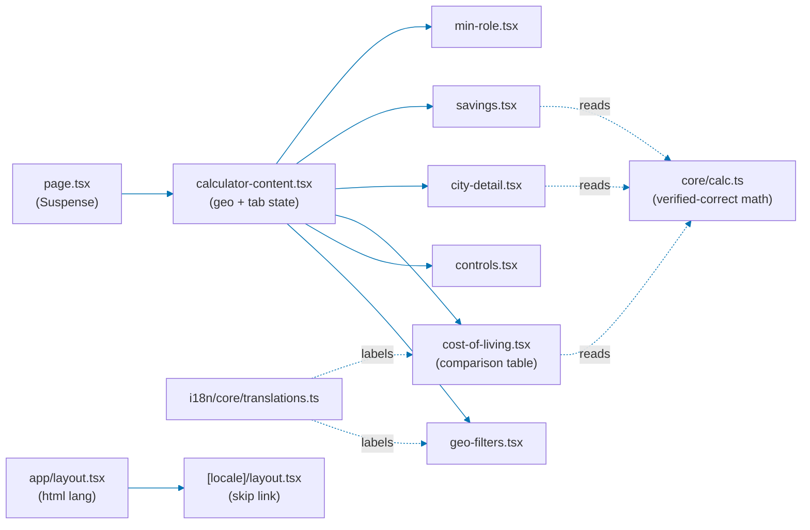
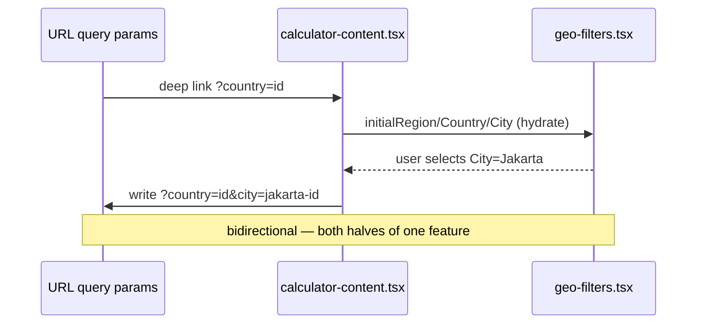
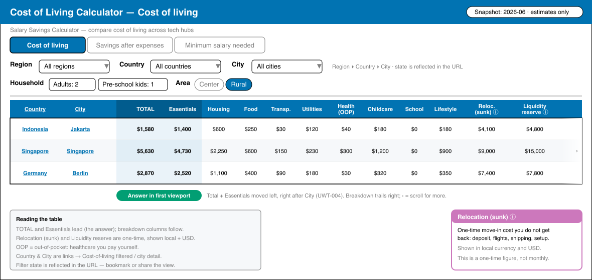
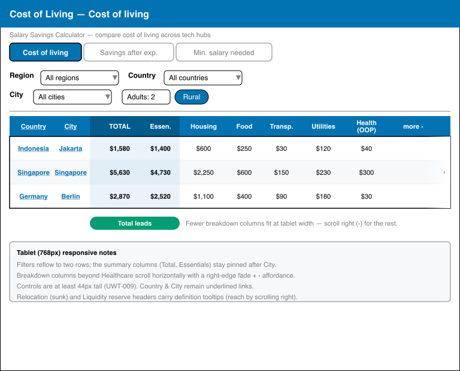
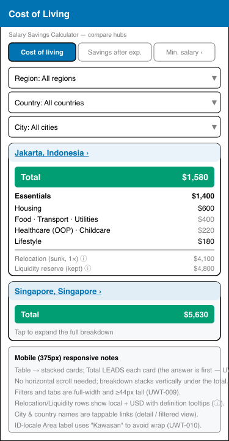
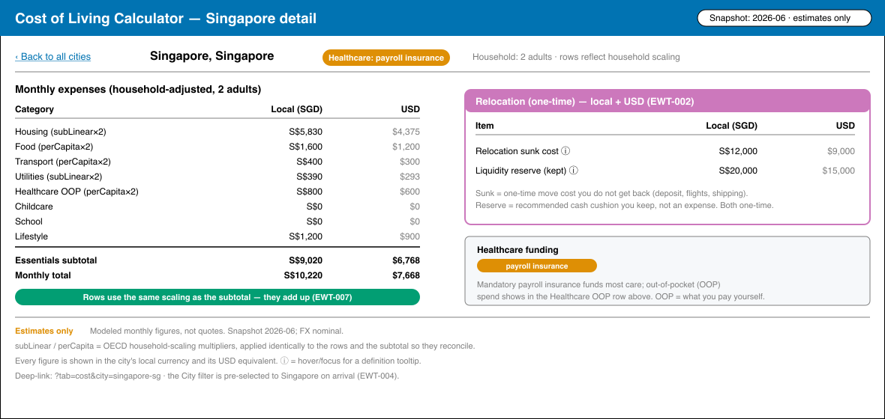
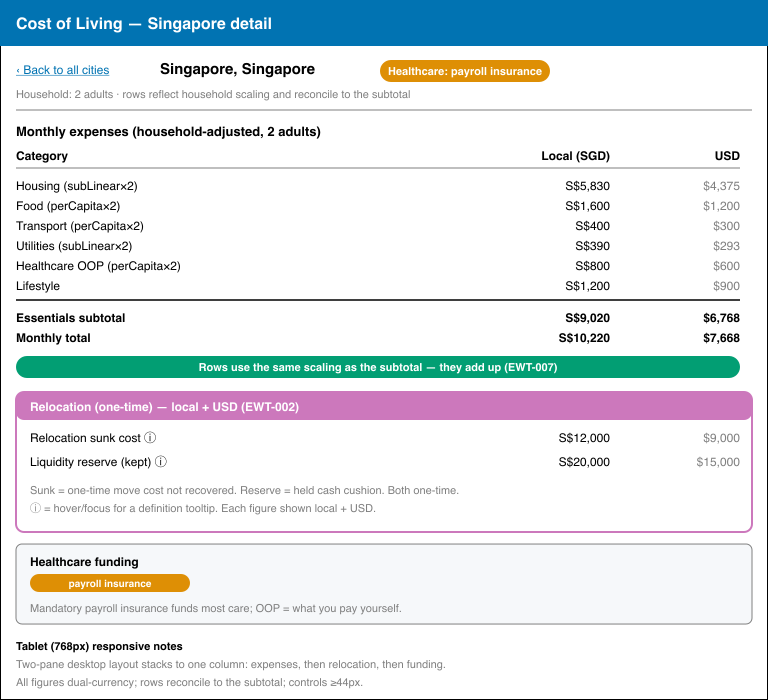
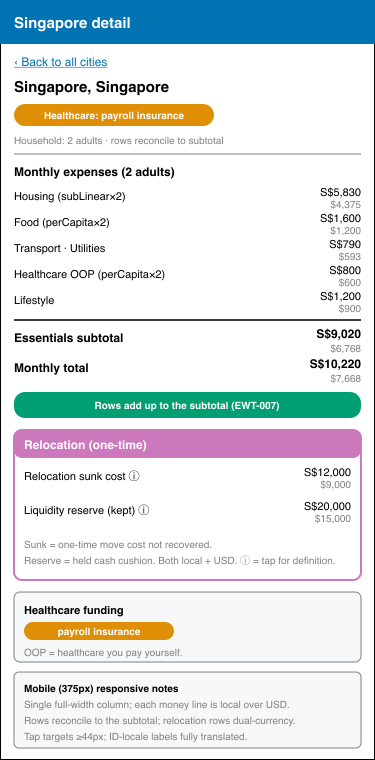

# Technical Documentation — Cost-of-Living Calculator Test-Fixing

Root-cause analysis and chosen fix approach per finding cluster. All file paths below are
`[Repo-grounded]` (verified via `Glob`/`Read` in the current commit) unless marked otherwise. The
app uses functional core / imperative shell: `apps/ayokoding-www/src/features/<name>/{core,shell}`.

## Architecture context

The **core math** (`core/calc.ts`: tax bands, FX, OECD `subLinear`/`perCapita` household scaling,
savings) is verified correct by the exploratory pass. Every fix below changes the **shell** (how a
value is read/displayed), the **layout** (`lang`/headers), the **i18n table**, or the **config** —
never the core math.

### Affected files (all `[Repo-grounded]`)

| File                                                                                         | Findings touched                                                          |
| -------------------------------------------------------------------------------------------- | ------------------------------------------------------------------------- |
| `apps/ayokoding-www/src/app/layout.tsx`                                                      | `EWT-001`/`UWT-006` (`html lang`), `UWT-007` (`<title>`)                  |
| `apps/ayokoding-www/src/app/[locale]/layout.tsx`                                             | `EWT-001` (`lang`), `EWT-010` (skip link)                                 |
| `apps/ayokoding-www/src/app/[locale]/tools/cost-of-living-calculator/page.tsx`               | `UWT-007`/`USS-005` (`generateMetadata` title)                            |
| `apps/ayokoding-www/src/app/[locale]/tools/cost-of-living-calculator/calculator-content.tsx` | `EWT-004`/`UWT-003`/`EWT-003` (URL ⇄ filter), `UWT-002` (subtitle)        |
| `apps/ayokoding-www/src/features/cost-of-living-calculator/shell/geo-filters.tsx`            | `EWT-003`, `EWT-008`, `EWT-011`                                           |
| `apps/ayokoding-www/src/features/cost-of-living-calculator/shell/cost-of-living.tsx`         | `EWT-006`, `UWT-004` (reorder), `UWT-005` (tooltips), `UWT-011`/`UWT-014` |
| `apps/ayokoding-www/src/features/cost-of-living-calculator/shell/city-detail.tsx`            | `EWT-002`, `EWT-007`                                                      |
| `apps/ayokoding-www/src/features/cost-of-living-calculator/shell/savings.tsx`                | `EWT-005`, `EWT-012`, `EWT-014`                                           |
| `apps/ayokoding-www/src/features/cost-of-living-calculator/shell/controls.tsx`               | `UWT-009`, `UWT-010`                                                      |
| `apps/ayokoding-www/src/features/i18n/core/translations.ts`                                  | `EWT-009`, plus any new keys (subtitle, tooltips, badges)                 |
| `apps/ayokoding-www/next.config.ts`                                                          | `EWT-013` (security headers) — **note: `.ts`, not `.js`**                 |
| New: `apps/ayokoding-www/src/app/[locale]/tools/page.tsx`                                    | `UWT-013` (`/tools` index) — _New file_                                   |

> **Correction to findings**: the findings name `next.config.js`; the repo has
> `apps/ayokoding-www/next.config.ts` `[Repo-grounded]`. Apply the `headers()` block there.

## Fix approach per cluster

### Cluster A — `html lang` (`EWT-001` ⇄ `UWT-006`, single fix; folds `USS-004`)

- **Root cause**: `app/layout.tsx` line 22 hardcodes `<html lang="en">` `[Repo-grounded]`; the
  `[locale]/layout.tsx` segment never overrides it.
- **Fix**: make the rendered `<html lang>` locale-aware. Because the root layout owns the `<html>`
  element and the `[locale]` segment owns the locale, set `lang` from the resolved `locale` param —
  either by lifting `<html>` into a locale-aware layout or reading the locale in the root layout's
  rendering path. Assert both `id` and `en` outcomes.
- **Shared root cause**: this one change closes both `EWT-001` and `UWT-006`.

### Cluster B — Indonesian translation gaps (`EWT-008`–`EWT-011`)

- **`EWT-008`** — `geo-filters.tsx` uses `c.name.en` for all option labels. Fix: `c.name[locale] ?? c.name.en`.
- **`EWT-009`** — `translations.ts` `id.colRelocationSunk = "Relokasi (sunk)"` leaves English "sunk".
  Fix: replace with a fully Indonesian string (e.g. "Relokasi (biaya hangus)").
- **`EWT-010`** — `[locale]/layout.tsx` hardcodes the English skip-link text. Fix:
  `t(locale, "skipToContent")` (the key exists in the ID locale).
- **`EWT-011`** — `geo-filters.tsx` hardcodes `aria-label="Clear region"`. Fix:
  `aria-label={t(locale, "clearRegion")}`.

### Cluster C — Household scaling display (`EWT-006` columns ⇄ `EWT-007` rows, shared root cause; folds `SG-002`, `SG-007`)

- **Root cause**: `cost-of-living.tsx` and `city-detail.tsx` render raw `e.<cat>.amount` for the
  per-category columns/rows but compute Essentials via `essentialsLocal(...)`, which applies the
  OECD `subLinear`/`perCapita` multipliers. So the visible breakdown diverges from the subtotal for
  the OECD-scaled categories.
- **Fix**: apply the same `subLinear`/`perCapita` multipliers used by `essentialsLocal` when mapping
  each category column/row, so the displayed breakdown reconciles to Essentials. The multiplier
  helper already exists in core; the shell must call it consistently. **Value-bearing tests** pin
  the expected 2-adult amounts (per `prd.md` Cluster C) so the sum equals Essentials.
- **Mockup**: the household-adjusted city-detail rows are shown in the city-detail Option A mockups
  below.

### Cluster D — Relocation/Liquidity: USD + definitions (`EWT-002` ⇄ `UWT-005`, shared columns; folds `USS-003`)

- **`EWT-002` root cause**: `city-detail.tsx` renders relocation/liquidity in local currency only;
  `calc.ts` already exposes `relocationSunkUsd` / `liquidityReserveUsd`. Fix: render the USD values
  alongside the local amounts.
- **`UWT-005`**: the same two column headers carry no definition. Fix: add definition tooltips (via
  the existing `libs/web-ui` tooltip primitive) clarifying contents and the one-time nature.
- **One pass** adds both USD equivalents and tooltips to the two columns.

### Cluster E — URL ⇄ filter bidirectional sync (`EWT-003` ⇄ `UWT-003`; folds `USS-002`, `SG-003`, `EWT-004`)

- **`EWT-003` (read half)**: `geo-filters.tsx` initialises from `useState(null)` and ignores URL
  params. **`UWT-003` (write half)**: selections never update the URL. **`EWT-004`**: clicking a
  city name does not push the `cityId` into `GeoFilters`.
- **Fix**: implement bidirectional sync once in `calculator-content.tsx` — hydrate `GeoFilters`
  initial state from decoded search params (the parent already decodes `initialCityId`/
  `initialCountryId`), and write selections back to the URL (Next.js `useRouter`/`useSearchParams`).
  Clicking a city pushes its `cityId` into both the URL and the filter state.

### Cluster F — Comparison-table summary-first reorder + overflow (`UWT-004`; folds `USS-006`)

- **Root cause**: at 1280 px the table (~1,564 px) overflows its ~1,120 px container; the summary
  columns (Total, Essentials) sit at the right edge and are clipped with no affordance.
- **Chosen fix (design-funnel Option A)**: reorder columns so **Total + Essentials sit immediately
  after City**, before the breakdown columns; the breakdown trails right, with a **right-edge scroll
  affordance** (grafted from rejected Option C) for the remaining overflow. Rejected alternatives:
  Option B (sticky summary columns) and Option C (affordance only) — see
  [`assets/ui-comparison-table-low-fi-alternatives.md`](./assets/ui-comparison-table-low-fi-alternatives.md).
- **Fix locus**: `cost-of-living.tsx` (column order in the table render).

> **Asset provenance note**: the hi-fi mockups below (and the city-detail mockups later) are
> hand-authored SVG exports converted to PNG via `rsvg-convert`, matching the `.svg`+`.png` form
> used in the sibling plan `plans/done/2026-06-19__ayokoding-www-salary-savings-calculator/assets/`.
> They are not Excalidraw exports; a `.excalidraw.png` extension would misrepresent provenance.

Desktop (~1180w):

Tablet (~768w):

Mobile (~375w):

### Cluster G — Negative salary input (`EWT-005`; folds `SG-001`)

- **Root cause**: `savings.tsx` passes `parseFloat(value)` straight through, so `-5000` yields a
  negative annual gross and negative net.
- **Fix**: add `min="0"` and clamp in `onChange`: `Math.max(0, parseFloat(e.target.value) || 0)`.
  Value-bearing test asserts the negative-input path clamps to zero. `SG-001` (zero/empty salary
  deficit with suppressed `—` percentage) folds in as a companion scenario.

### Cluster H — Savings sort a11y + mobile reach (`EWT-012`, `EWT-014`)

- **`EWT-012`**: the sort button does not expose `sortAsc`. Fix: add `aria-pressed={sortAsc}` (or
  `aria-sort` on the header).
- **`EWT-014`**: the sort `<button>` lives inside the `hidden … md:block` desktop table — invisible
  but keyboard-focusable on mobile. Fix: add a visible mobile sort toggle (or hoist the control
  above both views) and ensure no hidden button stays in the tab order.

### Cluster I — Naming & metadata (`UWT-002`, `UWT-007`; folds `USS-005`)

- **`UWT-002`** (locked decision: keep both names, add subtitle): keep the H1 "Salary Savings
  Calculator" and add a subtitle tying it to cost-of-living. Do **not** rename the URL slug.
- **`UWT-007`/`USS-005`**: `app/layout.tsx` sets a `title` template defaulting to "AyoKoding"
  `[Repo-grounded]`; the calculator `page.tsx` has no `generateMetadata` `[Repo-grounded]`. Fix: add
  `generateMetadata` to `page.tsx` returning a descriptive title that names the tool (and optionally
  the active city), which composes with the existing `"%s | AyoKoding"` template.

### Cluster J — Comprehension polish (`UWT-009`–`UWT-012`, `UWT-014`)

- **`UWT-009`**: raise mobile control min-height to ≥44 px (`controls.tsx`, Tailwind `min-h-[44px]`).
- **`UWT-010`**: shorten the ID Area label (e.g. "Kawasan") or `whitespace-nowrap` it
  (`controls.tsx` + `translations.ts`).
- **`UWT-011`**: sentence-case healthcare badges + add a taxonomy tooltip (`cost-of-living.tsx`,
  `translations.ts`).
- **`UWT-012`**: rename/subtitle the "Savings"/"Minimum role" tabs to predictive phrases (e.g.
  "Savings after expenses", "Minimum salary needed").
- **`UWT-014`**: wrap "OOP" in `<abbr title="out-of-pocket">`.

### Cluster K — `/tools` index route (`UWT-013`)

- **Root cause**: no page at `/[locale]/tools`, so `/en/tools` 404s.
- **Fix**: add `apps/ayokoding-www/src/app/[locale]/tools/page.tsx` (_New file_) — a minimal index
  linking to the cost-of-living calculator. Scoped as an index route, not a tools-hub redesign.

### Cluster L — Security headers (`EWT-013`)

- **Root cause**: `next.config.ts` has no `headers()` block; `X-Powered-By: Next.js` is emitted.
- **Fix**: add a `headers()` block to `next.config.ts` setting `Content-Security-Policy`,
  `X-Content-Type-Options: nosniff`, frame-ancestors protection, and `Referrer-Policy`, and set
  `poweredByHeader: false`. Verify production parity (Vercel) too.

### Cluster M — Confidence-flag reconciliation (`EWT-015`)

- **Root cause**: the spec scenario "Low-confidence cells are flagged" has no `[data-testid="confidence-flag"]`
  in the DOM. **Decision (per locked decision 4 — accept SG + reconciled USS, and per this
  finding's note)**: this is a spec ⇄ implementation gap. Default resolution: **retire/adjust the
  existing scenario** with a recorded rationale unless implementing the affordance is trivial. The
  delivery step makes the implement-vs-retire choice explicit and records it.

### Cluster N — `UWT-001` re-verification (conflict-flagged)

- **Conflict**: the exploratory pass actively used both tabs (`EWT-012`/`EWT-014`/`SG-006`),
  contradicting the spec-blind "non-functional tabs" reading. **Approach**: the first step is a
  re-verification (drive the tabs in the running app and confirm the active panel swaps). Expected
  outcome: tabs work; the tab-rewrite and conditioned `USS-001` ("disable + Coming soon") are
  recorded **void**, and remediation reduces to the `UWT-012` label fix (Cluster J). Do not disable
  or rewrite working tabs.

## City-detail mockups (household-adjusted rows + dual-currency relocation)

Desktop (~1180w):

Tablet (~768w):

Mobile (~375w):

## Responsive strategy (mobile-first)

| Breakpoint           | Comparison table                                                       | City detail                                         |
| -------------------- | ---------------------------------------------------------------------- | --------------------------------------------------- |
| Mobile (`< 768px`)   | Stacked city cards; **Total leads each card**; vertical breakdown      | Single full-width column; each money line local/USD |
| Tablet (`≥ 768px`)   | Table; summary pinned after City; fewer breakdown cols + scroll fade   | Two-pane stacks to one column                       |
| Desktop (`≥ 1024px`) | Full table; Total+Essentials in first viewport; breakdown trails right | Two-pane: expenses left, relocation/funding right   |

All interactive controls are ≥44 px tall on `≤ md` (`UWT-009`). The reorder (`UWT-004`) is the
mobile-first win: the mobile card already leads with Total, so the desktop reorder simply brings the
table in line with the card.

## Specs & Gherkin reconciliation

The target feature file is
`specs/apps/ayokoding/behavior/ayokoding-www/gherkin/tools/cost-of-living-calculator.feature`
`[Repo-grounded]`. Reconciliation of `USS-###` against the existing file:

| Proposal  | Disposition                        | Rationale                                                                                        |
| --------- | ---------------------------------- | ------------------------------------------------------------------------------------------------ |
| `SG-001`  | Add                                | Net-new edge case (zero/empty salary deficit + suppressed `—`)                                   |
| `SG-002`  | Add                                | Net-new (rural × multi-adult sub-linear housing)                                                 |
| `SG-003`  | Add                                | Net-new (City-filter selection opens detail) — complements existing click-name scenario          |
| `SG-004`  | Add                                | Net-new income-band boundary (strict less-than)                                                  |
| `SG-005`  | Add                                | Net-new (mobile card shows country) — existing line 25 covers desktop column only                |
| `SG-006`  | Add                                | Net-new (zero savings target marks lowest role)                                                  |
| `SG-007`  | Add                                | Net-new (real-time preview; zero childcare/school)                                               |
| `USS-001` | **Drop / conditional**             | Void if `UWT-001` re-verification shows tabs work (expected); do not spec disabling working tabs |
| `USS-002` | Add                                | Net-new URL-param persistence — no existing scenario asserts URL state                           |
| `USS-003` | Add                                | Net-new definition tooltips — no existing scenario covers header tooltips                        |
| `USS-004` | **Drop (dup of new SG/cluster-A)** | Covered by Cluster A's `lang` scenarios; do not duplicate                                        |
| `USS-005` | Add                                | Net-new descriptive `<title>` — no existing title scenario                                       |
| `USS-006` | Add                                | Net-new summary-visible-without-scroll + overflow affordance                                     |

Existing scenario line 32 already requires "split relocation in both local currency **and USD**", so
`EWT-002` is a **divergence from an existing spec** (implementation gap), not a new scenario — the
fix makes the implementation match the spec; no new scenario needed for the dual-currency requirement
itself (the household-scaling reconciliation scenarios in Cluster C are the net-new additions).

## Testing strategy

- **Unit (`test:unit`)**: value-bearing tests for household-scaling reconciliation (Cluster C),
  negative-input clamp (Cluster G), locale-aware `lang` and translation fallbacks (Clusters A/B),
  dual-currency rendering (Cluster D), sort-state aria (Cluster H). These map to the existing
  `*.test.tsx` siblings in the shell directory `[Repo-grounded]`.
- **E2E (`test:e2e`, `ayokoding-www-fe-e2e`)**: deep-link hydration + write-back (Cluster E),
  column order + total visibility (Cluster F), `/tools` index (Cluster K), tab-swap re-verification
  (Cluster N).
- **Specs coverage (`specs:coverage`)**: the folded `SG-###` + reconciled `USS-###` scenarios.
- ayokoding-www is a content/marketing FE: per repo standard it has **no integration tier**
  (`test:integration` is a no-op echo); unit consumes the Gherkin mocked, e2e covers real HTTP.

This plan is **UI-bearing** — it changes user-facing screens under `apps/`, so the UI-design-funnel
in [`assets/`](./assets/) is mandatory and present (two screens, low-fi alternatives + hi-fi
finalists at three breakpoints).
