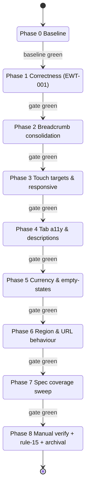

# Technical Documentation — Calculator Test-Fixing

## Architecture Context

The calculator follows the repo's functional core / imperative shell layout. [Repo-grounded]

- **Core (pure)** — `apps/ayokoding-www/src/features/cost-of-living-calculator/core/`: `calc.ts`,
  `role-lookup.ts`, `geo-filter.ts`, `url-state.ts`, `format.ts`, `data/`.
- **Shell (React)** — `.../shell/`: `cost-of-living.tsx`, `savings.tsx`, `min-role.tsx`,
  `geo-filters.tsx`, `city-detail.tsx`, `controls.tsx`, `calculator-breadcrumb.tsx`.
- **Page composition** —
  `apps/ayokoding-www/src/app/[locale]/tools/cost-of-living-calculator/calculator-content.tsx`
  composes the tabs, geo filters, controls, and breadcrumb.
- **Tools index** — `apps/ayokoding-www/src/app/[locale]/tools/page.tsx`.
- **Shared breadcrumb primitive** —
  `apps/ayokoding-www/src/features/navigation/shell/breadcrumb.tsx` (props-driven, uses
  `ChevronRight`, slices off the last segment because the page H1 repeats it). [Repo-grounded]
- **Translations** — `apps/ayokoding-www/src/features/i18n/core/translations.ts` (`en` + `id`).
- **Specs** —
  `specs/apps/ayokoding/behavior/ayokoding-www/gherkin/tools/cost-of-living-calculator.feature`
  (571 lines, 87+ scenarios). [Repo-grounded]

### Component map (concern: where each finding lands)

Component → findings map:

- `calculator-content.tsx` (tabs + composition)
  - `calculator-breadcrumb.tsx` → DWT-B-003/004, UWT-013 (consolidates onto `navigation/shell/breadcrumb.tsx`)
  - `geo-filters.tsx` → UWT-016/DWT-005, UWT-007, UWT-014
  - tab descriptions → UWT-011, UWT-003
  - `savings.tsx` → UWT-004
  - `min-role.tsx` → EWT-001, UWT-006
  - `cost-of-living.tsx` → UWT-012 (abbr)
  - `city-detail.tsx` → UWT-015 (back link)
- `tools/page.tsx` → UWT-009

### Phase delivery flow (concern: gated progression)

## Design Decisions

### DD-1 — Render the min-role divider whenever a baseline is set and qualifying rows exist

Current code (`min-role.tsx` line ~314, and the mobile-cards block ~330) gates the
`qualifying-divider` on `qualifying.length > 0 && nonQualifying.length > 0`. At a zero target every
role qualifies, so `nonQualifying` is empty and the divider vanishes. Fix: gate on
`baselineReady && qualifying.length > 0` (a divider that introduces the below-minimum group is
still only meaningful when there is content, but the existing spec scenario expects the divider as
the minimum marker even with no below-minimum rows). The exact condition is finalized in RED by
making the existing spec scenario pass. [Repo-grounded]

### DD-2 — Consolidate the breadcrumb onto the shared primitive

`calculator-breadcrumb.tsx` is a bespoke 35-line component using literal `/` separators. The shared
`Breadcrumb` (`navigation/shell/breadcrumb.tsx`) is props-driven, uses `ChevronRight`, and **drops
the last segment** (the H1 repeats it). Two reconciliation options:

- **Option A (chosen)**: drive the shared `Breadcrumb` with segments
  `[Home, Tools, <full calc title>]`; since it drops the last segment, the rendered ancestors are
  Home → Tools with chevrons. To satisfy UWT-013 ("final crumb equals the H1"), the shared
  component is extended (or a thin wrapper added) so the current-page crumb is rendered with the
  full title rather than dropped — OR the page keeps showing the H1 as the effective final crumb.
  The chosen behaviour: extend `Breadcrumb` to optionally render the final (current-page) segment,
  controlled by a prop, and pass the full `calcTitle` so the crumb matches the H1 in both locales.
- **Option B (rejected)**: keep the bespoke component but swap `/` for `ChevronRight`. Rejected —
  leaves duplicated breadcrumb logic and does not address DWT-B-004's consolidation goal.

The shared component currently takes `segments: { label; slug }[]` and builds hrefs as
`/${locale}/${slug}`. The calculator needs an explicit per-segment href for the Tools crumb
(`/${locale}/tools`) — this is already expressible via `slug: "tools"`. Home is `slug: ""`. [Repo-grounded]

### DD-3 — Geo-filter selects adopt the shared 44 px control styling

`geo-filters.tsx` selects use `className="rounded border px-2 py-1 text-sm"` (renders ~29 px). The
Savings mobile sort button already uses `min-h-[44px]` as the repo's control height. Fix: align the
three selects with the `libs/web-ui` `Input`/`Select` primitive styling and add `min-h-[44px]`.
Prefer reusing the web-ui `Select` primitive if one exists; otherwise apply the same Tailwind class
set the primitive uses (verify in RED). [Repo-grounded for the current class; primitive reuse
verified during execution]

### DD-4 — Tab descriptions become visible and `#tab-desc-cost` is added

`calculator-content.tsx` has `#tab-desc-savings` and `#tab-desc-min-role` as `sr-only` spans, plus
an `aria-hidden` visible duplicate for non-cost tabs only. The `cost` trigger has no
`aria-describedby` and there is no `#tab-desc-cost`. Fix: add a `tabCostDesc` translation key and a
`#tab-desc-cost` span, wire `aria-describedby="tab-desc-cost"` on the cost trigger, and render all
three descriptions visibly (drop `sr-only`, drop the `aria-hidden` duplicate to avoid double
text). [Repo-grounded]

### DD-5 — OOP `<abbr>` audit

`cost-of-living.tsx` line ~126 already wraps OOP as `<abbr title="out-of-pocket">OOP</abbr>`. The
finding may target a different OOP occurrence (e.g. the mobile card label at line ~283 using
`colHealthcareOOP`). RED locates any OOP rendered as a bare `` and converts it to `<abbr>`;
if all OOP occurrences are already `<abbr>`, the spec scenario simply locks the existing behaviour
(no code change). [Repo-grounded]

### DD-6 — Savings tab active currency

`grossMonthlySalaryLabel` is `"Gross monthly salary (before tax) USD"` / `"... USD"` (id),
hardcoding USD. The calculator's other tabs offer a display-currency selector. Fix: remove the
literal "USD" from the label and surface the active currency — minimum viable is an explicit
active-currency indicator next to the input; if a display-currency selector pattern already exists
on min-role (`displayCurrency` state), mirror it on Savings. Decision finalized in RED. [Repo-grounded]

### DD-7 — Min-role empty-state

`min-role.tsx` always renders the table. The Savings tab already uses a `savings-empty-state`
pattern. Fix: when `baselineSource === "savings_target"` and `targetAmount === 0` (blank), hide the
table and show a `min-role-empty-state` guidance message. [Repo-grounded]

## Assumptions

Resolved autonomously per the user directive; all are documented here as the sensible default.

- **A-1 (UWT-007 region set)**: The dataset's true region set is the nine regions present in
  `core/data/cities.ts`: `africa, americas, asean, asia, europe, japan, mena, nordics, oceania`.
  `REGION_LABELS` in `geo-filters.tsx` already covers all nine. **There is no "expansion" region**
  — UWT-007's "missing expansion group" framing rests on an incorrect Playwright assumption.
  Decision: UWT-007 is treated as a **verification** finding — confirm all nine intended regions
  render in the selector and lock it with a spec scenario; no new region is invented. [Repo-grounded]
- **A-2 (UWT-012 OOP)**: At least one OOP occurrence already uses `<abbr>`. If the audit finds all
  OOP occurrences are already `<abbr>`, the deliverable is the protecting spec scenario only; no
  source change is forced. [Repo-grounded]
- **A-3 (UWT-015 back-link behaviour)**: The intended, predictable behaviour for a city-only deep
  link (`?city=london`) is that the single-city detail back link returns to the **bare calculator**
  (`?tab=cost`, no injected region/country), because the user never explicitly chose that
  region/country. The current code derives `parentScopeParams` from the auto-resolved full state,
  injecting `region=europe&country=gb`. Fix: when the region/country were auto-derived solely from a
  city deep link (not user-selected), the back link omits them. [Judgment call: aligns with WCAG
  3.2.2 predictability and the finding's "Expected" note.]
- **A-4 (UWT-004 currency)**: Surfacing the active currency (indicator + de-hardcoded label) is
  sufficient; a full per-row currency conversion on Savings is out of scope.
- **A-5 (tab descriptions)**: Making descriptions visible plus keeping `aria-describedby` satisfies
  both UWT-003 and UWT-011; the previous `aria-hidden` visible duplicate is removed to avoid
  duplicated text for screen readers.
- **A-6 (currency selector vs indicator)**: Default to the lighter-weight active-currency
  **indicator** on Savings unless an existing reusable selector makes a selector trivial.

## Dependencies

- `libs/web-ui` (`@open-sharia-enterprise/web-ui`) — `Input`, `Label`, `Table*`, and
  `Select`/`Breadcrumb` primitives if present. [Repo-grounded for Input/Label/Table]
- `lucide-react` — `ChevronRight` (already used by the shared breadcrumb). [Repo-grounded]
- Next.js App Router, `next/navigation` (`useSearchParams`, `useRouter`). [Repo-grounded]

## Testing Strategy

`ayokoding-www` is a `-www` site: **unit + e2e only, no integration tier** (the integration target
is a no-op echo per repo policy). Unit tests consume all Gherkin mocked; e2e (`ayokoding-www-fe-e2e`)
proves runtime DOM/measurement findings (touch-target height, overflow, breadcrumb chevrons across
locales). [Repo-grounded]

| Acceptance criterion        | Test level     | Where                                                  |
| --------------------------- | -------------- | ------------------------------------------------------ |
| AC-1 divider (EWT-001)      | unit + e2e     | `min-role.test.tsx`; `ayokoding-www-fe-e2e`            |
| AC-2/AC-3 breadcrumb        | unit + e2e     | `calculator-breadcrumb.test.tsx`; e2e (both locales)   |
| AC-4 touch target           | e2e (measured) | `ayokoding-www-fe-e2e`                                 |
| AC-5 no overflow            | e2e (measured) | `ayokoding-www-fe-e2e` at 320 px                       |
| AC-6 tab descriptions       | unit + e2e     | `calculator-content.test.tsx`                          |
| AC-7 OOP abbr               | unit           | `cost-of-living.test.tsx`                              |
| AC-8 currency               | unit           | `savings.test.tsx`                                     |
| AC-9 min-role empty-state   | unit           | `min-role.test.tsx`                                    |
| AC-10 region set            | unit           | `geo-filters.test.tsx`                                 |
| AC-11 region advisory       | unit           | `geo-filters.test.tsx`                                 |
| AC-12 back link             | unit           | `calculator-content.test.tsx` / `city-detail.test.tsx` |
| AC-13 tools-index link desc | unit           | new `tools-page` test or existing tools test           |

All behaviour changes also add/extend Gherkin in the calculator `.feature` (and a tools-index
`.feature` for AC-13), enforced by `nx run ayokoding-www:specs:coverage`.

## Rollback

Each phase is an independent, committable unit. Revert the offending phase's commit(s); since each
phase passes the full gate before the next begins, rollback leaves the repo coherent.
