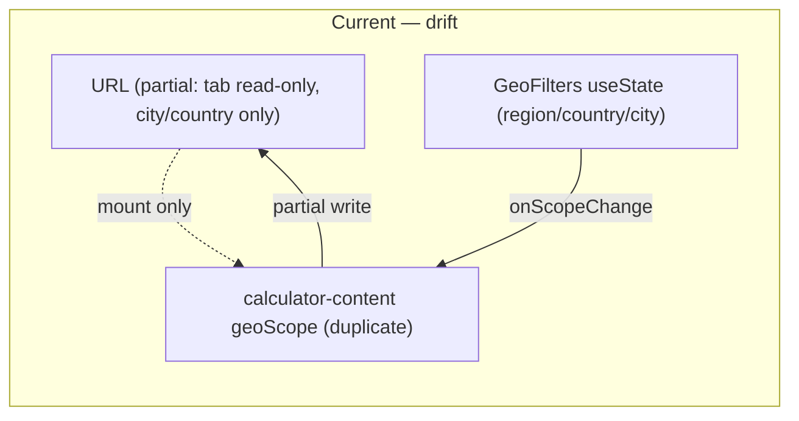
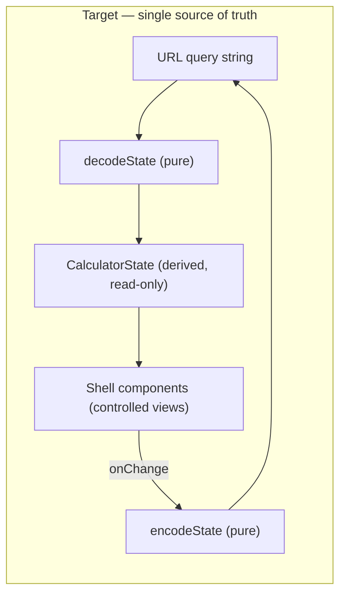
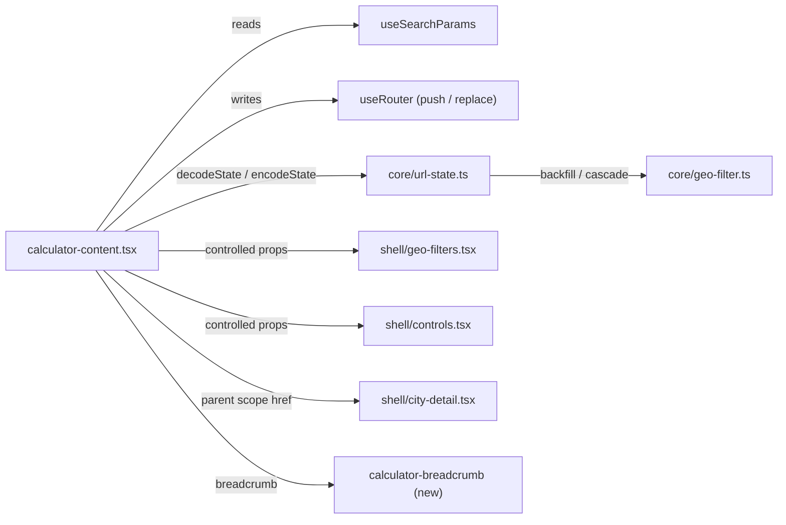
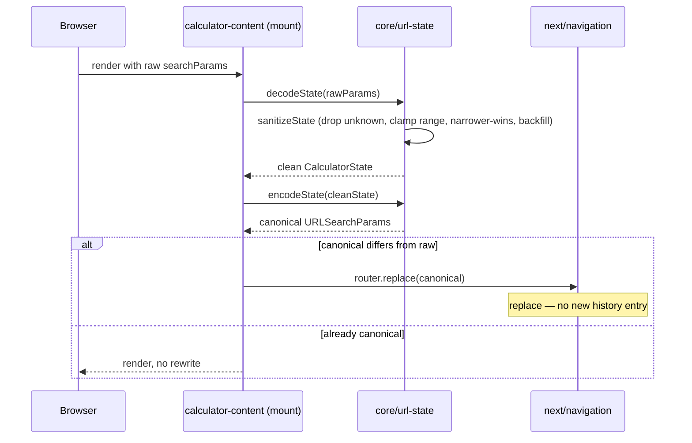
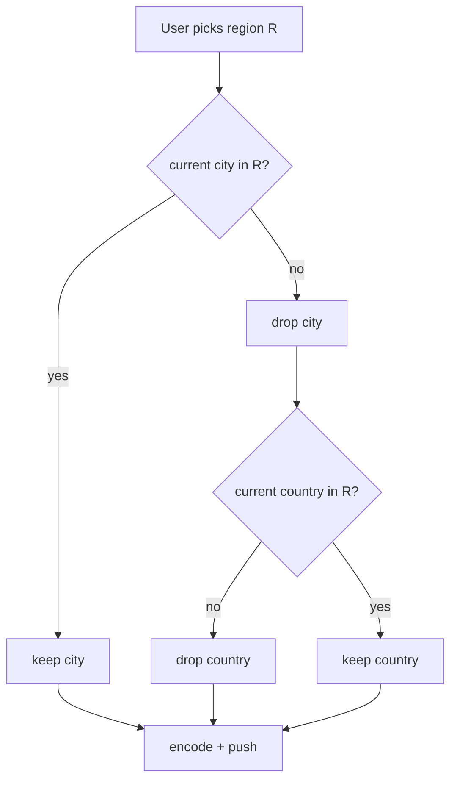
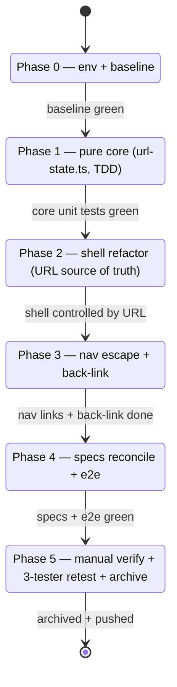

# Technical Documentation — Calculator URL State Reflection

## Architecture Overview

The change follows the repo's **functional core / imperative shell (FCIS)** pattern (not
hexagonal): all pure URL-state logic lives in `core/url-state.ts`; React + Next.js router glue lives
in the shell (`calculator-content.tsx` and the two control components). The URL query string becomes
the **single source of truth** — the shell derives every control's value from `useSearchParams` and
writes changes back via `useRouter`.

### Current vs target state model





### Component interaction (target)



### On-load sanitize + canonicalize sequence



### Cascade-clear decision branch (region change example)



### Phase / delivery flow



## Design Decisions

### DD-1: Hand-rolled pure functions in `core/url-state.ts` (no `nuqs`)

**Decision**: implement `encodeState`, `decodeState`, `sanitizeState`, and the cascade/backfill
helpers as pure TypeScript functions. **Rationale**: FCIS pattern keeps all logic unit-testable
without React; avoids a new npm dependency (macro-decision, dependency-bump policy avoidance); reuses
existing `core/geo-filter.ts`. **Rejected**: `nuqs` (new dependency, hook-bound, harder to unit-test
the cascade logic in isolation).

### DD-2: URL is the single source of truth (collapse the three-way drift)

**Decision**: remove `GeoFilters`' internal `useState` and `calculator-content`'s duplicate
`geoScope`; derive all control values from `decodeState(useSearchParams())`. **Rationale**:
eliminates drift, the root cause of UWT-005 and the partial-restore bugs. Shell components become
controlled (value + onChange props). **Trade-off**: a larger refactor of three files, mitigated by
TDD pinning behavior first.

### DD-3: `router.push` on user change, `router.replace` on canonicalize

**Decision**: user-initiated filter changes call `router.push` (each adds a history entry, so Back
steps through filter states — macro-decision #3). On-mount canonicalization calls `router.replace`
(no history entry — macro-decision #8). **Rationale**: matches the user's stated intent (Back =
undo) while keeping canonicalization invisible to history. **Mitigation for the Back-trap**: add
breadcrumb escape links (DD-4).

### DD-4: Breadcrumb escape links

**Decision**: add a breadcrumb `Home / Tools / Calculator` above the H1 in
`calculator-content.tsx` (new `shell/calculator-breadcrumb.tsx`). Home links to `/[locale]`, Tools to
`/[locale]/tools`. **Rationale**: `router.push` deepens the history stack, so users need an explicit
escape (macro-decision #3). Both routes exist `[Repo-grounded: app/[locale]/page.tsx and
app/[locale]/tools/page.tsx both present]`.

### DD-5: Clean URLs — omit defaults, clamp out-of-range to default

**Decision**: `encodeState` omits any param equal to its default; `decodeState`/`sanitizeState`
rewrite unparseable or out-of-range numerics (e.g. `adults=4`) to the default and drop unknown
enum/id values. **Rationale**: macro-decisions #7 and #8; a pristine calculator yields a bare URL.

### DD-6: Backfill + narrower-wins conflict resolution

**Decision**: selecting/decoding a city backfills its `countryId` and `region` from the dataset via
`core/geo-filter.ts`; on a region↔city conflict the city (narrower) wins and the region is backfilled
from the city. **Rationale**: macro-decisions #4 and #8; keeps dropdowns and URL internally
consistent.

### DD-7: Back-compat param keys + back-link parent scope

**Decision**: retain `tab`/`country`/`city` key names; the city-detail "Back to all cities" link
(`city-detail.tsx` line 96, currently `href="?tab=cost"` `[Repo-grounded]`) encodes the parent geo
scope (region + country, omitting defaults) instead of dropping all state — closes UWT-010.

## The `core/url-state.ts` Module (new)

_New file_: `apps/ayokoding-www/src/features/cost-of-living-calculator/core/url-state.ts`.

Proposed surface (signatures are the design intent; the implementing engineer finalizes types):

```ts
// CalculatorState — the fully-resolved, canonical control state.
export type CalculatorState = {
  tab: "cost" | "savings" | "min-role";
  region: Region | null;
  countryId: string | null;
  cityId: string | null;
  household: Household; // { adults, preschoolKids, schoolKids }
  schoolType: SchoolType;
  area: Area;
};

export const PARAM_KEYS = {
  tab: "tab",
  region: "region",
  country: "country",
  city: "city",
  adults: "adults",
  preschool: "preschool",
  schoolkids: "schoolkids",
  schooltype: "schooltype",
  area: "area",
} as const;

export const DEFAULT_STATE: CalculatorState; // tab=cost, all geo null, adults 1, kids 0, public, center

// Pure decode: raw params -> sanitized canonical state (drops unknown, clamps range, narrower-wins, backfills).
export function decodeState(params: URLSearchParams, dataset: Dataset): CalculatorState;

// Pure encode: state -> URLSearchParams with defaults omitted (clean URL).
export function encodeState(state: CalculatorState): URLSearchParams;

// Pure sanitize/canonicalize (idempotent): sanitizeState(sanitizeState(s)) === sanitizeState(s).
export function sanitizeState(state: CalculatorState, dataset: Dataset): CalculatorState;

// Pure cascade-clear: applying a new geo selection clears now-impossible narrower filters.
export function applyRegionChange(state: CalculatorState, region: Region | null, dataset: Dataset): CalculatorState;
export function applyCountryChange(state: CalculatorState, countryId: string | null, dataset: Dataset): CalculatorState;
export function applyCityChange(state: CalculatorState, cityId: string | null, dataset: Dataset): CalculatorState; // backfills

// Convenience: parent geo scope for the city-detail back link (drops city, keeps region+country).
export function parentScopeParams(state: CalculatorState): URLSearchParams;
```

Reuses `countriesForRegion`, `citiesForCountry`, `scopedCities` from `core/geo-filter.ts`
`[Repo-grounded]` for membership checks in backfill and cascade-clear.

## File Impact

| File                                                                                                                       | Change                                                                               | Type               |
| -------------------------------------------------------------------------------------------------------------------------- | ------------------------------------------------------------------------------------ | ------------------ |
| `core/url-state.ts`                                                                                                        | encode/decode/sanitize/cascade/backfill pure functions                               | _New file_         |
| `core/url-state.unit.test.ts`                                                                                              | unit tests for the pure module (consumes Gherkin scenarios, mocked)                  | _New file_         |
| `shell/calculator-breadcrumb.tsx`                                                                                          | breadcrumb Home / Tools / Calculator                                                 | _New file_         |
| `shell/calculator-breadcrumb.test.tsx`                                                                                     | breadcrumb unit test                                                                 | _New file_         |
| `app/[locale]/tools/cost-of-living-calculator/calculator-content.tsx`                                                      | derive state from URL; push on change; canonicalize on mount; render breadcrumb      | Modified           |
| `shell/geo-filters.tsx`                                                                                                    | become controlled (value + onChange from parent); drop internal `useState`           | Modified           |
| `shell/controls.tsx`                                                                                                       | already controlled for household/school/area; wire onChange to URL writes via parent | Modified (minimal) |
| `shell/city-detail.tsx`                                                                                                    | back link encodes parent geo scope instead of `?tab=cost`                            | Modified           |
| `shell/geo-filters.test.tsx`, `shell/controls.test.tsx`, `shell/calculator-content.test.tsx`, `shell/city-detail.test.tsx` | update for controlled API + new back-link                                            | Modified           |
| `specs/apps/ayokoding/behavior/ayokoding-www/gherkin/tools/cost-of-living-calculator.feature`                              | reconcile stale URL scenarios + add new scenarios                                    | Modified           |
| `apps/ayokoding-www-fe-e2e/src/steps/cost-of-living-calculator.steps.ts`                                                   | step defs for new URL scenarios (round-trip, back-button, deep-link, sanitize)       | Modified           |

`[Repo-grounded]`: all listed existing files confirmed present via the worktree file listing.

## Dependencies

- No new npm dependency.
- Next.js `next/navigation` `useSearchParams` / `useRouter` — already imported in
  `calculator-content.tsx` `[Repo-grounded]`.
- `playwright-bdd` — already the e2e harness for `ayokoding-www-fe-e2e` `[Repo-grounded]`.

## Testing Strategy (tiers for a `-www` app)

Per the repo standard, `-www` sites use **unit (mocked, consumes ALL Gherkin, cacheable) + e2e
(Playwright)**. There is **no integration tier** for `-www` sites (it is a no-op echo) — no
integration step is authored.

| Acceptance-criteria group (prd.md)                               | Test level | Location                                                             |
| ---------------------------------------------------------------- | ---------- | -------------------------------------------------------------------- |
| Pure encode/decode/sanitize/cascade/backfill                     | **Unit**   | `core/url-state.unit.test.ts`                                        |
| Round-trip write-on-change (component)                           | **Unit**   | `shell/calculator-content.test.tsx`, `shell/geo-filters.test.tsx`    |
| Breadcrumb + back-link rendering                                 | **Unit**   | `shell/calculator-breadcrumb.test.tsx`, `shell/city-detail.test.tsx` |
| Deep-link restore, back-button stepping, canonicalize-no-history | **E2E**    | `ayokoding-www-fe-e2e` steps                                         |
| Locale parity (`/id`)                                            | **E2E**    | `ayokoding-www-fe-e2e` steps                                         |

`specs:coverage` (`nx run ayokoding-www:specs:coverage`) validates that every `.feature` scenario has
a consuming step somewhere in the app/e2e source `[Repo-grounded: project.json specs:coverage runs
rhino-cli over the gherkin + app source]`.

### Value-bearing tests (user-facing delivery hardening)

Unit tests assert **actual param strings and resolved state**, not just "URL changed": e.g.
`encodeState(DEFAULT_STATE).toString() === ""`, `decodeState(new URLSearchParams("city=singapore"))`
yields `{ cityId: "singapore", countryId: "sg", region: "asean" }`, and `decodeState("adults=4")`
yields `adults: 1`.

## Specs & Gherkin Two-Path Note

This plan changes observable `apps/` behavior, so per the specs+gherkin two-path rule it MUST update
the companion `.feature` and run `specs:coverage` — both are explicit delivery steps in Phase 4.
This plan is **not** exempt (not a pure refactor — it adds user-facing behavior).

## UI Design Funnel Exemption

This plan is **not net-new UI**: it adds URL serialization behavior and a single breadcrumb to an
existing, already-designed screen, reusing existing primitives (the `<select>`/`SegmentedControl`
controls and standard link styling). No new screen or component layout is introduced beyond the
breadcrumb, which follows standard breadcrumb conventions and existing typography tokens. Per the
UI-design-funnel rule, a screen-level diverge→narrow→select funnel is **not required** for this
behavior-and-breadcrumb change; the breadcrumb's responsive behavior is covered by the existing
mobile/tablet/desktop manual-verification matrix in `delivery.md`. _(If the post-write grill
reclassifies the breadcrumb as net-new UI warranting a funnel, add low-fi alternatives before
execution.)_

## Open Questions (micro-decisions — recommended defaults applied, confirmable in post-write grill)

Resolved in the pre-write validation pass with recommended defaults (AskUserQuestion unavailable in
subagent context; fallback applied per grill-me rules):

1. **Param keys** — `adults`/`preschool`/`schoolkids`/`schooltype`/`area` (short, lowercase). `[Judgment call]`
2. **URL minimality on backfill** — city-only (`?city=singapore`); decode re-derives country+region. `[Judgment call]`
3. **Nav placement** — breadcrumb (Home / Tools / Calculator) above the H1. `[Judgment call]`
4. **Back-link state (UWT-010)** — encode parent geo scope (region+country, drop city), defaults omitted. `[Judgment call]`

None of these block execution; all are reversible and confined to string spellings / placement.
