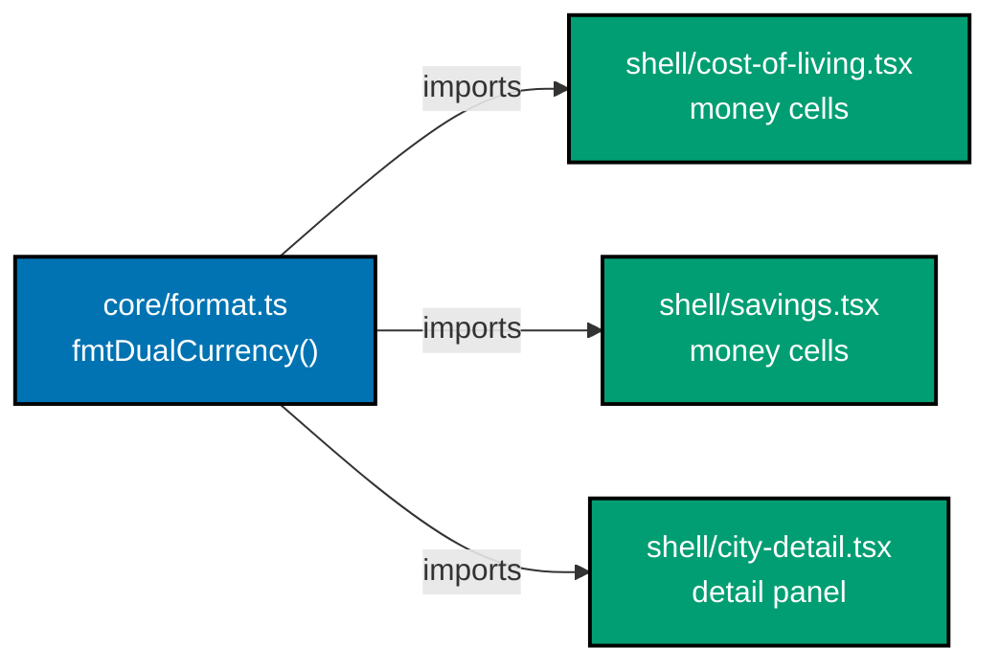

# Technical Documentation — Cost-of-Living Calculator Fix

Root-cause analysis and the chosen fix approach, organised by **fix cluster** (findings sharing a root
cause are fixed once). All paths are under
`apps/ayokoding-www/src/features/cost-of-living-calculator/shell/` unless noted. The engine
(`../core/`) is correct and must not change behaviour.

## Architecture context

Functional-core / imperative-shell feature. The `core/` holds pure calc + formatters; `shell/` holds the
React components. Relevant shell components:

- `calculator-content.tsx` — tab container (`Tabs`/`TabsTrigger`), H1, tab labels.
  _Actual path_: `apps/ayokoding-www/src/app/[locale]/tools/cost-of-living-calculator/calculator-content.tsx`
  (not under `shell/` — it lives in the App Router route directory). The co-located test file
  `calculator-content.test.tsx` IS under `shell/`.
- `cost-of-living.tsx` — Cost-of-living tab: desktop table + mobile cards.
- `savings.tsx` — Savings tab: gross-salary input, desktop table + mobile cards, sort control.
- `min-role.tsx` — Minimum-role tab: baseline selector, ladder table + mobile cards.
- `controls.tsx` — household selectors + `SegmentedControl` (already used for Area/School-type).
- `geo-filters.tsx` — defines `localeName(name, locale)` (line 38) — the canonical locale-name helper.
- `city-detail.tsx` — defines `fmtDualCurrency(local, ccy, usd)` (line 60) and uses `fmtCurrency` from
  `../core/format`.
- i18n: `apps/ayokoding-www/src/features/i18n/core/translations.ts` (`calcTitle` at lines 25 / 179).
- Tools index: `apps/ayokoding-www/src/app/[locale]/tools/page.tsx`.
- Metadata: `apps/ayokoding-www/src/app/[locale]/tools/cost-of-living-calculator/page.tsx`
  (`generateMetadata`).
- Mobile nav drawer: `apps/ayokoding-www/src/features/navigation/shell/sidebar.tsx` (defines the
  hamburger-triggered drawer; contains hardcoded "English Content" item — the UWT-011 fix locus).

## Design ground truth & asset strategy

This is a **fidelity-restoration** plan. The target design already exists as committed hi-fi mockups in
[`plans/done/2026-06-19__ayokoding-www-salary-savings-calculator/assets/`](../../done/2026-06-19__ayokoding-www-salary-savings-calculator/assets):
`ui-cost-of-living-option-a-category-table{,-tablet,-mobile}.png`,
`ui-savings-option-a-net-savings-table{,-tablet,-mobile}.png`,
`ui-min-role-option-a-ladder-table{,-tablet,-mobile}.png`. These are the Tier-2 references for every
restore-fidelity cluster below (dual currency, mobile card country, styled input, segmented control,
locale names). **No net-new screen design** is introduced by those clusters.

The only **net-new** UI is the two empty-state prompts (Cluster F). Lo-fi wireframes for them are in
[`assets/`](./assets); the hi-fi finalists are produced as an explicit delivery step before the empty-state
code lands (see `delivery.md`). All mockups ground in `libs/web-ui` and use design tokens, never raw hex.

---

## Cluster A — Dual-currency display (Critical)

**Findings:** DWT-001 (design), UWT-009 (usability dimension).

**Root cause:** The table components format money with a single-value `fmtNum()`/`fmtCurrency()` path. A
dual-currency formatter, `fmtDualCurrency(localAmount, localCurrency, usdAmount)`, already exists in
`city-detail.tsx:60` but is local to that file and unused by the tables. The cost-of-living and savings
tables therefore render bare local-currency integers with no USD pair and no currency label.

**Fix approach:**

1. Promote `fmtDualCurrency` into `../core/format.ts` (pure, unit-testable) alongside `fmtCurrency`.
2. In `cost-of-living.tsx` and `savings.tsx`, replace every money-cell formatter on Total, Essentials, each
   category (Housing/Food/Transport/Utilities/Healthcare/Childcare/School), Relocation, Liquidity, Net, and
   the savings columns with `fmtDualCurrency(local, cityCurrency, usd)`. Each city row already knows its
   local currency and the USD conversion the engine computes.
3. Apply to desktop tables **and** mobile cards, both locales.
4. Mirror the mockup format: `LOCAL / $USD` (e.g. `Rp 9.4M / $600`).

**Acceptance:** No money cell shows a bare integer; every cell shows local + USD. Locks with new
`fmtDualCurrency` unit tests + a Gherkin scenario (SG-D-001).

**Risk:** Column width at narrow desktop/tablet — verify the table doesn't overflow at 768 px; the mockup
shows the two-value cell fits. Mobile cards stack, so no width risk.

---

## Cluster B — Locale-name leak on `id` desktop (Major)

**Findings:** EWT-002, EWT-003 (exploratory), DWT-008, DWT-009 (design). One root cause.

**Root cause:** Desktop table cells hardcode `.name.en` for country/city instead of the locale-aware
`localeName(name, locale)` (or `name[locale] ?? name.en`). Mobile cards already use the locale path, which
is why the same data renders Indonesian on mobile but English on desktop.

**Fix approach:** Replace `.name.en` with `localeName(name, locale)` in the country/city cells of:

- `cost-of-living.tsx` (~lines 128, 131) — desktop table.
- `savings.tsx` (~lines 150, 153) — desktop table.
- `min-role.tsx` (~lines 133–134) — `RoleRow` best-city/best-country, plus the mobile role cards if they
  also hardcode `.en`.

`localeName` already lives in `geo-filters.tsx:38`; export it (or move to `../core/`) for reuse. English
fallback is preserved for names without an `id` translation.

**Acceptance:** `id` desktop tables show Indonesian names where they exist; English fallback otherwise. Locks
with SG-D-004 scenarios.

---

## Cluster C — Tool identity (Critical)

**Findings:** DWT-004 (design), UWT-001 (usability), UWT-013 (id title).

**Root cause:** The tool was renamed to "Cost of Living Calculator" (route + `generateMetadata` title) but
the H1 translation key `calcTitle` still carries the original "Salary Savings Calculator" / "Kalkulator
Tabungan Gaji". The `<title>` is also English-only on `id`.

**Fix approach:**

1. `translations.ts`: `calcTitle` → "Cost of Living Calculator" (en, line 25) / "Kalkulator Biaya Hidup"
   (id, line 179).
2. Localize the browser title: route the locale-aware tool name through `generateMetadata` so `/id/` emits
   "Kalkulator Biaya Hidup | AyoKoding" (closes UWT-013).

**Acceptance:** H1, `<title>`, and active tab agree per locale (SG-D-003).

---

## Cluster D — Unstyled controls → design-system primitives (Major)

**Findings:** DWT-003 (gross-salary input), DWT-006 (baseline selector), UWT-006 (baseline label), UWT-008
(sort control), DWT-007 (sort control styling).

**Root cause:** Controls were hand-rolled as bare HTML (`<input>`, `<select>`, header `<button>`) instead of
reusing `libs/web-ui` primitives, so they inherit no border/radius/padding/affordance tokens.

**Fix approach:**

1. **Gross-salary input** (`savings.tsx` ~93–104): replace the raw `<label>/<input>` with `<Label>` +
   `<Input type="number">` from `@open-sharia-enterprise/web-ui`.
2. **Baseline selector** (`min-role.tsx` ~163–175): replace the `<select id="baseline-source-select">` with
   the existing `SegmentedControl` (the same primitive used for Area/School-type), three options. Pair with a
   plain-language label + one-line inline help ("Choose whether to enter a savings target manually or pull it
   from the Savings tab") to also close UWT-006.
3. **Sort control** (`savings.tsx` ~121–129): wrap in `Button variant="ghost" size="sm"`, add
   `aria-label="Sort by essential savings"` and a hover affordance (closes UWT-008 + DWT-007).

**Acceptance:** Controls render with design-token border/radius/padding; baseline is a segmented control;
sort button is visibly interactive and labelled. (SG-D Input/segmented scenarios.)

---

## Cluster E — Tab labels (Major)

**Findings:** UWT-002 (usability), DWT-005 (design).

**Root cause:** The descriptive sub-label `` is placed **inside** `<TabsTrigger>`, so
the trigger's `textContent`/accessible name fuses name + description ("SavingsSee how much you'd save").

**Fix approach:** In `calculator-content.tsx` (~122–134), move the description out of the trigger's visible
text. Keep the description for assistive tech via `aria-describedby` pointing at a sibling element, or set the
trigger's `aria-label` to the clean name. The visible label is the name only.

**Acceptance:** Each trigger's visible text and accessible name is the label only; description still
announced via `aria-describedby` (SG-D tab scenario + USS-004).

---

## Cluster F — Empty states (Major, sev-4) — NET-NEW UI

**Findings:** UWT-003 (Savings), UWT-007 (Minimum-role).

**Root cause:** Both tabs compute and render their tables against blank inputs (salary/target = 0), producing
all-negative or zero rows indistinguishable from a real result. There is no empty-state branch.

**Fix approach:** Add an empty-state branch to each tab's render:

- **Savings** (`savings.tsx`): when gross salary is empty/zero, render an instructional prompt
  ("Enter your gross monthly salary above to see your savings per city") instead of the table.
- **Minimum-role** (`min-role.tsx`): when the savings target is empty/zero, render
  ("Enter a monthly savings target above to see which roles would meet it").

Build both from `libs/web-ui` primitives (Card/text). Localize both strings (en + id). This is the only
net-new design — see [`assets/`](./assets) for lo-fi wireframes; hi-fi finalists are a delivery step.

**Acceptance:** No negative figures before input; prompt disappears once input is valid (USS-001/002, the
PRD empty-state scenarios).

---

## Cluster G — Mobile cost card country (Major)

**Findings:** EWT-001 (exploratory), DWT-002 (design).

**Root cause:** The mobile card header in `cost-of-living.tsx` (~line 219) renders only the city link + the
healthcare badge; no country element. The savings mobile card (`savings.tsx` ~line 202) already shows the
country and is the reference pattern.

**Fix approach:** Add a country link (`localeName(country, locale)`) beside the city link in the cost card
header, mirroring the savings card. Closes EWT-001/DWT-002 and feeds SG-D-002.

---

## Cluster H — Area-toggle feedback (Major)

**Finding:** UWT-005.

**Root cause:** Switching Area re-renders the table silently; only the toggle pill changes state.

**Fix approach:** Add a brief table transition (row/value highlight or fade) on area change, and/or a small
"Rural estimates" caption near the table header that updates with the selection. Keep within the Doherty
threshold (already fast). (USS-003.)

---

## Cluster I — Responsive 320 px household controls (Major/Trivial)

**Findings:** UWT-010 (usability), DWT-011 (design).

**Root cause:** The household selector container is `flex flex-wrap`; at 320 px a label and its `<select>`
wrap onto different lines, breaking the label↔input association.

**Fix approach:** In `controls.tsx`, wrap each label+select as a single `flex items-center gap-1` (or
`inline-flex`) unit so a pair wraps intact; below ~360 px stack each pair full-width.

---

## Cluster J — `id` Area label length (Minor)

**Finding:** DWT-010.

**Root cause:** id `labelArea` = "Wilayah tempat tinggal" (22 chars) forces the segmented control to wrap at
≤375 px; the mockup uses short "Area".

**Fix approach:** Shorten the id `labelArea` (e.g. "Area"/"Lokasi") in `translations.ts` and/or apply
`whitespace-nowrap`.

---

## Cluster K — Tools index raw i18n keys (Major, sev-4)

**Finding:** UWT-004.

**Root cause:** `/[locale]/tools/page.tsx` references translation keys `toolsPageTitle` / `toolsPageCalcLink`
that have no entries, so the keys render literally.

**Fix approach:** Add `toolsPageTitle` / `toolsPageCalcLink` entries in `translations.ts` for en + id; verify
the page renders localized text on both locales.

---

## Cluster L — Locale URL casing (Minor)

**Finding:** UWT-012.

**Root cause:** `/EN/…` doesn't match the locale route segment and falls through to 404 with no
normalization.

**Fix approach:** Add a Next.js middleware redirect (301/302) that lowercases the locale path segment before
routing. Verify `/EN/…` → `/en/…`.

---

## Cluster M — City-detail visible section labels (Minor)

**Finding:** EWT-004.

**Root cause:** `city-detail.tsx` section labels ("Monthly expenses", "Relocation costs") are `aria-label`
only — invisible to sighted users.

**Fix approach:** Add a visible heading element per section using the existing localized
`sectionMonthlyExpenses`/`sectionRelocationCosts` keys (preferred), keeping the aria association. (Or, if the
team prefers the current visual, update the spec instead — decided in delivery.)

---

## Cluster N — HSTS header (Minor, verify-only)

**Finding:** EWT-005.

**Root cause:** No `Strict-Transport-Security` on the localhost HTTP dev server (expected — HSTS is
HTTPS-only).

**Fix approach:** **Verify only.** Confirm the Vercel/prod config (or `next.config.ts` headers) sets HSTS in
production; add it if absent. No localhost change.

---

## Cluster O — Mobile nav drawer (Minor)

**Finding:** UWT-011.

**Root cause:** The mobile nav drawer (`apps/ayokoding-www/src/features/navigation/shell/sidebar.tsx`)
renders a single hardcoded "English Content >" item instead of the top-level site navigation links.
The label "English Content" is English-only; the id locale still shows the English string, violating
WCAG 3.2.3 Consistent Navigation and H6 locale-consistency. The drawer implementation skips the root
locale node (comment in `sidebar.tsx` line ~14 reads "skip the root locale node"), which strips all
nav children and leaves only the fallback English content entry.

**Fix locus:** `apps/ayokoding-www/src/features/navigation/shell/sidebar.tsx` — populate the drawer
with the top-level nav link tree (mirroring the desktop nav), localize the drawer label using the
i18n system so it renders in the current locale.

**Fix approach:**

1. Remove or restructure the "skip root locale node" logic so the drawer renders the same top-level
   nav items as the desktop navigation.
2. Replace the hardcoded "English Content" label with a localized string from
   `apps/ayokoding-www/src/features/i18n/core/translations.ts` (add key if absent).
3. Test: `apps/ayokoding-www/src/features/navigation/shell/sidebar.test.tsx` (_New test_) — assert
   that the drawer on both `en` and `id` locales shows top-level nav links and the label is
   locale-appropriate.

**Acceptance:** Mobile nav drawer mirrors desktop nav; id locale label is in Indonesian; no
"English Content" hardcoded string visible on either locale.

---

## Dual-currency formatter propagation (architecture diagram)

The diagram below shows how `fmtDualCurrency` flows after promotion from `city-detail.tsx` to
`core/format.ts` (Cluster A):

---

## Testing strategy

- **Unit** (Vitest): new `fmtDualCurrency` tests in `core/format`; `localeName` reuse; empty-state branch
  predicates. Co-located `*.test.tsx`/`*.test.ts`.
- **Specs/Gherkin**: fold the accepted `SG-###`/`SG-D-###`/`USS-###` scenarios into
  `specs/apps/ayokoding/behavior/ayokoding-www/gherkin/tools/cost-of-living-calculator.feature`; run
  `nx run ayokoding-www:specs:coverage`.
- **Manual/behavioural**: Playwright/browser re-check at 320/375/768/1024/1280/1440 px, en + id.
- **Rule-15 retest**: re-run the three live-site testers after fixes land and visual sign-off is recorded;
  append findings to `delivery.md` and fix before archival.
