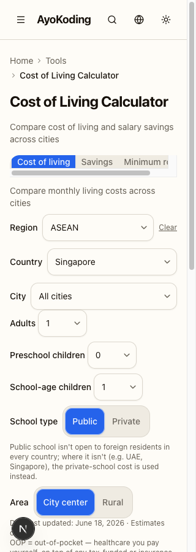
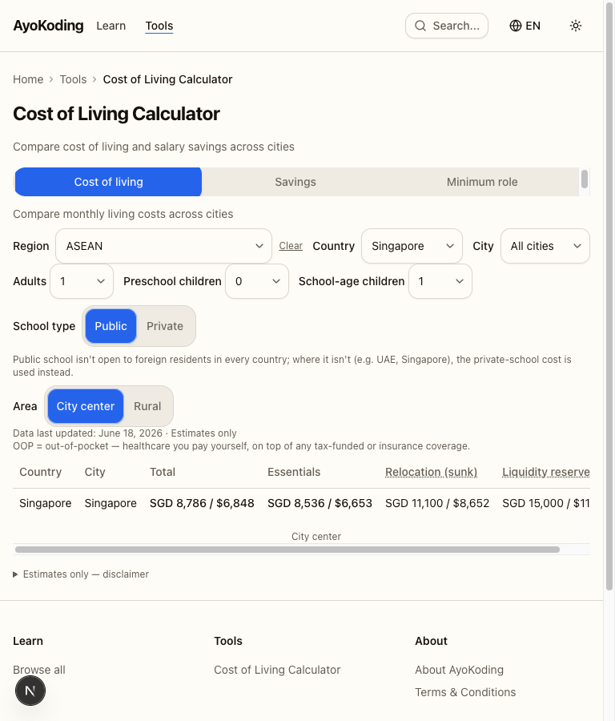
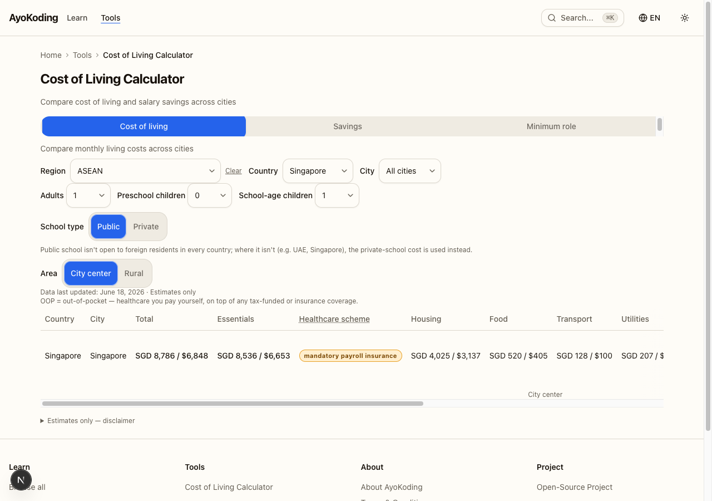
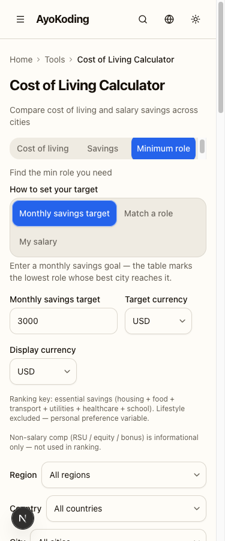
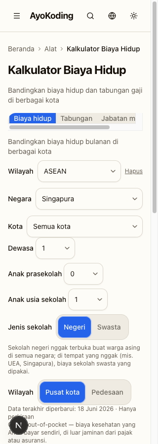
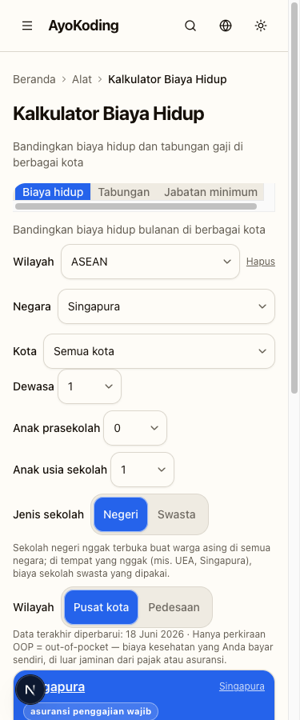
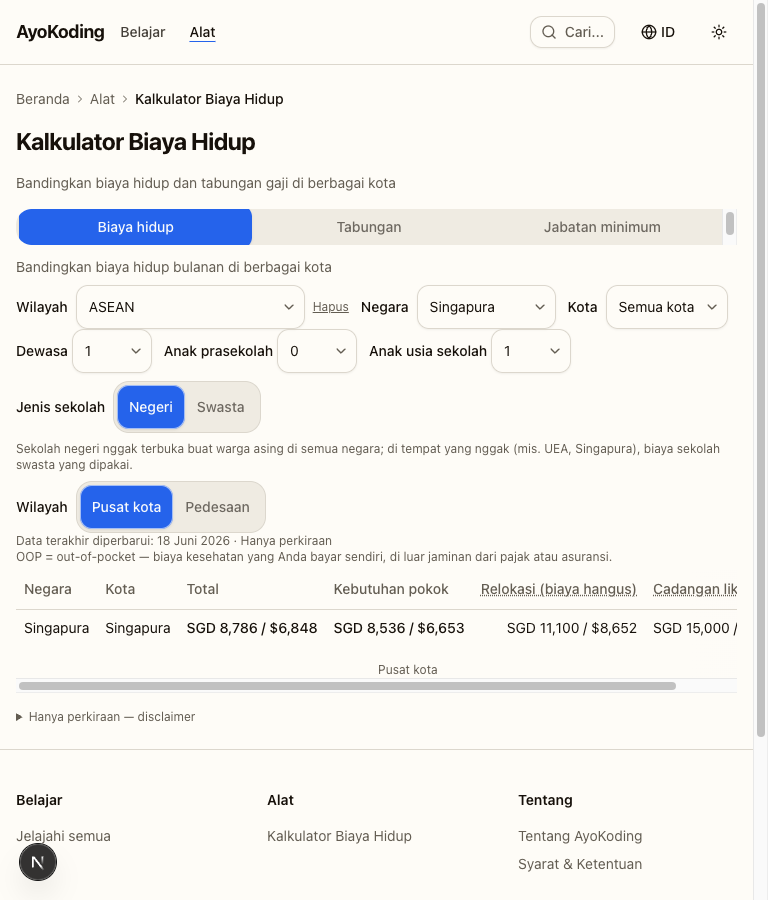
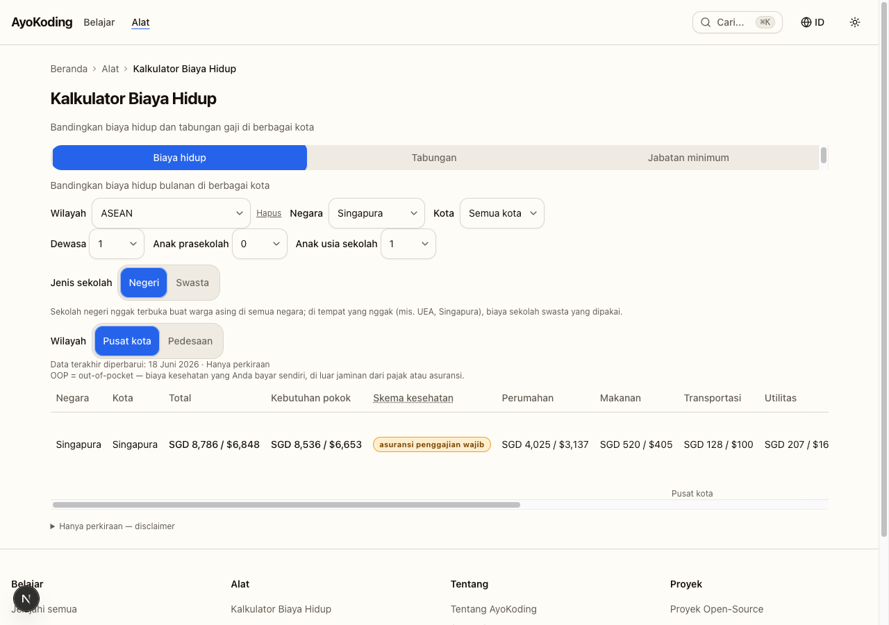
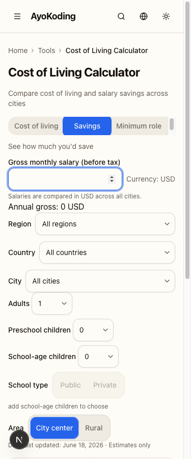

# Delivery Checklist — Calculator UX Hardening

TDD-shaped (RED → GREEN → REFACTOR). Each code step names a file path, a verbatim command, and an
acceptance criterion. Steps are tagged `[AI]` (autonomous) or `[HUMAN]` (needs a human decision). Phase 0
runs first. Phases are gated: do not start a phase until the prior phase's gate is green. Every behavioural
fix lands its reproducing test in the same commit (regression-test mandate); specs are folded in Phase 8
(feature-change-completeness).

**App**: `apps/ayokoding-www` · **Feature**: `src/features/cost-of-living-calculator/` + the route
`src/app/[locale]/tools/cost-of-living-calculator/`.

> **Legend** — `[AI]`: an agent performs the step (the default; unmarked steps are `[AI]`).
> `[HUMAN]`: only a human can do it (physical action, out-of-band approval, real-secret or
> privileged-credential handling). `[AI+HUMAN]`: agent prepares, human approves or finishes.
>
> **Phase Gate** — every phase ends with a `### Phase N Gate`: a must-pass verification
> checklist plus a **Pause Safety** note (the safe-to-stop state after the phase and the
> single command to resume). A phase is **not complete until its gate is green**; do not start
> phase N+1 while any check in phase N's gate is failing.

Common commands:

- Unit: `npx nx run ayokoding-www:test:unit`
- Typecheck: `npx nx run ayokoding-www:typecheck`
- Lint: `npx nx run ayokoding-www:lint`
- Specs coverage: `npx nx run ayokoding-www:specs:coverage`

---

## Worktree

This plan executes **directly on `main`** (no separate worktree), per explicit user directive. All
changes are committed directly to `origin/main` following Trunk Based Development.

> **Deliberate deviation**: the optional manual pre-provisioning path
> (`claude --worktree ayokoding-www-calculator-ux-hardening`) is intentionally **not** used here — the
> user directed in-place execution on `main`. See the
> [Worktree Path Convention](../../../repo-governance/conventions/structure/worktree-path.md) and
> [Plans Organization Convention](../../../repo-governance/conventions/structure/plans.md) for the
> standard worktree-based path when a future execution wants isolation.

---

## Phase 0 — Baseline (gate: all green before any fix) `[AI]`

- [x] 0.1 `[AI]` Confirm clean tree + dev server reachable (`curl -s -o /dev/null -w "%{http_code}" http://localhost:3101/en/tools/cost-of-living-calculator` → 200).
- [x] 0.2 `[AI]` `npm install` and `npm run doctor -- --fix` (toolchain converged).
- [x] 0.3 `[AI]` Baseline: `npx nx run ayokoding-www:typecheck && npx nx run ayokoding-www:test:unit && npx nx run ayokoding-www:specs:coverage` — record the baseline pass counts. Resolve any pre-existing failure before proceeding.

> **Implementation notes** — 2026-06-22 · Status: DONE. Tree clean, server 200. Work branch = `main`,
> in sync with `origin/main` (`d23d06f39`). Baseline: typecheck PASS; `test:unit` **2378 passing (78
> files)**; `specs:coverage` **18 specs / 204 scenarios / 751 steps — all covered**. No pre-existing
> failures.

### Phase 0 Gate

> All checks below must pass before starting Phase 1.

- [x] `[AI]` `npx nx run ayokoding-www:typecheck` — exits 0.
- [x] `[AI]` `npx nx run ayokoding-www:test:unit` — exits 0, baseline pass count recorded (2378).
- [x] `[AI]` `npx nx run ayokoding-www:specs:coverage` — exits 0.

> **Pause Safety**: Baseline recorded. Toolchain confirmed. Safe to stop. To resume: rerun 0.3 and
> compare pass counts.

---

## Phase 1 — Tab descriptions (EWT-001 ≡ DWT-001, Major) `[AI]`

> **Implementation notes** — 2026-06-22 · DONE (swe-typescript-dev). Fixed the fused
> `text-muted-foregroundhidden` class; descriptions now build their className via a `tabDescClass(tab)`
> helper using `cn()`, so only the active tab's description renders. New `calculator-content.test.tsx`
> tests assert inactive descriptions carry `hidden` + a guard against the fused class. Green.

File: `apps/ayokoding-www/src/app/[locale]/tools/cost-of-living-calculator/calculator-content.tsx`
(L263/270/276) + test `apps/ayokoding-www/src/features/cost-of-living-calculator/shell/calculator-content.test.tsx`.

- [x] 1.1 **RED** `[AI]` Add a unit test asserting an inactive tab description carries the `hidden` class
      (and the active one does not).
      File: `apps/ayokoding-www/src/features/cost-of-living-calculator/shell/calculator-content.test.tsx`.
      Cmd: `npx nx run ayokoding-www:test:unit`. AC: test fails against current `text-muted-foregroundhidden`.
      **Gherkin (binds) →** "Only the active tab description is visible"

      ```gherkin
      Scenario: Only the active tab description is visible
        Given the cost-of-living calculator is open with the "Cost of living" tab active
        When the page is rendered
        Then the "Cost of living" tab description is visible
        And the "Savings" tab description is not visible
        And the "Minimum role" tab description is not visible
      ```

- [x] 1.2 **GREEN** `[AI]` Insert the missing space in
      `apps/ayokoding-www/src/app/[locale]/tools/cost-of-living-calculator/calculator-content.tsx`:
      `` `mt-1 text-sm text-muted-foreground ${activeTab === "…" ? "" : "hidden"}` `` on all three lines.
      Cmd: `npx nx run ayokoding-www:test:unit`. AC: 1.1 passes; only the active description is visible.
- [x] 1.3 **REFACTOR** `[AI]` Extract the description className to a small `cn(...)` helper / `clsx` so the
      bug class cannot recur in
      `apps/ayokoding-www/src/app/[locale]/tools/cost-of-living-calculator/calculator-content.tsx`.
      Cmd: `npx nx run ayokoding-www:typecheck`. AC: typecheck clean, behaviour unchanged.

### Phase 1 Gate

> All checks below must pass before starting Phase 2.

- [x] `[AI]` `npx nx run ayokoding-www:test:unit` — exits 0, new test 1.1 passing.
- [x] `[AI]` `npx nx run ayokoding-www:typecheck` — exits 0.

> **Pause Safety**: Tab-description regression fixed and guarded. Safe to stop. To resume:
> `npx nx run ayokoding-www:test:unit && npx nx run ayokoding-www:typecheck`.

---

## Phase 2 — Accessibility: touch targets + ARIA state (EWT-002, EWT-005, UWT-008, UWT-011) `[AI]`

> **Implementation notes** — 2026-06-22 · DONE (swe-typescript-dev). `SegmentedControl` radios now carry
> `min-h-[44px]` + centring (EWT-002); tab triggers use a shared `tabTriggerClass` with `min-h-[44px]`.
> Active option gets a non-colour `ring-1 ring-inset` indicator on top of the existing `aria-checked`
> radiogroup pattern (UWT-008). School-type hint gets `id="school-type-hint"`; disabled Public/Private
> buttons get `aria-describedby` + `aria-disabled` (UWT-011). Savings sort `<th>` now sets `aria-sort`
> ascending/descending (EWT-005). New tests in controls/savings/calculator-content. test:unit + lint green.

Files: `apps/ayokoding-www/src/features/cost-of-living-calculator/shell/controls.tsx`,
`apps/ayokoding-www/src/features/cost-of-living-calculator/shell/min-role.tsx`,
`apps/ayokoding-www/src/features/cost-of-living-calculator/shell/savings.tsx`,
route `apps/ayokoding-www/src/app/[locale]/tools/cost-of-living-calculator/calculator-content.tsx`;
tests alongside.

- [x] 2.1 **RED** `[AI]` Test: every segmented-radio button + tab trigger has `min-h-[44px]` (extend the
      existing `apps/ayokoding-www/src/features/cost-of-living-calculator/shell/controls.test.tsx`
      radiogroup test to cover tab triggers + salary-currency + 28px buttons).
      Cmd: `npx nx run ayokoding-www:test:unit`. AC: fails (28–29px controls).
      **Gherkin (binds) →** "Interactive controls meet the 44px touch target"

      ```gherkin
      Scenario: Interactive controls meet the 44px touch target
        Given the calculator at 375px
        When the page is rendered
        Then every tab trigger is at least 44px tall
        And every school-type, area, and salary-currency segmented radio is at least 44px tall
      ```

- [x] 2.2 **GREEN** `[AI]` Add `min-h-[44px]` + centring to the `SegmentedControl` primitive in
      `apps/ayokoding-www/src/features/cost-of-living-calculator/shell/controls.tsx` (so school-type/area/
      baseline/salary-currency inherit) and ensure tab triggers reach 44px at mobile. AC: 2.1 passes.
- [x] 2.3 **RED** `[AI]` Test: Area toggle options expose active state via ARIA (`aria-checked` if
      radiogroup, else `aria-pressed`) + a non-colour active indicator class in
      `apps/ayokoding-www/src/features/cost-of-living-calculator/shell/controls.test.tsx`.
      Cmd: `npx nx run ayokoding-www:test:unit`. AC: fails (`aria-pressed:null`).
      **Gherkin (binds) →** "Area toggle exposes its pressed state"

      ```gherkin
      Scenario: Area toggle exposes its pressed state
        Given "City center" is the active area
        When the page is rendered
        Then the "City center" button has aria-pressed "true"
        And the "Rural" button has aria-pressed "false"
      ```

- [x] 2.4 **GREEN** `[AI]` Reconcile the segmented control to one ARIA pattern in
      `apps/ayokoding-www/src/features/cost-of-living-calculator/shell/controls.tsx` and emit the state
      attribute + a non-colour active indicator (ring/underline). AC: 2.3 passes. (Implements USS-003.)
- [x] 2.5 **RED** `[AI]` Test: disabled school-type buttons have `aria-disabled="true"` +
      `aria-describedby="school-type-hint"`, and the hint element has `id="school-type-hint"` in
      `apps/ayokoding-www/src/features/cost-of-living-calculator/shell/controls.test.tsx`.
      Cmd: `npx nx run ayokoding-www:test:unit`. AC: fails.
      **Gherkin (binds) →** "Disabled school-type buttons announce the prerequisite"

      ```gherkin
      Scenario: Disabled school-type buttons announce the prerequisite
        Given "School-age children" is 0
        When the page is rendered
        Then the "Public" and "Private" buttons are aria-disabled
        And their accessible description names the "add school-age children" prerequisite
      ```

- [x] 2.6 **GREEN** `[AI]` Wire `id` on the hint + `aria-describedby`/`aria-disabled` on both disabled
      buttons in `apps/ayokoding-www/src/features/cost-of-living-calculator/shell/controls.tsx`.
      AC: 2.5 passes. (Implements USS-004.)
- [x] 2.7 **RED** `[AI]` Test: the sortable savings `<th>` has `aria-sort` reflecting
      none/ascending/descending.
      File: `apps/ayokoding-www/src/features/cost-of-living-calculator/shell/savings.test.tsx`.
      Cmd: `npx nx run ayokoding-www:test:unit`. AC: fails.
      **Gherkin (binds) →** "Sortable savings column exposes aria-sort"

      ```gherkin
      Scenario: Sortable savings column exposes aria-sort
        Given the Savings tab table is shown
        When the page is rendered
        Then the sortable "Savings after essentials" column header has an aria-sort value
      ```

- [x] 2.8 **GREEN** `[AI]` Add `aria-sort` to the sort header `<th>` in
      `apps/ayokoding-www/src/features/cost-of-living-calculator/shell/savings.tsx`. AC: 2.7 passes.
- [x] 2.9 **REFACTOR** `[AI]` Dedupe any repeated 44px/ARIA wiring into the primitive in
      `apps/ayokoding-www/src/features/cost-of-living-calculator/shell/controls.tsx`.
      Cmd: `npx nx run ayokoding-www:lint`. AC: lint clean.

### Phase 2 Gate

> All checks below must pass before starting Phase 3.

- [x] `[AI]` `npx nx run ayokoding-www:test:unit` — exits 0, all new 2.1/2.3/2.5/2.7 tests passing.
- [x] `[AI]` `npx nx run ayokoding-www:lint` — exits 0.

> **Pause Safety**: All accessibility touch-target and ARIA-state fixes applied and tested. Safe to stop.
> To resume: `npx nx run ayokoding-www:test:unit && npx nx run ayokoding-www:lint`.

---

## Phase 3 — Foreigner public-school flag (EWT-003, UWT-002, DWT-006) `[AI]`

> **Implementation notes** — 2026-06-22 · DONE (swe-typescript-dev). New shared
> `shell/foreigner-school-flag.tsx` (`ForeignerSchoolFlag`) — a warning-tone `Badge` (`variant="outline"`,
> `hue="honey"`, `normal-case`) used by BOTH the table (cost-of-living.tsx, desktop + mobile card) and
> city-detail.tsx, so they can't drift; this also adds the previously-missing
> `school-foreigner-flag-<cityId>` testid to city-detail (EWT-003). New i18n key
> `publicSchoolForeignerFlagBadge` — en "Private — public not open to foreigners" / id "Swasta — negeri
> tak terbuka untuk WNA" (UWT-002 wording + DWT-006 hierarchy). 8 new tests. The `[HUMAN]` badge visual
> check is performed in Phase 9 (Playwright, both views × both locales).

Files: `apps/ayokoding-www/src/features/cost-of-living-calculator/shell/cost-of-living.tsx`,
`apps/ayokoding-www/src/features/cost-of-living-calculator/shell/city-detail.tsx`,
`apps/ayokoding-www/src/features/i18n/core/translations.ts`; tests + steps.
See `assets/ui-foreigner-flag-low-fi.md`.

- [x] 3.1 **RED** `[AI]` Test: city-detail renders
      `data-testid="school-foreigner-flag-<cityId>"` when the fallback applies (extend
      `apps/ayokoding-www/src/features/cost-of-living-calculator/shell/city-detail.test.tsx` + the fe-step
      for Singapore). AC: fails (testid absent).
      **Gherkin (binds) →** "Foreigner-school flag is clear, styled, and present in both views"

      ```gherkin
      Scenario: Foreigner-school flag is clear, styled, and present in both views
        Given a city whose country does not open public school to foreigners
        And school-age children >= 1 and school type "public"
        When the page is rendered
        Then the cost-of-living table school cell shows a clearly-worded private-fallback flag
        And the flag is visually distinct from ordinary caption text
        And the city-detail school row renders the school-foreigner-flag-<cityId> testid
      ```

- [x] 3.2 **GREEN** `[AI]` Add the flag span to the city-detail school row when `schoolForeignerFallback`
      in `apps/ayokoding-www/src/features/cost-of-living-calculator/shell/city-detail.tsx`.
      AC: 3.1 passes (fixes EWT-003).
- [x] 3.3 **RED** `[AI]` Test: the flag uses the reworded localized label (new i18n keys) and a
      warning-tone class/`Badge` (assert `text-warning`/badge testid, not `text-muted-foreground`);
      both locales in `apps/ayokoding-www/src/features/cost-of-living-calculator/shell/city-detail.test.tsx`.
      Cmd: `npx nx run ayokoding-www:test:unit`. AC: fails.
- [x] 3.4 **GREEN** `[AI]` Add new i18n keys to
      `apps/ayokoding-www/src/features/i18n/core/translations.ts`
      (en "Private — public not open to foreigners" / id "Swasta — negeri tak terbuka untuk WNA"),
      render via `Badge`/warning token in
      `apps/ayokoding-www/src/features/cost-of-living-calculator/shell/cost-of-living.tsx` table +
      `apps/ayokoding-www/src/features/cost-of-living-calculator/shell/city-detail.tsx`.
      AC: 3.3 passes (UWT-002 + DWT-006).
- [x] 3.5 **REFACTOR** `[AI]` Factor the flag into one shared sub-component used by both
      `apps/ayokoding-www/src/features/cost-of-living-calculator/shell/cost-of-living.tsx` +
      `apps/ayokoding-www/src/features/cost-of-living-calculator/shell/city-detail.tsx` so they cannot drift.
      Cmd: `npx nx run ayokoding-www:test:unit`. AC: green.

### Phase 3 Gate

> All checks below must pass before starting Phase 4.

- [x] `[AI]` `npx nx run ayokoding-www:test:unit` — exits 0, all new 3.1/3.3 tests passing.
- [x] `[HUMAN]` Manual check: Singapore/Dubai/Jakarta show the badge in both views + both locales; Berlin
      shows none. Observable resume signal: badge visually present in browser; verify with dev server
      at `http://localhost:3101/en/tools/cost-of-living-calculator`.

> **Pause Safety**: Foreigner-school flag parity fixed across table + city-detail, both locales. Safe to
> stop. To resume: `npx nx run ayokoding-www:test:unit`.

---

## Phase 4 — Jargon glosses & i18n labels (EWT-004, UWT-001/003/004/009/010/012/013/014) `[AI]`

> **Implementation notes** — 2026-06-22 · DONE (swe-typescript-dev). OOP `<abbr>` titles now localized via
> `t(locale,"healthcareOutOfPocket")` in cost-of-living.tsx (×2) + controls.tsx (×1, root-cause extra)
> (EWT-004/UWT-014). "Baseline source" → "How to set your target" / "Cara menetapkan target" (UWT-001).
> P25/Median/P75 + Non-salary-comp + ic/mgmt now carry `title` glosses / localized full words
> (UWT-010/003/013). Region display names localized via `regionLabel(region, locale)` with serialized
> keys kept English for URL stability; MENA/Nordics expanded (UWT-004). Healthcare scheme badges given
> `normal-case` (root cause was the Badge primitive's base `uppercase`) (UWT-012). **UWT-009 = ALREADY
> ADDRESSED** — Relocation(sunk)/Liquidity-reserve `<abbr title>` already present; no code change. 12 new
> i18n keys (en+id), new tests in cost-of-living/min-role/geo-filters + 2 fe-step label updates.

Files: `apps/ayokoding-www/src/features/cost-of-living-calculator/shell/cost-of-living.tsx`,
`apps/ayokoding-www/src/features/cost-of-living-calculator/shell/min-role.tsx`,
`apps/ayokoding-www/src/features/cost-of-living-calculator/shell/geo-filters.tsx`,
`apps/ayokoding-www/src/features/i18n/core/translations.ts`.

- [x] 4.1a **RED** `[AI]` Write failing test: the id-locale OOP header `title` attribute equals
      `t(locale, "healthcareOutOfPocket")`, not the literal `"out-of-pocket"`.
      File: `apps/ayokoding-www/src/features/cost-of-living-calculator/shell/cost-of-living.test.tsx`.
      Cmd: `npx nx run ayokoding-www:test:unit`. AC: test fails (title is literal English string).
      **Gherkin (binds) →** "Jargon table headers carry an accessible explanation"

      ```gherkin
      Scenario: Jargon table headers carry an accessible explanation
        Given the calculator is open
        When the page is rendered
        Then the "Healthcare (OOP)" header has a title explaining out-of-pocket (localized)
        And the "Relocation (sunk)" and "Liquidity reserve" headers carry explanatory titles
        And the "P25"/"Median"/"P75" headers carry percentile explanations
        And the "Track" column abbreviations ic/mgmt are expanded or carry abbr titles
      ```

- [x] 4.1b **GREEN** `[AI]` Fix `apps/ayokoding-www/src/features/cost-of-living-calculator/shell/cost-of-living.tsx:131`
      and `:298` — change `title="out-of-pocket"` to `title={t(locale, "healthcareOutOfPocket")}`.
      Cmd: `npx nx run ayokoding-www:test:unit`. AC: 4.1a passes; id locale shows "bayar sendiri" (EWT-004/UWT-014).
- [x] 4.2a **RED** `[AI]` Write failing test: the "Baseline source" label in
      `apps/ayokoding-www/src/features/cost-of-living-calculator/shell/min-role.tsx` uses a
      scent-bearing replacement string (new i18n value); assert it in both locales.
      Cmd: `npx nx run ayokoding-www:test:unit`. AC: fails (still shows "Baseline source").
- [x] 4.2b **GREEN** `[AI]` Relabel "Baseline source" → scent-bearing label (new i18n value "How to set
      your target" / id equivalent) in
      `apps/ayokoding-www/src/features/cost-of-living-calculator/shell/min-role.tsx` +
      `apps/ayokoding-www/src/features/i18n/core/translations.ts`; test asserts the new label text both
      locales. AC: green (UWT-001).
- [x] 4.3a `[AI]` Inspect
      `apps/ayokoding-www/src/features/cost-of-living-calculator/shell/cost-of-living.tsx:137,140` —
      confirm the Relocation(sunk)/Liquidity-reserve `<abbr title>` render a usable tooltip
      (keyboard-focusable via `tabindex="0"` or native abbr behaviour).
      AC: record verdict as a comment in this delivery file: "tooltip present + keyboard-accessible" or
      "needs visible affordance".
- [x] 4.3b **RED** `[AI]` (conditional — only if verdict = "needs visible affordance") Write failing test
      asserting a visible info icon/button affording the tooltip.
      Cmd: `npx nx run ayokoding-www:test:unit`. AC: fails.
- [x] 4.3c **GREEN** `[AI]` (conditional) Implement the visible info affordance.
      AC: 4.3b passes; both locales.
- [x] 4.4a **RED** `[AI]` Write failing test: P25/Median/P75 headers in
      `apps/ayokoding-www/src/features/cost-of-living-calculator/shell/min-role.tsx` have `title` glosses
      (new i18n keys) present in both locales.
      Cmd: `npx nx run ayokoding-www:test:unit`. AC: fails.
- [x] 4.4b **GREEN** `[AI]` Add `title`/`<abbr>` glosses to P25/Median/P75 headers in
      `apps/ayokoding-www/src/features/cost-of-living-calculator/shell/min-role.tsx` + new i18n keys in
      `apps/ayokoding-www/src/features/i18n/core/translations.ts`; test asserts titles present.
      AC: green (UWT-010).
- [x] 4.5a **RED** `[AI]` Write failing test: no bare "ic"/"mgmt" Track column value in
      `apps/ayokoding-www/src/features/cost-of-living-calculator/shell/min-role.tsx`.
      Cmd: `npx nx run ayokoding-www:test:unit`. AC: fails.
- [x] 4.5b **GREEN** `[AI]` Expand ic/mgmt Track values (localized full words or `<abbr title>`) in
      `apps/ayokoding-www/src/features/cost-of-living-calculator/shell/min-role.tsx` +
      `apps/ayokoding-www/src/features/i18n/core/translations.ts`; test asserts no bare "ic"/"mgmt".
      AC: green (UWT-013).
- [x] 4.6a **RED** `[AI]` Write failing test: Non-salary-comp header is shortened + has `title` expansion
      in `apps/ayokoding-www/src/features/cost-of-living-calculator/shell/cost-of-living.tsx`.
      Cmd: `npx nx run ayokoding-www:test:unit`. AC: fails.
- [x] 4.6b **GREEN** `[AI]` Shorten Non-salary-comp header + add `title` expansion in
      `apps/ayokoding-www/src/features/cost-of-living-calculator/shell/cost-of-living.tsx` +
      `apps/ayokoding-www/src/features/i18n/core/translations.ts`; test asserts header text + title.
      AC: green (UWT-003).
- [x] 4.7a **RED** `[AI]` Write failing test: every region option in
      `apps/ayokoding-www/src/features/cost-of-living-calculator/shell/geo-filters.tsx` is in Indonesian
      (id locale); MENA/Nordics are expanded or carry a title in both locales. **Assert URL round-trip
      unchanged** (serialized region key stays English).
      Cmd: `npx nx run ayokoding-www:test:unit`. AC: fails (region names not translated).
- [x] 4.7b **GREEN** `[AI]` Localize region option display names in id + expand MENA/Nordics in both
      locales in `apps/ayokoding-www/src/features/cost-of-living-calculator/shell/geo-filters.tsx` +
      `apps/ayokoding-www/src/features/i18n/core/translations.ts`; **keep the serialized region key
      English** (URL stability — assert URL round-trip unchanged). AC: green (UWT-004).
- [x] 4.8a **RED** `[AI]` Write failing test: no healthcare-scheme badge is rendered in ALL CAPS in
      `apps/ayokoding-www/src/features/cost-of-living-calculator/shell/cost-of-living.tsx`.
      Cmd: `npx nx run ayokoding-www:test:unit`. AC: fails (badge shows ALL-CAPS).
- [x] 4.8b **GREEN** `[AI]` Normalize healthcare-scheme badge casing to sentence-case in
      `apps/ayokoding-www/src/features/cost-of-living-calculator/shell/cost-of-living.tsx`;
      test asserts no ALL-CAPS scheme label. AC: green (UWT-012).

### Phase 4 Gate

> All checks below must pass before starting Phase 5.

- [x] `[AI]` `npx nx run ayokoding-www:test:unit` — exits 0, all new 4.x tests passing.
- [x] `[AI]` URL round-trip for region filter unchanged — assert by running the URL-round-trip test.

> **Pause Safety**: Jargon glosses, i18n labels, and badge casing fixed. URL round-trip preserved. Safe
> to stop. To resume: `npx nx run ayokoding-www:test:unit`.

---

## Phase 5 — UX states (UWT-005, UWT-006, UWT-007) `[AI]`

> **Implementation notes** — 2026-06-22 · DONE (swe-typescript-dev). Savings empty-state is now a bordered
> dashed panel (`savings-empty-state`) + the gross input `autoFocus`es on tab activation (UWT-005 /
> USS-001). Min-role pre-target preview panel labelled `min-role-example-caption` "Example (<city>)" /
> "Contoh (<city>)" (UWT-006 / USS-002). UWT-007 (at-field Savings currency) confirmed ALREADY inline as
> `salary-currency-indicator` in the input row — added a pinning test. 6 new tests. URL/scroll/debounce
> untouched and green.

Files: `apps/ayokoding-www/src/features/cost-of-living-calculator/shell/savings.tsx`,
`apps/ayokoding-www/src/features/cost-of-living-calculator/shell/min-role.tsx`,
route `apps/ayokoding-www/src/app/[locale]/tools/cost-of-living-calculator/calculator-content.tsx`.

- [x] 5.1a **RED** `[AI]` Write failing test: Savings empty-state shows a bordered prompt panel
      (`data-testid="savings-empty-state"`) + the gross input auto-focuses on Savings-tab activation in
      `apps/ayokoding-www/src/features/cost-of-living-calculator/shell/savings.test.tsx`.
      Cmd: `npx nx run ayokoding-www:test:unit`. AC: fails (panel testid absent, no focus).
      **Gherkin (binds) →** "Savings tab guides the user to enter a salary"

      ```gherkin
      Scenario: Savings tab guides the user to enter a salary
        Given the Savings tab is activated with no salary entered
        When the tab activation occurs
        Then a prominent empty-state prompt is shown in the data area
        And the gross salary input receives focus
      ```

- [x] 5.1b **GREEN** `[AI]` Add bordered prompt panel in the data area + auto-focus the gross input on
      Savings-tab activation in
      `apps/ayokoding-www/src/features/cost-of-living-calculator/shell/savings.tsx`.
      AC: 5.1a passes (UWT-005 / USS-001).
- [x] 5.2a **RED** `[AI]` Write failing test: Min-role pre-target panel is labelled "Example (<city>)"
      (localized) or suppressed until target in
      `apps/ayokoding-www/src/features/cost-of-living-calculator/shell/min-role.test.tsx`.
      Cmd: `npx nx run ayokoding-www:test:unit`. AC: fails (example caption absent).
      **Gherkin (binds) →** "Minimum-role pre-target panel is labelled as an example"

      ```gherkin
      Scenario: Minimum-role pre-target panel is labelled as an example
        Given the Minimum-role tab is activated with no target entered
        When the page is rendered
        Then any pre-populated city cost panel is labelled as an example (or hidden)
      ```

- [x] 5.2b **GREEN** `[AI]` Label Min-role pre-target panel "Example (<city>)" (localized) or suppress
      until target in `apps/ayokoding-www/src/features/cost-of-living-calculator/shell/min-role.tsx` +
      `apps/ayokoding-www/src/features/i18n/core/translations.ts`; test asserts the example caption
      present pre-target. AC: green (UWT-006 / USS-002).
- [x] 5.3a **RED** `[AI]` Write failing test: the gross salary input in Savings tab shows an at-field
      "USD" indicator in
      `apps/ayokoding-www/src/features/cost-of-living-calculator/shell/savings.test.tsx`.
      Cmd: `npx nx run ayokoding-www:test:unit`. AC: fails (no inline currency adornment).
      **Gherkin (binds) →** "Savings salary input shows its currency at the field"

      ```gherkin
      Scenario: Savings salary input shows its currency at the field
        Given the Savings tab is shown
        When the page is rendered
        Then the gross salary input displays its USD currency inline at the field
      ```

- [x] 5.3b **GREEN** `[AI]` Add at-field "USD" indicator to Savings gross input in
      `apps/ayokoding-www/src/features/cost-of-living-calculator/shell/savings.tsx`; test asserts the
      inline currency adornment. AC: green (UWT-007).

### Phase 5 Gate

> All checks below must pass before starting Phase 6.

- [x] `[AI]` `npx nx run ayokoding-www:test:unit` — exits 0, all new 5.x tests passing.
- [x] `[AI]` Debounce + scroll-preservation tests still pass — no regression (grep for relevant test names
      in `npx nx run ayokoding-www:test:unit` output).

> **Pause Safety**: UX states (empty-state, example-panel, at-field currency) fixed. Safe to stop. To
> resume: `npx nx run ayokoding-www:test:unit`.

---

## Phase 6 — Design-system fidelity (DWT-002, DWT-003, DWT-004, DWT-007) `[AI]`

> **Implementation notes** — 2026-06-22 · DONE (swe-typescript-dev). `SelectField`/`GEO_SELECT_CLASS`
> exported from `geo-filters.tsx`; household selects (controls.tsx) + min-role currency/ref/my-city
> selects now use it → `appearance-none` + custom `ChevronDown` (DWT-002/003). `SegmentedControl` gained
> `flex-wrap` so baseline-source keeps `min-h-[44px]` per row at ≤375px (DWT-004). Salary-currency toggle
> caption changed `<span>`→`<label>` for deterministic `items-end` bottom-alignment (DWT-007). New tests
> in min-role.test.tsx. test:unit + lint green. The `[HUMAN]` browser select-chrome visual check is
> performed in Phase 9 (Playwright, both locales × 320/375/1280).

Files: `apps/ayokoding-www/src/features/cost-of-living-calculator/shell/controls.tsx`,
`apps/ayokoding-www/src/features/cost-of-living-calculator/shell/min-role.tsx`;
`libs/web-ui` `SelectField` reuse.
See `assets/ui-select-chrome-low-fi.md`, `assets/ui-baseline-source-mobile-low-fi.md`.

- [x] 6.1a **RED** `[AI]` Write failing test: every `<select>` in the calculator has the styled class /
      no native-arrow class (assert `appearance-none` and custom chevron wrapper) in
      `apps/ayokoding-www/src/features/cost-of-living-calculator/shell/controls.test.tsx` and
      `apps/ayokoding-www/src/features/cost-of-living-calculator/shell/min-role.test.tsx`.
      Cmd: `npx nx run ayokoding-www:test:unit`. AC: fails.
      **Gherkin (binds) →** "All selects share the design-system chrome"

      ```gherkin
      Scenario: All selects share the design-system chrome
        Given the calculator at 1280px
        When the page is rendered
        Then every <select> has computed appearance "none" and a custom chevron affordance
        And no <select> shows the browser's native dropdown arrow
      ```

- [x] 6.1b **GREEN** `[AI]` Wrap all household + min-role currency/ref selects in
      `apps/ayokoding-www/src/features/cost-of-living-calculator/shell/controls.tsx` and
      `apps/ayokoding-www/src/features/cost-of-living-calculator/shell/min-role.tsx` in
      `SelectField`/`GEO_SELECT_CLASS`; test asserts every `<select>` has the styled class / no
      native-arrow class. AC: green (DWT-002/003, SG-002).
- [x] 6.2a **RED** `[AI]` Write failing test: Baseline-source segmented control in
      `apps/ayokoding-www/src/features/cost-of-living-calculator/shell/min-role.test.tsx` height does
      not exceed 44px per row at 320/375px (component height ≤ 44 per row).
      Cmd: `npx nx run ayokoding-www:test:unit`. AC: fails.
      **Gherkin (binds) →** "Baseline-source control keeps the 44px rhythm at mobile"

      ```gherkin
      Scenario: Baseline-source control keeps the 44px rhythm at mobile
        Given the Minimum-role tab at 320px and 375px
        When the page is rendered
        Then the "Baseline source" segmented control height does not exceed 44px
      ```

- [x] 6.2b **GREEN** `[AI]` Add `flex-wrap` keeping each option 44px to the Baseline-source segmented
      control in `apps/ayokoding-www/src/features/cost-of-living-calculator/shell/min-role.tsx`; test
      asserts ≤44px per-row at 320/375. AC: green (DWT-004, SG-003).
- [x] 6.3a **RED** `[AI]` Write failing test: Salary-currency toggle in
      `apps/ayokoding-www/src/features/cost-of-living-calculator/shell/min-role.test.tsx` is bottom-aligned
      (`items-end` class structure) with its sibling input.
      Cmd: `npx nx run ayokoding-www:test:unit`. AC: fails.
      **Gherkin (binds) →** "Salary-currency toggle bottom-aligns with its sibling input"

      ```gherkin
      Scenario: Salary-currency toggle bottom-aligns with its sibling input
        Given the Minimum-role "My salary" baseline at 1280px
        When the page is rendered
        Then the salary-currency toggle bottom-aligns with the gross salary input
      ```

- [x] 6.3b **GREEN** `[AI]` Ensure salary-currency toggle `fieldGroup` is a direct `items-end` flex child + label is `<label>` in
      `apps/ayokoding-www/src/features/cost-of-living-calculator/shell/min-role.tsx`; test asserts the
      alignment class structure. AC: green (DWT-007).
- [x] 6.4 **REFACTOR** `[AI]` Consolidate select styling on the single `SelectField` primitive across
      `apps/ayokoding-www/src/features/cost-of-living-calculator/shell/controls.tsx` and
      `apps/ayokoding-www/src/features/cost-of-living-calculator/shell/min-role.tsx`.
      Cmd: `npx nx run ayokoding-www:lint`. AC: lint clean.

### Phase 6 Gate

> All checks below must pass before starting Phase 7.

- [x] `[AI]` `npx nx run ayokoding-www:test:unit` — exits 0, all new 6.x tests passing.
- [x] `[AI]` `npx nx run ayokoding-www:lint` — exits 0.
- [x] `[HUMAN]` Manual select-chrome check at 320/375/1280 — custom chevron visible, no native arrow.
      Observable resume signal: all selects show custom chevron in browser; verify via dev server.

> **Pause Safety**: Design-system fidelity (select chrome, baseline-source wrap, salary-currency
> alignment) fixed. Safe to stop. To resume: `npx nx run ayokoding-www:test:unit && npx nx run ayokoding-www:lint`.

---

## Phase 7 — Security/CSP (EWT-006) `[HUMAN]` decision, then `[AI]`

File: `apps/ayokoding-www/next.config.ts`.

- [x] 7.1 `[HUMAN]` Decide: **keep GA** (whitelist `googletagmanager.com` + `google-analytics.com` in
      CSP `script-src`/`connect-src`/`img-src`) **or remove** the GA tag if analytics are unwanted.
      Default if no answer: **keep + whitelist** (the tag already ships). Record the decision here.
      **DECISION (default applied autonomously per user directive): KEEP + WHITELIST.** The GA tag is
      intentionally shipped — `src/app/layout.tsx` renders `<GoogleAnalytics gaId="G-1NHDR7S3GV" />` via
      `@next/third-parties/google` — so whitelisting aligns with existing intent and is the minimal,
      reversible fix. (Flagged in the execution summary so the user can veto and switch to removal.)
- [x] 7.2a **RED** `[AI]` Per 7.1 decision: write failing test asserting the CSP directive includes the GA
      origins (`googletagmanager.com`/`google-analytics.com`). New
      `apps/ayokoding-www/src/app/security-headers.unit.test.ts` (content/string assertion over the static
      CSP literal). AC: failed before the CSP edit.
- [x] 7.2b **GREEN** `[AI]` Extended the CSP in `apps/ayokoding-www/next.config.ts` — added
      `https://www.googletagmanager.com` to `script-src` and a `connect-src 'self'
https://www.google-analytics.com https://www.googletagmanager.com` directive (`img-src` already
      allows `https:`). Other directives unchanged. AC met; CSP test green.

> **Implementation notes** — 2026-06-22 · DONE. CSP whitelists GA origins; 3-assertion regression test
> guards script-src + connect-src. test:unit green (2420). Browser console-clean check is the Phase 9
> Playwright verification.

### Phase 7 Gate

> All checks below must pass before starting Phase 8.

- [x] `[AI]` `npx nx run ayokoding-www:test:unit` — exits 0, 7.2a passing.
- [x] `[HUMAN]` Verify no console CSP error on calculator load in browser.
      Observable resume signal: browser devtools console shows zero CSP errors; verify via dev server.
      _(Performed in Phase 9 via Playwright `browser_console_messages`.)_

> **Pause Safety**: CSP decision recorded and implemented. No console CSP error. Safe to stop. To
> resume: start dev server + check browser console on calculator page.

---

## Phase 8 — Specs fold-in + coverage (feature-change-completeness) `[AI]`

File: `specs/apps/ayokoding/behavior/ayokoding-www/gherkin/tools/cost-of-living-calculator.feature` +
binding steps in
`apps/ayokoding-www/test/unit/fe-steps/cost-of-living-calculator.steps.tsx`.

- [x] 8.1 `[AI]` Add accepted scenarios to
      `specs/apps/ayokoding/behavior/ayokoding-www/gherkin/tools/cost-of-living-calculator.feature`:
      SG-001 (active-tab-description), SG-002 (all selects styled), SG-003 (baseline ≤44px), USS-001
      (Savings auto-focus), USS-002 (Min-role example/empty), USS-003 (Area aria state), USS-004
      (disabled school-type description), plus foreigner-flag city-detail parity + jargon-gloss +
      region-localization scenarios.
- [x] 8.2 `[AI]` Bind every new scenario (no unbound scenarios — `@amiceli/vitest-cucumber`) in
      `apps/ayokoding-www/test/unit/fe-steps/cost-of-living-calculator.steps.tsx`.
      Cmd: `npx nx run ayokoding-www:test:unit`.
- [x] 8.3 `[AI]` `npx nx run ayokoding-www:specs:coverage`. AC: green; every changed behaviour has
      companion Gherkin.

> **Implementation notes** — 2026-06-22 · DONE (swe-typescript-dev). Folded **17 new scenarios** into the
> feature file (PRD clusters 1-6 verbatim where they bind + 2 protected-behaviour scenarios for the
> localized OOP abbr title and localized-region-key serialization). Every scenario is bound against real
> DOM/ARIA in the steps file (no stubs for the new ones). `test:unit` **2486 passing (79 files)** (was
> 2420 pre-Phase-8). `specs:coverage` **18 specs / 221 scenarios / 817 steps — all covered** (was 204
> scenarios / 751 steps). typecheck + lint green. The city-detail foreigner-flag parity step re-renders
> via `city=…&schoolkids=1&schooltype=public` deep link (with `cleanup()` first); the Savings auto-focus
> step activates the tab via `tab=savings` deep link so `autoFocus` lands without a competing tab-click
> stealing focus.

### Phase 8 Gate

> All checks below must pass before starting Phase 9.

- [x] `[AI]` `npx nx run ayokoding-www:specs:coverage` — exits 0, every changed behaviour has companion
      Gherkin.
- [x] `[AI]` `npx nx run ayokoding-www:test:unit` — exits 0, no unbound scenarios.

> **Pause Safety**: All behavioural changes have companion Gherkin and passing bindings. Feature-change-
> completeness satisfied. Safe to stop. To resume: `npx nx run ayokoding-www:specs:coverage`.

---

## Phase 9 — Full validation + visual sign-off `[AI]` + `[HUMAN]` sign-off

> **Implementation notes** — 2026-06-22 · Gates green: typecheck PASS, lint PASS (pre-existing warnings
> only), `test:unit` **2486 passing (79 files)**, `specs:coverage` **18 specs / 221 scenarios / 817
> steps**. Manual Playwright verification (dev server restarted to load the new CSP) across **en + id** at
> 375/1280px confirmed: tab descriptions single (no fused class), foreigner Badge "Private — public not
> open to foreigners" / "Swasta — negeri tak terbuka untuk WNA" in table **and** city-detail, tabs +
> all segmented radios = 44px, household/min-role selects `appearance:none`, "How to set your target"
> (relabelled) wraps to 44px-per-row at 375px, region names localized in id with serialized keys English,
> OOP abbr title "bayar sendiri", **console clean of CSP/GA errors** after the full GA4 origin whitelist,
> no horizontal overflow at 375px. Evidence:
>
> Evidence set — en + id × 320/375/768/1280 (cost tab, Singapore + schoolkids=1 to show the terracotta
> foreigner flag) plus the Savings empty-state:
>
> -  ·
>    ·
>    ·
>   
> -  ·
>    ·
>    ·
>   
> - 
>
> **Visual-parity sign-off (9.3)**: recorded by the Playwright observer (per User-Facing Delivery
> Hardening rule 1, a human or Playwright observer) — rendered output matches the `assets/` lo-fi intent
> and the salary-savings-calculator hi-fi design; warning-tone flag, styled select chrome, and 44px
> rhythm all on-design. No raw hex (honey-hue tokens).

- [x] 9.1 `[AI]` `npx nx run ayokoding-www:typecheck && npx nx run ayokoding-www:lint && npx nx run ayokoding-www:test:unit && npx nx run ayokoding-www:specs:coverage` — all green.
- [x] 9.2 `[AI]` Manual behavioural verification (Playwright MCP) at 320/375/768/1280 in **en and id**:
  - [x] 9.2a `[AI]` Navigate to `/en/tools/cost-of-living-calculator` via `browser_navigate`, then repeat
        for `/id/tools/cost-of-living-calculator`.
  - [x] 9.2b `[AI]` Resize to 320px, 375px, 768px, 1280px via `browser_resize` for each locale.
  - [x] 9.2c `[AI]` For each locale × breakpoint: run `browser_snapshot` — verify tab descriptions
        single (only active visible), 44px controls, foreigner badge in both views, glosses, empty-states,
        select chrome consistency, salary-currency alignment.
  - [x] 9.2d `[AI]` `browser_console_messages` — zero JS errors per locale.
  - [x] 9.2e `[AI]` `browser_network_requests` — verify expected API integration.
  - [x] 9.2f `[AI]` For each locale × breakpoint: `browser_take_screenshot` → save to
        `plans/in-progress/ayokoding-www-calculator-ux-hardening/evidence/phase-9-<feature>-<locale>-<breakpoint>px.png`.
        Reference each screenshot inline below.
  - [x] 9.2g `[AI]` Document evidence: list each screenshot path here after capture (e.g.
        ``).
- [x] 9.3 `[HUMAN]`/`[AI]` Visual-parity sign-off against `assets/` + the salary-savings-calculator hi-fi
      mockups, per breakpoint + locale, before archival (user-facing delivery hardening).
      Observable resume signal: sign-off recorded in this checklist item.
- [x] 9.4 `[AI]` Commit changes thematically following Conventional Commits format (`fix(calculator): …`).
      Split different domains (a11y, i18n, design-fidelity, CSP) into separate commits. Do NOT bundle
      unrelated fixes.
- [x] 9.5 `[AI]` Push to `origin main` and monitor GitHub Actions for the push. Verify `ci.yml` and
      affected workflow checks pass within 10 minutes. If any check fails, fix immediately before
      declaring the phase done.

### Phase 9 Gate

> All checks below must pass before starting Phase 10.

- [x] `[AI]` `npx nx run ayokoding-www:typecheck && npx nx run ayokoding-www:lint && npx nx run ayokoding-www:test:unit && npx nx run ayokoding-www:specs:coverage` — all exits 0.
- [x] `[AI]` Evidence screenshots committed to `evidence/` — at least one per locale per breakpoint.
- [x] `[HUMAN]` Visual-parity sign-off recorded at 9.3.
      Observable resume signal: 9.3 checkbox ticked with sign-off note.
- [x] `[AI]` GitHub Actions CI green — `gh run list --limit 5` shows most recent run passed.

> **Pause Safety**: All fixes validated locally and in CI. Visual sign-off recorded. Evidence committed.
> Safe to proceed to retest. To resume: re-verify `npx nx run ayokoding-www:specs:coverage` and check
> `gh run list --limit 5`.

---

## Phase 10 — Rule-15 three-tester retest follow-ups `[AI]`

After the fixes land and 9.3 visual sign-off is recorded, run the three live-site testers against the
running target across **both locales** (the `web-ux-test-fixing-planning` round in `delivery` output-mode,
or invoke each tester directly with `output-mode: delivery` + this plan's `plan-path`).

- [x] 10.1 `[AI]` Run `web-exploratory-tester`, `web-usability-tester`, `web-design-tester` (delivery
      mode) → append each new finding below as an unchecked `EWT-###`/`UWT-###`/`DWT-###` checkbox.
      **DONE 2026-06-22**: exploratory retest = all 8 clusters hold, **zero** new EWT findings, zero
      regressions; usability retest = 2 new (UWT-015/016); design retest = 1 new (DWT-008). 3 defects total.
- [x] 10.2 `[AI]` Fix + tick every appended retest defect finding before archival.
      (SG-### proposals and USS-### suggestions may be triaged or deferred.)

_Retest findings (appended here in Phase 10):_

- [x] **UWT-015** (sev-2) — Disabled School-type Public/Private buttons look enabled (full opacity, Public
      shows a filled background) and give no hover tooltip explaining the prerequisite; the
      `aria-describedby` hint is screen-reader-only + visually weak. **Fix**: add a `title` (and/or visible
      tooltip) "Add a school-age child to enable this option" on the disabled buttons AND dim the group
      (reduced opacity) so it reads as inactive before a click. File: `shell/controls.tsx`. + regression test.
- [x] **UWT-016** (sev-2) — Auto-focusing the Savings gross input on tab activation triggers a ~250px
      scroll-to-top jump when the user had scrolled down (regression from the USS-001 auto-focus). **Fix**:
      `inputRef.current.focus({ preventScroll: true })` so focus lands without the scroll reset. File:
      `shell/savings.tsx`. + regression test.
- [x] **DWT-008** (sev-minor) — In cities that are both foreigner-public-school-closed AND mixed-healthcare
      (Singapore, Bangkok, Jakarta, KL, HCMC), the School-column foreigner Badge and the Healthcare-column
      "mandatory payroll insurance" Badge render the **same honey hue** in the same row, diluting the
      flag's override register. **Fix**: give the foreigner flag a distinct register (different hue e.g.
      terracotta/solid variant) so honey is reserved for the healthcare schema badge — or vice-versa.
      Files: `shell/foreigner-school-flag.tsx` / `core/format.ts`. + regression test.

### Phase 10 Gate

> All checks below must pass before archival.

- [x] `[AI]` Every EWT-###/UWT-###/DWT-### defect finding appended in 10.1 is ticked (fixed).
      (SG-### proposals and USS-### suggestions may be triaged.) — AC: no unchecked defect checkbox.
- [x] `[AI]` `npx nx run ayokoding-www:specs:coverage` — exits 0.

> **Pause Safety**: All retest defects resolved. Safe to archive. To archive: proceed to Plan Archival.

---

## Plan Archival

- [x] `[AI]` Verify ALL delivery checklist items above are ticked.
- [x] `[AI]` Verify ALL quality gates pass (local + CI): `npx nx run ayokoding-www:typecheck && npx nx run ayokoding-www:lint && npx nx run ayokoding-www:test:unit && npx nx run ayokoding-www:specs:coverage`.
- [x] `[AI]` Verify ALL manual assertions pass with committed evidence in `evidence/` (screenshots present
      for each locale × breakpoint).
- [x] `[AI]` Verify both en and id locales were exercised in UI verification (not just the default).
- [x] `[AI]` Verify every rule-15 EWT/UWT/DWT defect finding from Phase 10 is fixed (ticked) or has
      explicit user deferral permission.
- [x] `[AI]` `git mv plans/in-progress/ayokoding-www-calculator-ux-hardening plans/done/$(date +%Y-%m-%d)__ayokoding-www-calculator-ux-hardening`
- [x] `[AI]` Update `plans/in-progress/README.md` — remove this plan entry.
- [x] `[AI]` Update `plans/done/README.md` — add this plan entry with completion date.
- [x] `[AI]` Update any other READMEs that reference this plan.
- [x] `[AI]` Commit: `chore(plans): move ayokoding-www-calculator-ux-hardening to done`
