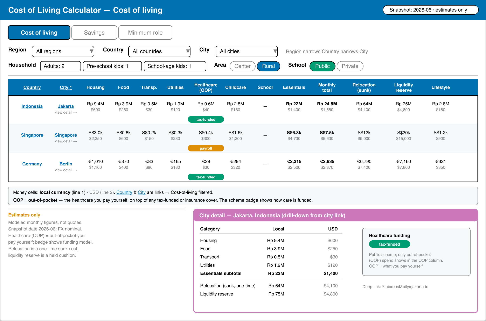
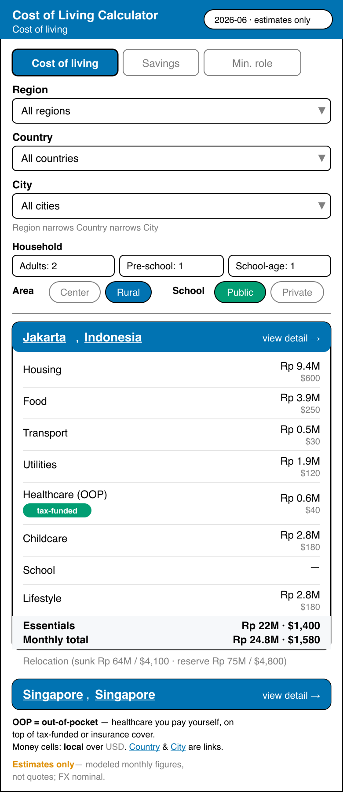
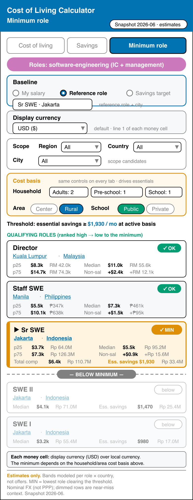

# Product Requirements — Calculator UX Hardening

Acceptance criteria are grouped by fix cluster (see [tech-docs.md](./tech-docs.md) for root cause + fix
approach). Each behavioural criterion is the natural source of a first failing test (TDD) and, where it
specifies behaviour, a companion `specs/**` Gherkin scenario.

## Product Overview

This plan resolves 26 UX, accessibility, and design-fidelity findings surfaced by a three-lens
live-site test pass (spec-aware correctness, spec-blind usability, design fidelity) over both
locales and six breakpoints. The affected surface is
`apps/ayokoding-www/src/features/cost-of-living-calculator/` and its route
`apps/ayokoding-www/src/app/[locale]/tools/cost-of-living-calculator/`.

The fixes cover: one Major functional/visual regression (tab-description visibility), WCAG 2.5.8
touch-target gaps, jargon labels that block first-time comprehension, foreigner-school flag parity
between table and city-detail views, UX-state improvements, design-fidelity drift (native dropdown
chrome, low-hierarchy annotations), and a CSP/GA console error. No new screens are introduced —
this plan hardens an already-designed surface.

## Personas

- **Site maintainer** — develops and tests the calculator; consumes Gherkin specs to ensure
  coverage and prevent regressions.
- **`swe-typescript-dev`** — executes RED→GREEN→REFACTOR cycles; reads `delivery.md` to implement
  fixes with full file-path and command context.
- **`plan-execution-checker`** — validates completed work against acceptance criteria in this file.
- **`web-exploratory-tester` / `web-usability-tester` / `web-design-tester`** — run the Rule-15
  retest round after fixes land; findings are appended to `delivery.md`.
- **First-time visitor (en or id locale)** — primary end-user; benefits from improved
  comprehension, accessibility, and design fidelity on the flagship calculator page.

## User Stories

- As a first-time visitor, I want only the active tab description to be visible, so I can focus
  on the content relevant to the tab I selected.
- As a mobile user, I want all interactive controls to meet 44px touch targets, so I can operate
  the calculator without mis-taps.
- As a foreign-resident user, I want the school-type fallback flag to clearly explain why the
  private rate is shown, so I understand the cost breakdown without confusion.
- As an Indonesian-locale visitor, I want jargon headers and region names to appear in Indonesian,
  so I can understand the data without needing English financial vocabulary.
- As a keyboard/screen-reader user, I want ARIA state attributes (aria-pressed, aria-disabled,
  aria-sort) on interactive controls, so I can operate the calculator without a mouse.
- As a visitor on the Savings tab without a salary entered, I want a clear empty-state prompt and
  auto-focus on the salary input, so I know immediately what to enter.
- As a Minimum-role tab visitor without a target set, I want the pre-populated city panel to be
  labelled as an example, so I understand it is illustrative, not my actual target.
- As a Savings-tab visitor, I want the currency indicator shown at the gross salary field, so I
  know which currency the amount is expected in.
- As a visitor, I want all dropdowns to use the same styled chrome (no mixed native/custom
  dropdown arrows), so the UI feels consistent and polished.

## Product Risks

- Rule-15 retest round may surface additional findings that extend the plan scope beyond the
  current 26 confirmed items.
- Indonesian i18n translation changes may require review by an id-fluent reviewer before archival.
- Enlarging segmented controls to 44px may shift layout at tablet breakpoints — visual sign-off
  in Phase 9 catches this.

---

## Cluster 1 — Tab descriptions (EWT-001 ≡ DWT-001, Major)

```gherkin
Scenario: Only the active tab description is visible
  Given the cost-of-living calculator is open with the "Cost of living" tab active
  When the page is rendered
  Then the "Cost of living" tab description is visible
  And the "Savings" tab description is not visible
  And the "Minimum role" tab description is not visible

Scenario: Active tab description follows the active tab
  Given the cost-of-living calculator is open with the "Cost of living" tab active
  When the user selects the "Savings" tab
  Then only the "Savings" tab description is visible
```

- AC1.1: No inactive tab description is rendered visible (`hidden` utility applies; no fused class).
- AC1.2: Holds in en and id, at every breakpoint.

## Cluster 2 — Touch targets & segmented/sort a11y (EWT-002, EWT-005, UWT-008, UWT-011)

```gherkin
Scenario: Interactive controls meet the 44px touch target
  Given the calculator at 375px
  When the page is rendered
  Then every tab trigger is at least 44px tall
  And every school-type, area, and salary-currency segmented radio is at least 44px tall

Scenario: Area toggle exposes its pressed state
  Given "City center" is the active area
  When the page is rendered
  Then the "City center" button has aria-pressed "true"
  And the "Rural" button has aria-pressed "false"

Scenario: Disabled school-type buttons announce the prerequisite
  Given "School-age children" is 0
  When the page is rendered
  Then the "Public" and "Private" buttons are aria-disabled
  And their accessible description names the "add school-age children" prerequisite

Scenario: Sortable savings column exposes aria-sort
  Given the Savings tab table is shown
  When the page is rendered
  Then the sortable "Savings after essentials" column header has an aria-sort value
```

- AC2.1: tab triggers + all segmented radios ≥ 44px at 320/375px.
- AC2.2: Area toggle buttons carry `aria-pressed` reflecting state + a non-colour active indicator.
- AC2.3: disabled school-type buttons carry `aria-disabled="true"` + `aria-describedby` → the hint text.
- AC2.4: the sort `<th>` carries `aria-sort` = none/ascending/descending.

## Cluster 3 — Foreigner public-school flag (EWT-003, UWT-002, DWT-006)

```gherkin
Scenario: Foreigner-school flag is clear, styled, and present in both views
  Given a city whose country does not open public school to foreigners
  And school-age children >= 1 and school type "public"
  When the page is rendered
  Then the cost-of-living table school cell shows a clearly-worded private-fallback flag
  And the flag is visually distinct from ordinary caption text
  And the city-detail school row renders the school-foreigner-flag-<cityId> testid
```

- AC3.1: flag wording reads as plain language (not bare "public n/a → private"); both locales.
- AC3.2: flag uses a warning-tone token / Badge, distinct hierarchy from `text-muted-foreground` captions.
- AC3.3: `data-testid="school-foreigner-flag-<cityId>"` present in city-detail when the fallback applies.

## Cluster 4 — Jargon glosses & i18n labels (EWT-004, UWT-001/003/004/009/010/012/013/014)

```gherkin
Scenario: Jargon table headers carry an accessible explanation
  Given the calculator is open
  When the page is rendered
  Then the "Healthcare (OOP)" header has a title explaining out-of-pocket (localized)
  And the "Relocation (sunk)" and "Liquidity reserve" headers carry explanatory titles
  And the "P25"/"Median"/"P75" headers carry percentile explanations
  And the "Track" column abbreviations ic/mgmt are expanded or carry abbr titles

Scenario: Region options match the page language
  Given the calculator is open in the id locale
  When the page is rendered
  Then every region option is in Indonesian
  And "MENA" and "Nordics" are expanded or carry a title in both locales

Scenario: Healthcare scheme badges use consistent casing
  Given the calculator is open
  When the page is rendered
  Then no healthcare-scheme badge is rendered in ALL CAPS while another is lower-case
```

- AC4.1: "Baseline source" relabelled to a scent-bearing label ("How to set your target" / "Target method") in both locales.
- AC4.2: OOP header title localized (id uses the existing `healthcareOutOfPocket` = "bayar sendiri").
- AC4.3: Relocation(sunk), Liquidity reserve, P25/Median/P75 headers carry `title` glosses (both locales).
- AC4.4: ic/mgmt expanded or `<abbr title>`; Non-salary-comp header shortened + `title` expansion.
- AC4.5: region names localized in id; MENA/Nordics expanded in both locales.
- AC4.6: healthcare scheme badges normalized to sentence-case.

## Cluster 5 — UX states (UWT-005, UWT-006, UWT-007)

```gherkin
Scenario: Savings tab guides the user to enter a salary
  Given the Savings tab is activated with no salary entered
  When the tab activation occurs
  Then a prominent empty-state prompt is shown in the data area
  And the gross salary input receives focus

Scenario: Minimum-role pre-target panel is labelled as an example
  Given the Minimum-role tab is activated with no target entered
  When the page is rendered
  Then any pre-populated city cost panel is labelled as an example (or hidden)

Scenario: Savings salary input shows its currency at the field
  Given the Savings tab is shown
  When the page is rendered
  Then the gross salary input displays its USD currency inline at the field
```

- AC5.1: Savings empty-state is visually prominent in the data area; salary input auto-focuses on tab activate.
- AC5.2: Min-role pre-target panel is explicitly labelled "Example (…)" or suppressed until target entry.
- AC5.3: Savings gross input shows an at-field currency indicator consistent with the My-salary mode.

## Cluster 6 — Design-system fidelity (DWT-002, DWT-003, DWT-004, DWT-007)

```gherkin
Scenario: All selects share the design-system chrome
  Given the calculator at 1280px
  When the page is rendered
  Then every <select> has computed appearance "none" and a custom chevron affordance
  And no <select> shows the browser's native dropdown arrow

Scenario: Baseline-source control keeps the 44px rhythm at mobile
  Given the Minimum-role tab at 320px and 375px
  When the page is rendered
  Then the "Baseline source" segmented control height does not exceed 44px

Scenario: Salary-currency toggle bottom-aligns with its sibling input
  Given the Minimum-role "My salary" baseline at 1280px
  When the page is rendered
  Then the salary-currency toggle bottom-aligns with the gross salary input
```

- AC6.1: household + min-role currency selects use `appearance-none` + custom chevron (DWT-002/003).
- AC6.2: baseline-source segmented control ≤ 44px at 320/375px (wrap gracefully) (DWT-004).
- AC6.3: salary-currency toggle bottom-aligned in its `items-end` field row (DWT-007).

## Cluster 7 — Security/CSP (EWT-006)

- AC7.1: no CSP-violation console error on calculator load — either the GA origins are whitelisted in the
  CSP, or the GA tag is removed if analytics are unused. (Decision recorded in tech-docs.)

## Cross-cutting requirements

- Every behavioural fix lands with a reproducing test (regression-test mandate) in the same commit/PR.
- Accepted USS-001…004 and SG-001…003 proposals are folded into the calculator `specs/**` Gherkin.
- `typecheck`, `lint`, `test:unit`, `specs:coverage` green for `ayokoding-www`.
- Behaviour confirmed preserved: URL SSOT round-trip, scroll-preservation on filter change, debounced
  salary commit.

---

## UI Design Funnel

> This plan is a **fidelity-refinement** plan — it does not introduce new screens but hardens
> three existing surfaces: (a) the foreigner-school flag cell, (b) the select chrome on household
> and currency selects, and (c) the baseline-source segmented control at mobile. Each surface
> received its own low-fidelity diverge pass.
>
> **Grounding (R5)**: every wireframe is built from existing design-system primitives and the
> calculator's current shell — `libs/web-ui` `Badge` (outline + honey/warning hue) for the
> foreigner flag, `libs/web-ui` `SelectField` (`appearance-none` + `ChevronDown`) for select-chrome
> parity (the geo selects already use it), and the calculator's own `SegmentedControl`
> (`bg-muted` / `bg-primary` active, `min-h-[44px]`) for the baseline-source control. **No net-new
> component is introduced** — each fix reuses a primitive already present in the target app. Mockup
> colours name tokens only (`text-warning`, `border-warning`, `bg-primary`, `text-muted-foreground`),
> never raw hex.
>
> **Prior art (R7)**: the originating
> [salary-savings-calculator plan](../../done/2026-06-19__ayokoding-www-salary-savings-calculator/assets)
> already grounded the calculator's hi-fi design (the embedded PNGs below are its committed mockups);
> these refinements move the running page back toward that approved design. Warning-tone flag
> annotations and styled-chevron selects are established conventions across the existing ayokoding-www
> tool surfaces and the shared `libs/web-ui` kit, so no additional external design survey was required.

### Foreigner Public-School Flag (DWT-006 / UWT-002 / EWT-003)

#### Stage 1 — Diverge (Low-Fidelity Alternatives)

Full lo-fi wireframes with responsive behaviour and token usage in
`assets/ui-foreigner-flag-low-fi.md`. Summary:

**Option A — Chosen: warning Badge**

```
 School
 ┌─────────────────────────────────────┐
 │ SGD 3,500 / $2,728                  │
 │ ▸ [ Private · public not open to    │  ← Badge outline, text-warning / border-warning
 │     foreigners ]                    │
 └─────────────────────────────────────┘
```

en label: `Private — public not open to foreigners`
id label: `Swasta — negeri tak terbuka untuk WNA`
Styling: `Badge` (`variant="outline"`), `text-warning` / `border-warning` token. No raw hex.

#### Stage 2 — Narrow (Hi-Fi Reference)

This plan refines an already-designed surface rather than introducing a new screen. The
authoritative hi-fi targets are the originating plan's committed mockups:

- Cost tab (desktop):
  
- Cost tab (mobile):
  

These are the high-fidelity targets; the flag fix moves the running page back toward them (the
flag cell was designed in those mockups but the wording and hierarchy drifted).

#### Stage 3 — Selection

**Selected: Option A — warning Badge.**

#### Stage 4 — Rationale

| Option                   | Outcome | Why                                                                                                                                            |
| ------------------------ | ------- | ---------------------------------------------------------------------------------------------------------------------------------------------- |
| Option A — warning Badge | Chosen  | Highest clarity: plain-language wording + warning hue signals importance without alarming. Uses existing `Badge` primitive — no new component. |
| Inline text (muted)      | Dropped | Current defect state — no visual hierarchy, cryptic wording.                                                                                   |

#### Stage 5 — Responsive Strategy

| Breakpoint            | Layout behaviour                                                                                                      |
| --------------------- | --------------------------------------------------------------------------------------------------------------------- |
| Mobile (`< sm`)       | Table collapses to cards; badge renders under school amount in card body, full-width-wrapping, warning hue preserved. |
| Tablet (`md` ≥ 768)   | Badge sits on its own line under the amount in the School table cell.                                                 |
| Desktop (`lg` ≥ 1024) | Same as tablet — badge on its own line in the School column.                                                          |

---

### Select Chrome Consistency (DWT-002 / DWT-003)

#### Stage 1 — Diverge (Low-Fidelity Alternatives)

Full lo-fi wireframes with before/after in `assets/ui-select-chrome-low-fi.md`. Summary:

**Option A — Chosen: wrap all selects in `SelectField` / `GEO_SELECT_CLASS`**

```
 Region            Adults
 ┌──────────────▼┐  ┌──────────────▼┐   ← all selects: appearance-none + ChevronDown
 │ All regions   │  │ 1             │
 └───────────────┘  └───────────────┘
```

All selects: `appearance-none`, custom `ChevronDown` overlay, `min-h-[44px]`, `border-border`,
`bg-background`, `rounded-md`, `pr-8 pl-3`. No raw hex.

#### Stage 2 — Narrow (Hi-Fi Reference)

- Min-role tab (desktop):
  
- Min-role tab (mobile):
  

#### Stage 3 — Selection

**Selected: Option A — uniform `SelectField` chrome.**

#### Stage 4 — Rationale

| Option                                | Outcome | Why                                                                                            |
| ------------------------------------- | ------- | ---------------------------------------------------------------------------------------------- |
| Option A — `SelectField` everywhere   | Chosen  | Smallest diff: reuses the primitive already used by geo selects; zero new component authoring. |
| Custom styled `<select>` per use-site | Dropped | Duplicates styling; divergence would recur.                                                    |

#### Stage 5 — Responsive Strategy

| Breakpoint            | Layout behaviour                                                                                                            |
| --------------------- | --------------------------------------------------------------------------------------------------------------------------- |
| Mobile (`< sm`)       | Selects are full-width within their field column; chevron overlay scales with control. No layout change beyond chrome swap. |
| Tablet (`md` ≥ 768)   | Same as mobile — full-width in column.                                                                                      |
| Desktop (`lg` ≥ 1024) | Same — full-width in column. Chrome swap is the only visible change.                                                        |

---

### Baseline-Source Segmented Control at Mobile (DWT-004)

#### Stage 1 — Diverge (Low-Fidelity Alternatives)

Full lo-fi wireframes in `assets/ui-baseline-source-mobile-low-fi.md`. Summary:

**Option A — Chosen: flex-wrap, each option keeps 44px**

```
 Baseline source
 ┌──────────────────────────────────────┐
 │ [ Savings target ] [ Match a role ]   │  ← row 1, each pill 44px tall
 │ [ My salary ]                         │  ← row 2, still 44px tall
 └──────────────────────────────────────┘
```

**Option B — Fallback: vertical stack at mobile**

```
 Baseline source
 ┌──────────────────────────────────────┐
 │ [ Savings target                    ] │  44px
 │ [ Match a role                      ] │  44px
 │ [ My salary                         ] │  44px
 └──────────────────────────────────────┘
```

Token usage: `bg-muted` wrapper · `bg-primary text-primary-foreground` active pill ·
`min-h-[44px]` per option. No raw hex.

#### Stage 2 — Narrow (Hi-Fi Reference)

- Min-role tab (mobile):
  

#### Stage 3 — Selection

**Selected: Option A — flex-wrap.**

#### Stage 4 — Rationale

| Option                    | Outcome   | Why                                                                                                     |
| ------------------------- | --------- | ------------------------------------------------------------------------------------------------------- |
| Option A — flex-wrap      | Chosen    | Preserves the segmented feel; smallest change to `SegmentedControl`; keeps 44px rhythm.                 |
| Option B — vertical stack | Runner-up | Valid fallback if wrapped pills read awkwardly in review; apply only if Option A fails visual sign-off. |

#### Stage 5 — Responsive Strategy

| Breakpoint                | Layout behaviour                                                                     |
| ------------------------- | ------------------------------------------------------------------------------------ |
| Mobile (`< sm` / ≤ 375px) | Flex-wrap: options flow to a second row; each pill `min-h-[44px]`, consistent `gap`. |
| Tablet (`md` ≥ 768)       | Single 44px row (unchanged from current).                                            |
| Desktop (`lg` ≥ 1024)     | Single 44px row (unchanged from current).                                            |
