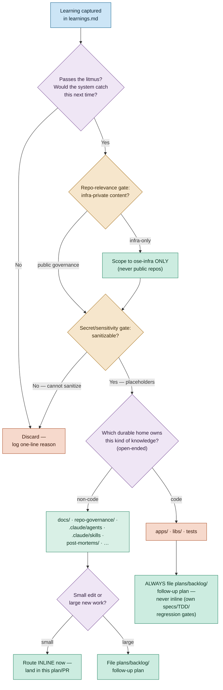
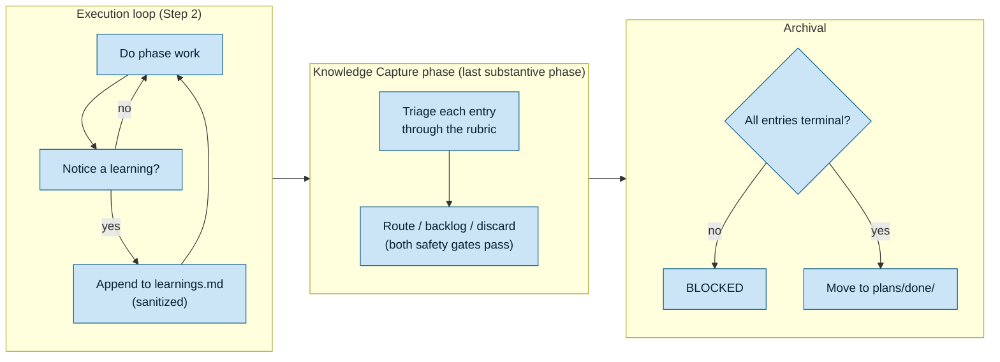

# Product Requirements — Plan-Execution Knowledge Capture

## Product Overview

This plan delivers a **governance product**: a new convention plus the agent/workflow/skill wiring
that makes knowledge capture a first-class, enforced part of the plan lifecycle. The user-facing
"product" is the behavior every future plan inherits:

1. A transient `learnings.md` log accrues generalizable learnings during execution.
2. A final **Knowledge Capture** phase triages each learning through a principle-based, open-ended rubric.
3. Each learning is routed to **exactly one** durable home (which owns that kind of knowledge) — or discarded with a reason.
4. Two hard safety gates run before any routing.
5. Archival is blocked until every learning is routed inline (non-code only), filed as a backlog plan, or discarded.

## Exemption Notice (specs/Gherkin two-path rule + UI-design-funnel)

This is a **pure docs/governance change**: it touches no `apps/` or `libs/` source and ships no UI.

- It is therefore **EXEMPT from the specs/Gherkin two-path rule** (per
  [Feature Change Completeness](../../../repo-governance/development/quality/feature-change-completeness.md)
  — pure-docs/governance changes need no companion `specs/` Gherkin). Enforcement of the new
  convention is via **agent checkers (prose instructions)**, not `rhino-cli` code, so no `.feature`
  files are required.
- It is **EXEMPT from the UI-design-funnel** (no user-facing screens or components).

The Gherkin scenarios below are the plan's own acceptance criteria for the _governance behavior_
(they describe how the convention/checkers must behave); they are documentation of intent, not a
`specs/` coverage obligation.

## Personas

Solo-maintainer repo — personas are the hats the maintainer wears and the agents that consume the
files:

- **Plan Author** — creates plans via `plan-maker` / the plan-creating skill; needs the phase and
  scaffold emitted automatically.
- **Plan Executor** — drives the plan-execution workflow; needs a cheap in-the-moment capture step
  and a clear final triage procedure.
- **Quality Checker (`plan-checker`)** — needs to detect a silently missing Knowledge Capture phase.
- **Completion Checker (`plan-execution-checker`)** — needs to verify routing + both safety gates
  before allowing archival.
- **Repair Agent (`plan-fixer`)** — needs to scaffold a missing phase.
- **Every governance-consuming agent** — the downstream beneficiary of routed learnings.

## User Stories

- As a **Plan Author**, I want the Knowledge Capture phase and a `learnings.md` scaffold emitted into
  every plan I create, so that capture is the default and never forgotten.
- As a **Plan Executor**, I want to append learnings to a running log while I work, so that I capture
  them in the moment instead of reconstructing them at the end.
- As a **Plan Executor**, I want a single triage rubric that tells me exactly where each learning
  goes, so that placement is consistent and I never have to invent a destination.
- As a **Plan Executor**, I want two hard safety gates before routing, so that I never leak private
  infra content into a public repo or commit a secret into a world-readable log.
- As a **Quality Checker**, I want to flag a plan whose Knowledge Capture phase is silently absent, so
  that the practice is enforced but an honest "none" escape still passes.
- As a **Completion Checker**, I want to block archival until every learning is routed, backlogged, or
  discarded-with-reason, so that nothing valuable is silently dropped.
- As a **Repair Agent**, I want to scaffold a missing Knowledge Capture phase, so that legacy or
  malformed plans can be brought into compliance.

## The Triage Rubric (WHAT the convention defines)

The rubric is **principle-based and explicitly non-exhaustive**: route each learning to the durable
home that **owns that kind of knowledge**. Each learning goes to **exactly one** home (or is
discarded). The two safety gates run **before** any routing decision is finalized.

### Candidate durable homes (including but not limited to)

The homes below are the common ones; the convention is deliberately open-ended — a learning may route
to any durable surface that owns its kind of knowledge, not only these rows.

| Home                                           | Route a learning here when…                                                                       |
| ---------------------------------------------- | ------------------------------------------------------------------------------------------------- |
| `repo-governance/` (rules / conventions / dev) | It is a **rule or standard** — something that should be required, forbidden, or standardized.     |
| `docs/` (Diátaxis)                             | It is a durable **fact, how-to, tutorial, or explanation** a reader would search for.             |
| `.claude/agents/`                              | It changes **what a specific agent checks, makes, or fixes** (its instructions/behavior).         |
| `.claude/skills/`                              | It is **procedural know-how** an agent should load on-demand to perform a task well.              |
| `apps/` and `libs/` **source code**            | It is an actual **bug fix, refactor, or new feature** — the codebase behavior itself must change. |
| **tests**                                      | It needs a **new regression test or added coverage** so the failure cannot recur unnoticed.       |
| `docs/explanation/post-mortems/`               | It is a **failure/incident** learning — route to a post-mortem (cross-ref, do not duplicate).     |
| `discard — not generalizable`                  | It fails the litmus: the system would **not** catch it next time even if routed. Log a reason.    |

> **The litmus (capture-vs-discard):** keep the learning only if, once routed, _the system would
> catch this automatically next time_. If nothing durable would change behavior, discard it with a
> one-line reason. This is the deliberate guard against over-capture.

### Downstream rule when a learning routes to CODE (`apps/` / `libs/` / tests)

When a learning routes to code (a bug fix, refactor, feature, or test), the repo's **normal
engineering gates apply to that follow-up work** — a code-routed learning does NOT get to bypass the
existing quality bar:

- **Specs/Gherkin two-path completeness** — observable behavior change in `apps/`/`libs/` ships with
  companion `specs/` Gherkin, carried by the follow-up plan.
- **Regression-test mandate** — every bug fix lands with a reproducing test (failing before, passing
  after) in the same commit/PR as its fix.
- **Test-Driven Development** — Red → Green → Refactor for the code change.

Because of these gates, a code-routed learning is **always filed as a separate `plans/backlog/`
follow-up plan** (which itself carries the specs/Gherkin, regression-test, and TDD obligations) and is
**never landed inline** in the current governance/docs plan's PR. (The Iron Rule 3 carve-out above
still applies: a blocker you must fix to finish the current plan is normal inline execution, not a
deferred learning.)

> **This plan's own status is unchanged:** its deliverables are governance docs, so it remains EXEMPT
> from specs/Gherkin and the UI funnel. Only the **convention it defines** must _permit_ code routing
> and attach these gates to it.

### Routing timing (destination-aware: inline vs. backlog)

The timing rule now has a **HARD boundary by destination**:

- **Non-code homes** (`docs/`, `repo-governance/`, `.claude/agents/`, `.claude/skills/`,
  `post-mortems/`): a **small** routing may land **inline** in this plan's own commit/PR; a learning
  implying **large new work** becomes a tracked `plans/backlog/YYYY-MM-DD__<slug>/` follow-up plan
  (the `learnings.md` entry records the backlog path).
- **Code homes** (`apps/`, `libs/`, tests): a learning routed to code is **ALWAYS filed as a separate
  `plans/backlog/` plan — NEVER landed inline** in the current plan's PR. Rationale: code changes must
  pass their own specs/Gherkin two-path completeness, regression-test mandate, TDD, and review cycle;
  they must not be smuggled into a governance/docs plan's PR. The current plan's PR therefore never
  contains code born from a captured learning.
- **Discard:** logged with a one-line reason.

> **Carve-out (does NOT override Iron Rule 3 — Root Cause Orientation):** this rule governs
> **learnings captured for FUTURE evolution**. A bug, failing test, or lint failure you must fix to
> complete the CURRENT plan's own deliverables is a **blocker**, fixed inline as normal execution —
> not a deferred learning. The "separate backlog plan" rule applies only to code changes a learning
> _suggests_ as a future improvement that are **not required** to finish the current plan.

Archival is BLOCKED until **every** `learnings.md` entry is in one of three terminal states:
(a) routed **inline** (non-code homes only), (b) **filed** as a `plans/backlog/` plan (any destination;
**mandatory** for code), or (c) **discarded** with a one-line reason. Nothing is silently dropped.

### The two SAFETY GATES (HARD — run before routing)

Both gates are mandatory pre-routing steps in the rubric AND explicit checks in
`plan-execution-checker`.

1. **Repo-relevance gate.** A learning routes ONLY to the repo(s) it actually pertains to.
   - Private `ose-infra` content (Terraform, k3s, Proxmox, `coralpolyp`, on-prem infra, real
     hostnames/inventories) MUST NEVER be cross-routed into the PUBLIC `ose-public` / `ose-primer`
     repos.
   - A learning about **public governance** MAY propagate `ose-public` → `ose-primer` via the parity
     loop.
   - An **infra-specific** learning stays in `ose-infra` only.
2. **Secret/sensitivity gate.** A learning NEVER contains secrets, credentials, tokens, API keys,
   private IPs/hostnames, or insecure implementation details.
   - This applies to the transient `learnings.md` **itself** — it is committed to git, and in the
     public repos it is world-readable.
   - Inherits the existing **No Secrets in Git** hard iron rule and the **post-mortem placeholder
     rule** (use `<api-token>`-style placeholders and state where the real value lives).
   - A learning that cannot be sanitized is **discarded**. If it is repo-appropriate and sanitizable,
     it is kept only with the sensitive parts replaced by placeholders.

### Triage / routing decision tree



### Running-log → final-phase flow



## Mandatory + Explicit "None" Escape

- **Mandatory** for substantive plans: the Knowledge Capture phase MUST be present and run.
- **Explicit "none" escape:** the author/executor MAY record `No generalizable learnings — <one-line
reason>` (explicit, never silent). This passes the checkers.
- **Exemptions:** pure-docs and trivial plans are EXEMPT (mirrors the specs/Gherkin exemption).
- **Enforcement:** checkers flag **SILENT absence** at MEDIUM criticality. The explicit "none" record
  passes; a silently missing phase does not.

## Product Scope

**In scope:** the convention, the plan-emitted machinery, the five-workflow references, the checker
enforcement, the fixer scaffold, structural docs in `plans.md`/`post-mortems.md`/`AGENTS.md`, and
re-synced bindings — all replicated across the three repos.

**Out of scope:** any `rhino-cli` validator (Open Question only), incident post-mortems themselves,
app/lib/UI work, analytics/dashboards.

## Acceptance Criteria (Gherkin — governance behavior)

Each scenario obeys the one-primary-`Given`/`When`/`Then` cardinality rule.

```gherkin
Scenario: New convention is the single source of truth
  Given the plan has executed in a repo
  When I look under repo-governance/development/quality/
  Then knowledge-capture.md exists defining the transient log, the open-ended principle-based triage matrix with the code-routing downstream rule, both safety gates, destination-aware routing timing, the mandatory+none rule, exemptions, anti-theater guardrails, the litmus, and the transient-log caveat
  And it is linked from repo-governance/development/quality/README.md
```

```gherkin
Scenario: plan-maker emits the capture machinery
  Given I author a new substantive plan via plan-maker or the plan-creating skill
  When the plan's delivery.md is generated
  Then it contains a final Knowledge Capture phase before archival
  And it contains a learnings.md scaffold in the plan folder
```

```gherkin
Scenario: All five plan-* workflows reference knowledge capture
  Given the five plan-* workflow docs
  When I read plan-planning, plan-execution, plan-quality-gate, plan-multi-repo-parity-planning, and plan-multi-repo-parity-planning-and-execution
  Then each references the knowledge-capture convention as an attention point
  And plan-execution additionally describes running-log capture in its Step 2 loop and the Knowledge Capture phase in Step 8 before archival
```

```gherkin
Scenario: plan-checker flags a silently missing phase
  Given a substantive plan whose delivery.md has no Knowledge Capture phase and no explicit "none" record
  When plan-checker validates the plan
  Then it reports the missing phase at MEDIUM criticality
  But an explicit "No generalizable learnings — <reason>" record passes without a finding
```

```gherkin
Scenario: plan-execution-checker blocks archival until routing is complete
  Given a plan whose learnings.md has an entry that is neither routed, backlogged, nor discarded-with-reason
  When plan-execution-checker validates completion
  Then it blocks archival
  And it reports the unrouted entry
```

```gherkin
Scenario: Repo-relevance gate prevents infra leakage into public repos
  Given a learning that references private ose-infra content
  When the executor triages it during the Knowledge Capture phase
  Then it routes only within ose-infra
  And it is never routed into ose-public or ose-primer
```

```gherkin
Scenario: Secret/sensitivity gate blocks unsanitizable learnings
  Given a learning that contains a credential and cannot be sanitized to placeholders
  When the executor applies the secret/sensitivity gate
  Then the learning is discarded with a one-line reason
  And no secret value appears in learnings.md
```

```gherkin
Scenario: plan-fixer scaffolds a missing phase
  Given a plan missing its Knowledge Capture phase
  When plan-fixer runs against it
  Then it inserts the Knowledge Capture phase and the learnings.md scaffold
```

## Product Risks

| Risk                                             | Mitigation                                                                     |
| ------------------------------------------------ | ------------------------------------------------------------------------------ |
| Executors over-capture and drown in action items | The litmus + explicit discard destination + `none` escape.                     |
| Executors skip the phase quietly                 | `plan-checker` MEDIUM finding on silent absence; explicit `none` is required.  |
| Routing is inconsistent across plans             | Single owned rubric with six fixed destinations and a decision tree.           |
| Safety gates treated as optional prose           | Both gates are explicit triage steps AND `plan-execution-checker` checks.      |
| `learnings.md` treated as a durable archive      | Transient-log caveat in the convention; routing-out is mandatory pre-archival. |
