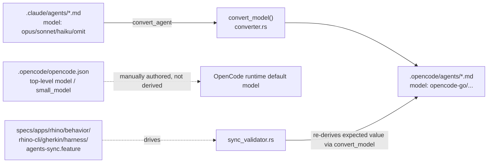
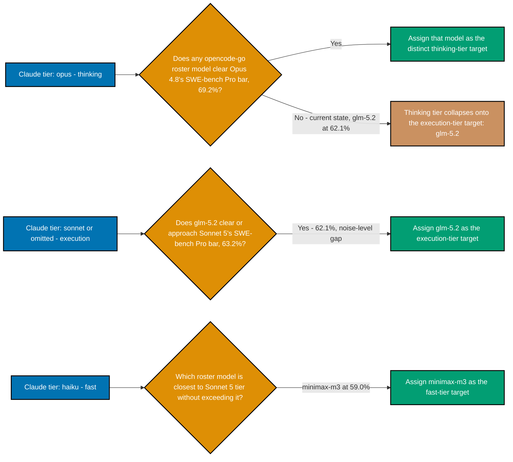

# Technical Documentation

## Current State (researched 2026-07-05)

### How the mapping works today



`convert_model()` is a pure function: Claude alias in, OpenCode model ID string out. It is called
from two places — `convert_agent()` (the real sync path, invoked by `npm run generate:bindings`) and
`sync_validator.rs` (which independently re-derives the expected value to confirm a given
`.opencode/agents/*.md` file is actually in sync, not just present). `.opencode/opencode.json`'s
top-level `model`/`small_model` fields are separate, hand-authored config — not derived by
`convert_model()` — and must be bumped independently in each repo.

### Current mapping (all 3 repos, byte-identical `converter.rs`)

```rust
pub fn convert_model(claude_model: &str) -> String {
    let m = claude_model.trim();
    if m == "haiku" {
        "opencode-go/glm-5".to_string()
    } else {
        "opencode-go/minimax-m2.7".to_string()
    }
}
```

| Claude alias            | Current OpenCode target    | Status                                          |
| ----------------------- | -------------------------- | ----------------------------------------------- |
| `opus`/`sonnet`/omitted | `opencode-go/minimax-m2.7` | Resolves, but ~7-23pp below current Sonnet tier |
| `haiku`                 | `opencode-go/glm-5`        | **Does not resolve** — retired from live roster |

### Live roster verification (2026-07-05)

Ran `opencode models` against the locally installed OpenCode client (v1.14.49). Full `opencode-go/*`
slice of the output:

```
opencode-go/deepseek-v4-flash
opencode-go/deepseek-v4-pro
opencode-go/glm-5.1
opencode-go/glm-5.2
opencode-go/kimi-k2.6
opencode-go/kimi-k2.7-code
opencode-go/mimo-v2.5
opencode-go/mimo-v2.5-pro
opencode-go/minimax-m2.7
opencode-go/minimax-m3
opencode-go/qwen3.6-plus
opencode-go/qwen3.7-max
opencode-go/qwen3.7-plus
```

**`opencode-go/glm-5` (unsuffixed) is absent.** This is a live client check, not a docs-only claim —
the strongest available confirmation short of an official Z.ai/OpenCode deprecation notice (none was
found; a third-party snapshot dated 2026-06-12 still showed `glm-5` present, narrowing the retirement
window to sometime between 2026-06-12 and 2026-07-05).

### Correcting "Opus 5" — the real Claude reference points for a 3-tier design

User directive, 2026-07-05, asked for a 3-tier mapping: **thinking** (Claude `opus`) → a model
clearing **"Opus 5"** tier or the closest available; **execution** (Claude `sonnet`/omitted) → a
model clearing Sonnet 5 tier or the closest available; **fast** (Claude `haiku`) → the closest model
to Sonnet 5 **without exceeding it**.

`web-researcher` (2026-07-05) confirmed: **"Claude Opus 5" does not exist.** Opus 4.8 (shipped
2026-05-28) remains the current Opus generation — there has been no Opus release between 4.8 and
today. `[Verified]` via [Anthropic's platform release notes](https://platform.claude.com/docs/en/release-notes/overview).

Anthropic did ship a new tier **above** Opus on 2026-06-09: **Claude Fable 5** (GA) and **Claude
Mythos 5** (gated to Project Glasswing, not generally available). Fable 5 is described by Anthropic
as "the most capable widely released model" (SWE-bench Pro ~80.3%, `[Verified]` via
[Vellum's benchmark breakdown](https://www.vellum.ai/blog/claude-fable-5-and-mythos-5-benchmarks-explained),
cross-validated against the already-confirmed Opus 4.8 figure quoted on the same page). **Fable 5 is
not what Claude Code's `opus` alias resolves to** — Opus 4.8 remains a distinct, still-current model
(the alias and Fable 5 are separate model families), and this plan's Non-Goals already exclude any
Anthropic-side Claude model bump (README.md, `brd.md` Business Scope Non-Goals). Fable 5/Mythos 5 are
noted here for completeness and explicitly **not** used as the "thinking" tier's comparison bar.

**Correct comparison bar for the "thinking" tier: Claude Opus 4.8** (SWE-bench Pro 69.2%, SWE-bench
Verified 88.6%, OSWorld-Verified 83.4% — shipped 2026-05-28,
[VentureBeat](https://venturebeat.com/technology/anthropics-claude-opus-4-8-is-here-with-3x-cheaper-fast-mode-and-near-mythos-level-alignment)).

**No `opencode-go` roster model clears Opus 4.8's 69.2% SWE-bench Pro bar** — `glm-5.2` at 62.1% (the
strongest confirmed roster model) is closest, but ~7.1pp below. Per explicit user permission
(2026-07-05: "it is okay to use same model on multiple tiers if no other options exist"), the
**thinking tier collapses onto the same target as the execution tier**: `opencode-go/glm-5.2`. This
is not a compromise unique to this plan — no third-party model in this marketplace claims to clear a
top-line Anthropic Opus-tier bar; it reflects the real capability gap between the flagship-priced
open marketplace models and Anthropic's own top tier.

### Qwen3.7-Max/Plus re-checked as a possible flagship/thinking-tier candidate — rejected

`qwen3.7-max` is priced as a premium tier ($2.50/$7.50 per 1M tokens — notably above `glm-5.2`'s
$1.40/$4.40), making it worth checking as a possible stronger "thinking"-tier pick. `web-researcher`
(2026-07-05) found **no official Alibaba-published SWE-bench score** for either `qwen3.7-max` or
`qwen3.7-plus` (the official `qwen.ai` blog is client-side-rendered and could not be fetched). The
best available third-party estimate, consistent across two independent sources, is **SWE-bench Pro
≈ 60.6%** for `qwen3.7-max` — `[Unverified]`, and still **below** `glm-5.2`'s confirmed 62.1%, despite
costing ~1.8x more per input token. **Rejected** as a thinking-tier candidate: no verified evidence
it outperforms `glm-5.2`, and even the unverified figure doesn't clear it.

### Benchmark comparison vs. Claude Sonnet 5 and Claude Opus 4.8 (current Claude reference points)

Claude reference models have themselves moved since this repo's benchmarks doc was last written:
**Claude Sonnet 5** shipped 2026-06-30 (SWE-bench Verified 85.2%, SWE-bench Pro 63.2%, Terminal-Bench
2.1 80.4%, OSWorld-Verified 81.2% — source: [Anthropic's Sonnet 5 launch](https://www.anthropic.com/news/claude-sonnet-5),
corroborated by [MarkTechPost's comparison piece](https://www.marktechpost.com/2026/06/30/anthropic-claude-sonnet-5-vs-sonnet-4-6-vs-opus-4-8-agentic-coding-benchmarks-api-pricing-and-cost-performance-tradeoffs-compared/)),
superseding Sonnet 4.6 (79.6% SWE-bench Verified), the figure currently cited in this repo's own
`web-researcher.md` and `ai-model-benchmarks.md`. **Claude Opus 4.8** shipped 2026-05-28 (SWE-bench
Verified 88.6%, SWE-bench Pro 69.2%, OSWorld-Verified 83.4% — source:
[VentureBeat](https://venturebeat.com/technology/anthropics-claude-opus-4-8-is-here-with-3x-cheaper-fast-mode-and-near-mythos-level-alignment)),
superseding Opus 4.7.

**All benchmark figures below were retrieved 2026-07-05** (per-source publish dates noted inline
where they differ from the retrieval date); re-verify before relying on these numbers if executing
this plan materially later than that date (per user directive, 2026-07-05: always carry the date a
model figure was retrieved, not just the figure).

| `opencode-go` model      | SWE-bench Pro | vs. Sonnet 5 (63.2%) | vs. Opus 4.8 (69.2%) | Terminal-Bench 2.1 | Tier verdict                                                                                               | Primary source                                                                                                                                                       |
| ------------------------ | ------------- | -------------------- | -------------------- | ------------------ | ---------------------------------------------------------------------------------------------------------- | -------------------------------------------------------------------------------------------------------------------------------------------------------------------- |
| **`glm-5.2`**            | **62.1%**     | −1.1pp (noise-level) | −7.1pp               | **81.0%**          | **Execution tier: AT/slightly ABOVE Sonnet-5. Thinking tier: closest available (does not clear Opus 4.8)** | [docs.z.ai/guides/llm/glm-5.2](https://docs.z.ai/guides/llm/glm-5.2), [HF zai-org/GLM-5.2](https://huggingface.co/zai-org/GLM-5.2)                                   |
| **`minimax-m3`**         | **59.0%**     | −4.2pp               | −10.2pp              | 66.0%              | **Fast tier — closest to Sonnet 5 without exceeding it**                                                   | [minimax.io/blog/minimax-m3](https://www.minimax.io/blog/minimax-m3)                                                                                                 |
| `kimi-k2.7-code`         | 58.6% (a)     | −4.6pp               | −10.6pp              | not published      | Below Sonnet tier                                                                                          | [Flowtivity review](https://flowtivity.ai/blog/kimi-k2-7-code-review/)                                                                                               |
| `kimi-k2.6`              | 58.6%         | −4.6pp               | −10.6pp              | not found          | Below Sonnet tier                                                                                          | [Kimi K2.6 blog](https://www.kimi.com/blog/kimi-k2-6)                                                                                                                |
| `glm-5.1`                | 58.4%         | −4.8pp               | −10.8pp              | not found          | Below Sonnet tier                                                                                          | [HF zai-org/GLM-5.1](https://huggingface.co/zai-org/GLM-5.1)                                                                                                         |
| `qwen3.7-max` (b)        | ~60.6%        | −2.6pp               | −8.6pp               | not found          | Below Sonnet tier (unverified figure); rejected as thinking-tier candidate despite premium pricing         | [amitray.com](https://amitray.com/qwen3-7-max-benchmark/), [W&B report](https://wandb.ai/byyoung3/ml-news/reports/Qwen3-7-Max-Benchmark-Scores---VmlldzoxNjk1MzA1MQ) |
| `mimo-v2.5-pro`          | 57.2%         | −6.0pp               | −12.0pp              | 65.8%              | Below Sonnet tier                                                                                          | HF `XiaomiMiMo/MiMo-V2.5-Pro`                                                                                                                                        |
| `minimax-m2.7` (current) | 56.22%        | −7.0pp               | −13.0pp              | 57.0%              | Below Sonnet tier                                                                                          | [minimax.io/news/minimax-m27-en](https://www.minimax.io/news/minimax-m27-en)                                                                                         |
| `mimo-v2.5`              | 56.1%         | −7.1pp               | −13.1pp              | 65.8%              | Below Sonnet tier                                                                                          | HF `XiaomiMiMo/MiMo-V2.5`                                                                                                                                            |
| `deepseek-v4-pro`        | 55.4%         | −7.8pp               | −13.8pp              | 67.9%              | Below Sonnet tier                                                                                          | HF `deepseek-ai/DeepSeek-V4-Pro`                                                                                                                                     |
| `qwen3.7-plus`           | not found     | —                    | —                    | not found          | `[Needs Verification]`                                                                                     | No primary source located as of 2026-07-05                                                                                                                           |

(a) vs. older Opus 4.6, not Opus 4.8 — figure carries its own generation mismatch, flagged in the
original source.
(b) `[Unverified]` — no official Alibaba figure found; see "Qwen3.7-Max/Plus" section above.

**Conclusion**: `opencode-go/glm-5.2` is the strongest model in the roster on every published
benchmark, used for **both** the thinking tier (Claude `opus`) and the execution tier (Claude
`sonnet`/omitted) — collapsed per explicit user permission, since no roster model clears Opus 4.8's
bar separately. `opencode-go/minimax-m3` is the fast tier (Claude `haiku`): the closest model to
Sonnet 5 without exceeding it (−4.2pp), not merely "second closest overall" — though for this
roster snapshot the two framings happen to pick the same model, since every model above Sonnet-5
tier is already `glm-5.2` and every model below it ranks `minimax-m3` first.

### Standard (non-`opencode-go`-subscription) API pricing per model

User directive, 2026-07-05: the comparison table should also carry each model's **standard**
per-token API pricing — i.e. what the model costs through its own provider's direct pay-as-you-go
API, not the flat-rate `opencode-go` subscription price — so the benchmark comparison isn't
capability-only. Sourced via `web-researcher`, **retrieved 2026-07-05**. Footnote markers use
lettered notes below the table (not stacked asterisks, to keep the table renderable cleanly):

| Model                    | Input $/1M                                  | Output $/1M                      | Source                                                                                                | Confidence       |
| ------------------------ | ------------------------------------------- | -------------------------------- | ----------------------------------------------------------------------------------------------------- | ---------------- |
| **`glm-5.2`**            | $1.40                                       | $4.40                            | [Z.ai Pricing](https://docs.z.ai/guides/overview/pricing)                                             | `[Verified]`     |
| `glm-5.1`                | $1.40                                       | $4.40                            | [Z.ai Pricing](https://docs.z.ai/guides/overview/pricing)                                             | `[Verified]` (a) |
| **`minimax-m3`**         | $0.30 (≤512K) / $0.60 (>512K)               | $1.20 (≤512K) / $2.40 (>512K)    | [MiniMax Pay-as-you-go](https://platform.minimax.io/docs/guides/pricing-paygo)                        | `[Verified]`     |
| `minimax-m2.7` (current) | $0.30                                       | $1.20                            | [MiniMax Pay-as-you-go](https://platform.minimax.io/docs/guides/pricing-paygo)                        | `[Verified]` (b) |
| `kimi-k2.7-code`         | $0.95 (cache miss) / $0.19 (cache hit)      | $4.00                            | [Kimi Platform Pricing](https://platform.kimi.ai/docs/pricing/chat-k27-code)                          | `[Verified]`     |
| `kimi-k2.6`              | $0.95 (cache miss) / $0.16 (cache hit)      | $4.00                            | [Kimi Platform Pricing](https://platform.kimi.ai/docs/pricing/chat-k26)                               | `[Verified]`     |
| `deepseek-v4-pro`        | $0.435 (cache miss) / $0.003625 (cache hit) | $0.87                            | [DeepSeek API Pricing](https://api-docs.deepseek.com/quick_start/pricing)                             | `[Verified]` (c) |
| `mimo-v2.5-pro`          | ¥3 / ¥0.025 (cache) ≈ $0.44 / $0.004        | ¥6 ≈ $0.88                       | [Xiaomi MiMo Pay-as-you-go](https://mimo.mi.com/docs/price/pay-as-you-go)                             | `[Verified]` (d) |
| `mimo-v2.5`              | ¥1 / ¥0.02 (cache) ≈ $0.15 / $0.003         | ¥2 ≈ $0.29                       | [Xiaomi MiMo Pay-as-you-go](https://mimo.mi.com/docs/price/pay-as-you-go)                             | `[Verified]` (d) |
| `qwen3.7-max`            | $2.50 (Intl)                                | $7.50 (Intl)                     | [Alibaba Cloud Model Studio Pricing](https://www.alibabacloud.com/help/en/model-studio/model-pricing) | `[Verified]` (e) |
| `qwen3.7-plus`           | $0.40 (0-256K) / $1.20 (256K-1M)            | $1.60 (0-256K) / $4.80 (256K-1M) | [Alibaba Cloud Model Studio Pricing](https://www.alibabacloud.com/help/en/model-studio/model-pricing) | `[Verified]` (e) |

Notes: (a) GLM-5.1/5.2 show identical official rates on Z.ai's own pricing page (retrieved
2026-07-05) — some aggregators list a lower third-party-hosted GLM-5.1 rate; that is reseller
pricing, not Z.ai's. (b) MiniMax-M2.7/M3 show identical standard-tier rates on MiniMax's own pricing
page as of 2026-07-05 — unusual for two model generations, worth a spot-check nearer plan execution.
(c) DeepSeek's live official page (retrieved 2026-07-05) shows no expiry note on this rate, but a
secondary source claims it is a promotion that may have reverted to $1.74/$3.48 — re-verify against
`https://api-docs.deepseek.com/quick_start/pricing` immediately before Phase 3 uses this figure.
(d) Xiaomi MiMo publishes only CNY pricing; USD figures are converted at the CNY/USD spot rate as of
2026-07-04, not an official USD list price. International (non-China) self-serve billing access was
not confirmed — `[Needs Verification]` if that matters for this repo's usage. (e) Alibaba Cloud
Model Studio prices by region; Singapore/International rates are shown as the globally-reachable rate
(retrieved 2026-07-05) — China-mainland pricing is substantially lower.

**Reading the pricing alongside the benchmark table**: `glm-5.2` (thinking + execution tier) costs
notably more per token than most of the roster (input $1.40 vs. $0.30-$0.95 for most alternatives),
consistent with its rate-limit tier being the tightest in the roster (880 req/5h) — it is priced,
throttled, and benchmarked as the flagship. `minimax-m3` (fast tier) is both cheaper (input $0.30 vs.
$1.40) and the closest-from-below model to Sonnet-5 tier — reinforcing the fast-tier choice on cost
grounds as well as capability grounds, not capability alone.

### Frontier/big-brand model reference (informational only — NOT available via `opencode-go`)

User directive, 2026-07-05: show pricing/benchmarks for current Anthropic, OpenAI, and Google
flagship models **in a separate table**, since none of these are — or will be — routed to by this
plan (`opencode-go` doesn't resell any of them; Decision 0 below explicitly rejects targeting any of
them regardless). This table exists purely so a reader can see the cost/capability contrast between
the cheap third-party marketplace this plan uses and the frontier alternatives it deliberately avoids
— retrieved 2026-07-05:

| Provider  | Model                    | SWE-bench Pro                             | SWE-bench Verified    | Input $/1M                    | Output $/1M                     | Release date | Confidence                                                                            |
| --------- | ------------------------ | ----------------------------------------- | --------------------- | ----------------------------- | ------------------------------- | ------------ | ------------------------------------------------------------------------------------- |
| Anthropic | Claude Opus 4.8          | 69.2%                                     | 88.6%                 | $5.00                         | $25.00                          | 2026-05-28   | `[Verified]`                                                                          |
| Anthropic | Claude Sonnet 5          | 63.2%                                     | 85.2%                 | $2.00→$3.00 (f)               | $10.00→$15.00                   | 2026-06-30   | `[Verified]`                                                                          |
| Anthropic | Claude Fable 5           | 80.3%                                     | ~95.0% (g)            | not confirmed                 | not confirmed                   | 2026-06-09   | Benchmark `[Verified]`; pricing `[Needs Verification]`                                |
| OpenAI    | GPT-5.5 (flagship)       | 58.6% (h)                                 | not reported (i)      | $5.00                         | $30.00                          | 2026-04-24   | Pricing `[Verified]`; benchmark `[Unverified]`                                        |
| OpenAI    | GPT-5.4 (prior flagship) | 59.10% ±3.56% (j)                         | not reported (i)      | $2.50                         | $15.00                          | 2026-03-05   | `[Verified]`                                                                          |
| OpenAI    | GPT-5.4-mini             | not found                                 | not reported          | $0.75                         | $4.50                           | 2026-03-17   | Pricing `[Verified]`; benchmark `[Needs Verification]`                                |
| OpenAI    | GPT-5.4-nano             | not found                                 | not reported          | $0.20                         | $1.25                           | 2026-03-17   | Pricing `[Verified]`; benchmark `[Needs Verification]`                                |
| Google    | Gemini 3.1 Pro (Preview) | 54.2% (self-reported) / 46.10% ±3.60% (k) | 80.6%                 | $2.00 (≤200k) / $4.00 (>200k) | $12.00 (≤200k) / $18.00 (>200k) | 2026-02-19   | `[Verified]` (dual-sourced, self-reported vs. independent leaderboard conflict noted) |
| Google    | Gemini 3.5 Flash         | 55.1%                                     | not on model card (l) | $1.50                         | $9.00                           | 2026-05-19   | `[Verified]`                                                                          |

Notes: (f) introductory rate through 2026-08-31, then standard rate. (g) third-party
transcription of an image-embedded table on Anthropic's own announcement page — not independently
re-derived; treat as directionally correct, not exact. (h) quoted consistently across independent
outlets citing OpenAI's own announcement, but the primary `openai.com` page returned HTTP 403 on
every direct fetch attempt — not independently re-verified against the primary source. (i) OpenAI
has publicly stopped reporting SWE-bench Verified for current-generation models, citing
training-data contamination and reward-hacking concerns in the benchmark
([OpenAI's own post title confirmed via search](https://openai.com/index/why-we-no-longer-evaluate-swe-bench-verified/),
content itself 403-blocked) — recommends SWE-bench Pro instead; the last officially-reported Verified
figure was GPT-5.2 Thinking at 80% (2026-12-11), two generations behind current. (j) Scale AI's
[independent SWE-bench Pro leaderboard](https://labs.scale.com/leaderboard/swe_bench_pro_public),
xHigh reasoning setting — not vendor-self-reported. (k) Google's own model card self-reports 54.2%;
the independent Scale AI leaderboard scores the same model at 46.10% ± 3.60% — a real
self-reported-vs-independent gap, both cited rather than silently picking one. (l) a 78% figure
circulates across secondary sources for Gemini 3.5 Flash but could not be confirmed on Google's own
model card, which only lists the SWE-bench Pro figure above — flagged as unconfirmed, not included.

**Not shown**: Gemini 3.5 Pro (announced at I/O 2026, still limited enterprise preview as of
2026-07-05, not GA/priced — excluded rather than cited with a placeholder). Claude Mythos 5 (gated to
Project Glasswing, not generally accessible — excluded for the same reason).

**Why none of these are candidates for this plan's target**: see Decision 0 below — this plan
deliberately routes to a cheap, non-frontier third-party marketplace (`opencode-go`), not any
Anthropic/OpenAI/Google model, regardless of capability. This table is context, not a shortlist.

### `ose-infra`'s provider divergence

`ose-infra`'s `.opencode/opencode.json` currently reads:

```json
"model": "zai-coding-plan/glm-5.1",
"small_model": "zai-coding-plan/glm-5-turbo",
```

— a different provider namespace (`zai-coding-plan`, presumably a direct Z.ai subscription) than
`opencode-go/*`. `apps/rhino-cli/src/application/agents/converter.rs` is confirmed byte-identical
across all 3 repos (diffed directly), so this divergence is isolated to the hand-authored
`opencode.json` config, not the engine. **Root cause not yet established** — Phase 0 investigates via
`git log -p -- .opencode/opencode.json` in `ose-infra` before this plan decides to reconcile or leave
it (see Design Decision 3 below).

## Design Decisions

### Decision 0: The target model MUST NOT be an Anthropic, OpenAI, Google, or other frontier/big-brand-provider model ID (user directive, 2026-07-05)

"Every OpenCode/Pi alternative must be at least Sonnet tier (execution) or Opus tier (thinking)" is a
**capability floor**, not license to solve it by pointing `convert_model()` (or Pi's
`defaultProvider`/`defaultModel`) at `anthropic/claude-sonnet-5`, an OpenAI model, a Google Gemini
model, or any other frontier/big-brand-provider model ID through a direct-provider integration.
Originally scoped to "not Anthropic" (2026-07-05, initial directive); **extended** the same day to
explicitly also exclude OpenAI and, by the same logic, any other frontier/big-brand lab ("for BYOM
harnesses, they should also use non 'frontier' or models from big brands like anthropic or openai" —
user directive, 2026-07-05). That would trivially satisfy any benchmark bar but defeats the entire
reason the `opencode-go` secondary binding (and Pi's model pin) exist: a cheap, non-frontier
alternative. This plan's targets (`opencode-go/glm-5.2`, `opencode-go/minimax-m3`) are deliberately
third-party models that clear (or come closest to clearing) their respective bars on their own
merits — not a proxy back to a frontier provider. Any future re-run of this plan's research that
fails to find a qualifying non-frontier model must report that as a finding/risk to the user, not
silently fall back to a frontier model ID. The "Frontier/big-brand model reference" table above
exists purely for cost/capability contrast, not as a candidate shortlist.

### Decision 1: `convert_model()` moves from a two-branch to an explicit three-branch structure (thinking / execution / fast)

User directive, 2026-07-05: 3-tier mapping — **thinking** (`opus`), **execution**
(`sonnet`/omitted/`inherit`), **fast** (`haiku`). Previously (see "Current mapping" above and the
prior 2-tier revision earlier today), `opus` and `sonnet` shared a single `else` branch since both
resolved to the same target. This plan makes `opus` its **own explicit branch** — even though, per
Decision 0/the Current State research above, it resolves to the **same string** as the execution
branch today (no roster model clears Opus 4.8 separately) — because:

1. It matches this repo's own existing tier philosophy (`repo-governance/development/agents/model-selection.md`'s "planning-grade"/"execution-grade"/"fast" tiers, and `AGENTS.md`'s "Models" section) — explicit over implicit, a standing repo preference.
2. It future-proofs the mapping: if a future roster update adds a model that clears Opus-4.8 tier without needing to also be the execution-tier pick, only the `opus` branch's literal changes — no restructuring required.
3. Per explicit user permission (2026-07-05: "it is okay to use same model on multiple tiers if no other options exist"), collapsing two tiers onto one model where no distinct option exists is an accepted, documented outcome, not a design smell to work around.

The decision-branch logic that determines whether a tier gets a distinct model or collapses onto
another tier's target:



```rust
/// Converts a Claude model alias to the corresponding `OpenCode` model ID.
///
/// Three-tier mapping (as of 2026-07): `opus` (thinking tier) and `sonnet`/omitted (execution tier)
/// both resolve to `opencode-go/glm-5.2` — the strongest model in the opencode-go roster, but one
/// that does not clear Claude Opus 4.8's SWE-bench Pro bar (69.2%; glm-5.2 scores 62.1%). No
/// roster model clears the Opus-4.8 bar separately, so the thinking tier collapses onto the
/// execution tier per explicit user direction (2026-07-05: "okay to use same model on multiple
/// tiers if no other options exist"). `haiku` (fast tier) resolves to `opencode-go/minimax-m3` —
/// the closest model to Claude Sonnet 5's tier without exceeding it (SWE-bench Pro 59.0%, −4.2pp).
/// See docs/reference/ai-model-benchmarks.md for the full comparison.
pub fn convert_model(claude_model: &str) -> String {
    let m = claude_model.trim();
    if m == "haiku" {
        "opencode-go/minimax-m3".to_string()
    } else if m == "opus" {
        "opencode-go/glm-5.2".to_string()
    } else {
        "opencode-go/glm-5.2".to_string()
    }
}
```

This keeps the function's call sites (`convert_agent()`, `sync_validator.rs`) and signature
unchanged. The `opus` and (implicit) `sonnet`/omitted branches return an identical literal today —
this is intentional and documented, not an oversight; `cargo clippy` may flag the duplicate-arm
pattern (`if`/`else if`/`else` with two identical bodies), in which case the REFACTOR step should add
a `#[allow(clippy::if_same_then_else)]` with a comment pointing at this Decision, rather than
collapsing the branches back together — the explicit three-way structure is the point.

### Decision 2: Update the Gherkin scenario wording, not just the Rust test literal

`specs/apps/rhino/behavior/rhino-cli/gherkin/harness/agents-sync.feature:33` hard-codes the literal
model ID string in its scenario text (`the corresponding .opencode/ agent uses the
"opencode-go/minimax-m2.7" model identifier`). `apps/rhino-cli/tests/agents.rs:267` quotes this exact
scenario text back in a test assertion. Both must change together — the `.feature` file is the spec
of record; the Rust test is its binding. Treating this as a real TDD RED→GREEN step (not just a
find-replace) keeps the spec/test/implementation triangle honest. With the 3-branch design
(Decision 1), the Gherkin scenario set gains a THIRD scenario explicitly naming the `opus` alias
(previously implicit within the `sonnet`/omitted scenario) — see `prd.md`'s Gherkin Acceptance
Criteria for the updated 3-scenario set.

### Decision 3: `ose-infra` reconciliation is conditional on Phase 0's findings, not assumed

The Confirmed Decision (README.md) defaults to reconciling `ose-infra` onto `opencode-go/glm-5.2` for
consistency, but Phase 0 must first read `ose-infra`'s own `git log -p -- .opencode/opencode.json` to
rule out an intentional, still-valid reason for the divergence (e.g., `ose-infra` being a private/
proprietary repo might have a dedicated Z.ai enterprise subscription unavailable to the public repos).
If Phase 0 finds no such rationale (most likely — nothing in `ose-infra`'s own docs currently
mentions `zai-coding-plan`), proceed with reconciliation. If it does, stop, document the rationale
inline in `ose-infra`'s `opencode.json` (a comment is not valid JSON, so use a sibling
`.opencode/README.md` note or defer to a follow-up plan) and mark this plan's Phase 4 `ose-infra` item
"N/A — see finding" rather than forcing a change that would break something real.

### Decision 4: Harness scope = Pi only, not the other BYOM-capable harnesses

User directive, 2026-07-05: "pi.dev will use the same model as our opencode go... or any 'non-ai
provider specific' harness should use the same model as opencode too." `web-researcher` surveyed
`docs/reference/platform-bindings.md`'s other Reserved/Partial harnesses for whether they are
genuinely "bring-your-own-model" (BYOM) — configurable to a non-default, non-vendor-locked model —
or vendor-locked:

| Harness           | Verdict                       | Mechanism (if BYOM)                                                                                                  | Why excluded from this plan                                                                                                                                                                                                               |
| ----------------- | ----------------------------- | -------------------------------------------------------------------------------------------------------------------- | ----------------------------------------------------------------------------------------------------------------------------------------------------------------------------------------------------------------------------------------- |
| **Pi (`pi.dev`)** | **BYOM — in scope**           | `.pi/settings.json` (project-committable), native built-in `opencode-go` provider                                    | N/A — this is the plan's target                                                                                                                                                                                                           |
| OpenAI Codex CLI  | BYOM                          | `.codex/config.toml` `[model_providers.<id>]`, requires `wire_api = "responses"` (Chat Completions removed Feb 2026) | Whether `opencode-go`'s endpoint speaks the OpenAI **Responses** API (not just Chat Completions) is unconfirmed — shipping this without that confirmation risks a broken config in an already-Partial binding                             |
| GitHub Copilot    | BYOM (as of 2026 changelogs)  | Settings → Model Providers UI/enterprise policy                                                                      | Not repo-committable — no file this plan could edit; account/UI-level only                                                                                                                                                                |
| Cursor            | Partial BYOM                  | "Override OpenAI Base URL" — chat/plan panel only                                                                    | Does not extend to Cursor's actual agent/Composer loop — insufficient for driving real coding-agent tasks                                                                                                                                 |
| Windsurf          | Vendor-locked                 | BYOK limited to Anthropic keys only (no arbitrary custom-provider/base_url)                                          | Doesn't qualify as BYOM in the relevant sense; also Reserved (no `.windsurf/` dir exists)                                                                                                                                                 |
| JetBrains Junie   | BYOM                          | `/account` interactive flow or CLI flags (`--anthropic-api-key`, `--model`)                                          | No confirmed project-committable config file — nothing for this plan to edit and check into git                                                                                                                                           |
| Aider             | BYOM (confirmed, via LiteLLM) | `.aider.conf.yml`, `--model provider/id`, `--openai-api-base`                                                        | No adoption footprint exists yet in this repo (`.aider.conf.yml` absent) — creating one purely to pin a model would be greenfield onboarding, same objection as extending Pi's scope, but Pi was the harness explicitly named by the user |

Confirmed via `AskUserQuestion` (2026-07-05): user selected "Pi only (Recommended)" over extending
to Codex CLI or additionally logging Junie/Aider as follow-up ideas. Codex CLI, Junie, and Aider
remain candidates for a future plan if/when their config uncertainty is resolved or their binding is
otherwise adopted — not tracked as a formal backlog item here since none was requested.

### Decision 5: Pi's scope in this plan is narrow — model pin only, not adoption; `enabledModels` covers the tier Pi's single `defaultModel` can't

`docs/reference/platform-bindings.md` currently lists Pi's Status as `Reserved` (no `.pi/` directory
exists in any of the 3 repos today). User directive, 2026-07-05 ("narrow... leave Status: Reserved"),
confirmed via `AskUserQuestion`: this plan creates `.pi/settings.json` (in `ose-public` only) purely
to pin the default model, and explicitly does **not**:

- Flip the catalog's Pi row from `Reserved` to `Active`
- Verify Pi actually reads `AGENTS.md` correctly in this repo, test its TUI, or otherwise onboard it
- Propagate `.pi/settings.json` to `ose-primer`/`ose-infra` (out of scope — Pi is not adopted in any
  repo; pre-seeding a single repo's config is the minimal footprint that satisfies the user's literal
  ask without implying broader adoption)

**3-tier note**: Pi's `.pi/settings.json` schema has exactly ONE `defaultProvider`/`defaultModel`
pair — it has no native concept of 3 simultaneous tiers the way Claude Code's per-agent frontmatter
or `.opencode/opencode.json`'s `model`/`small_model` pair do. `defaultModel` is set to the
execution-tier value (`glm-5.2`, which is also the thinking-tier value per Decision 1's collapse).
The fast tier (`minimax-m3`) has no default slot in Pi, but Pi's `enabledModels` array (glob patterns
for its Ctrl+P model-cycling UI) is set to include both `opencode-go/glm-5-2` and
`opencode-go/minimax-m3`, so a Pi user can manually cycle to the fast tier — the closest Pi-native
analog to a 3-tier default given its 1-slot config.

If Pi is later formally adopted, that adoption plan should re-verify this pin still points at the
current model (roster drift risk, same as the OpenCode mapping this plan is fixing).

### Decision 6: Pi's `opencode-go` model-ID string is trusted from research, not locally verified

`pi` is not installed on this machine (`which pi` → not found, 2026-07-05). `web-researcher` found
Pi's model catalog (`pi.dev/models?provider=opencode-go`) renders the `glm-5.2` model as `glm-5-2`
(hyphenated) — possibly a real ID difference, possibly a markdown-rendering artifact of the fetch
tool converting `.` to `-`; the agent could not confirm which from a single fetch. User directive,
2026-07-05 ("trust research, flag as Needs Verification"), confirmed via `AskUserQuestion` over the
alternative of installing `pi` locally to inspect live `/model` output: this plan ships
`"defaultModel": "glm-5-2"` (the researched value) as-is, with an inline `[Needs Verification]`
comment/note in the delivery step, rather than gating Phase 0 on a new local tool install. Whoever
next touches `.pi/settings.json` (e.g., a future Pi-adoption plan) should confirm this string against
a live `pi` session before relying on it. The same `[Needs Verification]` tag applies to
`minimax-m3`'s Pi-catalog ID (`opencode-go/minimax-m3`, assumed dotted-to-hyphenated the same way as
`glm-5.2`, i.e. unchanged — MiniMax's model name has no dot to convert) used in `enabledModels`.

### Decision 7: Refresh `ai-model-benchmarks.md` in full, not just the changed rows

Because the doc's own purpose is to be the single citation source of truth
(`model-selection.md` and `platform-bindings.md` both link to it rather than re-deriving numbers),
leaving its Claude reference point stale while only patching the `opencode-go` rows would create an
internally inconsistent document. The refresh in Phase 3 replaces: the full `OpenCode Go Models`
roster table + per-model detail sections, the `Claude-to-OpenCode mapping` table (now 3-tier), the
new frontier/big-brand reference table (informational section above), and the document's own "Last
updated" date and Claude-model reference rows used elsewhere in the file.

## File Impact

### `ose-public` (source of truth; changes propagate to `ose-primer`/`ose-infra` per byte-identity rule)

| File                                                                          | Change                                                                                                                                                                                                                                                                                                                                                                                                                                                                                                                                                                                                                                                                          |
| ----------------------------------------------------------------------------- | ------------------------------------------------------------------------------------------------------------------------------------------------------------------------------------------------------------------------------------------------------------------------------------------------------------------------------------------------------------------------------------------------------------------------------------------------------------------------------------------------------------------------------------------------------------------------------------------------------------------------------------------------------------------------------- |
| `apps/rhino-cli/src/application/agents/converter.rs`                          | `convert_model()` restructured to 3 explicit branches (`haiku`→`opencode-go/minimax-m3`, `opus`→`opencode-go/glm-5.2`, else→`opencode-go/glm-5.2`); doc comment rewritten per Decision 1; unit tests: `convert_model_haiku` (fast), NEW `convert_model_opus` (thinking), `convert_model_default` renamed to `convert_model_sonnet_and_default` (execution, now `sonnet`/`""`/`"inherit"` only, `opus` moved out); hard-coded `opencode-go/minimax-m2.7` test-fixture literals at lines 507 and 624 (the latter inside `encode_emits_permission_block_not_tools`, unrelated to the model-mapping assertions but sharing the same stale literal) updated to `opencode-go/glm-5.2` |
| `apps/rhino-cli/src/application/agents/sync_validator.rs`                     | 5 test-fixture strings hard-coding `opencode-go/minimax-m2.7` (all non-haiku-tier fixtures) updated to `opencode-go/glm-5.2`                                                                                                                                                                                                                                                                                                                                                                                                                                                                                                                                                    |
| `apps/rhino-cli/tests/agents.rs`                                              | 8 occurrences of `opencode-go/minimax-m2.7` (all non-haiku-tier fixtures — lines 233, 267, 273, 288, 305, 457, 479, 495, including the scenario-text-quoting assertion at line 267) updated to `opencode-go/glm-5.2`; may need a new fixture exercising an explicit `opus` agent if none already exists (Phase 1 checks)                                                                                                                                                                                                                                                                                                                                                        |
| `specs/apps/rhino/behavior/rhino-cli/gherkin/harness/agents-sync.feature`     | Existing scenario (line 33) wording updated to `"opencode-go/glm-5.2"`; NEW scenario added naming the `opus` alias explicitly (thinking tier) per Decision 2                                                                                                                                                                                                                                                                                                                                                                                                                                                                                                                    |
| `.opencode/opencode.json`                                                     | `model` set to `opencode-go/glm-5.2` (execution + thinking default), `small_model` set to `opencode-go/minimax-m3` (fast) — unchanged shape from the 2-tier design, since OpenCode's own config has only 2 slots and thinking collapses onto execution                                                                                                                                                                                                                                                                                                                                                                                                                          |
| `.opencode/agents/*.md` (75 glob matches, 74 real agents)                     | Regenerated via `npm run generate:bindings` — not hand-edited; 11 files (agents with `.claude/` `model: haiku`) get `opencode-go/minimax-m3`, the remaining 63 (opus + sonnet + omitted) get `opencode-go/glm-5.2`; `.opencode/agents/README.md` (the 75th glob match) is a hand-authored catalog file, not a converted agent — `convert_all_agents()` explicitly skips it                                                                                                                                                                                                                                                                                                      |
| `CLAUDE.md:45`                                                                | Model translation sentence updated to describe the 3-tier mapping (thinking/execution/fast) even though thinking/execution share a literal                                                                                                                                                                                                                                                                                                                                                                                                                                                                                                                                      |
| `repo-governance/development/agents/model-selection.md` (lines 18, 279-297)   | Terminology note's example ID + `Model ID Mapping` table + `3-to-2 Tier Collapse` prose (the full section, lines 279-297) updated to the 3-tier mapping                                                                                                                                                                                                                                                                                                                                                                                                                                                                                                                         |
| `repo-governance/development/agents/ai-agents.md` (lines 75, 2577-2578)       | Model selection bullet + frontmatter example comments updated                                                                                                                                                                                                                                                                                                                                                                                                                                                                                                                                                                                                                   |
| `repo-governance/conventions/structure/governance-vendor-independence.md:168` | Example model ID updated                                                                                                                                                                                                                                                                                                                                                                                                                                                                                                                                                                                                                                                        |
| `docs/reference/platform-bindings.md` (lines 172-174)                         | Claude→OpenCode mapping table updated to 3 rows (opus/sonnet/haiku, no longer 2 collapsed rows)                                                                                                                                                                                                                                                                                                                                                                                                                                                                                                                                                                                 |
| `docs/reference/ai-model-benchmarks.md`                                       | Full refresh per Decision 7, including the new frontier/big-brand reference table                                                                                                                                                                                                                                                                                                                                                                                                                                                                                                                                                                                               |
| `.pi/settings.json` (new file)                                                | Created with `"defaultProvider": "opencode-go"`, `"defaultModel": "glm-5-2"` (`[Needs Verification]` per Decision 6), and `"enabledModels": ["opencode-go/glm-5-2", "opencode-go/minimax-m3"]` (per Decision 5) — `ose-public` only per Decision 5                                                                                                                                                                                                                                                                                                                                                                                                                              |

**Explicitly excluded**: `apps/ose-www/content/updates/2026-05-10-phase-1-week-13-local-first-and-repo-split.md`
— a dated changelog entry; historical record, never retroactively rewritten.

### `ose-primer` / `ose-infra`

Both repos confirmed (direct `diff`/`grep`, 2026-07-05) to carry their own non-byte-identical copies
of every governance/reference doc below. The stale-ID citation count differs per repo: `ose-primer`
cites the stale `opencode-go/minimax-m2.7`/`opencode-go/glm-5` IDs literally in **6 of the 7** files
(`CLAUDE.md`, `AGENTS.md`, `model-selection.md`, `ai-agents.md`, `governance-vendor-independence.md`,
`platform-bindings.md`) — its 7th file, `docs/reference/ai-model-benchmarks.md`, has zero hits for
the literal ID strings but still needs refreshing for a different reason (its "Last updated" date
and Claude-model reference rows are two generations stale — Sonnet 4.6/Opus 4.7 — per Decision 7).
`ose-infra` cites the stale IDs in only **2 of the 7** (`model-selection.md`, `platform-bindings.md`).
The table immediately below is definitive for the exact per-file breakdown, not conditional on a
Phase 0 re-check (Confirmed Decision 8, `README.md`; Phase 0 still re-confirms at execution time in
case of further drift).

| File                                                                                                                          | Change                                                                                                                                                                                                                                                                                                                                                       |
| ----------------------------------------------------------------------------------------------------------------------------- | ------------------------------------------------------------------------------------------------------------------------------------------------------------------------------------------------------------------------------------------------------------------------------------------------------------------------------------------------------------ |
| `apps/rhino-cli/src/application/agents/converter.rs` + `sync_validator.rs` + `tests/agents.rs` + the Gherkin scenario         | Byte-identical copy of the `ose-public` 3-branch change (both repos)                                                                                                                                                                                                                                                                                         |
| `.opencode/opencode.json`                                                                                                     | `ose-primer`: `model` → `opencode-go/glm-5.2`, `small_model` → `opencode-go/minimax-m3` (same shape as `ose-public`). `ose-infra`: per Decision 3 — reconcile to the same two targets (default) or leave + document, based on Phase 0 findings                                                                                                               |
| `.opencode/agents/*.md`                                                                                                       | Regenerated via each repo's own `npm run generate:bindings`                                                                                                                                                                                                                                                                                                  |
| `ose-primer/CLAUDE.md:52`                                                                                                     | Model translation sentence updated (same shape as `ose-public`'s `CLAUDE.md:45`), now 3-tier                                                                                                                                                                                                                                                                 |
| `ose-primer/AGENTS.md:319`                                                                                                    | Example `model: opencode-go/minimax-m2.7` frontmatter comment updated                                                                                                                                                                                                                                                                                        |
| `ose-primer/repo-governance/development/agents/model-selection.md` (lines 269-272)                                            | 4-row `opus`/`sonnet`/`haiku`/omit mapping table updated to the 3-tier targets (opus and sonnet rows now show identical target, explicitly noted as intentional per Decision 1)                                                                                                                                                                              |
| `ose-primer/repo-governance/development/agents/ai-agents.md` (lines 66, 155, 2505-2506)                                       | Model-selection bullet + format-note prose + frontmatter example comments updated                                                                                                                                                                                                                                                                            |
| `ose-primer/repo-governance/conventions/structure/governance-vendor-independence.md:167`                                      | Example model ID updated                                                                                                                                                                                                                                                                                                                                     |
| `ose-primer/docs/reference/platform-bindings.md` (lines 181-183)                                                              | 3-row Claude→OpenCode mapping table updated                                                                                                                                                                                                                                                                                                                  |
| `ose-primer/docs/reference/ai-model-benchmarks.md`                                                                            | Full refresh per Decision 7, including the frontier reference table — confirmed no literal stale-ID grep hits (2026-07-05; stale for date/generation reasons, not literal citation, same distinction as `ose-infra`'s copy below); this repo's copy is more stale than `ose-public`'s — "Last updated: 2026-04-19" at line 15, vs. `ose-public`'s 2026-05-07 |
| `ose-infra/repo-governance/development/agents/model-selection.md` (lines 262-265, 268, 272-273)                               | 4-row mapping table + 2 prose references + a `glm-5` "no standard benchmarks" caveat note, all updated                                                                                                                                                                                                                                                       |
| `ose-infra/docs/reference/platform-bindings.md` (lines 187-189)                                                               | 3-row Claude→OpenCode mapping table updated                                                                                                                                                                                                                                                                                                                  |
| `ose-infra/docs/reference/ai-model-benchmarks.md`                                                                             | Full refresh per Decision 7 — confirmed present but does not currently cite the stale model IDs directly (no grep hits 2026-07-05); still gets the same current-roster/current-Claude-reference refresh for consistency                                                                                                                                      |
| `ose-infra/CLAUDE.md`, `ose-infra/AGENTS.md`, `ose-infra/.../ai-agents.md`, `ose-infra/.../governance-vendor-independence.md` | No stale-ID hits found (2026-07-05 grep) — no edit needed unless Phase 4's re-check finds otherwise                                                                                                                                                                                                                                                          |

`.pi/settings.json` is **not** propagated to `ose-primer`/`ose-infra` — Decision 5 scopes it to
`ose-public` only (Pi is not adopted in any repo; this is a minimal single-repo pre-seed, not a
cross-repo config bump).

## Rollback

This plan does **not** commit per phase. Phases 0-4 make uncommitted working-tree changes in each
repo that accumulate until the Final Phase's Commit Guidelines land them as one batched set of 4
thematic commits per repo (engine, config + generated bindings, Pi model pin — `ose-public` only,
docs), each with explicit paths (never `git add -A`), then pushes. Consequently:

- **Before the Final Phase commits and pushes**: there is nothing to `git revert` yet — rolling back
  simply means discarding the uncommitted working-tree changes (e.g. `git checkout -- <path>`, or
  abandoning the worktree without merging). This is why Phase 0-3's Pause Safety notes describe
  stopping with an uncommitted working tree, not a push option.
- **After the Final Phase has committed and pushed in all 3 repos**: revert the specific thematic
  commit(s) (`git revert <sha>`) rather than a blind full-history revert — the 4-commit split by
  concern (engine/config/Pi/docs) still allows a targeted revert of just the affected concern,
  though later commits within the same repo may depend on earlier ones (e.g. the config commit
  depends on the engine commit's `convert_model()` output; Phase 4's propagation commits depend on
  `ose-public`'s Phases 1-3 being correct first).
- If a regression is found after the Final Phase has landed in all 3 repos and the roster itself has
  drifted again by then, the safest rollback is a fresh plan re-running the same research (roster
  IDs may have changed again) rather than a blind revert — per the roster's own demonstrated
  non-fixed-cadence drift.
