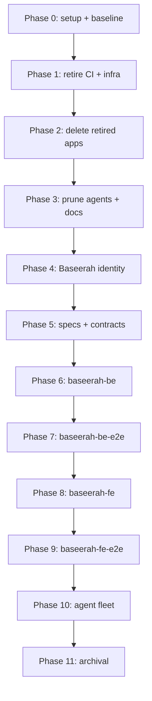

# Baseerah Repo Reset

**Status**: In Progress
**Created**: 2026-07-31
**Delivery Mode**: `main-to-origin-main` — work happens in the primary checkout at
`/Users/wkf/ose-projects/baseerah`, and each phase commits and pushes directly to `origin main`.
No worktree, no PR, no PR-Review Maker→Fixer Cycle. Per-phase commit-and-push checkpoints are the
correct cadence under this mode.

Strip this repository — a full clone of `ose-public` now pointed at
`git@github.com:wahidyankf/baseerah.git` — down to its reusable engineering harness, then stand up
**Baseerah**, a personal-assistant product, on top of it.

## Context

`baseerah` was created by cloning `ose-public` and re-pointing `origin`. It therefore carries the
entire Open Sharia Enterprise (OSE) product surface — 23 Nx apps, four libs, ~200 governance files,
90 agents, 174 archived plans — of which exactly one app (`rhino-cli`) and the engineering harness
around it are wanted here. Everything else is another product's code living in this repo's history
and, more damagingly, in its instruction surface: agents, conventions, and CI all still describe
apps that will not exist.

**Baseerah** (Arabic بصيرة) means _insight_, _inner vision_, _ketajaman melihat_ — in Indonesian,
_wawasan_ or _kejernihan pandang_. The name is deliberately a platform name rather than a bot name:
it covers an AI assistant, a content builder, a posting helper, and a personal workflow engine under
one roof. Baseerah is a **product within the OSE ecosystem**, not a replacement for it — this repo
keeps the OSE Layer 0 vision as its ecosystem parent and adds a Baseerah product vision beneath it.

## Scope

### In scope

**Kept, untouched or lightly edited**

| Surface                                                      | Why it stays                                                                                                                                                                            |
| ------------------------------------------------------------ | --------------------------------------------------------------------------------------------------------------------------------------------------------------------------------------- |
| `apps/rhino-cli`                                             | Owns the binding generator, repo-config validator, and md/spec gates                                                                                                                    |
| `specs/apps/rhino/**`                                        | rhino-cli's spec tree — referenced by `repo-config.yml`                                                                                                                                 |
| `libs/rust-commons`                                          | rhino-cli's shared Rust crate                                                                                                                                                           |
| `libs/web-ui`, `libs/web-ui-token`                           | Design-system primitives + tokens consumed by `baseerah-fe`                                                                                                                             |
| `libs/fsharp-crane-core`                                     | Shared F# core consumed by `baseerah-be` (audited in Phase 2)                                                                                                                           |
| `docs/explanation/software-engineering/` (168 files)         | Generic engineering reference, load-bearing for `swe-*` agents                                                                                                                          |
| ~59 generic agents, ~27 generic skills, `repo-governance/**` | The SDLC harness this plan exists to preserve                                                                                                                                           |
| `repo-governance/principles/**` (16 files)                   | **Byte-identical to `ose-public`** — a checked invariant, not an aspiration. See [tech-docs.md § Decision 13](./tech-docs.md#decision-13--governance-principles-stay-identical-to-ose-) |

**Removed**

22 apps (`ayokoding-*`, `organiclever-*`, `ose-www`, `ose-app-web`, `ose-be`, `ose-cli`,
`crane-cli`, `wahidyankf-www`, and their E2E pairs), their spec trees, their `infra/` stacks, the 11
per-app CI **callers** and the one `-www` reusable template Baseerah has no tier for, 29 app-scoped
agents, 4 app-scoped/doctrine-moot skills, `repo-governance/workflows/ayokoding-web/`, `generated-socials/` (33 OSE
LinkedIn update posts) with the `social-linkedin-post-maker` agent that wrote them, and the OSE plan
archive.

The **CI/CD architecture is not touched**: the four core workflows (`main-ci.yml`,
`pr-quality-gate.yml`, `deps-audit.yml`, `validate-env.yml`), their exact job sets, the five
composite actions, and the three app-group `_reusable-*.yml` templates all survive unchanged, and
Phase 1's gate diffs them against `ose-public` to prove it. Phases 7 and 9 add Baseerah callers in
the identical thin-caller shape the siblings use. See
[tech-docs.md § Decision 15](./tech-docs.md#decision-15--cicd-architecture-stays-consistent-with-the-ose-siblings).

**Created**

| App               | Stack                          | Port  |
| ----------------- | ------------------------------ | ----- |
| `baseerah-be`     | F# / Giraffe / ASP.NET 10      | 19320 |
| `baseerah-be-e2e` | HTTP suite against local stack | —     |
| `baseerah-fe`     | Next.js 16 App Router          | 19310 |
| `baseerah-fe-e2e` | Playwright against local stack | —     |

Plus a Baseerah product vision, a rewritten root identity surface, and the
`apps-baseerah-{fe,be}-*` maker/checker/fixer + deployer agents.

### Out of scope

- **Product features of any kind.** The four `baseerah-*` apps are deliberately **hello world** — a
  health endpoint, a greeting endpoint, and one page that renders the greeting. That is the entire
  application scope. Capture, LLM integration, scheduling, posting, and the knowledge engine are all
  follow-up plans. The point of this plan is the _repo_, not the app.
- **npm scope rename.** `@open-sharia-enterprise/*` stays. See
  [tech-docs.md § Decision 3](./tech-docs.md#decision-3--keep-the-open-sharia-enterprise-npm-scope).
- **Git history rewrite.** Deletions land as commits. No `filter-branch`, no force-push to `main`.
- **Deploy provisioning.** Deployer agents ship; Vercel projects, GHCR images, and `prod-*`/`stag-*`
  branches are created on first actual deploy.

## Approach Summary

Twelve phases (0-11) on a single serial spine. Under `main-to-origin-main`, eleven of the twelve —
every phase except Phase 0 — end with a commit and a push to `origin main`, so `main` moves forward
eleven times rather than through seven PRs.

Phase 0 does not push (its baseline rides Phase 1's commit); every other phase ends with a commit and
a push to `origin main`.

The order is chosen so the repo is green at every gate: CI callers die before the apps they call,
apps die in the same commit as their `repo-config.yml` entries and spec trees (the pre-commit
staged-gate blocks any other ordering), markdown-lint excludes are dropped only after the content
they excluded is gone, and the shared spec tree lands before either app that consumes it.

Because this is a direct-push plan, the safety net is the **phase gate**, not a review. Every gate
runs the real CI-equivalent commands locally and every phase is a coherent stopping point.

## Documents

- [brd.md](./brd.md) — why this matters, business impact, success metrics, business risks
- [prd.md](./prd.md) — personas, user stories, Gherkin acceptance criteria, UI design funnel
- [tech-docs.md](./tech-docs.md) — architecture, the design decisions, file-impact analysis, rollback
- [delivery.md](./delivery.md) — the phased, DAG-ordered, executable checklist
- [learnings.md](./learnings.md) — running log, drained by Phase 11

## Affected Projects

`rhino-cli` (source edits), `web-ui-token` (rebrand), `fsharp-crane-core` (audit), and the four new
`baseerah-*` projects. Every other Nx project in the workspace is deleted.
