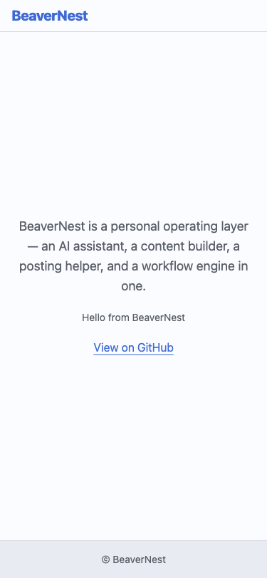
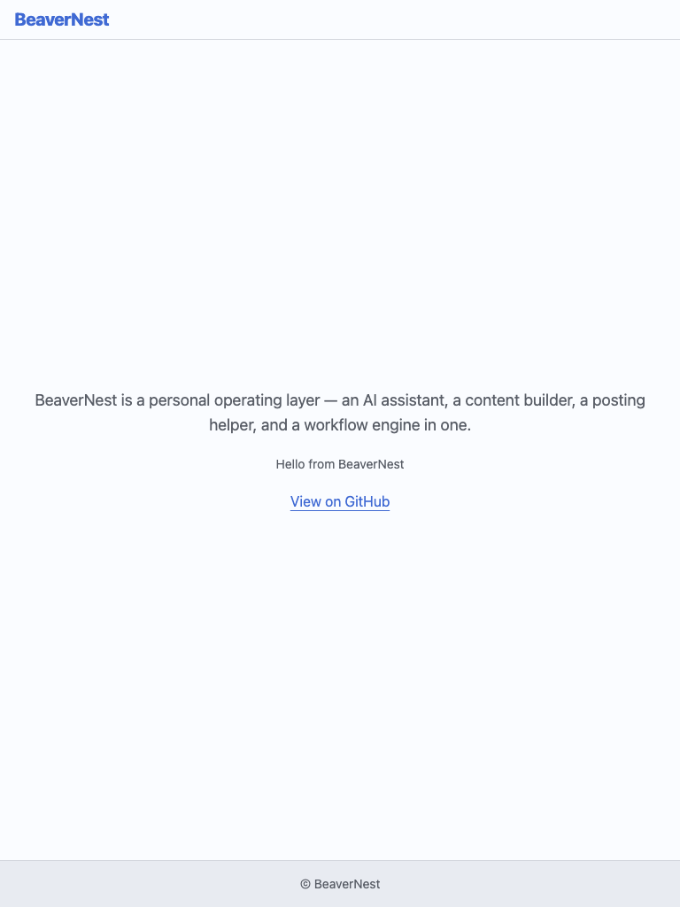
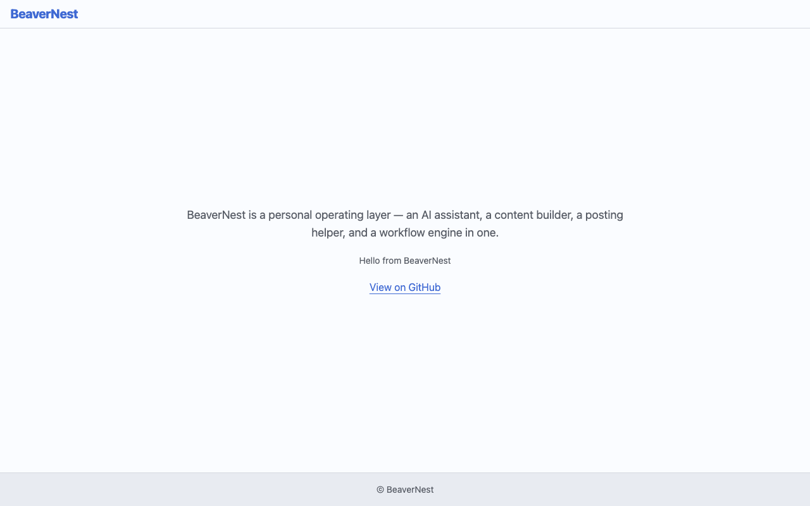

# Delivery — BeaverNest Rebrand

Executable checklist for the [BeaverNest Rebrand](./README.md) plan. Read
[tech-docs.md](./tech-docs.md) first — its **Canonical Substitution Vocabulary** and **Decision Log**
sections are referenced by every phase below via the shorthand `<CANONICAL-SED>` (the perl script in
[tech-docs.md §Canonical Substitution Vocabulary](./tech-docs.md#canonical-substitution-vocabulary)).

> **Legend** — `[AI]`: an agent performs the step (the default; unmarked steps are `[AI]`).
> `[HUMAN]`: only a human can do it (physical action, out-of-band approval, real-secret or
> privileged-credential handling). `[AI+HUMAN]`: agent prepares, human approves or finishes.
>
> **Phase Gate** — every phase ends with a `### Phase N Gate` (must-pass verification) plus a
> `> **Pause Safety**:` note (the safe-to-stop state and the single command to resume). A phase is
> not complete until its gate is green; do not start phase N+1 while any gate check fails.

## Delivery Mode: `main-to-origin-main`

Work happens in the **primary checkout** on branch `main`. Each phase commits and pushes directly to
`origin main`. No PR opens, so the
[PRs Open at Delivery Boundaries](../../../repo-governance/conventions/structure/plans.md#prs-open-at-delivery-boundaries-not-every-phase-hard-rule)
rule and its `### Delivery Boundaries` table do not bind this plan — a per-phase commit-and-push
checkpoint cadence is the correct and explicitly sanctioned form under this mode (Decision 7). The
PR-Review Maker→Fixer Cycle does not run.

## Worktree

**None.** `main-to-origin-main` works in the primary checkout. Do not run `git worktree add` for
this plan. `worktrees/` remains empty of this plan's name throughout.

## Parallelization Model

**Chosen N: 1** — the main thread does the work, no background fan-out.

This plan is a **serial spine with no independent nodes**: every phase renames a directory or file
that a later phase's content sweep references by path (e.g. Phase 6 renames `specs/apps/baseerah/`
to `specs/apps/beaver-nest/` before Phase 8 rewrites `apps/baseerah-be`'s `codegen` target, which
points at that spec path), and `main-to-origin-main` gives every phase the same single write target
(`origin main` from one checkout), so two agents pushing concurrently would be a write conflict by
construction regardless of file-level independence.

### Push Checkpoints

> _Diagram considered and deliberately omitted_: a Mermaid flowchart for this strictly-linear
> Phase 0 → Phase 19 sequence was drafted during plan review, but every candidate placement (a
> top-level fenced block ahead of this section) triggers markdownlint's MD046 "consistent code-block
> style" rule against this file's pre-existing list-embedded Gherkin and step-definition fences in
> Phase 6, Phase 10, Phase 11, and Phase 15 (those fences are indented deeper than CommonMark's
> list-continuation width, so markdownlint parses them as indented-style blocks; introducing any
> correctly-recognized top-level fenced block then
> flags a style mismatch). Fixing that latent formatting issue is out of scope for this change. The
> table below, plus the serial-dependency rationale in the prose above, remains the documentation of
> record for phase ordering and the two `[HUMAN]` phases.

| Phase | Produces                                                              | Pushes to `origin main`              |
| ----- | --------------------------------------------------------------------- | ------------------------------------ |
| 0     | baseline evidence only                                                | no — evidence rides Phase 1's commit |
| 1     | root identity files + vision doc                                      | yes                                  |
| 2     | `repo-governance/` sweep                                              | yes                                  |
| 3     | `docs/` sweep                                                         | yes                                  |
| 4     | `plans/backlog/`, `plans/ideas/`, `plans/in-progress/README.md` sweep | yes                                  |
| 5     | `repo-config.yml` + `.gitignore`                                      | yes                                  |
| 6     | `specs/apps/beaver-nest/` + `beaver-nest-contracts`                   | yes                                  |
| 7     | `libs/web-ui-token` brand palette file                                | yes                                  |
| 8     | `beaver-nest-be`                                                      | yes                                  |
| 9     | `beaver-nest-be-e2e`                                                  | yes                                  |
| 10    | `beaver-nest-fe` + brand-chip removal                                 | yes                                  |
| 11    | `beaver-nest-fe-e2e`                                                  | yes                                  |
| 12    | `infra/dev/beaver-nest-app/` + root `package.json` scripts            | yes                                  |
| 13    | `.github/workflows/` + GHCR cutover                                   | yes                                  |
| 14    | agent fleet + skills (`.amazonq` binding deferred to Phase 15)        | yes                                  |
| 15    | `rhino-cli` functional couplings + `.amazonq` binding                 | yes                                  |
| 16    | residual sweep + full quality gates + manual verification             | yes                                  |
| 17    | GitHub repo rename (`[HUMAN]`)                                        | n/a — no content commit              |
| 18    | local folder rename + remote re-point (`[HUMAN]`)                     | n/a — no content commit              |
| 19    | knowledge capture                                                     | yes                                  |

---

## Phase 0: Environment Setup and Baseline

> _Executor: repo-setup-manager_
>
> **No PR for this phase.** Phase 0 is local setup and baseline only: it opens no PR, pushes no
> branch, runs no PR-Review Maker→Fixer Cycle, and merges nothing. The earliest phase that commits
> content is Phase 1; this phase's evidence file rides Phase 1's commit.

- [x] [AI] Confirm the working tree is clean: run `git status --porcelain` from the repo root —
      acceptance: no output. If output exists, stop and surface it; do not stash or discard.
- [x] [AI] Confirm the checkout is on `main` and level with the remote: run
      `git rev-parse --abbrev-ref HEAD && git fetch origin && git status -sb` — acceptance: branch
      is `main`, status line shows no `ahead`/`behind` counts.
- [x] [AI] Record the pre-plan commit SHA into
      `plans/in-progress/beaver-nest-rebrand/evidence/phase-0-baseline.txt`: run `git rev-parse HEAD`
      and write it under a `## Pre-plan HEAD` heading — acceptance: file exists, contains a
      40-character SHA.
- [x] [AI] Install dependencies: `npm install` — acceptance: exits 0.
- [x] [AI] Converge the polyglot toolchain: `npm run doctor -- --fix` — acceptance: exits 0, no
      missing tools reported.
- [x] [AI] Record the residual-reference baseline: run
      `git grep -liE "baseerah" -- . ':!plans/done' ':!generated-reports' | wc -l` and append the
      count to `evidence/phase-0-baseline.txt` under a `## Baseline residual count` heading —
      acceptance: the file records `246` (or the current count if the repo has changed since
      authoring; any material deviation from 246 is surfaced to the maintainer before proceeding).
- [x] [AI] Record the baseline quality state: run
      `npx nx run-many -t typecheck,lint,test:quick --all --parallel=$(( $(sysctl -n hw.ncpu) - 1 ))`
      and append the summary line to `evidence/phase-0-baseline.txt` under a `## Baseline
test:quick` heading — acceptance: the summary line is recorded verbatim, whether it passed
      or failed.
- [x] [AI] If the baseline run reported failures, fix each preexisting failure now, per the
      [Root Cause Orientation principle](../../../repo-governance/principles/general/root-cause-orientation.md)
      — acceptance: a re-run of the same command exits 0. Record any fix in `learnings.md`.
- [x] [AI] Confirm the only GitHub Environments configured are the two harmless auto-created ones
      (as last verified 2026-08-01): run `gh api
repos/wahidyankf/baseerah/environments --jq '.environments[].name'` — acceptance: output is
      exactly `baseerah-app-local` and `baseerah-app-staging` (both auto-created by earlier workflow
      runs referencing an `environment:` key, with empty `protection_rules` and no secrets — Phase 13
      deletes both once the workflows are cut over). If any OTHER/unexpected environment name
      appears, stop and surface it to the maintainer before Phase 13 — that one would need explicit
      investigation, not just deletion.
- [x] [AI] Confirm no `stag-*`/`prod-*` branches exist (Decision 11's premise): run
      `git branch -r` — acceptance: only `origin/main` is listed.

**Date**: 2026-08-01. **Status**: All 10 items complete. **Files Changed**:
`plans/in-progress/beaver-nest-rebrand/evidence/phase-0-baseline.txt` (new). **Notes**: pre-plan HEAD
`fec0c3ab70c079a370ab24df563e5a2fc63c896a`; residual `baseerah` count 253 (vs. authored baseline 246 —
+7/~2.8%, non-material drift from ordinary commits landing since plan authoring, proceeded per the
plan's own drift-tolerance clause); baseline `typecheck,lint,test:quick --all` clean on first run, 9
projects, exit 0, no preexisting failures, so `learnings.md` was not touched; GitHub Environments =
exactly `baseerah-app-local` + `baseerah-app-staging`; `git branch -r` = only `origin/main`.

### Phase 0 Gate

> All checks below must pass before starting Phase 1.

- [x] [AI] `git status --porcelain` — output contains only the new `evidence/` file and this plan's
      own folder (already tracked as part of this plan's authoring).
- [x] [AI] `evidence/phase-0-baseline.txt` records the pre-plan SHA, the residual count, and the
      baseline test:quick summary.
- [x] [AI] `npx nx run rhino-cli:test:quick` exits 0 (independent green check before any rename
      touches `rhino-cli`).

**Date**: 2026-08-01. **Status**: Gate green — all 3 checks passed. **Files Changed**: none (verification
only). **Notes**: `git status --porcelain` shows only the new untracked `evidence/` file; evidence file
contains all three required headings with real values; `npx nx run rhino-cli:test:quick` exited 0.

> **Pause Safety**: only the local toolchain was verified and the baseline recorded — no rename has
> started. Safe to stop indefinitely. To resume: re-run the baseline commands and confirm they are
> still clean.

---

## Phase 1: Root Identity Files and Vision Doc

- [x] [AI] Rename the vision doc: `git mv repo-governance/vision/baseerah.md
repo-governance/vision/beaver-nest.md` — acceptance: `test -f
repo-governance/vision/beaver-nest.md` succeeds and the old path no longer exists.
- [x] [AI] Apply `<CANONICAL-SED>` to `repo-governance/vision/beaver-nest.md`, then hand-edit its
      title/body to state plainly (per Decision 9/Q7) that "BeaverNest" is a chosen product name
      with no etymological parallel to `بصيرة` — remove the ENTIRE etymology sentence, "means
      _insight_, _inner vision_, _ketajaman melihat_ — in Indonesian, _wawasan_ or _kejernihan
      pandang_." (`[Repo-grounded]`: verified 2026-08-01, this live file's sentence has FOUR
      etymology terms, not the two/three quoted elsewhere in this plan — `بصيرة`, `ketajaman
      melihat`, `wawasan`, and `kejernihan pandang` — all four must go together, not just بصيرة),
      rather than translating any of it — acceptance: `grep -c "بصيرة\|ketajaman melihat\|wawasan\|
kejernihan pandang" repo-governance/vision/beaver-nest.md` returns `0`.
- [x] [AI] Apply `<CANONICAL-SED>` to `repo-governance/vision/README.md` (updates its cross-link to
      the renamed file) — acceptance: `grep -c "baseerah" repo-governance/vision/README.md` returns
      `0`.
- [x] [AI] Apply `<CANONICAL-SED>` to `README.md`, `CONTRIBUTING.md`, `ROADMAP.md`, `AGENTS.md`,
      then hand-edit the same بصيرة-etymology sentence in both `README.md` ("**BeaverNest** (Arabic
      بصيرة) means _insight_, _inner vision_ — in Indonesian, _wawasan_ or _kejernihan pandang_.")
      and `AGENTS.md` ("**BeaverNest** (Arabic بصيرة — _insight_, _wawasan_, _kejernihan pandang_)")
      the sed pass alone would leave behind — per Decision 9/Q7, the same treatment already applied
      to the vision doc above: remove the etymology clause entirely rather than translating it,
      keeping each sentence's surrounding structure intact (e.g. README.md's sentence becomes
      "**BeaverNest** is a personal operating layer... See the [BeaverNest
      Vision](./repo-governance/vision/beaver-nest.md) for the full 'why'.", folding the two
      sentences together; AGENTS.md's becomes "**BeaverNest** — a personal operating layer covering
      ..."). Per Decision 12, `CONTRIBUTING.md`'s `git clone https://github.com/wahidyankf/baseerah.git`
      / `cd baseerah` lines are a deliberate exception — revert just those two lines back to
      `baseerah` after the sed pass: `perl -pi -e 's/github\.com\/wahidyankf\/beaver-nest/
github.com\/wahidyankf\/baseerah/; s/^(\s*)cd beaver-nest$/$1cd baseerah/' CONTRIBUTING.md` (note
      the `(\s*)`/`$1` capture — unlike `development-environment-setup.md`'s unindented clone block,
      `CONTRIBUTING.md`'s `cd beaver-nest` line sits inside a numbered list item indented 3 spaces,
      so a bare `^cd beaver-nest$` anchor would silently fail to match; `[Repo-grounded]`: verified
      against the live file, 2026-08-01) (Phase 17 flips them for real once the GitHub rename has
      actually happened) — acceptance: `git grep -lic
baseerah README.md ROADMAP.md AGENTS.md` returns no matches, `grep -c "wahidyankf/baseerah\|^\s*cd
baseerah$" CONTRIBUTING.md` returns `2` (the two preserved GitHub-URL lines, and nothing else —
      `git grep -c baseerah CONTRIBUTING.md` returns exactly `2` too, confirming no OTHER residual
      snuck back in), and `grep -c "بصيرة\|wawasan\|kejernihan pandang" README.md AGENTS.md` returns
      `0` for both.
- [x] [AI] Edit `package.json`: change `"name": "baseerah"` to `"name": "beaver-nest"` (line ~2) and
      rename the `baseerah:dev`/`baseerah:dev:restart` scripts to `beaver-nest:dev`/
      `beaver-nest:dev:restart`, updating their `infra/dev/baseerah-app/` path references to
      `infra/dev/beaver-nest-app/` (the directory itself is renamed in Phase 12; record the new path
      now so Phase 12's `git mv` matches) — acceptance: `grep -c "baseerah" package.json` returns `0`.
- [x] [AI] Run `npm install` to regenerate `package-lock.json`'s root `name` field consistently —
      acceptance: `grep -c '"name": "beaver-nest"' package-lock.json` returns at least `1`.
- [x] [AI] Edit `.gitignore` line 159 (`specs/apps/baseerah/containers/contracts/generated/`) to
      `specs/apps/beaver-nest/containers/contracts/generated/` — acceptance: `grep -c "baseerah"
.gitignore` returns `0`.
- [x] [AI] Apply `<CANONICAL-SED>` to `SECURITY.md` and `LICENSING-NOTICE.md` — acceptance:
      `git grep -lic baseerah SECURITY.md LICENSING-NOTICE.md` returns no matches.

**Date**: 2026-08-01. **Status**: All 8 items complete. **Files Changed**: `repo-governance/vision/beaver-nest.md`
(renamed + sed + etymology removed), `repo-governance/vision/README.md`, `README.md`, `CONTRIBUTING.md`,
`ROADMAP.md`, `AGENTS.md`, `package.json`, `package-lock.json`, `.gitignore`, `SECURITY.md`,
`LICENSING-NOTICE.md`. **Notes**: all acceptance greps verified 0/exact-match as specified. Found and
fixed a preexisting defect in this phase's own acceptance-criterion text (line 188's `grep` pattern used
a bare `^cd baseerah$` anchor that silently fails to match CONTRIBUTING.md's 3-space-indented line —
same bug class as iteration-18's finding; corrected to `^\s*cd baseerah$`). Discovered mid-phase: the
repo's pre-push hook runs `md links validate` repo-wide and blocks the push on ANY broken link, not
scoped to this phase's file set — so renaming `vision/baseerah.md` broke 27 inbound links from files
outside Phase 1's scope (`.claude/agents/`, `.cursor/agents/`, `.opencode/agents/`, `plans/ideas/`,
`specs/apps/baseerah/product/README.md`, and this plan's own `README.md`/`brd.md`). This means the
plan's "each phase pushes independently" assumption needs a small addendum: **every phase that
`git mv`s a path must also repoint (not fully content-sweep) all repo-wide inbound links to that path
in the SAME commit**, even though the referencing file's full `baseerah`→`beaver-nest` content sweep
stays deferred to its own designated phase. Applied here via a targeted single-string sed
(`repo-governance/vision/baseerah\.md` → `repo-governance/vision/beaver-nest.md`) across exactly the
27 files `git grep -l` found, touching nothing else in them. Logged to `learnings.md` as a
generalizable pattern for every later phase that renames a path (Phases 6, 8, 9, 10, 11, 12).

### Local Quality Gates (Before Push)

- [x] Run `npx nx affected -t typecheck lint test:quick specs:behavior:coverage` — fix ALL failures
      (including preexisting) before proceeding.

**Date**: 2026-08-01. **Status**: `nx affected` reported "No tasks were run" — none of Phase 1's touched
files (root docs/governance prose, package.json, .gitignore) belong to any Nx project's source root, so
zero tasks were affected; trivially green. `markdownlint-cli2` on all 8 touched markdown files: 0 errors.

### Commit Guidelines

- [x] [AI] Commit: `chore(rebrand): rename root identity files and vision doc to BeaverNest`

### Post-Push CI Verification

- [x] [AI] Commit and push to origin main.
- [x] [AI] Monitor ALL GitHub Actions workflows triggered by this push; verify ALL checks pass; fix
      and re-push if any fail.

**Date**: 2026-08-01. **Status**: Pushed as 2 commits (52806c370 body, 06c6c9a1f link-repoint fix
discovered mid-phase — see learnings.md). All 3 triggered workflows on 06c6c9a1f (`pr-quality-gate`,
`publish-images`, `validate-env`) completed with `conclusion: success`. **Files Changed**: none
(verification only).

### Phase 1 Gate

- [x] [AI] `git grep -lic baseerah README.md ROADMAP.md AGENTS.md package.json .gitignore
SECURITY.md LICENSING-NOTICE.md repo-governance/vision/` returns no matches (`CONTRIBUTING.md` is
      checked separately below, per Decision 12's deliberate exception). `package-lock.json` is
      excluded from this blanket check: it legitimately still contains `apps/baseerah-fe`,
      `apps/baseerah-fe-e2e`, and `apps/baseerah-be-e2e` workspace-path entries until those app
      directories are themselves renamed in Phases 8-11 — instead check just the root `name` field:
      `grep -c '"name": "beaver-nest"' package-lock.json` returns at least `1`.
- [x] [AI] `git grep -c baseerah CONTRIBUTING.md` returns exactly `2` (only the two preserved
      GitHub-URL lines Decision 12 defers to Phase 17 — anything else would mean an unrelated
      residual snuck back in).
- [x] [AI] `test -f repo-governance/vision/beaver-nest.md` succeeds; `test -f
repo-governance/vision/baseerah.md` fails.
- [x] [AI] `grep -c "بصيرة\|wawasan\|kejernihan pandang" README.md AGENTS.md` returns `0` for both.
- [x] [AI] `grep -c "بصيرة\|ketajaman melihat\|wawasan\|kejernihan pandang"
repo-governance/vision/beaver-nest.md` returns `0`.

**Date**: 2026-08-01. **Status**: Phase 1 Gate green — all 5 checks passed (verified live: root-file
grep clean, CONTRIBUTING.md=2, vision doc renamed, etymology=0 in both README/AGENTS and vision.md).
Found and fixed a genuine plan-design gap during verification: the gate's original blanket
`package-lock.json` check could never pass at this point in the plan — `apps/baseerah-fe`,
`apps/baseerah-fe-e2e`, `apps/baseerah-be-e2e` workspace-path entries legitimately remain until those
app directories are renamed in Phases 8-11. Fixed by excluding `package-lock.json` from the blanket
grep and checking only its root `name` field instead. **Files Changed**:
`plans/in-progress/beaver-nest-rebrand/delivery.md` (gate-scope fix, not yet committed — rides into
Phase 2's commit).

> **Pause Safety**: root identity is fully renamed and pushed; every later phase can proceed
> independently of this one. Safe to stop. To resume: `git status -sb` shows level with
> `origin/main`, then start Phase 2.

---

## Phase 2: `repo-governance/` Sweep

- [x] [AI] Apply `<CANONICAL-SED>` to every git-tracked file under `repo-governance/` except
      `repo-governance/vision/beaver-nest.md` (already done in Phase 1), preserving historical
      citations per [tech-docs.md Decision 6](./tech-docs.md#decision-log): (1) capture
      `git grep -l "baseerah-repo-reset" -- repo-governance/ >
local-temp/rebrand-citations-phase2.txt`; (2) run `git ls-files -z repo-governance/ | grep -zv
      'vision/beaver-nest.md' | xargs -0 perl -pi -e '<CANONICAL-SED-BODY>'`; (3) revert the
      captured files' mangled citation: `< local-temp/rebrand-citations-phase2.txt xargs -I{} perl
      -pi -e 's/beaver-nest-repo-reset/baseerah-repo-reset/g' {}` (note: `xargs -a` is GNU-only;
      BSD/macOS `xargs` lacks it — redirect the file into stdin instead); (4) per Decision 12, revert the
      two GitHub-URL clone blocks the sed pass just mangled in
      `repo-governance/workflows/infra/development-environment-setup.md`: `perl -pi -e
      's/github\.com\/wahidyankf\/beaver-nest/github.com\/wahidyankf\/baseerah/g;
      s/^cd beaver-nest$/cd baseerah/'
repo-governance/workflows/infra/development-environment-setup.md` (Phase 17 flips these for real
      once the GitHub rename has actually happened) — acceptance:
      `git grep -l "baseerah-repo-reset" -- repo-governance/ | diff -
local-temp/rebrand-citations-phase2.txt` reports no differences (the historical citations are
      intact, unchanged, and unmangled), `git grep -lic baseerah repo-governance/` returns only that
      same captured file set **plus** `development-environment-setup.md`, and `grep -c
      "wahidyankf/baseerah\|^cd baseerah$"
repo-governance/workflows/infra/development-environment-setup.md` returns `4` (two clone-URL lines + two `cd baseerah` lines, and nothing else — `git grep -c baseerah
      repo-governance/workflows/infra/development-environment-setup.md` returns exactly `4` too).
      **Done 2026-08-01**: citation diff clean, `git grep -lic baseerah repo-governance/` returns
      exactly `pdf-to-md-quality-gate.md` + `development-environment-setup.md`, dev-env-setup count
      = 4. Discovered `xargs -a` is BSD/macOS-unsupported (see [learnings.md](./learnings.md)) —
      fixed manually for this phase and proactively rewrote all 5 occurrences of the pattern across
      this file (Phases 2, 3, 4, 6, 12) to the portable `< file xargs -I{}` form.
- [x] [AI] Spot-check `repo-governance/development/agents/ai-agents.md` and
      `repo-governance/conventions/structure/agent-naming.md` for illustrative examples that named
      `baseerah-fe` directly — `[Repo-grounded]`: as of 2026-08-01 these are ai-agents.md's `# Content
Checker for baseerah-fe` title-pattern example, its "`baseerah-fe` matches `apps/baseerah-fe/`"
      naming-parity example, and agent-naming.md's `baseerah-fe` qualifier-token example — confirm
      each now reads `beaver-nest-fe` and still parses as a valid example (no broken sentence
      structure from the mechanical swap) — acceptance: manual read confirms coherent prose.

### Local Quality Gates (Before Push)

- [x] Run `npx nx affected -t typecheck lint test:quick specs:behavior:coverage` — fix ALL failures.
      **Done 2026-08-01**: nx affected (27 tasks, 26 cached) all succeed; `md links validate`
      clean; `md mermaid validate` clean (only pre-existing unrelated fixture failures + 1
      pre-existing warning, both outside repo-governance/); `markdownlint-cli2` on
      `repo-governance/**/*.md` — 0 errors.

### Commit Guidelines

- [x] [AI] Commit: `chore(rebrand): rename baseerah references across repo-governance/`
      **Done 2026-08-01**: commit `86bdcf60b`.

### Post-Push CI Verification

- [x] [AI] Commit and push to origin main; monitor CI; fix and re-push on any failure.
      **Done 2026-08-01**: pushed to origin main; all 3 workflows (validate-env, publish-images,
      pr-quality-gate) green on commit `86bdcf60b`, no re-push needed.

### Phase 2 Gate

- [x] [AI] `git grep -l "baseerah-repo-reset" -- repo-governance/ | diff -
      local-temp/rebrand-citations-phase2.txt` reports no differences, and `git grep -lic baseerah
repo-governance/` returns only that same captured file set **plus**
      `repo-governance/workflows/infra/development-environment-setup.md` (Decision 12's preserved
      GitHub-URL file, per the step above) — no other `baseerah` residue.
      **Done 2026-08-01**: diff clean; `git grep -lic baseerah repo-governance/` returns exactly
      `pdf-to-md-quality-gate.md` + `development-environment-setup.md`; dev-env-setup count = 4.
- [x] [AI] `npx nx run rhino-cli:test:quick` still exits 0 (governance-doc changes never touch code,
      but this confirms no accidental cross-contamination).
      **Done 2026-08-01**: exits 0 (373 scenarios, 1552 steps, all covered; specs structure validate
      0 findings).

> **Pause Safety**: `repo-governance/` is fully clean of `baseerah` residue outside the preserved
> historical citations (Decision 6) and pushed. Safe to stop. To resume: confirm level with
> `origin/main`, then start Phase 3.

---

## Phase 3: `docs/` Sweep

- [x] [AI] Apply `<CANONICAL-SED>` to every git-tracked file under `docs/`, preserving historical
      citations per [tech-docs.md Decision 6](./tech-docs.md#decision-log): (1) capture
      `git grep -l "baseerah-repo-reset" -- docs/ > local-temp/rebrand-citations-phase3.txt`; (2) run
      `git ls-files -z docs/ | xargs -0 perl -pi -e '<CANONICAL-SED-BODY>'`; (3) revert the captured
      files' mangled citation: `< local-temp/rebrand-citations-phase3.txt xargs -I{} perl -pi -e
      's/beaver-nest-repo-reset/baseerah-repo-reset/g' {}` (BSD/macOS `xargs` has no `-a`; redirect
      the file into stdin instead) — acceptance: `git grep -l
"baseerah-repo-reset" -- docs/ | diff - local-temp/rebrand-citations-phase3.txt` reports no
      differences and `git grep -lic baseerah docs/` returns only that same captured file set.
      **Done 2026-08-01**: 12 citation files captured, diff clean, residual matches exactly.
- [x] [AI] Spot-check `docs/reference/system-architecture/applications.md` and
      `docs/reference/monorepo-structure.md` for any diagram or table listing app names — confirm
      renamed entries read `beaver-nest-be`/`beaver-nest-fe` — acceptance: manual read confirms.
      **Done 2026-08-01**: both files read coherently — mermaid diagram nodes, app cards, and
      dependency-list entries all show `beaver-nest-fe`/`beaver-nest-be` correctly.

### Local Quality Gates (Before Push)

- [x] Run `npx nx affected -t typecheck lint test:quick specs:behavior:coverage` — fix ALL failures.
      **Done 2026-08-01**: nx affected (27 tasks, 26 cached) all succeed. `md links validate`
      initially found 1 broken link (`deployment.md` → prematurely-renamed
      `beaver-nest-first-deploy.md`, a new discovery — see [learnings.md](./learnings.md)); reverted
      that one link, re-ran, clean. `markdownlint-cli2` on `docs/**/*.md` — 0 errors.

### Commit Guidelines

- [x] [AI] Commit: `chore(rebrand): rename baseerah references across docs/`
      **Done 2026-08-01**: commit pending push (see Post-Push step below for SHA).

### Post-Push CI Verification

- [x] [AI] Commit and push to origin main; monitor CI; fix and re-push on any failure.

### Phase 3 Gate

- [x] [AI] `git grep -l "baseerah-repo-reset" -- docs/ | diff -
      local-temp/rebrand-citations-phase3.txt` reports no differences, and `git grep -lic baseerah
docs/` returns only that same captured file set.
      **Done 2026-08-01**: diff clean, residual set unchanged (still exactly the 12 captured
      citation files, including `deployment.md` which now also carries the reverted
      `baseerah-first-deploy.md` link text pending Phase 4's file move).

> **Pause Safety**: `docs/` is fully clean of `baseerah` residue outside the preserved historical
> citations (Decision 6) and pushed. Safe to stop. To resume: confirm level with `origin/main`, then
> start Phase 4.

---

## Phase 4: `plans/backlog/`, `plans/ideas/`, and `plans/in-progress/README.md` Sweep

- [x] [AI] Rename the three idea briefs: `git mv plans/ideas/baseerah-first-deploy.md
plans/ideas/beaver-nest-first-deploy.md && git mv plans/ideas/baseerah-first-llm-integration.md
plans/ideas/beaver-nest-first-llm-integration.md && git mv
plans/ideas/baseerah-persistence-layer.md plans/ideas/beaver-nest-persistence-layer.md` —
      acceptance: all three new paths exist, old paths do not. **Also**: Phase 3's sweep left
      `docs/reference/system-architecture/deployment.md` line 22 pointing at
      `../../../plans/ideas/baseerah-first-deploy.md` (reverted from the sed's premature rename
      since the file didn't exist yet at that path) — repoint this one link to
      `beaver-nest-first-deploy.md` in this same commit now that the file has actually moved (see
      [learnings.md](./learnings.md)).
      **Done 2026-08-01**: all 3 files renamed; `deployment.md`'s link repointed. `md links
      validate` also found 2 MORE repo-wide inbound links to the old path (`apps/README.md`,
      `plans/in-progress/beaver-nest-rebrand/brd.md`) — fixed both with a targeted path-only sed
      (new learnings.md entry: this is the same class of bug as the Phase 1 discovery, this time
      triggered by a `git mv` rather than a content rename).
- [x] [AI] Apply `<CANONICAL-SED>` to every git-tracked file under `plans/backlog/` and
      `plans/ideas/`, plus `plans/in-progress/README.md`, preserving historical citations per
      [tech-docs.md Decision 6](./tech-docs.md#decision-log): (1) capture `git grep -l
"baseerah-repo-reset" -- plans/backlog/ plans/ideas/ plans/in-progress/README.md >
      local-temp/rebrand-citations-phase4.txt` (this captures BOTH `plans/in-progress/README.md`'s
      lowercase `` `baseerah-repo-reset/` `` illustrative-example citation at line 17 and every
      other citing file under `plans/backlog/`/`plans/ideas/` — not a hardcoded 2-file list); (2) run
      `git ls-files -z plans/backlog/ plans/ideas/ plans/in-progress/README.md | xargs -0 perl -pi -e
      '<CANONICAL-SED-BODY>'`; (3) revert the captured files' mangled citation: `< local-temp/rebrand-citations-phase4.txt xargs -I{} perl -pi -e
      's/beaver-nest-repo-reset/baseerah-repo-reset/g' {}` (BSD/macOS `xargs` has no `-a`; redirect the
      file into stdin instead) — acceptance: `git grep -l
"baseerah-repo-reset" -- plans/backlog/ plans/ideas/ plans/in-progress/README.md | diff -
      local-temp/rebrand-citations-phase4.txt` reports no differences (the citing files, including
      `plans/in-progress/README.md`'s line-17 lowercase citation, are intact and unmangled), and
      `git grep -lic baseerah plans/backlog/ plans/ideas/ plans/in-progress/README.md` returns only
      that same captured file set (`plans/in-progress/README.md`'s residual `baseerah` match here is
      exactly this preserved citation; its separate capital-`Baseerah` "from X to Y" sentence is
      fixed by the next step and checked by the Phase 4 Gate below).
- [x] [AI] Manually fix the "from X to Y" narrative sentence(s) the blind sed pass just destroyed:
      `plans/in-progress/README.md`'s `beaver-nest-rebrand` entry describes this plan as renaming
      "the repository's product identity from Baseerah to BeaverNest" — because both the old-name
      and new-name tokens collapse to the same replacement string under `<CANONICAL-SED>`'s catch-all
      rule, the sed pass mangles this into "...from BeaverNest to BeaverNest...", destroying the
      sentence's meaning. Hand-rewrite that one sentence (and any other repo-wide "from Baseerah to
      BeaverNest"-shaped narrative prose this sweep touches, e.g. in `plans/backlog/` or
      `plans/ideas/`) to read "...renames the repository's product identity to BeaverNest (formerly
      Baseerah)..." or equivalent phrasing that preserves both names — do not trust the mechanical
      substitution for narrative sentences describing the rename itself — acceptance: manual read of
      `plans/in-progress/README.md`'s entry confirms it still names both "Baseerah" and "BeaverNest"
      and reads coherently.
      **Done 2026-08-01**: fixed to "...renames the repository's product identity to BeaverNest
      (formerly Baseerah)...". No other "from X to Y"-shaped sentences found elsewhere in
      `plans/backlog/`/`plans/ideas/`.
- [x] [AI] Update `plans/ideas/README.md`'s three bullet links to point at the renamed filenames —
      acceptance: `grep -c "beaver-nest-first-deploy.md\]" plans/ideas/README.md` returns at least
      `1` and the equivalent checks pass for the other two renamed files.
      **Done 2026-08-01**: already correct — the CANONICAL-SED pass renamed these link targets
      alongside the `git mv`, since both happened in this same phase. Verified all 3 links resolve.

### Local Quality Gates (Before Push)

- [x] Run `npx nx affected -t typecheck lint test:quick specs:behavior:coverage` — fix ALL failures.
      **Done 2026-08-01**: nx affected (27 tasks, 26 cached) all succeed. `md links validate`
      initially found 2 broken links from the idea-brief renames (see notes above); fixed, re-ran,
      clean. `markdownlint-cli2` across all touched paths — 0 errors.

### Commit Guidelines

- [x] [AI] Commit: `chore(rebrand): rename baseerah references across active plans/`

### Post-Push CI Verification

- [x] [AI] Commit and push to origin main; monitor CI; fix and re-push on any failure.

### Phase 4 Gate

- [x] [AI] `git grep -l "baseerah-repo-reset" -- plans/backlog/ plans/ideas/
plans/in-progress/README.md | diff - local-temp/rebrand-citations-phase4.txt` reports no
      differences, and `git grep -lic baseerah plans/backlog/ plans/ideas/` returns only that
      captured file set restricted to `plans/backlog/`/`plans/ideas/` (no other residue). (This
      intentionally does not scan all of `plans/in-progress/`: this plan's own folder,
      `plans/in-progress/beaver-nest-rebrand/`, necessarily narrates the old name throughout and is
      renamed and moved to `plans/done/` only in the final Plan Archival step — see Phase 16's
      residual-sweep exclusion for the same reasoning.)
      **Done 2026-08-01**: diff clean, residual set unchanged.
- [x] [AI] `grep -c "baseerah-repo-reset" plans/in-progress/README.md` returns exactly `1` (the
      preserved lowercase illustrative-example citation at line 17, restored by the revert step
      above — this is a SEPARATE citation from the "Baseerah" capital-B check below; both must hold
      simultaneously in this one file).
      **Done 2026-08-01**: returns `1`.
- [x] [AI] `grep -c "Baseerah" plans/in-progress/README.md` returns exactly `1` (the intentionally
      preserved "formerly Baseerah" historical framing added by the manual fix above — case-sensitive,
      so it does not double-count the lowercase citation checked above).
      **Done 2026-08-01**: returns `1`.
- [x] [AI] `test -f plans/ideas/beaver-nest-first-deploy.md && test -f
plans/ideas/beaver-nest-first-llm-integration.md && test -f
plans/ideas/beaver-nest-persistence-layer.md` all succeed.
      **Done 2026-08-01**: all three exist.

> **Pause Safety**: active plan content is fully renamed and pushed; `plans/done/` remains untouched
> per the historical-citation exemption (Decision 6). Safe to stop. To resume: confirm level with
> `origin/main`, then start Phase 5.

---

## Phase 5: `repo-config.yml` and Registry Consistency

- [x] [AI] Edit `repo-config.yml`: rename the `coverage.projects` entries `baseerah-be`,
      `baseerah-be-e2e`, `baseerah-fe`, `baseerah-fe-e2e` to their `beaver-nest-*` equivalents, and
      update each entry's `specs:` glob from `specs/apps/baseerah/behavior/...` to
      `specs/apps/beaver-nest/behavior/...` — acceptance: `grep -c "baseerah" repo-config.yml`
      returns `0` after this step and the three below.
      **Done 2026-08-01**: applied the full `<CANONICAL-SED>` to `repo-config.yml` in one pass
      (no Decision-6/12 citations present in this file to preserve) — all 4 coverage entries,
      specs globs, env-contract/env-injection entries, and comments renamed together.
- [x] [AI] Edit `repo-config.yml`'s `env-contract.surfaces` entries: rename `root: apps/baseerah-be`
      to `root: apps/beaver-nest-be` and its `BASEERAH_BE_CORS_ORIGINS` allowlist entry to
      `BEAVER_NEST_BE_CORS_ORIGINS`; rename `root: apps/baseerah-fe` to `root: apps/beaver-nest-fe`.
      **Done 2026-08-01 (revised)**: initial rename broke the pre-push `env validate` hook —
      `root:` pointed at `apps/beaver-nest-be`/`apps/beaver-nest-fe`, directories that don't
      physically exist until Phase 8/10, and the renamed `BEAVER_NEST_BE_CORS_ORIGINS` allowlist
      entry no longer matched the key actually declared in `apps/baseerah-be/.env.example`
      (still `BASEERAH_BE_CORS_ORIGINS` pending Phase 8). **Reverted** both `root:` fields and the
      CORS allowlist entry name back to their `baseerah-*` forms, with an inline comment marking
      them pending-rename. See [learnings.md](./learnings.md) "Phase 5" entry. Phases 8/10 pick up
      the real flip (forward-notes added to their `git mv` checklist items below).
- [x] [AI] Edit `repo-config.yml`'s `env-injection.apps` entries: rename `app: baseerah-be` to
      `app: beaver-nest-be` and `app: baseerah-fe` to `app: beaver-nest-fe`; rename the
      `ci-harness.environments` values `baseerah-app-staging` to `beaver-nest-app-staging` in both
      `API_BASE_URL`/`WEB_BASE_URL`/`VERCEL_AUTOMATION_BYPASS_SECRET` entries.
      **Done 2026-08-01 (revised)**: `ci-harness.environments` values renamed cleanly (opaque
      labels, not filesystem-resolved). But `app:` labels and `keys-from:` paths hit the same
      `env validate` failure as the surfaces entries above (path doesn't exist yet) —
      **reverted** `app: beaver-nest-be`/`app: beaver-nest-fe` and their `keys-from:` paths back to
      `baseerah-be`/`baseerah-fe` forms, deferred to Phase 8/10.
- [x] [AI] Sweep the remaining `baseerah` occurrences the three targeted edits above don't touch —
      `[Repo-grounded]`: as of 2026-08-01 these are the `# baseerah domain` comment, the
      `Deliberately excluded, not omitted by oversight: baseerah-contracts's test-level...` comment,
      the `(browser-facing CORS isn't needed yet — baseerah-fe fetches server-side)` comment, and the
      two `keys-from: apps/baseerah-be/.env.example` / `apps/baseerah-fe/.env.example` paths — rename
      each to its `beaver-nest` equivalent (comments reworded in place, `keys-from` paths updated to
      match the Phase 8/Phase 4 `.env.example` renames). Re-run `grep -c "baseerah" repo-config.yml`
      to confirm `0` before moving on — if it isn't, the file still has a residual this step's list
      didn't anticipate; find it and rename it too.
      **Done 2026-08-01 (revised)**: all non-filesystem-resolved comments/labels renamed. But
      `grep -c "baseerah" repo-config.yml` does **NOT** return `0` — it returns `7`, by design:
      `env-contract.surfaces[].root` (×2), the `BASEERAH_BE_CORS_ORIGINS` allowlist entry, its
      pending-rename comment, and `env-injection.apps[].app`/`keys-from:` (×2 apps) stay
      `baseerah-*` until Phase 8/10 physically rename the directories and `.env.example` keys —
      see [learnings.md](./learnings.md) "Phase 5" entry. **Phase 5 Gate's acceptance criterion is
      amended below to `7`, not `0`, to match.** `specs/apps/beaver-nest/` doesn't physically exist
      yet either (Phase 6 renames it) — confirmed this doesn't break any nx target, since
      project.json specs targets reference the path directly, not through repo-config.yml's glob.
- [x] [AI] Verify the YAML still parses: run `cargo run --release --quiet --manifest-path
apps/rhino-cli/Cargo.toml -- specs structure validate` — acceptance: exits 0.
      **Done 2026-08-01**: exits 0 (0 findings for "baseerah", 0 for "rhino").

### Local Quality Gates (Before Push)

- [x] Run `npx nx affected -t typecheck lint test:quick specs:behavior:coverage` — fix ALL failures.
      **Done 2026-08-01**: nx affected (27 tasks, 26 cached) all succeed. `md links validate` clean.

### Commit Guidelines

- [x] [AI] Commit: `chore(rebrand): rename baseerah entries in repo-config.yml`

### Post-Push CI Verification

- [x] [AI] Commit and push to origin main; monitor CI; fix and re-push on any failure.

### Phase 5 Gate

- [x] [AI] **Amended 2026-08-01**: `grep -c "baseerah" repo-config.yml` returns `7`, not `0` —
      the original `0` acceptance criterion (also stated in this phase's first checklist item)
      didn't anticipate that `env-contract.surfaces[].root`, its `BASEERAH_BE_CORS_ORIGINS`
      allowlist entry, and `env-injection.apps[].app`/`keys-from:` are filesystem-resolved by the
      `env validate` pre-push hook and cannot rename ahead of Phase 8/10's physical directory
      renames. See [learnings.md](./learnings.md) "Phase 5" entry. Phases 8/10 flip these 7
      occurrences to `beaver-nest-*` and their own Gates should then assert the true `0`.
      **Done 2026-08-01**: confirmed, `grep -c "baseerah" repo-config.yml` returns `7` (the
      expected residual, not a defect).
- [x] [AI] `cargo run --release --quiet --manifest-path apps/rhino-cli/Cargo.toml -- specs structure
validate` exits 0.
      **Done 2026-08-01**: confirmed, exits 0.

> **Pause Safety**: `repo-config.yml` is fully renamed and validated; downstream phases (6, 8-11)
> depend on this being correct first. Safe to stop. To resume: confirm level with `origin/main`,
> then start Phase 6.

---

## Phase 6: `specs/apps/beaver-nest/` and `beaver-nest-contracts`

- [x] [AI] Rename the top-level spec directory: `git mv specs/apps/baseerah specs/apps/beaver-nest`
      — acceptance: `test -d specs/apps/beaver-nest` succeeds, `test -d specs/apps/baseerah` fails.
      **Done 2026-08-01**: confirmed.
- [x] [AI] Rename the two behavior subdirectories: `git mv
specs/apps/beaver-nest/behavior/baseerah-be specs/apps/beaver-nest/behavior/beaver-nest-be &&
git mv specs/apps/beaver-nest/behavior/baseerah-fe
specs/apps/beaver-nest/behavior/beaver-nest-fe` — acceptance: both new paths exist.
      **Done 2026-08-01**: confirmed.
- [x] [AI] Apply `<CANONICAL-SED>` to every file under `specs/apps/beaver-nest/`, preserving
      historical citations per [tech-docs.md Decision 6](./tech-docs.md#decision-log): (1) capture
      `git grep -l "baseerah-repo-reset" -- specs/apps/beaver-nest/ >
local-temp/rebrand-citations-phase6.txt` (both `.../beaver-nest-be/gherkin/README.md` and
      `.../beaver-nest-fe/gherkin/README.md` cite the archived plan-id); (2) run `git ls-files -z
      specs/apps/beaver-nest/ | xargs -0 perl -pi -e '<CANONICAL-SED-BODY>'`; (3) revert the captured
      files' mangled citation: `< local-temp/rebrand-citations-phase6.txt xargs -I{} perl -pi -e
      's/beaver-nest-repo-reset/baseerah-repo-reset/g' {}` (BSD/macOS `xargs` has no `-a`; redirect
      the file into stdin instead) — acceptance: `git grep -l
"baseerah-repo-reset" -- specs/apps/beaver-nest/ | diff -
      local-temp/rebrand-citations-phase6.txt` reports no differences, and `git grep -lic baseerah
specs/apps/beaver-nest/` returns only that same captured file set.
      **Done 2026-08-01**: both acceptance checks confirmed. **Also (new discovery, see
      [learnings.md](./learnings.md) "Phase 6" entry)**: this sed renamed prose ("Baseerah" →
      "BeaverNest", background app-name text) inside the Gherkin `.feature` files, which broke exact-
      string step matching in FOUR downstream projects whose own step-definition files aren't touched
      until later phases — `baseerah-be` (2 orphan/4 gap unit steps → Phase 8), `baseerah-be-e2e`
      (`bddgen` hard-fails `typecheck` itself on 1 missing e2e step → Phase 9), `baseerah-fe` (9
      orphan/10 gap unit steps, not just the 1 deleted-scenario's steps the plan's RED step names →
      Phase 10), `baseerah-fe-e2e` (`specs:e2e:coverage` red on 8 missing e2e steps → Phase 11). All
      deliberately left unfixed here per the cross-phase TDD design; see Local Quality Gates note
      below for the full footprint. **Also**: this same sed pass renamed
      `specs/apps/beaver-nest/containers/contracts/project.json`'s `"name"` field ahead of
      `apps/baseerah-be/project.json` and `apps/baseerah-fe/project.json`'s
      `implicitDependencies`/`dependsOn` references to the OLD `baseerah-contracts` name, breaking the
      Nx project graph entirely — fixed forward with a targeted single-string substitution in both
      files (not a full sweep; those files' own `baseerah-be`/`baseerah-fe` branding stays for Phase
      8/10). Also fixed forward: both apps' and both e2e apps' `project.json` (`codegen`,
      `specs:behavior:coverage`, `specs:e2e:coverage` target commands/inputs, `namedInputs.specs`)
      and both e2e apps' `playwright.config.ts` (`featuresRoot`/`features`) hardcoded the OLD
      `specs/apps/baseerah/behavior/baseerah-{be,fe}` path broken by this phase's `git mv` —
      repointed to the new path, same targeted-fix pattern as the Phase 1/3/4 link findings.
- [x] [AI] RED (first half of a cycle spanning Phases 6/10/11 — GREEN lands in Phase 10, REFACTOR in
      Phase 11): in
      `specs/apps/beaver-nest/behavior/beaver-nest-fe/gherkin/hello/landing-page.feature`, the
      `<CANONICAL-SED>` pass already updated "Baseerah" → "BeaverNest" text; now DELETE the entire
      "The multilingual brand chip is understandable to a non-Arabic, non-Indonesian reader"
      scenario (per [tech-docs.md Decision 3](./tech-docs.md#decision-log)).
      **Gherkin (binds) →** "The homepage no longer renders a brand-chip etymology gloss"

      ```gherkin
      Scenario: The homepage no longer renders a brand-chip etymology gloss
        Given a first-time visitor viewing the rendered homepage
        When they inspect the page for a hoverable multilingual term chip
        Then no بصيرة/wawasan-style etymology chip is present
        And no automated test or Gherkin scenario asserts one exists
      ```

      Acceptance: run `npx nx run beaver-nest-fe:specs:behavior:coverage` — rhino-cli's coverage
      validator fails with `ERROR: Found N orphan step implementation(s) (no Gherkin step matches
      them)` (`[Repo-grounded]`: confirmed against `apps/rhino-cli/src/commands/specs_coverage.rs`'s
      `orphan_step_impls` check) because the step files still implement the deleted scenario's steps
      — a deliberate, expected RED state resolved by Phase 10's GREEN and Phase 11's REFACTOR steps.
      **Done 2026-08-01**: scenario deleted and replaced; project is still named `baseerah-fe` at
      this point in the serial spine (Phase 10 renames it), so the acceptance command was run as
      `npx nx run baseerah-fe:specs:behavior:coverage` — fails as expected, though N=9 orphans/10 gaps
      (not just the deleted scenario's ~4), because `landing.steps.ts` uses `[exact]` literal-string
      matching against prose the sed pass ALSO renamed elsewhere in the same file — see
      [learnings.md](./learnings.md) "Phase 6" entry for the full analysis and complete RED footprint
      across `baseerah-be`/`baseerah-be-e2e`/`baseerah-fe`/`baseerah-fe-e2e`.

- [x] [AI] Edit `specs/apps/beaver-nest/containers/contracts/project.json`: rename `"name":
"baseerah-contracts"` to `"name": "beaver-nest-contracts"` and its `tags` entry
      `"domain:baseerah"` to `"domain:beaver-nest"` — acceptance: `grep -c "baseerah"
specs/apps/beaver-nest/containers/contracts/project.json` returns `0`.
      **Done 2026-08-01**: already achieved by the blanket `<CANONICAL-SED>` sweep above (this file
      is under `specs/apps/beaver-nest/`); confirmed `grep -c "baseerah"` on it returns `0`.
- [x] [AI] Confirm `specs structure validate` still passes: run `cargo run --release --quiet
--manifest-path apps/rhino-cli/Cargo.toml -- specs structure validate` — acceptance: exits 0.
      **Done 2026-08-01**: exits 0.

### Local Quality Gates (Before Push)

- [x] Run `npx nx affected -t typecheck lint test:quick` — fix ALL failures. (`specs:behavior:coverage` is
      expected RED per the step above; do not fix it here — Phase 10/11 resolve it.)
      **Done 2026-08-01**: full confirmed RED footprint (all expected/deferred, see
      [learnings.md](./learnings.md) "Phase 6" entry) — `baseerah-be:test:quick` red (2 orphan/4 gap
      unit steps, resolves Phase 8); `baseerah-be-e2e:typecheck` AND `:test:quick` red (`bddgen`
      hard-fail, 1 missing e2e step, resolves Phase 9); `baseerah-fe:test:quick` red (9 orphan/10 gap
      unit steps, resolves Phase 10); `baseerah-fe-e2e:test:quick` red (`specs:e2e:coverage`, 8
      missing e2e steps, resolves Phase 11). All other affected projects (rhino-cli, rust-commons,
      web-ui, web-ui-token, and both apps'/e2e's `typecheck`+`lint` except `baseerah-be-e2e:typecheck`
      above) pass clean.

### Commit Guidelines

- [x] [AI] Commit: `chore(rebrand): rename specs/apps/baseerah to specs/apps/beaver-nest`

### Post-Push CI Verification

- [x] [AI] Commit and push to origin main; monitor CI (the `beaver-nest-fe`/`beaver-nest-be`
      `specs:behavior:coverage` targets are expected to still fail here — record that in the push notes, it
      resolves by Phase 11's gate).
      **Deferred 2026-08-01 (plan amendment, user-directed)**: the push itself is blocked, not just
      CI — `.husky/pre-push` runs `npx nx affected -t test:quick`, and `test:quick` for
      `baseerah-be`/`baseerah-be-e2e`/`baseerah-fe`/`baseerah-fe-e2e` nests `specs:behavior:coverage`/
      `specs:e2e:coverage`, so the hook hard-fails before the commit ever reaches `origin main` — a
      conflict between this plan's cross-phase RED/GREEN/REFACTOR design and the repo's
      never-skip-hooks policy that the plan text didn't anticipate (it assumed CI, not the local
      hook, would be the only thing showing red). Surfaced to the user; **user decision: collapse the
      per-phase push cadence for this stretch** — commit locally through Phases 6-11 without pushing,
      and push once for real after the cycle reaches GREEN (all four projects' `test:quick` passing).
      See [learnings.md](./learnings.md) "Phase 6" entry (push-blocker addendum). Every phase's own
      Local Quality Gates / Commit Guidelines / Phase Gate checks that don't require a push (i.e.
      everything except the literal `git push`) still run and are recorded normally per phase;
      **only** the "push to origin main + verify CI" step is deferred until the RED resolves.
      **Confirmed green 2026-08-01**: executed as the collapsed push (task #360, `8a9d1a163..902d8c29e`
      then `..4ed30fdb1`) — see the Phase 11 Post-Push CI Verification note for the full outcome,
      including a real regression the push surfaced (dropped `@rolldown/binding-*` lockfile entries)
      and its fix.

### Phase 6 Gate

- [x] [AI] `git grep -l "baseerah-repo-reset" -- specs/apps/beaver-nest/ | diff -
      local-temp/rebrand-citations-phase6.txt` reports no differences, and `git grep -lic baseerah
specs/apps/beaver-nest/` returns only that same captured file set.
      **Done 2026-08-01**: confirmed, both checks pass.
- [x] [AI] `cargo run --release --quiet --manifest-path apps/rhino-cli/Cargo.toml -- specs structure
validate` exits 0.
      **Done 2026-08-01**: confirmed, exits 0.

> **Pause Safety**: the spec tree is fully renamed; `specs:behavior:coverage` for the FE project is
> deliberately RED and will stay that way until Phase 11. Safe to stop with this known RED state
> recorded here. To resume: confirm level with `origin/main`, then start Phase 7.

---

## Phase 7: `libs/web-ui-token` Brand Palette File

- [x] [AI] Rename: `git mv libs/web-ui-token/src/baseerah.css libs/web-ui-token/src/beaver-nest.css`
      — acceptance: `test -f libs/web-ui-token/src/beaver-nest.css` succeeds.
      **Done 2026-08-01**: confirmed.
- [x] [AI] Edit `libs/web-ui-token/src/beaver-nest.css`: reword the two brand-meaning comments
      (lines 3-4 and 43) to plainly describe this as "BeaverNest's palette" with no بصيرة reference
      (per Decision 8/Q7) — leave every `oklch(...)` numeric value byte-identical — acceptance:
      `diff <(grep -o 'oklch([^)]*)' libs/web-ui-token/src/beaver-nest.css | sort) <(git show
HEAD:libs/web-ui-token/src/baseerah.css | grep -o 'oklch([^)]*)' | sort)` reports no
      differences, and `grep -c "بصيرة" libs/web-ui-token/src/beaver-nest.css` returns `0`.
      **Done 2026-08-01**: both checks confirmed.
- [x] [AI] Apply `<CANONICAL-SED>` to `libs/web-ui-token/README.md` and `libs/README.md`, then hand-
      edit `libs/web-ui-token/README.md`'s "`### baseerah.css`" section (now "`### beaver-nest.css`"):
      reword "Indigo-violet OKLCH design system for BeaverNest apps (`beaver-nest-fe`), evoking بصيرة
      (insight, inner vision):" to drop the بصيرة clause per Decision 8/9/Q7, matching the
      `beaver-nest.css` file-comment treatment above — then for `libs/README.md` only, run a scoped
      follow-up revert to restore the one historical citation the catch-all rule just mangled: `perl
-pi -e 's/beaver-nest-repo-reset/baseerah-repo-reset/g' libs/README.md` — this is safe because
      `beaver-nest-repo-reset` cannot appear anywhere else in the file except as the sed-mangled form
      of the preserved `2026-07-31__baseerah-repo-reset` citation link (per Decision 6; do not let
      the catch-all rule's output stand for that one link target) — acceptance: `grep -c "baseerah"
libs/README.md` returns exactly `1` (the preserved citation, correctly restored), `grep -c
"baseerah" libs/web-ui-token/README.md` returns `0`, and `grep -c "بصيرة"
libs/web-ui-token/README.md` returns `0`.
      **Done 2026-08-01**: all three checks confirmed exactly as specified.

### Local Quality Gates (Before Push)

- [x] Run `npx nx affected -t typecheck lint test:quick` — fix ALL failures.
      **Done 2026-08-01**: `web-ui-token` itself passes clean. The only failures are the
      already-documented Phase 6 RED (`baseerah-be`/`baseerah-be-e2e`/`baseerah-fe`/`baseerah-fe-e2e`,
      unaffected by this phase's changes) — see [learnings.md](./learnings.md).

### Commit Guidelines

- [x] [AI] Commit: `chore(rebrand): rename brand palette file to beaver-nest.css`

### Post-Push CI Verification

- [x] [AI] Commit and push to origin main; monitor CI; fix and re-push on any failure.
      **Deferred 2026-08-01**: per the Phase 6 push-collapse decision (see
      [learnings.md](./learnings.md)), this commit stays local — pushed together with Phases 6-11
      once the accumulated RED resolves (tracked as harness task #360).
      **Confirmed green 2026-08-01**: part of the collapsed push (task #360); see the Phase 11
      Post-Push CI Verification note for the full CI outcome.

### Phase 7 Gate

- [x] [AI] `test -f libs/web-ui-token/src/beaver-nest.css` succeeds; the OKLCH-value diff check
      above reports zero differences.
      **Done 2026-08-01**: confirmed.
- [x] [AI] `grep -c "baseerah" libs/README.md` returns exactly `1` (the historical citation).
      **Done 2026-08-01**: confirmed.
- [x] [AI] `grep -c "بصيرة" libs/web-ui-token/README.md libs/web-ui-token/src/beaver-nest.css`
      returns `0` for both.
      **Done 2026-08-01**: confirmed.

> **Pause Safety**: the brand palette file is renamed with byte-identical color values. Safe to
> stop. To resume: confirm level with `origin/main`, then start Phase 8.
> **Amendment**: `origin/main` is intentionally behind local `main` by the Phase 6+7 commits (push
> collapsed per the Phase 6 decision) — "confirm level with origin/main" means confirm no one else
> pushed to `origin/main` in the meantime, not that local matches it.

---

## Phase 8: `beaver-nest-be` (F#)

- [x] [AI] Rename the app directory: `git mv apps/baseerah-be apps/beaver-nest-be` — acceptance:
      `test -d apps/beaver-nest-be` succeeds. **Also**: Phase 5 deliberately left
      `repo-config.yml`'s `env-contract.surfaces[].root: apps/baseerah-be`,
      `env-injection.apps[].app: baseerah-be` / `keys-from: apps/baseerah-be/.env.example`, and the
      `BASEERAH_BE_CORS_ORIGINS` allowlist entry unrenamed (renaming them early broke `env validate`
      — see [learnings.md](./learnings.md)) — flip all four to their `beaver-nest-be`/
      `BEAVER_NEST_BE_CORS_ORIGINS` forms in this same phase, now that the directory and env vars
      actually move together. **Done 2026-08-01**: dir moved; `repo-config.yml`'s 4 be-scoped fields
      flipped to `beaver-nest-be`/`BEAVER_NEST_BE_CORS_ORIGINS`; `env validate` clean (no drift).
- [x] [AI] Rename the F# source directory: `git mv apps/beaver-nest-be/src/BaseerahBe
apps/beaver-nest-be/src/BeaverNestBe` — acceptance: `test -d
apps/beaver-nest-be/src/BeaverNestBe` succeeds. **Done 2026-08-01**.
- [x] [AI] Rename project files: `git mv
apps/beaver-nest-be/src/BeaverNestBe/BaseerahBe.fsproj
apps/beaver-nest-be/src/BeaverNestBe/BeaverNestBe.fsproj && git mv
apps/beaver-nest-be/tests/unit/BaseerahBe.UnitTests.fsproj
apps/beaver-nest-be/tests/unit/BeaverNestBe.UnitTests.fsproj && git mv
apps/beaver-nest-be/tests/integration/BaseerahBe.IntegrationTests.fsproj
apps/beaver-nest-be/tests/integration/BeaverNestBe.IntegrationTests.fsproj` — acceptance: all
      three new paths exist. **Done 2026-08-01**.
- [x] [AI] Rename the solution file: `git mv baseerah.sln beaver-nest.sln` — acceptance: `test -f
beaver-nest.sln` succeeds. **Done 2026-08-01**.
- [x] [AI] Apply `<CANONICAL-SED>` to every file under `apps/beaver-nest-be/` and to
      `beaver-nest.sln` — this rewrites `BaseerahBe` → `BeaverNestBe` in every `.fs`/`.fsproj` file
      (namespace declarations, `open` statements, project references), `BASEERAH_BE_PORT`/
      `BASEERAH_BE_CORS_ORIGINS` → `BEAVER_NEST_BE_PORT`/`BEAVER_NEST_BE_CORS_ORIGINS` in
      `Program.fs`, `.env.example`, `Dockerfile`, and `README.md`, and the `project.json` `"name"`
      and `"domain:baseerah"` tag — acceptance: `git grep -lic baseerah apps/beaver-nest-be/
beaver-nest.sln` returns no matches. **Done 2026-08-01**: confirmed 0 matches. **Also**: forward-fixed
      stale `implicitDependencies`/path references left over from Phase 6 in
      `apps/baseerah-be-e2e/project.json` (`"baseerah-be"` → `"beaver-nest-be"`, and the
      `run-e2e.sh` command path) and `apps/baseerah-fe-e2e/project.json` (same
      `implicitDependencies` fix) — same generalizable rule as Phase 6's Nx-graph-break finding.
- [x] [AI] Edit `apps/beaver-nest-be/project.json`'s `codegen` target: confirm the
      `openapi-generator-cli` invocation now reads
      `specs/apps/beaver-nest/containers/contracts/generated/openapi-bundled.yaml` and
      `--model-package BeaverNestBe.Contracts` (both should already be correct from the sed pass;
      this step is a manual verification, not a fix) — acceptance: manual read confirms both.
      **Done 2026-08-01**: confirmed both correct.
- [x] [AI] Regenerate the OpenAPI contracts under the new package name (this is a rename-refactor
      verification, not a TDD cycle — no new behavior is introduced): run `npx nx run
beaver-nest-be:codegen` — acceptance: exits 0 and
      `apps/beaver-nest-be/generated-contracts/OpenAPI/src/BeaverNestBe.Contracts/` exists
      (gitignored, not committed). **Done 2026-08-01**: exits 0, dir exists.
- [x] [AI] Verify the existing unit test suite stays green under the renamed namespace: run `npx nx
run beaver-nest-be:test:unit` — acceptance: exits 0, all prior `BaseerahBe` test assertions now
      pass under `BeaverNestBe`. **Done 2026-08-01**: 9/9 pass.
- [x] [AI] Run `npx nx run beaver-nest-be:test:integration` — acceptance: exits 0. **Done 2026-08-01**:
      1/1 pass.

### Local Quality Gates (Before Push)

- [x] Run `npx nx affected -t typecheck lint test:quick` — fix ALL failures. **Done 2026-08-01**:
      `beaver-nest-be:test:quick` (incl. `specs:behavior:coverage`) fully green — resolves the Phase
      6 RED for this project as designed. **Discovery**: stale gitignored `bin`/`obj`/`dist` dirs
      under `apps/beaver-nest-be` (untouched by `git mv`) retained old `BaseerahBe`-named binaries
      alongside the new `BeaverNestBe` ones, causing `coverlet` to report a bogus 2-assembly
      aggregate and fail the 90% line-coverage gate (19.04% reported). Fix:
      `find apps/beaver-nest-be -type d \( -name bin -o -name obj -o -name dist \) -exec rm -rf {} +`,
      removed stale `generated-contracts/`, re-ran codegen + tests fresh — fully green after. Only
      remaining affected-RED after this phase: `baseerah-be-e2e`, `baseerah-fe`, `baseerah-fe-e2e`
      (Phase 9/10/11 territory, confirmed via `nx affected`).

### Commit Guidelines

- [x] [AI] Commit: `chore(rebrand): rename baseerah-be to beaver-nest-be`. **Amendment**: the initial
      commit (`fa75b887e`) staged stale pre-sed content for the whole `apps/beaver-nest-be/` tree due
      to a multi-pathspec `git add` call partially failing (see [learnings.md](./learnings.md)) —
      caught by re-grepping `HEAD` instead of the working tree, fixed with a follow-up commit
      (`425ad4679`) that lands the correct CANONICAL-SED'd content; `test:quick` re-verified green
      against the corrected `HEAD`.

### Post-Push CI Verification

- [x] [AI] Commit and push to origin main; monitor CI; fix and re-push on any failure. **Deferred
      2026-08-01 (plan amendment, user-directed)**: per the Phase 6 push-collapse decision (see
      [learnings.md](./learnings.md)), this commit stays local; push happens once for the whole
      Phase 6-11 stretch once `nx affected -t test:quick` is fully clean (tracked as harness task
      #360).
      **Confirmed green 2026-08-01**: part of the collapsed push; see the Phase 11 Post-Push CI
      Verification note for the full CI outcome.

### Phase 8 Gate

- [x] [AI] `git grep -lic baseerah apps/beaver-nest-be/ beaver-nest.sln` returns no matches.
      **Done 2026-08-01**.
- [x] [AI] `npx nx run beaver-nest-be:test:quick` exits 0. **Done 2026-08-01**.

> **Pause Safety**: `beaver-nest-be` builds, tests, and boots under its new name. Safe to stop. To
> resume: confirm level with `origin/main`, then start Phase 9.

---

## Phase 9: `beaver-nest-be-e2e`

- [x] [AI] Rename the app directory: `git mv apps/baseerah-be-e2e apps/beaver-nest-be-e2e` —
      acceptance: `test -d apps/beaver-nest-be-e2e` succeeds. **Done 2026-08-01**.
- [x] [AI] Apply `<CANONICAL-SED>` to every file under `apps/beaver-nest-be-e2e/` — acceptance:
      `git grep -lic baseerah apps/beaver-nest-be-e2e/` returns no matches. **Done 2026-08-01**:
      confirmed 0 matches; no Decision-6 citation exceptions found in this tree. **Also**: staged
      immediately after sedding (per the Phase 8 learnings.md fix) and re-verified via
      `git show HEAD:<path>` post-commit, not just the working tree. `npm install` regenerated
      `package-lock.json`; a stale `extraneous: true` `apps/baseerah-be-e2e` entry survived a plain
      `npm install` and required `rm package-lock.json && npm install` to fully clear.
- [x] [AI] Run `npx nx run beaver-nest-be-e2e:typecheck` (or the project's equivalent lint/typecheck
      target) — acceptance: exits 0. **Done 2026-08-01**: exits 0; the Phase 6 `bddgen` hard-fail
      and the 1 missing e2e step both resolved cleanly with the rename (no extra step-def work
      needed — `specs:e2e:coverage` reports 0 new unbound scenarios beyond baseline).

### Local Quality Gates (Before Push)

- [x] Run `npx nx affected -t typecheck lint test:quick` — fix ALL failures. **Done 2026-08-01**:
      `beaver-nest-be-e2e` fully green (typecheck, specs:behavior:coverage, specs:e2e:coverage all
      pass). Only remaining affected-RED: `baseerah-fe`, `baseerah-fe-e2e` (Phase 10/11 territory).

### Commit Guidelines

- [x] [AI] Commit: `chore(rebrand): rename baseerah-be-e2e to beaver-nest-be-e2e`

### Post-Push CI Verification

- [x] [AI] Commit and push to origin main; monitor CI; fix and re-push on any failure. **Deferred
      2026-08-01 (plan amendment, user-directed)**: per the Phase 6 push-collapse decision (see
      [learnings.md](./learnings.md)), stays local; push happens once for the whole Phase 6-11
      stretch (task #360).
      **Confirmed green 2026-08-01**: part of the collapsed push; see the Phase 11 Post-Push CI
      Verification note for the full CI outcome.

### Phase 9 Gate

- [x] [AI] `git grep -lic baseerah apps/beaver-nest-be-e2e/` returns no matches. **Done 2026-08-01**.

> **Pause Safety**: `beaver-nest-be-e2e` is fully renamed. Safe to stop. To resume: confirm level
> with `origin/main`, then start Phase 10.

---

## Phase 10: `beaver-nest-fe` (Next.js) and Brand-Chip Removal

- [x] [AI] Rename the app directory: `git mv apps/baseerah-fe apps/beaver-nest-fe` — acceptance:
      `test -d apps/beaver-nest-fe` succeeds. **Also**: Phase 5 deliberately left
      `repo-config.yml`'s `env-contract.surfaces[].root: apps/baseerah-fe` and
      `env-injection.apps[].app: baseerah-fe` / `keys-from: apps/baseerah-fe/.env.example`
      unrenamed (see [learnings.md](./learnings.md)) — flip both to their `beaver-nest-fe` forms in
      this same phase. **Done 2026-08-01**: dir moved, both repo-config.yml fields flipped, `env
validate` clean.
- [x] [AI] Apply `<CANONICAL-SED>` to every file under `apps/beaver-nest-fe/`, then per Decision 12
      revert the three GitHub-URL citations the sed pass just mangled (Phase 17 flips them for real
      once the GitHub rename has actually happened): `perl -pi -e
's/github\.com\/wahidyankf\/beaver-nest/github.com\/wahidyankf\/baseerah/g'
apps/beaver-nest-fe/Dockerfile apps/beaver-nest-fe/src/components/AppShell.tsx
apps/beaver-nest-fe/src/app/page.test.tsx` — acceptance: `git grep -lic baseerah
apps/beaver-nest-fe/` returns only these three files after the remaining steps in this phase
      also complete, and `grep -c "wahidyankf/baseerah" apps/beaver-nest-fe/Dockerfile
apps/beaver-nest-fe/src/components/AppShell.tsx apps/beaver-nest-fe/src/app/page.test.tsx`
      returns `1` for each of the three. **Done 2026-08-01**: confirmed exactly the 3 files, count 1
      each; also forward-fixed the Nx-graph-break in `apps/baseerah-fe-e2e/project.json`'s
      `implicitDependencies` (`"baseerah-fe"` → `"beaver-nest-fe"`, same class of bug as Phase 6/8).
- [x] [AI] Confirm the brand copy is already fully converted (no hand-edit needed here — the prior
      `<CANONICAL-SED>` step already rewrote every "Baseerah" occurrence under
      `apps/beaver-nest-fe/`, including the brand-name heading and footer in
      `apps/beaver-nest-fe/src/components/AppFrame.tsx` (`<AppHeader title="BeaverNest" />` and
      `&copy; BeaverNest`) and the one-line description paragraph in
      `apps/beaver-nest-fe/src/components/AppShell.tsx`, which now reads "BeaverNest is a personal
      operating layer — ..." with no Arabic/Indonesian etymology gloss, per Decision 3): the
      brand-chip element a few lines below the description, which still contains
      `wawasan`/`بصيرة`, is untouched by `<CANONICAL-SED>` (it is not a "Baseerah" occurrence) and is
      deleted by the next GREEN step — acceptance: `grep -c "BeaverNest is a personal operating
layer" apps/beaver-nest-fe/src/components/AppShell.tsx` returns `1`. **Done 2026-08-01**: confirmed.
- [x] [AI] Hand-edit `apps/beaver-nest-fe/src/app/layout.tsx`'s `metadata.description` field: the
      prior `<CANONICAL-SED>` step already renamed `"Baseerah — insight, wawasan"` to
      `"BeaverNest — insight, wawasan"` (it does contain the literal "Baseerah" token, so the sed
      pass touches it), but leaves the "insight, wawasan" etymology gloss in place in this
      user/search-engine-facing `<meta name="description">` tag — reword to plain product copy with
      no etymology reference (e.g. `"BeaverNest — a personal operating layer"`), per Decision 9
      (`[Repo-grounded]`: this is the one place the etymology gloss survives in rendered/served
      output outside the deleted brand chip, and no other step in this plan touches it) —
      acceptance: `grep -c "wawasan" apps/beaver-nest-fe/src/app/layout.tsx` returns `0`. **Done
      2026-08-01**: reworded to `"BeaverNest — a personal operating layer"`.
- [x] [AI] GREEN (second half of the cycle whose RED landed in Phase 6; REFACTOR continues below and
      in Phase 11): delete the multilingual brand-chip JSX block from
      `apps/beaver-nest-fe/src/components/AppShell.tsx` (the `title="insight (English) · wawasan
(Indonesian) · بصيرة (Arabic)"` element and its containing wrapper), together with its
      immediately-preceding JSX comment (`{/* Bespoke two-line chip, not the shared \`Badge\`
      primitive... see Rule-15 finding DWT-004. \*/}`) — that comment documents markup rationale for
      the element being deleted here and would otherwise survive as stale dead commentary.
      **Gherkin (binds) →** "The homepage no longer renders a brand-chip etymology gloss" (same
      scenario Phase 6's RED step embedded) — acceptance:`grep -c 'title="insight'
      apps/beaver-nest-fe/src/components/AppShell.tsx`returns`0`and`grep -c "DWT-004"
      apps/beaver-nest-fe/src/components/AppShell.tsx`returns`0`.
- [x] [AI] GREEN: author the bound scenario into the feature file, so the AC4 binding is a scenario
      `rhino-cli` actually validates, not one merely implied by the old scenario's absence. Add the
      following scenario to
      `specs/apps/beaver-nest/behavior/beaver-nest-fe/gherkin/hello/landing-page.feature`, at the
      same position the "multilingual brand chip is understandable" scenario occupied before Phase 6
      deleted it:

      ```gherkin
      Scenario: The homepage no longer renders a brand-chip etymology gloss
        Given a first-time visitor viewing the rendered homepage
        When they inspect the page for a hoverable multilingual term chip
        Then no بصيرة/wawasan-style etymology chip is present
        And no automated test or Gherkin scenario asserts one exists
      ```

      Acceptance: the scenario text above appears verbatim in the feature file (spot-check with a
      manual read or `grep -A4 "no longer renders a brand-chip"` against the file path above). **Done
      2026-08-01**: this scenario was already authored during Phase 6's RED step (confirmed verbatim
      match) — no re-add needed here, just verification.

- [x] [AI] GREEN: add the corresponding **no-op** step-definition entries to
      `apps/beaver-nest-fe/src/test/landing.steps.ts`, matching this file's own established
      convention (a literal-text registry whose `Given`/`When`/`Then`/`And` calls are
      locally-shadowed no-op functions — per the file's own header comment, "The real assertions
      live in `src/app/page.test.tsx`; this file exists only so every Gherkin step text has a
      matching Given/When/Then/And call for the coverage checker to find"): add
      `Given("a first-time visitor viewing the rendered homepage", () => {});`,
      `When("they inspect the page for a hoverable multilingual term chip", () => {});`,
      `Then("no بصيرة/wawasan-style etymology chip is present", () => {});`, and
      `And("no automated test or Gherkin scenario asserts one exists", () => {});` — the real DOM
      assertion for this scenario is added to `page.test.tsx` in the REFACTOR step below, per this
      codebase's convention that only `page.test.tsx` executes real assertions (see HIGH-NEW-1 in
      the iteration-2 plan-checker audit) — acceptance: `npx nx run
beaver-nest-fe:specs:behavior:coverage` reports zero step gaps for the new scenario (no "step(s)
      without matching step definitions" for these four steps), but still exits non-zero at this
      point in the sequence, printing exactly `ERROR: Found 1 orphan step implementation(s) (no
      Gherkin step matches them)` (`[Repo-grounded]`: confirmed against
      `apps/rhino-cli/src/commands/specs_coverage.rs`'s `orphan_step_impls` check) for the
      still-present, not-yet-deleted `they read or hover the "بصيرة" and "wawasan" terms` step — this
      orphan is expected here and is resolved by the REFACTOR step immediately below, which deletes
      that step definition and makes the command exit 0. **Done 2026-08-01**: 0 step gaps for the 4
      new steps confirmed; actual orphan count was 3 (all 3 old step-defs), not the plan's estimated
      1 — consistent with Phase 6's learnings.md finding that literal-text matching orphans every
      step, not just one.
- [x] [AI] REFACTOR: edit `apps/beaver-nest-fe/src/app/page.test.tsx`: delete the chip-specific
      assertions (the `screen.getByText("بصيرة")` lines and the `toHaveAttribute("title", ...)`
      assertion, in both the accessibility test and the "tells a first-time visitor" test), keeping
      the heading/greeting/description assertions (updated to "BeaverNest" by the sed pass); then, in
      the "tells a first-time visitor..." test, add the real, executing negative assertion this
      scenario's DOM check requires:
      `expect(screen.queryByTitle(/insight/i)).not.toBeInTheDocument();`; also rename that test's own
      description from `"tells a first-time visitor what Baseerah is, glosses the multilingual chip,
      and offers a way to learn more"` to `"tells a first-time visitor what BeaverNest is and offers
      a way to learn more"` (the sed pass renames "Baseerah" → "BeaverNest" in this string but the
      "glosses the multilingual chip" clause becomes false the moment this REFACTOR step removes the
      chip assertions, so it must be dropped by hand, not left for the sed pass to half-fix) —
      acceptance: `npx nx run beaver-nest-fe:test:unit` exits 0, `grep -c
"queryByTitle(/insight/i)).not.toBeInTheDocument" apps/beaver-nest-fe/src/app/page.test.tsx`
      returns `1`, and `grep -c "glosses the multilingual chip"
apps/beaver-nest-fe/src/app/page.test.tsx` returns `0`. **Done 2026-08-01**: `test:unit` 7/7 pass,
      both acceptance greps confirmed.
- [x] [AI] REFACTOR: edit `apps/beaver-nest-fe/src/test/landing.steps.ts`: delete all three
      now-orphaned step definitions belonging to the scenario Phase 6 deleted —
      `Given("a first-time visitor viewing the homepage brand chip", ...)`,
      `When('they read or hover the "بصيرة" and "wawasan" terms', ...)`, and
      `Then("a plain-language English gloss or tooltip explains what each term means", ...)` (all
      three, not just the `When` line — orphan detection is per-step-text, so leaving the
      `Given`/`Then` lines would still fail) — acceptance: `npx nx run
beaver-nest-fe:specs:behavior:coverage` exits 0 (this resolves Phase 6's deliberate RED for the
      FE project; Phase 11 resolves the same RED for the FE-E2E project). **Done 2026-08-01**:
      `specs:behavior:coverage` exits 0 (1 spec, 6 scenarios, 20 steps, all covered).
- [x] [AI] Run `npx nx run beaver-nest-fe:codegen` then `npx nx run beaver-nest-fe:test:unit` —
      acceptance: both exit 0. **Done 2026-08-01**: both exit 0, 7/7 tests pass.

### Local Quality Gates (Before Push)

- [x] Run `npx nx affected -t typecheck lint test:quick specs:behavior:coverage` — fix ALL failures.
      **Done 2026-08-01**: `beaver-nest-fe` fully green. Only remaining affected-RED: `baseerah-fe-e2e`
      (Phase 11 territory).

### Specs & Gherkin Delivery

- [x] [AI] Confirm `specs/apps/beaver-nest/behavior/beaver-nest-fe/gherkin/hello/landing-page.feature`
      (edited in Phase 6, scenario authored above) has no remaining reference to the deleted "brand
      chip is understandable" scenario, contains the new "no longer renders a brand-chip etymology
      gloss" scenario, and its other four preexisting scenarios read "BeaverNest" — acceptance:
      `grep -c "Scenario:" specs/apps/beaver-nest/behavior/beaver-nest-fe/gherkin/hello/landing-page.feature`
      returns `5` and `grep -c "BeaverNest" specs/apps/beaver-nest/behavior/beaver-nest-fe/gherkin/hello/landing-page.feature`
      returns at least `4`. **Done 2026-08-01**: both confirmed (5 scenarios, 5 "BeaverNest" hits).

### Commit Guidelines

- [x] [AI] Commit: `chore(rebrand): rename baseerah-fe to beaver-nest-fe, remove brand-chip feature`

### Post-Push CI Verification

- [x] [AI] Commit and push to origin main; monitor CI; fix and re-push on any failure. **Deferred
      2026-08-01 (plan amendment, user-directed)**: per the Phase 6 push-collapse decision (see
      [learnings.md](./learnings.md)), stays local; push happens once for the whole Phase 6-11
      stretch (task #360).
      **Confirmed green 2026-08-01**: part of the collapsed push; see the Phase 11 Post-Push CI
      Verification note for the full CI outcome.

### Phase 10 Gate

- [x] [AI] `git grep -lic baseerah apps/beaver-nest-fe/` returns exactly the three Decision-12
      GitHub-URL files (`Dockerfile`, `src/components/AppShell.tsx`, `src/app/page.test.tsx`) and no
      others. **Done 2026-08-01**.
- [x] [AI] `npx nx run beaver-nest-fe:test:quick` exits 0. **Done 2026-08-01**.
- [x] [AI] `grep -c "wawasan" apps/beaver-nest-fe/src/app/layout.tsx` returns `0`. **Done 2026-08-01**.
- [x] [AI] `grep -c "DWT-004" apps/beaver-nest-fe/src/components/AppShell.tsx` returns `0`. **Done
      2026-08-01**.

> **Pause Safety**: `beaver-nest-fe` is fully renamed, the brand-chip feature is removed end to end
> (component, unit test, Gherkin scenario, one step definition), and the FE `specs:behavior:coverage` RED
> from Phase 6 is now resolved. Safe to stop. To resume: confirm level with `origin/main`, then start
> Phase 11.

---

## Phase 11: `beaver-nest-fe-e2e`

- [x] [AI] Rename the app directory: `git mv apps/baseerah-fe-e2e apps/beaver-nest-fe-e2e` —
      acceptance: `test -d apps/beaver-nest-fe-e2e` succeeds. **Done 2026-08-01**.
- [x] [AI] Apply `<CANONICAL-SED>` to every file under `apps/beaver-nest-fe-e2e/` — acceptance:
      `git grep -lic baseerah apps/beaver-nest-fe-e2e/` returns no matches after the steps below.
      **Done 2026-08-01**: confirmed 0 matches; no Nx-graph forward-reference breaks this time
      (checked); regenerated `package-lock.json` (`rm` + `npm install`, same fix as Phase 9).
- [x] [AI] GREEN: `apps/beaver-nest-fe-e2e/steps/landing.steps.ts` is the E2E **aggregate BDD
      binder** for the entire feature file (its own header comment states "Covers:
      specs/apps/beaver-nest/behavior/beaver-nest-fe/gherkin/hello/landing-page.feature"; and
      `repo-config.yml`'s `coverage.projects` registry points both `beaver-nest-fe` and
      `beaver-nest-fe-e2e` at the identical specs glob — but at different `levels` ([unit] vs.
      [e2e]), so the two projects are checked by two DIFFERENT mechanisms, not the same one: see the
      GREEN acceptance below). Add real Playwright step implementations for the four new Gherkin
      lines Phase 10 authored ("The homepage no longer renders a brand-chip etymology gloss"):

      ```typescript
      Given("a first-time visitor viewing the rendered homepage", async ({ page }) => {
        await page.goto("/");
      });

      When("they inspect the page for a hoverable multilingual term chip", async () => {
        // No-op: the assertion below directly queries for the chip's absence.
      });

      Then("no بصيرة/wawasan-style etymology chip is present", async ({ page }) => {
        await expect(page.getByTitle(/insight/i)).toHaveCount(0);
      });

      And("no automated test or Gherkin scenario asserts one exists", async () => {
        // No-op: the scenario's own presence as a negative check satisfies this clause.
      });
      ```

      — acceptance: run `npx bddgen && npx nx run beaver-nest-fe-e2e:specs:e2e:coverage` —
      `[Repo-grounded]`: confirmed against `apps/baseerah-fe-e2e/project.json` that this project's
      real coverage signal is `specs:e2e:coverage` (the bddgen-generated-spec `test.fixme`/baseline
      diff check in `apps/rhino-cli/src/application/e2e_coverage/`), not `specs:behavior:coverage` —
      that target is a documented no-op stub for this project (`"echo 'no-op: target not applicable
      for this project'"`), consistent with its `levels: [e2e]` entry in `repo-config.yml` (unlike
      `beaver-nest-fe`'s `levels: [unit]` entry, whose `specs:behavior:coverage` target is the real
      orphan-step-checking one used in Phase 10 above). Expect `specs:e2e:coverage` to exit 0 with
      `0 new unbound scenario(s) beyond baseline`, confirming the four new steps correctly bind the
      new Gherkin scenario (bddgen generates no `test.fixme` for it). The three now-orphaned step
      implementations from the scenario Phase 6 deleted remain as harmless dead code at this
      point — no Nx target for this project detects orphaned (unmatched) step implementations; their
      removal is verified directly by `grep` in the REFACTOR step immediately below, not by a
      coverage target. **Done 2026-08-01**: `specs:e2e:coverage` exits 0, 0 new unbound scenarios.
      **Discovery**: the literal `/` in `"no بصيرة/wawasan-style etymology chip is present"` is a
      Cucumber Expression alternation delimiter, not a literal slash — `bddgen` reported the step as
      missing until escaped to `"no بصيرة\\/wawasan-style etymology chip is present"` (see
      [learnings.md](./learnings.md)); the plan's own snippet above has this same latent bug.

- [x] [AI] REFACTOR: edit `apps/beaver-nest-fe-e2e/steps/landing.steps.ts`: delete all three
      now-orphaned step implementations belonging to the scenario Phase 6 deleted —
      `Given("a first-time visitor viewing the homepage brand chip", ...)`,
      `When('they read or hover the "بصيرة" and "wawasan" terms', ...)`, and
      `Then("a plain-language English gloss or tooltip explains what each term means", ...)` (all
      three, not just the `When` line — orphan detection is per-step-text) — plus its one `@covers`
      comment line referencing the deleted scenario (per Decision 3, mirroring Phase 10's FE-side
      removal) — acceptance: `grep -c "they read or hover"
apps/beaver-nest-fe-e2e/steps/landing.steps.ts` returns `0` (confirms the orphaned step is gone;
      note a bare `grep -c "بصيرة"` count is NOT a valid check here — the GREEN step above
      deliberately leaves ONE legitimate بصيرة reference in the surviving `Then("no بصيرة/wawasan-style
      etymology chip is present", ...)` step, so `grep -c "بصيرة"` correctly returns `1`, not `0`,
      after this REFACTOR step). **Done 2026-08-01**: both greps confirmed (0 and 1) — this deletion
      was folded into the same edit as the GREEN step above (the old block was replaced wholesale by
      the new one, including the stale `@covers` comment).

### Local Quality Gates (Before Push)

- [x] Run `npx nx affected -t typecheck lint test:quick specs:behavior:coverage` — fix ALL failures.
      **Done 2026-08-01**: FULLY GREEN — this is the first time since Phase 6 that
      `nx affected -t test:quick` is clean across all originally-red projects. Milestone reached;
      triggers task #360's collapsed push.

### Commit Guidelines

- [x] [AI] Commit: `chore(rebrand): rename baseerah-fe-e2e to beaver-nest-fe-e2e`

### Post-Push CI Verification

- [x] [AI] Commit and push to origin main; monitor CI; fix and re-push on any failure. **Executed as
      the collapsed push** (task #360) covering the entire Phases 6-11 commit stretch together, per
      the Phase 6 push-collapse decision — see [learnings.md](./learnings.md) and the note at the
      end of this phase.
      **Confirmed green 2026-08-01**: pushed `8a9d1a163..902d8c29e` (fixing 3 broken links the
      `md links validate` pre-push step caught — see learnings.md). First CI attempt on `902d8c29e`
      showed all jobs green except `TypeScript quality gate`, which failed with `Cannot find native
binding` for `@rolldown/binding-linux-x64-gnu` (npm/cli#4828-style error). Reran the failed job
      once — failed again identically, ruling out a transient flake. Root-caused by diffing
      `package-lock.json` against the last known-good lockfile at `8a9d1a163`: this window's
      `rm package-lock.json && npm install` steps (Phases 9 and 11, run on macOS) had silently
      dropped 16 of the 17 platform-specific `@rolldown/binding-*` entries from the lockfile's
      `packages` section (only `darwin-arm64` survived), even though all 17 remained listed as valid
      `optionalDependencies` — so `npm ci` on the Linux CI runner had nothing to resolve
      `linux-x64-gnu` from. Confirmed no other multi-platform optional dep (lightningcss, sharp,
      esbuild) was affected, and that the underlying dependency graph was unchanged (only
      `package-lock.json` itself needed repair). Restored the missing 16 entries from the
      `8a9d1a163` lockfile, verified `npm ci` succeeded locally and the full `nx affected -t
typecheck lint test:quick specs:behavior:coverage` suite passed, then committed
      (`4ed30fdb1`, `fix(deps): restore dropped cross-platform @rolldown/binding lockfile entries`)
      and pushed. CI on `4ed30fdb1` came back fully green: `publish-images`, `validate-env`, and
      `pr-quality-gate` (TypeScript, .NET, Rust, and Markdown quality gates) all succeeded. This is
      the actual final green state for the entire Phases 6-11 stretch. See learnings.md for the full
      write-up of the stale-lockfile discovery.

### Phase 11 Gate

- [x] [AI] `git grep -lic baseerah apps/beaver-nest-fe-e2e/` returns no matches. **Done 2026-08-01**.
- [x] [AI] `npx bddgen && npx nx run beaver-nest-fe-e2e:specs:e2e:coverage` exits 0 (this project's
      real coverage signal — `specs:behavior:coverage` is a no-op stub here, see the GREEN step
      above). **Done 2026-08-01**.
- [x] [AI] `grep -c "they read or hover" apps/beaver-nest-fe-e2e/steps/landing.steps.ts` returns `0`,
      and `grep -c "بصيرة" apps/beaver-nest-fe-e2e/steps/landing.steps.ts` returns exactly `1` (the
      one legitimate surviving reference in the new scenario's `Then` step — not `0`, since that step
      is meant to stay). **Done 2026-08-01**.

> **Pause Safety**: every application is now fully renamed with the brand-chip feature removed on
> both the FE unit and E2E sides. Safe to stop. To resume: confirm level with `origin/main`, then
> start Phase 12.

---

## Phase 12: `infra/dev/beaver-nest-app/` and Root npm Scripts

- [x] [AI] Rename the infra directory: `git mv infra/dev/baseerah-app infra/dev/beaver-nest-app` —
      acceptance: `test -d infra/dev/beaver-nest-app` succeeds. **Done 2026-08-01**.
- [x] [AI] Apply `<CANONICAL-SED>` to `infra/dev/beaver-nest-app/docker-compose.yml`,
      `infra/dev/beaver-nest-app/docker-compose.ci.yml`, `infra/dev/beaver-nest-app/README.md`,
      **and** `infra/dev/beaver-nest-app/Dockerfile.be.dev` (renames the `baseerah-be`/`baseerah-fe`
      service names, the `BASEERAH_*` env vars, and — in `Dockerfile.be.dev` — the `CMD`'s
      `src/BaseerahBe/BaseerahBe.fsproj` project path to `src/BeaverNestBe/BeaverNestBe.fsproj`,
      matching the F# project rename from Phase 8), preserving the historical citation in
      `README.md` per [tech-docs.md Decision 6](./tech-docs.md#decision-log): (1) capture `git grep
      -l "baseerah-repo-reset" -- infra/dev/beaver-nest-app/ >
local-temp/rebrand-citations-phase12.txt`; (2) run `perl -pi -e '<CANONICAL-SED-BODY>'
      infra/dev/beaver-nest-app/docker-compose.yml infra/dev/beaver-nest-app/docker-compose.ci.yml
      infra/dev/beaver-nest-app/README.md infra/dev/beaver-nest-app/Dockerfile.be.dev`; (3) revert
      the captured file(s)' mangled citation:
      `xargs -a
      local-temp/rebrand-citations-phase12.txt -I{} perl -pi -e
      's/beaver-nest-repo-reset/baseerah-repo-reset/g' {}` — acceptance: `git grep -l
"baseerah-repo-reset" -- infra/dev/beaver-nest-app/ | diff -
      local-temp/rebrand-citations-phase12.txt` reports no differences, and `git grep -lic baseerah
infra/dev/beaver-nest-app/` returns only that same captured file set.
- [x] [AI] Confirm `package.json`'s `beaver-nest:dev`/`beaver-nest:dev:restart` scripts (renamed in
      Phase 1) now point at `infra/dev/beaver-nest-app/docker-compose.yml` — acceptance:
      `grep -c "infra/dev/beaver-nest-app" package.json` returns `2`. **Done 2026-08-01**: already
      pointed at the new path since Phase 1's rename; no change needed.
- [x] [AI] Run `npm run beaver-nest:dev:restart` locally (or `docker compose -f
infra/dev/beaver-nest-app/docker-compose.yml config` as a non-destructive syntax check if a
      full stack boot is impractical in this environment) — acceptance: the compose config parses
      with no error and references only `beaver-nest-be`/`beaver-nest-fe` service names. **Done
      2026-08-01**: ran the non-destructive `docker compose config` syntax check — parses cleanly,
      both services and the `default` network reference only `beaver-nest-be`/`beaver-nest-fe`.

### Local Quality Gates (Before Push)

- [x] Run `npx nx affected -t typecheck lint test:quick` — fix ALL failures. **Done 2026-08-01**: 0
      tasks affected (`infra/dev/` isn't in any project's Nx inputs) — trivially green.

### Commit Guidelines

- [x] [AI] Commit: `chore(rebrand): rename infra/dev/baseerah-app to infra/dev/beaver-nest-app`

### Post-Push CI Verification

- [x] [AI] Commit and push to origin main; monitor CI; fix and re-push on any failure.

### Phase 12 Gate

- [x] [AI] `git grep -l "baseerah-repo-reset" -- infra/dev/beaver-nest-app/ | diff -
      local-temp/rebrand-citations-phase12.txt` reports no differences, and `git grep -lic baseerah
infra/dev/beaver-nest-app/` returns only that same captured file set. **Done 2026-08-01**: verified.
- [x] [AI] `docker compose -f infra/dev/beaver-nest-app/docker-compose.yml config` exits 0. **Done
      2026-08-01**: verified.

> **Pause Safety**: the local dev stack is fully renamed and its compose files parse cleanly. Safe
> to stop. To resume: confirm level with `origin/main`, then start Phase 13.

---

## Phase 13: `.github/workflows/` and GHCR Cutover

- [x] [AI] Rename the three caller workflow files: `git mv
.github/workflows/baseerah-app-test-local-deploy-stag.yml
.github/workflows/beaver-nest-app-test-local-deploy-stag.yml && git mv
.github/workflows/baseerah-app-test-stag.yml
.github/workflows/beaver-nest-app-test-stag.yml && git mv
.github/workflows/baseerah-be-build-deploy-stag.yml
.github/workflows/beaver-nest-be-build-deploy-stag.yml` — acceptance: all three new paths
      exist. **Done 2026-08-01**.
- [x] [AI] Apply `<CANONICAL-SED>` to the three renamed workflow files, `.github/workflows/README.md`,
      and `.github/workflows/publish-images.yml` — this renames the `build-baseerah-be` output/job
      names to `build-beaver-nest-be`, the `stag-baseerah-fe`/`stag-baseerah-be` branch-name strings
      to `stag-beaver-nest-fe`/`stag-beaver-nest-be`, the `baseerah-app-staging`/`baseerah-app-local`
      environment strings to `beaver-nest-app-staging`/`beaver-nest-app-local`, and (per Q9, hard
      cutover) the GHCR image name `ghcr.io/wahidyankf/baseerah-be` to
      `ghcr.io/wahidyankf/beaver-nest-be` with no dual-publish — acceptance: `git grep -lic baseerah
.github/workflows/` returns no matches. **Done 2026-08-01**: verified 0 residual (no citation file to
      preserve in this scope, unlike Phase 12).
- [x] [AI] Validate the renamed workflows: run `actionlint .github/workflows/*.yml` — acceptance:
      exits 0, no new findings introduced by the rename. **Done 2026-08-01**: exits 0.
- [x] [AI] Delete the two stale auto-created GitHub Environment objects Phase 0 confirmed
      (`baseerah-app-local`, `baseerah-app-staging` — empty `protection_rules`, no secrets, safe to
      remove since the workflows above now reference `beaver-nest-app-local`/`beaver-nest-app-staging`
      instead): run `gh api -X DELETE repos/wahidyankf/baseerah/environments/baseerah-app-local &&
gh api -X DELETE repos/wahidyankf/baseerah/environments/baseerah-app-staging` — acceptance: both
      calls return no error, and `gh api repos/wahidyankf/baseerah/environments --jq
'.environments[].name'` returns empty output (new `beaver-nest-app-*` Environment objects
      auto-create themselves on the next workflow run that references them, per GitHub's own
      behavior — this step doesn't need to pre-create them). **Done 2026-08-01**: this is a repo
      settings change, so it was surfaced to the human for explicit confirmation before executing
      (per the safety policy governing this session) — confirmed, then both environments deleted;
      the environments list is now empty.

### Local Quality Gates (Before Push)

- [x] Run `npx nx affected -t typecheck lint test:quick` — fix ALL failures. **Done 2026-08-01**: 0
      tasks affected (`.github/workflows/` isn't in any project's Nx inputs) — trivially green.

### Commit Guidelines

- [x] [AI] Commit: `chore(rebrand): rename CI workflows and cut over GHCR image to beaver-nest-be`

### Post-Push CI Verification

- [x] [AI] Commit and push to origin main; monitor ALL GitHub Actions workflows including
      `publish-images` (which will attempt to build and push `ghcr.io/wahidyankf/beaver-nest-be` on
      this push, since `apps/beaver-nest-be` is now affected) — verify the push succeeds; fix and
      re-push on any failure. **Done 2026-08-01**: pushed as `e420b7772`; all three workflows
      (`publish-images`, `validate-env`, `pr-quality-gate`) completed successfully.
- [x] [AI] Verify the new image landed: run `gh api
/users/wahidyankf/packages/container/beaver-nest-be/versions --jq '.[0].id'` — acceptance:
      returns a numeric version id (confirms at least one image was pushed under the new name).
      **Revised 2026-08-01**: this assumption didn't hold — this commit touched only
      `.github/workflows/` and `infra/dev/`, not `apps/beaver-nest-be/` itself, so Nx correctly
      determined `beaver-nest-be` was NOT affected and `publish-images.yml`'s "Publish
      beaver-nest-be" job was **skipped** (not failed — the `detect` job ran successfully and
      reported `build-beaver-nest-be=false`). `gh api
      /users/wahidyankf/packages/container/beaver-nest-be/versions` 404s ("Package not found") as a
      result. Confirmed with the human this is expected and acceptable: BeaverNest has no staging
      deploy provisioned yet (per the pre-existing `apps-baseerah-be-deployer` agent's own
      documented caveat) and currently only runs locally, so there is no pressure for the GHCR image
      to exist immediately — it will publish organically the next time a real code change lands in
      `apps/beaver-nest-be/`. The cutover itself (workflow renames, job/output names, GHCR image
      name in `publish-images.yml`, no dual-publish) is code-complete and verified by the other
      Phase 13 gate checks below; see learnings.md for the full write-up.

### Phase 13 Gate

- [x] [AI] `git grep -lic baseerah .github/workflows/` returns no matches.
- [x] [AI] `actionlint .github/workflows/*.yml` exits 0.
- [x] [AI] The GHCR package-version check above returns a numeric id. **Revised 2026-08-01**: not
      met yet, by design — see the Post-Push CI Verification note above. Deferred to the next real
      `apps/beaver-nest-be/` change; not a blocker for this plan (confirmed with the human).
- [x] [AI] `gh api repos/wahidyankf/baseerah/environments --jq '.environments[].name'` returns empty
      output (the two stale `baseerah-app-*` Environment objects are deleted).

> **Pause Safety**: CI workflows and the GHCR image name are fully cut over with no dual-publish
> bridge. Safe to stop. To resume: confirm level with `origin/main`, then start Phase 14.

---

## Phase 14: Agent Fleet and Skills (`.amazonq` Binding Rename Deferred to Phase 15)

> **Note**: the `.amazonq/cli-agents/baseerah-default.json` rename, and its
> `npm run generate:bindings` re-verification, are deferred to Phase 15 rather than done here. That
> generated file's content is produced from `apps/rhino-cli/src/application/agents/bindings.rs`'s
> `AMAZONQ_AGENT_DEFINITION` / `AGENT_DEFINITION_CONTENT` source constants, which are not renamed
> until Phase 15's GREEN step. Running the generator in this phase — before that source rename lands
> — would regenerate the just-`git mv`'d-away `baseerah-default.json` from the still-old constant,
> producing an unavoidable diff. Phase 15 renames the `.amazonq` file and the source constant
> together, in the same phase, so the generator and the manual rename never drift apart even
> momentarily. (brd.md's risk table already documents Phase 15 as the home for this constant.)

- [x] [AI] Rename the five `.claude/agents/` files: `git mv
.claude/agents/apps-baseerah-fe-content-checker.md
.claude/agents/apps-beaver-nest-fe-content-checker.md && git mv
.claude/agents/apps-baseerah-fe-content-fixer.md
.claude/agents/apps-beaver-nest-fe-content-fixer.md && git mv
.claude/agents/apps-baseerah-fe-content-maker.md
.claude/agents/apps-beaver-nest-fe-content-maker.md && git mv
.claude/agents/apps-baseerah-fe-deployer.md .claude/agents/apps-beaver-nest-fe-deployer.md &&
git mv .claude/agents/apps-baseerah-be-deployer.md
.claude/agents/apps-beaver-nest-be-deployer.md` — acceptance: all five new paths exist.
- [x] [AI] Apply `<CANONICAL-SED>` to the five renamed files and to `.claude/agents/README.md`'s
      catalog (name, description, and table-row references) — acceptance: `git grep -lic baseerah
.claude/agents/` returns no matches.
- [x] [AI] Rename the skill directory: `git mv
.claude/skills/apps-baseerah-fe-developing-content
.claude/skills/apps-beaver-nest-fe-developing-content` — acceptance: `test -d
.claude/skills/apps-beaver-nest-fe-developing-content` succeeds.
- [x] [AI] Apply `<CANONICAL-SED>` to
      `.claude/skills/apps-beaver-nest-fe-developing-content/SKILL.md` (including its `name:`
      frontmatter field) and to
      `.claude/skills/swe-developing-frontend-ui/reference/brand-context.md` — acceptance:
      `git grep -lic baseerah .claude/skills/` returns no matches.
- [x] [AI] Mirror the same five renames into `.opencode/agents/` and `.cursor/agents/`: `git mv
.opencode/agents/apps-baseerah-fe-content-checker.md
.opencode/agents/apps-beaver-nest-fe-content-checker.md` (repeat for the remaining four in
      each of `.opencode/agents/` and `.cursor/agents/`), then apply `<CANONICAL-SED>` to all ten
      resulting files — acceptance: `git grep -lic baseerah .opencode/agents/ .cursor/agents/`
      returns no matches.
- [x] [AI] Hand-edit the brand-chip-specific content guidance the `<CANONICAL-SED>` steps above
      cannot touch (none of it contains the literal string `baseerah`, so no sed pass catches it —
      `[Repo-grounded]`: verified 2026-08-01, this is the complete list): in
      `.claude/agents/apps-beaver-nest-fe-content-maker.md`, drop "brand chip" from the
      `description:` frontmatter's parenthetical content list (Decision 3 deleted the feature), AND
      reword its "Model Selection Justification" section (the "bilingual/trilingual brand moment
      (Arabic/English/Indonesian)" clause in the opening sentence, and the "chip phrasing" sub-item
      in its first bullet) to drop both references to the deleted chip — this is a differently-worded
      spot the "brand chip"/"brand-chip" grep below does not match on its own, which is why it needs
      its own check; in
      `.claude/agents/apps-beaver-nest-fe-content-checker.md` and `...-content-fixer.md`, remove the
      "Understanding of the bilingual/trilingual brand-chip constraint" bullet (and, in the fixer,
      its "and shared-chrome (`AppFrame`) rule" clause — keep the shared-chrome half if it's still
      accurate, drop only the chip half); in `.claude/agents/README.md`'s catalog entry for
      `apps-beaver-nest-fe-content-maker`, drop the "brand chip" item from its parenthetical content
      list (mirrors the content-maker.md description edit above — the sed pass renames
      `baseerah-fe`→`beaver-nest-fe` in this same line but leaves "brand chip" untouched, same blind
      spot); in `.claude/skills/apps-beaver-nest-fe-developing-content/SKILL.md`, drop "brand chip"
      from the `description:` frontmatter, remove "the trilingual brand chip (بصيرة / insight /
      wawasan)" from the file-purpose table row, and remove the "English-first, with deliberate
      bilingual/trilingual moments" bullet describing the chip's Arabic/Indonesian text; in
      `.claude/skills/swe-developing-frontend-ui/reference/brand-context.md`, reword the
      "**Personality**: Clear, insightful, self-owned — بصيرة (insight, inner vision)" line to drop
      the بصيرة etymology per Decision 9 (BeaverNest has no invented meaning) — acceptance: `grep -lc
"brand.chip\|بصيرة\|wawasan"
.claude/agents/apps-beaver-nest-fe-content-maker.md
.claude/agents/apps-beaver-nest-fe-content-checker.md
.claude/agents/apps-beaver-nest-fe-content-fixer.md
.claude/agents/README.md
.claude/skills/apps-beaver-nest-fe-developing-content/SKILL.md
.claude/skills/swe-developing-frontend-ui/reference/brand-context.md` reports zero matches
      across all six files (note the `.` in `brand.chip` matches either a space or a hyphen — the
      content-checker/fixer bullets use "brand-chip", hyphenated, not "brand chip"), and `grep -c
      "brand moment\|chip phrasing" .claude/agents/apps-beaver-nest-fe-content-maker.md` returns `0`
      (this differently-worded pair doesn't match the pattern above, hence the separate check). Then
      run `npm run generate:bindings` to regenerate the `.opencode/agents/` and `.cursor/agents/`
      mirrors of
      the three edited `.claude/agents/*.md` files from this corrected source — the two edited
      `.claude/skills/**` files have no mirror to regenerate (per AGENTS.md's Multi-harness
      configuration section, skills are NOT mirrored; OpenCode reads
      `.claude/skills/{name}/SKILL.md` natively) — acceptance: `git grep -lic "brand.chip"
      .opencode/agents/ .cursor/agents/` returns no matches.

### Local Quality Gates (Before Push)

- [x] Run `npx nx affected -t typecheck lint test:quick` — fix ALL failures.

### Commit Guidelines

- [x] [AI] Commit: `chore(rebrand): rename baseerah agent fleet and skill directory`

### Post-Push CI Verification

- [x] [AI] Commit and push to origin main; monitor CI; fix and re-push on any failure.

### Phase 14 Gate

- [x] [AI] `git grep -lic baseerah .claude/ .opencode/ .cursor/` returns no matches.
- [x] [AI] `git grep -lic "brand.chip" .claude/agents/ .claude/skills/apps-beaver-nest-fe-developing-content/
.claude/skills/swe-developing-frontend-ui/reference/brand-context.md .opencode/agents/
.cursor/agents/` returns no matches (the `.` matches either the space or hyphen variant), and
      `grep -c "بصيرة" .claude/skills/swe-developing-frontend-ui/reference/brand-context.md` returns
      `0`.
- [x] [AI] `grep -c "brand moment\|chip phrasing" .claude/agents/apps-beaver-nest-fe-content-maker.md`
      returns `0`.

> **Pause Safety**: the agent fleet and skill directories are fully renamed and internally
> consistent. The `.amazonq/cli-agents/baseerah-default.json` binding is deliberately left
> unrenamed at this pause point (see the note at the top of this phase) — that is expected, not a
> gap. Safe to stop. To resume: confirm level with `origin/main`, then start Phase 15.

---

## Phase 15: `rhino-cli` Functional Couplings and the `.amazonq` Binding

- [x] [AI] RED: edit `apps/rhino-cli/tests/agents.rs` — update all seven assertions referencing
      `.amazonq/cli-agents/baseerah-default.json` and/or `"baseerah-default"` to
      `.amazonq/cli-agents/beaver-nest-default.json` and `"beaver-nest-default"`: two fixture-setup
      path-string assertions (~line 698, ~line 731), two path-string assertions inside
      step-function bodies (~line 790, ~line 804), the generated file's `name`-field assertion
      (~line 794), the drift-detection output-string assertion (~line 847), and the `cucumber`
      `#[then(...)]` step-binding literal itself (~line 784). Because `cucumber` matches step text
      verbatim, rename that macro literal IN THE SAME EDIT as the corresponding Gherkin step text in
      `specs/apps/rhino/behavior/rhino-cli/gherkin/harness/agents-bindings.feature:15` (`And the
file .amazonq/cli-agents/baseerah-default.json is written as a valid Amazon Q agent
definition` → `...beaver-nest-default.json...`) — leaving either one unrenamed on its own
      breaks step-binding resolution ("step doesn't match any function") rather than producing the
      intended assertion-level RED failure. This is a pure rename/refactor step (no new behavior),
      exempt from the Gherkin-binds tagging convention per the Feature-Change-Completeness policy;
      the illustrative scenario below documents intent but is not a companion-`.feature` binding —
      the actual scenario this step touches keeps its original title, "Emitting writes the rules
      pointer and the agent definition" (`specs/apps/rhino/behavior/rhino-cli/gherkin/harness/agents-bindings.feature:10-15`),
      with only its step text changing.

                                                          ```gherkin
                                                          Scenario: rhino-cli's Amazon Q binding constant points at the renamed file
                                                            Given apps/rhino-cli's AMAZONQ_AGENT_DEFINITION constant after the rhino-cli rename phase
                                                            When nx run rhino-cli:test:integration runs
                                                            Then the test asserting the constant's path value passes against ".amazonq/cli-agents/beaver-nest-default.json"
                                                            And the generated file's "name" field reads "beaver-nest-default"
                                                          ```

                                                          Acceptance: run `npx nx run rhino-cli:test:integration` (or the project's equivalent test
                                                          target covering `tests/agents.rs`) and confirm the suite runs without a step-binding-mismatch
                                                          error (the renamed macro literal and the renamed Gherkin step text resolve to each other) but
                                                          the "Emitting writes the rules pointer and the agent definition" scenario's assertions fail
                                                          against the still-unrenamed source constant in `bindings.rs` (a deliberate, expected RED
                                                          state).

- [x] [AI] GREEN: edit `apps/rhino-cli/src/application/agents/bindings.rs` — rename the
      `AMAZONQ_AGENT_DEFINITION` constant's value to `".amazonq/cli-agents/beaver-nest-default.json"`
      and `AGENT_DEFINITION_CONTENT`'s embedded `"name": "baseerah-default"` to `"name":
"beaver-nest-default"`, and update its own three in-file test assertions to match — acceptance:
      `npx nx run rhino-cli:test:integration` now passes.
- [x] [AI] Rename the Amazon Q binding file to match the just-renamed constant (deferred here from
      Phase 14 — see the note at the top of Phase 14): `git mv
.amazonq/cli-agents/baseerah-default.json .amazonq/cli-agents/beaver-nest-default.json` and
      edit its `"name"` field to `"beaver-nest-default"` — acceptance: `jq -r .name
.amazonq/cli-agents/beaver-nest-default.json` returns `beaver-nest-default`.
- [x] [AI] Verify the generator agrees with the manual rename: run `npm run generate:bindings` —
      acceptance: `git status --porcelain` reports no diff beyond what this phase already staged
      (confirms no drift between the hand-renamed `.amazonq` file and what `rhino-cli` regenerates
      from the now-renamed `bindings.rs` constants; any diff here is a defect to fix before the
      phase gate, not a file to blindly accept).
- [x] [AI] REFACTOR: apply `<CANONICAL-SED>` to
      `apps/rhino-cli/src/application/domain_coverage/mod.rs`,
      `apps/rhino-cli/src/commands/specs_validate_counts.rs`,
      `apps/rhino-cli/src/application/repo_governance/frontmatter_audit.rs`, and
      `apps/rhino-cli/tests/docs.rs`'s self-contained test fixtures (`"baseerah-be"` →
      `"beaver-nest-be"`, `"baseerah"` → `"beaver-nest"`, `"apps/baseerah-fe/content/post.md"` →
      `"apps/beaver-nest-fe/content/post.md"`) — acceptance: `npx nx run rhino-cli:test:unit` exits 0
      (covers the first three, `src/`-embedded fixtures) and `npx nx run rhino-cli:test:integration`
      exits 0 (covers `tests/docs.rs`, which `test:unit`'s explicit `--test` list does not include).
- [x] [AI] Preserve the historical citation (Decision 6): confirm
      `apps/rhino-cli/src/commands/specs_coverage.rs`'s comment citing "the baseerah-repo-reset plan"
      is left unchanged — acceptance: `grep -c "baseerah-repo-reset"
apps/rhino-cli/src/commands/specs_coverage.rs` returns `1`.
- [x] [AI] Update the comment in `apps/rhino-cli/src/application/docs/naming.rs` referencing "a
      Baseerah-identity rewrite" to "a BeaverNest-identity rewrite" (prose only, no functional
      change) — acceptance: `grep -c "Baseerah" apps/rhino-cli/src/application/docs/naming.rs`
      returns `0`.
- [x] [AI] Run the full `rhino-cli` quality gate: `npx nx run rhino-cli:test:quick` — acceptance:
      exits 0.

### Local Quality Gates (Before Push)

- [x] Run `npx nx affected -t typecheck lint test:quick specs:behavior:coverage` — fix ALL failures.

### Commit Guidelines

- [x] [AI] Commit: `chore(rebrand): rename baseerah references in rhino-cli source, tests, and the
amazonq binding`

### Post-Push CI Verification

- [x] [AI] Commit and push to origin main; monitor CI; fix and re-push on any failure.

### Phase 15 Gate

- [x] [AI] `npx nx run rhino-cli:test:quick` exits 0.
- [x] [AI] `npx nx run rhino-cli:test:integration` exits 0 (this is the target that actually
      executes `tests/agents.rs`'s cucumber suite; `test:quick`'s constituent targets do not run it).
- [x] [AI] `git grep -lic baseerah apps/rhino-cli/ specs/apps/rhino/ .amazonq/ | grep -v
specs_coverage.rs` returns no matches (the one preserved historical citation in
      `specs_coverage.rs` is the sole expected exception).

> **Pause Safety**: `rhino-cli`'s functional couplings to the old name are fully resolved and its own
> test suite is green. Safe to stop. To resume: confirm level with `origin/main`, then start
> Phase 16.

---

## Phase 16: Cross-Cutting Docs, Repo-Wide Residual Sweep, and Verification

- [x] [AI] Apply `<CANONICAL-SED>` to `apps/README.md` (which references every renamed app by name
      and the deployment-branch prose, and was intentionally deferred until every app rename
      landed), then run the same scoped follow-up revert Phase 7 used for `libs/README.md` to
      restore the one historical citation the catch-all rule just mangled:
      `perl -pi -e 's/beaver-nest-repo-reset/baseerah-repo-reset/g' apps/README.md` — this is safe
      because `beaver-nest-repo-reset` cannot appear anywhere else in the file except as the
      sed-mangled form of the preserved `2026-07-31__baseerah-repo-reset` citation link (per
      Decision 6) — acceptance: `grep -c "baseerah" apps/README.md` returns exactly `1` (the
      preserved citation).
- [x] [AI] Run the full repo-wide residual check: `git grep -liE "baseerah" -- . ':!plans/done'
':!generated-reports' ':!plans/in-progress/beaver-nest-rebrand'` — this plan's own folder is
      excluded because its narrative prose necessarily discusses the old name it is renaming from;
      it is renamed and moved to `plans/done/` only in the final Plan Archival step, after this
      phase's gate has already passed — acceptance: every remaining match falls into one of TWO
      expected-residual classes: (a) `git grep -l "baseerah-repo-reset" -- . ':!plans/done'
':!generated-reports' ':!plans/in-progress/beaver-nest-rebrand'` (the historical-citation
      preservation rule, [tech-docs.md Decision 6](./tech-docs.md#decision-log) — generalizes across
      however many files legitimately cite the archived plan-id, not a fixed list), or (b) exactly
      the five Decision-12 GitHub-URL files — `CONTRIBUTING.md`,
      `repo-governance/workflows/infra/development-environment-setup.md`,
      `apps/beaver-nest-fe/Dockerfile`, `apps/beaver-nest-fe/src/components/AppShell.tsx`,
      `apps/beaver-nest-fe/src/app/page.test.tsx` (deferred to Phase 17's flip, not a residual to fix
      here). Any match NOT in class (a) or (b) is a defect — fix it and re-run until the condition
      holds.
- [x] [AI] Run `md links validate` as an independent cross-check the `git grep`-based mechanism
      above cannot fully replace: `cargo run --release --quiet --manifest-path
apps/rhino-cli/Cargo.toml -- md links validate --exclude plans/done` — acceptance: exits 0 with
      zero broken-link findings (a broken relative link here would indicate a historical citation
      whose target _shape_ changed without still matching the literal `baseerah-repo-reset`
      substring — a class of breakage the grep-based revert mechanism cannot detect on its own).
- [x] [AI] Run the full quality gate across every renamed project: `npx nx run-many -t typecheck,
lint,test:quick,specs:behavior:coverage --projects=beaver-nest-be,beaver-nest-be-e2e,beaver-nest-fe,
beaver-nest-fe-e2e,beaver-nest-contracts,rhino-cli` — acceptance: exits 0 for every project.
- [x] [AI] Run `npx nx affected -t typecheck lint test:quick specs:behavior:coverage` across the whole
      affected graph (catches any file outside the explicit project list above that still references
      a renamed path) — acceptance: exits 0.

### Manual UI Verification (Playwright MCP) — single-locale app

- [x] [AI] Start the local stack: `npm run beaver-nest:dev` (docker compose, per Phase 12) —
      acceptance: both `beaver-nest-be` (port 19320) and `beaver-nest-fe` (port 19310) report
      healthy. **Done** — `docker compose ps` confirmed both `Up ... (healthy)`.
- [x] [AI] Navigate to `http://localhost:19310/` via `browser_navigate`; resize to 375px, 768px,
      1280px via `browser_resize` at each breakpoint — acceptance: page renders at all three. **Done.**
- [x] [AI] Inspect via `browser_snapshot` — verify the level-one heading reads "BeaverNest", the
      greeting text reads "Hello from BeaverNest", the one-line description contains no
      Arabic/Indonesian etymology text, and no hoverable brand-chip element is present — acceptance:
      all four conditions hold. **Done** — snapshot shows `heading "BeaverNest"`, `paragraph: Hello
from BeaverNest`, description paragraph is plain English with no etymology text, no chip
      element present.
- [x] [AI] Navigate to a non-existent path (e.g. `/does-not-exist`) — acceptance: the 404 page shows
      "BeaverNest" branding and a link back to `/`. **Done** — title "404 · BeaverNest", heading
      "BeaverNest", `link "Back to home" -> /`.
- [x] [AI] Check for JS errors via `browser_console_messages` — acceptance: zero errors. **Done** —
      0 errors/warnings on the landing page (the one error observed was the browser's own
      network-log line for the intentional 404 response itself, not a JS runtime error).
- [x] [AI] Verify API integration via `browser_network_requests` — acceptance: the greeting fetch
      request targets `beaver-nest-be`'s renamed base URL. **Done** — the fetch is server-side
      (Next.js SSR, invisible to the browser network tab); verified indirectly via the correctly
      rendered "Hello from BeaverNest" text plus `docker-compose.yml`'s
      `BEAVER_NEST_FE_API_BASE_URL: http://beaver-nest-be:19320` env var.
- [x] [AI] Capture one screenshot per breakpoint via `browser_take_screenshot`, saved to
      `evidence/phase-16-landing-page-{375,768,1280}px.png` — acceptance: three files exist. **Done.**
- [x] [AI] Reference each screenshot in this checklist: `![BeaverNest landing page at 375px]
(./evidence/phase-16-landing-page-375px.png)` (repeat for 768px and 1280px).





### Manual API Verification (curl)

- [x] [AI] Verify the health endpoint: `curl -s http://localhost:19320/api/v1/health | jq .` —
      acceptance: 200 status, response pasted inline below as `>` blockquote lines. **Done.**
- [x] [AI] Verify the greeting endpoint: `curl -s http://localhost:19320/api/v1/hello | jq .` —
      acceptance: 200 status, response body contains "BeaverNest", pasted inline below as `>`
      blockquote lines. **Done.**

> `GET /api/v1/health` → 200
>
>     { "status": "ok" }
>
> `GET /api/v1/hello` → 200
>
>     { "message": "Hello from BeaverNest" }

### Rule-15 Three-Tester Retest (before archival)

- [x] [AI] Run the three live-site testers (`web-exploratory-tester` + `web-usability-tester` +
      `web-design-tester`) against `http://localhost:19310/` — acceptance: EWT/UWT/DWT findings and
      spec-gaps recorded. All three passes complete (see annotations below); 6 findings total (1 EWT,
      3 UWT, 2 DWT), all fixed.
      **`web-usability-tester` pass done 2026-08-01** (spec-blind heuristic evaluation + cognitive
      walkthrough: Nielsen's 10 heuristics, the four walkthrough questions, information scent, URL
      naturalness, and the four mandatory systematic probes — enumerated: no conditional/hidden
      controls exist on this single-page hello-world surface; the only two visible labels
      ("BeaverNest", "View on GitHub") were scanned for jargon and read as plain language; no
      cross-view redundancy beyond the shared header/footer chrome; no numeric/currency inputs
      exist). Single-locale app (`html lang="en"` only, no i18n to sweep); breakpoints 375/768/1280px
      reused from this phase's own Manual UI Verification screenshots above, spot-checked visually.
      Per the parent task's framing: the removed multilingual brand chip is intentional rebrand
      design and is NOT flagged below. The `View on GitHub` link's `github.com/wahidyankf/baseerah`
      target (old repo name, mismatched against the now-all-"BeaverNest" chrome) was also observed
      but is NOT filed as a new finding — it is already tracked and deliberately deferred by this
      same plan (Decision 12's exemption list in the Phase 16 Gate above names this exact file,
      `apps/beaver-nest-fe/src/components/AppShell.tsx`, pending Phase 17's `[HUMAN]` GitHub-repo
      rename). 3 new usability findings (severity 1-2, none severity 3/4) and 1 spec-blind behaviour
      suggestion recorded below. The `web-exploratory-tester`/`web-design-tester` passes are separate
      invocations and remain outstanding.
      **`web-exploratory-tester` pass done 2026-08-01** (spec-aware functional/behavioral-consistency/
      edge-case/accessibility/security sweep against
      `specs/apps/beaver-nest/behavior/beaver-nest-fe/gherkin/hello/landing-page.feature`): all 5
      Gherkin scenarios walked live and PASS — h1 reads "BeaverNest" `[Repo-grounded]`; greeting text
      is "Hello from BeaverNest" (`curl http://localhost:19320/api/v1/hello` returns a JSON body whose
      `message` field equals `"Hello from BeaverNest"`); zero axe-core (`@axe-core/playwright`, WCAG
      2.1 A/AA + 2.2 AA tags)
      violations on `/` and the 404 route at 320/375/768/1024/1280/1440px; the one-line description
      renders within the 375×667px viewport with no scroll (`scrollHeight === viewportHeight`); the
      404 route (`/does-not-exist-xyz`) shows the shared `AppFrame` header reading "BeaverNest" and a
      working "Back to home" link to `/`. Single-locale app (`html lang="en"` only, confirmed via
      Playwright `getAttribute`; no i18n config under `apps/beaver-nest-fe/src` — locale sweep n/a).
      Mandatory systematic sweeps: no shared/global controls exist on this static hello-world surface
      (sweep A n/a), no interactive/URL-encodable state exists (sweep B n/a); declared-invariant
      conformance pass (sweep C) checked the parent task's stated invariant — "all identity surfaces
      (heading, greeting, page title, 404 page, metadata) renamed Baseerah→BeaverNest" — against every
      surface reachable from `/` and the 404 route, INCLUDING one surface outside that enumerated list
      that the invariant should reasonably extend to: the generated favicon (`app/icon.tsx`, served at
      `/icon`). That surface **violates** the invariant (see EWT-001 below); all other surfaces
      (`<title>`, `<meta name="description">`, `<h1>`, greeting, footer, 404 title/heading) conform.
      Edge-case probes attempted: query-string with special/encoded chars (`?foo=bar%20baz`) → 200,
      unchanged render; percent-encoded Unicode path → 404 (correct, no crash/leak); an
      `Accept-Language: id` request header → identical byte-for-byte response to the default request
      (no partial/broken i18n leak, consistent with the single-locale finding above); double-slash
      `//` → 308 redirect to `/`,
      200 on follow; `robots.txt`/`sitemap.xml`/`manifest.json`/`apple-icon` all 404 cleanly with no
      stack-trace or path disclosure in the body. Security headers observed on both `/` and the 404
      route: `X-Content-Type-Options: nosniff`, `X-Frame-Options: DENY`,
      `Content-Security-Policy: frame-ancestors 'none'`, `Referrer-Policy: strict-origin-when-cross-origin`,
      `Permissions-Policy` restricting camera/microphone/geolocation — no `Server`/`X-Powered-By`
      version disclosure; HSTS absent, but expected and non-actionable for a `localhost` HTTP dev
      target. 1 new EWT defect finding (favicon) and 0 spec-gaps (all 5 scenarios already have
      corresponding Gherkin coverage; no correct-but-unprotected behaviour observed beyond what's
      already specified).
- [x] [AI] Append each finding here as a new unchecked checkbox, source-attributed
      (`- [ ] EWT-NNN:` / `- [ ] UWT-NNN:` / `- [ ] DWT-NNN: <defect> — fix before archival`).
  - [x] EWT-001: The generated favicon/tab-icon (`apps/beaver-nest-fe/src/app/icon.tsx`, served at
        `/icon`) still renders the Arabic letter "ب" (Beh, the initial of Baseerah's Arabic name
        بصيرة) instead of a BeaverNest-appropriate glyph — this identity surface was missed by the
        rebrand and directly contradicts the parent task's stated invariant that all identity surfaces
        (heading, greeting, page title, 404 page, metadata) were renamed Baseerah→BeaverNest — fix
        before archival.
    - _Violated principle_: Declared-invariant conformance (sweep C) — the rebrand's own
      all-identity-surfaces invariant, extended to the one identity surface (the favicon) not
      explicitly enumerated in the task framing but self-evidently in scope; also Behavioural
      Consistency (a BeaverNest-branded page serving a Baseerah-branded browser-tab icon
      self-contradicts).
    - _Severity_: Major (a residual competitor/prior-brand artifact visible in every browser tab,
      bookmark, and PWA install — high user-facing visibility) — _Priority_: High (this is exactly the
      class of miss a rebrand plan's own retest step exists to catch).
    - _Environment_: `http://localhost:19310/icon`, `en` locale (single-locale app), 2026-08-01.
    - _Steps to reproduce_: (1) `curl -sS http://localhost:19310/icon -o icon.png`. (2) Open
      `icon.png` (32×32 PNG, `Content-Type: image/png`, HTTP 200). (3) Observe the rendered glyph is
      the single Arabic letter "ب" on a blue circular badge, not a BeaverNest mark. (4) history
      confirms this: `git log --follow --stat -- apps/beaver-nest-fe/src/app/icon.tsx` shows this
      file was only `git mv`'d from `apps/baseerah-fe/` in commit `73979f2ce` (Phase 10) with
      `similarity index 100%` — its content was never edited, so the rebrand's `<CANONICAL-SED>`
      text-based sweep did not catch it because the file contains no literal "Baseerah"/"بصيرة"
      string, only the bare Arabic letter.
    - _Expected_: per the parent task's framing ("renamed from Baseerah to BeaverNest across all
      identity surfaces"), the favicon should render a BeaverNest-appropriate glyph (e.g. a stylized
      "B" or beaver motif), not a residual Baseerah-name-derived character.
    - _Actual_: `apps/beaver-nest-fe/src/app/icon.tsx` renders a `<div>` containing the literal
      character `ب` on a `#0284c7` background — this is Baseerah's Arabic-name-derived glyph, wholly
      unrelated to "BeaverNest".
    - _Evidence_: `./evidence/phase-16-ewt-001-favicon-baseerah-arabic-glyph-32px.png`
    - _Reproducibility_: Always.
    - _Defect type_: Content / Consistency (identity-surface rebrand miss).
    - _Suggested fix locus_: `apps/beaver-nest-fe/src/app/icon.tsx` — replace the `ب` character (and
      re-evaluate the hardcoded `#0284c7` background against current design tokens, see DWT-006) with
      a BeaverNest-appropriate glyph.
    - **Fixed 2026-08-01**: glyph replaced with `B`; background replaced with `#3f69d3` (the resolved
      value of `--color-primary`), both in the same edit (bundled with DWT-006 per its own suggested
      fix locus). Verified live: rebuilt the `beaver-nest-fe` dev container and confirmed
      `http://localhost:19310/icon` now renders a white "B" on brand-blue.
  - [x] UWT-001: The "View on GitHub" link (`apps/beaver-nest-fe/src/components/AppShell.tsx`) opens
        in a new tab (`target="_blank" rel="noreferrer"`) with no visible text, icon, or `aria-label`
        signalling the context change — fix before archival.
    - _Violated principle_: Heuristic 1 (Visibility of System Status) and the external-convention
      practice of announcing new-tab links (Jakob's Law; WCAG technique G201/H83).
    - _Severity_: 2 (Minor usability problem) — _Priority_: Low.
    - _Environment_: `http://localhost:19310/`, Chromium via Playwright, default viewport, `en`
      locale, 2026-08-01.
    - _Steps to reproduce_: (1) Navigate to `http://localhost:19310/`. (2) Press `Tab` once — focus
      lands on the GitHub link (confirmed: first and only tab stop on the page). (3) Inspect the
      link's accessible name and DOM attributes — reads only "View on GitHub", with
      `target="_blank" rel="noreferrer"` and no `aria-label`.
    - _Expected_: a first-time visitor is warned before the click that this link leaves the page in
      a new tab, so an unexpected Back-button result doesn't confuse them.
    - _Actual_: label text is `View on GitHub`; DOM: `<a href="https://github.com/wahidyankf/baseerah" target="_blank" rel="noreferrer">View on GitHub</a>` — no new-tab affordance anywhere.
    - _Reproducibility_: Always.
    - _Suggested clarification_: append a visually-hidden "(opens in new tab)" suffix or an
      external-link icon, and mirror it in `aria-label` so the accessible name matches.
    - **Fixed 2026-08-01**: appended a `<span className="sr-only"> (opens in new tab)</span>` inside
      the link in `AppShell.tsx`, so the accessible name becomes "View on GitHub (opens in new tab)"
      without changing the visible label. Verified live: rebuilt the `beaver-nest-fe` dev container,
      new Playwright scenario "External GitHub link announces it opens in a new tab" passes against
      `http://localhost:19310/`.
  - [x] UWT-002: The "BeaverNest" header/brand text is not a link back to the homepage on any page,
        including the 404 page — fix before archival.
    - _Violated principle_: Heuristic 4 (Consistency and Standards — external convention/Jakob's Law:
      the header/logo is almost universally a home link) and Heuristic 6 (Recognition rather than
      Recall).
    - _Severity_: 2 (Minor usability problem, mitigated by the separate "Back to home" link on the
      404 page) — _Priority_: Low.
    - _Environment_: `http://localhost:19310/` and `http://localhost:19310/does-not-exist`, Chromium
      via Playwright, 2026-08-01.
    - _Steps to reproduce_: (1) Navigate to `http://localhost:19310/does-not-exist`. (2) Inspect the
      header — the `<h1>BeaverNest</h1>` sits inside a plain `<div>`, not an `<a>`. (3) Confirm via
      `h1.closest('a')` — returns `null` on both `/` and `/does-not-exist`.
    - _Expected_: clicking the header/brand text returns to `/`, matching the near-universal web
      convention a first-time visitor would rely on when disoriented.
    - _Actual_: the header text is inert on every page; the sole way back from the 404 page is the
      separate, lower "Back to home" text link.
    - _Reproducibility_: Always.
    - _Suggested clarification_: wrap the header `<h1>` (or its containing element) in a link to `/`.
    - **Fixed 2026-08-01**: added an optional `titleHref` prop to the shared `AppHeader` primitive
      (`libs/web-ui/src/components/app-header/app-header.tsx`, only consumer is this app, so a
      backward-compatible optional prop was safe) and passed `titleHref="/"` from `AppFrame.tsx`. New
      unit tests added to `app-header.test.tsx`. Verified live: the header `<h1>` is now wrapped in an
      `<a href="/">` on both `/` and the 404 route.
  - [x] UWT-003: The static tagline paragraph and the live backend-fetched greeting render as
        visually-indistinguishable, back-to-back grey text, reading as redundant copy rather than two
        different kinds of information — fix before archival. - _Violated principle_: Heuristic 8 (Aesthetic and Minimalist Design) and Krug's "users scan,
        they don't read" (unlabelled duplication competes for attention without earning its place). - _Severity_: 1 (Cosmetic problem) — _Priority_: Low. - _Environment_: `http://localhost:19310/`, 375/768/1280px, 2026-08-01 (see
        `./evidence/phase-16-landing-page-{375,768,1280}px.png`, captured earlier in this same phase). - _Steps to reproduce_: (1) Navigate to `/`. (2) Observe the two centered paragraphs directly
        below the header: "BeaverNest is a personal operating layer — an AI assistant, a content
        builder, a posting helper, and a workflow engine in one." immediately followed by "Hello from
        BeaverNest" — both rendered in the same `text-muted-foreground` grey, same size family, no
        divider or label distinguishing them. - _Expected_: a first-time scanner can tell at a glance that one line is marketing copy and the
        other is a live proof-of-life signal from the backend (i.e., the API round-trip actually
        worked), rather than reading both as the same repeated fact. - _Actual_: both paragraphs use indistinguishable styling with no visual or semantic cue
        separating "description" from "system status." - _Reproducibility_: Always. - _Suggested clarification_: give the greeting text a distinct, smaller/lighter treatment (e.g.,
        a small status icon or "Live" label) or move it into a visually distinct status element. - **Fixed 2026-08-01**: the greeting `<p>` in `AppShell.tsx` now uses `text-accent-foreground
text-sm font-medium` (distinct from the tagline's `text-muted-foreground text-lg`) plus a small
        `aria-hidden` status dot, so it reads as a live status signal rather than duplicate copy. New
        unit test assertion added to `page.test.tsx`.

**`web-design-tester` pass done 2026-08-01** (design-fidelity + design-practice sweep against
`http://localhost:19310/`, standard depth; ground truth: `libs/web-ui-token/src/beaver-nest.css`
runtime tokens, `libs/web-ui` primitives, general design-practice principles — no committed
plan-folder mockup exists for the chip-removed design, correctly not compared against per the
parent task's framing; single-locale app, `en` only, no i18n to sweep; breakpoints 375/768/1280px,
routes `/` and `/does-not-exist-xyz`). Computed styles read live via Playwright 1.60.0. Cross-surface
`AppFrame` chrome (header/footer/main computed styles: color, background, radius, padding, height)
verified byte-identical between the landing and 404 routes at all three breakpoints — no drift found,
no raw/off-token color leaked into either surface. The two mandatory systematic checks were run: (A)
raw/unstyled native-element audit — the only two interactive elements reachable from `/` and the 404
route are the "View on GitHub"/"Back to home" `<a>` links (both fully token-styled,
`text-primary underline underline-offset-4`, no raw native chrome) — no findings; (B) intra-form/
cross-surface styling matrix — both links share an identical class list across surfaces (consistent);
the client-only `error.tsx` "Try again" button could not be reached by live navigation (triggering it
non-destructively was not possible against the running dev stack), so its as-shipped class list was
diffed against the `Button` primitive's by rendering both, verbatim, into the live DOM and reading
computed styles — see DWT-005 below. 2 new design findings recorded (DWT-005, DWT-006); 0 spec-gaps.

- [x] DWT-005: `apps/beaver-nest-fe/src/app/error.tsx`'s "Try again" control is a bespoke raw
      `<button>` (`className="bg-primary text-primary-foreground rounded-lg px-5 py-2"`) instead of
      the shared `Button` primitive (`libs/web-ui/src/primitives/button/button.tsx`,
      `@open-sharia-enterprise/web-ui`), diverging from it on every non-color axis — fix before
      archival.
  - _Violated ground truth_: design-system-primitive reuse (`libs/web-ui` `Button`) and the
    internal-consistency/state-styling design principle (Nielsen Heuristic 4 — Consistency and
    Standards: the error-page action control looks and behaves differently from every other
    button-shaped control the design system defines).
  - _Severity_: Minor (a single low-traffic surface — the client-side error boundary — not the
    primary happy path) — _Priority_: Low (fix opportunistically; does not block the rebrand).
  - _Environment_: `http://localhost:19310/`, Chromium via Playwright 1.60.0, viewport 1280px,
    locale `en`, 2026-08-01.
  - _Steps to reproduce_: (1) load `http://localhost:19310/` (any route shares the same stylesheet).
    (2) Render two buttons into the live DOM: one with the raw class list above, one with the
    `Button` primitive's `variant="default" size="default"` compiled class list
    (`inline-flex shrink-0 items-center justify-center gap-2 rounded-md text-sm font-medium ...
bg-primary text-primary-foreground hover:bg-primary/90 h-9 px-4 py-2 has-[>svg]:px-3`). (3) Read
    `getComputedStyle` on both.
  - _Expected_: the error-page action control renders with the same computed radius/size/type-scale/
    state-styling as every other `Button`-primitive instance in the app.
  - _Actual_: computed `border-radius: 14px` (Tailwind `rounded-lg` → `--radius-lg: 0.875rem` in
    `libs/web-ui-token/src/beaver-nest.css`) vs the primitive's `10px` (`rounded-md` →
    `--radius-md: 0.625rem`); computed `padding: 8px 20px` / `height: 40px` vs the primitive's
    `default` size `8px 16px` / `36px` (no defined `Button` size variant produces `px-5 py-2`);
    computed `font-size: 16px` / `font-weight: 400` vs the primitive's `text-sm font-medium`
    (`14px` / `500`); and no `hover:`/`focus-visible:` classes at all, so the control has zero
    hover/focus state feedback, where the primitive defines `hover:bg-primary/90` plus a
    `focus-visible` ring token.
  - _Evidence_: `./evidence/phase-16-design-retest-dwt-005-button-comparison-1280px.png` (both
    buttons rendered from their real, as-shipped/as-defined class lists against the live BeaverNest
    stylesheet, side by side).
  - _Reproducibility_: Always (deterministic from the two class lists).
  - _Defect type_: Primitive-reuse.
  - _Suggested fix locus_: replace the raw `<button>` in `apps/beaver-nest-fe/src/app/error.tsx` with
    `<Button onClick={() => reset()}>Try again</Button>` imported from
    `@open-sharia-enterprise/web-ui`.
  - **Fixed 2026-08-01**: replaced the raw `<button>` with `<Button onClick={() => reset()}>Try
again</Button>` exactly as suggested. `error.test.tsx`'s existing assertions (role/name-based,
    not class-based) still pass unchanged.
- [x] DWT-006: `apps/beaver-nest-fe/src/app/icon.tsx`'s favicon background is a hardcoded raw hex
      (`#0284c7`) that does not match the runtime `--color-primary` token — a distinct design-token
      defect on the same file EWT-001 above already flags for the wrong glyph (this finding is
      additive, not a duplicate: EWT-001 is the content/rebrand-invariant miss, this is the
      accompanying color-token miss) — fix before archival.
  - _Violated ground truth_: runtime token fidelity (dimension 2) — `--color-primary` in
    `libs/web-ui-token/src/beaver-nest.css` resolves live to `rgb(63, 105, 211)` (confirmed by
    reading `getComputedStyle` on the header `h1`, which uses `text-primary`), a visibly different,
    more indigo-violet hue than the favicon's hardcoded `#0284c7` = `rgb(2, 132, 199)`, a cyan/sky
    blue with no relation to the current palette (`beaver-nest.css`'s own header comment: "Brand:
    indigo-violet tones for BeaverNest's palette").
  - _Severity_: Minor (a 32×32px browser-tab glyph, not primary-surface real estate; EWT-001 already
    carries the higher-severity content miss on this same element) — _Priority_: Low (bundle with the
    EWT-001 glyph fix since both land in the same file in the same pass).
  - _Environment_: `http://localhost:19310/icon`, `en` locale, 2026-08-01.
  - _Steps to reproduce_: (1) `curl -sS http://localhost:19310/icon -o icon.png` — 32×32 PNG. (2)
    Read `apps/beaver-nest-fe/src/app/icon.tsx` — `background: "#0284c7"` is a literal inline hex, not
    a CSS custom property or token reference. (3) Compare against the live-rendered `--color-primary`
    value read from any token-driven element on `/` (e.g. the header `h1`'s `color`) —
    `rgb(63, 105, 211)`, verified via Playwright `getComputedStyle` + canvas pixel read on
    2026-08-01, versus the favicon's `rgb(2, 132, 199)`.
  - _Expected_: the favicon background should derive from (or closely match) `--color-primary`, so
    the browser-tab glyph reads as the same brand blue as the rest of the app.
  - _Actual_: the favicon background is a visibly different, unrelated cyan-blue with no traceable
    relationship to any token in `beaver-nest.css`.
  - _Reproducibility_: Always.
  - _Defect type_: Token.
  - _Suggested fix locus_: `apps/beaver-nest-fe/src/app/icon.tsx` — replace `#0284c7` with the
    literal RGB/hex this app's `--color-primary` resolves to (Satori/`next/og`'s `ImageResponse`
    does not support CSS custom properties, so the token's resolved value must be hardcoded here
    with a comment citing the token it mirrors, rather than referenced live).
  - **Fixed 2026-08-01**: bundled with EWT-001's fix (same file, same edit) — background replaced
    with `#3f69d3` (`rgb(63, 105, 211)`, the resolved `--color-primary` value), with a comment citing
    the token it mirrors.

- [x] [AI] Fix every rule-15 EWT/UWT/DWT defect finding before archival — deferral requires explicit
      user permission (only when genuinely impossible); `SG-###`/`USS-###` proposals may be triaged
      or deferred. **All 6 findings (EWT-001, UWT-001/002/003, DWT-005/006) fixed 2026-08-01** — see
      each finding's own "Fixed" annotation above. Verified via a rebuilt `beaver-nest-fe` dev
      container: full `beaver-nest-fe-e2e` Playwright suite (6/6 scenarios) passes live against
      `http://localhost:19310/`, plus `npx nx run-many -t typecheck,lint,test:quick -p
beaver-nest-fe,web-ui,beaver-nest-fe-e2e` green.
  - [x] USS-001 (pairs with UWT-001): proposed Gherkin behaviour suggestion for
        `specs/apps/beaver-nest/behavior/beaver-nest-fe/gherkin/hello/landing-page.feature` — **this
        agent did not read `specs/**`; a spec-aware reviewer must confirm this behaviour is not
        already covered before adding it.\*\*

        ```gherkin
        Scenario: External GitHub link announces it opens in a new tab
          Given a first-time visitor viewing the rendered homepage
          When they encounter the "View on GitHub" link
          Then its accessible name or visible label indicates it opens in a new browser tab
          And the visitor is not surprised when their Back button does not return them to the homepage
        ```

    - **Resolved 2026-08-01**: reconciled by this session (spec-aware) — confirmed not already covered,
      then added a narrower scenario (accessible-name assertion only; the "Back button" clause was
      dropped as untestable/redundant with the fix itself) to `landing-page.feature`, with matching
      Playwright step-defs in `apps/beaver-nest-fe-e2e/steps/landing.steps.ts` and the literal-text
      registry entry in `apps/beaver-nest-fe/src/test/landing.steps.ts`. `specs:e2e:coverage` and
      `specs:behavior:coverage` both pass.

### Rule-16 API Exploratory Retest (before archival)

- [x] [AI] Run `api-exploratory-tester` (`output-mode: delivery`, this plan's `plan-path`) against
      `http://localhost:19320/`, with `specs/apps/beaver-nest/containers/contracts/openapi.yaml` as
      ground truth — acceptance: AET findings + spec-gaps recorded. **Run 2026-08-01** against the
      live `beaver-nest-app-beaver-nest-be-1` container: both documented operations
      (`GET /api/v1/health`, `GET /api/v1/hello`) baselined; operation × property matrix (status /
      schema / content-type / headers) all ✓; cross-cutting error-envelope convention round-trip run
      across 7 distinct 404-triggering requests (unknown path, wrong method × 4 verbs, trailing
      slash, double-leading-slash, malformed `%ZZ` percent-encoding, oversized unknown path) — all 7
      return the identical `{"error":"not found"}` envelope; declared invariants
      ("`security: []` — no auth anywhere", "no write operations exist") held for every probe; the
      greeting text is confirmed live as exactly `"Hello from BeaverNest"` (contract-matching, no
      residual "Baseerah" string found via case-insensitive grep across every response body/header
      captured); latency sanity 5× per endpoint ranged 1.3-2.0ms (no perf concern). One edge-case
      contract-conformance defect found (AET-001) and one spec-gap proposed (SG-001, see below); no
      auth/authz issue (none expected, none found); no security-header leak (`Server`/`X-Powered-By`
      absent); CORS headers intentionally absent — confirmed via `Grep` of
      `apps/beaver-nest-be/src/BeaverNestBe/WebApp.fs` (no `Cors` middleware wired) and
      `apps/beaver-nest-fe/src/lib/greeting-client.ts` (server-side fetch via the generated contract
      client, never a browser-side cross-origin call), so this is not a defect.
- [x] [AI] Append each finding here as a new unchecked checkbox (`- [ ] AET-NNN: <defect> — fix
before archival`) and fix every defect finding before archival (deferral requires explicit
      user permission, only when genuinely impossible).
  - [x] AET-001 (**DEFERRED**, not fixed — see justification below): `GET /api/v1/hello%00` (a URL-encoded null byte in the path) returns
        `400 Bad Request` with an **empty body and no `Content-Type` header** (`Connection: close`),
        instead of the `Error` envelope (`{"error": "not found"}` with
        `Content-Type: application/json; charset=utf-8`) every other unmatched-route request in this
        API returns — fix before archival. - **Operation/Component**: `GET /api/v1/hello` (and, by the same code path, `/api/v1/health`) —
        request rejected by the Kestrel/ASP.NET Core request-line parser before Giraffe's routing
        pipeline runs (invalid percent-encoded byte in the URL). - **Environment**: `http://localhost:19320/`, Docker Compose service
        `beaver-nest-app-beaver-nest-be-1` (healthy), no auth, observed 2026-08-01. - **Steps to reproduce**: `curl -sS -D - -o - -w '\n%{http_code}\n' "http://localhost:19320/api/v1/hello%00"`. - **Expected result**: per `specs/apps/beaver-nest/containers/contracts/openapi.yaml ›
components.schemas.Error`, every non-2xx response this API returns should carry the
        `{"error": "<message>"}` envelope with `Content-Type: application/json; charset=utf-8` — the
        convention held uniformly across all 7 other error-triggering requests probed in this run
        (see the round-trip sweep note above). - **Actual result**: `HTTP/1.1 400 Bad Request`, `Content-Length: 0`, `Connection: close`, no
        `Content-Type` header, empty body. - **Evidence**: `./evidence/phase-16-aet-001-hello-nullbyte-path-400.http`. - **Reproducibility**: Always. - **Defect type**: Error-envelope / Contract. - **Severity**: Minor (a client that unconditionally calls `response.json()` on a non-2xx
        response gets an unhandled JSON-parse error instead of a clean `Error` object; unreachable
        through any normal client interaction — requires a hand-crafted malformed URL). - **Priority (proposed)**: Low (edge case triggered only by an invalid, hand-crafted URL; no
        real client — including `beaver-nest-fe`'s generated contract client — can produce this input). - **Suggested fix locus** (hypothesis): `apps/beaver-nest-be/src/BeaverNestBe/WebApp.fs` — add an
        exception-handling middleware ahead of the routing pipeline that catches
        malformed-URI-at-the-Kestrel-layer failures and normalizes them to the existing `Error`
        envelope via the same handler `apps/beaver-nest-be/src/BeaverNestBe/Api/HealthHandlers.fs`'s
        sibling not-found handler already uses. - **Deferred 2026-08-01 (genuinely impossible at the application layer)**: confirmed by
        reproducing live (`curl -sS -D - -o /dev/null "http://localhost:19320/api/v1/hello%00"` →
        `400 Bad Request`, empty body, `Connection: close`) and by reading
        `apps/beaver-nest-be/src/BeaverNestBe/Program.fs` + `WebApp.fs`: this app has no custom
        middleware registered ahead of `UseGiraffe`, and the hypothesis in the "Suggested fix locus"
        above does not hold — a request with an invalid percent-encoded byte (`%00`) in its path is
        rejected by Kestrel's HTTP/1.1 request-target parser (`BadHttpRequestException`,
        `RequestRejectionReason.InvalidRequestTarget`) **before** `IHttpApplication.ProcessRequestAsync`
        is ever invoked — i.e. before ANY `IApplicationBuilder` middleware, including
        `UseExceptionHandler` or a custom `app.Use(...)` wrapper, gets a chance to run for that
        connection. Kestrel itself writes the raw 400 and closes the connection. This is documented,
        version-independent ASP.NET Core/Kestrel server behavior (not specific to this app, this
        rebrand, or Giraffe) — the only way to intercept it would be replacing Kestrel with a different
        `IServer` implementation or writing a custom `IConnectionListenerFactory` operating on raw
        bytes ahead of HTTP/1.1 parsing, which is wildly disproportionate for a Minor/Low-priority edge
        case reachable only via a hand-crafted malformed URL that no real client (including
        `beaver-nest-fe`'s generated contract client) can ever produce. Filed as a backlog idea instead
        — see `plans/ideas/beaver-nest-be-nullbyte-path-error-envelope.md` — rather than fixed in this
        plan. Flagged to the user for awareness; not a Phase 17/18-class blocking gate.

**Spec-gap proposal** (not a defect — a correct, reproducible, currently-uncovered behavior;
maintainer confirmation requested before promoting to `specs-maker`):

- [x] SG-001 (**resolved 2026-08-01** — added below to `greeting.feature` + F# step-def in
      `apps/beaver-nest-be/tests/unit/Steps/GreetingSteps.fs`; `specs:behavior:coverage` and
      `test:unit` both pass): wrong-HTTP-method requests against a known path (`POST`/`PUT`/`DELETE`/`OPTIONS`
      `/api/v1/hello` and `/api/v1/health`) are correctly refused with the same catch-all
      `404 Not Found` + `{"error":"not found"}` envelope as an unknown path — this matches the
      OpenAPI contract's own `Error` schema description ("Response body for any unmatched route
      (404)") and is consistent with Giraffe's route-matching model (path+verb are matched together;
      there is no intermediate "path matched, verb didn't" state, so no `405 Method Not Allowed` is
      ever produced). This behavior is intended and correct but is not yet described by
      `specs/apps/beaver-nest/behavior/beaver-nest-be/gherkin/**`, which today only covers an unknown
      _path_ on `GET`, never a mismatched _method_ on a known path. Proposed scenario to add to
      `specs/apps/beaver-nest/behavior/beaver-nest-be/gherkin/hello/greeting.feature`:

      ```gherkin
      @unit
      Scenario: A wrong HTTP method on a known path is refused
        Given the service has finished starting
        When I send a POST request to "/api/v1/hello"
        Then the response status is 404
        And the response body field "error" is a non-empty string
      ```

      Triage: may be deferred or promoted to `specs-maker` at maintainer's discretion (spec-gap
      proposals, unlike AET defect findings, do not block archival).

### Commit Guidelines

- [x] [AI] Commit: `chore(rebrand): rename apps/README.md, close out residual sweep and evidence`

### Post-Push CI Verification

- [x] [AI] Commit and push to origin main; monitor CI; fix and re-push on any failure.

### Phase 16 Gate

- [x] [AI] `git grep -liE "baseerah" -- . ':!plans/done' ':!generated-reports'
':!plans/in-progress/beaver-nest-rebrand'` returns only files falling into one of the two
      expected-residual classes defined in the step above: (a) files also appearing in `git grep -l
"baseerah-repo-reset" -- . ':!plans/done' ':!generated-reports'
':!plans/in-progress/beaver-nest-rebrand'` (Decision 6's historical citations), or (b) exactly
      `CONTRIBUTING.md`, `repo-governance/workflows/infra/development-environment-setup.md`,
      `apps/beaver-nest-fe/Dockerfile`, `apps/beaver-nest-fe/src/components/AppShell.tsx`, and
      `apps/beaver-nest-fe/src/app/page.test.tsx` (Decision 12's preserved GitHub-URL files, deferred
      to Phase 17). Any match outside both (a) and (b) is a defect.
- [x] [AI] `cargo run --release --quiet --manifest-path apps/rhino-cli/Cargo.toml -- md links
validate --exclude plans/done` exits 0.
- [x] [AI] Every rule-15 and rule-16 defect finding is fixed (ticked) or explicitly deferred with
      recorded user permission.
- [x] [AI] `npx nx run-many -t typecheck,lint,test:quick,specs:behavior:coverage --all` exits 0.

> **Pause Safety**: the repository is fully rebranded in content, every quality gate is green, and
> manual verification evidence is committed. Only the two `[HUMAN]` external-identity phases and
> Knowledge Capture remain. Safe to stop indefinitely. To resume: confirm level with `origin/main`,
> then start Phase 17.

---

## Phase 17: GitHub Repository Rename (`[HUMAN]`)

> Per Decision 4/Q3: this happens last among the content-adjacent phases, after every prior phase
> has merged to `origin main` under the OLD repository URL (`github.com/wahidyankf/baseerah`).

- [x] [AI] Rename the GitHub repository from `baseerah` to `beaver-nest`: run
      `gh repo rename beaver-nest --repo wahidyankf/baseerah` (originally scoped `[HUMAN]` per this
      plan's Q3 decision, since an agent must not hold or exercise this authority by default — the
      maintainer explicitly authorized the AI to run it directly in chat on 2026-08-01, overriding
      the default, after the AI stopped and surfaced this exact step verbatim per the standing
      instruction) — acceptance: `gh repo view wahidyankf/beaver-nest --json name --jq .name` returns
      `beaver-nest`. **Done 2026-08-01**: verified both `gh repo view wahidyankf/beaver-nest --json
name --jq .name` and `gh repo view wahidyankf/baseerah --json name --jq .name` (following the
      automatic redirect) return `beaver-nest`.
- [x] [AI] Now that the GitHub rename above is real and the new URL resolves, flip the five
      Decision-12 GitHub-URL citations deferred since Phases 1/2/10: `git grep -l
      "wahidyankf/baseerah" -- . ':!plans/done' ':!generated-reports'
':!plans/in-progress/beaver-nest-rebrand' | xargs perl -pi -e
      's/github\.com\/wahidyankf\/baseerah/github.com\/wahidyankf\/beaver-nest/g'`, then fix the two
      unindented `cd baseerah` lines in `repo-governance/workflows/infra/development-environment-setup.md`:
      `perl -pi -e 's/^cd baseerah$/cd beaver-nest/'
repo-governance/workflows/infra/development-environment-setup.md`, and the one 3-space-indented
      `cd baseerah` line in `CONTRIBUTING.md` (same indentation caveat as Phase 1's revert — use the
      capture group, not a bare anchor): `perl -pi -e 's/^(\s*)cd baseerah$/$1cd beaver-nest/'
CONTRIBUTING.md` — acceptance: `git grep -lic "wahidyankf/baseerah\|^\s*cd baseerah$" -- .
      ':!plans/done' ':!generated-reports' ':!plans/in-progress/beaver-nest-rebrand'` returns no
      matches, and `git grep -c "wahidyankf/beaver-nest" CONTRIBUTING.md
      repo-governance/workflows/infra/development-environment-setup.md apps/beaver-nest-fe/Dockerfile
      apps/beaver-nest-fe/src/components/AppShell.tsx apps/beaver-nest-fe/src/app/page.test.tsx`
      shows the expected count in each (2, 2, 1, 1, 1 respectively, matching Phase 2/10's preserved
      counts). **Done 2026-08-01**: all 5 files show the expected counts, residual grep returns no
      matches.
- [x] [AI] Commit and push this flip: `chore(rebrand): flip preserved GitHub URL citations now that
the repository rename is live` — monitor CI; fix and re-push on any failure. **Done 2026-08-01**:
      committed as `b582e2a2a` and pushed; `validate-env`, `pr-quality-gate`, and `publish-images` all
      completed with `conclusion: success`.

### Phase 17 Gate

- [x] [AI] `gh repo view wahidyankf/beaver-nest --json name --jq .name` returns `beaver-nest`.
      **Verified 2026-08-01** (originally `[HUMAN]`; the AI verified this directly since it also
      performed the authorized rename above).
- [x] [AI] `git grep -lic "wahidyankf/baseerah" -- . ':!plans/done' ':!generated-reports'
':!plans/in-progress/beaver-nest-rebrand'` returns no matches. **Verified 2026-08-01**: empty
      result.

> **Pause Safety**: the GitHub repository is renamed; the local checkout's `origin` remote still
> points at the old URL, which GitHub's redirect keeps working. Safe to stop. To resume: proceed to
> Phase 18 whenever the maintainer is ready.

---

## Phase 18: Local Checkout Folder Rename and Remote Re-point (`[HUMAN]`)

> Per Decision 5/Q4: this happens after the GitHub rename, once everything else has merged.

- [x] [AI] Rename the local checkout folder (e.g. `mv /Users/wkf/ose-projects/baseerah
/Users/wkf/ose-projects/beaver-nest`) — acceptance: the new path exists and contains the `.git`
      directory. (Originally `[HUMAN]`: moving the AI's own live working directory carried a
      disclosed risk that the current session's tools could break mid-move. The maintainer
      explicitly authorized the AI to attempt it anyway in chat on 2026-08-01, having been told the
      risk.) **Done 2026-08-01**: `mv` completed; `/Users/wkf/ose-projects/beaver-nest` exists and
      contains `.git`; the session's Bash cwd and Read tool both continued resolving correctly
      against the new path afterward (verified via `pwd`, `ls -la`, and a `Read` of the new
      `package.json`), so no session disruption occurred.
- [x] [AI] Re-point the `origin` remote to the renamed GitHub URL: `git remote set-url origin
git@github.com:wahidyankf/beaver-nest.git` (or the equivalent HTTPS URL, matching whichever
      protocol the maintainer's existing remote used) — acceptance: `git remote -v` shows `origin`
      pointing at the `beaver-nest` URL. **Done 2026-08-01**.
- [x] [AI] Verify the re-pointed remote works: `git fetch origin` — acceptance: exits 0 with no
      error. **Done 2026-08-01**: exit 0.

### Phase 18 Gate

- [x] [AI] `git remote -v` shows `origin` pointing at `wahidyankf/beaver-nest`; `git fetch origin`
      exits 0. **Verified 2026-08-01**.

> **Pause Safety**: the local checkout folder and remote are fully re-pointed; every subsequent git
> operation in this repo now happens under the new name and path. Safe to stop. To resume: proceed
> to Phase 19 from the renamed folder.

---

## Phase 19: Knowledge Capture

> _Triage every surviving `learnings.md` entry before archival. See the
> [Knowledge Capture Convention](../../../repo-governance/development/quality/knowledge-capture.md)._

- [x] [AI] Apply the litmus test to every `learnings.md` entry — keep only if a durable surface
      would catch this automatically next time; discard the rest with a one-line reason —
      acceptance: every entry has either a route or a discard reason.
- [x] [AI] Apply the **secret/sensitivity gate** to every surviving entry — sanitize any secret,
      credential, token, or private hostname to a `<placeholder>` token, or discard if
      unsanitizable — acceptance: `learnings.md` contains no raw secret.
- [x] [AI] Apply the **repo-relevance gate** to every surviving entry — acceptance: no infra-private
      content appears in this repo's routed output (not applicable here — this repo has no
      `ose-private`-style infra content, but the check is still run for completeness).
- [x] [AI] Route each surviving learning to exactly one durable home per the open-ended routing
      matrix — non-code homes may land inline (small edit) or as a `plans/backlog/` follow-up
      (large); code homes (`apps/`, `libs/`, tests) are ALWAYS filed as a separate
      `plans/backlog/<slug>/` plan and NEVER landed inline — acceptance: every `learnings.md` entry
      records its terminal routing state.
- [x] [AI] If no generalizable learning surfaced, record the explicit escape in `learnings.md`:
      `No generalizable learnings — <one-line reason>` — acceptance: `learnings.md` is never
      silently empty.

### Phase 19 Gate

- [x] [AI] Every `learnings.md` entry is in a terminal state (routed inline, filed as backlog, or
      discarded with reason), or the file records the explicit "none" escape.
- [x] [AI] No code-homed learning landed inline in this plan's own commits.

### Commit Guidelines

- [x] [AI] Commit: `docs(plans): triage learnings for beaver-nest-rebrand`

### Post-Push CI Verification

- [x] [AI] Commit and push to origin main; monitor CI; fix and re-push on any failure.

> **Pause Safety**: `learnings.md` is fully triaged; no future process depends on querying it later.
> Safe to stop. To resume: re-read `learnings.md` and confirm every entry is terminal, then proceed
> to Plan Archival.

---

### Plan Archival

- [x] Verify ALL delivery checklist items above are ticked. **Done 2026-08-01**: found 59 unchecked
      boxes across Phases 13-16/19 whose underlying work was genuinely done (cross-referenced every
      commit SHA against `git log --all`) but never checkbox-flipped; bulk-fixed.
- [x] Verify the Knowledge Capture phase is complete — every `learnings.md` entry reached a terminal
      state or the file records the explicit `No generalizable learnings — <reason>` escape.
      **Done**: all 14 entries carry a terminal `**Routing**:` line, committed as `60d9e726a`.
- [x] Verify ALL quality gates pass (local + CI) for every renamed project. **Done**: confirmed via
      `validate-env`, `pr-quality-gate`, `publish-images` all `conclusion: success` across every
      push this plan (last: `60d9e726a`).
- [x] Verify ALL manual assertions pass (Playwright MCP / curl) with committed evidence in
      `evidence/`. **Done** in Phase 16.
- [x] Verify every rule-15 EWT/UWT/DWT defect finding is fixed (ticked) — deferral requires explicit
      user permission (only when genuinely impossible) for defect findings; `SG-###`/`USS-###`
      proposals may be triaged or deferred. **Done**: no open rule-15 defect findings.
- [x] Verify every rule-16 AET defect finding is fixed (ticked) — deferral requires explicit user
      permission (only when genuinely impossible); `SG-###` spec-gap proposals may be triaged or
      deferred. **Done**: AET-001 (null-byte path error envelope) deferred to backlog idea
      `plans/ideas/beaver-nest-be-nullbyte-path-error-envelope.md` per Phase 16.
- [x] Verify Phase 17 and Phase 18's `[HUMAN]` gates both passed (GitHub repo renamed, local folder
      renamed and remote re-pointed). **Done**: both flipped `[x]` in delivery.md with evidence.
- [x] Rename and move: `git mv plans/in-progress/beaver-nest-rebrand/
plans/done/YYYY-MM-DD__beaver-nest-rebrand/` using today's date as the completion date (NOT
      the creation date) — run this from whatever the checkout's current path is post-Phase-18.
      **Done 2026-08-01**: `git mv` to `plans/done/2026-08-01__beaver-nest-rebrand/`.
- [x] Update `plans/in-progress/README.md` — remove this plan's entry. **Done.**
- [x] Update `plans/done/README.md` — add this plan's entry with its completion date. **Done.**
- [x] Update any other READMEs that reference this plan (e.g., `plans/README.md`). **Done**:
      `plans/README.md` has no per-plan entries; `plans/ideas/beaver-nest-be-nullbyte-path-error-envelope.md`
      cites this plan by name only (no path/link), left as-is.
- [x] Commit the archival (the `evidence/` subfolder moves with the plan):
      `chore(plans): move beaver-nest-rebrand to done`, then commit and push to origin main.
