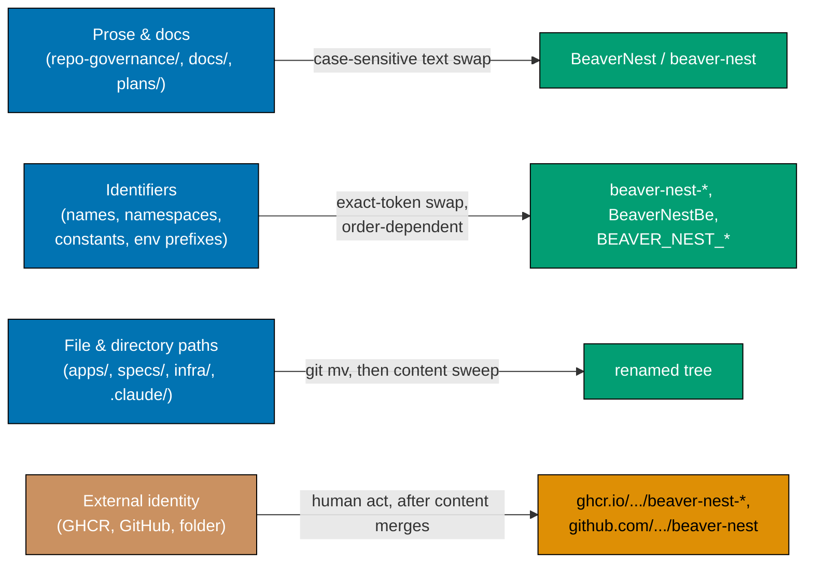

# Technical Documentation — BeaverNest Rebrand

## Architecture

This is a repository-wide identifier and prose rename with three genuinely distinct technical
layers, each with its own substitution risk:



## Canonical Substitution Vocabulary

| Old                                                           | New                                                 | Where it applies                                                                                                                                                                                                                                                                              |
| ------------------------------------------------------------- | --------------------------------------------------- | --------------------------------------------------------------------------------------------------------------------------------------------------------------------------------------------------------------------------------------------------------------------------------------------- |
| `BaseerahBe`                                                  | `BeaverNestBe`                                      | F# namespace/type prefix, `.fsproj` names, `.sln` project entries                                                                                                                                                                                                                             |
| `BaseerahBe.Contracts`                                        | `BeaverNestBe.Contracts`                            | Generated OpenAPI F# contracts namespace                                                                                                                                                                                                                                                      |
| `BaseerahBe.UnitTests`                                        | `BeaverNestBe.UnitTests`                            | F# unit-test project                                                                                                                                                                                                                                                                          |
| `BaseerahBe.IntegrationTests`                                 | `BeaverNestBe.IntegrationTests`                     | F# integration-test project                                                                                                                                                                                                                                                                   |
| `BASEERAH_BE_`                                                | `BEAVER_NEST_BE_`                                   | Backend env var prefix (`BASEERAH_BE_PORT`, `BASEERAH_BE_CORS_ORIGINS`)                                                                                                                                                                                                                       |
| `BASEERAH_FE_`                                                | `BEAVER_NEST_FE_`                                   | Frontend env var prefix (`BASEERAH_FE_API_BASE_URL`)                                                                                                                                                                                                                                          |
| `baseerah-be`                                                 | `beaver-nest-be`                                    | Nx project name, dir name, GHCR image, workflow refs                                                                                                                                                                                                                                          |
| `baseerah-be-e2e`                                             | `beaver-nest-be-e2e`                                | Nx project name, dir name                                                                                                                                                                                                                                                                     |
| `baseerah-fe`                                                 | `beaver-nest-fe`                                    | Nx project name, dir name                                                                                                                                                                                                                                                                     |
| `baseerah-fe-e2e`                                             | `beaver-nest-fe-e2e`                                | Nx project name, dir name                                                                                                                                                                                                                                                                     |
| `baseerah-contracts`                                          | `beaver-nest-contracts`                             | Nx project name, spec-tree dir                                                                                                                                                                                                                                                                |
| `baseerah-app`                                                | `beaver-nest-app`                                   | `infra/dev/` dir, workflow group name, npm script prefix                                                                                                                                                                                                                                      |
| `baseerah-default`                                            | `beaver-nest-default`                               | `.amazonq/cli-agents/` file + its embedded `name` field                                                                                                                                                                                                                                       |
| `stag-baseerah-fe` / `stag-baseerah-be`                       | `stag-beaver-nest-fe` / `stag-beaver-nest-be`       | Deploy-branch name strings (no real branch exists yet)                                                                                                                                                                                                                                        |
| `baseerah-app-staging` / `baseerah-app-local`                 | `beaver-nest-app-staging` / `beaver-nest-app-local` | GitHub Actions `environment:` key strings (`[Repo-grounded]`: `gh api repos/wahidyankf/baseerah/environments` returned exactly these two auto-created Environment objects on 2026-08-01, both with empty `protection_rules` and no secrets — Phase 13 deletes them after the workflow rename) |
| `Baseerah`                                                    | `BeaverNest`                                        | Title-case brand prose                                                                                                                                                                                                                                                                        |
| `baseerah`                                                    | `beaver-nest`                                       | Catch-all lowercase (paths, prose, remaining mentions)                                                                                                                                                                                                                                        |
| `بصيرة` / `wawasan` / "insight, inner vision" etymology prose | _(removed, not translated)_                         | Per Decision 3 below — BeaverNest has no invented meaning                                                                                                                                                                                                                                     |

**Substitution order (most-specific first, mandatory)**: run rows top-to-bottom. Running the
lowercase catch-all (`baseerah` → `beaver-nest`) before the more specific rows would still produce
correct results in isolation (each specific row's old string is a superset containing the lowercase
substring, so once the specific row fires, no literal `baseerah` remains to catch) — but running
specific rows AFTER the catch-all would double-mangle already-converted text (e.g. `beaver-nest-be`
does not contain the literal string `baseerah-be` for a later specific rule to match). Always apply
top-to-bottom.

**Reference implementation** (perl, portable across BSD/GNU `sed` differences — used by every phase
below, scoped to that phase's file set via `git ls-files -z <path>` piped to `xargs -0`):

```bash
perl -pi -e '
  s/BaseerahBe\.Contracts/BeaverNestBe.Contracts/g;
  s/BaseerahBe\.UnitTests/BeaverNestBe.UnitTests/g;
  s/BaseerahBe\.IntegrationTests/BeaverNestBe.IntegrationTests/g;
  s/BaseerahBe/BeaverNestBe/g;
  s/BASEERAH_BE_/BEAVER_NEST_BE_/g;
  s/BASEERAH_FE_/BEAVER_NEST_FE_/g;
  s/baseerah-be-e2e/beaver-nest-be-e2e/g;
  s/baseerah-fe-e2e/beaver-nest-fe-e2e/g;
  s/baseerah-be/beaver-nest-be/g;
  s/baseerah-fe/beaver-nest-fe/g;
  s/baseerah-contracts/beaver-nest-contracts/g;
  s/baseerah-app/beaver-nest-app/g;
  s/baseerah-default/beaver-nest-default/g;
  s/stag-baseerah-fe/stag-beaver-nest-fe/g;
  s/stag-baseerah-be/stag-beaver-nest-be/g;
  s/baseerah-app-staging/beaver-nest-app-staging/g;
  s/baseerah-app-local/beaver-nest-app-local/g;
  s/Baseerah/BeaverNest/g;
  s/baseerah/beaver-nest/g;
'
```

Each phase below scopes this exact script (or the relevant subset of its lines when a phase's file
set cannot contain certain patterns, e.g. governance prose never contains `BaseerahBe`) to a
specific `git ls-files` glob, then verifies with a phase-scoped `git grep` count.

## Decision Log

1. **Display name and slug casing** (Q1): "BeaverNest" (display) / "beaver-nest" (kebab). Decided
   before this plan began; not re-litigated.
2. **F# PascalCase identifiers** (Q2): direct mechanical rename `BaseerahBe` → `BeaverNestBe`,
   preserving the existing `<Brand><Type>` pattern, applied identically to `.Contracts`,
   `.UnitTests`, `.IntegrationTests`.
3. **Removal of the multilingual brand chip, not relabeling it** (surfaced during writing, resolved
   by inference from Q7, confirmed in the post-write grill): the existing landing page renders a
   hoverable chip glossing "بصيرة" (Arabic) / "wawasan" (Indonesian) — this UI element exists solely
   to explain Baseerah's etymology. Since Q7 states BeaverNest has no invented meaning, there is no
   equivalent term to gloss, so the chip, its Gherkin scenario ("The multilingual brand chip is
   understandable..."), its unit test, and its E2E step are all **removed**, not translated. The
   one-line homepage description (already required by the existing "tells a first-time visitor"
   scenario) is what remains to explain the product.
4. **GitHub repo rename timing** (Q3): last, immediately before the two closing `[HUMAN]` phases —
   every content phase merges to `origin main` under the OLD repo URL first; the GitHub rename
   itself relies on GitHub's automatic redirect from the old name.
5. **Local checkout folder rename timing** (Q4): last of all, after the GitHub rename. The human
   runs `mv` on the local folder and re-points `origin` only once the repo entity itself has been
   renamed.
6. **Historical-citation preservation rule** (surfaced during writing; broadened after the
   iteration-2 plan-checker re-validation, HIGH-NEW-3, found the original 3-file enumeration
   materially incomplete): `plans/done/2026-07-31__baseerah-repo-reset/**` is never renamed (it is a
   completed, archived, immutable record). Any OTHER git-tracked file that cites that folder's
   literal path or plan-id (`baseerah-repo-reset`) keeps that literal citation string unchanged (the
   path is real and unrenamed), while the surrounding brand prose in those same files (e.g.
   "Baseerah" → "BeaverNest", `baseerah-be` → `beaver-nest-be`) still converts. A live
   `git grep -lic "baseerah-repo-reset" -- . ':!plans/done' ':!generated-reports'` run on
   2026-08-01 found **33** such files spread across `repo-governance/`, `docs/`, `infra/dev/`,
   `libs/`, `apps/`, `plans/backlog/`, `plans/ideas/`, `plans/in-progress/README.md`, and
   `specs/apps/baseerah/**` — far more than a hand-maintained enumeration can reliably track as the
   repo evolves, and the exact failure mode this plan already demonstrated in iteration 1
   (HIGH-4/5/6) and iteration 2 (Fix 6/HIGH-NEW-3). **Chosen mechanism: a rule, not an allowlist**
   (approach (b) over approach (a), because a rule generalizes correctly to files this Decision
   never enumerates, while an allowlist silently drifts stale every time a new file cites the string
   — exactly what happened here twice already). Concretely: every phase that sweeps a file set
   (Phases 2, 3, 4, 6, 7, 12, 16) first captures `git grep -l "baseerah-repo-reset" <phase's file
set>` **before** applying `<CANONICAL-SED>`; after the sweep, for every captured file, it applies
   the scoped revert `perl -pi -e 's/beaver-nest-repo-reset/baseerah-repo-reset/g' <file>` (safe
   because the literal string `beaver-nest-repo-reset` cannot legitimately appear anywhere else — it
   only exists as the sed-mangled form of a preserved citation). The Repo-Wide Residual Sweep
   phase's zero-residual check treats **any** file citing `baseerah-repo-reset` outside
   `plans/done/` as an always-expected residual class (never a fixed list of named files), and that
   phase additionally runs `md links validate` as its own gate step to catch any citation whose
   shape changes without containing the literal substring (e.g. a relative link whose target path
   segment changed) — a check an allowlist or a plain `git grep` cannot perform.
7. **Delivery Mode** (Q5): `main-to-origin-main` — direct commits/pushes to the primary checkout's
   `main`, no worktree, no PR review cycle. This mirrors the mode already used by the immediately
   preceding `baseerah-repo-reset` plan in this same repository, and is appropriate for the same
   reason: every phase writes files a later phase's content sweep reads (renaming `specs/apps/baseerah/`
   before renaming `apps/baseerah-be`'s `codegen` target that references it would leave a dangling
   reference), so a serial spine with no parallel fan-out is correct regardless of mode.
8. **Brand palette file rename** (Q6): `libs/web-ui-token/src/baseerah.css` → `beaver-nest.css`. All
   OKLCH numeric values are byte-identical before and after — only the file name and the
   brand-meaning header comments change (the بصيرة-specific comment is replaced with a plain
   statement that this is BeaverNest's palette, per Decision 3/Q7 — no invented meaning).
9. **No invented meaning / etymology** (Q7): `repo-governance/vision/beaver-nest.md` (replacing
   `baseerah.md`) states plainly that BeaverNest is a chosen product name with no etymological
   parallel to `بصيرة`, rather than inventing a new symbolic meaning to fill the gap.
10. **Cross-repo scope** (Q8): explicitly out of scope. `ose-public`/`ose-primer`/`ose-private` are
    untouched; if any later inspection finds `baseerah` references there, that becomes a new,
    separate plan.
11. **GHCR hard cutover** (Q9): `ghcr.io/wahidyankf/beaver-nest-be` replaces
    `ghcr.io/wahidyankf/baseerah-be` outright — no dual-publish, no compatibility tag — because no
    production/staging target is provisioned yet and nothing depends on the old image name
    (`[Repo-grounded]`: `git branch -r` shows only `origin/main` as of 2026-08-01; no `stag-*`/`prod-*`
    branch exists).
12. **Literal GitHub repository URL preservation, mirroring Decision 6** (surfaced during
    plan-quality-gate iteration 17): the literal string `github.com/wahidyankf/baseerah` (and its
    `.git` clone form, plus the `cd baseerah` line immediately following a clone command) appears in
    five live files — `CONTRIBUTING.md`, `repo-governance/workflows/infra/development-environment-setup.md`
    (with two occurrences), `apps/baseerah-fe/Dockerfile`'s OCI source label,
    `apps/baseerah-fe/src/components/AppShell.tsx`'s "View on GitHub" link, and its assertion in
    `apps/baseerah-fe/src/app/page.test.tsx`. Unlike every other `baseerah` occurrence, GitHub does
    NOT forward-redirect a URL to a repository name that doesn't exist yet: renaming this string to
    `beaver-nest` before Phase 17's actual `gh repo rename` would produce a dead link for the entire
    span between Phase 1 (or 2, or 10) and Phase 17 — including during Phase 16's live Rule-15
    web-triad retest, which would flag the "View on GitHub" link as broken with no fix available yet.
    `md links validate` cannot catch this either way (it silently skips external URLs). Phases 1, 2,
    and 10 therefore preserve this literal string exactly like Decision 6 preserves
    `baseerah-repo-reset` citations (capture, sed, scoped revert); Phase 17 flips it to
    `beaver-nest` in one final sweep immediately after the real GitHub rename succeeds, when the new
    URL is finally live and resolvable.

## Design-Funnel and Syllabus-Record Exemptions

**UI-design-funnel**: exempt. This plan changes existing brand copy and removes one existing UI
element (the etymology chip, Decision 3); it adds no new screen, no new layout, and no new
component. The token file's OKLCH values are byte-identical (Decision 8/Q6) — there is no new
visual design to fun through diverge/narrow/select/justify.

**Learning-bearing syllabus record**: exempt. This plan does not author or restructure any course,
tutorial, or curriculum content.

## Feature Change Completeness — Both Paths Applicability

This plan touches `apps/` (`beaver-nest-fe`, `beaver-nest-be`) and changes one piece of observable
behavior (the rendered brand copy and the removal of the etymology chip — see PRD AC2–AC5). Per the
[Feature Change Completeness Convention](../../../repo-governance/development/quality/feature-change-completeness.md),
the Gherkin feature file under `specs/apps/beaver-nest/behavior/beaver-nest-fe/gherkin/hello/landing-page.feature`
updates in the same phase (Phase 10) as the component copy change and the chip removal — RED (update
the feature file's expected text, which fails against the still-old component), GREEN (update the
component to match), REFACTOR (delete the now-orphaned chip test/step files). Every other phase is a
pure identifier/path rename with no behavior change, and is verified by keeping existing tests green
throughout (a refactor safety net), not by writing new failing tests.

## `rhino-cli` Functional Couplings (Not Just Prose)

`[Repo-grounded]`: `apps/rhino-cli` hardcodes the following as real Rust constants/logic, not
illustrative comments, and each requires a synchronized update, verified by `rhino-cli`'s own test
suite passing (not just a grep):

- `apps/rhino-cli/src/application/agents/bindings.rs` — `AMAZONQ_AGENT_DEFINITION` constant
  (`".amazonq/cli-agents/baseerah-default.json"`) and `AGENT_DEFINITION_CONTENT` (a template string
  embedding `"name": "baseerah-default"`), plus three test assertions that read the actual generated
  file and assert its `name` field.
- `apps/rhino-cli/tests/agents.rs` — seven more assertions against the same path and `name` field:
  two fixture-setup path-string assertions, two path-string assertions inside step-function bodies,
  the generated file's `name`-field assertion, a drift-detection output-string assertion, and the
  `cucumber` `#[then(...)]` step-binding literal itself. That last one is matched verbatim by
  `specs/apps/rhino/behavior/rhino-cli/gherkin/harness/agents-bindings.feature:15` — the two must be
  renamed together (see below), or `specs:behavior:coverage` reports a step-binding mismatch.
- `apps/rhino-cli/src/application/domain_coverage/mod.rs` and
  `apps/rhino-cli/src/commands/specs_validate_counts.rs` — self-contained unit-test fixtures using
  `baseerah`/`baseerah-be` as example data (these do not read the real `repo-config.yml`, so renaming
  them is a consistency improvement, not a required fix, but is done anyway to avoid semantic drift
  with the renamed `specs/apps/beaver-nest/` tree).
- `apps/rhino-cli/src/application/repo_governance/frontmatter_audit.rs` — a test fixture path
  `apps/baseerah-fe/content/post.md` (illustrative, self-contained).
- `apps/rhino-cli/tests/docs.rs` — a second, shape-identical fixture using the same illustrative
  path `apps/baseerah-fe/content/post.md` (self-contained). Unlike the three fixtures above, this
  file lives under `tests/` rather than `src/`, so it is exercised only by `test:integration`
  (`test:unit`'s explicit `--test` list does not include it).
- `apps/rhino-cli/src/commands/specs_coverage.rs` — a code comment citing "the baseerah-repo-reset
  plan" (historical citation, preserved per Decision 6).
- `apps/rhino-cli/src/application/docs/naming.rs` — a doc-comment citing "a Baseerah-identity
  rewrite" (prose only, no functional change).
- `specs/apps/rhino/behavior/rhino-cli/gherkin/harness/agents-bindings.feature` — line 15's step
  text (`And the file .amazonq/cli-agents/baseerah-default.json is written as a valid Amazon Q
agent definition`) is matched verbatim by the `cucumber` `#[then(...)]` literal in
  `apps/rhino-cli/tests/agents.rs`. This file sits outside `specs/apps/beaver-nest/` (it lives under
  `specs/apps/rhino/`, the `rhino-cli` app's own behavior tree) and is not covered by the
  `specs/apps/baseerah/` → `specs/apps/beaver-nest/` scope entry above — it is a separate, explicit
  scope addition (see [README.md Scope](./README.md#scope)).

## File-Impact Inventory (by directory, git-tracked count as of 2026-08-01)

| Directory                                                                                                                                                                                                                                   | Files referencing `baseerah` (case-insensitive) | Nature of change                                                  |
| ------------------------------------------------------------------------------------------------------------------------------------------------------------------------------------------------------------------------------------------- | ----------------------------------------------- | ----------------------------------------------------------------- |
| `repo-governance/conventions/`                                                                                                                                                                                                              | 36                                              | Prose + illustrative paths                                        |
| `repo-governance/development/`                                                                                                                                                                                                              | 32                                              | Prose + illustrative paths                                        |
| `apps/baseerah-be/`                                                                                                                                                                                                                         | 23                                              | Dir rename, F# namespaces, env vars, Dockerfile                   |
| `specs/apps/baseerah/`                                                                                                                                                                                                                      | 19                                              | Dir rename, feature-file text, contracts project                  |
| `apps/baseerah-fe/`                                                                                                                                                                                                                         | 19                                              | Dir rename, TSX copy, env vars, Dockerfile                        |
| `docs/reference/`                                                                                                                                                                                                                           | 13                                              | Prose + illustrative paths                                        |
| `repo-governance/workflows/`                                                                                                                                                                                                                | 10                                              | Prose + illustrative paths                                        |
| `plans/backlog/`                                                                                                                                                                                                                            | 10                                              | Prose (active plans, not historical)                              |
| `apps/rhino-cli/`                                                                                                                                                                                                                           | 8                                               | Rust constants + test fixtures (see above)                        |
| `specs/apps/rhino/`                                                                                                                                                                                                                         | 1                                               | Cucumber step text in lockstep with `tests/agents.rs` (see above) |
| `plans/ideas/`                                                                                                                                                                                                                              | 7                                               | Prose + 3 filename renames                                        |
| `apps/baseerah-fe-e2e/`                                                                                                                                                                                                                     | 7                                               | Dir rename, step text                                             |
| `apps/baseerah-be-e2e/`                                                                                                                                                                                                                     | 7                                               | Dir rename, project.json                                          |
| `.claude/agents/`                                                                                                                                                                                                                           | 6                                               | 5 file renames + README catalog                                   |
| `.opencode/agents/`                                                                                                                                                                                                                         | 5                                               | Mirror of `.claude/agents/` renames                               |
| `.github/workflows/`                                                                                                                                                                                                                        | 5                                               | 3 file renames + job/output names                                 |
| `.cursor/agents/`                                                                                                                                                                                                                           | 5                                               | Mirror of `.claude/agents/` renames                               |
| `infra/dev/`                                                                                                                                                                                                                                | 4                                               | Dir rename, compose service names                                 |
| `docs/how-to/`                                                                                                                                                                                                                              | 4                                               | Prose                                                             |
| `docs/explanation/`                                                                                                                                                                                                                         | 3                                               | Prose                                                             |
| `repo-governance/vision/`                                                                                                                                                                                                                   | 2                                               | File rename + `README.md` link                                    |
| `libs/web-ui-token/`                                                                                                                                                                                                                        | 2                                               | File rename + README                                              |
| `.claude/skills/`                                                                                                                                                                                                                           | 2                                               | Skill dir rename + brand-context.md                               |
| Root files (`README.md`, `CONTRIBUTING.md`, `ROADMAP.md`, `AGENTS.md`, `package.json`, `package-lock.json`, `.gitignore`, `baseerah.sln`, `SECURITY.md`, `LICENSING-NOTICE.md`, `libs/README.md`, `apps/README.md`, `.amazonq/cli-agents/`) | 13                                              | Prose + 2 file renames (`baseerah.sln`, `baseerah-default.json`)  |

Row sum: 243 files (the per-directory breakdown above, tallied 2026-08-01). `brd.md` and Phase 0
of `delivery.md` separately cite **246** as the authoring-time live-grep snapshot
(`[Repo-grounded]`: `git grep -liE "baseerah" -- . ':!plans/done' ':!generated-reports' \| wc -l`,
run 2026-08-01) — the 3-file gap between this table's row sum and that snapshot is unresolved
minor drift between when the table was tallied and when the snapshot command ran, not a
directory this table omits. Per Phase 0's own tolerance language, any deviation between either
number and the count at execution time is expected and non-blocking — re-run the live command
and use its result, not either historical figure.

## Rollback

Every phase pushes directly to `origin main` (Delivery Mode `main-to-origin-main`). Rollback for any
single phase is `git revert` of that phase's commit(s), since each phase is scoped to one directory
tree and produces its own commit(s) per the Commit Guidelines. There is no PR to close and no
worktree to discard. The two closing `[HUMAN]` phases (GitHub repo rename, local folder rename) are
each independently reversible by the maintainer (GitHub supports renaming a repo back; `git remote
set-url` reverts the local re-point) and do not depend on any git history rewrite.

## Testing Strategy

| Level                                      | Covers                                                                                                                                                                                                                                                                                                                                                                                                                                                                                                                                                     |
| ------------------------------------------ | ---------------------------------------------------------------------------------------------------------------------------------------------------------------------------------------------------------------------------------------------------------------------------------------------------------------------------------------------------------------------------------------------------------------------------------------------------------------------------------------------------------------------------------------------------------- |
| Unit (`test:unit`)                         | `beaver-nest-be`'s F# handler tests, `beaver-nest-fe`'s Vitest component tests (updated brand text assertions), `rhino-cli`'s binding-constant tests                                                                                                                                                                                                                                                                                                                                                                                                       |
| Integration (`test:integration`)           | `beaver-nest-be`'s host-boot integration test (no behavior change expected, verifies the renamed project still boots)                                                                                                                                                                                                                                                                                                                                                                                                                                      |
| E2E (`test:e2e`)                           | `beaver-nest-be-e2e`, `beaver-nest-fe-e2e` Playwright suites against the renamed local Docker stack — exercised by the CRON/`workflow_dispatch`-only `beaver-nest-app-test-local-deploy-stag.yml` workflow (named `baseerah-app-test-local-deploy-stag.yml` before Phase 13 renames it), **not** by this plan's own push-triggered "Local Quality Gates" steps, which run only `typecheck lint test:quick specs:behavior:coverage`; Phase 16's manual Playwright MCP verification is what actually exercises the renamed stack end-to-end during this plan |
| Specs coverage (`specs:behavior:coverage`) | `specs/apps/beaver-nest/behavior/**` Gherkin scenarios, updated in lockstep with the copy change (Phase 10)                                                                                                                                                                                                                                                                                                                                                                                                                                                |
| Manual (Playwright MCP + curl)             | Rule-15 web triad + curl API check, both against the renamed local stack, per Phase 16                                                                                                                                                                                                                                                                                                                                                                                                                                                                     |

## Related Documentation

- [Delivery Mode & Worktree](./delivery.md) — the executable checklist and mode declaration
- [BRD](./brd.md), [PRD](./prd.md) — business and product requirements this technical approach serves
