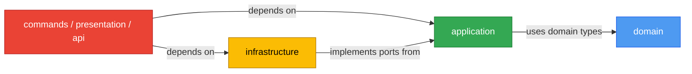
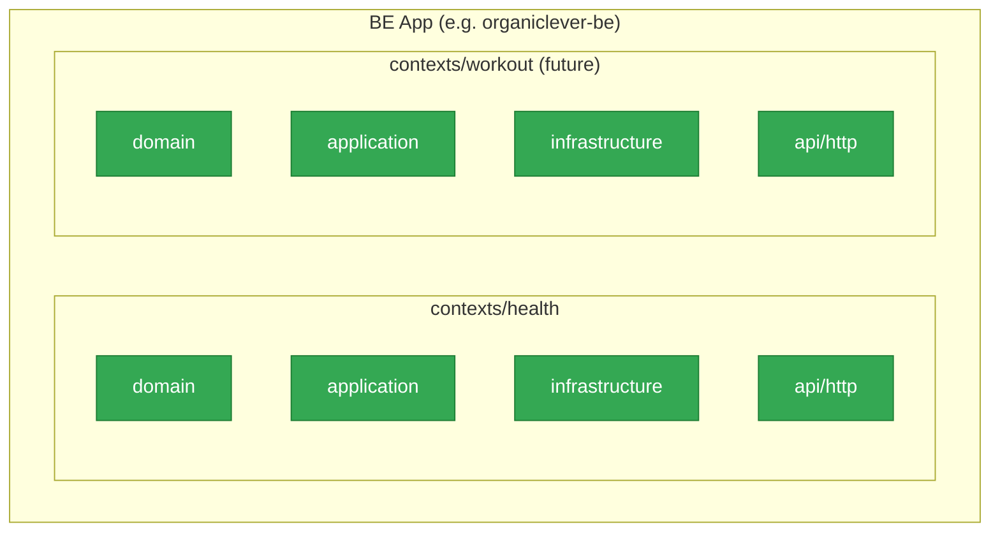

# Tech Docs — Adopt Hexagonal Architecture + DDD

## Architecture Overview

Hexagonal architecture (Ports and Adapters) organizes code into concentric layers. The inner
layers hold business logic and define interfaces (ports). The outer layers implement those
interfaces (adapters) and connect to the real world (HTTP, filesystem, database, CLI args).

The core dependency rule: **outer layers may depend on inner layers; inner layers must never
depend on outer layers.**



For BE apps, DDD bounded contexts wrap this layer stack. Each context has its own isolated
domain model; contexts communicate through well-defined integration interfaces, not by sharing
domain types.



## Layer Definitions

### domain/

Contains pure business types and logic. No imports from any framework, runtime, or external
library except standard types. In Rust: plain structs, enums, `Result` types, and trait
definitions that describe domain behaviors (ports). In F#: discriminated unions, record types,
and `Result<'T,'TError>` railway-oriented functions. In TypeScript: plain types, interfaces
(`Effect.ts Context.Tag` as port), and pure functions.

**Forbidden imports in domain/:** `axum`, `next`, `react`, `tokio` I/O, `sqlx`, `reqwest`,
`fs`, database clients, HTTP clients, CLI parsing libraries.

### application/

Orchestrates domain logic via use cases. Calls domain functions and delegates I/O to ports
(interfaces defined here, implemented in `infrastructure/`). In TypeScript, the
`application/index.ts` barrel is the published API surface; `presentation/` and
cross-context callers import ONLY from this barrel.

**Permitted imports in application/:** domain types, port traits/interfaces defined in this
layer, standard error types.

**Forbidden imports in application/:** concrete infrastructure adapters, HTTP frameworks,
React, filesystem I/O.

### infrastructure/

Implements ports defined in `application/`. Contains all I/O: database queries, filesystem
reads, HTTP client calls, PGlite stores, external service clients. In Rust: structs that
`impl` the port traits. In F#: adapter functions composed at `Program.fs`. In TypeScript:
Effect.ts `Layer` implementations of `Context.Tag` services.

### commands/ (CLI inbound adapter)

Parses CLI arguments (Clap in Rust) and calls `application/` use cases. The only layer
that imports `clap`. Maps application-layer results to exit codes and stdout output.

### presentation/ (web inbound adapter)

Contains React components, Next.js pages, Server Components, Server Actions, and route
handlers. Imports from `application/index.ts` barrel only — never directly from `domain/`
or `infrastructure/`. Server Components and Server Actions are inbound adapters.

**Forbidden imports in presentation/:** direct domain types (use application barrel instead),
direct infrastructure adapters.

### api/ (BE inbound adapter — BE apps only)

Groups all inbound transport adapters. Expands as new transports are added:

```
api/
  http/       ← REST (Axum / Giraffe) — present now
  graphql/    ← GraphQL — future
  mcp/        ← MCP — future
```

`api/http/` contains Axum route handlers (Rust) or Giraffe HTTP handlers (F#). Maps HTTP
request shapes to application-layer calls and maps application results to HTTP responses. In
Rust, the `From<DomainError> for ApiError` conversion lives in `api/http/`. Domain errors
must not contain HTTP status codes.

## Design Decisions

### DD-1: Single-crate module layout for Rust CLIs and BE (not multi-crate workspace)

**Decision:** Organize Rust CLIs and `organiclever-be` as a single crate with modules, not
as a multi-crate Cargo workspace.

**Rationale:** Multi-crate workspaces give compile-time layer enforcement (inner crates cannot
import outer crates) but add significant tooling complexity (per-crate `project.json`, separate
`Cargo.toml` per layer, slower incremental builds). The existing codebase is single-crate.
Layer enforcement is achieved through code review and linting conventions, which is sufficient
at current scale.

**Trade-off accepted:** No compile-time prevention of import-direction violations. Mitigated
by convention documentation and CI lint checks.

### DD-2: Rust traits as ports — async-trait for dynamic dispatch, native async fn for static

**Decision:** In `organiclever-be`, port traits that need dynamic dispatch (`dyn Trait`) use
`#[async_trait]` from the `async-trait` crate. Port traits used only with generics (static
dispatch) use native `async fn in trait` (Rust 1.75+, MSRV 1.88 confirmed).
[Repo-grounded: `apps/organiclever-be/Cargo.toml` MSRV 1.88 — verified via project files]

**Rationale:** Native `async fn in trait` is simpler and has no boxing overhead, but requires
Rust 1.75+ and does not support `dyn Trait`. For the current `health` context, static dispatch
suffices. `async-trait` is reserved for cases requiring `Box<dyn Trait>`.

### DD-3: Axum wrapping in organiclever-be

**Decision:** `main.rs` imports only a top-level `start_server` function from an `http` or
`app` module. `main.rs` never imports `axum::Router` directly.

**Rationale:** Keeps the composition root minimal. Axum types are confined to the `api/http/`
layer of each context plus a top-level `app.rs` router composer.

### DD-4: F# fsproj compilation order is the dependency-enforcement mechanism

**Decision:** F# files in `OseAppBe.fsproj` are ordered strictly: domain types first,
application next, infrastructure, api/http handlers, `Program.fs` last. This is the F#
compiler's natural constraint — a file may only reference files listed earlier.

**Rationale:** F# has no runtime DI container; the composition root is `Program.fs`. Adapter
functions are pure functions composed explicitly. This makes the compilation order the
single source of truth for the dependency graph.

**Per-context fsproj ordering template:**

```
contexts/<name>/Domain/Types.fs
contexts/<name>/Domain/Logic.fs       (if needed)
contexts/<name>/Application/UseCases.fs
contexts/<name>/Infrastructure/Adapters.fs
contexts/<name>/Api/Http/Handlers.fs
```

### DD-5: TypeScript port pattern — Effect.ts Context.Tag

**Decision:** In all TypeScript web apps, ports are defined as `Effect.ts Context.Tag`
service interfaces in the `application/` layer. Infrastructure adapters implement these tags
as `Effect.ts Layer`. This formalizes what `organiclever-web` already does.
[Repo-grounded: existing organiclever-web contexts verified to use this pattern]

**Rationale:** Effect.ts is already the standard library in these apps. Context.Tag provides
compile-time safe dependency injection without a separate DI container.

### DD-6: Application layer barrel for TypeScript

**Decision:** Each bounded context's `application/` layer exposes an `index.ts` barrel that
is the sole public API surface. `presentation/` and cross-context callers import only from
`contexts/<name>/application/index.ts`.

**Rationale:** Prevents domain type leakage into presentation and avoids tight coupling
between contexts. `organiclever-web` implements this; all other web apps will follow.

### DD-7: OpenAPI codegen tooling choices

**TypeScript client:** `hey-api/openapi-ts` (production-grade, active maintenance, used by
Vercel). Generates TypeScript types + fetch client from OpenAPI 3.1 spec. Output lands in
`apps/<name>/src/generated-contracts/`. [Web-cited: https://github.com/hey-api/openapi-ts,
accessed 2026-05-26 — "The successor to openapi-typescript-codegen. Used in production by
Vercel, OpenCode, PayPal and others."]

**Rust server:** `openapi-generator` with `rust-axum` generator target. Quality note: the
Rust/Axum server generator is community-maintained and its output quality varies by spec
complexity. Phase 5 delivery steps include a quality-evaluation checkpoint; if output is
insufficient, the fallback is hand-written type aliases referencing the spec schema names,
annotated `[Judgment call]` in delivery notes.

### DD-8: organiclever-be uses existing codegen Nx target pattern

**Decision:** Wire `organiclever-be:codegen` following the pattern already in
`organiclever-contracts/project.json` and the existing `codegen` target in
`apps/organiclever-be/project.json`.
[Repo-grounded: `apps/organiclever-be/project.json` already has a `codegen` target —
verified via Nx target audit]

**Rationale:** Re-use the established `codegen` Nx target shape; no new build infrastructure
needed.

### DD-9: Empty layer directories get .gitkeep

**Decision:** Every newly created empty layer directory (`domain/`, `application/`, etc.)
receives a `.gitkeep` file so Git tracks it.

**Rationale:** Git does not track empty directories. Without `.gitkeep`, the layer directory
disappears on clone and the structure is lost. This is a simple, universal convention already
used elsewhere in the repo.

## Per-Language Directory Layouts

### Rust CLI (canonical target layout)

```
apps/<name>/src/
├── commands/           ← inbound adapter (Clap parsing, calls application/)
│   ├── mod.rs
│   └── <verb>.rs
├── domain/             ← NEW: pure business types, port trait definitions
│   ├── mod.rs
│   └── <entity>.rs
├── application/        ← NEW: use cases, port interfaces
│   ├── mod.rs
│   └── <use_case>.rs
├── infrastructure/     ← NEW: port implementations (filesystem, HTTP, etc.)
│   ├── mod.rs
│   └── <adapter>.rs
├── cli.rs              ← Clap top-level CLI struct
├── lib.rs              ← re-exports domain, application, infrastructure, commands
└── main.rs             ← calls cli.rs; no business logic
```

**rhino-cli exception:** Inner layers go under `src/internal/` (existing convention).
`src/internal/` gains `domain/`, `application/`, `infrastructure/` subdirectories alongside
existing modules. `src/commands/` remains unchanged.

**crane-cli rename map:**

| Current         | Target                      |
| --------------- | --------------------------- |
| `src/core/`     | `src/domain/`               |
| `src/models/`   | merged into `src/domain/`   |
| `src/adapters/` | `src/infrastructure/`       |
| `src/commands/` | `src/commands/` (unchanged) |

### TypeScript Web App (per bounded context)

```
apps/<name>/src/contexts/<context-name>/
├── domain/             ← pure types, port interfaces (Context.Tag definitions)
│   └── index.ts
├── application/        ← use cases, service composition
│   └── index.ts        ← THE ONLY public import surface for this context
├── infrastructure/     ← port implementations (PGlite, fetch, filesystem)
│   └── index.ts
└── presentation/       ← React components, Next.js pages, Server Actions
    └── index.ts
```

**Placement rules:**

- `domain/`: plain TypeScript types and `Context.Tag` port definitions. No `next/`, no
  `react`, no Effect I/O.
- `application/`: use cases using Effect.ts. Depends on domain types and port tags. Exports
  a single `index.ts` barrel.
- `infrastructure/`: Effect.ts `Layer` implementations. Imports PGlite, fetch, or other
  I/O libraries.
- `presentation/`: React components and Next.js routes. Imports from
  `../application/index.ts` only — never from `../domain/` or `../infrastructure/` directly.

### Rust BE (organiclever-be)

```
apps/organiclever-be/src/
├── contexts/
│   └── health/
│       ├── domain/         ← HealthStatus type, port traits
│       │   └── mod.rs
│       ├── application/    ← use cases (get_health use case)
│       │   └── mod.rs
│       ├── infrastructure/ ← port implementations (if any; may be .gitkeep-only initially)
│       │   └── mod.rs
│       └── api/            ← inbound adapters (REST, GraphQL, MCP when added)
│           ├── mod.rs
│           └── http/       ← Axum handler, From<DomainError> for ApiError
│               └── mod.rs
├── app.rs                  ← Router composition: routes health::api::http::routes()
├── config.rs               ← Config struct
├── errors.rs               ← Top-level AppError (HTTP-layer errors)
├── lib.rs                  ← pub mod app, config, errors, contexts
└── main.rs                 ← start_server only; no business logic
```

### F# BE (ose-app-be)

```
apps/ose-app-be/src/OseAppBe/
├── contexts/
│   ├── health/
│   │   ├── Domain/
│   │   │   └── Types.fs        ← HealthStatus DU
│   │   ├── Application/
│   │   │   └── UseCases.fs     ← getHealth : unit -> Result<HealthStatus, AppError>
│   │   ├── Infrastructure/
│   │   │   └── .gitkeep        ← (health has no I/O adapters)
│   │   └── Api/
│   │       └── Http/
│   │           └── Handlers.fs ← Giraffe handler, maps Result to HttpHandler
│   ├── regulatory-source/
│   │   ├── Domain/Types.fs
│   │   ├── Application/UseCases.fs
│   │   ├── Infrastructure/Adapters.fs
│   │   └── Api/Http/Handlers.fs
│   ├── gap-analysis/   (same structure)
│   ├── internal-policy/ (same structure)
│   └── ai-orchestration/ (same structure)
├── Contracts/
│   └── ContractWrappers.fs     ← unchanged
└── Program.fs                  ← composition root; lists <Compile> in domain-first order
```

**fsproj compilation order after refactor (template):**

```xml
<!-- Generated contracts (unchanged) -->
<Compile Include="..\..\generated-contracts\OpenAPI\src\OseAppBe.Contracts\HealthResponse.fs" ... />
<Compile Include="Contracts/ContractWrappers.fs" />
<!-- Health context -->
<Compile Include="contexts/health/Domain/Types.fs" />
<Compile Include="contexts/health/Application/UseCases.fs" />
<Compile Include="contexts/health/Api/Http/Handlers.fs" />
<!-- RegulatorySource context -->
<Compile Include="contexts/regulatory-source/Domain/Types.fs" />
<Compile Include="contexts/regulatory-source/Application/UseCases.fs" />
<Compile Include="contexts/regulatory-source/Infrastructure/Adapters.fs" />
<Compile Include="contexts/regulatory-source/Api/Http/Handlers.fs" />
<!-- ... repeat for gap-analysis, internal-policy, ai-orchestration -->
<!-- Entry point -->
<Compile Include="Program.fs" />
```

## Dependencies

### New dependencies introduced

| App                | Dependency              | Version       | Purpose                   | Verification                                               |
| ------------------ | ----------------------- | ------------- | ------------------------- | ---------------------------------------------------------- |
| `organiclever-web` | `@hey-api/openapi-ts`   | `0.94.2`      | TypeScript client codegen | [Repo-grounded: `package.json` root workspace, 2026-05-26] |
| `ose-app-web`      | `@hey-api/openapi-ts`   | `0.94.2`      | TypeScript client codegen | [Repo-grounded: `package.json` root workspace, 2026-05-26] |
| `organiclever-be`  | `openapi-generator` CLI | latest stable | Rust server type codegen  | [Judgment call: quality evaluation required in Phase 5]    |

### Existing dependencies used (no version change)

- `axum` — already in `organiclever-be` [Repo-grounded]
- `async-trait` — **not yet in `organiclever-be` Cargo.toml**; add `async-trait = "0.1"` when
  dynamic dispatch (`dyn Trait`) is first required. Static dispatch (generics) uses native
  `async fn` in traits (Rust 1.75+, confirmed MSRV 1.88) and needs no extra crate.
- `effect` — already in all TypeScript web apps [Repo-grounded: existing organiclever-web usage]
- `Giraffe` — already in `ose-app-be` [Repo-grounded]

## Testing Strategy

This plan follows the
[Test-Driven Development Convention](../../../repo-governance/development/workflow/test-driven-development.md).
Every code item in the delivery checklist uses the RED → GREEN → REFACTOR cycle.

**Test levels per change type:**

| Change type                       | Test level                                            | Rationale                                                          |
| --------------------------------- | ----------------------------------------------------- | ------------------------------------------------------------------ |
| Rename Rust module / move file    | Unit (`test:unit`)                                    | Compiler catches import errors; unit tests catch logic regressions |
| Add empty layer directory         | No test needed                                        | Structural-only; verified by `ls`                                  |
| Move TypeScript file to new layer | Unit (`test:unit`) + typecheck                        | TypeScript import paths are tested by typecheck                    |
| Refactor BE bounded context       | Unit (`test:unit`) + Integration (`test:integration`) | Integration tests use real DB / real HTTP                          |
| Wire codegen target               | Build (`build`) + codegen target                      | Codegen output must compile                                        |

**Gherkin acceptance criteria** (defined in `prd.md`) are the natural source of first-failing
tests for the structural acceptance scenarios. They are verified at the unit+integration level
via `test:quick`.

## File Impact Summary

### New files (governance)

- `repo-governance/development/pattern/hexagonal-architecture.md` — _New file_
- `repo-governance/development/pattern/hexagonal-architecture-cli.md` — _New file_
- `repo-governance/development/pattern/hexagonal-architecture-web.md` — _New file_
- `repo-governance/development/pattern/hexagonal-architecture-be.md` — _New file_
- `repo-governance/development/pattern/openapi-contract-first.md` — _New file_

### Modified files (CLI apps)

- `apps/rhino-cli/src/internal/` — add `domain/`, `application/`, `infrastructure/` subdirs
- `apps/crane-cli/src/` — rename `core/` → `domain/`, `adapters/` → `infrastructure/`,
  merge `models/` into `domain/`, update `lib.rs`
- `apps/ose-cli/src/` — add `domain/`, `application/`, `infrastructure/` dirs and `lib.rs`
  module declarations
- `apps/ayokoding-cli/src/` — add `domain/`, `application/`, `infrastructure/` dirs and
  `lib.rs` module declarations

### Modified files (web apps)

- `apps/organiclever-web/src/contexts/` — add missing layers to `app-shell`, `health`,
  `landing`, `routing`, `stats`, `workout-session`
- `apps/ose-app-web/src/contexts/` — add all four layers to all four contexts
- `apps/wahidyankf-web/src/contexts/` — add `domain/` and `infrastructure/` to all contexts
- `apps/ayokoding-web/src/contexts/` — add `domain/` to all contexts
- `apps/ose-web/src/contexts/` — add missing layers to `health`, `landing`, `rss-feed`,
  `search`, `seo`

### Modified files (BE apps)

- `apps/organiclever-be/src/` — create `contexts/health/{domain,application,infrastructure,api/http}/`,
  move logic from `health/mod.rs`, update `lib.rs`, update `app.rs` router
- `apps/ose-app-be/src/OseAppBe/` — create `contexts/<name>/{Domain,Application,Infrastructure,Api/Http}/`,
  migrate existing F# files, reorder `OseAppBe.fsproj`

### Modified files (OpenAPI contracts)

- `apps/organiclever-be/project.json` — wire codegen target for Rust server types
- `apps/organiclever-web/project.json` — wire/verify codegen target for TS client types
- `apps/ose-app-web/project.json` — verify codegen target for TS client types
- CI workflow files — add codegen drift-check step

## Rollback Strategy

Each phase produces a clean, passing commit. If any phase causes a regression:

1. `git revert <phase-commit-sha>` to undo the phase
2. Diagnose the root cause using the failing test output
3. Fix the issue and re-attempt the phase steps

No database migrations are involved in this plan. All changes are source code restructuring;
rollback is always possible via git revert.
