# Delivery: Resizable Docs Sidebar (ayokoding-www)

> **Legend** — `[AI]`: an agent performs the step (the default; unmarked steps are `[AI]`).
> `[HUMAN]`: only a human can do it (physical action, out-of-band approval, real-secret or
> privileged-credential handling). `[AI+HUMAN]`: agent prepares, human approves or finishes.
>
> **Phase Gate** — every phase ends with a `### Phase N Gate` (must-pass verification) plus a
> `> **Pause Safety**:` note (the safe-to-stop state and the single command to resume). A phase is
> not complete until its gate is green; do not start phase N+1 while any gate check fails.

## Worktree

Worktree path: `worktrees/ayokoding-resizable-docs-sidebar/`

Optional manual pre-provisioning (run from repo root):

```bash
claude --worktree ayokoding-resizable-docs-sidebar
```

The plan-execution Step 0 gate enters this worktree by default: it auto-provisions from the latest
`origin/main` when missing, syncs with `origin/main` before implementing, and prompts before
deleting the worktree after the plan is archived and pushed.

See [Worktree Path Convention](../../../repo-governance/conventions/structure/worktree-path.md) and
[Plans Organization Convention §Worktree Specification](../../../repo-governance/conventions/structure/plans.md#worktree-specification).

## Delivery Mode: worktree-to-pr

Work in `worktrees/ayokoding-resizable-docs-sidebar/`; open a draft PR against `main`; the
PR-Review Maker→Fixer Cycle (default 3 sequential CI-gated cycles) runs before the `[HUMAN]` merge.
"Done" = a green, fully-reviewed PR handed off; the human merges on their own schedule.

## Phase Flow

```mermaid
%% Colour-blind-friendly palette: Blue #0173B2 (phase), Teal #029E73 (gate), Orange #DE8F05 (human)
flowchart LR
  P0["Phase 0<br/>Setup"]:::blue --> G0{"Gate 0"}:::teal
  G0 --> P1["Phase 1<br/>Design funnel"]:::blue --> G1{"Gate 1"}:::teal
  G1 --> P2["Phase 2<br/>Core model"]:::blue --> G2{"Gate 2"}:::teal
  G2 --> P3["Phase 3<br/>Primitive"]:::blue --> G3{"Gate 3"}:::teal
  G3 --> P4["Phase 4<br/>Desktop rail"]:::blue --> G4{"Gate 4"}:::teal
  G4 --> P5["Phase 5<br/>Mobile presets"]:::blue --> G5{"Gate 5"}:::teal
  G5 --> P6["Phase 6<br/>E2E + manual"]:::blue --> G6{"Gate 6"}:::teal
  G6 --> P7["Phase 7<br/>PR review"]:::blue --> G7{"Gate 7"}:::teal
  G7 --> P8["Phase 8<br/>Knowledge"]:::blue --> G8{"Gate 8"}:::teal
  G8 --> AR["Archival<br/>(AI)"]:::blue --> M["HUMAN merge"]:::orange

  classDef blue fill:#0173B2,stroke:#000000,color:#FFFFFF,stroke-width:2px
  classDef teal fill:#029E73,stroke:#000000,color:#FFFFFF,stroke-width:2px
  classDef orange fill:#DE8F05,stroke:#000000,color:#000000,stroke-width:2px
```



Each `Gate N` node is that phase's `### Phase N Gate` must-pass checklist; Phase N+1 does not start
while its predecessor's gate is red. `Archival` is the `[AI]`-executed Plan Archival sequence
(`git mv`, README updates, commit, push, CI re-verify) that runs after Phase 8 Gate is green.
`HUMAN merge` sits outside the AI done-boundary — it is the final step after Archival completes
(see Phase 7 Gate's Pause Safety note).

---

## Phase 0: Environment Setup and Baseline

> _Executor: repo-setup-manager_

- [ ] [AI] Provision/enter the worktree: `git worktree add worktrees/ayokoding-resizable-docs-sidebar origin/main`
      (skip if plan-execution Step 0 already entered it) — acceptance: `worktrees/ayokoding-resizable-docs-sidebar/` exists on a branch off `origin/main`
- [ ] [AI] Install dependencies in the root worktree: `npm install`
      — acceptance: exits 0, `node_modules/` synchronized
- [ ] [AI] Converge the toolchain in the root worktree: `npm run doctor -- --fix`
      — acceptance: exits 0 with no unresolved drift
- [ ] [AI] Record baseline for affected projects:
      `npx nx run-many -t typecheck lint test:quick specs:behavior:coverage -p web-ui ayokoding-www`
      — acceptance: baseline pass/fail recorded; every preexisting failure documented
- [ ] [AI] Verify the dev server starts: `npx nx dev ayokoding-www` (then stop it)
      — acceptance: server boots on port 3101 without error
- [ ] [AI] Resolve all preexisting failures before proceeding — acceptance: no preexisting failures remain

### Phase 0 Gate

> All checks below must pass before starting Phase 1.

- [ ] [AI] `npm install` exited 0 and `npm run doctor -- --fix` reports no unresolved drift
- [ ] [AI] `npx nx run-many -t typecheck lint test:quick specs:behavior:coverage -p web-ui ayokoding-www`
      baseline recorded and every preexisting failure resolved (zero unresolved)

> **Pause Safety**: only the local toolchain was verified and the baseline recorded — no feature
> work exists yet. Safe to stop indefinitely. To resume: re-run the baseline command and confirm it
> is still clean.

---

## Phase 1: UI Design Funnel + Prior Art

> Produces the funnel artefacts referenced in `prd.md` and the research grounding the primitive.

- [ ] [AI] Research prior art (R7): survey how comparable docs sites implement a resizable side rail
      (VS Code side bar, Docusaurus/Nextra sidebars, `react-resizable-panels` handle semantics),
      returning `[Verified]`/`[Needs Verification]` cited findings — acceptance: findings recorded in
      `prd.md §R7 prior-art citation`, replacing the `[Unverified]` placeholder
  - _Suggested executor: `web-researcher`_
- [ ] [AI] Survey existing UI (R5): read `libs/web-ui/src/primitives/scroll-area/scroll-area.tsx`,
      `libs/web-ui/src/primitives/index.ts`, the content `layout.tsx`, `sidebar-tree.tsx`, and
      `theme-toggle.tsx` — acceptance: `resizable-panel` confirmed net-new in `tech-docs.md §File Impact`
  - _Suggested executor: `swe-ui-maker` (with the `swe-developing-frontend-ui` skill)_
- [ ] [AI] Narrow: create the two hi-fi finalists
      `plans/in-progress/ayokoding-resizable-docs-sidebar/assets/resizable-sidebar-option-a.excalidraw.png`
      and `...-option-b.excalidraw.png` — acceptance: `grep -c "excalidraw.png" prd.md` ≥ 2 and both files exist
- [ ] [AI] Confirm Select + Justify + Responsive sections in `prd.md` are complete
      — acceptance: `grep -c "Selected:" prd.md` ≥ 1 and `grep -ci "responsive" prd.md` ≥ 1

### Phase 1 Gate

> All checks below must pass before starting Phase 2.

- [ ] [AI] `test -f plans/in-progress/ayokoding-resizable-docs-sidebar/assets/resizable-sidebar-option-a.excalidraw.png`
      and `...-option-b.excalidraw.png` both exit 0
- [ ] [AI] `prd.md §R7 prior-art citation` contains cited findings (no remaining `[Unverified]` placeholder)

> **Pause Safety**: design-funnel artefacts and research exist; no code changed. Safe to stop.
> To resume: re-check the two asset files exist and `prd.md` funnel sections are complete.

---

## Phase 2: `libs/web-ui` Core — pure width model

> _Suggested executor: `swe-typescript-dev`_

- [ ] [AI] **RED**: write failing tests for `clampWidth` and `parsePersistedWidth` in
      `libs/web-ui/src/primitives/resizable-panel/width-model.test.ts` (_New file_, _New test_)
      covering: clamp above max → 35% px, clamp below min → 15% px, inside band unchanged, parse
      "not-a-number" → undefined — command: `npx nx run web-ui:test:unit`
      — acceptance: test fails with "clampWidth is not defined"

  **Gherkin (underpins) →** "Clamp a requested width above the maximum"; "Clamp a requested width
  below the minimum"; "Keep a requested width already inside the band"; "Reject an unparseable
  persisted value"

- [ ] [AI] **GREEN**: implement `clampWidth(requestedPx, viewportPx, minPct, maxPct)` and
      `parsePersistedWidth(raw)` in `libs/web-ui/src/primitives/resizable-panel/width-model.ts`
      (_New file_) — command: `npx nx run web-ui:test:unit`
      — acceptance: all four scenarios pass, no other web-ui tests broken
- [ ] [AI] **REFACTOR**: extract the `MIN_PCT`/`MAX_PCT`/`DEFAULT_WIDTH` constants and tidy naming in
      `width-model.ts` — command: `npx nx run web-ui:test:unit`
      — acceptance: all tests still pass, no magic numbers inline

### Phase 2 Gate

> All checks below must pass before starting Phase 3.

- [ ] [AI] `npx nx run web-ui:test:unit` exits 0 with the four width-model scenarios passing
- [ ] [AI] `npx nx run web-ui:typecheck` exits 0

> **Pause Safety**: a pure, tested core module exists with no consumers yet — repo compiles and
> tests are green. Safe to stop. To resume: `npx nx run web-ui:test:unit`.

---

## Phase 3: `libs/web-ui` Primitive — hook, panel, handle

> _Suggested executor: `swe-ui-maker` (with the `swe-developing-frontend-ui` skill)_

- [ ] [AI] **RED**: write failing tests for `useResizableWidth` in
      `libs/web-ui/src/primitives/resizable-panel/use-resizable-width.test.tsx` (_New file_, _New test_)
      covering: initial width = default when `localStorage` empty; reads persisted value on mount;
      writes to key `ayokoding-sidebar-width` on resize-end — command: `npx nx run web-ui:test:unit`
      — acceptance: test fails with "useResizableWidth is not defined"

  **Gherkin (underpins) →** "Persist the chosen width across a reload"

  _Scope note_: narrowed to this one scenario — the hook's mount-read + resize-end write of the
  persisted width is what it underpins; the drag/keyboard scenarios are separately and directly
  bound in the 4 scenario-scoped cycles below (each carries its own `Gherkin (binds)` tag).

- [ ] [AI] **GREEN**: implement the hook in
      `libs/web-ui/src/primitives/resizable-panel/use-resizable-width.ts` (_New file_) mirroring the
      mount-effect `localStorage` pattern of `theme-toggle.tsx`; delegate clamping to `width-model.ts`
      — command: `npx nx run web-ui:test:unit` — acceptance: hook tests pass

### Resizable panel + handle (4 scenario-scoped cycles)

- [ ] [AI] **RED** (drag widen): write a failing test for "Widen the panel by dragging the handle
      right" in `libs/web-ui/src/primitives/resizable-panel/resizable-panel.test.tsx` (_New file_,
      _New test_) — command: `npx nx run web-ui:test:unit`
      — acceptance: test fails with "ResizablePanel is not defined"

  **Gherkin (binds) →** "Widen the panel by dragging the handle right"

  ```gherkin
  Scenario: Widen the panel by dragging the handle right
    Given a resizable panel rendered at 250 pixels with a 150 to 350 pixel band
    When the user drags the separator handle 60 pixels to the right
    Then the panel width becomes 310 pixels
  ```

- [ ] [AI] **GREEN** (drag widen): implement `ResizablePanel` + `ResizableHandle` in
      `libs/web-ui/src/primitives/resizable-panel/resizable-panel.tsx` (_New file_) using the
      `radix-ui` + `cn` + CVA + `data-slot` pattern from `scroll-area.tsx`; wire pointer-drag delta to
      `useResizableWidth`, delegating clamping to `width-model.ts`
      — command: `npx nx run web-ui:test:unit` — acceptance: the drag-widen test passes
- [ ] [AI] **REFACTOR** (drag widen): extract the pointer drag-delta math into a small named helper
      in `resizable-panel.tsx` — command: `npx nx run web-ui:test:unit`
      — acceptance: the drag-widen test still passes, no inline math duplication

- [ ] [AI] **RED** (drag clamp): write a failing test for "Dragging past the maximum stops at the
      maximum" in `resizable-panel.test.tsx` — command: `npx nx run web-ui:test:unit`
      — acceptance: test fails (the drag handler does not yet clamp to the band maximum)

  **Gherkin (binds) →** "Dragging past the maximum stops at the maximum"

  ```gherkin
  Scenario: Dragging past the maximum stops at the maximum
    Given a resizable panel rendered at 340 pixels with a 150 to 350 pixel band
    When the user drags the separator handle 100 pixels to the right
    Then the panel width stops at 350 pixels
  ```

- [ ] [AI] **GREEN** (drag clamp): route the drag-delta result through `width-model.ts`'s
      `clampWidth` before applying it — command: `npx nx run web-ui:test:unit`
      — acceptance: both drag tests pass
- [ ] [AI] **REFACTOR** (drag clamp): consolidate the widen and clamp drag paths into one
      `applyWidth`-style helper in `resizable-panel.tsx` — command: `npx nx run web-ui:test:unit`
      — acceptance: both drag tests still pass, no duplicate clamp logic

- [ ] [AI] **RED** (keyboard): write a failing test for "Widen the panel with the ArrowRight key" in
      `resizable-panel.test.tsx` — command: `npx nx run web-ui:test:unit`
      — acceptance: test fails (no `ArrowRight` key handler exists yet)

  **Gherkin (binds) →** "Widen the panel with the ArrowRight key"

  ```gherkin
  Scenario: Widen the panel with the ArrowRight key
    Given the separator handle is focused on a panel at 250 pixels
    When the user presses ArrowRight
    Then the panel width increases by the keyboard step
    And the handle exposes the new width via aria-valuenow
  ```

- [ ] [AI] **GREEN** (keyboard): add `ArrowLeft`/`ArrowRight` key handlers on the handle that adjust
      width by a fixed keyboard step and update `aria-valuenow`
      — command: `npx nx run web-ui:test:unit` — acceptance: the keyboard test passes
- [ ] [AI] **REFACTOR** (keyboard): share the width-apply path between the drag and keyboard handlers
      through the `applyWidth` helper from the drag-clamp cycle — command: `npx nx run web-ui:test:unit`
      — acceptance: all tests still pass, no duplicate width-update logic

- [ ] [AI] **RED** (separator semantics + a11y): write a failing test for "The handle exposes
      separator semantics" plus a `vitest-axe` no-violations assertion in `resizable-panel.test.tsx`
      — command: `npx nx run web-ui:test:unit`
      — acceptance: test fails (the handle has no `role`/`aria-orientation` yet)

  **Gherkin (binds) →** "The handle exposes separator semantics"

  ```gherkin
  Scenario: The handle exposes separator semantics
    Given a resizable panel is rendered
    When the accessibility tree is inspected
    Then the handle has role "separator"
    And the handle has aria-orientation "vertical"
  ```

- [ ] [AI] **GREEN** (separator semantics + a11y): set `role="separator"`,
      `aria-orientation="vertical"`, `aria-valuemin`/`aria-valuemax`/`aria-valuenow`, and `tabIndex=0`
      on the handle element — command: `npx nx run web-ui:test:unit`
      — acceptance: the semantics test and `vitest-axe` both pass with zero violations
- [ ] [AI] **REFACTOR** (separator semantics + a11y): tidy prop spreading and `data-slot` naming on
      the handle to match `scroll-area.tsx`'s conventions — command: `npx nx run web-ui:test:unit`
      — acceptance: all primitive tests + `vitest-axe` still pass

- [ ] [AI] Export the primitive: add `export * from "./resizable-panel/resizable-panel";` to
      `libs/web-ui/src/primitives/index.ts` — command: `npx nx run web-ui:typecheck` — acceptance: exits 0
- [ ] [AI] Add a Storybook story
      `libs/web-ui/src/primitives/resizable-panel/resizable-panel.stories.tsx` (_New file_) with a
      default and a narrow-content (overflow) story — command: `npx nx run web-ui:build-storybook`
      — acceptance: build exits 0 and the story appears in `storybook-static`

### Specs & Gherkin Delivery (web-ui)

> `resizable-panel` is the first `libs/web-ui/src/primitives/` component to carry Gherkin coverage
> (see `tech-docs.md` DD-1a). No per-component README is added here — matching every sibling
> `components/` folder, the sole inventory lives in the top-level
> `specs/libs/web-ui/behavior/README.md`, updated below.

- [ ] [AI] **RED**: add
      `specs/libs/web-ui/behavior/gherkin/resizable-panel/resizable-panel.feature` (_New file_) with
      the primitive drag/keyboard/a11y scenarios from `prd.md` — command: `npx nx run web-ui:test:specs`
      — acceptance: coverage fails (scenarios present, no step defs yet)
  - _Suggested executor: `specs-maker`_
- [ ] [AI] **GREEN**: implement
      `libs/web-ui/src/primitives/resizable-panel/resizable-panel.steps.tsx` (_New file_) consuming
      those scenarios — command: `npx nx run web-ui:test:specs` — acceptance: exits 0
- [ ] [AI] Update `specs/libs/web-ui/behavior/README.md`: list `resizable-panel` in the inventory and
      amend the "Structure" note (currently "co-located with each component under
      `libs/web-ui/src/components/`") to acknowledge `libs/web-ui/src/primitives/` MAY also carry
      Gherkin coverage, citing `resizable-panel` as the precedent
      — acceptance: the component appears in the behavior README and the note is updated

### Phase 3 Gate

> All checks below must pass before starting Phase 4.

- [ ] [AI] `npx nx run-many -t typecheck lint test:unit test:specs -p web-ui` exits 0
- [ ] [AI] `npx nx run web-ui:build-storybook` exits 0 with the `resizable-panel` story present

> **Pause Safety**: the primitive is complete, exported, story-documented, unit + spec covered, and
> consumed by nothing yet — `libs/web-ui` is fully green and additive. Safe to stop.
> To resume: `npx nx run-many -t test:unit test:specs -p web-ui`.

---

## Phase 4: ayokoding-www consumption — desktop rail + horizontal scroll

> _Suggested executor: `swe-ui-maker`_

- [ ] [AI] Create the client wrapper
      `apps/ayokoding-www/src/features/navigation/shell/resizable-sidebar.tsx` (_New file_,
      `"use client"`) that renders `ResizablePanel` from `@open-sharia-enterprise/web-ui/primitives`
      around its `children`, wiring `useResizableWidth` with `ayokoding-sidebar-width`, min 15% / max
      35% — command: `npx nx run ayokoding-www:typecheck` — acceptance: exits 0
- [ ] [AI] Edit `apps/ayokoding-www/src/app/[locale]/(content)/layout.tsx`: replace the fixed
      `<aside className="hidden w-[250px] ... md:block">` with `<ResizableSidebar>` wrapping the
      sticky `Sidebar` container, preserving `hidden md:block`, `border-r border-border`, sticky
      `top-16`, and `overflow-y-auto` — command: `npx nx run ayokoding-www:typecheck` — acceptance: exits 0
- [ ] [AI] Edit `apps/ayokoding-www/src/features/navigation/shell/sidebar-tree.tsx`: relax the link
      `truncate` and make the tree container `overflow-x-auto` (with `min-w-max` on the list) so long
      labels scroll horizontally instead of clipping — command: `npx nx run ayokoding-www:typecheck`
      — acceptance: exits 0
- [ ] [AI] **RED**: add
      `specs/apps/ayokoding/behavior/ayokoding-www/gherkin/navigation/resizable-sidebar.feature`
      (_New file_) with the consumption scenarios from `prd.md` (persist across reload, `< md` hidden,
      horizontal scroll) — command: `npx nx run ayokoding-www:test:specs`
      — acceptance: coverage fails (scenarios present, no step defs yet)
  - _Suggested executor: `specs-maker`_

  **Gherkin (underpins) →** "Persist the chosen width across a reload"; "Hide the resizable rail
  below the md breakpoint"; "Scroll the sidebar horizontally when a label overflows"

- [ ] [AI] **GREEN**: implement the step definitions/tests consuming those scenarios in a new
      `apps/ayokoding-www/src/features/navigation/shell/resizable-sidebar.test.tsx` (sibling to the
      new `resizable-sidebar.tsx` wrapper) — command: `npx nx run ayokoding-www:test:specs`
      — acceptance: exits 0
- [ ] [AI] Update `specs/apps/ayokoding/behavior/ayokoding-www/gherkin/navigation/README.md` to list
      the new feature — acceptance: the feature appears in the navigation README

### Phase 4 Gate

> All checks below must pass before starting Phase 5.

- [ ] [AI] `npx nx run-many -t typecheck lint test:unit test:specs -p ayokoding-www` exits 0
- [ ] [AI] `npx nx dev ayokoding-www` renders `/en/...` docs page with a draggable rail (manual smoke)

> **Pause Safety**: the desktop rail is resizable + horizontally scrollable and spec-covered; the
> mobile drawer is unchanged and still functional. Safe to stop.
> To resume: `npx nx run-many -t test:unit test:specs -p ayokoding-www`.

---

## Phase 5: ayokoding-www — mobile drawer preset widths

> _Suggested executor: `swe-ui-maker`_

- [ ] [AI] **RED**: add a mobile-preset scenario to
      `specs/apps/ayokoding/behavior/ayokoding-www/gherkin/navigation/resizable-sidebar.feature`
      (the "Apply a preset width to the mobile nav drawer" scenario from `prd.md`)
      — command: `npx nx run ayokoding-www:test:specs` — acceptance: coverage fails (new scenario, no step def)

  **Gherkin (binds) →** "Apply a preset width to the mobile nav drawer"

  ```gherkin
  Scenario: Apply a preset width to the mobile nav drawer
    Given the mobile nav drawer is open at a 375 pixel viewport
    When the reader selects the wider preset
    Then the drawer renders at the wider preset width
  ```

- [ ] [AI] **GREEN**: edit `apps/ayokoding-www/src/features/app-shell/shell/mobile-nav.tsx`: replace
      the hardcoded `w-[280px]` on `SheetContent` with a preset-width control (default + wider preset)
      persisted to `localStorage` key `ayokoding-mobilenav-width` via `parsePersistedWidth`, and add
      the consuming step def — command: `npx nx run ayokoding-www:test:specs` — acceptance: exits 0
- [ ] [AI] **REFACTOR**: extract the preset list to a named constant in `mobile-nav.tsx`
      — command: `npx nx run ayokoding-www:test:unit` — acceptance: all tests still pass

### Phase 5 Gate

> All checks below must pass before starting Phase 6.

- [ ] [AI] `npx nx run-many -t typecheck lint test:unit test:specs -p ayokoding-www` exits 0

> **Pause Safety**: both desktop resize and mobile presets are implemented and spec-covered; repo is
> green. Safe to stop. To resume: `npx nx run-many -t test:unit test:specs -p ayokoding-www`.

---

## Phase 6: E2E + Manual Verification (all locales × breakpoints)

### E2E (Playwright + bddgen)

> _Suggested executor: `swe-e2e-dev`_

- [ ] [AI] Add drag-resize E2E step defs consuming "Widen the panel by dragging the handle right"
      into `apps/ayokoding-www-fe-e2e/src/steps/resizable-sidebar.steps.ts` (_New file_, matching the
      sibling `navigation.steps.ts` pattern) — command: `npx nx run ayokoding-www-fe-e2e:test:e2e`
      — acceptance: the drag-resize E2E scenario passes
  - **Gherkin (binds) →** "Widen the panel by dragging the handle right"
- [ ] [AI] Add drag-clamp E2E step defs consuming "Dragging past the maximum stops at the maximum"
      into `apps/ayokoding-www-fe-e2e/src/steps/resizable-sidebar.steps.ts`
      — command: `npx nx run ayokoding-www-fe-e2e:test:e2e`
      — acceptance: the drag-clamp E2E scenario passes
  - **Gherkin (binds) →** "Dragging past the maximum stops at the maximum"
- [ ] [AI] Add keyboard-resize E2E step defs consuming "Widen the panel with the ArrowRight key" into
      `apps/ayokoding-www-fe-e2e/src/steps/resizable-sidebar.steps.ts`
      — command: `npx nx run ayokoding-www-fe-e2e:test:e2e`
      — acceptance: the keyboard-resize E2E scenario passes
  - **Gherkin (binds) →** "Widen the panel with the ArrowRight key"
- [ ] [AI] Add persistence-across-reload E2E step defs consuming "Persist the chosen width across a
      reload" into `apps/ayokoding-www-fe-e2e/src/steps/resizable-sidebar.steps.ts`
      — command: `npx nx run ayokoding-www-fe-e2e:test:e2e`
      — acceptance: the persistence E2E scenario passes
  - **Gherkin (binds) →** "Persist the chosen width across a reload"
- [ ] [AI] Add `< md` rail-hidden E2E step defs consuming "Hide the resizable rail below the md
      breakpoint" into `apps/ayokoding-www-fe-e2e/src/steps/resizable-sidebar.steps.ts`
      — command: `npx nx run ayokoding-www-fe-e2e:test:e2e`
      — acceptance: the rail-hidden E2E scenario passes
  - **Gherkin (binds) →** "Hide the resizable rail below the md breakpoint"
- [ ] [AI] Add horizontal-scroll E2E step defs consuming "Scroll the sidebar horizontally when a
      label overflows" into `apps/ayokoding-www-fe-e2e/src/steps/resizable-sidebar.steps.ts`
      — command: `npx nx run ayokoding-www-fe-e2e:test:e2e`
      — acceptance: the horizontal-scroll E2E scenario passes
  - **Gherkin (binds) →** "Scroll the sidebar horizontally when a label overflows"
- [ ] [AI] Add mobile-preset E2E step defs consuming "Apply a preset width to the mobile nav drawer"
      into `apps/ayokoding-www-fe-e2e/src/steps/resizable-sidebar.steps.ts`
      — command: `npx nx run ayokoding-www-fe-e2e:test:e2e`
      — acceptance: the mobile-preset E2E scenario passes
  - **Gherkin (binds) →** "Apply a preset width to the mobile nav drawer"

### Manual UI Verification (Playwright MCP) — all locales × all breakpoints

- [ ] [AI] Discover supported locales: read `apps/ayokoding-www/src/features/i18n/core/config.ts`
      — acceptance: locale set recorded (expected `en`, `id`)
- [ ] [AI] Start dev server: `npx nx dev ayokoding-www`
- [ ] [AI] For EACH locale (`en`, `id`) × EACH breakpoint (375 / 768 / 1280 px): navigate to a
      locale-prefixed docs URL (`/en/...`, `/id/...`) via `browser_navigate` + `browser_resize`
      — acceptance: page renders; at 375 px the rail is hidden and the drawer is available
- [ ] [AI] At 768/1280 px: drag the handle via `browser_drag` (`startElement`/`startTarget` = the
      separator handle's current position from `browser_snapshot`, `endElement`/`endTarget` = the
      target position 60px right) and press `ArrowLeft`/`ArrowRight`; verify width changes, persists
      across a `browser_navigate` reload, and long labels scroll horizontally
      — acceptance: observed behaviors match `prd.md` scenarios
- [ ] [AI] Inspect DOM via `browser_snapshot`: verify `html[lang]` matches the locale, the handle has
      `role="separator"`, and no strings are untranslated — acceptance: correct lang + separator role
- [ ] [AI] Check JS errors via `browser_console_messages` — acceptance: zero errors per locale
- [ ] [AI] Capture one screenshot per locale per breakpoint via `browser_take_screenshot` to
      `plans/in-progress/ayokoding-resizable-docs-sidebar/evidence/phase-6-resizable-sidebar-[locale]-[breakpoint]px.png`
      — acceptance: 6 files exist in `evidence/`
- [ ] [AI] Document evidence in this checklist: reference each screenshot
      (``) and note console status per locale
- [ ] [AI] **Visual-parity comparison**: compare each captured screenshot against the approved hi-fi
      mockup `plans/in-progress/ayokoding-resizable-docs-sidebar/assets/resizable-sidebar-option-a.excalidraw.png`
      (the "Selected" design from `prd.md §Select`) per breakpoint/locale, and record a pass/fail
      sign-off line per screenshot in this checklist
      — acceptance: every one of the 6 screenshots has a recorded parity sign-off; any mismatch is
      fixed (or explicitly justified) before Phase 6 Gate

### Phase 6 Gate

> All checks below must pass before starting Phase 7.

- [ ] [AI] `npx nx run ayokoding-www-fe-e2e:test:e2e` exits 0
- [ ] [AI] `ls plans/in-progress/ayokoding-resizable-docs-sidebar/evidence/` lists 6 screenshots
      (2 locales × 3 breakpoints)
- [ ] [AI] All 6 screenshots have a recorded visual-parity sign-off against
      `assets/resizable-sidebar-option-a.excalidraw.png`, with zero unresolved mismatches

> **Pause Safety**: behavior is verified end-to-end with committed evidence across all locales and
> breakpoints, and each screenshot is sign-off-compared against the approved mockup. Safe to stop.
> To resume: re-run the E2E command.

---

## Phase 7: Quality Gates, PR Review Cycle, and Integration

### Local Quality Gates (Before Push)

> **Important**: Fix ALL failures found during quality gates, not just those caused by your changes.
> This follows the Root Cause Orientation principle — proactively fix preexisting errors encountered
> during work. Commit preexisting fixes separately with appropriate conventional commit messages.

- [ ] [AI] Run affected typecheck: `npx nx affected -t typecheck` — acceptance: exits 0
- [ ] [AI] Run affected linting: `npx nx affected -t lint` — acceptance: exits 0
- [ ] [AI] Run affected quick tests: `npx nx affected -t test:quick` — acceptance: exits 0
- [ ] [AI] Run affected spec coverage: `npx nx affected -t specs:behavior:coverage` — acceptance: exits 0
- [ ] [AI] **Zero-new-dependency gate** (enforces prd.md "Zero new dependencies" / US-8, DD-2):
      run `git diff origin/main -- package.json libs/web-ui/package.json apps/ayokoding-www/package.json | grep -E '^\+' | grep -vE '^\+\+\+' | grep -E '"[^"]+":\s*"[^"]+"'`
      and `git diff origin/main -- package-lock.json | grep -E '^\+\s+"node_modules/'`
      — acceptance: BOTH commands print NO output (no added `dependencies`/`devDependencies` entry in
      any of the three `package.json` files and no new `node_modules/<pkg>` key in `package-lock.json`);
      if either prints a line, a package was added — remove it and rebuild from existing repo tooling
      before proceeding
- [ ] [AI] Fix ALL failures (including preexisting) and re-run until zero failures remain

### Commit Guidelines

- [ ] [AI] Commit thematically (Conventional Commits `<type>(<scope>): <description>`), splitting the
      `web-ui` primitive, the `ayokoding-www` consumption, the mobile preset, and the specs into
      separate cohesive commits; preexisting fixes get their own commits

### Rule-15 Three-Tester Retest (before archival)

- [ ] [AI] Run the three live-site testers (the `web-ux-test-fixing-planning` workflow:
      `web-exploratory-tester` + `web-usability-tester` + `web-design-tester`) against the running
      ayokoding-www docs URL(s) across `en` + `id` — acceptance: EWT/UWT/DWT findings + spec-gaps recorded
- [ ] [AI] Append each finding here as a new unchecked checkbox, source-attributed
      (`- [ ] EWT-NNN:` / `- [ ] UWT-NNN:` / `- [ ] DWT-NNN: <defect> — fix before archival`) and each
      SG-### / USS-### into the specs steps
- [ ] [AI] Fix every rule-15 EWT/UWT/DWT defect finding before archival — deferral requires explicit
      user permission (only when genuinely impossible); SG-### / USS-### may be triaged or deferred

#### Rule-15 retest follow-ups

_(Append EWT-###/UWT-###/DWT-### defect findings here as unchecked items; all must be ticked before archival.)_

### Push + Draft PR + PR-Review Maker→Fixer Cycle

- [ ] [AI] Commit and push to origin `ayokoding-resizable-docs-sidebar` (the PR branch)
      — acceptance: branch pushed to origin
- [ ] [AI] Open a draft PR against `main` — acceptance: PR URL recorded
- [ ] [AI] Run the PR-Review Maker→Fixer Cycle (default 3 sequential CI-gated cycles:
      `pr-review-maker` → `pr-review-fixer`), each cycle gated by a green CI run
      — acceptance: 3 cycles complete, CI green after the final cycle
  - _Suggested executor: `pr-review-maker` then `pr-review-fixer` per cycle_

### Post-Push CI Verification

- [ ] [AI] Monitor ALL GitHub Actions workflows triggered by the push (poll every 2 min;
      `gh run view --json status,conclusion`) — acceptance: all checks pass
- [ ] [AI] If any CI check fails, fix the root cause and push a follow-up commit; repeat until green
- [ ] [AI] Do NOT proceed to merge until CI is fully green

### Phase 7 Gate

> All checks below must pass before starting Phase 8.

- [ ] [AI] `npx nx affected -t typecheck lint test:quick specs:behavior:coverage` exits 0 locally
- [ ] [AI] Zero-new-dependency gate is green: the two `git diff origin/main` checks above print no
      output (no package added to any `package.json` or to `package-lock.json`)
- [ ] [AI] CI is green on the PR head and the 3-cycle PR-Review Maker→Fixer loop has completed
- [ ] [AI] Every rule-15 defect follow-up above is ticked (or user-approved deferral recorded)

> **Pause Safety**: a green, fully-reviewed draft PR is handed off; nothing is merged. Safe to stop
> indefinitely. To resume: re-check CI status with `gh run view --json status,conclusion`.

---

## Phase 8: Knowledge Capture

> _Triage every surviving `learnings.md` entry before archival. See the
> [Knowledge Capture Convention](../../../repo-governance/development/quality/knowledge-capture.md)._

- [ ] [AI] Apply the litmus test to every `learnings.md` entry — keep only if a durable surface would
      catch this automatically next time; discard the rest with a one-line reason
      — acceptance: every entry has a route or a discard reason
- [ ] [AI] Apply the **secret/sensitivity gate** to every surviving entry — sanitize any secret to a
      `<placeholder>` token, or discard if unsanitizable — acceptance: `learnings.md` contains no raw secret
- [ ] [AI] Apply the **repo-relevance gate** — infra-private content stays in `ose-infra` only;
      public-governance content may propagate via the parity loop — acceptance: no infra-private content routed here
- [ ] [AI] Route each surviving learning to exactly one durable home; **code homes** (`apps/`,
      `libs/`, tests) are ALWAYS filed as a separate `plans/backlog/<slug>/` plan, NEVER landed inline
      — acceptance: every entry records its terminal routing state
- [ ] [AI] If no generalizable learning surfaced, record the escape in `learnings.md`:
      `No generalizable learnings — <one-line reason>` — acceptance: `learnings.md` is never silently empty

### Phase 8 Gate

> All checks below must pass before Plan Archival.

- [ ] [AI] Every `learnings.md` entry is terminal (routed inline / filed as backlog / discarded with reason),
      or the explicit "none" escape is present
- [ ] [AI] No code-homed learning landed inline in this plan's own commits/PR

> **Pause Safety**: `learnings.md` is fully triaged (or explicitly empty); nothing depends on it
> later. Safe to stop. To resume: re-read `learnings.md` and confirm every entry is terminal.

---

## Plan Archival

- [ ] [AI] Verify ALL delivery checklist items are ticked
- [ ] [AI] Verify the Knowledge Capture phase is complete (every `learnings.md` entry terminal or the
      explicit "none" escape; both safety gates applied)
- [ ] [AI] Verify ALL quality gates pass (local + CI)
- [ ] [AI] Verify ALL manual assertions pass (Playwright MCP) with committed evidence in `evidence/`
- [ ] [AI] Verify ALL supported locales (`en`, `id`) were exercised in UI verification
- [ ] [AI] Verify every rule-15 EWT/UWT/DWT defect finding is fixed (ticked) — deferral requires
      explicit user permission (only when genuinely impossible); SG-### / USS-### may be triaged/deferred
- [ ] [AI] Verify the visual-parity sign-off is recorded for all 6 Phase 6 screenshots against
      `assets/resizable-sidebar-option-a.excalidraw.png` with zero unresolved mismatches
- [ ] [AI] Move plan: `git mv plans/in-progress/ayokoding-resizable-docs-sidebar plans/done/2026-07-15__ayokoding-resizable-docs-sidebar`
      (use the completion date, NOT the creation date; the `evidence/` and `assets/` subfolders move with it)
- [ ] [AI] Update `plans/in-progress/README.md` — remove the plan entry
- [ ] [AI] Update `plans/done/README.md` — add the plan entry with completion date
- [ ] [AI] Update any other READMEs that reference this plan (e.g. `plans/README.md`)
- [ ] [AI] Commit the archival: `chore(plans): move ayokoding-resizable-docs-sidebar to done`
- [ ] [AI] Push the archival commit to the PR branch (`ayokoding-resizable-docs-sidebar`)
      — acceptance: branch updated on origin; the archival commit is part of the PR diff
- [ ] [AI] Re-verify CI is green on the PR head after the archival-commit push:
      `gh run view --json status,conclusion` — acceptance: all checks pass with the archival commit
      included (per the PR-Review Quality Gate workflow's "Archival-in-PR is committed"
      done-definition item)
- [ ] [HUMAN] Merge the draft PR to `main` when ready — acceptance: PR merged (including the archival
      commit); observable signal is the merge commit on `origin/main` and the PR marked merged
