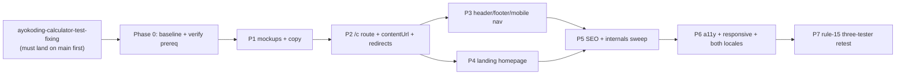

# AyoKoding Information-Architecture & Navigation Revamp

## Context

The AyoKoding cost-of-living calculator is **cut off from the site flow**. The root cause is a
missing information architecture (IA), not a calculator bug:

- The landing page at `/[locale]` is a **bare content tree** — a flat `<ul>` of slugs with no hero,
  no curation, no entry into Tools. [Repo-grounded] (`apps/ayokoding-www/src/app/[locale]/page.tsx`)
- The header (`apps/ayokoding-www/src/features/app-shell/shell/header.tsx`) has **zero navigation
  links** — only a logo, search, language switcher, and theme toggle. [Repo-grounded]
- The footer (`apps/ayokoding-www/src/features/app-shell/shell/footer.tsx`) has **no navigation** —
  only a copyright line and a GitHub link. [Repo-grounded]

Consequently `Tools` (and the calculator inside it) is an island: there is no natural path from
`Home → Learn → Tools → Calculator`. This plan revamps the IA so Home, Learn (content), Tools, and
the Calculator all interconnect naturally, and restyles the landing page into a real homepage.

The app is `apps/ayokoding-www` — Next.js **16.2.6** with `output: "standalone"` (so
`next.config.ts` `redirects()` are honored server-side, no `vercel.json` detour), dev port 3101,
following the repo's functional-core / imperative-shell layout (`src/features/<name>/{core,shell}`).
[Repo-grounded] It is bilingual: **English (`en`, primary)** and **Indonesian (`id`)**, with
translations in `src/features/i18n/core/translations.ts` via the `t(locale, key)` pattern.
[Repo-grounded]

> **Important locale asymmetry (drives much of the design):** the `en` and `id` locales use
> **different content slugs**. `en` has `learn/` and `rants/` sections plus loose
> `about-ayokoding.md` / `terms-and-conditions.md`. `id` has `belajar/` (= learn), `celoteh/`
> (= rants), `konten-video/` plus loose `tentang-ayokoding.md` / `syarat-dan-ketentuan.md`. There is
> **no `content/id/learn/` or `content/id/rants/`** on disk. [Repo-grounded] All URL moves,
> redirects, nav links, and section cards MUST be **per-locale slug-aware**. See
> [tech-docs.md §Locale Slug Asymmetry](./tech-docs.md#locale-slug-asymmetry).

## Scope

### In scope

- **Landing `/[locale]` becomes a real homepage**: hero (what AyoKoding is) + curated section cards
  (auto-derived from the content tree with a curated-override config) + a Tools teaser card that
  links the calculator + optional latest/featured. The bare content tree currently at `/[locale]`
  **moves to the `/c` browse index**.
- **`/[locale]/c` content browse index**: the restyled content-tree browse page (today's bare
  landing tree, restyled into section cards).
- **Content URL-namespace move**: content-tree pages move from `/[locale]/<slug>` to
  `/[locale]/c/<slug>` (e.g. `/en/learn/...` → `/en/c/learn/...`, `/id/belajar/...` →
  `/id/c/belajar/...`). **Markdown files do not move on disk**; only the URL namespace changes.
- **308 permanent redirects** from the old content URLs to the new `/c/`-prefixed URLs,
  per-locale-and-section scoped via `:path*` wildcards.
- **Global navigation**: header gets primary nav **Learn | Tools** (Learn → `/[locale]/c`,
  Tools → `/[locale]/tools`) with mobile-nav parity; footer gets a multi-column nav
  (Learn · Tools · About/Terms). Bilingual labels.
- **SEO + internals sweep**: every internal emitter (sidebar-tree, breadcrumb, prev-next, search
  results, `sitemap.ts`, `feed.xml/route.ts`, content `generateMetadata` canonical + language
  alternates) emits `/c/`-prefixed URLs. No broken or redirect-dependent internal links remain.
- **Accessibility + responsive**: skip link, keyboard nav, WCAG AA, at 320/375/768/1280 px, both
  locales.

### Out of scope

- Rewriting markdown content bodies (only URL namespace + landing copy strings change).
- New tools or calculator-internal changes — the calculator is owned by the prerequisite plan
  `ayokoding-calculator-test-fixing`.
- Search-engine swap (FlexSearch stays; only the emitted URLs change).
- New languages (only `en` + `id`).
- `middleware.ts` → `proxy.ts` migration (Next 16 deprecation; flagged optional, not in critical
  path — see [tech-docs.md §Assumptions](./tech-docs.md#assumptions)).
- Loose-page URL changes: `about-ayokoding` / `terms-and-conditions` (and the id equivalents)
  **keep their top-level short URLs** and are NOT moved under `/c`.

## Approach Summary

Phase 0 establishes a clean baseline via `repo-setup-manager` **and verifies the prerequisite plan
landed** (calculator on the shared `Breadcrumb` primitive, tools-index polish present). Then themed
phases, each expressed as Red→Green→Refactor TDD cycles touching real file paths with verbatim `nx`
commands and concrete acceptance criteria:

- **P1** — per-breakpoint mockups (SVG + PNG) + landing/nav copy strings.
- **P2** — `/c` route + per-locale slug-aware `contentUrl` helper + redirects module + `/c` browse
  index.
- **P3** — header + footer + mobile nav.
- **P4** — landing homepage (hero + auto/curated section cards + tools teaser).
- **P5** — SEO + internals sweep (canonical/sitemap/feed/search/breadcrumb/prev-next/sidebar).
- **P6** — full a11y + responsive + both-locale verification.
- **P7** — rule-15 three-tester retest.

Every behavior change ships companion `specs/apps/ayokoding/**` Gherkin in the same phase (this
repo's two-path rule). `ayokoding-www` is a `-www` site: **unit + e2e only, no integration tier**;
unit tests consume all Gherkin mocked. Each phase ends with a `### Phase N Gate` running
`nx run ayokoding-www:typecheck lint test:unit specs:coverage` (plus `ayokoding-www-fe-e2e` where
runtime proof is needed), followed by a Pause Safety note.

## Architecture (at a glance)

See [tech-docs.md](./tech-docs.md) for the full set of component, sequence, state, and decision
diagrams.

## Navigation

- [brd.md](./brd.md) — business rationale (why fix the IA now), impact, risks.
- [prd.md](./prd.md) — personas, user stories, Gherkin acceptance criteria, UI-design-funnel.
- [tech-docs.md](./tech-docs.md) — architecture, design decisions, Assumptions, §Overlap with the
  prerequisite plan, §Locale Slug Asymmetry.
- [delivery.md](./delivery.md) — phased TDD checklist, `## Worktree` section, executor legend.
- [assets/](./assets/) — Phase-1 committed mockups (visual-parity ground truth).

## Quality Gates

- **Local**: `nx run ayokoding-www:typecheck`, `:lint`, `:test:unit`, `:specs:coverage`; e2e via
  `ayokoding-www-fe-e2e` for runtime-proof scenarios.
- **CI**: all GitHub Actions triggered by the push to `origin main` must pass before archival.

## Verification

The plan is done when: the `/c` URL move, 308 redirects, header/footer/mobile nav, landing
homepage, SEO-internals sweep, and a11y/responsive are all implemented and tested; manual Playwright
verification across **both** locales (`en`, `id`) at 320/375/768/1280 px is captured with committed
evidence in [`evidence/`](./evidence/); the rule-15 three-tester retest is clean (or its findings
are triaged and fixed); and all local + CI gates are green. Push target: `origin main` (direct,
Trunk Based Development).
