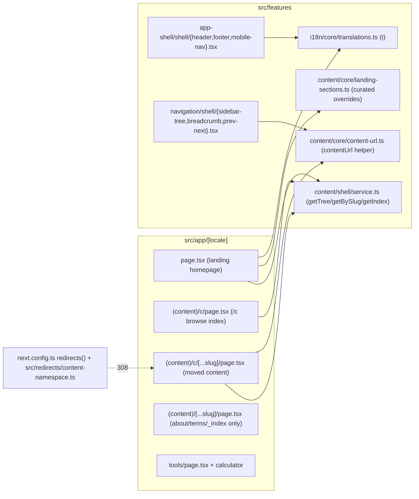
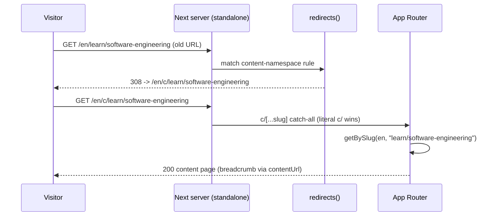
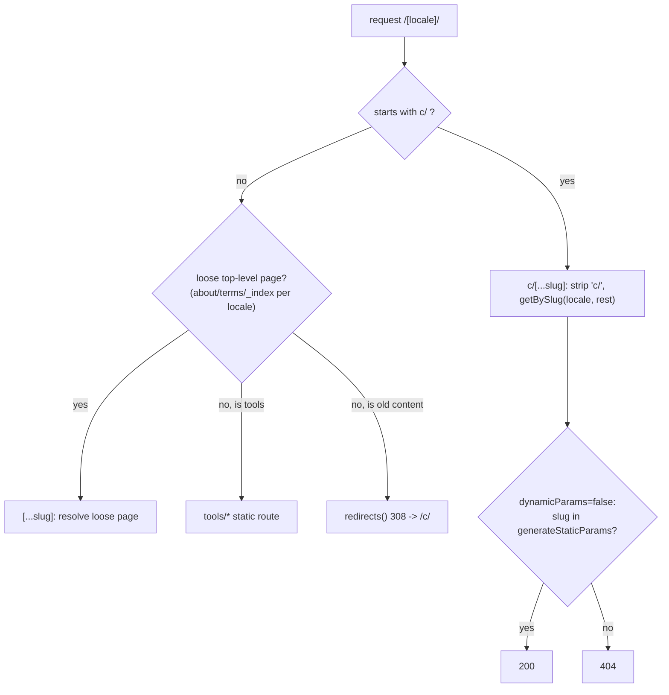
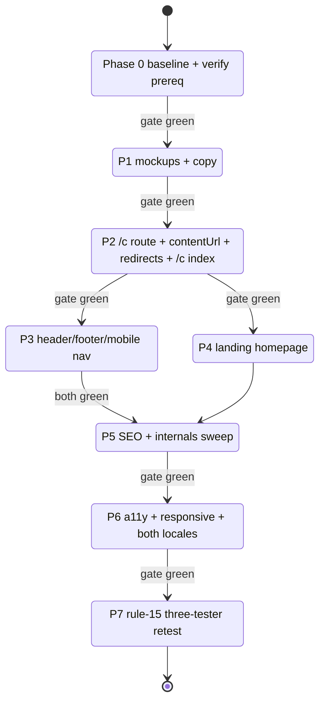

# Technical Documentation — AyoKoding IA & Navigation Revamp

## Architecture

The change is confined to `apps/ayokoding-www`. Markdown content does **not** move on disk; only the
URL namespace, routing, nav chrome, and the landing page change. The functional-core / imperative-
shell layout is preserved: pure URL/derivation logic in `src/features/**/core/`, React + routing in
`shell/` and `src/app/`.

### Component interactions

### Request → URL resolution sequence

### Route resolution decision branch

### Phase / delivery flow

## Design Decisions

### DD-1 — Central `contentUrl(locale, slug)` helper (single source of truth)

A pure helper `contentUrl(locale: Locale, slug: string): string` in
`src/features/content/core/content-url.ts` (new file) maps an on-disk content slug to its public
URL. It prefixes `/c/` for **content-tree slugs** and leaves **loose top-level pages** and Tools
bare. Every emitter (the content page, sidebar-tree, breadcrumb, prev-next, search results, sitemap,
feed) imports it, so the URL rule lives in exactly one place and is fully unit-testable.
[Rationale: chosen over inline per-emitter prefixing — which duplicates logic and invites drift —
and over baking `/c/` into `meta.slug` in the service — which couples on-disk slug to URL and
complicates redirects/back-compat.]

Loose-page allowlist (per-locale, also a `core` constant): `en → {about-ayokoding,
terms-and-conditions}`, `id → {tentang-ayokoding, syarat-dan-ketentuan}`. Anything in this allowlist
(plus root `_index` and `tools`) is NOT `/c/`-prefixed; everything else is content and IS prefixed.

### DD-2 — Two coexisting catch-all routes

A new `src/app/[locale]/(content)/c/[...slug]/page.tsx` resolves moved content (it strips the leading
`c/` and calls `getBySlug(locale, rest)`). The existing
`src/app/[locale]/(content)/[...slug]/page.tsx` is **narrowed** to resolve ONLY the loose top-level
pages (about/terms/\_index) — its `generateStaticParams` filters to the per-locale allowlist; the new
`c/[...slug]` route's `generateStaticParams` enumerates the content slugs. Both set
`dynamicParams = false`. Next.js route precedence puts the literal `c/` segment ahead of the sibling
`[...slug]`, so the two coexist safely. [Web-cited: Next.js routing precedence static > dynamic >
catch-all; `permanent: true` ⇒ 308; verified against Next.js 16 `next.config` redirects docs,
accessed 2026-06-21.]

### DD-3 — 308 permanent redirects, per-locale-and-section, wildcard-scoped

A new module `src/redirects/content-namespace.ts` exports a `contentNamespaceRedirects` array spread
into `next.config.ts` `redirects()` alongside the existing `learnReorgRedirects`. Each rule is a
`:path*` wildcard scoped to one locale + one moved section, e.g.
`{ source: "/:locale(en|id)/learn/:path*", destination: "/:locale/c/learn/:path*", permanent: true }`.
Because `id` uses different slugs, the `id` rules target `belajar`/`celoteh`/`konten-video`, while
`en` rules target `learn`/`rants`. About/terms/tools are naturally excluded (no rule matches them).
`permanent: true` yields a method-preserving **308**. [Web-cited: `permanent: true` → 308; `:path*`
path-to-regexp wildcard + regex group in `source`; Next.js redirects ref, accessed 2026-06-21.]

> The exact set of moved top-level sections per locale MUST be derived at authoring time from the
> content tree (P2 RED step greps `content/<locale>/*/` for section dirs). Known today
> [Repo-grounded]: `en → learn, rants`; `id → belajar, celoteh, konten-video`. Treat this list as
> `[Unverified]` until the P2 step re-confirms it against the tree, because content can be added.

### DD-4 — Landing section cards: auto-derive + curated override

`src/features/content/core/landing-sections.ts` (new) exports a curated-override config controlling
per-section **order, icon, hide, optional blurb override**. The landing page calls
`getTree(locale)`, takes the top-level content sections, applies the override, and falls back to each
section's `_index.md` `title` + frontmatter for blurb. Pure derivation (mergeable list) lives in
`core`; the card rendering lives in `shell`.

### DD-5 — Copy via existing `t(locale, key)` i18n

Hero tagline/intro + section blurbs (where not from `_index.md`) + nav labels are added as `en`/`id`
keys in `src/features/i18n/core/translations.ts`. Placeholder English+Indonesian copy is drafted in
P1; a `[HUMAN]` step has the maintainer refine final wording before archival. [Repo-grounded
pattern: existing keys `toolsPageTitle`, `openSourceProject`, etc.]

## Locale Slug Asymmetry

This is the single most important technical nuance. [Repo-grounded — verified via
`ls apps/ayokoding-www/content/{en,id}/`.]

| Concept       | `en` slug              | `id` slug              | On disk?   |
| ------------- | ---------------------- | ---------------------- | ---------- |
| Learn library | `learn`                | `belajar`              | yes (both) |
| Rants         | `rants`                | `celoteh`              | yes (both) |
| Video content | —                      | `konten-video`         | id only    |
| About (loose) | `about-ayokoding`      | `tentang-ayokoding`    | yes (both) |
| Terms (loose) | `terms-and-conditions` | `syarat-dan-ketentuan` | yes (both) |

Consequences baked into the design:

- `contentUrl` and the redirects are **per-locale slug-aware** — there is no `content/id/learn/` to
  match an `/id/learn/*` rule, so `id` rules use `belajar`/`celoteh`/`konten-video`.
- The loose-page allowlist is per-locale (DD-1).
- Gherkin in `prd.md` covers `id` explicitly (`/id/c/belajar/...`, `/id/tentang-ayokoding`).
- Section cards derive from each locale's own tree, so `id` cards show `Belajar`/`Celoteh` and the
  `en` cards show the English section titles.

## §Overlap with the Prerequisite Plan

The prerequisite `plans/in-progress/ayokoding-calculator-test-fixing` touches two files this plan
also touches. To avoid conflicts, the prerequisite MUST land on `main` first (Phase 0 hard-verifies),
and this plan builds on top — no parallel edits.

| Shared file/area                                | Prereq change                                                                 | This plan's interaction                                                                                                                   |
| ----------------------------------------------- | ----------------------------------------------------------------------------- | ----------------------------------------------------------------------------------------------------------------------------------------- |
| `src/features/navigation/shell/breadcrumb.tsx`  | Calculator consolidated onto the shared `Breadcrumb` primitive (DWT-B-003/4). | This plan keeps the shared `Breadcrumb` API; it only changes the **hrefs** the breadcrumb receives (via `contentUrl`), not the component. |
| `src/app/[locale]/tools/page.tsx` (tools-index) | Tools-index polish + calc link description (UWT-009).                         | This plan adds a header/footer/teaser **link to** `/[locale]/tools`; it does not edit the tools-index body.                               |

Phase 0 gate verifies: the calculator renders on the shared `Breadcrumb` primitive and the
tools-index polish is present on `main`; this worktree is synced/rebased on that `main`.

## Assumptions

- **A-1 (prerequisite landed)**: `ayokoding-calculator-test-fixing` is merged/archived to `main`
  before this work begins. Phase 0 verifies and STOPS if not. [Hard dependency.]
- **A-2 (copy refinement deferred to `[HUMAN]`)**: placeholder hero/section/nav copy ships in P1; the
  maintainer refines final bilingual wording in a `[HUMAN]` step before archival.
- **A-3 (`proxy.ts` rename optional)**: Next 16 deprecates `middleware.ts` → `proxy.ts`. The current
  `src/middleware.ts` keeps working; the rename is OUT of scope and flagged as a future note, not in
  the critical path. [Repo-grounded: `src/middleware.ts` present.]
- **A-4 (moved-section list)**: the per-locale set of moved top-level sections is re-derived from the
  content tree in P2 (`[Unverified]` until then — see DD-3 note).

## Testing Strategy

`ayokoding-www` is a `-www` site: **unit + e2e only, NO integration tier** (`-www` sites have no
integration tier; unit tests consume all Gherkin mocked). [Repo-grounded project policy.]

| Test level | Tooling                                   | Covers                                                                                                                                                                           |
| ---------- | ----------------------------------------- | -------------------------------------------------------------------------------------------------------------------------------------------------------------------------------- |
| Unit       | vitest (`nx run ayokoding-www:test:unit`) | `contentUrl` mapping (en/id, content vs loose), `landing-sections` derivation+override, redirect-array shape, component rendering (header/footer/mobile-nav/landing/`/c` index). |
| Specs      | `nx run ayokoding-www:specs:coverage`     | Every Gherkin scenario in `prd.md` has a backing step/test.                                                                                                                      |
| E2E        | Playwright (`ayokoding-www-fe-e2e`)       | 308 redirects (old→new), `/c` content 200, about/terms not-redirected, internal links no-308-hop, a11y skip-link/keyboard, responsive at 4 breakpoints × 2 locales.              |

Companion Gherkin lives under `specs/apps/ayokoding/behavior/ayokoding-www/gherkin/navigation/`
(new `.feature` files, e.g. `ia-navigation-revamp.feature`, `content-namespace-redirects.feature`)
in the SAME phase as each behavior change (two-path rule).

## Rollback

Each phase is a natural pause (its gate). If a phase must be reverted, revert that phase's commits;
the URL move (P2) and redirects are the highest-risk change — reverting P2 restores the old
`[...slug]` resolution and removes the `content-namespace.ts` redirects in one commit. The `/c`
landing-tree move and homepage (P4) are independent of the redirect module and revert separately.
