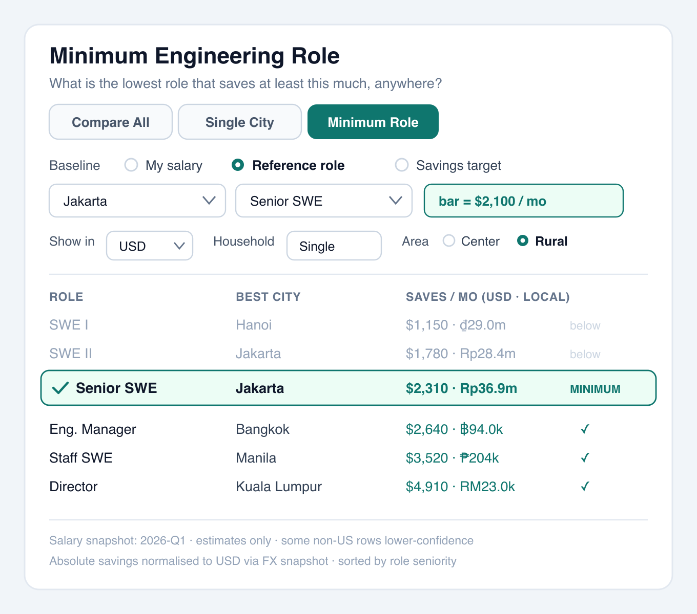
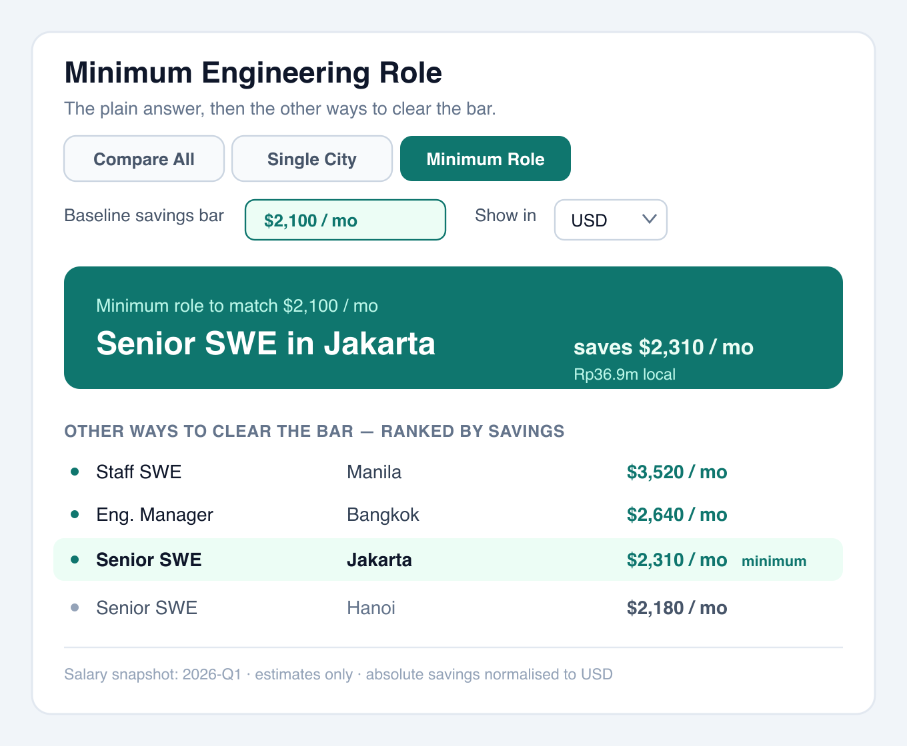

# Product Requirements Document — Salary Savings Calculator

## Product Overview

An interactive, client-side calculator on `ayokoding-www` that estimates monthly savings for a given
salary across tech-hub cities worldwide. It lives at `/[locale]/tools/salary-savings`, works in both
English (`en`) and Indonesian (`id`), and reports savings as a **percentage** of salary and an amount
in each city's **local currency**. Cost-of-living and FX figures come from a static curated dataset.
A third mode runs the question in reverse: given a savings **baseline**, it ranks the canonical
engineering-role ladder and names the **minimum role** (across any city worldwide) whose typical
salary saves at least as much in absolute terms, using a static `web-research-maker`-sourced
role×city salary matrix.

## Personas

- **Tech worker / visitor** — has a salary in mind, wants to see where and how much they could save.
- **Relocation planner** — compares many cities at once to shortlist destinations.
- **Career planner / job seeker** — has a savings goal, wants to know the lowest engineering role
  (and where) that meets it.
- **Indonesian visitor** — uses the `id` locale; expects fully localized labels and number/currency
  formatting.

## Modes

The page has three modes selected by a tab toggle:

- **Compare all** — one salary input (USD), a table of all cities with savings figures.
- **Single city** — one city picker + salary input in that city's local currency, with a breakdown.
- **Minimum role** — a savings **baseline** plus a ranked engineering-role ladder. The baseline is
  set one of three ways: (a) **my salary** — enter a salary (and its city/currency) and the tool
  computes its savings; (b) **reference role** — pick a city + engineering role and use that role's
  computed savings there; (c) **savings target** — type a raw monthly savings amount in a chosen
  currency. The tool normalises the baseline to USD and ranks every role on the ladder by the best
  (cheapest-qualifying) city's absolute savings, marking the **lowest role** that clears the bar.

The **household**, **area**, and **school-type** cost-basis controls below apply to all three modes
(they shape the cost of living used in every savings figure, including the role candidates'). The
minimum-role mode adds a **display-currency** selector so savings can be read in USD, each city's
local currency, and a user-chosen currency at once.

A **household selector** applies to all three modes and sets the cost-of-living basis. Five household
types are supported:

- `single`
- `married` (couple, no children)
- `married_1_kid`
- `married_2_kids`
- `married_3_kids`

When the household has children, a **school-type toggle** (`public` | `private`) also applies. Each
city carries a **median** monthly school cost per child for both school types; the chosen type adds
schooling cost on top of living cost, multiplied by the number of children. The toggle is hidden for
childless households (`single`, `married`).

An **area toggle** (`center` | `rural`) sets where in the city the person lives. The city-center
baseline is the dataset's stored cost; the rural option applies a discount (mainly housing) via a
shared area-multiplier. The area toggle applies to living cost only, not schooling.

## UI Design — Compare-All Screen (Design Funnel)

This screen follows the **diverge → narrow → select → justify** design funnel from the
[UI Mockups in Plan Docs convention](../../../repo-governance/conventions/formatting/diagrams.md#ui-mockups-in-plan-docs):
≥2 low-fidelity ASCII alternatives → 2 high-fidelity finalists → a named selection → a rationale.

**Prior art (R7)** — `web-research-maker` surveyed comparable cost-of-living tools: **Numbeo** (sortable
ranked index table), **Nomad List** (filterable card grid + map/chart views), **Expatistan** (two-city
category breakdown), **NerdWallet / Bankrate** (two-city salary-equivalence), **LivingCost.org** (salary
input + ranked card grid). No tool ships "one salary → cities ranked by savings/mo" as a first-class
screen; the proven multi-city scan layouts are the **sortable ranked table** (Numbeo) and the **card
grid** (Nomad List). This directly informs the three alternatives below.

**Grounding (R5)** — reuses `libs/web-ui`: `tabs` (Compare All / Single City toggle), `input` (salary),
`label`, `dropdown-menu`/`command` (city + household selectors), `card`, `badge`, `button`, `stat-card`.
One **net-new primitive — `Table`** — is required (no `table` component exists in `libs/web-ui`; see
delivery Phase 2).

### Tier 1 — Low-Fidelity Alternatives (diverge)

Three genuinely different layouts (full ASCII in
[`assets/ui-compare-all-low-fi-alternatives.md`](./assets/ui-compare-all-low-fi-alternatives.md)):

```
Option A — Ranked Table          Option B — Card Grid          Option C — Split
┌───────────────────────┐        ┌──────────┐ ┌──────────┐     ┌──────────┬──────────────┐
│ City      Save/mo  %  │        │ Jakarta  │ │ K.Lumpur │     │ Controls │ City   Save % │
│ Jakarta   $2,100  52% │        │ $2,100/mo│ │ $1,800/mo│     │ Salary   │ Jakarta $2.1k │
│ K.Lumpur  $1,800  45% │        │ 52%      │ │ 45%      │     │ [______] │ K.Lmpr  $1.8k │
│ Singapore $1,200  30% │        └──────────┘ └──────────┘     │ House ▼  │ Singapr $1.2k │
│ …  (sortable, bars)   │        │ Singapore│ │ Berlin   │     │ (•)Rural │ …            │
└───────────────────────┘        └──────────┘ └──────────┘     └──────────┴──────────────┘
```

### Tier 2 — High-Fidelity Finalists (narrow)

The two strongest go to high fidelity (the convention's `.excalidraw.png` tier; example assets here
are hand-built rasterised `.png`). Option B (Card Grid) is dropped — cards hide precise numbers,
weak for comparing many cities.

**Finalist 1 — Option A (Ranked Table)** — `.excalidraw.png`:


**Finalist 2 — Option C (Split)** — `.excalidraw.png`:


### Selection + Rationale (select → justify)

**Selected: Option A — Ranked Table.**

| Option               | Outcome           | Why                                                                                                                                                                                  |
| -------------------- | ----------------- | ------------------------------------------------------------------------------------------------------------------------------------------------------------------------------------ |
| **A — Ranked Table** | **Chosen**        | Densest scan of many cities; native sort by savings; matches the proven Numbeo table pattern personalised to income; reuses the `web-ui` `Table`; collapses to one column on mobile. |
| C — Split            | Runner-up         | Comfortable on wide screens, but the left control rail wastes horizontal space and stacks awkwardly on mobile; no advantage over A for the core compare task.                        |
| B — Card Grid        | Dropped (Stage 2) | Attractive (Nomad List pattern) but shows few cities per screen and is weak for precise side-by-side number comparison — the primary job of this screen.                             |

## UI Design — Minimum-Role Screen (Design Funnel)

This screen (the third tab) follows the same **diverge → narrow → select → justify** funnel from the
[UI Mockups in Plan Docs convention](../../../repo-governance/conventions/formatting/diagrams.md#ui-mockups-in-plan-docs):
≥2 low-fidelity ASCII alternatives → 2 high-fidelity finalists → a named selection → a rationale,
**plus a mobile/tablet/desktop responsive strategy** per that convention's Responsive Design rule.

**Prior art (R7)** — `web-research-maker` surveyed reverse salary/role tooling: **levels.fyi**
(forward role → salary; a compensation-range filter is the nearest reverse pattern but is not
city- or savings-aware), **Glassdoor / Payscale** (forward title + city → salary), **Numbeo
International Salary Equivalent** (salary in city A → equivalent salary in city B preserving net
savings; no role mapping), **NerdWallet / Bankrate** (US-only cost-of-living equivalence). **No tool
ships "one savings target → minimum role + city worldwide" as a first-class screen** — the feature is
novel, so the layout borrows the proven ranked-table idiom (Numbeo/levels.fyi) rather than copying a
specific competitor.

**Grounding (R5)** — reuses `libs/web-ui`: `tabs` (mode toggle), `input` (salary / savings target),
`label`, `dropdown-menu`/`command` (city, role, display-currency, household selectors), radio group
(baseline source, area), `badge` (`MINIMUM` marker, confidence tier), `alert`/`InfoTip` (disclaimer),
and the **net-new `Table`** primitive (shared with Compare-All; see delivery Phase 2). No further
net-new component is required for this screen.

### Tier 1 — Low-Fidelity Alternatives (diverge)

Three genuinely different layouts (full ASCII in
[`assets/ui-min-role-low-fi-alternatives.md`](./assets/ui-min-role-low-fi-alternatives.md)):

```
Option A — Ladder Table              Option B — Banner + List        Option C — Split
┌─────────────────────────┐         ┌────────────────────────┐      ┌────────┬──────────────┐
│ Role        City   Save │         │ ┌────────────────────┐ │      │Baseline│ Role  City S │
│ ░SWE I      Hanoi  $1.1k│         │ │ Min: Senior SWE    │ │      │(•)Ref  │ ░SWE I  …    │
│ ░SWE II     Jkt    $1.8k│         │ │ in Jakarta $2.31k  │ │      │City ▼  │ ▶Sr SWE ✓Jkt │
│ ▶Sr SWE     Jkt ✓  $2.3k│         │ └────────────────────┘ │      │Role ▼  │  EM    ✓Bkk  │
│  EM         Bkk ✓  $2.6k│         │ • Staff   Manila $3.5k │      │bar=$2k │  Staff ✓Mnl  │
│  Staff      Mnl ✓  $3.5k│         │ • Sr SWE  Jkt ← min    │      │Show ▼  │              │
└─────────────────────────┘         └────────────────────────┘      └────────┴──────────────┘
```

### Tier 2 — High-Fidelity Finalists (narrow)

The two strongest go to high fidelity (the convention's `.excalidraw.png` tier; example assets here
are hand-built rasterised `.png`). Option C (Split) is dropped — it duplicates the Compare-All split
trade-off (left rail wastes width, stacks awkwardly on mobile) without adding anything for this
screen.

**Finalist 1 — Option A (Ladder Table)** — `.excalidraw.png`:



**Finalist 2 — Option B (Banner + List)** — `.excalidraw.png`:



### Selection + Rationale (select → justify)

**Selected: Option A — Ladder Table.**

| Option               | Outcome           | Why                                                                                                                                                                                                                                                                                 |
| -------------------- | ----------------- | ----------------------------------------------------------------------------------------------------------------------------------------------------------------------------------------------------------------------------------------------------------------------------------- |
| **A — Ladder Table** | **Chosen**        | Shows the whole role ladder with the threshold marked, so the user sees not just the minimum role but how far above/below the bar every adjacent rung sits; reuses the Compare-All `Table` and its sort; dimmed below-bar rows read clearly; collapses to stacked cards on mobile.  |
| B — Banner + List    | Runner-up         | The answer banner is punchy and great for a one-shot read, but the flat list hides the failing rungs, losing the "how close was the next-cheapest role" context that makes the tool feel like a ladder. Its banner idea is grafted into A as a result summary line above the table. |
| C — Split            | Dropped (Stage 2) | Left control rail wastes horizontal space and stacks poorly on mobile — same weakness already rejected for Compare-All; no upside for this screen.                                                                                                                                  |

### Responsive Design — Mobile / Tablet / Desktop

Designed **mobile-first**; the chosen ladder table reflows across the convention's three display
classes:

| Class   | Breakpoint       | Layout                                                                                                                                                                                                    |
| ------- | ---------------- | --------------------------------------------------------------------------------------------------------------------------------------------------------------------------------------------------------- |
| Mobile  | base (`< sm`)    | Baseline controls stack full-width; the ladder renders as **stacked cards** (one role per card: role title, best city, savings in the three currencies, ✓/below badge), threshold card pinned/emphasised. |
| Tablet  | `md` (≥ 768 px)  | Baseline controls in a 2-column grid; ladder as a condensed table (Role · Best city · Savings(USD) · badge), local/display currency shown on tap/row-expand.                                              |
| Desktop | `lg` (≥ 1024 px) | Full ladder table with all three currency columns inline and the bars/threshold band as mocked; baseline controls in a single row.                                                                        |

Low-fidelity reflow (mobile stacked-card vs desktop table) is sketched in the
[low-fi alternatives asset](./assets/ui-min-role-low-fi-alternatives.md); the hi-fi mockup shows the
desktop end of the range. Each finalist was evaluated mobile-first — Option A's row→card collapse is
cleaner than Option C's rail, reinforcing the selection.

## Savings Model (v1)

The salary input is **gross monthly salary, before taxes and deductions**. v1 does **not** model
taxes, social contributions, or other deductions — so "savings" here is a simplified
gross-minus-cost-of-living figure that **overstates** real take-home savings. A visible disclaimer
states this; tax modelling is deferred (see Out of Scope).

Cost of living has two parts: **living cost** (housing, food, transport) and **schooling cost**. The
transport portion of living cost **assumes public transport** (a typical monthly transit pass) — car
ownership, fuel, and parking are not modelled. This is a fixed v1 assumption, not a toggle.

Living cost scales with the selected **household type** and **area**. The dataset stores one curated
single-person monthly living cost per city (`costOfLivingLocal`, a **city-center** baseline); a
shared **household-multiplier table** derives the other four household living costs, and a shared
**area-multiplier** (`center` = 1.0, `rural` < 1.0) discounts for living outside the center.
Schooling cost is added separately: each city stores a **median** monthly cost per child for
`public` and `private` school, multiplied by the number of children. The multiplier, area, and
median-school approximations are part of the "estimates only" disclaimer; per-city household/area
overrides are deferred (see Out of Scope).

Per city, with `singleCostLocal` = monthly single-person city-center living cost in local currency,
`household` = selected household type, `multiplier(household)` from the household-multiplier table,
`area` = selected area (`center` | `rural`), `areaMultiplier(area)` from the area table,
`kids(household)` = number of children (0 for `single`/`married`, 1–3 otherwise), `schoolType` =
selected school type (`public` | `private`), `schoolMedianLocal[schoolType]` = median monthly cost
per child, and `fxToUsd` = USD value of 1 local-currency unit:

- `livingLocal = singleCostLocal * multiplier(household) * areaMultiplier(area)`
- `schoolLocal = kids(household) * schoolMedianLocal[schoolType]`
- `costLocal = livingLocal + schoolLocal`
- `costUsd = costLocal * fxToUsd`
- **Compare all** (salary entered in USD): `savingsUsd = salaryUsd - costUsd`;
  `savingsLocal = savingsUsd / fxToUsd`; `savingsPct = savingsUsd / salaryUsd * 100`.
- **Single city** (salary entered in local currency): `savingsLocal = salaryLocal - costLocal`;
  `savingsPct = savingsLocal / salaryLocal * 100`.
- Deficit case (`cost > salary`) yields a negative savings and percentage, shown explicitly.

Figures are estimates; the UI shows the FX/cost **snapshot date** and an "estimates only" note.

### Minimum-Role Resolution (Compare savings in absolute terms)

The minimum-role mode reuses the same per-city cost model above, then adds role salaries and a
reverse search. Because candidates span many currencies, **all absolute comparisons are done in
USD** (the common unit), with local and a user-chosen display currency shown alongside.

- **Baseline savings `B` (USD)** — resolved from the chosen baseline source:
  - _My salary_: `B = savingsUsd` of the entered salary (Compare-all math if entered in USD;
    Single-city math converted via `fxToUsd` if entered in a city's local currency).
  - _Reference role_: pick city `c` + role `r`; `B = compareRow(c, salaryUsd = roleSalaryUsd(c, r), opts).savingsUsd`,
    i.e. that role's savings in that city under the active cost basis.
  - _Savings target_: user types `T` in display currency `d`; `B = T * fxToUsd(d)`.
- **Role salary** — `roleSalaryLocal(c, r)` from the `roles.ts` matrix; `roleSalaryUsd(c, r) = roleSalaryLocal(c, r) * city(c).fxToUsd`.
- **Candidate savings** — for every `(city c, role r)`, `cand(c, r) = compareRow(c, roleSalaryUsd(c, r), opts).savingsUsd`,
  using the **same** household/area/school cost basis as the rest of the page.
- **Per-role best city** — for each role `r`, `bestCity(r) = argmax_c cand(c, r)` (the city where
  that role saves the most in absolute USD); `bestSavings(r) = cand(bestCity(r), r)`.
- **Qualifying** — role `r` _clears the bar_ when `bestSavings(r) >= B`.
- **Minimum role** — among qualifying roles, the one with the **lowest seniority rank** (the least
  senior role that can clear the bar somewhere). Ties on rank break by higher `bestSavings`. The
  display ladder is ordered by seniority rank; below-bar rungs are shown but dimmed. (Rank is a
  display/seniority ordering only; the qualifying test itself is purely the absolute-savings
  comparison — see `tech-docs.md` for the ordering rule across IC and management tracks.)
- **Edge cases** — if **no** role clears the bar (`B` higher than the best role+city saves
  anywhere), the UI says so explicitly rather than marking a row. Each candidate carries its cell
  **confidence tier**; low-confidence (`proxy`) winners are flagged.

## User Stories

### US-01: Compare savings across cities for one salary

As a tech worker, I want to enter a single salary and see a table of tech-hub cities ranked by how
much I could save, so I can spot the best destinations at a glance.

### US-02: See savings in both percentage and local currency

As a visitor, I want each result to show savings as a percentage of salary and as an amount in the
city's local currency, so the number is meaningful locally.

### US-03: Drill into a single city

As a relocation planner, I want to pick one city and enter a salary in its local currency to see a
clear breakdown (cost vs. savings), so I can sanity-check a specific offer.

### US-04: Use the tool in Indonesian

As an Indonesian visitor, I want all labels, headings, and disclaimers in `id`, so the tool is fully
usable in my language.

### US-05: Understand data limits

As any visitor, I want a visible snapshot date and an "estimates only" disclaimer, so I don't treat
the figures as exact.

### US-06: Adjust savings for household size

As a visitor with a family, I want to pick a household type (single, married, or married with 1–3
kids) so the cost of living — and therefore my savings — reflects my situation.

### US-07: Choose public vs private schooling

As a visitor with children, I want to toggle between public and private school so the schooling
portion of my cost of living uses the median cost for the type I expect to use.

### US-08: Choose city-center vs rural living

As a visitor, I want to toggle between living in the city center and a rural/outer area so my
estimated housing-driven living cost reflects where I'd actually live.

### US-09: Find the minimum engineering role for a savings bar

As a career planner, I want to set a savings baseline and see the **lowest** engineering role
(anywhere in the world) whose typical salary saves at least as much in absolute terms, so I know what
seniority my goal implies.

### US-10: Choose how the baseline is set

As a visitor, I want to set the baseline three ways — my own salary, a reference city + role, or a
raw savings target — so the comparison fits whatever I already know.

### US-11: Read savings in USD, local, and my own currency

As a minimum-role user, I want each savings figure shown in USD, the candidate city's local
currency, and a display currency I pick, so the absolute comparison is meaningful to me.

### US-12: See the whole ladder and data confidence

As a career planner, I want to see the full role ladder with the qualifying threshold marked and a
confidence flag on lower-quality salary estimates, so I understand both how close adjacent roles are
and how much to trust each row.

## Acceptance Criteria (Gherkin)

```gherkin
Feature: Salary savings calculator

  Scenario: Compare all cities for a USD salary
    Given I am on "/en/tools/salary-savings"
    And the "Compare all" mode is active
    When I enter a monthly salary of "8000" USD
    Then I see a table of tech-hub cities
    And each row shows the estimated cost of living in both local currency and USD
    And each row shows a savings percentage and a savings amount in the city's local currency
    And the table can be sorted by savings

  Scenario: Single city breakdown in local currency
    Given I am on "/en/tools/salary-savings"
    And I switch to "Single city" mode
    And I select the city "Lisbon"
    When I enter a monthly salary of "5000" in local currency
    Then I see the estimated living cost and the resulting savings
    And savings are shown as a percentage and a local-currency amount

  Scenario: Salary below cost of living shows a deficit
    Given I am in "Single city" mode for a high-cost city
    When I enter a salary lower than that city's cost of living
    Then the savings amount and percentage are shown as negative

  Scenario: Indonesian locale is fully translated
    Given I am on "/id/tools/salary-savings"
    Then all labels, headings, and the disclaimer are in Indonesian

  Scenario: No Israeli cities are listed
    Given I am on the calculator in either locale
    Then no Israeli city appears in the dataset or table

  Scenario: Data last-updated date is clearly shown
    Given I am on the calculator
    Then I see a prominent "Data last updated" label with the dataset snapshot date
    And I see an "estimates only" disclaimer

  Scenario: Household type changes the cost of living
    Given I am on "/en/tools/salary-savings"
    And I have entered a salary
    When I change the household type from "single" to "married 2 kids"
    Then the estimated cost of living increases
    And the savings amount and percentage update accordingly

  Scenario: School type toggle is hidden for childless households
    Given I am on "/en/tools/salary-savings"
    When the household type is "single" or "married"
    Then no school-type toggle is shown

  Scenario: School type toggle appears when household has children
    Given I am on "/en/tools/salary-savings"
    When the household type has children
    Then a "public / private" school-type toggle is shown

  Scenario: Private school raises cost more than public
    Given I am on "/en/tools/salary-savings"
    And the household type is "married 2 kids"
    When I switch the school type from "public" to "private"
    Then the estimated cost of living increases
    And the savings amount and percentage update accordingly

  Scenario: Rural area lowers cost versus city center
    Given I am on "/en/tools/salary-savings"
    And I have entered a salary
    When I switch the area from "city center" to "rural"
    Then the estimated living cost decreases
    And the savings amount and percentage update accordingly

  Scenario: Minimum role for a savings target
    Given I am on "/en/tools/salary-savings"
    And I switch to "Minimum role" mode
    And I set the baseline source to "savings target"
    When I enter a monthly savings target of "2000" USD
    Then I see the engineering role ladder ranked by seniority
    And the lowest role whose best city saves at least 2000 USD is marked as the minimum
    And roles whose best city cannot reach 2000 USD are shown but de-emphasised

  Scenario: Minimum role from a reference city and role
    Given I am in "Minimum role" mode
    And I set the baseline source to "reference role"
    And I pick the city "Jakarta" and the role "Senior SWE"
    Then the baseline savings bar equals that role's savings in Jakarta
    And the marked minimum role saves at least that amount in absolute terms

  Scenario: Minimum role from my own salary
    Given I am in "Minimum role" mode
    And I set the baseline source to "my salary"
    When I enter my salary and its city
    Then the baseline savings bar equals my computed savings
    And the ladder marks the lowest role that meets or beats it

  Scenario: Savings shown in USD, local, and display currency
    Given I am in "Minimum role" mode with a baseline set
    When I choose a display currency
    Then each role row shows its savings in USD, the city's local currency, and the display currency

  Scenario: No role can reach the bar
    Given I am in "Minimum role" mode
    When I set a savings target higher than any role saves in any city
    Then the tool states that no role clears the bar
    And no row is marked as the minimum

  Scenario: Cost-basis controls affect role candidates
    Given I am in "Minimum role" mode with a baseline set
    When I change the household type or area
    Then the role candidates' savings and the marked minimum role update accordingly

  Scenario: Low-confidence salary rows are flagged
    Given I am in "Minimum role" mode
    Then any role row backed by a lower-confidence salary estimate shows a confidence flag

  Scenario: No Israeli city appears among role candidates
    Given I am in "Minimum role" mode
    Then no Israeli city appears as a candidate city for any role
```

## Functional Requirements

- FR-1: Route `/[locale]/tools/salary-savings` renders in `en` and `id`.
- FR-2: "Compare all" mode: one gross (pre-tax) USD salary input → sortable table of all cities with
  savings % and local-currency savings.
- FR-3: "Single city" mode: city picker + gross (pre-tax) local-currency salary input → cost/savings
  breakdown.
- FR-2c: "Minimum role" mode: a baseline selector (my salary | reference role | savings target) →
  the engineering-role ladder ranked by seniority, each role showing its best (cheapest-qualifying)
  city and that city's absolute savings, with the lowest qualifying role marked as the minimum.
- FR-3b: A household selector (single, married, married + 1 kid, married + 2 kids, married + 3 kids)
  applies to all three modes; the chosen household scales each city's living cost via the
  household-multiplier table, and all savings figures (including role candidates) recompute from it.
- FR-3c: When the household has children, a school-type toggle (`public` | `private`) applies; the
  chosen type's **median** per-child school cost is added per child on top of living cost. The
  toggle is hidden for `single` and `married`.
- FR-3d: An area toggle (`center` | `rural`) applies to all three modes; the city-center baseline is
  the stored cost, and `rural` discounts living cost via a shared area-multiplier. Area affects
  living cost only, not schooling.
- FR-4: Currency and number formatting respect each city's currency and the active locale.
- FR-4b: Each city's estimated cost of living is shown in **both** the city's local currency **and**
  USD (`costUsd = costLocal * fxToUsd`), in all modes that show a per-city cost.
- FR-5: Negative (deficit) savings are computed and displayed explicitly.
- FR-6: Dataset excludes all Israeli cities and records an FX/cost snapshot date. The exclusion is a
  deliberate country-level choice about the state of Israel and its political stance — **not** about
  any ethnic, racial, or religious group.
- FR-7: Visible disclaimer covering "estimates only", "gross salary, before tax —
  taxes/deductions are not modelled, so real savings will be lower", "household and rural
  costs are derived from shared multipliers, and school costs are city medians — not exact per-case
  data", **and** "transport assumes public transport (monthly pass); car ownership is not modelled".
  Salary input labels read "Gross monthly salary (before tax)".
- FR-8: The page **clearly and prominently shows when the data was last fetched/updated** — a
  "Data last updated: &lt;date&gt;" label (localized, from the dataset `snapshotDate`) placed near the
  results, not buried in fine print. Since v1 data is static, "last updated" = the dataset snapshot
  date; the same field will reflect real fetch time if a live source is added later.
- FR-9: The baseline savings bar is **normalised to USD** for the qualifying comparison; a role
  "clears the bar" when its best-city absolute savings (USD) is ≥ the baseline (USD). The "minimum"
  is the lowest-seniority qualifying role; if none qualifies, the UI says so and marks no row.
- FR-10: The baseline can be set three ways — (a) my salary (+ its city/currency), (b) a reference
  city + engineering role, (c) a raw savings target in a chosen currency — and switching source
  recomputes the ladder.
- FR-11: In minimum-role mode each role row shows savings in **USD, the candidate city's local
  currency, and a user-selected display currency**; a display-currency selector is provided.
- FR-12: The role-salary matrix (`roles.ts`) excludes Israeli cities, records a salary
  `snapshotDate`, and carries a per-cell confidence tier (`high` | `moderate` | `proxy`); rows
  backed by `proxy`/`moderate` data are visibly flagged, and the disclaimer notes salary figures are
  estimates sourced from public aggregators.

## Non-Functional Requirements

- NFR-1: **Client-side rendered (CSR)** — a `'use client'` page; all inputs and computation happen
  in the browser. No server-side rendering of results, no backend/tRPC procedure, no runtime network.
- NFR-1b: Dataset lists **as many tech-hub cities worldwide as we reasonably can** (static), excl.
  Israel; breadth over a fixed small set. **ASEAN, Japan, broader Europe, and the Nordics must each
  be represented**, alongside the Americas, Middle East, South/East Asia, Oceania, and Africa.
- NFR-1c: The role-salary matrix (`roles.ts`) is static, `web-research-maker`-sourced, and covers
  every role on the canonical ladder for every city in `cities.ts` — no holes (gaps filled with
  documented `proxy` estimates, never fabricated exact figures) — with per-cell confidence tiers and
  a salary snapshot date.
- NFR-2: WCAG AA — labeled inputs, keyboard-operable, sufficient contrast; responsive (mobile→desktop).
- NFR-3: Calculation core is pure and unit-tested; component has tests; one fe-e2e smoke test.
- NFR-4: No new runtime dependencies beyond those `ayokoding-www` already ships.

## Out of Scope

Live cost-of-living/FX/**salary** APIs, tax/deductions, savings goals, persistence/share/export,
per-city non-default currencies, per-city household/area-cost overrides (v1 uses shared multiplier
tables), school-cost granularity beyond a city public/private median, company-specific or
equity/bonus salary breakdowns, per-person career-progression modelling, charts, and any Israeli
city.
