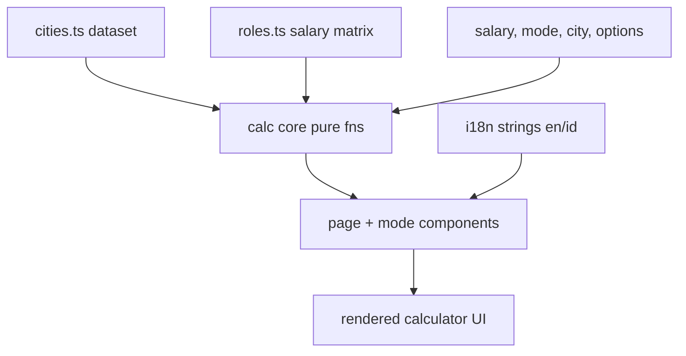
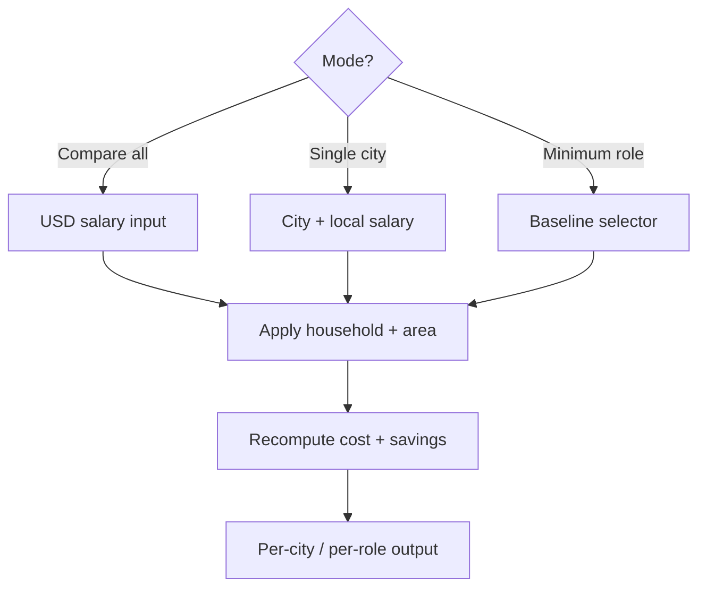
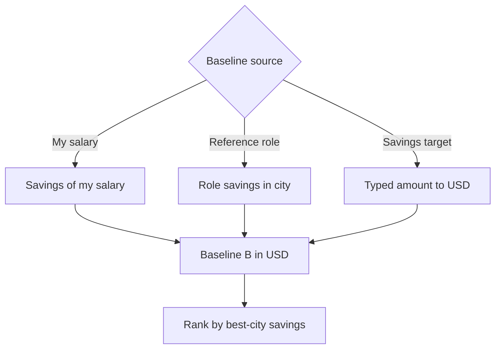

# Technical Documentation — Salary Savings Calculator

## Architecture Overview

A self-contained, **client-side rendered (CSR)** feature in `apps/ayokoding-www`. The page is a
`'use client'` component; all state, input handling, and computation run in the browser. No
server-side rendering of results, no backend, no tRPC procedure, no network at runtime. Three layers:

1. **Data** — two static, hand-curated datasets: tech-hub cities (`cities.ts`) and the
   engineering-role × city salary matrix (`roles.ts`, `web-research-maker`-sourced).
2. **Calculation core** — pure functions (no React, no I/O): `calc` (per-city cost + savings) and
   `roleLookup` (baseline resolution + minimum-role search); fully unit-tested.
3. **Presentation** — a `'use client'` interactive page under `/[locale]/tools/salary-savings`,
   plus small components for the three modes; consumes the calc core and i18n strings.



### Mode + control flow

How the three modes and the shared controls drive a recompute:



The minimum-role branch resolves a USD baseline, then ranks the role ladder by each role's
best-city absolute savings:



## Proposed File Layout

Exact paths confirmed against the app during Phase 1; the shape:

```
apps/ayokoding-www/src/
  app/[locale]/tools/salary-savings/
    page.tsx                      # 'use client' page; mode toggle + state
  features/salary-savings/        # feature module (co-located)
    data/cities.ts                # static city dataset + snapshot date
    data/cities.test.ts           # city dataset invariants (no Israel, fields present)
    data/roles.ts                 # static role ladder + role×city salary matrix + snapshot date
    data/roles.test.ts            # role dataset invariants (full matrix, no Israel, confidence tiers)
    calc.ts                       # pure per-city cost/savings functions
    calc.test.ts                  # unit tests for calc
    role-lookup.ts                # pure baseline-resolution + minimum-role search
    role-lookup.test.ts           # unit tests for role lookup
    components/controls.tsx       # shared household / area / school-type controls
    components/compare-table.tsx  # "Compare all" mode
    components/single-city.tsx    # "Single city" mode
    components/min-role.tsx       # "Minimum role" mode (baseline selector + ladder table)
    components/*.test.tsx          # component tests
    strings.ts                    # en/id UI strings (or wired into existing i18n)
```

If the app convention prefers `src/contexts/<name>/` over `src/features/`, follow the existing
pattern discovered in Phase 0 rather than introducing a new top-level folder.

## Data Model

```ts
type City = {
  id: string; // stable slug, e.g. "lisbon"
  name: { en: string; id: string };
  country: { en: string; id: string };
  currency: string; // ISO 4217, e.g. "EUR"
  costOfLivingLocal: number; // est. monthly SINGLE-person, CITY-CENTER living cost (assumes PUBLIC transport), local currency
  schoolMedianLocal: { public: number; private: number }; // median monthly cost PER CHILD, local
  fxToUsd: number; // USD value of 1 local-currency unit (snapshot)
  region: "asean" | "japan" | "europe" | "nordics" | "americas" | "mena" | "asia" | "oceania" | "africa";
};

type Household = "single" | "married" | "married_1_kid" | "married_2_kids" | "married_3_kids";
type SchoolType = "public" | "private";
type Area = "center" | "rural";

type Dataset = {
  snapshotDate: string; // ISO date, e.g. "2026-06-16"
  cities: City[]; // tech hubs worldwide; NO Israeli cities
};

// Shared multiplier table — derives household LIVING cost from the single-person cost.
// v1 is city-agnostic (one curve for all cities); per-city override is deferred.
// Indicative seed values (tune in Phase 1, document the source in a comment):
const HOUSEHOLD_MULTIPLIERS: Record<Household, number> = {
  single: 1.0,
  married: 1.6, // two adults, shared housing
  married_1_kid: 1.9,
  married_2_kids: 2.2,
  married_3_kids: 2.5,
};

// Children per household — drives the schooling add-on.
const HOUSEHOLD_KIDS: Record<Household, number> = {
  single: 0,
  married: 0,
  married_1_kid: 1,
  married_2_kids: 2,
  married_3_kids: 3,
};

// Shared area multiplier — discounts living cost outside the city center (housing-driven).
const AREA_MULTIPLIERS: Record<Area, number> = {
  center: 1.0,
  rural: 0.75, // indicative; tune + source in Phase 1
};
```

### Role-Salary Matrix (`roles.ts`)

The minimum-role mode needs a typical monthly gross salary for each rung of a canonical
engineering-role ladder, per city. The ladder is a **synthesised industry-consensus taxonomy**
(`web-research-maker` confirmed no standards body publishes one; the de-facto reference is
levels.fyi's aggregation of Big-Tech leveling). It interleaves the individual-contributor (IC) and
management (M) tracks at their commonly recognised equivalent compensation bands. `seniorityRank`
gives a single total ordering for **display + the "minimum" tiebreak only**; the qualifying test
itself is the absolute-savings comparison, never the rank (see Design Decisions).

```ts
type Track = "ic" | "mgmt";

type EngRole =
  | "swe_1" // SWE I / SDE I (entry)            rank 1  ic
  | "swe_2" // SWE II / SDE II (mid)            rank 2  ic
  | "senior_swe" // Senior SWE                  rank 3  ic   (senior band)
  | "eng_manager" // Engineering Manager (M1)   rank 4  mgmt (senior band)
  | "staff_swe" // Staff SWE                    rank 5  ic   (staff band)
  | "senior_eng_manager" // Senior EM (M2)      rank 6  mgmt (staff band)
  | "senior_staff_swe" // Senior Staff SWE      rank 7  ic   (sr-staff band)
  | "director" // Director of Eng (M3)          rank 8  mgmt (director band)
  | "principal_swe" // Principal SWE            rank 9  ic   (principal band)
  | "senior_director" // Senior Director (M4)   rank 10 mgmt (sr-director band)
  | "distinguished_swe" // Distinguished Eng    rank 11 ic   (distinguished band)
  | "vp_eng" // VP Engineering (M5)             rank 12 mgmt (vp band)
  | "fellow" // Fellow / Technical Fellow       rank 13 ic   (fellow band)
  | "svp_eng" // SVP Engineering (M6)           rank 14 mgmt (svp band)
  | "cto"; // CTO (M7)                          rank 15 mgmt (apex)

// Canonical ladder metadata. `rank` interleaves IC + mgmt at equivalent bands; at equal band the
// IC role sits first (lower org overhead, found at more companies → more universally achievable),
// so the IC and mgmt tracks each stay strictly ascending. "Intern" is intentionally excluded
// (non-permanent). Labels carry en/id for the UI.
type RoleMeta = {
  role: EngRole;
  rank: number; // 1..15, ascending seniority
  track: Track;
  label: { en: string; id: string };
};

type Confidence = "high" | "moderate" | "proxy";

// One salary cell. `proxy` cells are derived from a documented regional multiplier off a reference
// city (public per-role data is sparse outside the US) — never a fabricated exact figure.
type RoleSalaryCell = {
  monthlyGrossLocal: number; // typical gross monthly salary, city local currency
  confidence: Confidence;
  note?: string; // source / derivation, e.g. "levels.fyi 2025" or "proxy: 0.45 × Singapore"
};

type RoleMatrix = {
  snapshotDate: string; // ISO date of the salary snapshot (may differ from cities.ts)
  ladder: RoleMeta[]; // the canonical ordered ladder
  // cityId -> role -> cell. FULL matrix: every city in cities.ts × every role in `ladder`.
  salaries: Record<string, Record<EngRole, RoleSalaryCell>>;
};

type BaselineSource = "my_salary" | "reference_role" | "savings_target";
```

The matrix is **complete by construction** (every city × every role) so the search never has holes;
honesty is preserved by the per-cell `confidence` tier rather than by omitting cells. City IDs key
into `cities.ts`, so role data inherits the same currency + `fxToUsd` and the same no-Israel
guarantee (a `roles.test.ts` invariant asserts the key sets match and that no excluded city leaks
in). The display currency is any ISO code already present in `cities.ts` plus USD.

The dataset stays breadth-first: per city, one living-cost number plus a `{ public, private }`
school median. The household and area dimensions are applied at calculation time via
`HOUSEHOLD_MULTIPLIERS` and `AREA_MULTIPLIERS`, so adding a city never requires a cost matrix.
Schooling adds `kids * schoolMedianLocal[schoolType]` on top of living cost. All three
approximations are surfaced in the "estimates only" disclaimer.

Goal: cover **as many tech-hub cities worldwide as we reasonably can** (static, breadth-first),
excluding Israel. **ASEAN, Japan, broader Europe, and the Nordics must each be represented** (in
addition to the Americas, Middle East, South/East Asia, Oceania, and Africa). Seed set grouped by
region (extend freely in Phase 1):

- **ASEAN**: Singapore, Bangkok, Ho Chi Minh City, Hanoi, Kuala Lumpur, Penang, Jakarta, Bandung,
  Manila, Cebu, Phnom Penh, Vientiane, Yangon, Bandar Seri Begawan.
- **Japan**: Tokyo, Osaka, Fukuoka.
- **Europe (non-Nordic)**: London, Berlin, Munich, Amsterdam, Lisbon, Porto, Dublin, Paris, Zurich,
  Geneva, Vienna, Tallinn, Warsaw, Kraków, Prague, Barcelona, Madrid, Milan.
- **Nordics**: Stockholm, Gothenburg, Copenhagen, Helsinki, Oslo, Reykjavík.
- **Americas**: San Francisco, New York, Seattle, Austin, Boston, Toronto, Vancouver, Mexico City,
  São Paulo, Buenos Aires, Santiago.
- **Middle East / South & East Asia / Oceania / Africa**: Dubai, Bengaluru, Hyderabad, Seoul,
  Taipei, Shenzhen, Sydney, Melbourne, Nairobi, Lagos, Cairo.

More cities are welcome as long as each has credible cost-of-living + FX estimates.

## Calculation Core (pure)

```ts
// All amounts monthly. Salary is GROSS (pre-tax); taxes/deductions are NOT modelled in v1.
// fxToUsd = USD per 1 local unit. opts = { household, area, schoolType }.
livingLocal(city, household, area): number
//   city.costOfLivingLocal * HOUSEHOLD_MULTIPLIERS[household] * AREA_MULTIPLIERS[area]
schoolLocal(city, household, schoolType): number
//   HOUSEHOLD_KIDS[household] * city.schoolMedianLocal[schoolType]
costLocal(city, opts): number             // livingLocal(...) + schoolLocal(...)
costUsd(city, opts): number               // costLocal(city, opts) * city.fxToUsd
compareRow(city, salaryUsd, opts): {      // "Compare all" mode
  costLocal, costUsd, savingsUsd, savingsLocal, savingsPct }
singleCity(city, salaryLocal, opts): {    // "Single city" mode
  costLocal, costUsd, savingsLocal, savingsPct }
sortBySavings(rows): rows                 // desc by savings
```

- Percentages and amounts may be negative (deficit) and must be tested for that case.
- Guard `salary <= 0` to avoid division-by-zero in percentage (return 0% or N/A, decided + tested).
- Functions are deterministic and side-effect-free → straightforward Vitest coverage.

### Role-lookup core (pure, `role-lookup.ts`)

Built on top of `calc` + the `RoleMatrix`. All absolute comparisons are in USD (the common unit);
`opts` is the same `{ household, area, schoolType }` cost basis used everywhere on the page.

```ts
roleSalaryUsd(matrix, city, role): number    // cell.monthlyGrossLocal * city.fxToUsd
candidateSavingsUsd(city, role, opts, matrix): number
//   compareRow(city, roleSalaryUsd(matrix, city, role), opts).savingsUsd
bestCityForRole(cities, role, opts, matrix): { city, savingsUsd, confidence }
//   argmax over cities of candidateSavingsUsd; carries that cell's confidence
resolveBaselineUsd(source, input, opts, cities, matrix): number
//   my_salary       -> savings of the entered salary (USD or local→USD)
//   reference_role  -> candidateSavingsUsd(refCity, refRole, opts, matrix)
//   savings_target  -> typedAmount * fxToUsd(displayCurrency)
rankLadder(cities, opts, matrix): Array<{        // one entry per role, ascending rank
  role, rank, track, bestCity, bestSavingsUsd, confidence, clears: boolean }>
minimumRole(baselineUsd, rankedLadder): role | null
//   lowest-rank entry with bestSavingsUsd >= baselineUsd; null if none clears
toDisplayCurrencies(savingsUsd, cityFx, displayFx): { usd, local, display }
```

- `clears(role) = bestSavingsUsd(role) >= baselineUsd`. `minimumRole` returns the **lowest-rank**
  clearing role; ties on rank break by higher savings; returns `null` when nothing clears.
- Ranking is by seniority for **display**; qualification is purely the savings comparison.
- Deterministic + side-effect-free; tested incl. the no-qualifier case, baseline-source parity
  (a reference role is always its own minimum-or-lower), and confidence propagation.

## Presentation

- `page.tsx` is `'use client'`; holds mode (`compare` | `single` | `minRole`), salary input,
  selected city, `household` (default `single`), `area` (default `center`), `schoolType` (default
  `public`), and the minimum-role state (`baselineSource`, reference city/role, savings-target +
  `displayCurrency`). Household, area, and school-type controls are shared across all three modes;
  the school-type toggle is shown only when the selected household has children.
- Number/currency formatting via `Intl.NumberFormat` keyed on city `currency` and active locale.
- Cost of living is displayed in **both** the city's local currency and USD (compute `costUsd` from
  `costLocal`); the per-city modes show the dual-currency cost figure. Minimum-role rows show savings
  in **USD + the candidate city's local currency + the chosen display currency**.
- `min-role.tsx` renders the baseline selector (radio: my salary / reference role / savings target),
  the conditional inputs per source, the display-currency `Command`/dropdown, and the ranked ladder
  via the shared `Table`: roles ascending by `rank`, the minimum row marked with a `Badge`, below-bar
  rows de-emphasised, and a `proxy`/`moderate` confidence `Badge` where applicable. A summary line
  ("Minimum role to match $X: …") sits above the table (the grafted Option-B banner idea).
- UI is composed from the shared `@open-sharia-enterprise/web-ui` kit: `Tabs`/`TabBar` (mode +
  household), `Input`/`Label` (salary, savings target), `Toggle` (area, school-type),
  `DropdownMenuRadioGroup` or `Command` (city, role, display-currency pickers), radio group (baseline
  source), `Alert`/`InfoTip` (disclaimer), `Badge` (savings sign, `MINIMUM` marker, confidence tier),
  `Card`/`StatCard` (single-city breakdown). The only missing primitive is a **`Table`** — shared by
  the Compare-all and Minimum-role views — added to `libs/web-ui` in Phase 2 before the app consumes
  it (see delivery.md). No new third-party runtime dependency; styling stays on existing Tailwind
  tokens.
- Inputs are labeled; table is keyboard-navigable; "estimates only" disclaimer always visible.
- A prominent **"Data last updated: &lt;date&gt;"** label (localized, formatted from the dataset
  `snapshotDate` via `Intl.DateTimeFormat`) sits near the results so users always know the data's
  vintage. v1 has no runtime fetch, so this equals the static snapshot date; if a live source is
  added later, the same label surfaces the actual fetch/update timestamp.

## i18n

Follow the existing `ayokoding-www` i18n mechanism (`src/contexts/i18n/`). Add the calculator's UI
strings (headings, labels, mode names — incl. "Minimum role", household-type labels, school-type +
area toggle labels, baseline-source labels, display-currency label, confidence-tier labels,
disclaimer) for both `en` and `id`.
City/country display names live in `cities.ts` (`name.en` / `name.id`) and **role labels live in
`roles.ts`** (`ladder[].label.en/id`), so data and UI strings stay separable.

## Testing Strategy

- **Unit (vitest)**: `calc.test.ts` covers each function incl. deficit and zero-salary edge cases,
  and asserts: cost rises monotonically across household types (`single` < `married` <
  `married_1_kid` < `married_2_kids` < `married_3_kids`) for a fixed city/area/school; `rural` cost
  < `center` cost for the same household; `private` school cost ≥ `public` for a household with kids;
  and school cost is zero for childless households regardless of school type;
  `cities.test.ts` asserts dataset invariants — every city has all fields (incl.
  `schoolMedianLocal.public` and `schoolMedianLocal.private`), currencies are ISO codes, and
  **no Israeli city / `ILS` currency is present**. Also assert region coverage — at least one
  city each from **ASEAN, Japan, Europe (non-Nordic), and the Nordics** (e.g. via a `region` field).
  `roles.test.ts` asserts role-matrix invariants — the `ladder` is the full 15-rung canonical set
  with strictly increasing `rank`; `salaries` keys **exactly match** `cities.ts` city IDs (full
  matrix, no holes); every cell has a positive `monthlyGrossLocal` and a valid `confidence`; **no
  Israeli city** leaks in; and a `snapshotDate` is present.
- **Unit — role lookup (`role-lookup.test.ts`)**: `resolveBaselineUsd` for all three sources;
  `candidateSavingsUsd`/`bestCityForRole` pick the max-savings city; `rankLadder` returns roles in
  ascending rank with correct `clears` flags; `minimumRole` returns the lowest-rank clearer and
  `null` when nothing clears; reference-role baseline parity (the reference role itself clears its
  own bar); cost-basis changes (household/area/school) shift candidates; confidence propagates to the
  chosen row.
- **Component (vitest + Testing Library)**: render each mode, simulate input, assert rendered
  savings %, local amount, dual-currency cost (local + USD), and locale strings; assert the shared
  controls recompute cost/savings and that the school-type toggle is hidden until kids are selected.
  For minimum-role: assert the marked minimum row, de-emphasised below-bar rows, the three-currency
  savings display, baseline-source switching, and the no-qualifier message.
- **E2E (ayokoding-www-fe-e2e, Playwright)**: one smoke test — load `/en/tools/salary-savings`,
  enter a salary, assert a populated table and a savings cell.
- Meet the app's existing coverage threshold (rhino-cli validator in `test:quick`).

## Design Decisions

- **Static dataset over live API** — deterministic, testable, no keys/flakiness; snapshot date +
  disclaimer communicate the trade-off. Live data deferred.
- **Client-only, no tRPC** — pure computation; avoids backend surface and keeps it cacheable/simple.
- **Calc isolated from React** — pure module enables exhaustive, fast unit tests independent of UI.
- **`fxToUsd` as USD-per-local** — single rate per city powers every mode (incl. the USD
  normalisation in minimum-role); avoids a rate matrix.
- **Shared household + area multipliers** — keeps the dataset breadth-first (one living-cost number
  per city) while still modelling family size and city-center-vs-rural; per-city overrides deferred.
- **School cost stored per city** — schooling varies too much by city to derive from a multiplier,
  so each city carries a `{ public, private }` median; added per child on top of living cost.
- **Qualify by absolute savings, order by seniority** — the user's question is "what role _at
  minimum_", so the qualifying test is purely "best-city absolute savings ≥ baseline (USD)". A single
  linear seniority `rank` (IC and management interleaved at equivalent bands; IC first within a band)
  is used only to pick the _lowest_ qualifier and to order the display — never to decide
  qualification. This sidesteps the unsolvable "is a Director more senior than a Staff SWE" debate
  while still answering the question.
- **Absolute comparison in USD** — candidates span many currencies, so all savings are normalised to
  USD via each city's `fxToUsd` for the comparison; local + display currencies are presentation only.
- **Full role matrix with confidence tiers over a sparse matrix** — a complete city×role matrix keeps
  the search hole-free and the code simple; data honesty lives in per-cell `confidence` (with `proxy`
  cells derived from documented regional multipliers) rather than in missing cells.
- **`web-research-maker` sources the role data** — per the request; keeps salary curation in an
  auditable, cited research pass rather than hand-guessed numbers.

## Risks / Open Questions

- Final cost-of-living/FX numbers, the household + area multiplier tables, and the per-city
  public/private school medians all need a credible source noted in `cities.ts` comments (curation
  task in Phase 1; figures are estimates).
- The role ladder is a **synthesised** industry-consensus taxonomy, not a standards-body list;
  `roles.ts` documents the chosen 15 rungs and the within-band IC-first ordering rule. Salary data is
  uneven outside US tech hubs — `web-research-maker` flags `moderate`/`proxy` cells and the UI
  surfaces the flag (curation task in Phase 1b).
- Confirm app's feature-folder convention (`features/` vs `contexts/`) in Phase 0 before scaffolding.
- Confirm whether disclaimers/snapshot belong in i18n strings or dataset — default: disclaimer text
  in i18n, snapshot date in dataset.

## Dependencies

No new third-party runtime dependency. Uses Next.js 16 App Router, React 19, Tailwind 4, Vitest, and
Playwright already present in `ayokoding-www` / `ayokoding-www-fe-e2e`.

One **build-time** dependency on the `web-research-maker` agent: it produces the role taxonomy and
the role×city salary matrix that seed `roles.ts` (a Phase 1b curation step, cited in code comments).
This is a one-off authoring input, not a runtime dependency — the shipped feature reads only the
static `roles.ts`.

One internal addition: a shared **`Table`** primitive is added to `libs/web-ui`
(`@open-sharia-enterprise/web-ui`) in Phase 2 — the kit already provides every other control this
feature needs (`Tabs`/`TabBar`, `Input`, `Label`, `Toggle`, `DropdownMenuRadioGroup`, `Command`,
`Alert`/`InfoTip`, `Badge`, `Card`/`StatCard`), but no table component exists yet. It is built with
the existing shadcn/Radix + CVA stack — no new external package.
