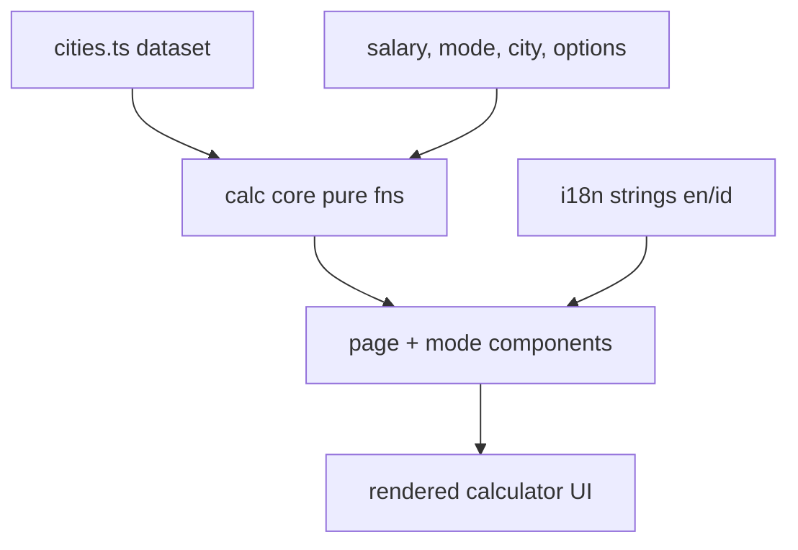
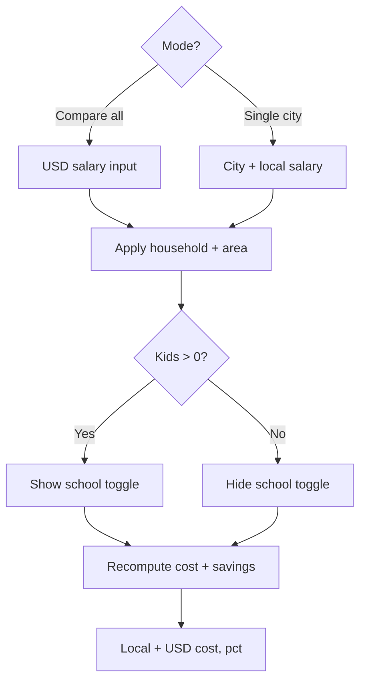

# Technical Documentation — Salary Savings Calculator

## Architecture Overview

A self-contained, **client-side rendered (CSR)** feature in `apps/ayokoding-www`. The page is a
`'use client'` component; all state, input handling, and computation run in the browser. No
server-side rendering of results, no backend, no tRPC procedure, no network at runtime. Three layers:

1. **Data** — a static, hand-curated dataset of tech-hub cities (`cities.ts`).
2. **Calculation core** — pure functions (no React, no I/O) that compute savings; fully unit-tested.
3. **Presentation** — a `'use client'` interactive page under `/[locale]/tools/salary-savings`,
   plus small components for the two modes; consumes the calc core and i18n strings.



### Mode + control flow

How the two modes and the shared controls drive a recompute:



## Proposed File Layout

Exact paths confirmed against the app during Phase 1; the shape:

```
apps/ayokoding-www/src/
  app/[locale]/tools/salary-savings/
    page.tsx                      # 'use client' page; mode toggle + state
  features/salary-savings/        # feature module (co-located)
    data/cities.ts                # static dataset + snapshot date
    data/cities.test.ts           # dataset invariants (no Israel, fields present)
    calc.ts                       # pure calculation functions
    calc.test.ts                  # unit tests for calc
    components/controls.tsx       # shared household / area / school-type controls
    components/compare-table.tsx  # "Compare all" mode
    components/single-city.tsx    # "Single city" mode
    components/*.test.tsx          # component tests
    strings.ts                    # en/id UI strings (or wired into existing i18n)
```

If the app convention prefers `src/contexts/<name>/` over `src/features/`, follow the existing
pattern discovered in Phase 0 rather than introducing a new top-level folder.

## Data Model

```ts
type City = {
  id: string; // stable slug, e.g. "lisbon"
  name: { en: string; id: string };
  country: { en: string; id: string };
  currency: string; // ISO 4217, e.g. "EUR"
  costOfLivingLocal: number; // est. monthly SINGLE-person, CITY-CENTER living cost (assumes PUBLIC transport), local currency
  schoolMedianLocal: { public: number; private: number }; // median monthly cost PER CHILD, local
  fxToUsd: number; // USD value of 1 local-currency unit (snapshot)
  region: "asean" | "japan" | "europe" | "nordics" | "americas" | "mena" | "asia" | "oceania" | "africa";
};

type Household = "single" | "married" | "married_1_kid" | "married_2_kids" | "married_3_kids";
type SchoolType = "public" | "private";
type Area = "center" | "rural";

type Dataset = {
  snapshotDate: string; // ISO date, e.g. "2026-06-16"
  cities: City[]; // tech hubs worldwide; NO Israeli cities
};

// Shared multiplier table — derives household LIVING cost from the single-person cost.
// v1 is city-agnostic (one curve for all cities); per-city override is deferred.
// Indicative seed values (tune in Phase 1, document the source in a comment):
const HOUSEHOLD_MULTIPLIERS: Record<Household, number> = {
  single: 1.0,
  married: 1.6, // two adults, shared housing
  married_1_kid: 1.9,
  married_2_kids: 2.2,
  married_3_kids: 2.5,
};

// Children per household — drives the schooling add-on.
const HOUSEHOLD_KIDS: Record<Household, number> = {
  single: 0,
  married: 0,
  married_1_kid: 1,
  married_2_kids: 2,
  married_3_kids: 3,
};

// Shared area multiplier — discounts living cost outside the city center (housing-driven).
const AREA_MULTIPLIERS: Record<Area, number> = {
  center: 1.0,
  rural: 0.75, // indicative; tune + source in Phase 1
};
```

The dataset stays breadth-first: per city, one living-cost number plus a `{ public, private }`
school median. The household and area dimensions are applied at calculation time via
`HOUSEHOLD_MULTIPLIERS` and `AREA_MULTIPLIERS`, so adding a city never requires a cost matrix.
Schooling adds `kids * schoolMedianLocal[schoolType]` on top of living cost. All three
approximations are surfaced in the "estimates only" disclaimer.

Goal: cover **as many tech-hub cities worldwide as we reasonably can** (static, breadth-first),
excluding Israel. **ASEAN, Japan, broader Europe, and the Nordics must each be represented** (in
addition to the Americas, Middle East, South/East Asia, Oceania, and Africa). Seed set grouped by
region (extend freely in Phase 1):

- **ASEAN**: Singapore, Bangkok, Ho Chi Minh City, Hanoi, Kuala Lumpur, Penang, Jakarta, Bandung,
  Manila, Cebu, Phnom Penh, Vientiane, Yangon, Bandar Seri Begawan.
- **Japan**: Tokyo, Osaka, Fukuoka.
- **Europe (non-Nordic)**: London, Berlin, Munich, Amsterdam, Lisbon, Porto, Dublin, Paris, Zurich,
  Geneva, Vienna, Tallinn, Warsaw, Kraków, Prague, Barcelona, Madrid, Milan.
- **Nordics**: Stockholm, Gothenburg, Copenhagen, Helsinki, Oslo, Reykjavík.
- **Americas**: San Francisco, New York, Seattle, Austin, Boston, Toronto, Vancouver, Mexico City,
  São Paulo, Buenos Aires, Santiago.
- **Middle East / South & East Asia / Oceania / Africa**: Dubai, Bengaluru, Hyderabad, Seoul,
  Taipei, Shenzhen, Sydney, Melbourne, Nairobi, Lagos, Cairo.

More cities are welcome as long as each has credible cost-of-living + FX estimates.

## Calculation Core (pure)

```ts
// All amounts monthly. Salary is GROSS (pre-tax); taxes/deductions are NOT modelled in v1.
// fxToUsd = USD per 1 local unit. opts = { household, area, schoolType }.
livingLocal(city, household, area): number
//   city.costOfLivingLocal * HOUSEHOLD_MULTIPLIERS[household] * AREA_MULTIPLIERS[area]
schoolLocal(city, household, schoolType): number
//   HOUSEHOLD_KIDS[household] * city.schoolMedianLocal[schoolType]
costLocal(city, opts): number             // livingLocal(...) + schoolLocal(...)
costUsd(city, opts): number               // costLocal(city, opts) * city.fxToUsd
compareRow(city, salaryUsd, opts): {      // "Compare all" mode
  costLocal, costUsd, savingsUsd, savingsLocal, savingsPct }
singleCity(city, salaryLocal, opts): {    // "Single city" mode
  costLocal, costUsd, savingsLocal, savingsPct }
sortBySavings(rows): rows                 // desc by savings
```

- Percentages and amounts may be negative (deficit) and must be tested for that case.
- Guard `salary <= 0` to avoid division-by-zero in percentage (return 0% or N/A, decided + tested).
- Functions are deterministic and side-effect-free → straightforward Vitest coverage.

## Presentation

- `page.tsx` is `'use client'`; holds mode (`compare` | `single`), salary input, selected city,
  `household` (default `single`), `area` (default `center`), and `schoolType` (default `public`).
  Household, area, and school-type controls are shared across both modes; the school-type toggle is
  shown only when the selected household has children.
- Number/currency formatting via `Intl.NumberFormat` keyed on city `currency` and active locale.
- Cost of living is displayed in **both** the city's local currency and USD (compute `costUsd` from
  `costLocal`); both modes show the dual-currency cost figure.
- UI is composed from the shared `@open-sharia-enterprise/web-ui` kit: `Tabs`/`TabBar` (mode +
  household), `Input`/`Label` (salary), `Toggle` (area, school-type), `DropdownMenuRadioGroup` or
  `Command` (city picker), `Alert`/`InfoTip` (disclaimer), `Badge` (savings sign), `Card`/`StatCard`
  (single-city breakdown). The only missing primitive is a **`Table`** for the Compare-all view —
  added to `libs/web-ui` in Phase 2 before the app consumes it (see delivery.md). No new third-party
  runtime dependency; styling stays on existing Tailwind tokens.
- Inputs are labeled; table is keyboard-navigable; "estimates only" disclaimer always visible.
- A prominent **"Data last updated: &lt;date&gt;"** label (localized, formatted from the dataset
  `snapshotDate` via `Intl.DateTimeFormat`) sits near the results so users always know the data's
  vintage. v1 has no runtime fetch, so this equals the static snapshot date; if a live source is
  added later, the same label surfaces the actual fetch/update timestamp.

## i18n

Follow the existing `ayokoding-www` i18n mechanism (`src/contexts/i18n/`). Add the calculator's UI
strings (headings, labels, mode names, household-type labels, school-type + area toggle labels,
disclaimer) for both `en` and `id`.
City/country display names live in the dataset (`name.en` / `name.id`) so data and UI strings stay
separable.

## Testing Strategy

- **Unit (vitest)**: `calc.test.ts` covers each function incl. deficit and zero-salary edge cases,
  and asserts: cost rises monotonically across household types (`single` < `married` <
  `married_1_kid` < `married_2_kids` < `married_3_kids`) for a fixed city/area/school; `rural` cost
  < `center` cost for the same household; `private` school cost ≥ `public` for a household with kids;
  and school cost is zero for childless households regardless of school type;
  `cities.test.ts` asserts dataset invariants — every city has all fields (incl.
  `schoolMedianLocal.public` and `schoolMedianLocal.private`), currencies are ISO codes, and
  **no Israeli city / `ILS` currency is present**. Also assert region coverage — at least one
  city each from **ASEAN, Japan, Europe (non-Nordic), and the Nordics** (e.g. via a `region` field).
- **Component (vitest + Testing Library)**: render each mode, simulate input, assert rendered
  savings %, local amount, dual-currency cost (local + USD), and locale strings; assert the shared
  controls recompute cost/savings and that the school-type toggle is hidden until kids are selected.
- **E2E (ayokoding-www-fe-e2e, Playwright)**: one smoke test — load `/en/tools/salary-savings`,
  enter a salary, assert a populated table and a savings cell.
- Meet the app's existing coverage threshold (rhino-cli validator in `test:quick`).

## Design Decisions

- **Static dataset over live API** — deterministic, testable, no keys/flakiness; snapshot date +
  disclaimer communicate the trade-off. Live data deferred.
- **Client-only, no tRPC** — pure computation; avoids backend surface and keeps it cacheable/simple.
- **Calc isolated from React** — pure module enables exhaustive, fast unit tests independent of UI.
- **`fxToUsd` as USD-per-local** — single rate per city powers both modes; avoids a rate matrix.
- **Shared household + area multipliers** — keeps the dataset breadth-first (one living-cost number
  per city) while still modelling family size and city-center-vs-rural; per-city overrides deferred.
- **School cost stored per city** — schooling varies too much by city to derive from a multiplier,
  so each city carries a `{ public, private }` median; added per child on top of living cost.

## Risks / Open Questions

- Final cost-of-living/FX numbers, the household + area multiplier tables, and the per-city
  public/private school medians all need a credible source noted in `cities.ts` comments (curation
  task in Phase 1; figures are estimates).
- Confirm app's feature-folder convention (`features/` vs `contexts/`) in Phase 0 before scaffolding.
- Confirm whether disclaimers/snapshot belong in i18n strings or dataset — default: disclaimer text
  in i18n, snapshot date in dataset.

## Dependencies

No new third-party runtime dependency. Uses Next.js 16 App Router, React 19, Tailwind 4, Vitest, and
Playwright already present in `ayokoding-www` / `ayokoding-www-fe-e2e`.

One internal addition: a shared **`Table`** primitive is added to `libs/web-ui`
(`@open-sharia-enterprise/web-ui`) in Phase 2 — the kit already provides every other control this
feature needs (`Tabs`/`TabBar`, `Input`, `Label`, `Toggle`, `DropdownMenuRadioGroup`, `Command`,
`Alert`/`InfoTip`, `Badge`, `Card`/`StatCard`), but no table component exists yet. It is built with
the existing shadcn/Radix + CVA stack — no new external package.
