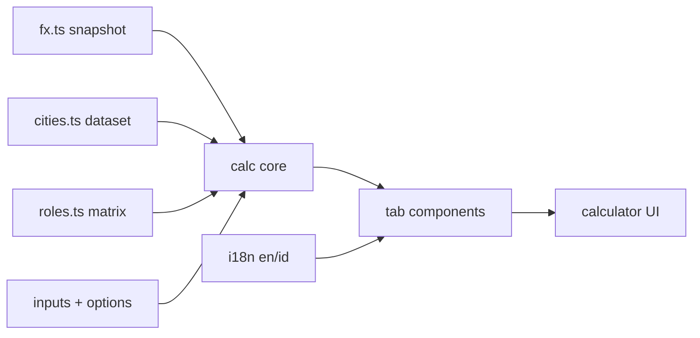
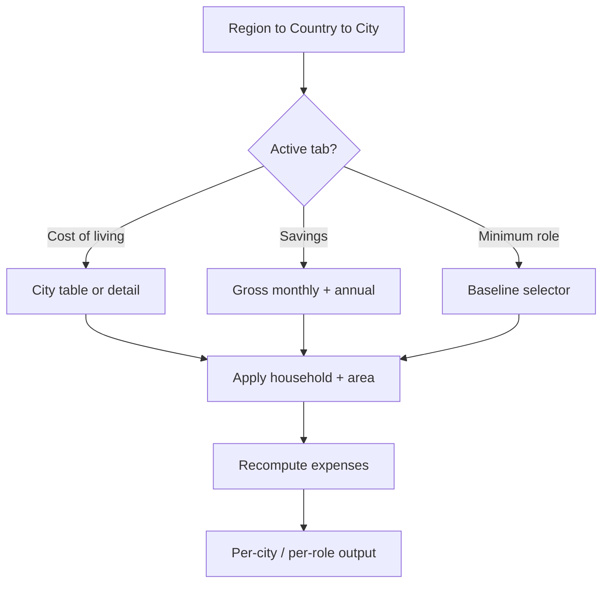
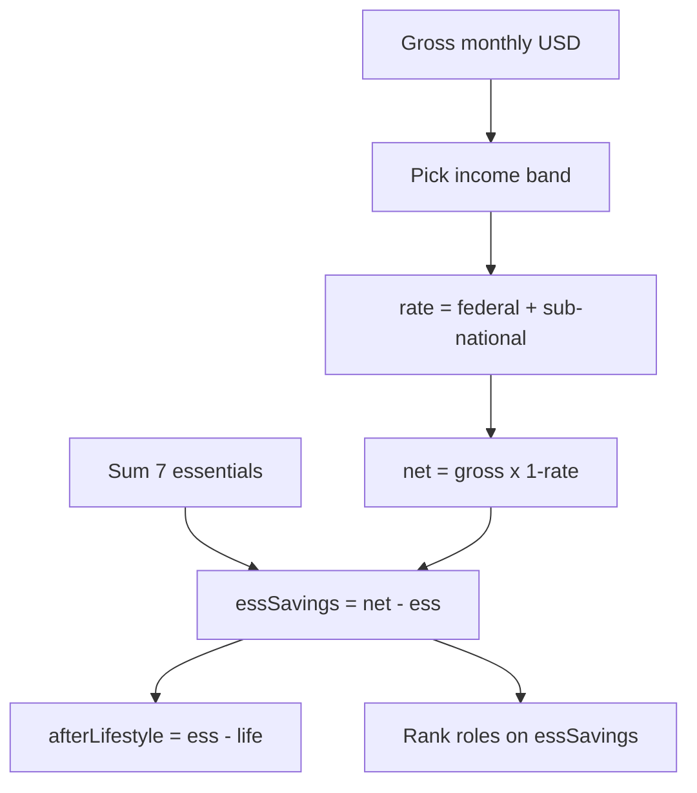
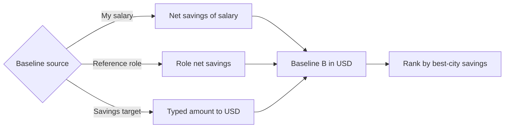
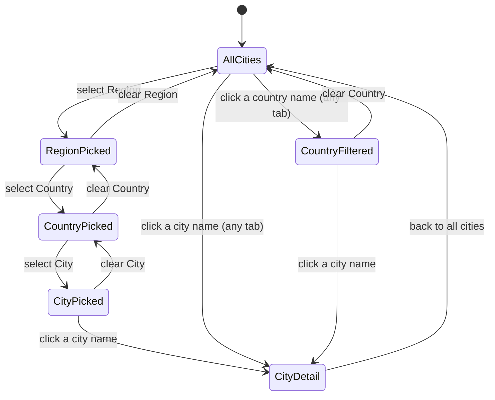

# Technical Documentation — Cost of Living Calculator

> **Naming note**: the shipped tool is the **Cost of Living Calculator** at
> `/[locale]/tools/cost-of-living-calculator`, and its feature module is
> `features/cost-of-living-calculator/`. The plan **folder** keeps its original slug
> (`ayokoding-www-salary-savings-calculator`); only the tool name, route, and feature-module folder
> use `cost-of-living-calculator`.

## Architecture Overview

A self-contained, **client-side rendered (CSR)** feature in `apps/ayokoding-www`. The page is a
`'use client'` component; all state, input handling, and computation run in the browser. No
server-side rendering of results, no backend, no tRPC procedure, no network at runtime. Three layers:

1. **Data** — three static, hand-curated, `web-research-maker`-sourced datasets: an authoritative FX
   snapshot (`fx.ts`, the single source for all currency conversion), tech-hub cities with
   per-category expenses + per-country tax bands + relocation components (`cities.ts`, FX-to-USD
   derived from `fx.ts`), and the engineering-role × country salary matrix (`roles.ts`).
2. **Calculation core** — pure functions (no React, no I/O): `calc` (net-of-tax, expense
   composition, savings residual, relocation total) and `roleLookup` (baseline resolution +
   minimum-role search); fully unit-tested.
3. **Presentation** — a `'use client'` interactive page under
   `/[locale]/tools/cost-of-living-calculator`, plus small components for the three tabs; consumes the
   calc core and i18n strings. Presentation rules that span all tabs:
   - **Dual-currency on every money column** — a shared money-cell renderer formats each monetary value
     as the display currency (line 1; defaults to USD) over the city's local currency (line 2). On the
     Minimum-role tab this applies to **every** money column — p25, median, p75, non-salary comp, total
     comp, and essential savings — not only the savings figure (FR-15, NFR-1e).
   - **Shared cost-basis controls on all three tabs** — `geo-filters.tsx` (Region / Country / City) and
     `controls.tsx` (household / area / school-type) render on **every** tab including Minimum role; the
     Minimum-role essential-savings computation and ranking read the active household / area / school
     basis (FR-23). A taller-row table layout keeps the healthcare funding-scheme badge fully visible.
   - **On-screen OOP explanation** — every tab that shows the Healthcare (OOP) column renders a
     legend/footnote line stating "OOP = out-of-pocket" with the plain-language meaning (FR-22), sourced
     from i18n (en/id).



### Tab + control flow

How the three tabs and the shared controls drive a recompute:



The **Region → Country → City** cascading filters are shared by all three tabs (a selected Region
narrows the Country list; a selected Country narrows the City list). On the Minimum-role tab the
filters scope the **candidate cities** considered for each role's best city.

### Net-of-tax savings flow

How a gross salary becomes a savings residual per city (Savings tab and role candidates):



### Minimum-role resolution

The minimum-role branch resolves a USD baseline, then ranks the role ladder by each role's best-city
absolute net savings. The per-role essential savings is computed at the **active household / area /
school-type cost basis** (the same shared controls shown on every tab), so changing the household
composition or area re-derives the essentials and can change which role is the minimum — e.g. a role
that qualifies for a `single` basis may fall below the bar at `married + 2 kids` in the city `center`:



### Geographic filters + country/city navigation

All three tabs share a **Region → Country → City** cascading filter group and a **Country/City name →
Cost-of-living navigation** (both the Country name and the City name in every row are links). Filter
state lives in the **shell** (`page.tsx`), is passed into the shell tab components, and parameterises
the pure-core selectors (the core stays filter-agnostic — it receives an already scoped city list /
`cityScope`).



Two link targets share one navigation: a **City** link sets `?tab=cost&city=<id>` (single-city
detail); a **Country** link sets `?tab=cost&country=<id>` (the Cost-of-living tab filtered to that
country's cities — a list, not a detail). A `city` param wins over a `country` param (a city implies
its country).

- **Cascading filters** — `Region` (the `City.region` tag) narrows the available `Country` options;
  the selected `Country` narrows the available `City` options. Each filter is clearable; clearing a
  higher level resets the lower ones. On the Minimum-role tab the resulting filtered city set is the
  `cityScope` passed to `bestCityForRole` / `rankLadder`.
- **Country + City always shown together** — every table renders a **Country column immediately to the
  left of the City column**; mobile cards show "City, Country". The `City.countryId` resolves the
  country display name from the `countries` table.
- **City-name → Cost-of-living detail** — clicking any city name anywhere navigates to the **single-city
  Cost-of-living detail** view: the Cost-of-living tab scoped to that one city (its City filter set),
  showing the full per-category breakdown (housing, food, transport, utilities, healthcare-OOP,
  childcare, school, lifestyle), the essentials subtotal, the total, the healthcare scheme badge, and
  the split relocation (sunk + liquidity reserve), all dual-currency (local + USD). It is
  **deep-linkable** via the URL query (`?tab=cost&city=<id>`) and is shareable and back-navigable. A
  back affordance returns to the full city table.
- **Country-name → Cost-of-living filtered to that country** — clicking any country name anywhere
  navigates to the **Cost-of-living tab filtered to that country**: the Country filter (and its Region)
  are set so the table lists that country's cities (a filtered list, **not** a single-city detail). It
  is **deep-linkable** via the URL query (`?tab=cost&country=<id>`). No new component is required — the
  country case reuses `cost-of-living.tsx` with the Country filter pre-applied; only `city-detail.tsx`
  remains the dedicated single-city surface.
- **Query-param contract + precedence** — the page reads/writes the `tab`, `country`, and `city` query
  params. A city click sets the City filter (and implicitly its Country + Region); a country click sets
  the Country filter (and its Region). If both `country` and `city` are present in the URL, the `city`
  deep-link **wins** and the single-city detail is shown (a city implies its country).

## Proposed File Layout

Exact paths confirmed against the app during Phase 0; the shape follows the repo-standard
functional-core / imperative-shell layout (`src/features/<name>/{core,shell}/`):

```
apps/ayokoding-www/src/
  app/[locale]/tools/cost-of-living-calculator/
    page.tsx                      # 'use client' page; tab toggle + state
  features/cost-of-living-calculator/  # feature module (functional core / imperative shell)
    core/                         # PURE — no React, no IO
      data/fx.ts                  # AUTHORITATIVE FX snapshot: ISO-4217 -> USD per 1 unit + fxSnapshotDate (single source for ALL conversion)
      data/fx.test.ts             # fx dataset invariants (every used + display currency has an entry; positive rates; fxSnapshotDate present)
      data/cities.ts              # cities: per-category expenses + tax bands + relocation + snapshot; fxToUsd DERIVED from fx.ts via currency
      data/cities.test.ts         # city dataset invariants (7 categories incl childcare, federal+sub-national tax, healthcare scheme, relocation split, no Israel)
      data/roles.ts               # role ladder + role×COUNTRY salary distribution (p25/median/p75) + non-salary comp + snapshot
      data/roles.test.ts          # role dataset invariants (full country matrix, p25/median/p75, non-salary comp, no Israel, confidence tiers)
      calc.ts                     # pure net/expense/savings/relocation + gross monthly<->annual + total-comp; conversions read fx.ts
      calc.test.ts                # unit tests for calc
      role-lookup.ts              # pure baseline-resolution + minimum-role search (median-ranked, filter-scoped, reordered)
      role-lookup.test.ts         # unit tests for role lookup
      geo-filter.ts               # pure Region->Country->City cascading-filter selectors (city scoping)
      geo-filter.test.ts          # unit tests for geo filters
    shell/                        # EFFECTFUL — React components
      controls.tsx                # shared household / area / school-type controls
      geo-filters.tsx             # shared Region / Country / City cascading-filter row (all tabs)
      cost-of-living.tsx          # "Cost of living" tab (category table; Country+City columns; Country & City name links; country case = filtered table via ?tab=cost&country=<id>)
      city-detail.tsx             # single-city Cost-of-living detail view (drill-down, ?tab=cost&city=<id>)
      savings.tsx                 # "Savings" tab (gross monthly+annual -> net -> savings + non-salary comp + total-comp table)
      min-role.tsx                # "Minimum role" tab (baseline selector + shared cost-basis controls + reordered ladder table; p25/median/p75 + comp + savings ALL dual-currency)
      *.test.tsx                  # component tests
```

Pure datasets and calculation/lookup logic live in `core/`; React UI lives in `shell/`. See
[Functional Core / Imperative Shell — Web Apps](../../../repo-governance/development/pattern/functional-core-imperative-shell-web.md).
The `app/[locale]/tools/cost-of-living-calculator/page.tsx` route entry is part of the shell and
imports from `core/`. The en/id UI strings live in the app's i18n core (`src/features/i18n/core/`);
city/country display names live in `cities.ts` and role labels live in `roles.ts`.

## Data Model

```ts
type Confidence = "high" | "moderate" | "proxy";

// One modeled monthly expense (or one-time relocation component) value, with provenance.
type Money = {
  amount: number; // local currency, monthly (or one-time for relocation)
  confidence: Confidence;
  note?: string; // source / derivation, e.g. "numbeo 2026" or "proxy: 0.6 × Singapore"
};

// Seven modeled monthly expense categories, all in the city's local currency (school is added
// separately per school-age child via schoolMedianLocal, not stored as a category here).
type ExpenseCategories = {
  housing: Money; // scaled by household; discounted by area
  food: Money; // scaled by household
  transport: Money; // monthly PUBLIC-TRANSIT pass (cars not modeled)
  utilities: Money;
  healthcare: Money; // OUT-OF-POCKET ONLY (see healthcareModelType / double-counting guard); scaled near per-capita
  childcare: Money; // monthly cost PER PRE-SCHOOL child (scaled near per-capita); ESSENTIAL
  lifestyle: Money; // discretionary; absorbs clothing + personal care (not separate categories)
};

// One-time relocation, split into money actually SPENT (sunkCosts) and a reserve the user KEEPS
// (liquidityReserve). Both informational; kept OUT of monthly savings. The reserve is NEVER folded
// into sunk-cost totals — it transfers from origin savings to destination savings.
type Relocation = {
  sunkCosts: {
    deposit: Money; // REFUNDABLE security deposit ≈ 1–3 × monthly rent (recoverable, but cash spent up front)
    keyMoney: Money; // NON-refundable key money (e.g. Japan reikin ≈ 1–2 × rent); 0 where not applicable
    moving: Money; // moving / shipping
    visaAdmin: Money; // visa / admin (cross-border only)
  };
  liquidityReserve: {
    cashCushion: Money; // ≈ 3–6 × essential monthly cost; a reserve the user KEEPS (not a sunk cost)
  };
};

type City = {
  id: string; // stable slug, e.g. "lisbon"
  name: { en: string; id: string };
  countryId: string; // FK into the country/tax table, e.g. "pt"
  currency: string; // ISO 4217, e.g. "EUR" — the KEY into fx.ts for this city's USD rate
  // NOTE: there is NO standalone `fxToUsd` field on City. The USD-per-1-unit rate is DERIVED from
  // fx.ts via `currency` (see FxTable + `fxToUsd(fx, currency)` helper) so a currency's rate is
  // stored exactly once, in fx.ts.
  expenses: ExpenseCategories; // single-person, CITY-CENTER baseline (assumes PUBLIC transport)
  childcareMedianLocal: Money; // median monthly childcare cost PER PRE-SCHOOL child, local (essential)
  schoolMedianLocal: { public: Money; private: Money }; // median monthly cost PER SCHOOL-AGE child, local
  relocation: Relocation; // one-time relocation, split sunkCosts vs liquidityReserve, local
  // OPTIONAL sub-national (state/province/canton) banded effective tax, ADDED to the country's federal
  // rate. Present ONLY for cities in federal/multi-jurisdiction countries (US, CA, CH); omitted for
  // unitary countries (UK, DE, JP, SG, Nordics, …) which have no sub-national income tax component.
  subNational?: {
    name: { en: string; id: string }; // e.g. "California", "Ontario", "Zürich"
    effectiveRate: Record<IncomeBand, Money>; // 0..1 sub-national effective rate per band, confidence-tiered
  };
  region: "asean" | "japan" | "europe" | "nordics" | "americas" | "mena" | "asia" | "oceania" | "africa";
};

type Household = {
  adults: 1 | 2; // single → 1 adult; married → 2 adults
  preschoolKids: 0 | 1 | 2 | 3; // PRE-SCHOOL-age children → drive CHILDCARE cost
  schoolKids: 0 | 1 | 2 | 3; // SCHOOL-age children → drive SCHOOL (public/private) cost
};
type SchoolType = "public" | "private";
type Area = "center" | "rural";
type IncomeBand = "low" | "mid" | "high";

// Per-COUNTRY effective tax model: combined income tax + mandatory contributions, banded.
// For a FEDERAL banded rate; sub-national (state/province/canton) is ADDED on top via City.subNational
// for US/CA/CH cities. net = gross × (1 − (country.effectiveRate[band] + (city.subNational?.effectiveRate[band] ?? 0))).
// A simplified effective-rate model — NOT a bracket engine.
type Country = {
  id: string; // e.g. "id", "pt", "de"
  name: { en: string; id: string };
  // Monthly-gross-USD upper bounds that separate the bands (ascending); last band is open-ended.
  bandThresholdsUsd: { lowToMid: number; midToHigh: number };
  effectiveRate: Record<IncomeBand, Money>; // 0..1 FEDERAL effective rate per band, confidence-tiered
  // How healthcare is funded in this country — drives what the `healthcare` expense category captures
  // and the ALWAYS-shown "Healthcare funding scheme" badge on every tab.
  healthcareModelType: "oop" | "tax-funded" | "mixed";
  //   "oop"        — out-of-pocket / private insurance dominant (e.g. US): healthcare = real OOP spend.
  //   "tax-funded" — single-payer/NHS-style funded by tax (e.g. UK): healthcare = small residual only.
  //   "mixed"      — mandatory payroll/social health insurance + copays (e.g. DE, JP): healthcare = residual.
  // Whether insurance / social contributions are a LEGAL/REGULATORY necessity in this country.
  compulsoryInsurance: {
    health: boolean; // is health insurance legally mandatory (e.g. statutory/national health scheme)?
    socialSecurity: boolean; // are pension / social-security / unemployment contributions mandatory?
    note?: string; // specifics, e.g. "health premiums inside effectiveRate (payroll-deducted)"
  };
};

// AUTHORITATIVE FX snapshot (in `fx.ts`) — the SINGLE SOURCE for every currency conversion in the
// app (local -> USD, and USD -> chosen display currency). Each entry is the USD value of 1 unit of
// that currency. A city's USD rate is DERIVED from this table via the city's `currency`; no city
// stores its own rate. Every currency used by any city/country/role AND every supported
// chosen-display currency MUST have an entry here.
type FxTable = {
  fxSnapshotDate: string; // ISO date of the FX snapshot (may differ from cities/roles snapshots)
  // ISO-4217 currency code -> USD value per 1 unit, e.g. { USD: 1, EUR: 1.08, IDR: 0.000063 }
  ratesUsdPerUnit: Record<string, number>;
};

type Dataset = {
  snapshotDate: string; // ISO date, e.g. "2026-06-16"
  fx: FxTable; // authoritative FX snapshot (from fx.ts); single source for all conversion
  countries: Country[]; // every country referenced by a city; NO Israel
  cities: City[]; // tech hubs worldwide; NO Israeli cities
};

// Shared PER-CATEGORY household equivalence multipliers, derived from the OECD MODIFIED equivalence
// scale: first adult = 1.0, each additional adult = +0.5, each child = +0.3. The "equivalised
// household size" `S = 1.0 + 0.5 × (adults − 1) + 0.3 × (preschoolKids + schoolKids)` is the OECD
// basis. Categories then apply that basis at one of two intensities:
//   - SUB-LINEAR  (economies of scale): housing, utilities — shared by the whole household, so they
//     grow slower than `S`. We model them as `1 + SUBLINEAR_DAMPING × (S − 1)` (damping < 1).
//   - PER-CAPITA  (no economies of scale): food, healthcare, childcare — each person consumes their
//     own, so they scale with the equivalised size `S` (childcare additionally counts per pre-school
//     child only — see childcareLocal).
// transport (a transit pass) and lifestyle stay per-earner/flat. v1 is city-agnostic (one curve for
// all cities); per-city override is deferred. Tune the damping + document the OECD source in a comment.

// OECD-modified equivalised household size.
function equivalisedSize(h: Household): number {
  return 1.0 + 0.5 * (h.adults - 1) + 0.3 * (h.preschoolKids + h.schoolKids);
}

// Sub-linear damping applied to housing + utilities (economies of scale). Indicative; tune in Phase 1.
const SUBLINEAR_DAMPING = 0.5; // housingMultiplier = 1 + 0.5 × (equivalisedSize − 1)

// Per-category multiplier selectors (documented OECD-modified basis above).
//   subLinear(h)  → housing, utilities      (economies of scale)
//   perCapita(h)  → food, healthcare        (childcare uses preschoolKids only — see childcareLocal)
const subLinear = (h: Household): number => 1 + SUBLINEAR_DAMPING * (equivalisedSize(h) - 1);
const perCapita = (h: Household): number => equivalisedSize(h);

// Shared area multiplier — discounts HOUSING outside the city center.
const AREA_MULTIPLIERS: Record<Area, number> = {
  center: 1.0,
  rural: 0.75, // indicative; tune + source in Phase 1
};
```

Notes on the model:

- **FX is single-sourced from `fx.ts`** — the `FxTable` (ISO-4217 → USD per 1 unit + `fxSnapshotDate`)
  is the only place a currency's USD rate is stored. Every conversion in `calc.ts` and
  `role-lookup.ts` reads through the `fxToUsd(fx, currency)` helper; a city's USD rate is **derived**
  from `fx.ts` via `City.currency`, never stored on the city. `fx.test.ts` asserts every currency
  referenced by a city/country/role and every supported display currency has an entry, all rates are
  positive, and `fxSnapshotDate` is present.
- **Household scaling is per-category on an OECD-modified basis**, not a single living-cost number.
  The OECD modified equivalence scale (first adult 1.0, each additional adult +0.5, each child +0.3)
  yields an equivalised size `S`; **housing + utilities** scale **sub-linearly** off `S` (economies
  of scale), while **food, healthcare, and childcare** scale **near per-capita** (no economies of
  scale). transport (a transit pass) and lifestyle stay flat/per-earner. The area multiplier discounts
  housing only. These choices are documented in `calc.ts` and surfaced in the "estimates only"
  disclaimer.
- **Kids split by stage** — pre-school-age children drive the **childcare** essential (per pre-school
  child); school-age children drive the **school** median (public/private, per school-age child). The
  shared kids control is therefore two small number inputs (`preschoolKids`, `schoolKids`, each 0–3),
  not a single "married_N_kids" value.
- **Tax is federal-per-country plus optional sub-national-per-city** — `City.countryId` keys into
  `countries` for the **federal** banded effective rate shared by every city in that country. For
  **federal/multi-jurisdiction countries (US states, Canada provinces, Switzerland cantons)** the
  city additionally carries `subNational.effectiveRate`, which is **added** to the federal band rate:
  `net = gross × (1 − (country.effectiveRate[band] + (city.subNational?.effectiveRate[band] ?? 0)))`.
  **Unitary countries (UK, DE, JP, SG, Nordics, …)** have **no** `subNational` component.
  `cities.test.ts` asserts every `countryId` resolves, no city is orphaned, and every city in US/CA/CH
  carries `subNational` (other countries may omit it). The tax model is a simplified effective rate —
  it captures sub-national tax only for US/CA/CH and excludes filing status, deductions,
  benefits-in-kind, and social-contribution caps.
- **Relocation is one-time and split** — `relocation.sunkCosts` (deposit, keyMoney, moving, visaAdmin)
  is money actually **spent** and is summed into the displayed sunk-cost total; `relocation.liquidityReserve.cashCushion`
  is a reserve the user **keeps** (it transfers from origin savings to destination savings) and is
  shown **separately**, clearly labelled, **never** folded into the sunk-cost total or the monthly
  savings residual. `keyMoney` is non-refundable (e.g. Japan reikin ≈ 1–2× rent) and is `0` where not
  applicable.
- **Healthcare is out-of-pocket only, and the funding scheme is always shown** — the `healthcare`
  expense category models **OUT-OF-POCKET costs only**. For `tax-funded` / `mixed`
  `healthcareModelType` countries it is the small residual (prescriptions, dental, copays, optical),
  because mandatory health premiums already sit inside the country's effective tax + contribution rate
  — re-adding them here would double-count. For `oop` countries (e.g. US) it is the real
  out-of-pocket / private-insurance spend. Independently of this accounting, **every tab always
  displays the healthcare funding scheme** for the selected city/country as a badge (e.g.
  "Healthcare: tax-funded (NHS-style)", "mandatory payroll insurance", or "out-of-pocket"), driven by
  `Country.healthcareModelType`.
- **Compulsory insurance is recorded per country** — each `Country` carries `compulsoryInsurance`
  flagging whether health insurance is a legal/regulatory necessity (`health`) and whether
  pension/social/unemployment contributions are mandatory (`socialSecurity`), with a `note` for
  specifics (e.g. `"health premiums inside effectiveRate (payroll-deducted)"`). It complements the
  out-of-pocket-only healthcare rule above.

### Role-Salary Matrix (`roles.ts`)

The minimum-role tab needs a typical **gross** salary **distribution** for each rung of a canonical
**software-engineering** role ladder, **per role × country** (not per role × city). The ladder is a
**synthesised industry-consensus taxonomy** of **software-engineering roles** (`web-research-maker`
confirmed no standards body publishes one; the de-facto reference is levels.fyi's aggregation of
Big-Tech leveling). It interleaves the individual-contributor (IC) and management (M) tracks at their
commonly recognised equivalent compensation bands. `seniorityRank` gives a single total ordering for
**display + the "minimum" tiebreak only**; the qualifying test itself is the absolute-savings
comparison, never the rank (see Design Decisions).

**Salary is a per-role × country distribution.** Each role × country cell stores **p25 (bottom 25%),
median, and p75 (top 25%)** monthly-gross figures, each confidence-tiered. **Cities inherit their
country's role-salary distribution** — this is a deliberate **simplification: role salary is modeled
at the national level, not per city** (a documented risk + disclaimer; see Risks). The **median** is
the representative salary used for ranking and for the reference-role baseline; the **UI displays all
three percentiles** (p25 / median / p75) plus a typical **non-salary comp** (RSU/equity + bonus) per
role × country shown as informational total-comp context.

```ts
type Track = "ic" | "mgmt";

type EngRole =
  | "swe_1" // SWE I / SDE I (entry)            rank 1  ic
  | "swe_2" // SWE II / SDE II (mid)            rank 2  ic
  | "senior_swe" // Senior SWE                  rank 3  ic   (senior band)
  | "eng_manager" // Engineering Manager (M1)   rank 4  mgmt (senior band)
  | "staff_swe" // Staff SWE                    rank 5  ic   (staff band)
  | "senior_eng_manager" // Senior EM (M2)      rank 6  mgmt (staff band)
  | "senior_staff_swe" // Senior Staff SWE      rank 7  ic   (sr-staff band)
  | "director" // Director of Eng (M3)          rank 8  mgmt (director band)
  | "principal_swe" // Principal SWE            rank 9  ic   (principal band)
  | "senior_director" // Senior Director (M4)   rank 10 mgmt (sr-director band)
  | "distinguished_swe" // Distinguished Eng    rank 11 ic   (distinguished band)
  | "vp_eng" // VP Engineering (M5)             rank 12 mgmt (vp band)
  | "fellow" // Fellow / Technical Fellow       rank 13 ic   (fellow band)
  | "svp_eng" // SVP Engineering (M6)           rank 14 mgmt (svp band)
  | "cto"; // CTO (M7)                          rank 15 mgmt (apex)

// Canonical ladder metadata. `rank` interleaves IC + mgmt at equivalent bands; at equal band the
// IC role sits first (lower org overhead, found at more companies → more universally achievable),
// so the IC and mgmt tracks each stay strictly ascending. "Intern" is intentionally excluded
// (non-permanent). Labels carry en/id for the UI.
type RoleMeta = {
  role: EngRole;
  rank: number; // 1..15, ascending seniority
  track: Track;
  label: { en: string; id: string };
};

// One percentile point of a role's GROSS monthly salary in a country's currency, with provenance.
// `proxy` cells are derived from a documented regional multiplier off a reference country (public
// per-role data is sparse outside the US) — never a fabricated exact figure.
type SalaryPoint = {
  monthlyGrossLocal: number; // GROSS monthly salary in the COUNTRY'S currency
  confidence: Confidence;
  note?: string; // source / derivation, e.g. "levels.fyi 2025" or "proxy: 0.45 × Singapore"
};

// A role × COUNTRY salary distribution: bottom 25% / median / top 25%. The MEDIAN is the
// representative salary used for ranking + the reference-role baseline; all three are displayed.
type RoleSalaryDistribution = {
  p25: SalaryPoint; // bottom 25%
  median: SalaryPoint; // representative salary (used for ranking + baseline)
  p75: SalaryPoint; // top 25%
  // Typical NON-SALARY compensation (annual RSU/equity + bonus), informational total-comp context
  // ONLY — NOT folded into the deterministic monthly net-savings math. Both savings figures use net
  // BASE salary only, because RSU/equity is volatile (swings with the share price; bonuses are not
  // guaranteed) and would destabilize savings; equity vesting/tax is also out of scope. Displayed as
  // a separate column/line with a clear note.
  nonSalaryComp: { annualLocal: number; confidence: Confidence; note?: string };
};

type RoleMatrix = {
  snapshotDate: string; // ISO date of the salary snapshot (may differ from cities.ts)
  ladder: RoleMeta[]; // the canonical ordered ladder
  // countryId -> role -> distribution. FULL matrix: every country in cities.ts × every role in
  // `ladder`. Cities INHERIT their country's distribution (role salary is national-level, not
  // per-city — a documented simplification).
  salaries: Record<string, Record<EngRole, RoleSalaryDistribution>>;
};

type BaselineSource = "my_salary" | "reference_role" | "savings_target";
```

The matrix is **complete by construction** (every **country** × every role) so the search never has
holes; honesty is preserved by the per-cell `confidence` tier rather than by omitting cells. Country
IDs key into the `countries` table in `cities.ts`, and **each city inherits its country's role-salary
distribution** via `City.countryId` — so role data inherits the city's currency (whose USD rate comes
from `fx.ts`; a country uses its cities' shared currency), the same banded tax model, and the same
no-Israel guarantee (a `roles.test.ts` invariant asserts the country-key set matches the countries
referenced by `cities.ts` and that no excluded country/city leaks in). The display currency is any
ISO code already present in
`cities.ts` plus USD.

Goal: cover **as many tech-hub cities worldwide as we reasonably can** (static, breadth-first),
excluding Israel. **ASEAN, Japan, broader Europe, and the Nordics must each be represented** (in
addition to the Americas, Middle East, South/East Asia, Oceania, and Africa). Seed set grouped by
region (extend freely in Phase 1):

- **ASEAN**: Singapore, Bangkok, Ho Chi Minh City, Hanoi, Kuala Lumpur, Penang, Jakarta, Bandung,
  Manila, Cebu, Phnom Penh, Vientiane, Yangon, Bandar Seri Begawan.
- **Japan**: Tokyo, Osaka, Fukuoka.
- **Europe (non-Nordic)**: London, Berlin, Munich, Amsterdam, Lisbon, Porto, Dublin, Paris, Zurich,
  Geneva, Vienna, Tallinn, Warsaw, Kraków, Prague, Barcelona, Madrid, Milan.
- **Nordics**: Stockholm, Gothenburg, Copenhagen, Helsinki, Oslo, Reykjavík.
- **Americas**: San Francisco, New York, Seattle, Austin, Boston, Toronto, Vancouver, Mexico City,
  São Paulo, Buenos Aires, Santiago.
- **Middle East / South & East Asia / Oceania / Africa**: Dubai, Bengaluru, Hyderabad, Seoul,
  Taipei, Shenzhen, Sydney, Melbourne, Nairobi, Lagos, Cairo.

More cities are welcome as long as each has credible expense + tax + FX estimates.

## Calculation Core (pure)

```ts
// All amounts monthly unless noted. Salary is GROSS (pre-tax). opts = { household, area, schoolType }.
// household = { adults, preschoolKids, schoolKids }.

// --- FX (single source: fx.ts) ---
// fxToUsd is the ONLY conversion primitive; every *Usd function below routes through it. A city's
// rate is read from fx.ts by the city's currency — no city stores its own rate.
fxToUsd(fx, currency): number                  // fx.ratesUsdPerUnit[currency]  (USD per 1 unit; throws/guards if missing)
cityFxToUsd(fx, city): number                  // fxToUsd(fx, city.currency)
usdToDisplay(fx, usd, displayCurrency): number // usd / fxToUsd(fx, displayCurrency)

// --- per-category expense build (after OECD-modified household + area adjustment) ---
housingLocal(city, household, area): number   // city.expenses.housing.amount * subLinear(household) * AREA[area]
utilitiesLocal(city, household): number        // city.expenses.utilities.amount * subLinear(household)
foodLocal(city, household): number             // city.expenses.food.amount * perCapita(household)
healthcareLocal(city, household): number       // city.expenses.healthcare.amount * perCapita(household)  (OOP only)
transportLocal(city): number                   // city.expenses.transport.amount (flat: transit pass)
lifestyleLocal(city): number                   // city.expenses.lifestyle.amount (flat: per-earner; absorbs clothing + personal care)
childcareLocal(city, household): number         // household.preschoolKids * city.childcareMedianLocal.amount  (per PRE-SCHOOL child)
schoolLocal(city, household, schoolType): number // household.schoolKids * city.schoolMedianLocal[schoolType].amount (per SCHOOL-AGE child)

// essentials = housing + food + transport + utilities + healthcare(OOP) + childcare + school
essentialsLocal(city, opts): number   // housing + food + transport + utilities + healthcare + childcare + school
lifestyleTotalLocal(city, opts): number // lifestyleLocal (kept separate from essentials)
expensesLocal(city, opts): number     // essentialsLocal + lifestyleTotalLocal
expensesUsd(fx, city, opts): number   // expensesLocal(city, opts) * cityFxToUsd(fx, city)
relocationSunkLocal(city): number     // sunkCosts: deposit + keyMoney + moving + visaAdmin (money SPENT)
relocationSunkUsd(fx, city): number   // relocationSunkLocal(city) * cityFxToUsd(fx, city)
liquidityReserveLocal(city): number   // liquidityReserve.cashCushion (a reserve the user KEEPS)
liquidityReserveUsd(fx, city): number // liquidityReserveLocal(city) * cityFxToUsd(fx, city)

// --- gross salary monthly <-> annual + total comp (Savings tab accepts either; shows both) ---
grossMonthlyToAnnual(monthly): number          // monthly * 12
grossAnnualToMonthly(annual): number           // annual / 12  (enter one, display both)
totalCompAnnual(grossAnnual, nonSalaryCompAnnual): number  // grossAnnual + nonSalaryCompAnnual (INFORMATIONAL only — not in savings)

// --- tax → net (federal + optional sub-national) ---
incomeBand(country, grossUsd): IncomeBand     // low/mid/high from country.bandThresholdsUsd (monthly USD)
effectiveRate(country, city, band): number    // country.effectiveRate[band].amount
                                              //   + (city.subNational?.effectiveRate[band].amount ?? 0)
netUsd(country, city, grossUsd): number       // grossUsd * (1 - effectiveRate(country, city, band))

// --- per-tab rows (fx passed in; all *Usd values route through fxToUsd) ---
costOfLivingRow(fx, city, opts): {            // "Cost of living" tab (no salary)
  housing, food, transport, utilities, healthcare, childcare, school, lifestyle,
  essentialsLocal, expensesLocal, expensesUsd,
  relocationSunkLocal, relocationSunkUsd, liquidityReserveLocal, liquidityReserveUsd }
savingsRow(fx, country, city, grossUsd, opts): {  // "Savings" tab + role candidates — TWO savings figures
  netUsd, essentialsUsd, lifestyleUsd,
  essentialSavingsUsd, essentialSavingsPct,   // net − essentials
  afterLifestyleSavingsUsd, afterLifestyleSavingsPct }  // essentialSavings − lifestyle
sortByEssentialSavings(rows): rows             // desc by essentialSavings (the ranking figure)
```

- **Two savings figures** (both shown wherever savings appears, each in local + USD):
  - `essentials = housing + food + transport + utilities + healthcare(OOP) + childcare + school`.
  - `essentialSavingsUsd = netUsd − essentialsUsd`.
  - `afterLifestyleSavingsUsd = essentialSavingsUsd − lifestyleUsd`.
  - Each `…Pct = …SavingsUsd / netUsd × 100`. Both may be negative (deficit) and must be tested.
- **Minimum-role ranks on `essentialSavings` (USD)** — lifestyle is EXCLUDED from the ranking because
  fixing lifestyle as a modeled expense bundles personal preference into an otherwise objective
  comparison. `afterLifestyleSavings` is shown for context but is not the ranking key.
- Guard `net <= 0` (and `gross <= 0`) to avoid division-by-zero in percentage (return 0% or N/A,
  decided + tested).
- Relocation is computed but never added into either savings figure (informational only); the
  liquidity reserve is shown separately and is never folded into the sunk-cost total.
- Functions are deterministic and side-effect-free → straightforward Vitest coverage.

### Role-lookup core (pure, `role-lookup.ts`)

Built on top of `calc` + the `RoleMatrix`. All absolute comparisons are in USD (the common unit);
`opts` is the same `{ household, area, schoolType }` cost basis used everywhere on the page; the
city's `countryId` selects the banded tax model.

```ts
// All conversions route through fx.ts (the FxTable on `dataset.fx`); cities inherit their country's
// salary distribution. Role salary uses the MEDIAN of the role × COUNTRY distribution as the
// representative figure (role salary is national-level). p25/p75 are display-only.
roleMedianGrossUsd(fx, matrix, city, role): number  // matrix.salaries[city.countryId][role].median.monthlyGrossLocal * cityFxToUsd(fx, city)
roleSalaryDistributionUsd(fx, matrix, city, role): { p25, median, p75 }  // each × cityFxToUsd(fx, city) (display)
roleNonSalaryCompUsd(fx, matrix, city, role): number  // dist.nonSalaryComp.annualLocal * cityFxToUsd(fx, city) (informational)
roleTotalCompUsd(fx, matrix, city, role): number  // (median.monthlyGrossLocal*12 + dist.nonSalaryComp.annualLocal) * cityFxToUsd(fx, city) (INFORMATIONAL total comp)
candidateEssentialSavingsUsd(fx, country, city, role, opts, matrix): number
//   savingsRow(fx, country, city, roleMedianGrossUsd(fx, matrix, city, role), opts).essentialSavingsUsd
//   (ranking is on ESSENTIAL savings using the MEDIAN salary — lifestyle EXCLUDED; non-salary comp + total comp EXCLUDED)
// `cityScope` = the cities permitted by the active Region/Country/City filters (defaults to all cities).
bestCityForRole(dataset, role, opts, matrix, cityScope): { city, essentialSavingsUsd, confidence }
//   argmax over the FILTERED candidate cities of candidateEssentialSavingsUsd (uses dataset.fx); carries that cell's confidence
resolveBaselineUsd(source, input, opts, dataset, matrix): number
//   my_salary       -> essentialSavings of the entered gross salary (USD or local→USD via dataset.fx)
//   reference_role  -> candidateEssentialSavingsUsd(dataset.fx, refCountry, refCity, refRole, opts, matrix)  (uses median)
//   savings_target  -> typedAmount * fxToUsd(dataset.fx, displayCurrency)
rankLadder(dataset, opts, matrix, cityScope): Array<{   // one entry per role (conversions via dataset.fx)
  role, rank, track, bestCity, bestCountry, bestEssentialSavingsUsd,
  distributionUsd: { p25, median, p75 }, nonSalaryCompUsd, totalCompUsd, confidence, clears: boolean }>
minimumRole(baselineUsd, rankedLadder): role | null
//   lowest-rank entry with bestEssentialSavingsUsd >= baselineUsd; null if none clears
orderForDisplay(rankedLadder, minRole): rankedLadder
//   REORDER: qualifying roles (clears === true) first, sorted by seniority HIGH→LOW down to the
//   MINIMUM qualifier; then a divider; then the NON-QUALIFYING ("below minimum") roles, dimmed.
toDisplayCurrencies(fx, savingsUsd, cityCurrency, displayCurrency): { usd, local, display }
//   local = savingsUsd / fxToUsd(fx, cityCurrency); display = usdToDisplay(fx, savingsUsd, displayCurrency)
```

- The minimum-role tab ranks on **`essentialSavings` (USD)** using the **median** of the role ×
  country distribution — lifestyle is **excluded** from the ranking (personal-preference variable) and
  **non-salary comp is excluded** from the savings math (informational only). p25/p75 + non-salary
  comp are display-only. `afterLifestyleSavings` is shown for context only.
- `clears(role) = bestEssentialSavingsUsd(role) >= baselineUsd`. `minimumRole` returns the
  **lowest-rank** clearing role; ties on rank break by higher essential savings; returns `null` when
  nothing clears.
- **Display reorder** — `orderForDisplay` groups **qualifying** roles above the MINIMUM (high→low
  seniority) and **non-qualifying** roles below a divider (dimmed). Qualification itself is purely the
  essential-savings comparison; rank is used only to pick the lowest qualifier and to order within
  each group.
- **Geographic scope** — `cityScope` reflects the active Region/Country/City filters; each role's best
  city is chosen within the filtered set. With no filter, all cities are candidates.
- Deterministic + side-effect-free; tested incl. the no-qualifier case, baseline-source parity
  (a reference role is always its own minimum-or-lower), the qualifying/non-qualifying reorder, the
  filter-scoped candidate selection, and confidence propagation.

## Presentation

- `page.tsx` is `'use client'`; holds active tab (`costOfLiving` | `savings` | `minRole`), the shared
  **Region / Country / City** cascading-filter state (all tabs), the selected single-city `detailCity`
  (drill-down) and the active **Country filter**, both synced to the URL query — `?tab=cost&city=<id>`
  for a city drill-down and `?tab=cost&country=<id>` for the country-filtered list (a city click sets
  the City filter, a country click sets the Country filter + its Region; `city` wins over `country`
  when both params are present) — the gross salary input (savings, **stored
  monthly with the annual derived** = 12×, either field editable), the minimum-role state
  (`baselineSource`, reference city/role, savings-target + `displayCurrency`), plus the shared
  `household` (default `single`), `area` (default `center`), and `schoolType` (default `public`).
  Household, area, school-type, and the geographic filters are shared across all three tabs; the
  school-type toggle is shown only when the selected household has children.
- Number/currency formatting via `Intl.NumberFormat` keyed on city `currency` and active locale.
- Every role-showing surface carries a **"Roles: software-engineering (IC + management)"** caption/
  badge so role salaries are read in context.
- The Cost-of-living tab shows a **Country column immediately left of the City column**, the eight
  expense category columns (housing, food, transport, utilities, healthcare-OOP, childcare, school,
  lifestyle) + essentials subtotal + total, a separate **relocation sunk-cost** column, and a
  **separately labelled liquidity-reserve** figure (the cash cushion the user keeps); the per-city
  expense total is shown in **both** the city's local currency and USD; **both the city name and the
  country name are links** — the city name to the single-city Cost-of-living **detail** view, the
  country name to the Cost-of-living tab **filtered to that country**. The Savings tab shows the
  Country+City columns (**both the city and the country name are links**, same targets), the
  gross **monthly AND annual**, the typical **non-salary comp** (RSU/equity + bonus, informational
  only), a derived **total compensation** (base + non-salary comp, informational, for negotiation
  context), the income band + effective tax %, net (after federal + sub-national tax) + essentials +
  **both savings figures** (`essentialSavings` and `afterLifestyleSavings`, each local + USD) + their
  percentages. Minimum-role rows show the **best city + its country**, the role × country **p25 /
  median / p75** distribution, the **non-salary comp**, a derived **total compensation** (base +
  non-salary comp, informational), and `essentialSavings` (the ranking figure, median-based) in
  **the display currency (line 1; defaults to USD, user-switchable) + the candidate city's local
  currency (line 2)** — so by default USD + local, like every other tab — plus
  `afterLifestyleSavings` for context; **both the best-city name and the country name are links** (best
  city → that city's detail, country → the Cost-of-living tab filtered to that country); the ladder is
  **reordered** so qualifying roles sit above the marked MINIMUM and non-qualifying ("below minimum")
  roles sit dimmed below a divider.
- **Healthcare funding scheme is always shown** — every tab renders a badge for the selected
  city/country derived from `Country.healthcareModelType` (e.g. "Healthcare: tax-funded (NHS-style)",
  "mandatory payroll insurance", or "out-of-pocket"), so the user always knows how health cover is
  funded and why the `healthcare` expense models out-of-pocket only.
- `geo-filters.tsx` renders the shared **Region / Country / City** cascading filter row
  (`Command`/dropdown over the `region` tags → `countries` → `cities`) used by every tab; selecting a
  Region narrows the Country list and a Country narrows the City list; each level is clearable.
- `cost-of-living.tsx` renders the category table via the shared `Table` with a **Country column left
  of the City column**, the geographic filters above it, **each city name as a link** that sets
  `detailCity` + the `?tab=cost&city=<id>` query, and **each country name as a link** that sets the
  Country filter (+ its Region) + the `?tab=cost&country=<id>` query (the country case is just this same
  table with the Country filter pre-applied — no separate component). `city-detail.tsx` renders the
  single-city detail view (full per-category breakdown + healthcare badge + split relocation,
  dual-currency) with a back affordance to the full table; it is reached by deep link or by clicking a
  city name anywhere.
- `savings.tsx` renders the gross-salary input (**monthly and annual**, enter one → both shown) and
  the net/expenses/savings table via the shared `Table` (Country+City columns with **both names linked**
  — city → detail, country → Cost-of-living filtered, non-salary-comp column,
  band + tax %), sortable by savings.
- `min-role.tsx` renders the baseline selector (radio: my salary / reference role / savings target),
  the conditional inputs per source, the display-currency `Command`/dropdown, and the **reordered**
  ranked ladder via the shared `Table`: a **Country column + best city** per row (**both linked** — best
  city → that city's detail via `?tab=cost&city=<id>`, country → the Cost-of-living tab filtered to that
  country via `?tab=cost&country=<id>`), the role × country
  **p25 / median / p75** distribution, the non-salary comp, qualifying roles grouped above the minimum
  (high→low seniority) with the minimum row marked with a `Badge`, a divider, then dimmed non-qualifying
  ("below minimum") rows, and a `proxy`/`moderate` confidence `Badge` where applicable. A summary line
  ("Minimum role to match $X: …") sits above the table (the grafted Option-B banner idea).
- UI is composed from the shared `@open-sharia-enterprise/web-ui` kit: `Tabs`/`TabBar` (tab toggle +
  household), `Input`/`Label` (gross salary monthly+annual, savings target), `Toggle` (area,
  school-type), `DropdownMenuRadioGroup` or `Command` (the Region / Country / City cascading filters,
  reference city/role, display-currency pickers), radio group (baseline source), `Alert`/`InfoTip`
  (disclaimer), `Badge` (savings sign, `MINIMUM` marker, confidence tier, the "Roles:
  software-engineering (IC + management)" caption, the healthcare scheme), `Card`/`StatCard`. The only
  missing primitive is a **`Table`** — shared by all three tabs — added to `libs/web-ui` in Phase 2
  before the app consumes it (see delivery.md). No new third-party runtime dependency; styling stays on
  existing Tailwind tokens.
- Inputs are labeled; table is keyboard-navigable; "estimates only" disclaimer always visible.
- A prominent **"Data last updated: &lt;date&gt;"** label (localized, formatted from the dataset
  `snapshotDate` via `Intl.DateTimeFormat`) sits near the results so users always know the data's
  vintage. v1 has no runtime fetch, so this equals the static snapshot date; if a live source is added
  later, the same label surfaces the actual fetch/update timestamp.

## i18n

Follow the existing `ayokoding-www` i18n mechanism (`src/features/i18n/core/`). Add the calculator's
UI strings (headings, labels, tab names — incl. "Cost of living", "Savings", "Minimum role" — the
**eight expense-category names** (housing, food, transport, utilities, healthcare, **childcare**,
**school**, lifestyle), **net/tax** wording (incl. "federal" + "state/province/canton" sub-national
tax, income-band labels), **healthcare funding-scheme** badge labels ("tax-funded", "mandatory payroll
insurance", "out-of-pocket"), the **two savings-figure** labels ("Savings after essentials" /
"Savings after lifestyle"), **relocation** labels split into **sunk costs** (deposit, **key money**,
moving, visa/admin) and **liquidity reserve** (cash cushion), the **Region / Country / City** filter
labels, **Country** + **City** column headers, the **city-detail "Back to all cities"** label, the
gross-salary **monthly** + **annual** labels, the **non-salary comp** ("Typical RSU/equity + bonus")
label + its informational note, the **total compensation** ("Total comp") label + its informational
note, the **p25 / median / p75** distribution labels ("Bottom 25%", "Median",
"Top 25%"), the **"Roles: software-engineering (IC + management)"** caption, the **qualifies / below
minimum** group labels, household-type labels, the **pre-school children** + **school-age children**
count labels, school-type + area toggle labels, baseline-source labels, display-currency label,
confidence-tier labels, disclaimer) for both `en` and `id`. City/country display names live in
`cities.ts` (`name.en` / `name.id`), sub-national names live in `cities.ts` (`subNational.name.en/id`),
and **role labels live in `roles.ts`** (`ladder[].label.en/id`), so data and UI strings stay separable.

## Testing Strategy

ayokoding-www uses **unit + e2e only** — it has **no integration tier** (`test:integration` is a no-op
`echo`; the integration tier is reserved for app-tier products such as `organiclever-app-web`). The
companion Gherkin feature
`specs/apps/ayokoding/behavior/ayokoding-www/gherkin/tools/cost-of-living-calculator.feature` (mirrored
verbatim from `prd.md §Acceptance Criteria`) is the single behavioral contract, consumed by **both** the
unit tier (in-app `@amiceli/vitest-cucumber` step definitions, external deps mocked — also what
`specs:coverage` scans) and the e2e tier (`ayokoding-www-fe-e2e` via `playwright-bdd`/`bddgen`). The
pure-core unit tests below are plain vitest tests on React-free functions; the page-level behavioral
scenarios are exercised through the feature-driven unit and e2e tiers, not a hand-written spec.

- **Unit (vitest) — FX (`fx.test.ts`)**: asserts `fx.ts` is the single FX source — every currency
  referenced by any city/country/role **and** every supported chosen-display currency has an entry in
  `ratesUsdPerUnit`; all rates are positive numbers; `USD` maps to `1`; and `fxSnapshotDate` is
  present and ISO-formatted. Also asserts the `fxToUsd`/`cityFxToUsd`/`usdToDisplay` helpers read from
  `fx.ts` (a city's USD rate equals `fx.ratesUsdPerUnit[city.currency]`) and guard a missing currency
  rather than returning `NaN`.
- **Unit (vitest)**: `calc.test.ts` covers each function incl. the deficit (essentials > net →
  negative) and zero/negative-salary edge cases, and asserts: housing/utilities scale **sub-linearly**
  and food/healthcare/childcare scale **near per-capita** as the OECD-modified household grows (more
  adults / more kids ⇒ higher, but housing grows slower than per-capita) for a fixed city/area/school;
  transport/lifestyle stay flat across household; `rural` housing < `center` housing for the same
  household; `private` school cost ≥ `public` for a household with school-age kids; school cost is zero
  when `schoolKids = 0`; childcare cost scales with `preschoolKids` and is zero when `preschoolKids = 0`;
  `essentialsLocal` = housing + food + transport + utilities + healthcare + childcare + school; **the
  two savings figures** are correct (`essentialSavings = net − essentials`,
  `afterLifestyleSavings = essentialSavings − lifestyle`, and `essentialSavings ≥ afterLifestyleSavings`);
  **`totalCompAnnual = grossAnnual + nonSalaryCompAnnual`** is informational and never alters net or
  either savings figure; all `*Usd` conversions route through `fxToUsd(fx, …)` (a city's USD value
  equals its local value × `fx.ratesUsdPerUnit[city.currency]`);
  `effectiveRate` for a US/CA/CH city = federal + sub-national (strictly higher than federal alone),
  and for a unitary-country city = federal only; `netUsd` < gross for a positive effective rate and
  rises with band; `incomeBand` classifies correctly at and across the thresholds; and the relocation
  split — `relocationSunkLocal` = deposit + keyMoney + moving + visaAdmin, `liquidityReserveLocal` =
  cashCushion, **neither** is folded into either savings figure, and the reserve is never added to the
  sunk-cost total. `cities.test.ts` asserts dataset invariants — every city has all seven expense
  categories (incl. `childcare`), a `childcareMedianLocal`, a `{ public, private }` school median, a
  full split `relocation` block (`sunkCosts.{deposit,keyMoney,moving,visaAdmin}` +
  `liquidityReserve.cashCushion`), a resolvable `countryId`, and an ISO `currency` that resolves to an
  entry in `fx.ts` (the city carries **no** standalone `fxToUsd` — its USD rate is derived from
  `fx.ts`); **every city in a federal country (US/CA/CH) carries `subNational` with banded
  `effectiveRate`, and
  unitary-country cities may omit it**; every `country` has banded `effectiveRate` entries with valid
  `confidence`, a `healthcareModelType` of `oop`/`tax-funded`/`mixed`, and a `compulsoryInsurance`
  field with boolean `health` and `socialSecurity` flags; the dataset has a `snapshotDate`; and
  **no Israeli city / `ILS` currency / Israel country** is present. Also assert region coverage — at
  least one city each from **ASEAN, Japan, Europe (non-Nordic), and the Nordics** via the `region`
  field. `roles.test.ts` asserts role-matrix invariants — the `ladder` is the full 15-rung canonical
  set with strictly increasing `rank`; `salaries` keys **exactly match** the **country** set
  referenced by `cities.ts` (full role × **country** matrix, no holes); every cell carries a
  **`{ p25, median, p75 }` distribution** with strictly ordered `p25 ≤ median ≤ p75`, each a positive
  `monthlyGrossLocal` with a valid `confidence`, plus a **`nonSalaryComp`** (non-negative `annualLocal`
  with a `confidence`); **no Israeli country/city** leaks in; and a `snapshotDate` is present.
- **Unit — geo filter (`geo-filter.test.ts`)**: the cascading selectors — `countriesForRegion(region)`
  returns only that region's countries; `citiesForCountry(countryId)` returns only that country's
  cities; `scopedCities(region, country, city)` applies the three levels in order; clearing a higher
  level resets lower ones; with no filter all cities are returned.
- **Unit — role lookup (`role-lookup.test.ts`)**: `roleMedianGrossUsd` uses the **median** of the role
  × country distribution; `resolveBaselineUsd` for all three sources (each on `essentialSavings`, the
  reference-role source using the median); `candidateEssentialSavingsUsd`/`bestCityForRole` pick the
  max-essential-savings city **within the `cityScope`** (filter-scoped); `rankLadder` returns one entry
  per role with the **best city + country**, the `{ p25, median, p75 }` distribution (USD), the
  non-salary comp, and correct `clears` flags computed on `essentialSavings`; `minimumRole` returns the
  lowest-rank clearer and `null` when nothing clears; **`orderForDisplay` groups qualifying roles above
  the minimum and non-qualifying roles below a divider**; reference-role baseline parity (the reference
  role itself clears its own bar); cost-basis changes (household/area/school/childcare) shift
  candidates; tax band + sub-national selection affects net savings; **non-salary comp does NOT change
  the ranking** (informational only); lifestyle changes do **not** change the ranking (ranking is on
  essential savings); the **geographic filter scoping** changes each role's best city; confidence
  propagates to the chosen row.
- **Component (vitest + Testing Library)**: render each tab, simulate input, assert rendered figures
  and locale strings. **Shared geo filters**: assert the Region / Country / City cascading filters —
  selecting a Region narrows the Country options, selecting a Country narrows the City options, every
  row shows a **Country column to the left of the City column**, clicking a **city name** navigates to
  the single-city detail (`?tab=cost&city=<id>`), and clicking a **country name** navigates to the
  Cost-of-living tab filtered to that country (`?tab=cost&country=<id>`) with the Country filter
  pre-selected (the table narrows to that country's cities, not a single-city detail). **City detail**:
  assert the drill-down view renders the full per-category breakdown, healthcare badge, and split
  relocation for the deep-linked city.
- **Unit — feature-consuming (vitest + `@amiceli/vitest-cucumber`, jsdom, mocked deps)**: a
  feature-consuming test at `apps/ayokoding-www/test/unit/fe-steps/cost-of-living-calculator.steps.tsx`
  loads the companion `.feature` (`loadFeature` + `describeFeature`) and binds step definitions for the
  page-level scenarios — all three tabs reachable, the Savings tab gross input, `?tab=cost&city=<id>`
  city-detail deep-link, `?tab=cost&country=<id>` Country-filter deep-link, city-wins-over-country, and
  shared-household recompute. Runs under the existing jsdom `unit-fe` vitest project via
  `npx nx run ayokoding-www:test:unit`. These in-app step defs are what satisfy `specs:coverage`. (There
  is **no** integration tier — `test:integration` is a no-op `echo`.)
  Cost-of-living: assert the eight category columns (incl. childcare + school), essentials subtotal,
  total, the separate relocation **sunk-cost** column, the separately labelled **liquidity-reserve**
  figure, the **healthcare funding-scheme badge**, and the Country+City columns. Savings: assert the
  gross **monthly AND annual** display (entering one fills the other), the **non-salary-comp** column,
  net (after federal + sub-national tax) < gross, the essentials column, **both savings figures**
  (`essentialSavings` and `afterLifestyleSavings`) with their percentages, and the deficit case. Assert
  the shared controls recompute, that the school-type toggle is hidden until school-age kids are
  selected, and that the two kids inputs (pre-school / school-age) drive childcare vs school
  respectively. Minimum-role: assert the **"Roles: software-engineering (IC + management)"** caption,
  the **p25 / median / p75** distribution per row, the **non-salary-comp** display, the **best city +
  its country**, the marked minimum row (ranked on `essentialSavings` via the **median**), the
  **reordered groups** (qualifying roles above the minimum, non-qualifying roles dimmed below a
  divider), the geographic-filter scoping of candidate cities, the three-currency savings display, the
  healthcare badge, baseline-source switching, and the no-qualifier message.
- **E2E (ayokoding-www-fe-e2e, `playwright-bdd`) — consumes the feature**: step definitions at
  `apps/ayokoding-www-fe-e2e/src/steps/cost-of-living-calculator.steps.ts` (`createBdd()`) bind the
  companion feature's steps; the fe-e2e `defineBddConfig` already globs
  `…/ayokoding-www/gherkin/**/*.feature`, so `npx bddgen && npx playwright test` generates and runs the
  calculator scenarios against the live page — load `/en/tools/cost-of-living-calculator`, read the
  Cost-of-living table, switch to Savings and enter a gross salary, then switch to Minimum role and set a
  savings target; each generated scenario asserts its tab's populated output. No hand-written spec
  duplicates the scenarios.
- Meet the app's existing coverage threshold (rhino-cli validator in `test:quick`).

## Design Decisions

- **Net-of-tax, expense-composition model over a single living-cost number** — the user explicitly
  rejected rule-of-thumb budgeting percentages; every figure is a modeled dataset expense, and savings
  are net of a country's effective tax. This is more credible than a gross-minus-one-number estimate.
- **Banded effective rate over a full bracket engine** — `net = gross × (1 − effectiveRate[band])` is
  deterministic, easy to source per country, and good enough for cross-city comparison; full
  progressive brackets, equity/bonus, and per-individual situations are explicitly out of scope.
- **Federal-per-country tax plus sub-national-per-city for federal countries** — every city in a
  country shares its **federal** bands; for **multi-jurisdiction countries (US states, Canada
  provinces, Switzerland cantons)** the city adds a `subNational.effectiveRate` on top
  (`net = gross × (1 − (federalRate[band] + subNationalRate[band]))`). Unitary countries (UK, DE, JP,
  SG, Nordics, …) have no sub-national component. This captures the largest real-world tax divergence
  (e.g. California vs Texas, Zürich vs Zug) without a full bracket engine; the tax model still excludes
  filing status, deductions, benefits-in-kind, and social-contribution caps.
- **Two savings figures; rank on essential savings** — the tool reports `essentialSavings`
  (`net − essentials`) and `afterLifestyleSavings` (`essentialSavings − lifestyle`) everywhere savings
  appears. The **Minimum-role tab ranks on `essentialSavings` (USD)** and **excludes lifestyle** from
  the ranking: fixing lifestyle as a modeled expense would bundle a personal-preference variable into
  an otherwise objective cross-city comparison. `afterLifestyleSavings` is shown for context only.
- **Childcare distinct from school; kids split by stage** — pre-school-age children incur **childcare**
  (per pre-school child, an essential scaling near per-capita) and school-age children incur the
  public/private **school** median; the shared kids control is two small 0–3 number inputs
  (`preschoolKids`, `schoolKids`) rather than a single "married_N_kids" value, because childcare and
  schooling have very different cost curves.
- **OECD-modified per-category equivalence over one shared multiplier** — household scaling uses the
  OECD modified equivalence scale (first adult 1.0, +0.5 per extra adult, +0.3 per child) with
  **per-category intensities**: housing + utilities scale **sub-linearly** (economies of scale); food,
  healthcare, and childcare scale **near per-capita**. This is a documented, recognised basis rather
  than an ad-hoc single multiplier.
- **Healthcare out-of-pocket only, funding scheme always shown** — the `healthcare` category models
  **out-of-pocket only** (for `tax-funded`/`mixed` countries it is the small residual, since mandatory
  premiums already sit inside the effective tax rate — avoids double-counting). Independently, **every
  tab always displays the healthcare funding scheme** (`Country.healthcareModelType`) as a badge, so
  the user understands what the healthcare figure does and does not include.
- **Three distinct tabs over the old 3 modes** — Cost of living (no salary), Savings (forward), and
  Minimum role (reverse) each answer one clear question; the removed single-city mode becomes the
  city-name → Cost-of-living **detail** drill-down, avoiding a redundant fourth surface, while
  per-country narrowing is handled by the shared Region → Country → City cascading filters.
- **Relocation split into sunk costs vs liquidity reserve** — a one-time bucket would distort monthly
  savings comparisons, so it is shown as its own informational line, AND split: `sunkCosts` (deposit,
  key money, moving, visa/admin) is money actually spent, while the `cashCushion` is a
  **liquidity reserve the user keeps** (it transfers from origin to destination savings) — shown
  separately and never folded into the sunk-cost total or the monthly math.
- **Static datasets over live API** — deterministic, testable, no keys/flakiness; snapshot date +
  disclaimer communicate the trade-off. Live data deferred.
- **Client-only, no tRPC** — pure computation; avoids backend surface and keeps it cacheable/simple.
- **Calc isolated from React** — pure module enables exhaustive, fast unit tests independent of UI.
- **FX stored in-repo in `fx.ts`, single-sourced as USD-per-unit** — the stakeholder wants the
  conversion rates stored as data in the codebase and used by the app, so `fx.ts` (ISO-4217 → USD per
  1 unit + `fxSnapshotDate`) is the single source for every conversion on every tab (incl. the USD
  normalisation in minimum-role and the chosen display currency). A city's USD rate is **derived** from
  `fx.ts` via its `currency` rather than hand-entered, so each currency's rate lives in exactly one
  place and can be re-sourced in one edit; avoids a per-pair rate matrix.
- **Per-category household scaling** — housing/food/healthcare scale with household; transport (a
  transit pass), utilities, and lifestyle stay flat — a closer approximation than scaling one
  aggregate number; documented and disclaimed.
- **School cost stored per city** — schooling varies too much by city to derive from a multiplier, so
  each city carries a `{ public, private }` median; added per child on top of the modeled categories.
- **Qualify by absolute savings, order by seniority** — the qualifying test is purely "best-city
  absolute net savings ≥ baseline (USD)". A single linear seniority `rank` (IC and management
  interleaved at equivalent bands; IC first within a band) is used only to pick the _lowest_ qualifier
  and to order the display — never to decide qualification.
- **Absolute comparison in USD** — candidates span many currencies, so all savings are normalised to
  USD via each city's rate from `fx.ts` (`fxToUsd(fx, city.currency)`); local + display currencies are
  presentation only.
- **Full role × country matrix + per-cell confidence over a sparse matrix** — a complete country×role
  matrix keeps the search hole-free and the code simple; data honesty lives in per-cell `confidence`
  rather than in missing cells.
- **Role salary as a per-role × country distribution (p25/median/p75), cities inherit the country** —
  public per-city salary data is too sparse and noisy to model 60+ cities × 15 roles credibly, while
  national role-salary distributions are well-sourced (levels.fyi, national surveys). Storing
  **p25 / median / p75 per role × country** captures the spread honestly, lets every city inherit its
  country's distribution, and keeps the matrix tractable. The **median** is the representative figure
  for ranking + the reference-role baseline (robust to skew); p25/p75 are displayed so the user sees
  the band. The simplification (salary is national, not city-level) is disclosed as a risk + disclaimer.
- **Geographic model: Region → Country → City cascading filters on all tabs** — a single shared,
  cascading filter group (region narrows countries; country narrows cities) replaces the old optional
  country-only filter, scales to a worldwide city list, and scopes the minimum-role candidate cities.
  Every row always shows **both Country and City** (Country column left of City) so a city is never
  ambiguous across same-named or regionally-clustered entries.
- **Both Country and City names link into the Cost-of-living tab** — the dense multi-city table answers
  "compare hubs"; two complementary deep-dives answer "tell me everything about this one city" and
  "show me every city in this country". Making the **city name** a link to a deep-linkable
  (`?tab=cost&city=<id>`) single-city detail and the **country name** a link to a deep-linkable
  (`?tab=cost&country=<id>`) country-filtered list serves all three without a separate navigation
  surface, and both are shareable. The country case needs no new component — it is the existing
  Cost-of-living table with the Country filter pre-applied, so only `city-detail.tsx` is a dedicated
  surface. A `city` param wins over a `country` param (a city implies its country).
- **Minimum-role ladder reordered around the minimum** — grouping qualifying roles above the marked
  MINIMUM (high→low seniority) and the non-qualifying ("below minimum") roles dimmed below a divider
  makes the answer ("what is the floor, and what comfortably clears it") scannable at a glance, instead
  of leaving the reader to hunt the threshold line in a strictly seniority-ordered list.
- **Gross salary entered as monthly or annual, both shown** — users think in either monthly or annual
  gross; accepting one and deriving the other (annual = 12 × monthly) removes a mental-math step and
  shows both for clarity. The tax band is computed on the monthly-USD figure as before.
- **Non-salary comp + total compensation shown but excluded from the savings math** — typical
  RSU/equity + bonus per role × country, and the derived **total compensation** (base + non-salary
  comp), are valuable **salary-negotiation** context (benchmark a whole-package offer against the
  market), but equity vesting schedules, refresh grants, and equity tax treatment are out of scope and
  would make the deterministic monthly net-savings residual unreliable. Both are therefore displayed as
  separate informational columns/lines and kept out of the net and both savings figures (RSU/equity/bonus
  modeling into savings stays in Out of Scope).
- **Roles labelled as software-engineering roles (IC + management)** — the ladder is specifically a
  software-engineering career ladder; every role-showing surface states this so the figures are not
  misread as a generic salary ladder.
- **`web-research-maker` sources the data** — the expense categories, country tax bands, relocation
  components, and the role × country salary distributions (p25/median/p75 + non-salary comp) are all
  sourced in an auditable, cited research pass rather than hand-guessed.

## Risks / Open Questions

- Final per-category expense numbers, the OECD-modified multiplier damping + area multiplier, the
  per-country **federal** banded effective tax rates, the per-city **sub-national** rates for US/CA/CH,
  the per-city childcare medians, the per-city public/private school medians, and the split relocation
  components (incl. **key money** for markets like Japan) all need a credible source noted in
  `cities.ts` comments (curation task in Phase 1; figures are estimates).
- **Tax-accuracy risk** — an effective-rate-per-band model is a deliberate simplification; real
  effective rates vary with deductions, filing status, and local surtaxes. Mitigation: confidence
  tiers per band, a clear "simplified effective tax, not a bracket calculation" disclaimer, and the
  out-of-scope list naming what is not modeled.
- **Category-data unevenness** — per-category public data (esp. healthcare, lifestyle) is patchier
  outside major hubs than a single aggregate number. Mitigation: per-cell `confidence` tiers; `proxy`
  cells derived from documented regional multipliers, never fabricated; lower-confidence cells flagged
  in the UI.
- **Relocation estimate variance** — deposit (1–3× rent), key money (1–2× rent where applicable), and
  cash cushion (3–6× essentials) are ranges; v1 picks a documented midpoint per component. Mitigation:
  confidence tier + disclaimer that relocation is an informational one-time estimate, with the
  liquidity reserve clearly separated from sunk costs.
- **Sub-national tax sourcing** — per-state/province/canton effective rates for US/CA/CH are sourced
  by `web-research-maker` and added to the federal band; uneven data is flagged via confidence tier,
  never fabricated. Non-federal countries deliberately omit `subNational`.
- The role ladder is a **synthesised** industry-consensus taxonomy of **software-engineering** roles
  (IC + management), not a standards-body list; `roles.ts` documents the chosen 15 rungs and the
  within-band IC-first ordering rule.
- **Role salary is modeled at the national (role × country) level, not per city** — cities inherit
  their country's `{ p25, median, p75 }` distribution. This is a deliberate simplification (city-level
  per-role data is too sparse to source credibly): a high-cost capital and a cheaper second city in the
  same country share one role-salary distribution, so a city's modeled savings can be optimistic or
  pessimistic versus reality. Mitigation: per-cell confidence tiers, the displayed p25/median/p75 band,
  and an explicit disclaimer that role salary is national-level. Per-city salary overrides are deferred.
- **Non-salary comp (RSU/equity + bonus) is per role × country and informational only** —
  `web-research-maker` sources a typical annual figure; it is displayed as total-comp context and never
  enters the savings math (equity vesting/tax is out of scope). Uneven data flagged via confidence,
  never fabricated.
- Place the feature under `src/features/cost-of-living-calculator/{core,shell}/` per the
  functional-core / imperative-shell convention; confirm the exact layout in Phase 0 before scaffolding.
- Confirm whether disclaimers/snapshot belong in i18n strings or dataset — default: disclaimer text in
  i18n, snapshot date in dataset.
- **Candidate enhancement (NOT in v1 scope) — "compare against my current city / current salary"**: a
  **target-vs-current delta** view that takes the user's current city + current salary and shows, per
  destination, the delta in net, savings, and total comp versus their current situation (the natural
  next step for both salary negotiation and relocation). It is **deliberately deferred** to keep v1
  scope controlled (no new tab, no new persistence). It interacts with the documented
  **national-level (role × country) salary granularity** caveat above — a current-salary comparison is
  only as precise as the per-country role distribution, so a city's modeled delta can be optimistic or
  pessimistic versus reality. Flag as a future option; do not build now.

## Rollback

The feature is purely additive — it adds a new route and feature module with no mutations to existing
routes, shared state, or database records. Rollback procedure:

1. `git revert <commit-sha>` of the feat commit(s) that introduced the route and feature module, then
   push to `main`. The revert restores the codebase to its pre-feature state.
2. No database migration or data-deletion step is required (the feature has no persistence layer).
3. The `Table` primitive added to `libs/web-ui` in Phase 2 may optionally be kept (it is a generic,
   reusable primitive with no dependency on this feature) or reverted alongside the feature module
   depending on downstream usage at the time of rollback.
4. After the revert push, verify CI green: `gh run list --limit 5 --json status,conclusion,name` —
   all runs show `conclusion: success`.

## Dependencies

No new third-party runtime dependency. Uses Next.js 16 App Router, React 19, Tailwind 4, Vitest, and
Playwright already present in `ayokoding-www` / `ayokoding-www-fe-e2e`.

One **build-time** dependency on the `web-research-maker` agent: it produces (a) the per-city expense
categories (incl. **childcare** medians), (b) the per-country **federal** banded effective tax rates
plus the per-city **sub-national** rates for US/CA/CH and each country's `healthcareModelType`, (c) the
per-city split relocation components (sunk costs incl. **key money** + liquidity reserve), (d) the
**authoritative FX snapshot (ISO-4217 → USD per 1 unit + `fxSnapshotDate`)** that seeds `fx.ts`, and
(e) the software-engineering role taxonomy + the **role × country gross-salary distribution (p25 /
median / p75) and typical non-salary comp (RSU/equity + bonus)** that seed `fx.ts`, `cities.ts`, and
`roles.ts` (Phase 1 / Phase 1b curation steps, cited in code comments). This is a one-off authoring
input, not a runtime dependency — the shipped feature reads only the static datasets.

One internal addition: a shared **`Table`** primitive is added to `libs/web-ui`
(`@open-sharia-enterprise/web-ui`) in Phase 2 — the kit already provides every other control this
feature needs, but no table component exists yet. It is built with the existing shadcn/Radix + CVA
stack — no new external package.
