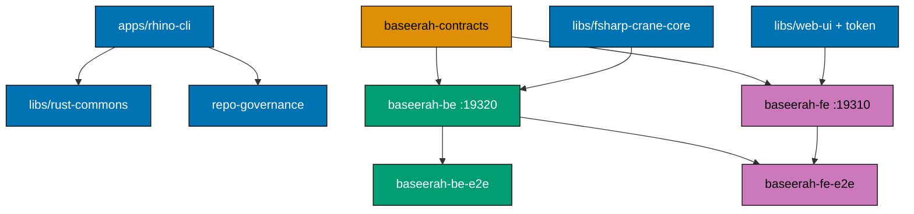

# Tech Docs — Baseerah Repo Reset

Technical documentation for the [Baseerah Repo Reset](./README.md) plan.

## Current State

`/Users/wkf/ose-projects/baseerah` is a byte-for-byte clone of `ose-public` with `origin` re-pointed
to `git@github.com:wahidyankf/baseerah.git`. Only `origin/main` exists — none of the `prod-*` or
`stag-*` deploy branches were fetched, so no deploy target is at risk during the purge.

Nx 22.5.4, `workspaces: ["apps/*", "libs/*"]`, `"generators": {}, "plugins": []` — **there are no Nx
generators in this workspace**. Every project is registered by a hand-authored `project.json` whose
`name` matches its folder. New apps are therefore created by copying and editing an existing
`project.json`, never by `nx g`.

The string `baseerah` does not currently appear anywhere in the repository. Every `baseerah-*` name
in this plan is genuinely new, not a rename.

## Target State



**Diagram description**: blue nodes are kept, orange is the shared contract, green is the backend
pair, pink is the frontend pair. `apps/rhino-cli` (kept, with its own `specs/apps/rhino/**` tree)
depends on `libs/rust-commons` and validates `repo-governance`. `baseerah-contracts` feeds both
`baseerah-be` and `baseerah-fe`. `libs/fsharp-crane-core` feeds the backend; `libs/web-ui` and
`libs/web-ui-token` feed the frontend. Each app feeds its own E2E suite, and `baseerah-fe-e2e`
additionally depends on `baseerah-be` because it runs against the full local Docker stack.

## Design Decisions

### Decision 1 — Purge the product, keep the harness

**Chosen**: delete 22 apps, their specs, CI, infra, and registrations; keep `rhino-cli`, four libs,
the generic agent fleet, all 31-minus-5 skills, and every layer of `repo-governance/`.

**Rejected — start a clean repo**: would discard ~200 governance files, ~59 agents, 26 skills, a
working polyglot CI harness, and `rhino-cli` itself. The harness is the reason this clone was made.

**Rejected — leave the old apps in place and add Baseerah alongside**: the instruction surface is
auto-loaded into every agent session. Leaving `AGENTS.md` describing eight web properties that do not
ship from this repo poisons every planning decision made here, and CI keeps running 16 workflow files
against nothing.

### Decision 2 — `main-to-origin-main` delivery mode

**Chosen**: work in the primary checkout, commit and push each phase directly to `origin main`.
No worktree, no PR, no PR-Review Maker→Fixer Cycle.

**Rationale**: user directive. It also fits the work — a solo repo with no other consumers, where
~95% of the diff is deletions, and where the PR-review fan-out would spend eight discipline
specialists reviewing `git rm`. The [PRs Open at Delivery Boundaries](../../../repo-governance/conventions/structure/plans.md#prs-open-at-delivery-boundaries-not-every-phase-hard-rule)
rule binds `*-to-pr` modes only; a per-phase commit-and-push cadence is explicitly correct here.

**Consequence — the gate replaces the review.** Because no reviewer sees the diff, each phase gate
runs the full pre-push and CI-equivalent command set locally _before_ the push step, and asserts
per-job CI status after it. Recovery from a bad push is a forward `git revert`, never a force-push
or history rewrite, per [No Destructive Git Operations](../../../repo-governance/development/workflow/no-destructive-git-operations.md).

### Decision 3 — Keep the `@open-sharia-enterprise` npm scope

**Chosen**: `libs/*` keep publishing under `@open-sharia-enterprise/*`; `tsconfig.base.json` paths
are unchanged. Only the root `package.json` `"name"` field changes, to `baseerah`.

**Rationale**: the maintainer's direction is that this repo must remain _aware it is part of the OSE
projects_. The npm scope is the most durable, least ceremonial marker of that membership — it
appears in every import statement in every consuming file. Renaming it would touch
`tsconfig.base.json`, every `libs/*/package.json`, `package-lock.json`, every consumer import, and
every Dockerfile, for zero product benefit.

**Rejected — rename to `@baseerah/*`**: mechanically easy in `tsconfig.base.json` (4 paths) but the
change ripples through the lockfile and every import site, and actively removes the ecosystem signal
the maintainer asked to preserve.

### Decision 4 — Baseerah is a product _within_ the OSE ecosystem

**Chosen**: `repo-governance/vision/open-sharia-enterprise.md` stays **unchanged** as the Layer 0
ecosystem vision. A new `repo-governance/vision/baseerah.md` sits beneath it as the product vision.
`vision/README.md` links both and states the parent/child relationship. `AGENTS.md` names Baseerah
as the repo's product and OSE as its ecosystem.

**Rationale**: direct maintainer instruction. It also keeps Layer 0 intact — every downstream layer
in `repo-governance/` cites the vision, so deleting it would orphan the six-layer hierarchy.

**Rejected — rewrite Layer 0 for Baseerah alone**: would sever the ecosystem link and require
re-justifying every principle that currently traces to the OSE vision.

### Decision 5 — F# / Giraffe backend on :19320, Next.js 16 frontend on :19310

**Chosen stacks** per maintainer selection.

**Port allocation — deliberately outside every OSE band.** The constraint is not merely "free in this
repo" but "unlikely to collide with a sibling OSE repo running at the same time on the same machine."
`ose-public`, `ose-primer`, and `ose-private` are all checked out under `/Users/wkf/ose-projects/`
and can run concurrently. A scan of all three for bound ports (compose `"host:container"` mappings,
`--port` flags, and `EXPOSE` directives) found:

| Band                                            | Occupied by the OSE siblings                                               |
| ----------------------------------------------- | -------------------------------------------------------------------------- |
| `3000–3401`                                     | every frontend: 3000, 3001, 3100, 3101, 3200, 3201, 3202, 3300, 3301, 3401 |
| `8000–8302`                                     | backends and tooling: 8025, 8080, 8081, 8201, 8202, 8302                   |
| `4222–4224`                                     | NATS                                                                       |
| `5432–5438`                                     | Postgres                                                                   |
| `6006`, `6379`                                  | Storybook, Redis                                                           |
| `9090–9411`, `14250`, `14268`, `16686`, `24224` | observability stack                                                        |

Picking `3400` / `8402` — the obvious "next value in the pattern" — would sit **inside** two of those
bands and is exactly what `ose-*` would claim for its own next app. So Baseerah uses a band the OSE
repos do not touch at all:

| App           | Port    |
| ------------- | ------- |
| `baseerah-fe` | `19310` |
| `baseerah-be` | `19320` |

Both are verified absent from all three sibling repos, sit far above every OSE band, and stay well
below the macOS ephemeral floor of `49152` (`net.inet.ip.portrange.first`), so neither can be
transiently stolen by an outbound socket.

**There is no formal port registry in this repo** — allocation is documented only in
`docs/reference/monorepo-structure.md`. Phase 3 rewrites that file, and the rewrite records the
19310/19320 allocation together with the reasoning above, so a future app does not re-derive it.

**Consequence**: the .NET toolchain stays. `.config/dotnet-tools.json`, the `dotnet` job in
`main-ci.yml`, the `.NET quality gate` job in `pr-quality-gate.yml`, `fantomas`, `fsharplint`, and
the G-Research analyzers are all **kept**, contrary to what a "delete all F# apps" reading of Phase 2
would suggest. Between Phase 2 (crane-cli deleted) and Phase 6 (`baseerah-be` created) the `dotnet`
job runs `nx run-many` over zero projects and passes trivially — that is fine and expected.

**Consequence**: `open-sharia-enterprise.sln` contains **only** `crane-cli` projects, so it is deleted
wholesale in Phase 2 and a fresh `baseerah.sln` is created in Phase 6 registering
`BaseerahBe.fsproj`, `BaseerahBe.UnitTests.fsproj`, and `BaseerahBe.IntegrationTests.fsproj`.

### Decision 6 — Amend the naming vocabularies _before_ using them

Two vocabulary tables must be amended before any file is named against them, because both
conventions state that new values are added by updating the convention first:

1. **App-naming tier** — `AGENTS.md` documents `[domain]-www`, `[domain]-app-web`, `[domain]-be`.
   `baseerah-fe` is a new `[domain]-fe` tier: _the product web client when there is no separate
   marketing site_. Added in Phase 4, before Phase 8 creates the app.
2. **Nx `domain:` tag vocabulary** — `repo-governance/development/infra/nx-targets.md` enumerates
   `{ayokoding|crane|ose|organiclever|wahidyankf|tooling|ui}`. Phase 3 removes the dead values and
   Phase 5 adds `baseerah`, before the first `project.json` carrying `domain:baseerah` is authored.

Doing this in the reverse order would make every new `project.json` a governance violation at the
moment it is written.

### Decision 7 — Ship `baseerah-contracts` despite the small slice

**Chosen**: create `specs/apps/baseerah/containers/contracts/` with an OpenAPI 3.1 document and a
`project.json` registering a fifth Nx project, `baseerah-contracts`, with a `bundle` target.
`baseerah-be:codegen` and `baseerah-fe:codegen` both `dependsOn: ["baseerah-contracts:bundle"]`.

**Rationale**: both existing BE pairs do this, `_reusable-*` workflows assume a `contracts-project`
input, and the whole `codegen → typecheck → build` dependency chain in `nx-targets.md` is written
around it. Skipping it would make `baseerah-be` structurally unlike every other backend in the repo
and would need re-adding — with a migration — the first time the API grows.

**Cost accepted**: four endpoints do not need generated models. The value is structural conformance,
not immediate type safety.

### Decision 8 — Hello world, and therefore no state at all

**Chosen**: the four `baseerah-*` apps implement **hello world** and nothing else — `GET
/api/v1/health`, `GET /api/v1/hello`, a 404 handler, and one page that renders the greeting. There
is no database, no in-memory collection, and no state of any kind. The greeting is a constant. All
three routes are `GET`, so no request-body validation exists either.

**Rationale**: maintainer directive, and it is the right call for a plan whose subject is repository
structure. Any real feature — even a small one — smuggles product decisions into this plan: what a
note _is_, whether it persists, whether storage is relational or document or local-first PGlite (the
last of which `organiclever-www` used). Those decisions deserve their own plan and their own
grilling. Hello world defers all of them at the cost of nothing, because every line of it is
expected to be replaced.

**Consequence — statelessness removes an entire class of test infrastructure.** With no state:

- There is no `docker-compose.integration.yml` database service, no `db/migrations/`, and no
  `DatabaseBootTests` suite.
- There is **no test-reset hook and no `BASEERAH_BE_ENABLE_TEST_HOOKS` flag**. A stateless service
  cannot leak state between E2E scenarios, so no isolation mechanism is needed and none is built.
  Neither E2E suite needs a `Background` that resets anything.
- `baseerah-be:test:integration` is a real target, but it exercises host boot and route wiring only.
  It stays `cache: false` per convention.

**Consequence — the greeting is fetched, not hardcoded.** `baseerah-fe` reads the greeting text from
`baseerah-be` rather than embedding it. That single choice is what makes `baseerah-fe-e2e` a genuine
full-stack test rather than a static-render check, and it is the only reason the quad proves
anything at all.

### Decision 9 — No DDD bounded-context layering yet

**Chosen**: `baseerah-fe/src/` is flat (`app/`, `components/`, `lib/`) and carries no
`eslint-plugin-boundaries` configuration. `baseerah-be/src/BaseerahBe/` is flat
(`Program.fs`, `WebApp.fs`, `Domain/`, `Api/`) with no `Contexts/` directory.

**Rationale**: `ose-app-web`'s four-layer `src/contexts/<ctx>/{domain,application,infrastructure,presentation}`
structure with error-severity boundary linting earns its keep at three or more contexts. At one, it
is ceremony that makes every file twice as far from every other file.

**Trigger for revisiting**: the moment a second bounded context is introduced (the first plausible
one being "assistant"), a plan adopts the layering and adds
`eslint-plugin-boundaries` before the second context's first file.

### Decision 10 — Delete `plans/done/`, keep `ose-public` as the archive

**Chosen**: delete all 174 `plans/done/` folders, plus the app-specific entries in `plans/backlog/`
and `plans/ideas/`, plus both current `plans/in-progress/` plans (`ayokoding-learning-path-04-course-authoring`
and `vercel-function-cost-reduction` — both die with `ayokoding-www`).

**Rationale**: `plans/done/` is by far the largest source of stale-name grep hits (the top four files
by `open-sharia-enterprise` occurrence count are all in `plans/done/`), and every one of those plans
is history for a product this repo no longer contains. `ose-public` remains untouched and is the
authoritative archive.

**Safety**: Phase 3 records the upstream `ose-public` commit SHA in
`evidence/phase-3-upstream-archive.txt` before deleting, so the archive is addressable. Generic
`plans/ideas/` two-pagers about tooling and governance are **kept** and triaged individually, not
bulk-deleted.

### Decision 11 — Resolve the coverage-threshold drift at 90% line

The repo currently disagrees with itself: `nx-targets.md` says ≥90% line;
`docs/reference/code-coverage.md` tabulates 95% for backends and 70–80% for web apps; the actual
`project.json` files pass `/p:Threshold=80` (F# backends) and `--coverage.thresholds.lines=88`
(`ose-app-web`, whose own `vitest.config.ts` says 70).

**Chosen**: the new projects use **90% line**, matching the governance rule, and Phase 5 rewrites
`docs/reference/code-coverage.md` to a single table listing only the surviving projects at their
actual enforced numbers. The drift is recorded in `learnings.md` because it is a governance defect
that outlived the apps that caused it.

### Decision 12 — Delete the OSE↔AyoKoding separation machinery

`docs-software-engineering-separation-checker`, `docs-software-engineering-separation-fixer`, and the
`docs-validating-software-engineering-separation` skill exist to enforce non-duplication between
`docs/explanation/software-engineering/` and AyoKoding's educational content. With `ayokoding-www`
gone the doctrine has no second side and the agents would validate a rule that cannot be violated.

**Kept**: all 168 files under `docs/explanation/software-engineering/`. They are generic engineering
reference and the `swe-*` agents and skills cite them directly.

### Decision 13 — Governance principles stay identical to `ose-*`

**Chosen**: `repo-governance/principles/**` (16 files across `general/`, `content/`, and
`software-engineering/`) is **preserved byte-identical** to `ose-public`. Not rewritten, not
rebranded, not pruned — Baseerah inherits the same principles as every other OSE-family repo.

The same inheritance holds, one layer weaker, for the rest of the hierarchy: `conventions/` (57),
`development/` (87), and `workflows/` (40) keep their **rules** unchanged and change only where a
file names a deleted app. `repository-governance-architecture.md` keeps its six-layer model verbatim.
The only structural governance changes this plan makes are the four already itemised elsewhere:

1. delete `repo-governance/workflows/ayokoding-web/` (app-specific, 6 files)
2. delete `repo-governance/conventions/linking/internal-ayokoding-references.md` (app-specific)
3. add `[domain]-fe` to the app-naming tier and `baseerah` to the `domain:` tag vocabulary
   (Decision 6)
4. add `repo-governance/vision/baseerah.md` beneath the unchanged OSE vision (Decision 4)

**Rationale**: direct maintainer instruction — _"make sure we have the same principles as `ose-_`"\*.
Principles are Layer 1, the layer every convention and practice traces back to. Divergence there
would silently fork every downstream rule and make governance fixes uncopyable between the sibling
repos.

**Verification**: this is not an aspiration but a checked invariant. Phase 3's gate runs a diff of
`repo-governance/principles/` against the upstream `ose-public` checkout and requires zero
differences:

```bash
diff -r /Users/wkf/ose-projects/ose-public/repo-governance/principles \
        /Users/wkf/ose-projects/baseerah/repo-governance/principles
```

Phase 11 re-runs the same diff as a final assertion, so nothing in Phases 4–10 drifts it. If a
principle ever _should_ diverge, that is its own plan with its own rationale — never a side effect
of this one.

### Decision 14 — `rhino-cli` byte-identity does not bind this repo

`AGENTS.md` currently states `apps/rhino-cli` must be byte-identical across `ose-public`,
`ose-primer`, and `ose-private`. `baseerah` is a **fourth** clone that is not in that parity loop,
and Phase 3 makes real source edits to `rhino-cli`:

| File                                                                                                        | Change                                                                                                                       |
| ----------------------------------------------------------------------------------------------------------- | ---------------------------------------------------------------------------------------------------------------------------- |
| `src/commands/specs_validate_counts.rs`                                                                     | default areas `["organiclever","ose"]` → `["baseerah"]`                                                                      |
| `src/application/repo_governance/frontmatter_audit.rs`                                                      | allowlist `apps/ayokoding-www/`, `apps/ose-www/`, `apps/organiclever-app-web/`, `apps/wahidyankf-www/` → `apps/baseerah-fe/` |
| `src/commands/md_validate_links.rs`, `md_validate_heading_hierarchy.rs`, `specs_coverage.rs`, `env_init.rs` | test fixtures and doc comments naming removed apps                                                                           |

Phase 4 therefore rewrites the byte-identity clause in `AGENTS.md` to state that this repo is
**outside** the parity loop and that `rhino-cli` here is a fork. Doing the source edits before that
clarification would violate the repo's own stated rule.

Every `rhino-cli` change lands under strict TDD with companion Gherkin in
`specs/apps/rhino/behavior/rhino-cli/gherkin/**`, per the repo's
[Specs & Gherkin Completeness](../../../repo-governance/development/quality/feature-change-completeness.md)
rule.

### Decision 15 — CI/CD architecture stays consistent with the OSE siblings

The CI cleanup must not invent a new CI design. A survey of `.github/` across all four repos shows
the siblings do **not** share an identical file list — and understanding _what_ they do share is what
makes "consistent with `ose-*`" a checkable claim rather than a slogan.

**What is genuinely invariant across `ose-public`, `ose-primer`, and `ose-private`:**

1. **Four core workflows, present in every repo**: `main-ci.yml` (CRON, 4×/day), `pr-quality-gate.yml`,
   `deps-audit.yml`, `validate-env.yml`.
2. **A common non-language job set** inside those two gates, in the same order:

   | Workflow              | Invariant jobs                                                                                                                                                                                                                                                     |
   | --------------------- | ------------------------------------------------------------------------------------------------------------------------------------------------------------------------------------------------------------------------------------------------------------------ |
   | `main-ci.yml`         | `schedule`, `shellcheck`, `hadolint`, `actionlint`, `compat-min-version`, `markdown-per-file`, `naming`, `instruction-size`, `specs-gate`, `env-validate`, `repo-config-validate`, `md-links`, `readme-index`, `harness-duplication`, `governance`, `quality-gate` |
   | `pr-quality-gate.yml` | `push`, `detect`, `format`, `shellcheck`, `hadolint`, `actionlint`, `compat-min-version`, `markdown`, `naming`, `instruction-size`, `specs-gate`, `repo-config-validate`, `md-links`, `readme-index`, `harness-duplication`, `governance`, `quality-gate`          |

3. **Language jobs track the languages actually present**, and only those. `ose-public` runs
   `typescript`, `dotnet`, `rust`; `ose-primer` adds `golang`, `jvm`, `python`, `elixir`, `clojure`,
   `dart` for its polyglot demos; `ose-private` drops `dotnet` and adds `iac-lint`.
4. **The reusable-template pattern**: thin per-app caller workflows delegating to parameterised
   `_reusable-*.yml` templates. The _pattern_ is shared; the _template set_ is per-repo
   (`ose-public` has app/www/be-deploy shapes, `ose-primer` has per-concern backend/frontend shapes,
   `ose-private` has none at all).
5. **The composite actions** `setup-node`, `setup-rust`, `setup-docker-cache`, and `setup-playwright`
   in every repo, plus `setup-dotnet` wherever .NET is present.
6. **The gate rule** from `nx-targets.md`: `(pre-commit ∪ pre-push) == PR gate == main gate`, with
   `test:integration` and `test:e2e` CRON-only.

**What this plan therefore does:**

- **Changes nothing** in `main-ci.yml`'s or `pr-quality-gate.yml`'s job set. Baseerah's language set
  is TypeScript, F#, and Rust — byte-identical to `ose-public`'s — so `typescript`, `dotnet`, and
  `rust` all **stay**. This is the same conclusion Decision 5 reaches from the toolchain side, and
  it is why the "delete the `dotnet` job once the F# apps are gone" instinct is wrong.
- **Keeps three of the four reusable templates.** `_reusable-app-test-local-deploy-stag.yml`,
  `_reusable-app-test-stag.yml`, and `_reusable-be-build-deploy.yml` are fully parameterised, name no
  app, and map exactly onto Baseerah's `fe` + `be` app group. Only
  `_reusable-www-test-local-deploy.yml` is deleted, because Baseerah has no `-www` tier for it to
  serve.
- **Deletes only the 12 per-app callers** plus the app-specific job bodies inside
  `publish-images.yml`, and re-adds Baseerah callers with the same shape in Phases 7 and 9.

**Verification** — Phase 1's gate diffs the invariant surface against the upstream sibling rather
than eyeballing it:

```bash
diff -r /Users/wkf/ose-projects/ose-public/.github/actions \
        /Users/wkf/ose-projects/baseerah/.github/actions
diff <(rg -oN '^  [a-z0-9-]+:$' /Users/wkf/ose-projects/ose-public/.github/workflows/main-ci.yml) \
     <(rg -oN '^  [a-z0-9-]+:$' /Users/wkf/ose-projects/baseerah/.github/workflows/main-ci.yml)
```

Both must produce no output. Phase 11 re-runs them as a final assertion.

## Mechanics — Ordering Constraints That Are Not Optional

These four constraints dictate the phase order. Violating any of them produces a red gate, not a
merely-untidy diff.

1. **CI callers die before their targets.** `_reusable-www-test-local-deploy.yml` derives
   `infra/dev/${app-name}/docker-compose.yml`. Deleting `infra/` while a caller workflow still
   references it leaves a workflow that `actionlint` accepts but that fails at run time. Phase 1
   deletes callers and templates; Phase 2 deletes `infra/`.

2. **Spec trees and `repo-config.yml` entries must land in one commit.** `rhino-cli`'s
   `specs:structure-validation` cross-checks `coverage.projects[].specs` globs against the real
   `specs/` tree, and the check runs in the **pre-commit** staged gate. Deleting `specs/apps/ose/`
   in one commit and its `repo-config.yml` entry in the next means the first commit cannot be made.

3. **Markdown-lint excludes are dropped only after the excluded content is gone.**
   `package.json` lint-staged, `.husky/pre-push`, `main-ci.yml`, and `pr-quality-gate.yml` all carry
   `--exclude apps/ayokoding-www/content` / `--exclude apps/ose-www/content` on
   `md links validate` and `md mermaid validate`. Removing the exclude while ~2,068 content pages
   still exist turns a passing gate red. Phase 2 deletes content and excludes together.

4. **No `repo-config.yml` list may become empty.** `coverage.projects` keeps its `rhino-cli` entry
   throughout, so the list is never zero-length. `specs.ddd-areas`, `specs.domain-areas`,
   `env-contract.surfaces`, and `env-injection.apps` _do_ go empty in Phase 2 — Phase 2's first step
   reads the schema in `apps/rhino-cli/src/**/repo_config` to confirm an empty list validates, and
   if it does not, the step removes the key entirely rather than leaving `[]`.

## File-Impact Analysis

### Deleted

| Path                                                                                                                                                        | Notes                                                                                                                  |
| ----------------------------------------------------------------------------------------------------------------------------------------------------------- | ---------------------------------------------------------------------------------------------------------------------- |
| `apps/{ayokoding-cli,ayokoding-www,ayokoding-www-be-e2e,ayokoding-www-fe-e2e}`                                                                              | 4                                                                                                                      |
| `apps/{crane-cli,ose-cli}`                                                                                                                                  | 2                                                                                                                      |
| `apps/{organiclever-app-web,organiclever-app-web-e2e,organiclever-be,organiclever-be-e2e,organiclever-www,organiclever-www-be-e2e,organiclever-www-fe-e2e}` | 7                                                                                                                      |
| `apps/{ose-app-web,ose-app-web-e2e,ose-be,ose-be-e2e,ose-www,ose-www-be-e2e,ose-www-fe-e2e}`                                                                | 7                                                                                                                      |
| `apps/{wahidyankf-www,wahidyankf-www-fe-e2e}`                                                                                                               | 2                                                                                                                      |
| `specs/apps/{ayokoding,crane,organiclever,ose,wahidyankf}`                                                                                                  | includes the `ose-contracts` and `organiclever-contracts` `project.json` files, which live inside `specs/` not `apps/` |
| `infra/`                                                                                                                                                    | all 21 files, recreated as `infra/dev/baseerah-app/` in Phase 7                                                        |
| `.github/workflows/` — 12 per-app + 4 `_reusable-*` + `publish-images.yml`                                                                                  | 17 of ~22 files                                                                                                        |
| `open-sharia-enterprise.sln`                                                                                                                                | contains only `crane-cli` projects                                                                                     |
| `.claude/agents/` — 29 app-scoped + 2 separation agents                                                                                                     | mirrors regenerate, never hand-edited                                                                                  |
| `.claude/skills/` — 3 app-scoped + `docs-validating-software-engineering-separation`                                                                        | 4 directories                                                                                                          |
| `repo-governance/workflows/ayokoding-web/`                                                                                                                  | 6 files, ~113 KB                                                                                                       |
| `repo-governance/conventions/linking/internal-ayokoding-references.md`                                                                                      | 1                                                                                                                      |
| `generated-socials/`                                                                                                                                        | 34 OSE weekly LinkedIn update posts plus its `README.md`                                                               |
| `.claude/agents/social-linkedin-post-maker.md`                                                                                                              | its sole output home was `generated-socials/`, and its charter is the OSE tri-repo family this repo is not part of     |
| `plans/done/` (174), app-specific `plans/backlog/` (5), both `plans/in-progress/`                                                                           | see Decision 10                                                                                                        |
| `.config/dotnet-tools.json`                                                                                                                                 | **NOT deleted** — kept for `baseerah-be` (Decision 5)                                                                  |

### Rewritten

`README.md`, `ROADMAP.md`, `AGENTS.md`, `CONTRIBUTING.md`, `SECURITY.md`, `LICENSING-NOTICE.md`,
`package.json`, `repo-config.yml`, `.github/workflows/README.md`, `.husky/pre-push`,
`.prettierignore`, `.dockerignore`, `.gitignore`, `.vscode/settings.json`, `specs/README.md`,
`apps/README.md`, `libs/README.md`, `docs/reference/{monorepo-structure,nx-configuration,code-coverage,related-repositories,project-dependency-graph}.md`,
`docs/reference/system-architecture/**`, `docs/metadata/external-links-status.yaml`,
`repo-governance/development/infra/nx-targets.md`, `repo-governance/vision/README.md`,
`.claude/skills/swe-developing-frontend-ui/reference/brand-context.md`, and ~20 further
`repo-governance/` prose files that name removed apps.

`CLAUDE.md` is nearly identity-free and needs only its agent-roster references refreshed.

### Created

| Path                                                               | Contents                                                                                                                                                                                                                                               |
| ------------------------------------------------------------------ | ------------------------------------------------------------------------------------------------------------------------------------------------------------------------------------------------------------------------------------------------------ |
| `repo-governance/vision/baseerah.md`                               | Product vision beneath the OSE ecosystem vision                                                                                                                                                                                                        |
| `specs/apps/baseerah/`                                             | `product/`, `system-context/`, `containers/`, `components/`, `behavior/` with a `README.md` at every level                                                                                                                                             |
| `specs/apps/baseerah/containers/contracts/`                        | `openapi.yaml` + `project.json` (`baseerah-contracts`)                                                                                                                                                                                                 |
| `specs/apps/baseerah/behavior/baseerah-be/gherkin/{health,hello}/` | US-4's feature files                                                                                                                                                                                                                                   |
| `specs/apps/baseerah/behavior/baseerah-fe/gherkin/{hello}/`        | US-5's feature files                                                                                                                                                                                                                                   |
| `apps/baseerah-be/`                                                | F# / Giraffe, modelled on `apps/organiclever-be` minus the database                                                                                                                                                                                    |
| `apps/baseerah-be-e2e/`                                            | playwright-bdd, modelled on `apps/ose-be-e2e`                                                                                                                                                                                                          |
| `apps/baseerah-fe/`                                                | Next.js 16 App Router, modelled on `apps/ose-app-web` minus DDD boundaries                                                                                                                                                                             |
| `apps/baseerah-fe-e2e/`                                            | Playwright + `@axe-core/playwright`, modelled on `apps/ose-app-web-e2e`                                                                                                                                                                                |
| `infra/dev/baseerah-app/`                                          | `docker-compose.yml`, `docker-compose.ci.yml`, `Dockerfile.be.dev`, `Dockerfile.fe.dev`, `README.md`, `.gitignore` — modelled on `infra/dev/organiclever-app/`, **not** `infra/dev/ose-app/`, which is stale and points at a non-existent Rust backend |
| `baseerah.sln`                                                     | Registers the three `BaseerahBe*` `.fsproj` files                                                                                                                                                                                                      |
| `.claude/agents/apps-baseerah-fe-content-{maker,checker,fixer}.md` | Content maker-checker-fixer triad                                                                                                                                                                                                                      |
| `.claude/agents/apps-baseerah-{fe,be}-deployer.md`                 | Deployers                                                                                                                                                                                                                                              |
| `.claude/skills/apps-baseerah-fe-developing-content/SKILL.md`      | Frontend content skill                                                                                                                                                                                                                                 |

### Nx target contract for the four new projects

Every project declares the **mandatory six** (`test:unit`, `test:integration`, `test:e2e`,
`test:quick`, `lint`, `typecheck`) — `echo 'no-op: target not applicable for this project'` where
inapplicable, never omitted. `lint` is the one target that may never be an echo. `test:quick` is
`nx:run-commands` with `"parallel": false` in the exact order `typecheck → lint → test:unit →
test:coverage → test:specs`. Every project declares `namedInputs.specs` pointing at its Gherkin glob
and references it as `"specs"` rather than inlining the glob. Tags carry all four dimensions.

| Project              | `type:` | `platform:`  | `lang:`  | `domain:`  | Real targets beyond the six                                                                                                            |
| -------------------- | ------- | ------------ | -------- | ---------- | -------------------------------------------------------------------------------------------------------------------------------------- |
| `baseerah-contracts` | `lib`   | —            | `ts`     | `baseerah` | `bundle`, `docs`                                                                                                                       |
| `baseerah-be`        | `app`   | `giraffe`    | `fsharp` | `baseerah` | `codegen`, `build`, `dev`, `run`, `test:coverage`, `specs:behavior:coverage`, `specs:structure-validation`, `test:specs`, `deps:audit` |
| `baseerah-be-e2e`    | `e2e`   | `playwright` | `ts`     | `baseerah` | `install`, `test:e2e:ui`, `test:e2e:report`, `specs:e2e:coverage`, `test:specs`                                                        |
| `baseerah-fe`        | `app`   | `nextjs`     | `ts`     | `baseerah` | `codegen`, `build`, `dev`, `start`, `test:coverage`, `specs:behavior:coverage`, `test:specs`                                           |
| `baseerah-fe-e2e`    | `e2e`   | `playwright` | `ts`     | `baseerah` | `install`, `test:e2e:ui`, `test:e2e:report`, `specs:e2e:coverage`, `test:specs`                                                        |

`test:integration` and `test:e2e` stay `cache: false` and are CRON-only — never wired into pre-push,
per the gate rule `(pre-commit ∪ pre-push) == PR gate == main gate`.

## Dependencies

**External**: none new beyond what `npm run doctor -- --fix` already converges — .NET SDK 10,
Rust toolchain, Node 24.16.0 / npm 11.11.0 via Volta, Playwright browsers, shellcheck, hadolint,
actionlint, fantomas.

**Internal**: `baseerah-be` → `libs/fsharp-crane-core` (**conditional**, see below);
`baseerah-fe` → `libs/web-ui`, `libs/web-ui-token`; both → `baseerah-contracts`; all →
`rhino-cli` as an `implicitDependency` for spec validation.

**`libs/fsharp-crane-core` is conditional.** It was built for `crane-cli`, which Phase 2 deletes.
Phase 2 audits it: if its modules are genuinely generic F# utilities, it stays and `baseerah-be`
references it; if it is crane-specific, Phase 2 deletes it and its spec tree and `baseerah-be`
scaffolds without it. The audit's verdict is recorded in `evidence/phase-2-fsharp-crane-core-audit.md`
and both branches are spelled out in `delivery.md`.

## Risks and Mitigations

| Risk                                                                                               | Severity | Mitigation                                                                                                                                                                    |
| -------------------------------------------------------------------------------------------------- | -------- | ----------------------------------------------------------------------------------------------------------------------------------------------------------------------------- |
| Emptying a `repo-config.yml` list fails schema validation and blocks every subsequent commit       | High     | Phase 2 step 1 reads the schema first and removes keys rather than leaving `[]` if empty lists are rejected (Mechanics 4)                                                     |
| `rhino-cli` edits break `generate:bindings`, which every later phase depends on                    | High     | TDD with companion Gherkin; Phase 3's gate runs `generate:bindings` + `validate:sync` + `harness:bindings-validation` end to end                                              |
| A direct push lands red on `origin/main` with no reviewer to catch it                              | High     | Every phase gate runs the pre-push command set locally before the push item, then asserts per-job CI status with `gh run view --json jobs`                                    |
| Deleting `specs/apps/ose/` orphans the `ose-contracts` Nx project that lives inside it             | Medium   | Called out explicitly in the deletion table; `nx show projects` in the Phase 2 gate catches any survivor                                                                      |
| `_reusable-*` workflow templates are deleted while a caller still references them                  | Medium   | Phase 1 deletes callers and templates in one commit and its gate runs `actionlint` over the whole `.github/` tree                                                             |
| The `dotnet` CI job fails on zero projects between Phases 2 and 6                                  | Medium   | Phase 2's gate explicitly asserts the `dotnet` job's status is `success`, not merely that the run concluded                                                                   |
| `libs/web-ui` primitives carry OrganicLever/OSE brand assumptions into Baseerah's UI               | Medium   | Phase 4 rebrands `libs/web-ui-token` and `brand-context.md`; `web-ui` component APIs are brand-neutral                                                                        |
| Governance prose still naming removed apps survives the sweep                                      | Medium   | Phase 3's gate is an `rg` sweep with a zero-hit acceptance criterion, not a manual read                                                                                       |
| `plans/done/` deletion loses decisions that were never written down elsewhere                      | Medium   | Upstream SHA recorded in `evidence/` first; `ose-public` untouched                                                                                                            |
| Hello world under-exercises the quad, so a wiring defect stays hidden until the first real feature | Medium   | The greeting is fetched from `baseerah-be` rather than hardcoded in `baseerah-fe`, so `baseerah-fe-e2e` traverses the full FE → BE path against the Docker stack (Decision 8) |

## Rollback

Each phase is one commit (or a small named series) pushed to `origin main`. Rollback is a forward
`git revert` of that commit range — never `reset --hard`, never a force-push, never `filter-branch`,
per [No Destructive Git Operations](../../../repo-governance/development/workflow/no-destructive-git-operations.md).

Phase-specific notes:

- **Phases 1–3 (deletions)** revert cleanly; the deleted content returns from git history.
- **Phase 3's `rhino-cli` source edits** are the only place a revert could leave a half-state, since
  `generate:bindings` outputs are committed. Reverting the source commit and re-running
  `npm run generate:bindings && git add -A` restores consistency; the gate command
  `npm run validate:sync` confirms it.
- **Phases 5–9 (creations)** revert by deleting the added directories and their `repo-config.yml`
  registrations in one commit — the same atomicity rule as Mechanics 2, in reverse.
- **The whole plan** is recoverable at any point by resetting the working tree to the pre-Phase-1
  commit recorded in `evidence/phase-0-baseline.txt` and force-pushing — which is **explicitly not
  authorised** here and would require the maintainer's direct instruction.
