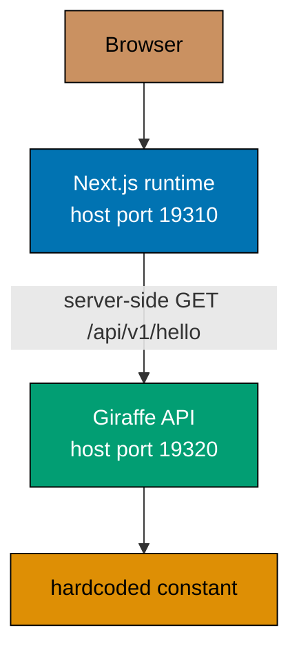
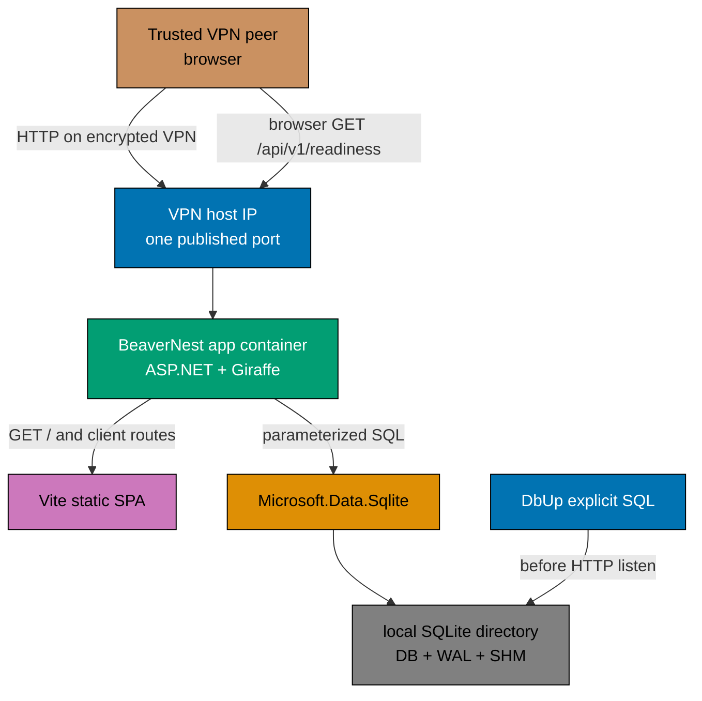
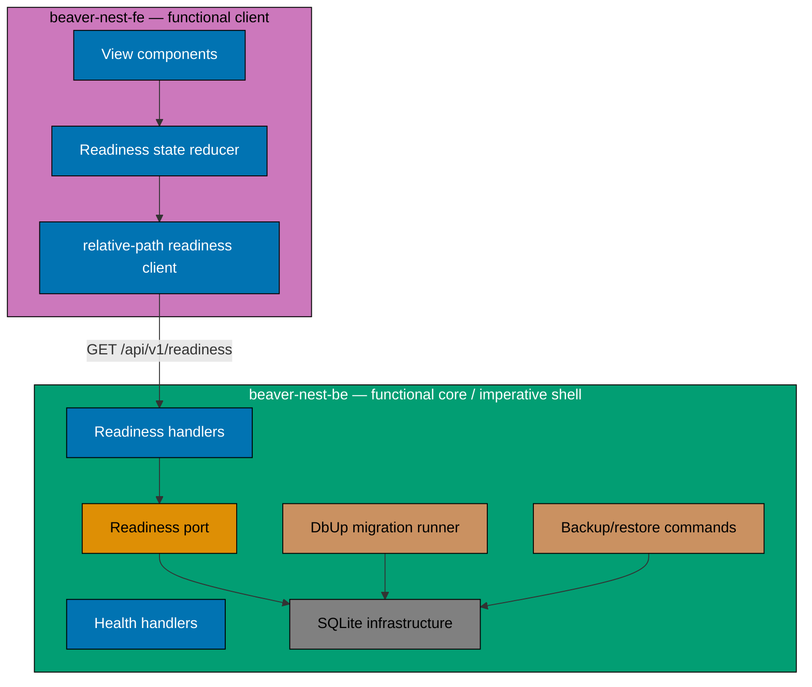

# Technical Documentation — BeaverNest App Setup

## Current Architecture

[Repo-grounded] The current frontend is a Next.js 16 App Router application. Its root page is an
async Server Component with `dynamic = "force-dynamic"`; `fetchGreeting()` runs in the Node process
against a server-only Docker hostname. The browser therefore does not perform the API request.

[Repo-grounded] The F#/Giraffe backend registers only Giraffe, serves liveness and greeting GET
routes, binds all container interfaces, and has no persistence dependency. Its README advertises a
CORS variable that the program does not consume.

[Repo-grounded] The development Compose stack publishes both services to all host interfaces when
no host IP is supplied. Its destructive restart command uses `docker compose down -v`, which is not
acceptable once durable personal data exists.



## Target Architecture

[Judgment call] Build `beaver-nest-fe` as a Vite/React SPA. During production image construction, copy
its immutable build output into a dedicated static-content directory in the backend image.
ASP.NET/Giraffe serves static files, API endpoints, an API-specific JSON catch-all, and finally the
SPA fallback from one process and one origin.

[Judgment call] One SQLite file has one long-running writable BeaverNest application process on one
host. Narrowly scoped backup, restore, and integrity one-shot processes on that same host are the
only exception. Its entire directory is bind-mounted from an operator-owned path outside the
repository. VPN clients never open the database and no network filesystem is supported.



### Request Routing Order

1. Apply one global security-header middleware before API, static-file, error, and fallback routes.
2. Map known `/api/v1/*` endpoints.
3. Map `/api/{**path}` to the existing JSON error envelope.
4. Serve only the dedicated Vite static directory; directory browsing stays disabled.
5. Return a real 404 for missing `/assets/*` files.
6. Register `index.html` fallback last for GET/HEAD non-file client routes.

[Web-cited] Microsoft documents `MapFallbackToFile` as a lowest-priority SPA routing convenience.
Because unmatched API GETs are also non-file paths, the API JSON catch-all must precede fallback.
Source: [Microsoft `MapFallbackToFile`](https://learn.microsoft.com/en-us/dotnet/api/microsoft.aspnetcore.builder.staticfilesendpointroutebuilderextensions.mapfallbacktofile?view=aspnetcore-10.0),
accessed 2026-08-02.

## Component Boundaries



## Decision Log

### Decision 1 — Vite SPA, not Next.js

[Judgment call] Replace Next.js with Vite + the official React plugin. Keep the Nx project name
`beaver-nest-fe`; no `beaver-nest-www` exists because there is no promotional site.

[Web-cited] Vite's production build uses `index.html` as its default entry and emits a bundle suited
to static hosting. `server.proxy` is a development-server feature, so production requests use a
relative same-origin `/api` path instead. Sources: [Vite build guide](https://vite.dev/guide/build)
and [Vite server proxy](https://vite.dev/config/server-options.html#server-proxy), accessed
2026-08-02.

Consequences:

- Delete Next-only config, server env validation, Server Components, `.next` outputs, and Node
  production start target.
- Add root `index.html`, `src/main.tsx`, Vite config, React entry/styles, and deterministic `dist/`.
- Keep the Vite dev server on loopback and proxy `/api` to local port `19320` only in development.
- Cache fingerprinted assets; send `Cache-Control: no-cache` for `index.html`.

### Decision 2 — One ASP.NET/Giraffe runtime process

[Judgment call] The backend production image serves both static SPA assets and API routes. This avoids a
second proxy/static-server container while preserving independent frontend source/build/test
projects.

Consequences:

- Backend build/image depends on the frontend production build.
- Development keeps independent Vite and dotnet-watch processes for feedback speed. Host
  development and tests bind the backend to `127.0.0.1` by default; only the container manifest
  explicitly supplies `0.0.0.0`, whose port is then published on the exact configured host address.
  Configuration/unit and rendered-Compose tests prove both manifestations.
- E2E tests exercise the combined production-like endpoint, not Docker service DNS from a browser.
- The backend applies `X-Content-Type-Options: nosniff`,
  `Referrer-Policy: strict-origin-when-cross-origin`, `X-Frame-Options: DENY`, a
  `Permissions-Policy: camera=(), microphone=(), geolocation=()`, and
  `Content-Security-Policy: default-src 'self'; base-uri 'self'; object-src 'none'; frame-ancestors
'none'; script-src 'self'; style-src 'self'; img-src 'self' data:; font-src 'self'; connect-src
'self'` to HTML, assets, successful API responses, JSON errors, and SPA fallback responses.
  Existing Kestrel fingerprint suppression (`AddServerHeader <- false`) remains binding, so no
  response emits `Server`. Automated tests cover every response class and that negative invariant.

### Decision 3 — SQLite for one host and one writer

[Judgment call] SQLite is the production database for this local foundation. It is not a temporary test
substitute for PostgreSQL.

[Web-cited] SQLite WAL supports concurrent readers and one writer and expects all database users on
the same machine. Microsoft recommends a new connection per concurrent operation and finite lock
timeouts. Sources: [SQLite WAL](https://www.sqlite.org/wal.html),
[Microsoft SQLite database errors](https://learn.microsoft.com/en-us/dotnet/standard/data/sqlite/database-errors),
and [Microsoft SQLite connection strings](https://learn.microsoft.com/en-us/dotnet/standard/data/sqlite/connection-strings),
accessed 2026-08-02.

Required settings:

- The database filename is fixed as `beaver-nest.sqlite3`. The backend derives it from the canonical
  in-process data directory; production always resolves to
  `/var/lib/beaver-nest/beaver-nest.sqlite3`. It accepts no arbitrary database-file path.
- Configuration validation resolves the data directory without following a symlink, rejects root,
  home, repository, directory-as-file, and alias paths, and refuses a database file outside that
  directory. Tests use only disposable directories.
- Connection string sets `Foreign Keys=True` and a finite `Default Timeout`.
- Startup executes and verifies `PRAGMA journal_mode=WAL`.
- Do not set `Cache=Shared` with WAL.
- Open one connection per operation and keep write transactions brief.
- Readiness uses a cheap read-only query and migration-journal check; it does not mutate state.
- Busy/locked errors are mapped to a controlled internal result; HTTP exposes no SQL/paths.

### Decision 4 — Infrastructure migration only

[Judgment call] Use `dbup-sqlite` to execute an ordered no-op initialization SQL script and create its
journal. Create no domain table. DbUp runs before the web host accepts requests and aborts startup
on failure.

[Web-cited] DbUp officially provides SQLite support through `dbup-sqlite`; its umbrella `dbup`
package is legacy and is not selected. Sources: [DbUp SQLite repository](https://github.com/DbUp/dbup-sqlite),
[DbUp supported databases](https://dbup.readthedocs.io/en/latest/supported-databases/), and
[NuGet `dbup-sqlite`](https://www.nuget.org/packages/dbup-sqlite/), accessed 2026-08-02.

The migration file follows the repository's timestamp naming convention under
`apps/beaver-nest-be/src/BeaverNestBe/Migrations/` and is embedded/copied deterministically into
build and image outputs. Nx inputs include SQL files so migration changes invalidate cache.

### Decision 5 — No ORM and no premature query builder

[Judgment call] Do not add EF Core, Dapper, or another ORM/micro-ORM. Use `Microsoft.Data.Sqlite` commands
with named parameters at the imperative boundary. A future feature may select a query builder only
when its concrete query composition requires one.

The canonical audit-trail pattern is generalized so its six audit columns and soft-delete
discipline remain binding for future domain tables, while EF Core becomes one optional mapping
manifestation rather than a BeaverNest requirement. SQLite equivalents use UTC ISO-8601 text or
integer epoch only after a concrete domain plan chooses and tests one representation; this
foundation has no audit columns because it has no domain tables.

### Decision 6 — Durable external host directory

[Judgment call] Compose uses a long-form bind mount from an operator-created directory outside the repo
to `/var/lib/beaver-nest`, with `bind.create_host_path: false`. The mount includes the database,
`-wal`, and `-shm` files.

[Web-cited] Docker documents that short bind syntax can create a missing host directory and that
long syntax can disable that behavior. Source:
[Docker Compose services/bind mounts](https://docs.docker.com/reference/compose-file/services/),
accessed 2026-08-02.

The production image creates a stable unprivileged account with UID/GID `10001`, assigns only its
static and application files to that account, sets `USER 10001:10001`, and starts with `umask 0077`.
The operator prepares the data directory for that identity. Startup fails clearly if the directory
is absent, is a symlink, is not writable, or has unsafe ownership/permissions. The database and
backup files are mode `0600`; writable directories are mode `0700`. Ordinary restart/recreate
commands never delete the host directory. Test and E2E databases always use unique disposable
directories and can never point at the operator path.

The host bind source and the in-process data directory are deliberately distinct. Compose reads
`BEAVER_NEST_BE_HOST_DATA_DIRECTORY` on the host and mounts it at the fixed container path
`/var/lib/beaver-nest`; it does not inject the host path into the container. The backend reads only
the container-visible `BEAVER_NEST_BE_DATA_DIRECTORY`, whose production value is the fixed mount
target. This prevents a container process from being configured to access an arbitrary host path.

### Decision 7 — Provider-aware manual backup and recoverable restore

[Judgment call] Add explicit binary subcommands invoked through Compose one-shot profiles. The
long-running service receives only the data bind at `/var/lib/beaver-nest`. Backup and restore
one-shot services additionally receive a distinct operator-owned backup bind at
`/var/backups/beaver-nest`; the long-running service cannot write that separately writable path.

- `backup --name <new-file-name>` opens source and destination SQLite connections and calls
  `BackupDatabase` while the application remains online. It rejects paths, symlinks, an existing
  destination, and any source/destination identity collision.
- `restore --name <existing-file-name>` is parsed and executed before migration or web-host startup;
  it never opens an HTTP listener. The operations wrapper refuses to run it while the long-running
  application service is active, validates the backup-only source, rejects symlinks and
  source/destination identity collisions,
  checkpoints/removes stale WAL companions safely, and moves the replaced database to a timestamped
  recoverable sibling before installing the restored copy.
- Validation runs both `PRAGMA integrity_check` and `PRAGMA foreign_key_check`.
- The wrapper owns an atomic operation lock under the data directory: backup and integrity acquire it
  before starting; restore acquires it only after proving the service is stopped. A concurrent
  one-shot or an active-service restore fails closed rather than relying on operator timing.

[Web-cited] Microsoft supports online backup with `SqliteConnection.BackupDatabase`; it briefly
blocks writers. SQLite warns that copying only the main database while WAL is active can omit
committed transactions. Sources:
[Microsoft SQLite backup](https://learn.microsoft.com/en-us/dotnet/standard/data/sqlite/backup) and
[SQLite WAL](https://www.sqlite.org/wal.html), accessed 2026-08-02.

No automatic scheduler or retention policy is included. A second directory on the same disk does
not protect against host/disk loss. The operator procedure therefore requires copying or directly
placing a validated backup on operator-designated independent/off-host storage and records that
attestation; BeaverNest cannot infer that two paths are independent storage.

### Decision 8 — VPN-bound HTTP publication

[Judgment call] Kestrel listens on all interfaces inside the container. Compose publishes the one
application port only on `${BEAVER_NEST_BE_VPN_HOST_IP}`. The operator must supply a host address
that exists on an already configured encrypted VPN interface.

[Web-cited] Compose binds all host interfaces when `host_ip` is omitted; Kestrel `0.0.0.0` means all
container IPv4 interfaces. Sources: [Docker Compose ports](https://docs.docker.com/reference/compose-file/services/#ports)
and [Kestrel endpoints](https://learn.microsoft.com/en-us/aspnet/core/fundamentals/servers/kestrel?view=aspnetcore-10.0),
accessed 2026-08-02.

[Web-cited] Docker Desktop routes published ports through its host backend on macOS, while native
Docker Engine uses the host networking stack. The plan supports both Linux and macOS Docker only
when a disposable Phase 0 publication probe proves that the exact supplied address (not a wildcard)
is retained by that runtime. Docker host networking is not used to achieve this. Sources:
[Docker Desktop networking](https://docs.docker.com/desktop/features/networking/) and
[Docker port publishing](https://docs.docker.com/engine/network/port-publishing/), accessed
2026-08-02.

Required controls:

- A preflight command rejects a missing or non-local host IP.
- Phase 0 runs an address-publication capability probe against a disposable loopback fixture. Linux
  uses a host socket inspection adapter and macOS uses Docker Desktop's host-backend inspection plus
  connection probes. If the selected runtime cannot retain an exact bind, the executor stops before
  implementation and records the unsupported runtime rather than weakening to wildcard publication.
- Compose uses required interpolation for the host IP, so missing/blank input fails during config
  rendering rather than degrading to Docker's wildcard default. A checked-in host wrapper that runs
  preflight before Compose is the only documented production start path.
- No separate backend port is published.
- Socket and rendered-Compose inspection proves no wildcard publication.
- `[AI+HUMAN]` manual verification has the AI provide exact commands and a human run them from an
  actual VPN peer, returning a sanitized reachability attestation.
- Operator docs explain Docker-aware firewall rules because published traffic can bypass ordinary
  host firewall paths.
- Binding an exact host address proves address-scoped publication, not source-peer isolation. Any
  VPN/firewall source ACL remains external infrastructure and is attested separately when present;
  BeaverNest does not claim to provision or verify it.
- HTTP responses disclose no secret, database path, SQL, or exception detail.

### Decision 9 — Shared workspace, no authentication

[Judgment call] Every VPN-admitted peer has equal access. The backend does not trust forwarded identity,
create user records, or attach per-person ownership. This remains consistent with BeaverNest as a
single-tenant personal product while allowing a small trusted group to share one workspace.

Authentication/authorization must be introduced by a later plan before admitting untrusted peers
or storing data requiring peer-to-peer confidentiality.

### Decision 10 — Canonical tests require the real production database

[Judgment call] Replace PostgreSQL-only normative wording in general testing docs with “the app's real
configured production database.” Preserve explicit PostgreSQL and SQLite manifestations rather
than weakening integration tests to mocks or in-memory substitutes.

For BeaverNest:

- Unit: pure logic and ports, no real database.
- Backend integration: unique real SQLite file, direct infrastructure/service calls for migration,
  settings, contention, backup, and restore, plus narrowly scoped in-process real-HTTP readiness
  boundary tests for provider failure/redaction/cache behavior; non-cacheable and no Docker network.
- Frontend integration: in-process MSW contract/error tests, non-cacheable where repository rules
  prescribe.
- E2E: real combined HTTP process plus unique disposable real SQLite directory.

## API Contract

### Retained liveness response

```json
{
  "status": "ok"
}
```

### New readiness success response (`200`)

```json
{
  "status": "ready",
  "components": {
    "database": "ready",
    "schema": "current"
  }
}
```

### New readiness unavailable response (`503`)

```json
{
  "status": "not-ready",
  "components": {
    "database": "unavailable",
    "schema": "unknown"
  }
}
```

Both readiness responses send `Cache-Control: no-store`, emit no `ETag` or `Last-Modified`
validator, and never contain paths, migration names, SQL, driver codes, or exception text.

## Configuration Contract

Committed examples contain placeholders/defaults only; real operator values stay uncommitted and
must not be read or written by agents.

| Name                                              | Purpose                          | Example/default                                      |
| ------------------------------------------------- | -------------------------------- | ---------------------------------------------------- |
| `BEAVER_NEST_BE_VPN_HOST_IP`                      | Compose host publication address | placeholder in `.env.example`; no unsafe default     |
| `BEAVER_NEST_BE_PUBLIC_PORT`                      | Production-facing host port      | `19300`                                              |
| `BEAVER_NEST_BE_HTTP_LISTEN_PORT`                 | Kestrel listen port              | `19300`; local dev explicitly sets `19320`           |
| `BEAVER_NEST_BE_HTTP_LISTEN_ADDRESS`              | Kestrel listen address           | `127.0.0.1`; container explicitly sets `0.0.0.0`     |
| `BEAVER_NEST_BE_SQLITE_BUSY_TIMEOUT_MILLISECONDS` | Finite lock wait                 | `1000`                                               |
| `BEAVER_NEST_BE_DATA_DIRECTORY`                   | In-process SQLite directory      | `/var/lib/beaver-nest`; local tests use `mktemp`     |
| `BEAVER_NEST_BE_HOST_DATA_DIRECTORY`              | Compose host data-bind source    | placeholder in `.env.example`; never injected        |
| `BEAVER_NEST_BE_BACKUP_DIRECTORY`                 | Separate host backup-bind source | placeholder in `.env.example`; no repo-local default |

The committed owner is `apps/beaver-nest-be/.env.example`. CI and automated tests export explicit
sanitized values and unique `mktemp` directories without loading any real `.env*` file. The runtime
documentation assigns actual VPN values and peer execution to the human operator.

Local development deliberately does not consume the production public-port default: Vite serves on
loopback `19310` and proxies to the loopback backend on `19320`. The combined production-like stack
publishes its one exact-address endpoint on `19300` and runs Kestrel internally on `19300`. Tests
assert that one mode cannot silently inherit the other mode's listen/public ports.

Remove the unused wildcard CORS variable. The SPA uses relative URLs and no production CORS policy
is needed.

## File-Impact Analysis

Paths marked **New file/pattern** are creation targets; deletions are explicit.

### Governance and plan lifecycle

- Generalize real-database/ORM wording in:
  - `repo-governance/development/quality/three-level-testing-standard.md`
  - `repo-governance/development/infra/bdd-spec-test-mapping.md`
  - `repo-governance/development/infra/ci-conventions.md`
  - `repo-governance/development/infra/nx-targets.md`
  - `repo-governance/development/pattern/database-audit-trail.md`
  - `repo-governance/development/README.md`
  - `repo-governance/development/quality/README.md`
  - `docs/how-to/add-new-app.md`
- Update `repo-config.yml` and
  `repo-governance/conventions/security/secrets-and-env-standards.md` so the backend example is the
  sole BeaverNest runtime-env owner, Compose/preflight-only keys are intentionally registered, and
  stale Next/Vercel/frontend injection rules no longer apply to BeaverNest.
- Keep `plans/ideas/beaver-nest-persistence-layer.md` as the later first concrete stateful product
  slice; this foundation is only its prerequisite. When this plan archives, repoint that brief's two
  prerequisite links to the actual-date `plans/done/` path in the same final PR.
- **New file/pattern:** `plans/in-progress/beaver-nest-app-setup/execution-state.md`, the durable
  append-only per-phase task, file-touch, command-result, and evidence ledger; maintain and ultimately
  archive it with this plan and its evidence.

### Specs/contracts

- Rewrite `specs/apps/beaver-nest/{README.md,product/README.md,system-context/README.md}`.
- Replace stale C4 stubs in `containers/{README.md,container.md}` and
  `components/{README.md,overview.md}` with current target diagrams/components.
- Remove greeting behavior and add readiness/persistence/routing behavior under
  `specs/apps/beaver-nest/behavior/{beaver-nest-be,beaver-nest-fe}/gherkin/`.
- Update all Gherkin README indexes.
- Edit `specs/apps/beaver-nest/containers/contracts/openapi.yaml`; regenerate its bundled output and
  generated backend/frontend clients.

### Backend

- Edit `apps/beaver-nest-be/src/BeaverNestBe/BeaverNestBe.fsproj` compile order/dependencies.
- **Edit/repurpose:** existing `Domain/Readiness.fs`. **New file/pattern:**
  `Application/ReadinessPort.fs`,
  `Infrastructure/Sqlite/*.fs`, `Infrastructure/Migrations.fs`, `Operations/Database.fs`,
  `Api/ReadinessHandlers.fs`, and `Migrations/{timestamp}_Initialize.sql`.
- Remove `Domain/Greeting.fs` and `Api/GreetingHandlers.fs`.
- Edit `WebApp.fs`, `Program.fs`, `project.json`, `Dockerfile`, `Dockerfile.integration`,
  `docker-compose.integration.yml`, `scripts/run-e2e.sh`, app README, and `.env.example`.
- Replace backend integration Kestrel boot test with direct real-SQLite integration fixtures/tests;
  update F# project compile lists.
- Extend unit/E2E steps/tests and regenerate E2E coverage baseline.

### Frontend

- Edit `apps/beaver-nest-fe/package.json`, root `package-lock.json`, `project.json`, `tsconfig.json`, `Dockerfile`,
  `.dockerignore`, README, and `.env.example`; change its Nx platform tag from `platform:nextjs` to
  the canonical `platform:vite` vocabulary and update that vocabulary where defined. While touching
  the controlled table, also register the backend's real `platform:giraffe`/`lang:fsharp` values or
  normalize both project tags and docs together; do not leave active tags outside the vocabulary.
- Delete `next.config.ts`, `src/env.ts`, the Next-only production start behavior, and current Next
  App Router files/tests under `src/app/`:
  `page.tsx`, `page.test.tsx`, `layout.tsx`, `error.tsx`, `error.test.tsx`, `not-found.tsx`,
  `not-found.test.tsx`, `icon.tsx`, and `globals.css`.
- Delete or replace `src/components/{AppFrame,AppShell}.tsx`,
  `src/lib/{greeting-client,greeting-client.test}.ts`, and
  `src/test/{landing.steps,setup}.ts` as part of the atomic Vite transition.
- Adapt existing `postcss.config.mjs`, `vitest.config.ts`, `oxlint.json`, `tsconfig.json`,
  `Dockerfile`, and `.dockerignore` to the Vite graph.
- Edit `libs/web-ui-token/src/beaver-nest.css` and `libs/web-ui-token/README.md` to remove the
  `next/font` assumption and point BeaverNest token imports at the concrete Vite stylesheet.
- **New file/pattern:** root `index.html`, `vite.config.ts`, `src/theme.ts`, `src/main.tsx`, `src/App.tsx`,
  `src/lib/readiness-client.ts`, `src/lib/readiness-state.ts`, component tests, and
  `src/test/msw/*` integration support.
- Retain/reuse BeaverNest token imports and shared `AppHeader` where compatible.
- Replace landing-page E2E steps with CSR/readiness/loading/failure/retry/routing steps and update
  baseline.

### Runtime/docs

- Edit root `.dockerignore` so a clean root-context production image receives only the required
  BeaverNest contract/spec inputs while preserving the existing exclusions for unrelated specs and
  host build outputs.
- Replace separate production frontend/backend composition with one app service in
  `infra/dev/beaver-nest-app/docker-compose.yml`, `docker-compose.ci.yml`,
  `Dockerfile.be.dev`, and `Dockerfile.fe.dev`, plus backend integration/E2E composition.
- Align `.github/workflows/beaver-nest-app-test-local-deploy-stag.yml`,
  `_reusable-app-test-local-deploy-stag.yml`, `beaver-nest-app-test-stag.yml`,
  `beaver-nest-be-build-deploy-stag.yml`, `publish-images.yml`, and `.github/workflows/README.md`
  with one image/port, honest unprovisioned staging, and affected propagation. CI uses a loopback
  host-IP exception and unique disposable data/backup directories; it never imports an operator
  environment.
- Make the backend build/image target depend on the frontend build, update Nx implicit dependencies
  so frontend changes affect the combined image, and run backend E2E against a supplied
  `API_BASE_URL` owned by the local-stack wrapper rather than an independently booted backend.
- Add fail-closed `start.sh`, `preflight.sh`, and `operations.sh` scripts plus backup, restore,
  integrity, and disposable-test-directory support under the nearest existing
  `infra/dev/beaver-nest-app/` or `apps/beaver-nest-be/scripts/` pattern.
- Edit `AGENTS.md`, root `README.md`/`ROADMAP.md`, app/E2E READMEs,
  `docs/reference/{code-coverage,monorepo-structure,nx-configuration,sdlc-gate-standard}.md`,
  `docs/reference/project-dependency-graph.md`, `docs/reference/system-architecture/*.md`, the BeaverNest vision,
  `repo-governance/development/infra/vercel-deployment.md`, and specs indexes that still call the
  apps planned/stateless/landing-page based. Reconcile stale documented Volta versions to the pinned
  package manifest while touching those references; retain generic Vercel guidance but mark it
  inapplicable to the private combined BeaverNest runtime.
- Update the canonical app-naming rule so `[domain]-fe` remains the product client where the domain
  has no separate marketing site.
- Align the active BeaverNest frontend/backend deployer definitions,
  `.claude/agents/apps-beaver-nest-fe-content-{maker,checker,fixer}.md`,
  `.claude/skills/apps-beaver-nest-fe-developing-content/SKILL.md`,
  `.claude/skills/swe-developing-frontend-ui/reference/brand-context.md`, `.claude/agents/README.md`,
  and `plans/ideas/beaver-nest-first-deploy.md` with the combined-image, Vite CSR, status-only
  architecture. Generate all harness mirrors in the same commit and validate synchronization;
  never hand-edit a mirror.

## Dependency Adoption

[Web-cited] Registry snapshots observed on 2026-08-02 include `dbup-sqlite` `6.0.4` and
`Microsoft.Data.Sqlite` `10.0.10`. These are evidence of package availability, not automatic
recommendations. Sources: [NuGet `dbup-sqlite`](https://www.nuget.org/packages/dbup-sqlite/) and
[NuGet `Microsoft.Data.Sqlite`](https://www.nuget.org/packages/Microsoft.Data.Sqlite/10.0.10).

Before manifest edits, execution applies the repository dependency-bump stability/safety policy,
checks exact compatible versions across required advisory sources, records the selected path and
evidence, and pins exact versions. Use `dbup-sqlite`, not legacy umbrella `dbup`; use the bundled
`Microsoft.Data.Sqlite` package unless container-native binary tests justify another provider.

## Testing Strategy

- RED/GREEN/REFACTOR per single Gherkin behavior in `delivery.md`.
- Unit coverage remains at project thresholds.
- Backend integration uses unique real SQLite files. Most tests call infrastructure directly; only
  readiness failure coverage boots an in-process HTTP boundary over the real provider. Writer-
  contention coverage uses an integration-only fixture table and direct provider/classifier calls,
  never a production write endpoint, production migration, or test hook.
- Frontend integration uses MSW and generated contract types.
- E2E uses one combined container and disposable mounted SQLite directory.
- Manual curl covers health, readiness success/unavailable, retired hello, unknown API, missing
  asset, and client route fallback.
- Browser verification covers request origin, loading, unavailable, retry, accessible names/live
  status, keyboard order/focus, system light/dark, 320/375/768/1280 widths, console, and network.
- Near-end user-facing hardening runs Rule-15 EWT/UWT/DWT and Rule-16 API exploratory testing.
- VPN verification includes positive peer access and negative public/LAN/loopback access.
- Backup/restore proof is captured in committed `evidence/` with paths/hostnames sanitized.

## Failure and Recovery

- Missing/unsafe data directory: fail before migrations or HTTP listen.
- Migration failure: log safe summary and exit non-zero; never serve partial schema.
- SQLite unavailable after startup: liveness may remain `200`; readiness returns safe `503`.
- Disk full/corruption: readiness degrades; operator stops app and follows validated restore.
- Busy timeout: return controlled internal failure, never retry indefinitely.
- Missing SPA asset: real `404`, never `index.html`.
- Backup failure: leave source untouched and delete/rename incomplete destination recoverably.

## Rollback

Each merged delivery unit is rolled back only by a forward `git revert` PR; never reset, force-push,
or destructively rewrite history. Database migrations are forward-only. Because this foundation has
no domain table, code rollback leaves only the DbUp journal/initialization script record. If a
later binary cannot understand that journal, ship a forward compatibility migration or restore a
validated pre-change backup with the app stopped.

Frontend rollback restores the prior Next runtime and separate container only together with its
Compose/API URL wiring. Backend rollback restores the greeting contract/specs only in the same
revert unit. Personal data directories are never deleted as part of source rollback.
