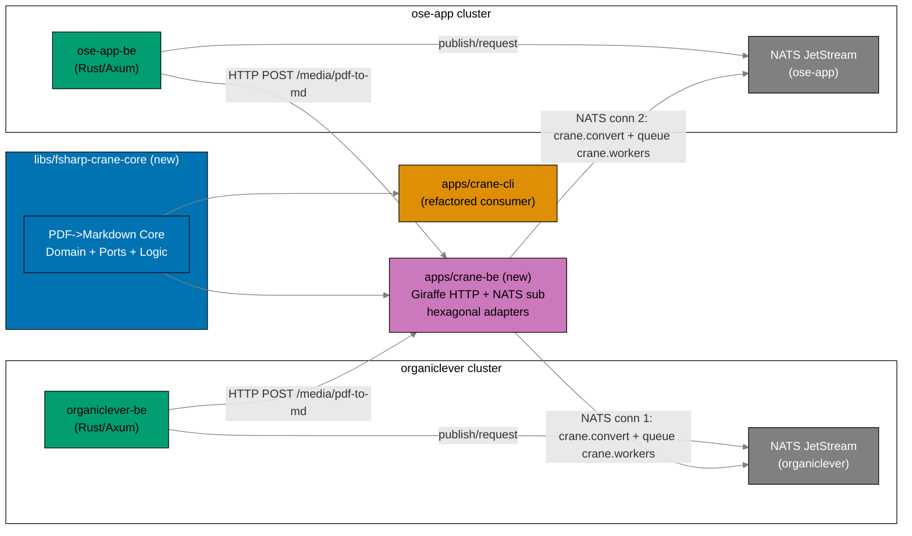
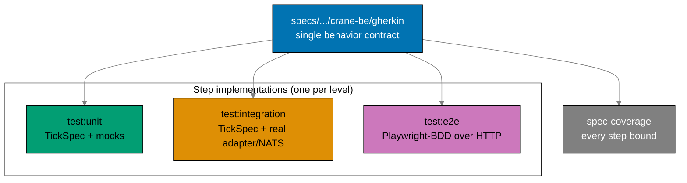

# Bootstrap BE Messaging and Crane Media Service

> **Status**: In progress — authored 2026-06-11. Execution not started.

## Context

The private sibling repo `ose-infra` carries an accepted plan,
`ose-infra/plans/in-progress/deploy-twin-k3s-clusters/` (cited by path — the reader is not
assumed to have access to that repo). Its Part 2 deploys, **per k3s cluster**: each Rust
backend (`organiclever-be`, `ose-app-be`) with **its own NATS JetStream** — "shipped
infrastructure-ready; the backends do NOT consume it yet" — plus a **shared internal F#
media-processing service** described as "deferred — no code exists yet", reachable internal-only
(ClusterIP). That infra plan's Phase 0.5 explicitly expects **this** repo (`ose-public`) to
author: production Dockerfiles, run-on-boot `sqlx::migrate!` wiring, and an affected-aware GHCR
image-publish workflow producing public images
(`ghcr.io/wahidyankf/organiclever-be:latest`, `ghcr.io/wahidyankf/ose-app-be:latest`, and now
`ghcr.io/wahidyankf/crane-be:latest`).

This plan delivers exactly that **application side** so the infra plan has real artifacts to
deploy. It is the application-side counterpart to `deploy-twin-k3s-clusters` (Part 2). Where the
infra plan stages NATS as "infra-ready, not consumed yet", this plan goes one step further: the
applications **do** consume NATS for the media path plus a JetStream durable demo, proving the
provisioned infrastructure works rather than assuming it.

This plan also builds on the just-completed
[`standardize-secrets-and-env`](../../../plans/done/2026-06-10__standardize-secrets-and-env/README.md)
plan (done 2026-06-10), which introduced per-app `SCREAMING_SNAKE` env naming with app-prefix,
fail-fast startup validation, `.env.example` annotation format, and the `rhino-cli env validate`
drift guard backed by `env-contract.yaml` at the repo root. Every new env var this plan adds
must honor that standard or the drift guard fails at pre-push and CI. See
[Secrets and Env Standards](../../../repo-governance/conventions/security/secrets-and-env-standards.md).

## Scope

### In Scope

- New shared F# library `libs/fsharp-crane-core/` holding the PDF→Markdown Core (Domain + Ports +
  Logic), extracted from `apps/crane-cli/`. Introduces the repo's first F# library and a new
  `fsharp-` lib-naming token.
- Refactor `apps/crane-cli/` to consume the new library; its existing unit + integration tests
  stay green.
- New deployable F# service `apps/crane-be/` (Giraffe on ASP.NET Core, hexagonal
  ports-and-adapters) exposing the first media op, PDF→Markdown, over **both** an internal HTTP
  API (`POST /media/pdf-to-md`) and NATS core request/reply (subject `crane.convert`).
- Full three-level testing for `crane-be` per the
  [Three-Level Testing Standard](../../../repo-governance/development/quality/three-level-testing-standard.md):
  `test:unit` (xUnit + TickSpec, mocked ports), `test:integration` (TickSpec, real PdfPig/Tesseract
  adapter + real NATS broker), and `test:e2e` in a new paired Playwright-BDD runner
  `apps/crane-be-e2e/` (real HTTP against a running containerized service). **All three levels
  consume the same Gherkin tree** at `specs/apps/crane/behavior/crane-be/gherkin/` — only the step
  implementations differ.
- New e2e runner `apps/crane-be-e2e/` (TypeScript, `playwright-bdd` + `@playwright/test`), the
  black-box counterpart to `crane-be`, mirroring the existing `ose-app-be-e2e` /
  `organiclever-be-e2e` pattern.
- Real NATS client wiring in **both** Rust backends: a NATS client, an HTTP client and a NATS
  request/reply client to `crane-be`, plus a JetStream durable publish+consume+ack demo (one
  demo subject per backend) that exercises the JetStream the infra provisions.
- Per-backend NATS topology matching the infra plan exactly: `organiclever-be` owns its NATS
  JetStream; `ose-app-be` owns its NATS JetStream (one each). The single shared `crane-be` opens
  **two** independent NATS connections (one per backend's server) and subscribes with the same
  queue group on each.
- Spec-first DDD spec sets: a new `messaging` bounded context added to both
  `specs/apps/organiclever/` and `specs/apps/ose/`, and a `crane-be` service spec set under
  the existing `specs/apps/crane/`.
- Production Dockerfiles for `organiclever-be`, `ose-app-be`, and `crane-be` (separate from the
  existing `Dockerfile.integration`); run-on-boot `sqlx::migrate!` in both Rust backends; an
  affected-aware GHCR image-publish GitHub Actions workflow producing public images for all
  three.
- New env vars registered in `apps/<app>/.env.example` and `env-contract.yaml`; NATS service
  added to each backend's `docker-compose.integration.yml`; `crane-be` gets its own
  `docker-compose.integration.yml`.
- Convention update registering `fsharp-` as a lib-naming token alongside `ts-`/`rust-`.

### Out of Scope

- Any business logic beyond the single PDF→Markdown media op.
- Production deployment, Kubernetes manifests, ClusterIP wiring (owned by the `ose-infra` plan).
- New backend product features (journaling, gap analysis, etc.).
- Media ops other than PDF→Markdown (figure check, mermaid validate, OCR quality — those remain
  in `crane-cli` only).
- Frontend changes to any web app.

### Affected Areas

- `apps/crane-cli/` (refactor to consume library)
- `apps/organiclever-be/`, `apps/ose-app-be/` (messaging context, env, Dockerfile, migrate)
- `apps/crane-be/` (new app — unit + integration tests, both consuming Gherkin)
- `apps/crane-be-e2e/` (new Playwright-BDD e2e runner — consumes the same Gherkin)
- `libs/fsharp-crane-core/` (new library)
- `specs/apps/crane/` (new `crane-be` behavior surface + `components/be/`),
  `specs/apps/organiclever/`, `specs/apps/ose/` (new `messaging` bounded context each)
- `env-contract.yaml`
- `.github/workflows/` (new GHCR publish workflow)
- `docs/reference/monorepo-structure.md` (lib-naming token)

## Approach

## Testing Topology (one Gherkin tree, three step layers)

Every `crane-be` behavior is written once as Gherkin and verified at three boundaries. The same
applies to the `messaging` context added to both Rust backends. This realises the
[Three-Level Testing Standard](../../../repo-governance/development/quality/three-level-testing-standard.md)
"Gherkin-Everywhere Mandate".

## Relationship to ose-infra deploy-twin-k3s-clusters

| Concern             | `ose-infra` (deploy-twin-k3s-clusters)                          | This plan (`ose-public`)                                   |
| ------------------- | --------------------------------------------------------------- | ---------------------------------------------------------- |
| NATS provisioning   | Provisions per-backend NATS JetStream per cluster (infra-ready) | Wires backends to actually connect, publish, and consume   |
| crane media service | Reserves a shared internal ClusterIP slot; "no code exists yet" | Ships `apps/crane-be/` as a deployable F# service skeleton |
| Production images   | Phase 0.5 expects images to exist                               | Ships Dockerfiles + GHCR publish workflow for all three    |
| DB migrations       | Expects run-on-boot migration wiring                            | Adds `sqlx::migrate!` on boot to both backends             |
| Topology            | One NATS per backend; one shared crane service                  | `crane-be` opens two connections, one per backend's NATS   |

After this plan lands, the infra plan's Phase 0.5 needs **nothing further** from `ose-public`:
the three public GHCR images, migration wiring, and the publish workflow all exist.

## Plan Navigation

| Document                       | Purpose                                                            |
| ------------------------------ | ------------------------------------------------------------------ |
| [README.md](./README.md)       | Context, scope, approach, navigation (this file)                   |
| [brd.md](./brd.md)             | Business goal, rationale, affected roles, success criteria, risks  |
| [prd.md](./prd.md)             | Personas, user stories, Gherkin acceptance criteria, product scope |
| [tech-docs.md](./tech-docs.md) | Architecture, hexagonal design, dependency clearance, env mapping  |
| [delivery.md](./delivery.md)   | Phased, TDD-shaped delivery checklist with phase gates             |

## Delivery Phases At A Glance

| Phase | Name                                                   | Outcome                                                                         |
| ----- | ------------------------------------------------------ | ------------------------------------------------------------------------------- |
| 0     | Environment Setup and Baseline                         | Toolchain converged; baseline recorded; NATS.Net 2.7.x Path-B version confirmed |
| 1     | Shared library extraction + crane-cli migration        | `libs/fsharp-crane-core/` created; crane-cli consumes it; tests green           |
| 2     | crane-be skeleton + Gherkin + unit/integration (fake)  | Deployable service; health + fake PDF→md; unit + integration consume Gherkin    |
| 3     | crane-be real PDF→md adapter + NATS subscriber         | Real PdfPig/Tesseract adapter via lib; NATS request/reply; integration Gherkin  |
| 4     | crane-be-e2e (Playwright-BDD black-box runner)         | `apps/crane-be-e2e/` runs the same Gherkin over real HTTP against the service   |
| 5     | organiclever-be messaging context                      | NATS client, crane clients, JetStream demo, env + drift guard, Gherkin          |
| 6     | ose-app-be messaging context                           | Same as Phase 5 for ose-app-be                                                  |
| 7     | Production Dockerfiles + sqlx::migrate! + compose NATS | Three prod Dockerfiles; migrate on boot; NATS in compose                        |
| 8     | GHCR affected-aware publish workflow                   | Public images for all three backends/services                                   |
| 9     | Specs completeness + spec-coverage + docs              | Spec sets complete; conventions and architecture docs updated                   |
| 10    | Final Quality Gate + Commit + Push + CI verify         | All gates green locally and in CI                                               |

## Git Workflow

- **Worktree**: all work happens in `worktrees/bootstrap-be-messaging-and-crane-media/` (see
  [delivery.md](./delivery.md) `## Worktree`).
- **Branching**: Trunk Based Development — direct push to `origin main`, no PR.
- **Commits**: thematic, Conventional Commits format, split by domain/concern, one or more
  commits per phase.
- See
  [Trunk Based Development Convention](../../../repo-governance/development/workflow/trunk-based-development.md).
