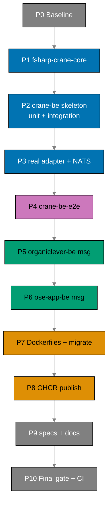

# Delivery Checklist: Bootstrap BE Messaging and Crane Media Service

> **Legend** — `[AI]`: an agent performs the step (the default; unmarked steps are `[AI]`).
> `[HUMAN]`: only a human can do it (physical action, out-of-band approval, real-secret or
> privileged-credential handling). `[AI+HUMAN]`: agent prepares, human approves or finishes.
>
> **Phase Gate** — every phase ends with a `### Phase N Gate` (must-pass verification) plus a
> `> **Pause Safety**:` note (the safe-to-stop state and the single command to resume). A phase
> is not complete until its gate is green; do not start phase N+1 while any gate check fails.

## Worktree

Worktree path: `worktrees/bootstrap-be-messaging-and-crane-media/`

Optional manual pre-provisioning (run from repo root):

```bash
claude --worktree bootstrap-be-messaging-and-crane-media
```

The plan-execution Step 0 gate enters this worktree by default: it auto-provisions from the latest
`origin/main` when missing, syncs with `origin/main` before implementing, and prompts before
deleting the worktree after the plan is archived and pushed.

See
[Worktree Path Convention](../../../repo-governance/conventions/structure/worktree-path.md)
and
[Plans Organization Convention §Worktree Specification](../../../repo-governance/conventions/structure/plans.md#worktree-specification).

## Phase Dependency Overview



---

## Phase 0: Environment Setup and Baseline

> _Executor: repo-setup-manager_

- [ ] [AI] Install dependencies in the root worktree: `npm install`
      — acceptance: exits 0, `node_modules/` synchronized
- [ ] [AI] Converge the polyglot toolchain in the root worktree: `npm run doctor -- --fix`
      — acceptance: exits 0 with no unresolved drift (Node, .NET 10, Rust, Docker, jq present)
- [ ] [AI] Record the affected-projects baseline:
      `npx nx affected -t typecheck lint test:quick spec-coverage --base=origin/main`
      — acceptance: pass/fail counts recorded in this checklist; every preexisting failure
      documented
- [ ] [AI] Resolve all preexisting failures before proceeding
      — acceptance: no preexisting failures remain unresolved
- [ ] [AI] Confirm the exact `NATS.Net` Path-B-eligible 2.7.x version and release date are
      ≥ 60 days old and CVE-clean (NVD, GitHub Advisories, Snyk, CISA KEV). Delegate to
      `web-research-maker` if more than a single fetch is needed.
      — acceptance: confirmed version + date written back into `tech-docs.md` Dependency Clearance
      table; not 2.8.0/2.8.1
  - _Suggested executor: `web-research-maker`_
- [ ] [AI] Re-confirm `async-nats 0.47.0` (2026-03-31) and `Giraffe 8.2.0` (2025-11-12) release
      dates against the computed 60-day cutoff (execution date minus 60 days)
      — acceptance: both confirmed ≥ 60 days old; cutoff date recorded in `tech-docs.md`

### Phase 0 Gate

> All checks below must pass before starting Phase 1.

- [ ] [AI] `npm install` exited 0 and `npm run doctor -- --fix` reports no unresolved drift
- [ ] [AI] `npx nx affected -t typecheck lint test:quick spec-coverage --base=origin/main`
      baseline recorded; zero unresolved preexisting failures
- [ ] [AI] Exact `NATS.Net` 2.7.x version + date confirmed Path-B-clean and written into
      `tech-docs.md`

> **Pause Safety**: only the local toolchain was verified, the baseline recorded, and dependency
> versions confirmed — no feature work exists yet. Safe to stop indefinitely. To resume: re-run
> the baseline command and confirm it is still clean.

---

## Phase 1: Shared Library Extraction + crane-cli Migration

> Extract the PDF→Markdown Core into `libs/fsharp-crane-core/` and refactor `apps/crane-cli/` to
> consume it. crane-cli's existing tests are the regression guard.
>
> _Suggested executor for all F# steps in this phase: `swe-fsharp-dev`_

- [ ] [AI] Create `libs/fsharp-crane-core/fsharp-crane-core.fsproj` (class library, `net10.0`, no
      `OutputType=Exe`; siblings reference: `apps/crane-cli/crane-cli.fsproj`) with
      `PackageReference` to `PdfPig 0.1.14` and `TesseractOCR 5.5.2`
      — acceptance: `dotnet build libs/fsharp-crane-core/fsharp-crane-core.fsproj` compiles (no
      sources yet beyond a placeholder module)
- [ ] [AI] Create `libs/fsharp-crane-core/project.json` mirroring `libs/rust-commons/project.json`
      target shape (`build`, `typecheck`, `lint`, `fmt`, `fmt:check`, `test:unit`, `test:quick`,
      `spec-coverage` echoing not-applicable for a lib), tags `domain:crane`, `type:lib`
      — acceptance: `npx nx show project fsharp-crane-core` lists the targets

- [ ] [AI] **RED**: write a failing unit test asserting `convertPdfToMarkdown` exists in the new
      library, in `libs/fsharp-crane-core/tests/unit/Suite.fs`
      — command: `npx nx run fsharp-crane-core:test:unit`
      — acceptance: test fails with an unresolved-name / build error for `convertPdfToMarkdown`
- [ ] [AI] **GREEN**: move the PDF→Markdown Domain + Ports + conversion Logic from
      `apps/crane-cli/src/Core/` into `libs/fsharp-crane-core/src/` and expose
      `convertPdfToMarkdown`
      — command: `npx nx run fsharp-crane-core:test:unit`
      — acceptance: test passes; coverage meets `Threshold=95`
- [ ] [AI] **REFACTOR**: tidy module namespaces (`CraneCore.*`) and remove dead code left by the
      move
      — command: `npx nx run fsharp-crane-core:test:unit`
      — acceptance: all library tests still pass

- [ ] [AI] Edit `apps/crane-cli/crane-cli.fsproj`: replace the moved `Compile Include` Core entries
      with a `ProjectReference` to `libs/fsharp-crane-core/fsharp-crane-core.fsproj`
      — acceptance: `npx nx run crane-cli:typecheck` exits 0
- [ ] [AI] **RED**: confirm `npx nx run crane-cli:test:unit` currently fails or shows import errors
      after the `ProjectReference` is added but before call sites are updated
      — command: `npx nx run crane-cli:test:unit`
      — acceptance: compilation fails due to unresolved `Core.*` namespaces (confirms the migration
      is needed)
- [ ] [AI] **GREEN**: update `apps/crane-cli/src/` call sites to consume `CraneCore.*` from the
      library
      — command: `npx nx run crane-cli:test:unit`
      — acceptance: all crane-cli unit tests pass
- [ ] [AI] **REFACTOR**: remove any duplicate or shadowed `open` directives left by the namespace
      migration in `apps/crane-cli/src/`
      — command: `npx nx run crane-cli:test:unit`
      — acceptance: all crane-cli unit tests still pass, no unused opens
- [ ] [AI] Verify the crane-cli integration suite stays green:
      `npx nx run crane-cli:test:integration`
      — acceptance: all crane-cli integration tests pass
- [ ] [AI] Confirm no app→app import was introduced: grep `apps/crane-cli` and `apps/crane-be`
      sources for cross-app references
      — acceptance: no `apps/<other-app>` import path appears in either app's sources

### Local Quality Gates (Before Commit)

- [ ] [AI] `npx nx affected -t typecheck` — exits 0
- [ ] [AI] `npx nx affected -t lint` — exits 0
- [ ] [AI] `npx nx affected -t test:quick` — exits 0
- [ ] [AI] `npx nx affected -t spec-coverage` — exits 0
- [ ] [AI] Fix ALL failures, including preexisting ones (see Fix-All-Issues note below)

### Commit Guidelines

- [ ] [AI] Commit thematically (Conventional Commits), e.g.
      `refactor(crane): extract pdf-to-md core into libs/fsharp-crane-core`
      and `refactor(crane-cli): consume fsharp-crane-core library`

### Phase 1 Gate

> All checks below must pass before starting Phase 2.

- [ ] [AI] `npx nx run fsharp-crane-core:test:quick` — exits 0 (coverage ≥ 95)
- [ ] [AI] `npx nx run crane-cli:test:unit` and `npx nx run crane-cli:test:integration` — both
      exit 0
- [ ] [AI] No app→app import exists (grep clean)

> **Pause Safety**: the library is extracted and crane-cli is green on it; the repo compiles and
> all crane tests pass. Safe to stop. To resume: `npx nx run crane-cli:test:quick`.

---

## Phase 2: crane-be Skeleton + Gherkin + Unit/Integration (fake adapter)

> Stand up the deployable F# service with Giraffe HTTP, hexagonal layout, and the fake media
> adapter. Author the crane-be Gherkin tree and wire BOTH the unit (`test:unit`, TickSpec + mocks)
> and integration (`test:integration`, TickSpec) suites so each consumes the same Gherkin from the
> first failing test. TDD throughout. Per the
> [Three-Level Testing Standard](../../../repo-governance/development/quality/three-level-testing-standard.md),
> all test levels consume the shared Gherkin tree — only step implementations differ.
>
> _Suggested executor for all F# steps in this phase: `swe-fsharp-dev`_

- [ ] [AI] Create `apps/crane-be/crane-be.fsproj` (`OutputType=Exe`, `net10.0`,
      `ProjectReference` to `libs/fsharp-crane-core/fsharp-crane-core.fsproj`,
      `PackageReference Giraffe 8.2.0`) and `apps/crane-be/fsharplint.json` (copy
      `apps/crane-cli/fsharplint.json`)
      — acceptance: `dotnet build apps/crane-be/crane-be.fsproj` compiles
- [ ] [AI] Create `apps/crane-be/project.json` mirroring `apps/crane-cli/project.json` targets plus
      a long-running `dev`/`run` (`dotnet run --project apps/crane-be/crane-be.fsproj`), tags
      `domain:crane`, `type:app`. `test:unit`/`test:quick` MUST include
      `{workspaceRoot}/specs/apps/crane/behavior/crane-be/gherkin/**/*.feature` in `inputs`
      (sibling: crane-cli) so Gherkin edits invalidate cache. `spec-coverage` pairs the crane-be
      Gherkin tree with `apps/crane-be`.
      — acceptance: `npx nx show project crane-be` lists `build`, `typecheck`, `lint`, `fmt`,
      `fmt:check`, `test:unit`, `test:quick`, `test:integration`, `spec-coverage`, `dev`, `run`
- [ ] [AI] Grep `apps/rhino-cli/src/` for `lang` parsing to identify the source file(s) that
      enumerate valid `lang` values:
      `grep -rn '"lang"\|lang.*rust\|lang.*typescript' apps/rhino-cli/src/`
      — acceptance: specific source file(s) identified; valid `lang` values documented in a comment
      on the crane-be surface entry in `env-contract.yaml`; either `fsharp` is valid or the entry
      uses `lang: rust` with a note, or `lang` is omitted with allowlist-only — resolve BEFORE
      writing the surface entry below
- [ ] [AI] Create `apps/crane-be/.env.example` annotating `CRANE_BE_PORT` (OPTIONAL | u16, default
      `8300`), `CRANE_BE_ORGANICLEVER_NATS_URL` (REQUIRED | string),
      `CRANE_BE_OSE_APP_NATS_URL` (REQUIRED | string) per the secrets-and-env annotation format
      — acceptance: file follows the `apps/ose-app-be/.env.example` annotation style; default port
      `8300` is shown in the comment
- [ ] [AI] Add a `crane-be` surface entry to `env-contract.yaml` (`kind: app`)
      — acceptance: entry present; `lang` value resolved per the step above before running validate
- [ ] [AI] Verify a sample PDF fixture exists at `apps/crane-be/tests/fixtures/sample.pdf` (copy
      from `apps/crane-cli/tests/` if one exists; otherwise create `apps/crane-be/tests/fixtures/`
      and add a minimal valid PDF)
      — acceptance: `test -f apps/crane-be/tests/fixtures/sample.pdf` exits 0

### Gherkin authoring (shared by all test levels)

- [ ] [AI] Create the crane-be Gherkin tree
      `specs/apps/crane/behavior/crane-be/gherkin/` with domain subdirs and `@unit`/`@integration`/
      `@e2e` level tags transcribed from `prd.md`: `health/health.feature` and
      `media/pdf-to-md-http.feature` (the fake-adapter, real-adapter, empty-body, non-PDF, and
      content-type scenarios). Surface slug follows the flat `<product>-<surface>` convention
      `[Repo-grounded: repo-governance/conventions/structure/specs-directory-structure.md]`.
      — acceptance: `.feature` files mirror prd.md scenarios verbatim including tags; one primary
      Given/When/Then per scenario

### Unit + integration harness scaffolding (TickSpec, consume Gherkin)

- [ ] [AI] Create `apps/crane-be/tests/unit/` (`crane-be-unit-tests.fsproj` with `TickSpec 2.0.5`,
      `xunit.v3`, `coverlet`; `Steps/BddState.fs`, `Suite.fs` loading the crane-be Gherkin via
      `GHERKIN_ROOT` default — sibling: `apps/crane-cli/tests/unit/Suite.fs`) and
      `apps/crane-be/tests/integration/` (`crane-be-integration-tests.fsproj` with `TickSpec`;
      `Steps/`, `Suite.fs` over the same Gherkin tree)
      — acceptance: `npx nx run crane-be:test:unit` and `:test:integration` both run (no-op
      placeholder green) and load `*.feature` files from the crane-be Gherkin path

- [ ] [AI] **RED**: write a failing `@unit` step binding for the `/health` scenario (asserts the
      `/health` handler returns 200 healthy), in `apps/crane-be/tests/unit/Steps/HealthSteps.fs`
      — command: `npx nx run crane-be:test:unit`
      — acceptance: scenario fails (handler not yet defined)
- [ ] [AI] **GREEN**: implement the `/health` Giraffe `HttpHandler` in
      `apps/crane-be/src/Adapters/In/HttpHandlers.fs` and wire it in
      `apps/crane-be/src/Program.fs`
      — command: `npx nx run crane-be:test:unit`
      — acceptance: health scenario passes
- [ ] [AI] **REFACTOR**: extract a `webApp` route composition in `HttpHandlers.fs`
      — command: `npx nx run crane-be:test:unit`
      — acceptance: all scenarios still pass

- [ ] [AI] **RED**: write a failing `@unit` step binding for `MediaService.convert` returning the
      fake canned markdown, in `apps/crane-be/tests/unit/Steps/MediaSteps.fs`
      — command: `npx nx run crane-be:test:unit`
      — acceptance: scenario fails (`MediaService` / `FakeMediaAdapter` not yet defined)
- [ ] [AI] **GREEN**: implement the out-port in `apps/crane-be/src/Core/Ports.fs`, the
      `FakeMediaAdapter` in `apps/crane-be/src/Adapters/Out/FakeMediaAdapter.fs`, and
      `MediaService.convert` in `apps/crane-be/src/Application/MediaService.fs`
      — command: `npx nx run crane-be:test:unit`
      — acceptance: fake-convert scenario passes
- [ ] [AI] **REFACTOR**: clean up the port signature naming
      — command: `npx nx run crane-be:test:unit`
      — acceptance: all scenarios still pass

- [ ] [AI] **RED**: write failing `@unit` step bindings for `POST /media/pdf-to-md` (200 fake body)
      plus the `@unit` error scenarios (empty body → 400, non-PDF → 422) in
      `apps/crane-be/tests/unit/Steps/MediaSteps.fs`; add non-BDD edge tests for config fail-fast in
      `apps/crane-be/tests/unit/Tests/ConfigTests.fs`
      — command: `npx nx run crane-be:test:unit`
      — acceptance: scenarios + edge tests fail (route + config not yet wired)
- [ ] [AI] **GREEN**: implement the `POST /media/pdf-to-md` handler in `HttpHandlers.fs` delegating
      to `MediaService.convert` with the fake adapter, with empty-body and non-PDF guards, and wire
      fail-fast config read in `apps/crane-be/src/Config.fs`
      — command: `npx nx run crane-be:test:unit`
      — acceptance: route + error scenarios pass; coverage meets `Threshold=95`
- [ ] [AI] **REFACTOR**: deduplicate request-body reading
      — command: `npx nx run crane-be:test:unit`
      — acceptance: all scenarios still pass
- [ ] [AI] Bind the `@integration` `/health` scenario in `apps/crane-be/tests/integration/Steps/`
      against the in-process service (real config), keeping the suite green for the
      already-implemented surface
      — command: `npx nx run crane-be:test:integration`
      — acceptance: health integration scenario passes (real-NATS scenarios arrive in Phase 3)
- [ ] [AI] `npx nx run crane-be:spec-coverage` — every authored crane-be step has a definition
      — acceptance: exits 0 (any not-yet-bound `@integration` scenario is added in Phase 3; if it
      blocks, scope spec-coverage to the authored features this phase and complete in Phase 3)

### Manual API Verification (curl)

- [ ] [AI] Start crane-be: `npx nx run crane-be:dev`
- [ ] [AI] Verify health: `curl -s http://localhost:8300/health | jq .`
      — acceptance: 200 + healthy body
- [ ] [AI] Verify fake convert:
      `curl -s -X POST --data-binary @apps/crane-be/tests/fixtures/sample.pdf http://localhost:8300/media/pdf-to-md`
      — acceptance: 200 + canned markdown body

### Local Quality Gates (Before Commit)

- [ ] [AI] `npx nx affected -t typecheck lint test:quick spec-coverage` — all exit 0
- [ ] [AI] Fix ALL failures, including preexisting ones

### Commit Guidelines

- [ ] [AI] Commit thematically, e.g.
      `feat(crane-be): scaffold service with health + fake pdf-to-md` and
      `test(crane-be): add Gherkin tree consumed by unit + integration suites`

### Phase 2 Gate

> All checks below must pass before starting Phase 3.

- [ ] [AI] `npx nx run crane-be:test:quick` — exits 0 (coverage ≥ 95)
- [ ] [AI] `npx nx run crane-be:test:unit` and `:test:integration` both load and pass the authored
      crane-be Gherkin scenarios (unit binds `@unit`, integration binds `@integration` health)
- [ ] [AI] `curl` health + fake-convert checks both return 200 with expected bodies

> **Pause Safety**: crane-be is a deployable skeleton serving health + fake PDF→md over HTTP; the
> Gherkin tree exists and is consumed by both the unit and integration suites. Safe to stop. To
> resume: `npx nx run crane-be:dev` then re-run the curl checks.

---

## Phase 3: crane-be Real PDF→md Adapter + NATS Subscriber

> Wire the real PdfPig/Tesseract adapter (via the shared lib) and the NATS `crane.convert`
> request/reply subscriber. The `@integration` scenarios (real-adapter convert, NATS request/reply,
> NATS error envelope, dual-connection isolation) become the first failing integration tests,
> consuming the same Gherkin tree authored in Phase 2.
>
> _Suggested executor for all F# steps in this phase: `swe-fsharp-dev`_

- [ ] [AI] Add `PackageReference NATS.Net <confirmed 2.7.x>` to `apps/crane-be/crane-be.fsproj`
      (version confirmed in Phase 0)
      — acceptance: `npx nx run crane-be:typecheck` exits 0
- [ ] [AI] Add `tessdata/eng.traineddata` content copy to `crane-be.fsproj` mirroring
      `apps/crane-cli/crane-cli.fsproj`
      — acceptance: build output includes `tessdata/eng.traineddata`

### Gherkin authoring (integration + NATS scenarios)

- [ ] [AI] Add `media/pdf-to-md-nats.feature` (the `@integration` NATS request/reply + NATS error
      envelope scenarios) and `media/dual-nats-isolation.feature` (the `@integration`
      two-connection isolation scenario) to
      `specs/apps/crane/behavior/crane-be/gherkin/media/`, transcribed verbatim from `prd.md`
      — acceptance: `.feature` files mirror prd.md scenarios including `@integration` tags

- [ ] [AI] **RED**: write a failing `@integration` step binding asserting `RealMediaAdapter`
      delegates to `CraneCore.convertPdfToMarkdown` (real-adapter convert scenario), in
      `apps/crane-be/tests/integration/Steps/MediaSteps.fs`
      — command: `npx nx run crane-be:test:integration`
      — acceptance: scenario fails (`RealMediaAdapter` not yet defined)
- [ ] [AI] **GREEN**: implement `apps/crane-be/src/Adapters/Out/RealMediaAdapter.fs` delegating to
      the library port
      — command: `npx nx run crane-be:test:integration`
      — acceptance: real-adapter scenario passes
- [ ] [AI] **REFACTOR**: make adapter selection (fake vs real) a single composition-root decision
      in `Program.fs`
      — command: `npx nx run crane-be:test:integration`
      — acceptance: all scenarios still pass

- [ ] [AI] **RED**: bind the `@integration` `crane.convert` request/reply scenario (real NATS) plus
      the NATS error-envelope scenario, in `apps/crane-be/tests/integration/Steps/NatsSteps.fs`
      — command: `npx nx run crane-be:test:integration`
      — acceptance: scenarios fail (subscriber not yet wired)
- [ ] [AI] **GREEN**: implement `apps/crane-be/src/Adapters/In/NatsSubscriber.fs` subscribing
      `crane.convert` with queue group `crane.workers` and replying on the auto `_INBOX`; wire two
      connections in `Program.fs` from `CRANE_BE_ORGANICLEVER_NATS_URL` and
      `CRANE_BE_OSE_APP_NATS_URL`
      — command: `npx nx run crane-be:test:integration`
      — acceptance: request/reply + error-envelope scenarios pass
- [ ] [AI] **RED**: bind the `@integration` dual-connection isolation scenario (same queue group on
      both servers, no cross-delivery), in `apps/crane-be/tests/integration/Steps/NatsSteps.fs`
      — command: `npx nx run crane-be:test:integration`
      — acceptance: scenario fails (second connection / isolation assertion not yet wired)
- [ ] [AI] **GREEN**: complete the two-connection wiring so each backend's request is answered only
      on its own server
      — command: `npx nx run crane-be:test:integration`
      — acceptance: isolation scenario passes
- [ ] [AI] **REFACTOR**: extract connection setup into a reusable helper
      — command: `npx nx run crane-be:test:integration`
      — acceptance: all integration scenarios still pass

- [ ] [AI] Create `apps/crane-be/docker-compose.integration.yml` with a `nats` service (`-js`) and
      the `crane-be` service (siblings reference:
      `apps/organiclever-be/docker-compose.integration.yml`)
      — acceptance: `docker compose -f apps/crane-be/docker-compose.integration.yml config`
      validates; integration target remains non-cacheable

### Local Quality Gates (Before Commit)

- [ ] [AI] `npx nx affected -t typecheck lint test:quick spec-coverage` — all exit 0
- [ ] [AI] `npx nx run crane-be:test:integration` — exits 0
- [ ] [AI] `npx nx run crane-be:spec-coverage` — every crane-be Gherkin step is bound (F# steps)
- [ ] [AI] Fix ALL failures, including preexisting ones

### Commit Guidelines

- [ ] [AI] Commit thematically, e.g.
      `feat(crane-be): add real pdf-to-md adapter and NATS crane.convert subscriber`

### Phase 3 Gate

> All checks below must pass before starting Phase 4.

- [ ] [AI] `npx nx run crane-be:test:quick` — exits 0 (coverage ≥ 95)
- [ ] [AI] `npx nx run crane-be:test:integration` — exits 0 (real NATS request/reply, error
      envelope, and dual-connection isolation all pass)
- [ ] [AI] `npx nx run crane-be:spec-coverage` — exits 0

> **Pause Safety**: crane-be serves real PDF→md over HTTP and NATS request/reply with two
> connections; integration tests pass against a real NATS container and consume the shared Gherkin.
> Safe to stop. To resume: `npx nx run crane-be:test:integration`.

---

## Phase 4: crane-be-e2e (Playwright-BDD Black-Box Runner)

> Create the paired e2e runner `apps/crane-be-e2e/` that drives a running containerized `crane-be`
> over real HTTP, asserting the `@e2e` Gherkin scenarios. This is the third test level for
> `crane-be` and consumes the SAME Gherkin tree as unit and integration — only the step
> implementations differ (Playwright over the wire). Mirrors `apps/ose-app-be-e2e/`
> `[Repo-grounded: apps/ose-app-be-e2e/]`.
>
> _Suggested executor: `swe-e2e-dev`_

- [ ] [AI] Scaffold `apps/crane-be-e2e/` mirroring `apps/ose-app-be-e2e/`: `package.json`
      (`@playwright/test 1.60.0`, `playwright-bdd 8.5.1`, Volta extends root), `tsconfig.json`,
      `.gitignore` (ignore `.features-gen/`, `test-results/`, `playwright-report/`), and `README.md`
      — acceptance: `apps/crane-be-e2e/package.json` lists both deps at the pinned versions
- [ ] [AI] Create `apps/crane-be-e2e/playwright.config.ts` via `defineBddConfig` with
      `featuresRoot`/`features` pointing at `../../specs/apps/crane/behavior/crane-be/gherkin`,
      `steps: ["./steps/**/*.ts"]`, and `baseURL` from `process.env.BASE_URL` defaulting to
      `http://localhost:8300` (sibling: `apps/ose-app-be-e2e/playwright.config.ts`)
      — acceptance: `npx bddgen` (run in `apps/crane-be-e2e`) generates `.features-gen/` from the
      `@e2e` scenarios with no unbound-step error once steps exist
- [ ] [AI] Create `apps/crane-be-e2e/project.json` mirroring `apps/ose-app-be-e2e/project.json`:
      targets `install`, `lint` (`oxlint`), `typecheck` (`npx bddgen && npx tsc --noEmit`),
      `test:quick` (lint + typecheck), `test:e2e` (`npx bddgen && npx playwright test`),
      `test:e2e:ui`, `test:e2e:report`; `typecheck`/`test:quick` `inputs` include
      `{workspaceRoot}/specs/apps/crane/behavior/crane-be/gherkin/**/*.feature`; tags `type:e2e`,
      `platform:playwright`, `lang:ts`, `domain:crane`; `implicitDependencies: ["crane-be"]`
      — acceptance: `npx nx show project crane-be-e2e` lists the targets and the implicit dep
- [ ] [AI] Create `apps/crane-be-e2e/docker-compose.e2e.yml` starting `crane-be` plus two NATS
      services (`-js`) so the running service satisfies its REQUIRED NATS env (sibling reference:
      `apps/crane-be/docker-compose.integration.yml`)
      — acceptance: `docker compose -f apps/crane-be-e2e/docker-compose.e2e.yml config` validates
- [ ] [AI] Create `apps/crane-be-e2e/utils/response-store.ts` (copy from
      `apps/ose-app-be-e2e/utils/response-store.ts`)
      — acceptance: file present; exports `setResponse`/`getResponse`/`clearResponse`

- [ ] [AI] **RED**: write the `@e2e` health step definitions in
      `apps/crane-be-e2e/steps/health.steps.ts` (`createBdd()`), then run e2e against the
      compose-started service
      — command: `cd apps/crane-be-e2e && docker compose -f docker-compose.e2e.yml up -d && npx nx run crane-be-e2e:test:e2e`
      — acceptance: the health scenario is generated and FAILS first only if the service is not yet
      reachable; once compose is healthy it must pass (no unbound steps)
- [ ] [AI] **GREEN**: implement the `@e2e` media step definitions in
      `apps/crane-be-e2e/steps/media.steps.ts` (POST `/media/pdf-to-md` with
      `apps/crane-be/tests/fixtures/sample.pdf`, assert 200 + markdown + `text/markdown`
      content-type)
      — command: `npx nx run crane-be-e2e:test:e2e`
      — acceptance: all `@e2e` scenarios pass against the running container
- [ ] [AI] **REFACTOR**: extract a shared `request`/baseURL helper and ensure `Before` clears the
      response store (sibling: `ose-app-be-e2e` health steps)
      — command: `npx nx run crane-be-e2e:test:e2e`
      — acceptance: all `@e2e` scenarios still pass
- [ ] [AI] Tear down the e2e stack:
      `cd apps/crane-be-e2e && docker compose -f docker-compose.e2e.yml down -v`
      — acceptance: containers removed

### Local Quality Gates (Before Commit)

- [ ] [AI] `npx nx run crane-be-e2e:test:quick` — exits 0 (`bddgen` + `tsc --noEmit` + lint)
- [ ] [AI] `npx nx run crane-be-e2e:test:e2e` — exits 0 against the compose-started service
- [ ] [AI] `npx nx affected -t typecheck lint` — all exit 0
- [ ] [AI] Fix ALL failures, including preexisting ones

### Commit Guidelines

- [ ] [AI] Commit thematically, e.g.
      `test(crane-be-e2e): add Playwright-BDD e2e runner consuming crane-be Gherkin`

### Phase 4 Gate

> All checks below must pass before starting Phase 5.

- [ ] [AI] `npx nx run crane-be-e2e:test:quick` — exits 0
- [ ] [AI] `npx nx run crane-be-e2e:test:e2e` — exits 0 (real HTTP black-box, `@e2e` scenarios pass)
- [ ] [AI] The same Gherkin tree now feeds all three crane-be levels (unit, integration, e2e)

> **Pause Safety**: crane-be has the full three-level testing pyramid green, all consuming one
> Gherkin tree; the e2e runner proves the deployable service over real HTTP. Safe to stop. To
> resume: bring up `docker-compose.e2e.yml` and run `npx nx run crane-be-e2e:test:e2e`.

---

## Phase 5: organiclever-be Messaging Context

> Add NATS client, crane HTTP + NATS clients, JetStream durable demo, and env vars + drift guard
> to `organiclever-be`.
>
> _Suggested executor for all Rust steps in this phase: `swe-rust-dev`_

- [ ] [AI] Add `async-nats = "0.47.0"` to `apps/organiclever-be/Cargo.toml`
      — acceptance: `npx nx run organiclever-be:typecheck` exits 0
- [ ] [AI] Annotate `ORGANICLEVER_BE_NATS_URL` (REQUIRED | string) and
      `ORGANICLEVER_BE_CRANE_URL` (REQUIRED | string) in `apps/organiclever-be/.env.example`
      — acceptance: matches the existing annotation style in that file
- [ ] [AI] Register both new vars in the `apps/organiclever-be` surface in `env-contract.yaml`
      (or its allowlist as appropriate)
      — acceptance: `npx nx run rhino-cli:build` then `rhino-cli env validate` reports no drift
- [ ] [HUMAN] If a real `apps/organiclever-be/.env.local` must carry the new vars for local runs,
      the human copies the values (agents must not touch real `.env*` files)
      — resume signal: human confirms `.env.local` updated; agent continues

- [ ] [AI] **RED**: write a failing unit test for NATS-URL config read + fail-fast in
      `apps/organiclever-be/src/` (sibling pattern: existing config module)
      — command: `npx nx run organiclever-be:test:unit`
      — acceptance: test fails (config field not yet present)
- [ ] [AI] **GREEN**: add the NATS URL + crane URL fields to the backend config with fail-fast
      validation (dotenvy+envy pattern)
      — command: `npx nx run organiclever-be:test:unit`
      — acceptance: config test passes
- [ ] [AI] **REFACTOR**: group messaging config into a `messaging` submodule
      — command: `npx nx run organiclever-be:test:unit`
      — acceptance: all tests still pass

- [ ] [AI] **RED**: write a failing integration test (real NATS) asserting startup connects to NATS
      and a `crane.convert` request returns markdown, in
      `apps/organiclever-be/tests/` (sibling: existing integration tests)
      — command: `npx nx run organiclever-be:test:integration`
      — acceptance: test fails (NATS client + crane NATS client not yet wired)
- [ ] [AI] **GREEN**: implement `apps/organiclever-be/src/messaging/` with the NATS client, the
      crane HTTP client (`POST {CRANE_URL}/media/pdf-to-md`), and the crane NATS request/reply
      client to `crane.convert`
      — command: `npx nx run organiclever-be:test:integration`
      — acceptance: integration test passes
- [ ] [AI] **REFACTOR**: deduplicate connection/client construction
      — command: `npx nx run organiclever-be:test:integration`
      — acceptance: all integration tests still pass

- [ ] [AI] **RED**: write a failing integration test asserting JetStream durable
      publish→consume→ack on `organiclever.messaging.demo` (durable
      `organiclever-messaging-demo`)
      — command: `npx nx run organiclever-be:test:integration`
      — acceptance: test fails (stream/consumer not yet created)
- [ ] [AI] **GREEN**: implement the JetStream stream + durable consumer + publish/ack demo in
      `apps/organiclever-be/src/messaging/`
      — command: `npx nx run organiclever-be:test:integration`
      — acceptance: demo message is consumed and acked; stream reports it delivered+acked
- [ ] [AI] **REFACTOR**: extract stream/consumer setup into a helper
      — command: `npx nx run organiclever-be:test:integration`
      — acceptance: all integration tests still pass

- [ ] [AI] Add a `nats` service (`-js`) to `apps/organiclever-be/docker-compose.integration.yml`
      (sibling: existing `postgres` service)
      — acceptance: `docker compose -f apps/organiclever-be/docker-compose.integration.yml config`
      validates; integration target remains non-cacheable

### Local Quality Gates (Before Commit)

- [ ] [AI] `npx nx affected -t typecheck lint test:quick spec-coverage` — all exit 0
- [ ] [AI] `npx nx run organiclever-be:test:integration` — exits 0
- [ ] [AI] `rhino-cli env validate` — reports no drift
- [ ] [AI] Fix ALL failures, including preexisting ones

### Commit Guidelines

- [ ] [AI] Commit thematically, e.g.
      `feat(organiclever-be): add NATS messaging context, crane clients, and JetStream demo`

### Phase 5 Gate

> All checks below must pass before starting Phase 6.

- [ ] [AI] `npx nx run organiclever-be:test:quick` — exits 0 (coverage ≥ 90)
- [ ] [AI] `npx nx run organiclever-be:test:integration` — exits 0 (NATS connect, crane RPC,
      JetStream demo all pass)
- [ ] [AI] `rhino-cli env validate` — no drift

> **Pause Safety**: organiclever-be connects to NATS, calls crane-be both ways, and proves its
> JetStream; env guard is clean. Safe to stop. To resume:
> `npx nx run organiclever-be:test:integration`.

---

## Phase 6: ose-app-be Messaging Context

> Same as Phase 5, for `ose-app-be`.
>
> _Suggested executor for all Rust steps in this phase: `swe-rust-dev`_

- [ ] [AI] Add `async-nats = "0.47.0"` to `apps/ose-app-be/Cargo.toml`
      — acceptance: `npx nx run ose-app-be:typecheck` exits 0
- [ ] [AI] Annotate `OSE_APP_BE_NATS_URL` (REQUIRED | string) and `OSE_APP_BE_CRANE_URL`
      (REQUIRED | string) in `apps/ose-app-be/.env.example`
      — acceptance: matches the existing annotation style in that file
- [ ] [AI] Register both new vars in the `apps/ose-app-be` surface in `env-contract.yaml`
      — acceptance: `rhino-cli env validate` reports no drift
- [ ] [HUMAN] If a real `apps/ose-app-be/.env.local` must carry the new vars, the human copies the
      values (agents must not touch real `.env*` files)
      — resume signal: human confirms `.env.local` updated; agent continues

- [ ] [AI] **RED**: write a failing unit test for NATS-URL config read + fail-fast in
      `apps/ose-app-be/src/`
      — command: `npx nx run ose-app-be:test:unit`
      — acceptance: test fails (config field not yet present)
- [ ] [AI] **GREEN**: add the NATS URL + crane URL fields to the backend config with fail-fast
      validation
      — command: `npx nx run ose-app-be:test:unit`
      — acceptance: config test passes
- [ ] [AI] **REFACTOR**: group messaging config into a `messaging` submodule
      — command: `npx nx run ose-app-be:test:unit`
      — acceptance: all tests still pass

- [ ] [AI] **RED**: write a failing integration test (real NATS) asserting startup connects and a
      `crane.convert` request returns markdown, in `apps/ose-app-be/tests/`
      — command: `npx nx run ose-app-be:test:integration`
      — acceptance: test fails (NATS + crane clients not yet wired)
- [ ] [AI] **GREEN**: implement `apps/ose-app-be/src/messaging/` with NATS client, crane HTTP
      client, and crane NATS request/reply client
      — command: `npx nx run ose-app-be:test:integration`
      — acceptance: integration test passes
- [ ] [AI] **REFACTOR**: deduplicate connection/client construction
      — command: `npx nx run ose-app-be:test:integration`
      — acceptance: all integration tests still pass

- [ ] [AI] **RED**: write a failing integration test asserting JetStream durable
      publish→consume→ack on `ose-app.messaging.demo` (durable `ose-app-messaging-demo`)
      — command: `npx nx run ose-app-be:test:integration`
      — acceptance: test fails (stream/consumer not yet created)
- [ ] [AI] **GREEN**: implement the JetStream stream + durable consumer + publish/ack demo in
      `apps/ose-app-be/src/messaging/`
      — command: `npx nx run ose-app-be:test:integration`
      — acceptance: demo message is consumed and acked; stream reports it delivered+acked
- [ ] [AI] **REFACTOR**: extract stream/consumer setup into a helper
      — command: `npx nx run ose-app-be:test:integration`
      — acceptance: all integration tests still pass

- [ ] [AI] Add a `nats` service (`-js`) to `apps/ose-app-be/docker-compose.integration.yml`
      — acceptance: `docker compose -f apps/ose-app-be/docker-compose.integration.yml config`
      validates; integration target remains non-cacheable

### Local Quality Gates (Before Commit)

- [ ] [AI] `npx nx affected -t typecheck lint test:quick spec-coverage` — all exit 0
- [ ] [AI] `npx nx run ose-app-be:test:integration` — exits 0
- [ ] [AI] `rhino-cli env validate` — reports no drift
- [ ] [AI] Fix ALL failures, including preexisting ones

### Commit Guidelines

- [ ] [AI] Commit thematically, e.g.
      `feat(ose-app-be): add NATS messaging context, crane clients, and JetStream demo`

### Phase 6 Gate

> All checks below must pass before starting Phase 7.

- [ ] [AI] `npx nx run ose-app-be:test:quick` — exits 0 (coverage ≥ 90)
- [ ] [AI] `npx nx run ose-app-be:test:integration` — exits 0 (NATS connect, crane RPC, JetStream
      demo all pass)
- [ ] [AI] `rhino-cli env validate` — no drift

> **Pause Safety**: both backends now consume NATS and call crane-be; env guard clean. Safe to
> stop. To resume: `npx nx run ose-app-be:test:integration`.

---

## Phase 7: Production Dockerfiles + sqlx::migrate! + Compose NATS

> Ship production Dockerfiles for all three services and run-on-boot migrations for both backends.
>
> _Suggested executor: `swe-rust-dev` (backends), `swe-fsharp-dev` (crane-be)_

- [ ] [AI] **RED**: write a failing integration test asserting a fresh-DB boot applies pending
      migrations, in `apps/organiclever-be/tests/`
      — command: `npx nx run organiclever-be:test:integration`
      — acceptance: test fails (migrate-on-boot not yet wired)
- [ ] [AI] **GREEN**: add `sqlx::migrate!` on boot (before serving) in
      `apps/organiclever-be/src/main.rs`
      — command: `npx nx run organiclever-be:test:integration`
      — acceptance: migrate-on-boot test passes; backend healthy after migrations
- [ ] [AI] **REFACTOR**: extract a `run_migrations` helper
      — command: `npx nx run organiclever-be:test:integration`
      — acceptance: all integration tests still pass
- [ ] [AI] **RED**: write a failing integration test asserting a fresh-DB boot applies pending
      migrations, in `apps/ose-app-be/tests/`
      — command: `npx nx run ose-app-be:test:integration`
      — acceptance: test fails (migrate-on-boot not yet wired)
- [ ] [AI] **GREEN**: add `sqlx::migrate!` on boot (before serving) in
      `apps/ose-app-be/src/main.rs`
      — command: `npx nx run ose-app-be:test:integration`
      — acceptance: migrate-on-boot test passes; backend healthy after migrations
- [ ] [AI] **REFACTOR**: extract a `run_migrations` helper in `apps/ose-app-be/src/`
      — command: `npx nx run ose-app-be:test:integration`
      — acceptance: all integration tests still pass

- [ ] [AI] Create `apps/organiclever-be/Dockerfile` (production, distinct from
      `Dockerfile.integration`; sibling reference: `apps/organiclever-be/Dockerfile.integration`)
      — acceptance: `docker build -f apps/organiclever-be/Dockerfile -t organiclever-be:local .`
      builds successfully
- [ ] [AI] Create `apps/ose-app-be/Dockerfile` (production)
      — acceptance: `docker build -f apps/ose-app-be/Dockerfile -t ose-app-be:local .` builds
      successfully
- [ ] [AI] Create `apps/crane-be/Dockerfile` (production; multi-stage; bundles
      `tessdata/eng.traineddata`)
      — acceptance: `docker build -f apps/crane-be/Dockerfile -t crane-be:local .` builds
      successfully

### Local Quality Gates (Before Commit)

- [ ] [AI] `npx nx affected -t typecheck lint test:quick spec-coverage` — all exit 0
- [ ] [AI] All three `docker build` commands exit 0
- [ ] [AI] `npx nx run crane-be:test:integration` — exits 0 (image features intact)
- [ ] [AI] Fix ALL failures, including preexisting ones

### Commit Guidelines

- [ ] [AI] Commit thematically, e.g.
      `feat(organiclever-be): run sqlx migrations on boot` and
      `build(crane-be): add production Dockerfile`

### Phase 7 Gate

> All checks below must pass before starting Phase 8.

- [ ] [AI] All three production images build locally (exit 0)
- [ ] [AI] `npx nx run organiclever-be:test:integration`,
      `npx nx run ose-app-be:test:integration`, and `npx nx run crane-be:test:integration`
      — all exit 0 (migrate-on-boot verified; crane-be image features intact)

> **Pause Safety**: three production images build and both backends migrate on boot; nothing is
> published yet. Safe to stop. To resume: re-run the three `docker build` commands.

---

## Phase 8: GHCR Affected-Aware Publish Workflow

> Add a GitHub Actions workflow that builds and publishes only changed images to public GHCR.

- [ ] [AI] Create `.github/workflows/publish-images.yml` (sibling reference: existing workflows in
      `.github/workflows/`) that detects affected projects and builds/pushes only changed images
      to `ghcr.io/wahidyankf/{organiclever-be,ose-app-be,crane-be}:latest`
      — acceptance: `npx nx run rhino-cli:validate:mermaid` is unaffected; workflow YAML is valid
      (`actionlint` or equivalent if available)
- [ ] [AI] Add a workflow job condition so unchanged images are not republished
      — acceptance: workflow logic gates each image build on its project being affected
- [ ] [HUMAN] After the first successful publish, set each GHCR package's visibility to **public**
      in GitHub package settings (out-of-band privileged setting)
      — resume signal: human confirms all three packages show "public"; agent continues to verify
      pulls
- [ ] [AI] Verify all three images are publicly pullable:
      `docker pull ghcr.io/wahidyankf/organiclever-be:latest && docker pull ghcr.io/wahidyankf/ose-app-be:latest && docker pull ghcr.io/wahidyankf/crane-be:latest`
      — acceptance: all three pulls succeed without authentication

### Phase 8 Gate

> All checks below must pass before starting Phase 9.

- [ ] [AI] The publish workflow ran on a push and published the affected image(s) (verify via
      `gh run view --json status,conclusion` for the workflow run)
- [ ] [HUMAN] All three GHCR packages are public
- [ ] [AI] All three images pull anonymously

> **Pause Safety**: the publish pipeline exists and produced public images; the infra plan's
> Phase 0.5 app-artifact dependency is satisfied. Safe to stop. To resume: re-run
> `docker pull ghcr.io/wahidyankf/crane-be:latest`.

---

## Phase 9: Specs Completeness + spec-coverage + Docs

> Add the DDD spec sets and Gherkin features, update conventions and architecture docs. The
> `crane-be` Gherkin tree was authored across Phases 2–3; this phase rounds out the remaining
> spec-tree artifacts (component docs, README updates, the backend `messaging` contexts) and
> verifies repo-wide spec coverage and docs quality.
>
> _Suggested executor: `specs-maker` (specs), `repo-rules-maker` / `docs-maker` (conventions)_

- [ ] [AI] Finalize the `crane-be` surface under `specs/apps/crane/`: confirm
      `specs/apps/crane/behavior/crane-be/gherkin/` (authored in Phases 2–3) covers health, HTTP
      convert, NATS convert, and dual-connection isolation; add a
      `specs/apps/crane/behavior/crane-be/gherkin/README.md`; add
      `specs/apps/crane/components/be/` component docs following
      `specs/apps/crane/components/cli/` as sibling; and update
      `specs/apps/crane/behavior/README.md` to list both the `crane-cli` and `crane-be` surfaces.
      Do NOT add DDD artifacts — crane is not in the `AppsWithDDD` allowlist
      `[Repo-grounded: apps/rhino-cli/src/internal/allowlist.rs]`. Surface slug follows the flat
      `<product>-<surface>` convention established by the `standardize-app-spec-trees` plan
      (2026-06-11)
      `[Repo-grounded: repo-governance/conventions/structure/specs-directory-structure.md]`.
      — acceptance: behavior `.feature` files mirror prd.md scenarios; `components/be/` present;
      `behavior/README.md` lists both surfaces; no `ddd/` dir created under `specs/apps/crane/`
- [ ] [AI] Add a `messaging` bounded context to
      `specs/apps/organiclever/ddd/bounded-contexts.yaml` (new entry with
      `gherkin: specs/apps/organiclever/behavior/organiclever-be/gherkin/messaging`
      `[Repo-grounded: bounded-contexts.yaml gherkin field format]`) plus ubiquitous-language doc
      `specs/apps/organiclever/ddd/ubiquitous-language/messaging.md`; add
      `specs/apps/organiclever/behavior/organiclever-be/gherkin/messaging/` domain subdirectory
      with Gherkin features covering NATS connect, JetStream demo, crane RPC. The `organiclever-be`
      surface slug is the flat product-surface name for the organiclever backend
      `[Repo-grounded: specs/apps/organiclever/behavior/organiclever-be/]`.
      — acceptance: files present; features mirror prd.md scenarios; `gherkin:` field points to
      `behavior/organiclever-be/gherkin/messaging`
- [ ] [AI] Add a `messaging` bounded context to `specs/apps/ose/ddd/bounded-contexts.yaml`
      (new entry with `gherkin: specs/apps/ose/behavior/app-be/gherkin/messaging`
      `[Repo-grounded: ose bounded-contexts.yaml — app-be is the ose-app-be surface slug from
standardize-app-spec-trees]` and `code_lang: [rs]`) plus ubiquitous-language doc
      `specs/apps/ose/ddd/ubiquitous-language/messaging.md`; add
      `specs/apps/ose/behavior/app-be/gherkin/messaging/` domain subdirectory with Gherkin
      features covering NATS connect, JetStream demo, crane RPC. The `app-be` surface slug maps
      to the `ose-app-be` Nx project after the standardize-app-spec-trees consolidation
      `[Repo-grounded: specs/apps/ose/behavior/app-be/]`.
      — acceptance: files present; features mirror prd.md scenarios; `gherkin:` field points to
      `behavior/app-be/gherkin/messaging`
- [ ] [AI] Ensure each app/lib has matching step definitions so `spec-coverage` passes:
      `npx nx affected -t spec-coverage`. The `crane-be` Gherkin is owned by `apps/crane-be` (F#
      steps); `crane-be-e2e` consumes the same tree via playwright-bdd and carries no spec-coverage
      target (matching `ose-app-be-e2e`).
      — acceptance: exits 0 for all touched projects
- [ ] [AI] Register the `fsharp-` lib-naming token in `docs/reference/monorepo-structure.md`
      (alongside `ts-`/`rust-` at lines listing the prefixes) and in any AGENTS.md / monorepo
      lib-naming note that restates the list
  - _Suggested executor: `repo-rules-maker`_
    — acceptance: `fsharp-` appears in the prefix list; example references `fsharp-crane-core`
- [ ] [AI] Add `apps/crane-be/README.md` and `apps/crane-be-e2e/README.md`, and update `AGENTS.md`
      Current Apps list + Project Structure tree to include `crane-be`, `crane-be-e2e`, and
      `libs/fsharp-crane-core`
  - _Suggested executor: `readme-maker`_
    — acceptance: READMEs follow repo README conventions; AGENTS.md lists all three

### Local Quality Gates (Before Commit)

- [ ] [AI] `npx nx affected -t spec-coverage` — exits 0
- [ ] [AI] `npm run lint:md` — exits 0 (fix with `npm run lint:md:fix` if needed)
- [ ] [AI] `npx nx run rhino-cli:validate:links` and `:validate:mermaid` — exit 0
- [ ] [AI] Fix ALL failures, including preexisting ones

### Commit Guidelines

- [ ] [AI] Commit thematically, e.g.
      `docs(specs): add crane-be and messaging bounded-context spec sets` and
      `docs(conventions): register fsharp- lib-naming token`

### Phase 9 Gate

> All checks below must pass before starting Phase 10.

- [ ] [AI] `npx nx affected -t spec-coverage` — exits 0
- [ ] [AI] `npm run lint:md` — exits 0
- [ ] [AI] `fsharp-` token registered; crane-be + crane-be-e2e documented

> **Pause Safety**: specs, conventions, and docs are complete and consistent with the code. Safe
> to stop. To resume: `npx nx affected -t spec-coverage`.

---

## Phase 10: Final Quality Gate + Commit + Push + CI Verify

> Final repo-wide gate, push to main, and CI verification.

### Fix-All-Issues Instruction

> **Important**: Fix ALL failures found during quality gates, not just those caused by your
> changes. This follows the root cause orientation principle — proactively fix preexisting errors
> encountered during work. Do not defer or skip existing issues. Commit preexisting fixes
> separately with appropriate conventional commit messages.

### Local Quality Gates (Before Push)

- [ ] [AI] `npx nx affected -t typecheck` — exits 0
- [ ] [AI] `npx nx affected -t lint` — exits 0
- [ ] [AI] `npx nx affected -t test:quick` — exits 0
- [ ] [AI] `npx nx affected -t spec-coverage` — exits 0
- [ ] [AI] `npx nx run crane-be:test:integration`,
      `npx nx run crane-be-e2e:test:e2e`,
      `npx nx run organiclever-be:test:integration`,
      `npx nx run ose-app-be:test:integration` — all exit 0
- [ ] [AI] `rhino-cli env validate` — no drift
- [ ] [AI] Fix ALL failures (including preexisting); re-run failing checks to confirm resolution
- [ ] [AI] Verify zero failures before pushing

### Post-Push CI Verification

- [ ] [AI] Push changes to `main`: `git push origin main`
- [ ] [AI] Monitor ALL GitHub Actions workflows triggered by the push (poll every 3 minutes via
      `gh run view --json status,conclusion`; do NOT use `gh run watch`)
- [ ] [AI] Verify ALL CI checks pass — no exceptions
- [ ] [AI] If any CI check fails, fix root cause immediately and push a follow-up commit
- [ ] [AI] Repeat until ALL GitHub Actions pass with zero failures
      — cite
      [ci-post-push-verification.md](../../../repo-governance/development/workflow/ci-post-push-verification.md)

### Plan Archival

- [ ] [AI] Verify ALL delivery checklist items are ticked
- [ ] [AI] Verify ALL quality gates pass (local + CI)
- [ ] [AI] Verify ALL manual assertions pass (curl)
- [ ] [AI] Rename and move:
      `git mv plans/in-progress/bootstrap-be-messaging-and-crane-media/ plans/done/2026-06-DD__bootstrap-be-messaging-and-crane-media/`
      using the actual completion date (NOT the creation date)
- [ ] [AI] Update `plans/in-progress/README.md` — remove the plan entry
- [ ] [AI] Update `plans/done/README.md` — add the plan entry with completion date
- [ ] [AI] Update `plans/README.md` and any other READMEs that reference this plan
- [ ] [AI] Commit the archival:
      `chore(plans): move bootstrap-be-messaging-and-crane-media to done`

### Phase 10 Gate

> Final gate — the plan is complete only when all checks below pass.

- [ ] [AI] All local quality gates exit 0
- [ ] [AI] All triggered GitHub Actions workflows pass (verified via `gh run view`)
- [ ] [AI] Plan folder moved to `plans/done/` and READMEs updated

> **Pause Safety**: all code is on `main`, CI is green, and the plan is archived. This is the
> terminal safe state. To resume verification: `gh run list --branch main --limit 5`.
