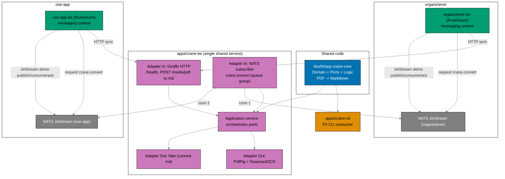
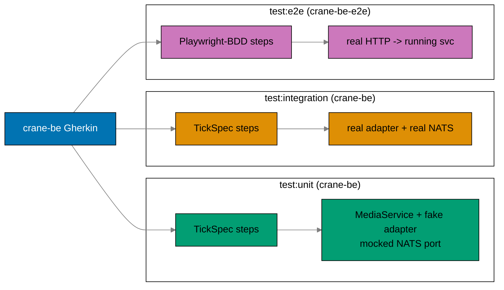
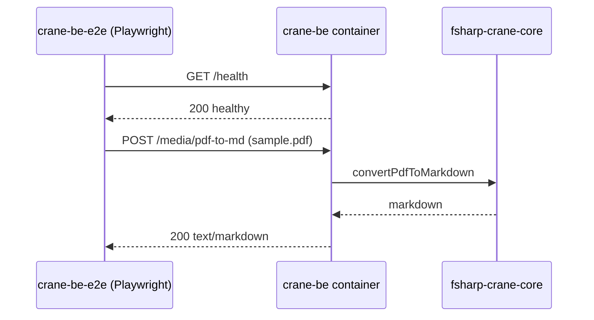

# Technical Documentation: Bootstrap BE Messaging and Crane Media Service

## Architecture Overview



## Shared F# Library: libs/fsharp-crane-core

`[Repo-grounded]` `apps/crane-cli/src/Core/` currently holds `Domain/` (`Finding.fs`,
`PdfMetadata.fs`, `Report.fs`), `Ports.fs`, and `Logic/` (ten checker/manager modules). The
PDF→Markdown extraction path lives in `Adapters/Out/PdfAdapter.fs` and `Adapters/Out/OcrAdapter.fs`
using `PdfPig` and `TesseractOCR`.

Design decision: extract only the **PDF→Markdown Core** (the Domain types and Ports needed for
conversion, plus the conversion Logic) into `libs/fsharp-crane-core/`. The library is a class
library (`Microsoft.NET.Sdk`, no `OutputType=Exe`), `TargetFramework net10.0`, matching the
crane-cli TFM `[Repo-grounded: crane-cli.fsproj]`. The library exposes a `convertPdfToMarkdown`
port plus the domain model; both `crane-cli` and `crane-be` reference it via `ProjectReference`.

Rationale: Nx forbids app→app imports `[Repo-grounded: AGENTS.md "Apps never import other apps"]`,
so the only sanctioned reuse path is a shared lib. This introduces the repo's first F# library.

### Library project.json

`libs/fsharp-crane-core/project.json` mirrors `libs/rust-commons/project.json`'s target shape:
`build`, `typecheck`, `lint`, `fmt`, `fmt:check`, `test:unit`, `test:quick`, and a `spec-coverage`
that echoes not-applicable for a library (as `rust-commons` does
`[Repo-grounded: rust-commons/project.json line 67-70]`). Coverage threshold for F# unit tests is
`Threshold=95` line, matching crane-cli `[Repo-grounded: crane-cli/project.json test:quick uses
/p:Threshold=95]`.

## crane-be Hexagonal Layout

```
apps/crane-be/
  crane-be.fsproj            # OutputType=Exe, net10.0, ProjectReference to fsharp-crane-core
  project.json               # Nx targets (see below)
  fsharplint.json            # mirrors crane-cli lint config
  Dockerfile                 # production image (Phase 6)
  docker-compose.integration.yml  # NATS + crane-be (Phase 6)
  .env.example               # CRANE_BE_* vars (Phase 2)
  src/
    Core/                    # thin app-level wiring over fsharp-crane-core ports
      Ports.fs               # in/out port signatures used by the service
    Application/
      MediaService.fs        # orchestrates the convert port
    Adapters/
      In/
        HttpHandlers.fs      # Giraffe HttpHandlers: /health, POST /media/pdf-to-md
        NatsSubscriber.fs    # subscribes crane.convert on each connection
      Out/
        FakeMediaAdapter.fs  # canned markdown (TDD first)
        RealMediaAdapter.fs  # delegates to fsharp-crane-core PdfPig/Tesseract
    Config.fs                # env read + fail-fast validation (dotenvy-equivalent intent)
    Program.fs               # composition root: build host, wire adapters, open 2 NATS conns
  tests/
    unit/                    # xUnit + TickSpec; mocked ports; Threshold=95
      Steps/                 # BddState.fs + *Steps.fs (unit-level step defs)
      Tests/                 # non-BDD edge cases (config fail-fast, error paths)
      Suite.fs               # TickSpec runner: loads crane-be Gherkin via GHERKIN_ROOT
    integration/             # TickSpec; real adapter + real NATS; non-cacheable
      Steps/                 # integration-level step defs (real adapter / NATS)
      Suite.fs               # TickSpec runner: same Gherkin tree, integration steps
    fixtures/
      sample.pdf             # real PDF fixture shared by integration + e2e
```

The paired e2e runner lives in its own Nx project (apps never import apps):

```
apps/crane-be-e2e/
  project.json               # type:e2e, platform:playwright, lang:ts, domain:crane
  package.json               # @playwright/test 1.60.0 + playwright-bdd 8.5.1
  tsconfig.json
  playwright.config.ts       # defineBddConfig -> crane-be Gherkin; baseURL crane-be
  docker-compose.e2e.yml     # crane-be + 2 NATS servers, for black-box runs
  steps/
    health.steps.ts          # GET /health step defs
    media.steps.ts           # POST /media/pdf-to-md step defs
  utils/
    response-store.ts        # mirrors ose-app-be-e2e response store
```

- **Ports (driving / In)**: HTTP handler and NATS subscriber both call the same
  `MediaService.convert` application function.
- **Ports (driven / Out)**: `IMediaConverter`-style port with `FakeMediaAdapter` (canned) and
  `RealMediaAdapter` (delegates to `fsharp-crane-core`). The fake adapter is wired first for TDD;
  the real adapter is wired in Phase 3.
- **Composition root** (`Program.fs`): reads config, opens two NATS connections (one per backend
  server URL), subscribes `crane.convert` with queue group `crane.workers` on each, and starts the
  Giraffe HTTP host.

### Giraffe / ASP.NET Core

`Giraffe 8.2.0` on ASP.NET Core (.NET 10). `HttpHandler` composition wraps the application port,
keeping the web framework in the In-adapter layer only. The HTTP route `POST /media/pdf-to-md`
accepts PDF bytes (request body) and returns `text/markdown`.

## crane-be Three-Level Testing (Gherkin-Everywhere)

`crane-be` is an API-style backend, so the
[Three-Level Testing Standard](../../../repo-governance/development/quality/three-level-testing-standard.md)
applies in full: `test:unit`, `test:integration`, and `test:e2e` are all mandatory, and **all three
levels consume the same Gherkin tree** `specs/apps/crane/behavior/crane-be/gherkin/`. Only the step
implementations differ — the standard's "Gherkin-Everywhere Mandate". `crane-be` is not a
PostgreSQL-backed CRUD service; its single real backing dependency at the integration level is the
**filesystem (real PDF) + a real NATS broker** (the messaging analogue of "one real dependency"),
and the real PdfPig/Tesseract adapter. E2E adds real HTTP via Playwright.



### Level mapping

| Level              | Project        | Harness                     | What is real                              | Cacheable |
| ------------------ | -------------- | --------------------------- | ----------------------------------------- | --------- |
| `test:unit`        | `crane-be`     | xUnit v3 + TickSpec         | Nothing — fake adapter, mocked NATS port  | yes       |
| `test:integration` | `crane-be`     | xUnit v3 + TickSpec         | Real PdfPig/Tesseract adapter + real NATS | no        |
| `test:e2e`         | `crane-be-e2e` | Playwright + playwright-bdd | Real HTTP against a running container     | no        |

- **Unit is a superset**: it binds every Gherkin scenario it can verify with mocks (`@unit`) PLUS
  non-BDD edge tests (config fail-fast, missing/invalid payloads) in `tests/unit/Tests/`. Coverage
  is measured here at `Threshold=95` (matching crane-cli), exceeding the ≥90% backend floor.
- **Integration sticks to Gherkin exactly**: `@integration` scenarios only — the NATS
  request/reply, the real-adapter convert, and the two-connection isolation. No extra non-BDD tests.
- **E2E sticks to Gherkin exactly**: `@e2e` scenarios only, driven over real HTTP from
  `crane-be-e2e`.

### How F# consumes Gherkin (TickSpec)

`crane-be` follows the existing `crane-cli` mechanism `[Repo-grounded:
apps/crane-cli/tests/unit/Suite.fs]`: each test project has a `Suite.fs` that loads `*.feature`
files via `TickSpec.StepDefinitions` from a `GHERKIN_ROOT` directory (defaulting to the crane-be
Gherkin path) and drives every scenario through a `[<Theory>]`/`MemberData` pair. Step definitions
live in `Steps/*.fs` modules sharing a `BddState` module. The unit and integration projects bind
different `Steps/` sets against the same feature files.

### How TypeScript consumes Gherkin (playwright-bdd)

`crane-be-e2e` follows the existing `ose-app-be-e2e` mechanism `[Repo-grounded:
apps/ose-app-be-e2e/playwright.config.ts]`: `defineBddConfig({ featuresRoot, features, steps })`
points at the crane-be Gherkin tree; `npx bddgen` generates `.features-gen/` Playwright specs from
the `@e2e`-tagged scenarios, and `steps/*.steps.ts` bind them via `createBdd()`. `bddgen` fails if
a generated scenario has an unbound step, so the runner self-guards coverage for what it executes.

### spec-coverage ownership

`spec-coverage` ownership for the crane-be Gherkin tree sits with **`apps/crane-be`** (its F# steps
cover every scenario), mirroring how `apps/ose-app-be` — not `ose-app-be-e2e` — owns the `app-be`
gherkin `spec-coverage` target `[Repo-grounded: apps/ose-app-be/project.json,
apps/ose-app-be-e2e/project.json has no spec-coverage target]`. The command:

```bash
cargo run --release --quiet --manifest-path apps/rhino-cli/Cargo.toml -- \
  spec-coverage validate --shared-steps \
  specs/apps/crane/behavior/crane-be/gherkin apps/crane-be
```

`rhino-cli spec-coverage` supports F# TickSpec, Rust, and TypeScript step extraction `[Repo-grounded:
apps/rhino-cli/src/internal/speccoverage/extractors.rs]`, so the F# steps register correctly. The
`crane-be-e2e` runner consumes the same Gherkin via `playwright-bdd` and does not carry its own
`spec-coverage` target, matching the established sibling e2e projects.

## crane-be-e2e Project

A new Nx project `apps/crane-be-e2e/`, the black-box counterpart to `crane-be`, mirroring
`apps/ose-app-be-e2e/` `[Repo-grounded: apps/ose-app-be-e2e/project.json]`:

- **Tags**: `type:e2e`, `platform:playwright`, `lang:ts`, `domain:crane`.
- **`implicitDependencies`**: `["crane-be"]`.
- **Targets** (mirroring `ose-app-be-e2e`): `install`, `lint` (`oxlint`), `typecheck`
  (`npx bddgen && npx tsc --noEmit`), `test:quick` (lint + typecheck), `test:e2e`
  (`npx bddgen && npx playwright test`), `test:e2e:ui`, `test:e2e:report`. `typecheck`/`test:quick`
  declare the crane-be Gherkin glob in `inputs` so bddgen output invalidates correctly.
- **`playwright.config.ts`**: `defineBddConfig` `featuresRoot`/`features` point at
  `../../specs/apps/crane/behavior/crane-be/gherkin`; `steps: ["./steps/**/*.ts"]`; `baseURL` from
  `process.env.BASE_URL` defaulting to the crane-be dev URL (`http://localhost:8300`).
- **`docker-compose.e2e.yml`**: starts `crane-be` plus two NATS servers (`-js`) so the running
  service satisfies its REQUIRED env (`CRANE_BE_ORGANICLEVER_NATS_URL`, `CRANE_BE_OSE_APP_NATS_URL`)
  before Playwright drives it over HTTP. `test:e2e` brings the stack up, waits on the `/health`
  endpoint, runs Playwright, and tears down. Non-cacheable per nx-targets.

### End-to-end black-box flow



## Messaging Bounded Context (both Rust backends)

Each backend gains a `messaging` module (Rust) implementing:

- **NATS client**: connect at startup using `<APP>_NATS_URL`, fail-fast if missing/unreachable
  (mirrors the existing dotenvy+envy fail-fast pattern `[Repo-grounded: Cargo.toml has dotenvy
0.15.7 + envy 0.4.2]`).
- **crane HTTP client**: `reqwest`-style call to `POST <CRANE_URL>/media/pdf-to-md`.
- **crane NATS client**: core request/reply to `crane.convert` (reply via auto `_INBOX`).
- **JetStream demo**: a durable stream + durable consumer on one demo subject per backend; publish
  → consume → ack, exercising the provisioned JetStream.

Rust NATS crate: `async-nats = "0.47.0"` (see Dependency Clearance). The existing backends already
use `tokio` full and `axum` `[Repo-grounded: Cargo.toml]`, so `async-nats` integrates into the
existing tokio runtime.

### Subject and queue-group naming

- Media RPC subject: `crane.convert` (core NATS request/reply; lowest latency; reply via auto
  `_INBOX`). Core request/reply suits tightly-coupled service RPC — "Request-Reply is a common
  pattern in modern distributed systems. A request is sent, and the application either waits on
  the response with a certain timeout, or receives a response asynchronously."
  `[Web-cited: NATS docs — Request-Reply — https://docs.nats.io/nats-concepts/core-nats/reqreply — accessed 2026-06-11]`.
- Queue group (crane-be subscribers): `crane.workers` (same name on both connections).
- JetStream demo subjects: `<domain>.<service>.<action>` style, e.g.
  `organiclever.messaging.demo` and `ose-app.messaging.demo` — dot-separated, alphanumeric plus
  `-`/`_`, no `$` prefix.
- Durable consumer names: `organiclever-messaging-demo`, `ose-app-messaging-demo`.

## Dependency Clearance

Per the
[Dependency Bump Stability & Safety Policy](../../../repo-governance/development/workflow/dependency-bump-policy.md),
all bumps follow **Path B** (60-day soak + CVE-clean), no waivers. Exact pins only; no
caret/tilde. CVE sources checked for each: NVD, GitHub Advisories, Snyk DB, vendor/RustSec
security pages, and the CISA KEV feed. Cutoff = execution date minus 60 days; the chosen version's
release date must precede the cutoff.

| Package            | Version                        | Ecosystem    | Release date                                        | Path | 60-day cutoff basis                                                 | Notes                                                                                                                                                                                                    |
| ------------------ | ------------------------------ | ------------ | --------------------------------------------------- | ---- | ------------------------------------------------------------------- | -------------------------------------------------------------------------------------------------------------------------------------------------------------------------------------------------------- |
| `async-nats`       | `0.47.0`                       | Rust (Cargo) | 2026-03-31 `[Unverified — confirm at Phase 0]`      | B    | release date ≥ 60d before exec date                                 | RUSTSEC-2023-0027 patched since 0.29.0; MSRV 1.88 matches both backends `[Repo-grounded: Cargo.toml rust-version 1.88]` `[Unverified — confirm MSRV at Phase 0]`. Do NOT use 0.48.x/0.49.x (inside soak) |
| `NATS.Net`         | latest Path-B-eligible `2.7.x` | .NET (NuGet) | `_Unknown — confirm exact 2.7.x + date at Phase 0_` | B    | must be ≥ 60d old + CVE-clean at exec                               | Do NOT pin 2.8.0/2.8.1 (inside soak). Recorded as a Phase 0 verification step                                                                                                                            |
| `Giraffe`          | `8.2.0`                        | .NET (NuGet) | 2025-11-12 `[Unverified — confirm at Phase 0]`      | B    | well past 60d                                                       | ASP.NET Core; HttpHandler composes with hexagonal ports                                                                                                                                                  |
| `PdfPig`           | `0.1.14`                       | .NET (NuGet) | reused                                              | B    | already pinned `[Repo-grounded: crane-cli.fsproj]`                  | consumed via shared lib                                                                                                                                                                                  |
| `TesseractOCR`     | `5.5.2`                        | .NET (NuGet) | reused                                              | B    | already pinned `[Repo-grounded: crane-cli.fsproj]`                  | consumed via shared lib                                                                                                                                                                                  |
| Runtime            | `.NET 10` (`net10.0`) + F# 10  | .NET         | matches crane-cli                                   | n/a  | n/a                                                                 | `[Repo-grounded: crane-cli.fsproj TargetFramework net10.0]`                                                                                                                                              |
| `TickSpec`         | `2.0.5`                        | .NET (NuGet) | reused                                              | B    | already pinned `[Repo-grounded: crane-cli unit/integration fsproj]` | F# Gherkin runner for crane-be unit + integration                                                                                                                                                        |
| `@playwright/test` | `1.60.0`                       | npm          | reused                                              | B    | already pinned `[Repo-grounded: ose-app-be-e2e/package.json]`       | crane-be-e2e test runner                                                                                                                                                                                 |
| `playwright-bdd`   | `8.5.1`                        | npm          | reused                                              | B    | already pinned `[Repo-grounded: ose-app-be-e2e/package.json]`       | Gherkin → Playwright spec generation (`bddgen`)                                                                                                                                                          |

> **Phase 0 hard requirement**: confirm the exact `NATS.Net` 2.7.x version and its release date are
> ≥ 60 days old and CVE-clean before any .NET NATS code is written. Record the confirmed version
> and date back into this table. Re-confirm `async-nats 0.47.0` and `Giraffe 8.2.0` release dates
> against the computed cutoff. Dates above are marked `[Unverified — confirm at Phase 0]` rather
> than asserted at authoring time.

All waivers: none. If any unpatched CVE for a chosen version appears in the CISA KEV catalog, the
60-day soak is bypassed and the bump escalates to Path C — in that case stop and re-grill before
proceeding (this plan assumes clean Path B).

## Environment Variables

All vars follow the per-app `SCREAMING_SNAKE` + app-prefix rule and must be (a) annotated in the
app's `.env.example` with the required/optional + type + format format, and (b) registered in
`env-contract.yaml` for that surface, or `rhino-cli env validate` fails
`[Repo-grounded: env-contract.yaml]`. `crane-be` is not a Next.js app, so it gets no framework
`PORT`/`HOSTNAME` exemption — `CRANE_BE_PORT` is an explicit app var.

| App / surface   | Var                              | Req/Opt  | Type   | Purpose                                      |
| --------------- | -------------------------------- | -------- | ------ | -------------------------------------------- |
| organiclever-be | `ORGANICLEVER_BE_NATS_URL`       | REQUIRED | string | NATS server URL (JetStream enabled)          |
| organiclever-be | `ORGANICLEVER_BE_CRANE_URL`      | REQUIRED | string | crane-be HTTP base URL                       |
| ose-app-be      | `OSE_APP_BE_NATS_URL`            | REQUIRED | string | NATS server URL (JetStream enabled)          |
| ose-app-be      | `OSE_APP_BE_CRANE_URL`           | REQUIRED | string | crane-be HTTP base URL                       |
| crane-be        | `CRANE_BE_PORT`                  | OPTIONAL | u16    | HTTP listen port (default chosen in Phase 2) |
| crane-be        | `CRANE_BE_ORGANICLEVER_NATS_URL` | REQUIRED | string | organiclever NATS URL (connection 1)         |
| crane-be        | `CRANE_BE_OSE_APP_NATS_URL`      | REQUIRED | string | ose-app NATS URL (connection 2)              |

`env-contract.yaml` gets a new surface entry for `apps/crane-be` (`kind: app`). The `lang` field
currently only documents `rust`/`typescript` `[Repo-grounded: env-contract.yaml header]`; Phase 8
extends the validator/contract to accept an F# app surface (or registers crane-be with an
allowlist-only entry if `lang` must stay rust/typescript — resolve against the validator
implementation in Phase 8, treat as `[Unverified]` until then). crane-be reads env with a
dotenvy-equivalent for .NET and validates fail-fast at startup, mirroring the Rust intent.

> **Agent guardrail** `[Repo-grounded: secrets-and-env-standards guard-env-file-access]`: agents
> must never read, write, edit, or commit real `.env*` files — only `.env.example`. Any real-env
> relocation is a `[HUMAN]` step in delivery.md.

## Docker, Image, and Migration Design

- **Integration compose** `[Repo-grounded: docker-compose.integration.yml currently postgres-only]`:
  add a `nats` service (`-js` for JetStream) to each backend's
  `docker-compose.integration.yml`. crane-be gets its own `docker-compose.integration.yml` with a
  `nats` service plus the crane-be service so the media path is reachable in integration tests.
  Integration tests remain non-cacheable per nx-targets.
- **E2E compose** (new): `apps/crane-be-e2e/docker-compose.e2e.yml` starts a fully built `crane-be`
  plus two NATS servers (`-js`) so `crane-be-e2e` (Playwright-BDD) drives the running service over
  real HTTP. `test:e2e` brings the stack up, waits on `/health`, runs Playwright, tears it down.
  Non-cacheable.
- **Production Dockerfiles**: new `apps/<backend>/Dockerfile` (distinct from the existing
  `Dockerfile.integration` `[Repo-grounded: both backends have Dockerfile.integration]`) for
  `organiclever-be`, `ose-app-be`, and `crane-be`. Multi-stage; crane-be image bundles
  `tessdata/eng.traineddata` like crane-cli does `[Repo-grounded: crane-cli.fsproj Content
Include tessdata]`.
- **Run-on-boot migrations**: both Rust backends call `sqlx::migrate!` at startup before serving
  (the backends already depend on `sqlx 0.8` `[Repo-grounded: Cargo.toml]`).
- **GHCR publish workflow**: a new `.github/workflows/*.yml` that is **affected-aware** — builds
  and publishes only the images whose sources changed — producing public images
  `ghcr.io/wahidyankf/{organiclever-be,ose-app-be,crane-be}:latest`.

## Nx Project Configuration

- **`apps/crane-be/project.json`** mirrors `apps/crane-cli/project.json` targets
  `[Repo-grounded: crane-cli has build, typecheck, lint, fmt, fmt:check, run, dev, test:unit,
test:quick, test:integration, spec-coverage]` plus a long-running `dev`/`run` for the service and
  a production image build target. `test:unit`/`test:quick` declare the crane-be Gherkin glob in
  `inputs`, matching crane-cli. The `spec-coverage` target pairs the crane-be Gherkin tree with
  `apps/crane-be` (see spec-coverage ownership above). Tags: `domain:crane`, `type:app`.
- **`apps/crane-be-e2e/project.json`** mirrors `apps/ose-app-be-e2e/project.json`
  `[Repo-grounded]`: targets `install`, `lint`, `typecheck`, `test:quick`, `test:e2e`,
  `test:e2e:ui`, `test:e2e:report`; tags `type:e2e`, `platform:playwright`, `lang:ts`,
  `domain:crane`; `implicitDependencies: ["crane-be"]`. No `spec-coverage` target (consumes Gherkin
  via playwright-bdd; ownership stays with `apps/crane-be`).
- **`libs/fsharp-crane-core/project.json`** as described above; tags `domain:crane`, `type:lib`.
- Apps never import apps — that is the reason the lib exists, and why `crane-be-e2e` is a separate
  Nx project depending on `crane-be` only via `implicitDependencies`.

## fsharp- Lib-Naming Convention Addition

`[Repo-grounded: docs/reference/monorepo-structure.md lines 179-180 list only ts- and rust-]` The
lib-naming token list documents `ts-` and `rust-`. Phase 8 registers `fsharp-` alongside them in
`docs/reference/monorepo-structure.md` (and the AGENTS.md / monorepo lib-naming note if it
restates the list), so `libs/fsharp-crane-core/` is convention-compliant.

## Deviations / Parity vs ose-infra

- **Parity**: per-backend NATS (one each), one shared crane media service, internal-only reach,
  walking-skeleton ambition — all match the infra plan's staging.
- **Deviation (intentional)**: where infra stages NATS as "infra-ready, not consumed yet", this
  plan **consumes** NATS (media RPC + JetStream demo) to prove provisioning. This is a deliberate
  one-step-further posture, agreed in the handoff.
- **Topology note**: NATS does not federate independent servers, so the single crane-be opens two
  independent connections and subscribes with the same queue group on each — there is no
  cross-server federation, matching the infra topology.
- **Boundary**: production deployment, manifests, and ClusterIP wiring remain owned by `ose-infra`;
  this plan stops at building deployable images + publish pipeline.

## Rollback

Each phase is an independent, revertible commit set. Reverting the GHCR workflow, Dockerfiles, or
the messaging modules restores the prior backends. The library extraction is the only
cross-cutting change; reverting it restores crane-cli's in-app Core. No production state is
mutated by this plan (deployment is owned downstream).
