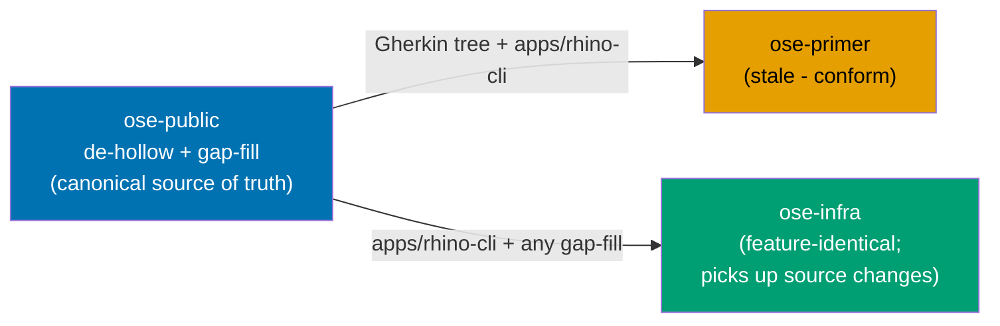
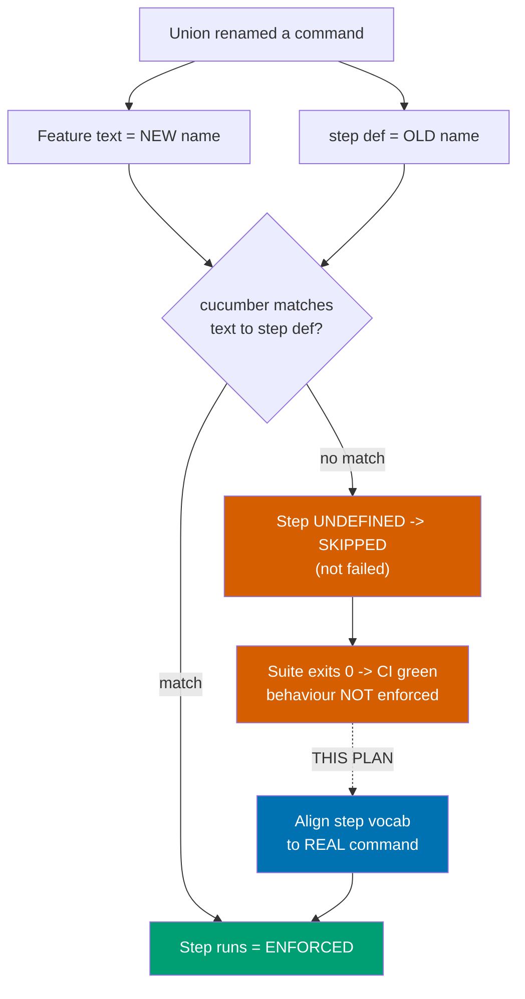
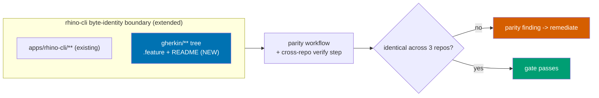

# Technical Design — Enforce Identical, Fully-Enforcing rhino-cli Gherkin

## 1. Verified Current State (2026-07-03)

All facts below are `[Repo-grounded]` — gathered in this plan's pre-work against the working tree.

### 1.1 Source is already identical; only the Gherkin tree drifts

`diff -rq apps/rhino-cli` across the three repos (excluding `target/`, `dist/`) shows **only**
untracked coverage artifacts (`cover.out`, `lcov.info`), `README.md`, and a stray generated `.amazonq/`
dir differ. `src/`, `tests/*.rs`, `Cargo.toml`, `Cargo.lock`, `project.json` are byte-identical — so
the rhino-cli **binary and its cucumber harness are identical** in all three repos.

The behaviour spec they execute lives **outside** that boundary, at
`specs/apps/rhino/behavior/rhino-cli/gherkin/`, and is **not** identical.

### 1.2 Gherkin tree divergence

| Repo         | `.feature` count | Relationship to canonical                                           |
| ------------ | ---------------- | ------------------------------------------------------------------- |
| `ose-public` | 51               | **Canonical** (most-evolved; matches infra exactly)                 |
| `ose-infra`  | 51               | Byte-identical to public (all 51 md5s match)                        |
| `ose-primer` | 30               | **Stale**: ~9 content-diverged, ~23 missing, 2 stale-by-name extras |

`ose-primer`'s 2 stale-by-name files describe **pre-union** command surfaces:

- `env/env-validate.feature` — app-level env drift guard. The canonical tree expresses `env validate`
  via `env-contract/iac-env-validation.feature` (data-driven IaC dispatch); the app-drift
  (declared-but-unread / read-but-undeclared) behaviour is currently covered only by a **plain
  `#[test]`** integration test (`tests/env_validate_integration.rs`), not a cucumber scenario.
- `repo-governance/repo-governance-gherkin-keyword-cardinality.feature` — the command was **renamed** to
  `specs gherkin-cardinality`; no canonical feature covers it.

### 1.3 Enforcement census — 53% of scenarios are hollow

`cargo test --release -p rhino-cli --no-fail-fast` in `ose-public` (exit 0):

| Cucumber binary           | Feature dir bound       | Scenarios | Passed  | **Skipped**   |
| ------------------------- | ----------------------- | --------- | ------- | ------------- |
| `agent_naming_validator`  | `agent-naming/`         | 1         | 1       | 0             |
| `agents`                  | `agents/`               | 28        | 15      | **13**        |
| `contracts`               | `contracts/`            | 8         | 8       | 0             |
| `docs`                    | `docs/`                 | 69        | 26      | **43**        |
| `doctor`                  | `system/`               | 9         | 9       | 0             |
| `env`                     | `env/`                  | 35        | 35      | 0             |
| `env_contract`            | `env-contract/`         | 1         | 1       | 0             |
| `java`                    | `java/`                 | 4         | 4       | 0             |
| `repo_config_data_driven` | `repo-config/`          | 1         | 1       | 0             |
| `repo_config_validate`    | `repo-config-validate/` | 1         | 1       | 0             |
| `repo_governance`         | `repo-governance/`      | 61        | 0       | **61**        |
| `spec_coverage`           | `spec-coverage/`        | 6         | 6       | 0             |
| `workflows`               | `workflows/`            | 4         | 0       | **4**         |
| **TOTAL**                 |                         | **228**   | **107** | **121 (53%)** |

**Root cause of skips**: the [canonical union synthesis](../../done/2026-07-03__unify-rhino-cli-sdlc-parity/audit/feature-union.md)
renamed commands (e.g. `workflows validate-naming` → `repo-governance workflows naming validate`), but
the step-definition strings in the byte-identical `tests/*.rs` still target the **old** names.
cucumber-rs treats an unmatched step as **undefined → skipped**, not failed, so the run stays green.
Concrete example: `workflows-validate-naming.feature` line 10 says
`When the developer runs repo-governance workflows naming validate`, while `tests/workflows.rs:151`
defines `#[when("the developer runs workflows validate-naming")]` — no match → the whole scenario skips.

### 1.4 Unbound feature dirs (never executed)

13 cucumber binaries bind 13 dirs. The tree has 17 dirs. **4 dirs are bound to no binary** and their
scenarios never run: `ddd/` (2 files), `git/` (1), `specs/` (10), `test-coverage/` (3) — 16 `.feature`
files of pure, unexecuted spec.

> Note: `test-coverage/` scenarios exist but its binary was never registered; `spec-coverage/` (bound to
> `spec_coverage.rs`) is a **different** dir. The naming near-collision is a trap to preserve.

## 1.5 Canonical Command Surface (aligned with the 2026-07-01 / 2026-07-03 plans)

This is the authoritative rhino-cli command surface, reconciled against the
[2026-07-03 synthesis ledger](../../done/2026-07-03__unify-rhino-cli-sdlc-parity/audit/synthesis-ledger.md)
and its [command-help baseline](../../done/2026-07-03__unify-rhino-cli-sdlc-parity/audit/primer-behavior-baseline/help/),
then re-verified against the current canonical binary (`ose-public`). [Repo-grounded] Phase 0 re-derives
it via `rhino-cli … --help` recursion; any drift from this table is a Phase-0 finding.

| Top-level group   | Leaf command(s)                                                                                                                      | Behaviour / provenance note                                                                                                                                                        |
| ----------------- | ------------------------------------------------------------------------------------------------------------------------------------ | ---------------------------------------------------------------------------------------------------------------------------------------------------------------------------------- |
| `test-coverage`   | `validate`                                                                                                                           | Verb re-added from infra during the union (absent in pre-synthesis public). `diff`/`merge` are **internal, unit-tested only — NOT CLI verbs**.                                     |
| `repo-governance` | `vendor`, `layer-coherence`, `traceability`, `workflows naming`, `audit`                                                             | `workflows naming` is the renamed `workflows validate-naming` (source of the workflows hollow-skip).                                                                               |
| `md`              | `links`, `mermaid`, `heading-hierarchy`, `naming`, `frontmatter`, `frontmatter-dates`, `readme-index`, `audit`                       | Bound to the `docs/` feature dir (legacy dir name ≠ group name — a hollow-skip contributor).                                                                                       |
| `convention`      | `emoji`, `license`, `audit`                                                                                                          | —                                                                                                                                                                                  |
| `harness`         | `sync`, `naming`, `bindings`, `instruction-size`, `audit`, `claude`, `duplication`                                                   | Bound to the `agents/` feature dir (legacy dir name ≠ group name — a hollow-skip contributor).                                                                                     |
| `specs`           | `audit`, `behavior-coverage`, `structure`, `scaffold dart`, `counts`, `clean java-imports`, `domain-coverage`, `gherkin-cardinality` | `scaffold dart` + `clean java-imports` were dormant public stubs replaced by primer's real impls (ledger). **`gherkin-cardinality` has NO feature today** (gap-fill target, AC-6). |
| `lang`            | `java null-safety-annotations validate`                                                                                              | Formerly a dormant public stub; now the real ported java validator (ledger).                                                                                                       |
| `repo-config`     | `validate`                                                                                                                           | The schema-parity gate command added by the second-pass plan.                                                                                                                      |
| `env`             | `init`, `backup`, `restore`, `validate`, `staged-guard`                                                                              | `validate` = env drift guard (app + IaC dispatch); `staged-guard` currently specced under the unbound `specs/` dir.                                                                |
| `doctor`          | _(leaf — no subcommand)_                                                                                                             | Checks 13 tools in public's canonical set (ledger).                                                                                                                                |

**Feature-dir rename (Decision 4)**: feature dirs whose name mismatches their command group are renamed
to match — confirmed `gherkin/docs/` → `gherkin/md/` and `gherkin/agents/` → `gherkin/harness/`; Phase 0
emits the full mapping for any other mismatch (candidates: `system/` ↔ `doctor`, `agent-naming/` ↔
`harness naming`, `spec-coverage/` ↔ `specs behavior-coverage`, `repo-config-validate/` ↔ `repo-config`).
Each rename retargets the corresponding `feature_dir()` binding in `tests/*.rs` and is captured in the
regenerated golden-master. The rename lands **before** de-hollowing so the step-vocab edits happen once on
the final paths.

**Behaviour-mapping consequence for this plan**: not every unbound/hollow `.feature` maps 1:1 to a CLI
verb. `test-coverage/` carries `diff`/`merge` features whose behaviour is **internal application logic**
(`application/testcoverage/{diff,merge}.rs`), not a CLI subcommand — those scenarios must assert the
internal behaviour (or be scoped to `test-coverage validate`), never invent a non-existent CLI verb.
Phase 0's command-census ↔ feature map records each such case so gap-fill targets the **real** surface.

## 1.6 repo-config schema-parity gate is missing at pre-commit

The `rhino-cli repo-config validate` command (strict `#[serde(deny_unknown_fields)]` deserialize of
`repo-config.yml` against the byte-identical canonical struct — `apps/rhino-cli/src/application/repo_config/mod.rs`,
6× `deny_unknown_fields`) is wired at **pre-push** in all three repos
(`ose-public`/`ose-primer` `.husky/pre-push:10`, `ose-infra` `.husky/pre-push:14`) but at **pre-commit in
none** — despite the [2026-07-03 plan's Decision 5](../../done/2026-07-03__unify-rhino-cli-sdlc-parity/README.md#confirmed-decisions-user-ratified-2026-07-02)
claiming a pre-commit fast-path that "fires when `repo-config.yml` is staged". Verified: zero
`repo-config validate` references in any repo's `.husky/pre-commit`. [Repo-grounded] This is another
claimed-but-undelivered parity item; this plan closes it.

**Target placement (Decision 8, user-ratified)** — `repo-config validate` runs at exactly three points,
byte-identical across all three repos:

1. **pre-commit** — staged-gated, fires only when `repo-config.yml` is staged (fast local feedback).
2. **PR quality gate** — `.github/workflows/pr-quality-gate.yml`.
3. **main quality gate** — `.github/workflows/main-ci.yml`.

It is **removed from `.husky/pre-push`** (currently `ose-public`/`ose-primer` `:10`, `ose-infra` `:14`) —
pre-commit + PR + main replace the pre-push placement (not defense-in-depth-alongside).

Pre-commit step, modeled on the existing lockfile-sync staged-gating (`.husky/pre-commit` Step 4 uses
`git diff --cached --name-only`), placed after the existing `env staged-guard` step:

```sh
# Step N: repo-config schema-parity gate — fires only when repo-config.yml is staged
staged_repo_config=$(git diff --cached --name-only --diff-filter=ACM | grep '^repo-config\.yml$' || true)
if [ -n "$staged_repo_config" ]; then
  cargo run --release --quiet --manifest-path apps/rhino-cli/Cargo.toml -- repo-config validate
fi
```

PR + main gates run it unconditionally (`rhino-cli repo-config validate`) as a standalone step. The exact
step numbers/ordering are finalized in Phase 2 against each repo's current `.husky/pre-commit` +
workflow files.

## 1.7 Test tiers, fail-on-skip & @covers (current state + target)

**Current wiring** [Repo-grounded] (`apps/rhino-cli/project.json`):

- `test:unit` = `cargo test --manifest-path … --lib` — runs only `src/` `#[test]`s, **not** the cucumber
  behaviour suite.
- `test:integration` = `cargo test --manifest-path … --tests` — runs the 13 cucumber binaries. Step defs
  spawn the built binary via `assert_cmd::cargo::cargo_bin("rhino-cli")` + real `git` against temp dirs
  (13/13 use `assert_cmd`).
- `test:quick` (the pre-push gate) = typecheck + lint + `test:unit` + `test:coverage` + `test:specs` —
  **does not include `test:integration`.** So the 228-scenario behaviour suite runs **neither at
  pre-commit nor pre-push**; only on a direct `cargo test`/CI integration invocation.
- Cucumber harness has **no `fail_on_skipped`** — undefined steps skip silently (the hollow-skip hole).

**Target** (Decisions 5–7):

- `test:unit` runs the behaviour suite **in-process against a mocked I/O seam** — a filesystem/git
  abstraction (trait) injected into the core validators (functional-core/imperative-shell). Fast +
  deterministic ⇒ the behaviour suite finally runs in the pre-push `test:quick` gate.
- `test:integration` keeps the temp-fixture/`assert_cmd` binary-spawn suite as the heavier tier.
- Cucumber World configured `.fail_on_skipped()` ⇒ an unimplemented/undefined step is a **red build**.
- Scenarios level-tagged (`@unit`/`@integration`) + `// @covers` markers so `specs behavior-coverage`
  passes meaningfully. Note: a scenario may be tagged for **both** tiers (mocked unit + temp-fixture
  integration); Phase 1 decides the per-scenario envelope and records it in `audit/04-coverage-map.md`.

**Mockable-seam note**: rhino-cli core today does real I/O directly (`std::fs`, `walkdir`, `git` via
process). The seam = introduce trait(s) (e.g. `Fs`, `GitRepo`) with a real impl (imperative shell) and a
mock impl (tests). This is a functional-core/imperative-shell refactor of `apps/rhino-cli/src`, applied
once in `ose-public` and propagated byte-identical to primer + infra (zero carve-outs preserved).

## 2. Canonical Model & Direction

`ose-public` is canonical (most-evolved; already matched by `ose-infra`). Direction of propagation:



Because de-hollowing edits `apps/rhino-cli/tests/*.rs` (inside the byte-identity boundary), the **whole
updated `apps/rhino-cli`** propagates to primer and infra — not just the Gherkin tree — preserving zero
carve-outs.

## 3. The De-Hollow Mechanism (root-cause flow)



**Fix per hollow binary**: in `apps/rhino-cli/tests/<bin>.rs`, update each `#[given]`/`#[when]`/`#[then]`
string to match the canonical feature's step text, and ensure the step body invokes the **real current**
command (e.g. `repo-governance workflows naming validate`). Where the feature text itself is the stale
side, correct the `.feature` instead — the canonical target is: **feature text = step-def string = real
CLI command**, all three consistent. Then the scenario executes and enforces.

**Wiring the 4 unbound dirs**: register a cucumber `[[test]]` binary (harness = false) for each, or bind
them into an existing binary whose `feature_dir()` points at their parent — following the exact pattern
of the 13 existing `tests/*.rs` (each: an async `main()` calling `World::run(feature_dir())` + step
defs). Since the dirs already have `.feature` files, wiring + step defs make them execute.

**Ordering (TDD-shaped)**: for each hollow binary the delivery step is RED (assert the scenario now
executes and fails/mis-asserts because the step is currently undefined) → GREEN (align step vocab so it
executes and passes) → REFACTOR (dedupe step helpers). The RED is observable because a de-hollowed
scenario moves from `skipped` to `passed` (or transiently `failed`) in the cucumber summary.

## 4. Gap-Fill (per-command-group + gap-fill model)

Phase 0 produces the full leaf-command census (from `rhino-cli … --help` recursion) and maps it against
the **canonical command surface in §1.5**. For every leaf command with no executing scenario, author one
**in its existing domain dir** (no tree reshuffle). Known gaps: `specs gherkin-cardinality` (new feature
under `specs/`), and the two behaviours behind primer's stale files re-expressed against current commands
(AC-6). Guardrail from §1.5: gap-fill scenarios target only **real** CLI verbs (or internal behaviour for
non-CLI logic like `test-coverage` diff/merge) — never an invented subcommand.

## 5. Anti-Drift Gate (extend the SDLC parity gate)



Changes (docs/process, no new runtime command):

- [`docs/reference/sdlc-gate-standard.md`](../../../docs/reference/sdlc-gate-standard.md) —
  extend the "rhino-cli byte-identity boundary" section to explicitly include
  `specs/apps/rhino/behavior/rhino-cli/gherkin/**` (`.feature` + `README.md`).
- [`repo-governance/workflows/plan/plan-multi-repo-parity-planning.md`](../../../repo-governance/workflows/plan/plan-multi-repo-parity-planning.md) —
  add a verification step that diffs the Gherkin tree across the three repos (md5 manifest).
- `AGENTS.md` / `CLAUDE.md` byte-identity note updated to mention the Gherkin tree is in-boundary.

## 6. Per-Repo File Impact

| Path                                                                | ose-public                  | ose-primer             | ose-infra            |
| ------------------------------------------------------------------- | --------------------------- | ---------------------- | -------------------- |
| `gherkin/docs/`→`md/`, `gherkin/agents/`→`harness/` (+ Phase-0 map) | `git mv` rename             | Rename to canonical    | Rename to canonical  |
| `apps/rhino-cli/tests/*.rs` (`feature_dir()` rename targets)        | Edit (dir rename)           | Propagate verbatim     | Propagate verbatim   |
| `apps/rhino-cli/tests/*.rs` (step-def vocab)                        | Edit (de-hollow)            | Propagate verbatim     | Propagate verbatim   |
| `apps/rhino-cli/Cargo.toml` (`[[test]]` for wired dirs)             | Edit                        | Propagate verbatim     | Propagate verbatim   |
| `apps/rhino-cli/tests/golden-master/**`                             | Regenerate                  | Propagate verbatim     | Propagate verbatim   |
| `apps/rhino-cli/src/**` (Fs/GitRepo mock seam, FCIS)                | Edit (refactor)             | Propagate verbatim     | Propagate verbatim   |
| `apps/rhino-cli/tests/*.rs` (`.fail_on_skipped()` + mocked unit)    | Edit                        | Propagate verbatim     | Propagate verbatim   |
| `apps/rhino-cli/project.json` (`test:unit` runs mocked behaviour)   | Edit                        | Propagate verbatim     | Propagate verbatim   |
| `specs/apps/rhino/behavior/rhino-cli/gherkin/**/*.feature`          | Edit (de-hollow + gap-fill) | Overwrite to canonical | Sync to canonical    |
| `specs/apps/rhino/behavior/rhino-cli/gherkin/**/README.md`          | Canonical                   | Overwrite to canonical | Sync to canonical    |
| `docs/reference/sdlc-gate-standard.md`                              | Edit (boundary)             | Propagate              | Propagate            |
| `repo-governance/workflows/plan/plan-multi-repo-parity-planning.md` | Edit                        | Propagate              | Propagate            |
| `.husky/pre-commit` (staged-gated `repo-config validate`)           | Edit (add step)             | Add step (identical)   | Add step (identical) |
| `.husky/pre-push` (remove `repo-config validate`)                   | Edit (remove step)          | Remove step            | Remove step          |
| `.github/workflows/pr-quality-gate.yml` (`repo-config validate`)    | Edit (add step)             | Add step               | Add step             |
| `.github/workflows/main-ci.yml` (`repo-config validate`)            | Edit (add step)             | Add step               | Add step             |

## 7. Divergence Policy (unchanged)

`apps/rhino-cli` + the Gherkin tree = **zero carve-outs**, byte-identical. Sanctioned divergence stays:
each repo's app/language set, infra-only IaC gates, the self-hosted runner label (CI-workflow layer), and
`repo-config.yml` **data values** (identical schema enforced by the schema-parity gate).

## 8. Rollback

Each phase is a natural pause with a green gate. If a phase gate fails and cannot be root-caused quickly,
`git restore`/`git revert` the phase's commits in that repo — the prior commit is a coherent, green state
(baseline recorded in Phase 0). No cross-repo push happens until each repo passes its own gate, so a
failure in one repo never leaves another mid-applied.

## 9. Open Questions

_None — all three design forks resolved via pre-write grilling (see README §Confirmed Decisions)._
