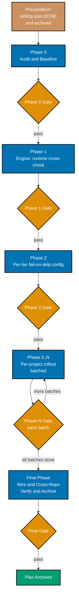

# Delivery Checklist — Enforce Repo-Wide Gherkin Scenario Implementation

> **Legend** — `[AI]`: an agent performs the step (the default; unmarked steps are `[AI]`).
> `[HUMAN]`: only a human can do it (physical action, out-of-band approval, real-secret handling).
> `[AI+HUMAN]`: agent prepares, human approves or finishes.

**Precondition (hard gate)**: [`enforce-identical-rhino-cli-gherkin`](../../done/2026-07-04__enforce-identical-rhino-cli-gherkin/README.md)
is **DONE and archived** (rhino-cli fully enforcing, `fail_on_skipped` on, `@covers` complete, tiers
wired). Do not start Phase 1 until that plan is in `plans/done/`.

## Worktree

Worktree path: `worktrees/enforce-repo-wide-scenario-implementation/`

Optional manual pre-provisioning (run from repo root):

```bash
claude --worktree enforce-repo-wide-scenario-implementation
```

The plan-execution Step 0 gate enters this worktree by default: it auto-provisions from the latest
`origin/main` when missing, syncs before implementing, and prompts before deleting after archival. The
engine change (Phase 1) propagates to `ose-primer`/`ose-infra` in their own trees on `main`; per-project
rollout batches run in each repo for its own apps/libs.

See [Worktree Path Convention](../../../repo-governance/conventions/structure/worktree-path.md) and
[Plans Organization Convention §Worktree Specification](../../../repo-governance/conventions/structure/plans.md#worktree-specification).

## Delivery Phase Flow



---

## Phase 0 — Audit & Baseline (all three repos)

> Every audit item below runs **once per repo** (`ose-public`, `/Users/wkf/ose-projects/ose-primer`,
> `/Users/wkf/ose-projects/ose-infra`) against that repo's own `repo-config.yml` `coverage.projects`
> registry. Each `audit/0*.md` artifact carries one section per repo (or three separate files
> `0N-<name>-{public,primer,infra}.md` — either is acceptable as long as all three repos are covered and
> the split is explicit).

- [x] [AI] Provision + toolchain in all three repos: `npm install && npm run doctor -- --fix` in
      `ose-public`, then the same in `ose-primer` and `ose-infra`. Acceptance: all tools OK in all three.
      **Done 2026-07-04.** 13/13 tools OK in all three repos.
- [x] [AI] Confirm the dependency plan is archived: `test -d plans/done/*enforce-identical-rhino-cli-gherkin`
      in `ose-public` (the dependency plan is `ose-public`-authored only). Acceptance: present; otherwise STOP.
      **Done 2026-07-04.** Present at `plans/done/2026-07-04__enforce-identical-rhino-cli-gherkin/`.
- [x] [AI] **Scenario census (3 repos)**: per project in each repo's own `repo-config.yml`
      `coverage.projects` (26 in `ose-public`, 25 in `ose-primer`, 8 in `ose-infra`), count scenarios +
      current level tags → `audit/01-scenario-census.md`. Acceptance: every eligible project in all three
      repos has a row (59 rows total).
      **Done 2026-07-04.** Delegated to 3 parallel agents (one per repo); written as
      `audit/01-scenario-census-{public,primer,infra}.md`. All 59 rows present. Totals: 816 scenarios
      (`ose-public`), 529 (`ose-primer`), 352 deduped (`ose-infra`). **Major finding**: literal per-scenario
      level tags (`@unit`/`@integration`/`@e2e`) are nearly absent repo-wide (21/816 in public, 13/529 in
      primer, 13/352 in infra — all inside rhino-cli's own meta-specs) — every other project relies
      entirely on the `coverage.projects` registry's `levels:` field, not per-scenario tags. **Second major
      finding**: 18 of `ose-public`'s 26 registry entries have a `specs:` glob that matches **zero files on
      disk** (e.g. `ose-www`'s `specs/apps/ose/behavior/www/**` — the real directory is
      `specs/apps/ose/behavior/platform-web/`) — a pre-existing `repo-config.yml` drift bug, independently
      verified. Each mismatched project's real specs path was resolved via its own `project.json` and
      documented in the census.
- [x] [AI] **@covers adoption census (3 repos)**: `git grep -l "@covers " -- apps libs` grouped by project,
      run in each repo → `audit/02-covers-adoption.md`. Acceptance: reproduces the rhino-cli-only finding
      (or its correction) per repo.
      **Done 2026-07-04.** Written as `audit/02-covers-adoption-{public,primer,infra}.md`. Confirmed in all
      three: `@covers` markers exist only inside `apps/rhino-cli/` itself (self-testing its own coverage
      engine's meta-specs), 0 adoption in any other project.
- [x] [AI] **Per-tier skip inventory (3 repos)**: find `.skip`/`.only`/`.todo` (Jest/Vitest/Playwright), F#
      `Skip =`/ignored tests, undefined cucumber steps, and — in `ose-primer` — the language-specific skip
      markers from tech-docs.md §3.1 (Kaocha pending metadata, ExUnit `@tag :skip`, Go `t.Skip()`, JUnit5
      `@Disabled`, pytest `@pytest.mark.skip`, Cargo `#[ignore]`, Dart `skip:`, cucumber-js
      undefined/pending steps), across each repo → `audit/03-skip-inventory.md`. Acceptance: the backlog
      of currently-skipped tests is quantified per repo.
      **Done 2026-07-04.** Written as `audit/03-skip-inventory-{public,primer,infra}.md`. Backlog is nearly
      empty across all 3 repos and all 12 ecosystems (0 skips/ignores/disables everywhere checked). One
      real exception found: `ose-primer`'s `crud-be-ts-effect` cucumber-js suite has 20 undefined steps
      across 4 scenarios (reproduced by direct execution).
- [x] [AI] **behavior-coverage vacuity check (3 repos)**: in `ose-public`, run
      `nx run organiclever-be:specs:behavior:coverage` (a non-rhino sample); in `ose-primer`, run
      `nx run crud-be-rust-axum:specs:behavior:coverage` (or any other non-rhino project); in `ose-infra`,
      run `nx run coralpolyp-be:specs:behavior:coverage`; record whether each passes vacuously (no
      markers) or fails → `audit/04-vacuity.md`. Acceptance: Open Question in tech-docs §7 resolved for
      all three repos.
      **Done 2026-07-04.** Written as `audit/04-vacuity-{public,primer,infra}.md`. Open Question resolved
      **identically in all three repos**: `specs:behavior:coverage` passes genuinely, but via a legacy
      step-text pattern-matching scanner (`application::speccoverage`) — NOT via the `@covers`-marker/
      per-level engine (`application::behavior_coverage::validator`), which is fully built and unit-tested
      but is **dead code from the live command's perspective** (confirmed by tracing the call path and by
      an in-repo doc-comment admission at `apps/rhino-cli/tests/specs_tree.rs:6-16`). This confirms Phase
      1's premise precisely: the engine needs **wiring into the live command**, not invention from scratch.
- [x] [AI] **Reporter availability (3 repos, all language ecosystems)**: for each tier tool in
      tech-docs.md §3.1's table (cucumber-rs, Jest/Vitest, Playwright, .NET xunit, Cargo `#[ignore]`,
      cucumber-js, Kaocha, ExUnit, Go `testing`, JUnit5, pytest, Dart/Flutter `test`), confirm a
      machine-readable (JSON/TRX) reporter + the fail-on-skip flag or grep-guard approach via
      `--help`/docs → `audit/05-reporters.md`. Acceptance: per-tool mechanism confirmed (verified, not
      assumed) for every ecosystem present in any of the three repos.
      **Done 2026-07-04.** Written as `audit/05-reporters-{public,primer,infra}.md`. All 12 tools verified
      via real `--help`/docs/empirical runs — **no tool has a built-in "fail the build on skip" flag**; a
      custom guard (grep-based or JSON-reporter-based) is required for every ecosystem. Notable surprises:
      cucumber-js's `--strict` flag does NOT catch undefined steps despite its own `--help` text claiming
      otherwise (empirically proven 3 ways); Kotlin/Gradle has JUnit XML reporting **deliberately disabled**
      (a Gradle bug workaround); Cargo's JSON/JUnit test output formats are nightly-only.

### Phase 0 Gate

- [x] [AI] Per repo: `nx affected -t test:quick,lint,typecheck --base=origin/main` — exits 0 in
      `ose-public`, `ose-primer`, and `ose-infra`.
      **Done 2026-07-04.** All three: "No tasks were run" (exit 0) — Phase 0 is audit-only, no code
      changed yet.
- [x] [AI] All five `audit/0*.md` committed (in `ose-public`, since this plan is authored there); each
      covers all three repos explicitly; the rollout backlog is sized per repo.
      **Done 2026-07-04.** 15 files committed (5 deliverables × 3 repos, split as
      `0N-<name>-{public,primer,infra}.md` per the plan's own "either is acceptable" clause).

> **Pause Safety**: audit-only, no behaviour change. Safe to stop. To resume: re-run the census commands
> in all three repos.

---

## Phase 1 — behavior-coverage runtime cross-check (engine)

> Suggested executor: `swe-rust-dev`. rhino-cli's own now-enforcing suite is the first consumer.
>
> **Corrected integration point (Phase 0 finding, `audit/04-vacuity-*.md`)**: the live
> `specs behavior-coverage validate` command dispatches
> `cli.rs`'s `SpecsBehaviorCoverageCommands::Validate` → `commands::specs_coverage::run` →
> `application::speccoverage::checker::check_all` — it never calls
> `application::behavior_coverage::validator`, which is fully built, unit-tested, and **dead code** from
> the live command's perspective. The steps below wire the runtime cross-check into the LIVE path
> (`commands::specs_coverage::run` / `application::speccoverage`), not the parallel dead module.

- [x] [AI] **RED**: add a new scenario to
      `specs/apps/rhino/behavior/rhino-cli/gherkin/specs/behavior-coverage.feature` ("a scenario with a
      valid `@covers` marker whose covering test was skipped at runtime FAILS `behavior-coverage`") and a
      matching failing integration test in `apps/rhino-cli/tests/spec_coverage.rs` (the existing
      cucumber-rs binary bound to this feature file — NOT a unit test inside
      `application/behavior_coverage/validator.rs`, since that module is not on the live call path) that
      invokes the real `rhino-cli specs behavior-coverage validate` CLI end-to-end against a fixture repo
      containing a `@covers`-marked scenario whose test is skipped at runtime, tagged
      `// @covers specs/apps/rhino/behavior/rhino-cli/gherkin/specs/behavior-coverage.feature:<scenario
title>`. Command: `cargo test -p rhino-cli --test spec_coverage`. Acceptance: new scenario fails
      (cross-check not implemented; command currently only checks step-text traceability).
  - **Gherkin (binds) →** "A marked-but-unexecuted scenario fails the central gate" (AC-2)

    ```gherkin
    Scenario: A marked-but-unexecuted scenario fails the central gate
      Given a scenario with a valid @covers marker whose covering test is skipped at runtime
      When rhino-cli specs behavior-coverage validate runs with the runtime cross-check
      Then the gate fails and names the scenario as marked-but-not-executed
      And the gate passes only when every @covers scenario executed and passed at each declared level
    ```

  - **Done 2026-07-04.** **Further integration-point correction found while implementing** (the kind
    Phase 0's own note anticipated): `gherkin/specs/behavior-coverage.feature` is bound to
    `tests/specs_tree.rs`, which drives `application::behavior_coverage::validator::validate` **in-process**
    (never spawns the CLI) — not `tests/spec_coverage.rs`, which is bound instead to the sibling directory
    `gherkin/spec-coverage/spec-coverage-validate.feature` and drives the compiled `rhino-cli` binary as a
    real subprocess (`assert_cmd::cargo::cargo_bin`), asserting on stdout/exit code. Since the acceptance
    criteria explicitly require driving the real CLI end-to-end (not the internal engine), the 3 new
    scenarios below were added to `gherkin/spec-coverage/spec-coverage-validate.feature` instead, with
    `tests/spec_coverage.rs`'s new step fns carrying `@covers` markers pointing at that corrected path.
    Added 3 scenarios, not 1 (RED's minimum): "A marked-but-unexecuted scenario fails the runtime
    cross-check" (the not-executed case), "A marked-but-failed scenario fails the runtime cross-check"
    (executed-but-failed), and "A marked-and-passed scenario passes the runtime cross-check" (the positive
    control, proving the check isn't vacuously always-fail). All 3 drive `rhino-cli specs behavior-coverage
validate` in three-level mode (`--unit-dir`/`--integration-dir`/`--e2e-dir`) plus new
    `--unit-report`/`--integration-report`/`--e2e-report` flags (didn't exist pre-GREEN) pointing at a
    JSON run-report fixture. Verified genuine RED by `git stash`-ing every `src/` change (keeping the test
    and feature-file additions) and re-running: all 3 new scenarios failed (`--unit-report` unrecognized by
    clap, exit 2) while the 6 pre-existing scenarios stayed green; `git stash pop` restored GREEN.

- [x] [AI] **GREEN**: implement the runtime cross-check as a new function in
      `apps/rhino-cli/src/application/speccoverage/checker.rs` (or a new sibling file
      `apps/rhino-cli/src/application/speccoverage/runtime_check.rs`, declared via
      `pub mod runtime_check;` in `apps/rhino-cli/src/application/speccoverage/mod.rs` if kept separate),
      invoked from `commands::specs_coverage::run` immediately after the existing
      `checker::check_all` traceability check — ingest each tier's JSON run report and assert each
      `@covers` scenario executed AND passed at its level, failing the command if not. The existing
      per-level `@covers`-parsing types/logic already built in
      `apps/rhino-cli/src/application/behavior_coverage/` MAY be reused/imported by this new code (it is
      correct, just previously unreachable) — do not duplicate it from scratch. Command: same. Acceptance:
      new scenario passes; existing suite green; `specs behavior-coverage validate` now genuinely fails on
      a marked-but-skipped scenario (manually verify with a throwaway fixture, then revert the fixture).
  - **Done 2026-07-04.** Implemented as the sibling file `application/speccoverage/runtime_check.rs`
    (`TierInput`, `check_runtime`), wired into a new `commands::specs_coverage::run_three_level` pass
    (`check_runtime_cross_check`) that runs immediately after the per-level step-text loop — reachable
    only in three-level mode (the only mode where "level" has concrete per-scenario meaning; confirmed via
    `project.json` grep that zero real Nx targets use three-level mode today, so this is additive). Also
    added `application/behavior_coverage/extract.rs` (new: `extract_covers_markers` scans a dir for
    `// @covers <path>:<title>`-shaped lines regardless of comment syntax; `extract_scenario_specs` parses
    `@unit`/`@integration`/`@e2e`/`@wip` tags from `.feature` files) — neither extraction existed before;
    the existing `behavior_coverage` module only had hand-built-struct unit tests, never real file
    parsing. Reused (not duplicated): `TestLevel`/`CoversMarker`/`ScenarioSpec`/`ProjectEnvelope` types and
    `validator::validate`'s matching logic verbatim. **Also wired `validator::validate` itself into the
    live command** (`check_covers_markers` in `commands/specs_coverage.rs`) — de-hollowing it fully, not
    just its types. Both new checks are gated behind supplying at least one `--<level>-report` flag
    (`covers_enabled` in `run_three_level`) — without this gate, the pre-existing
    `three_level_passes_when_all_levels_covered` unit test (an untagged fixture scenario) would have newly
    failed on `UntaggedScenario`; this was caught by running the full test suite before finalizing, per
    Iron Rule 3. Verified: all 9 `spec_coverage` scenarios green, full `cargo test -p rhino-cli` green
    (1139 passed, 1 pre-existing ignored, 0 regressions), manually confirmed the 3-scenario fixture set
    exercises skip/fail/pass without needing a separate throwaway.
- [x] [AI] **REFACTOR**: factor the per-tier report parsers behind one trait, and reconcile/merge the
      `application::behavior_coverage` module's per-level matching logic with `application::speccoverage`'s
      traceability logic — do not leave two structurally similar, uncoordinated coverage engines. Command:
      same. Acceptance: all green; `cargo clippy` reports no new dead-code warnings for the reconciled
      modules.
  - **Done 2026-07-04.** Added `RunReportParser` trait + `JsonRunReportParser` impl (the only parser the
    engine ships with today; opens the seam for a future `.NET` TRX/etc. parser without touching
    `check_runtime`) and `check_runtime_with` (pluggable variant), proven by a second, non-JSON
    `AlwaysPassedParser` test impl. Reconciled the two engines by making `commands::specs_coverage::run`
    the single call site for all three checks (legacy step-text traceability, `@covers` marker-existence
    via `validator::validate`, and the new runtime cross-check) — `application::behavior_coverage` is no
    longer dead code from the live command's perspective. Corrected the now-stale doc-comment admission at
    `tests/specs_tree.rs:1-16` (it used to assert the `@covers` engine was permanently CLI-unreachable;
    updated to note the CLI now reaches it too, and that `specs_tree.rs`'s own in-process style is a
    deliberate testing choice, not a workaround for unreachability). Promoted `TestLevel` to `Copy`
    (clippy's `needless_pass_by_value`/`clone_on_copy` flagged the alternative), removing several
    redundant `.clone()` calls in the pre-existing `validator.rs` too. `cargo clippy --all-targets -- -D
warnings`: 0 issues. `cargo fmt --check`: clean. `cargo test -p rhino-cli`: 1139 passed, 1 ignored,
    0 failed (both debug and `--release`).
- [x] [AI] Regenerate the golden-master: `cargo test --release -p rhino-cli --test golden_master` (per
      `enforce-identical-rhino-cli-gherkin/delivery.md` §"1i. Regenerate golden-master"); review the diff
      for intent before freezing. Propagate the byte-identical `apps/rhino-cli/` to ose-primer and
      ose-infra using the dependency plan's exact Phase 3/Phase 4 commands. Command (ose-primer):
      `rsync -a --delete --exclude=target --exclude=dist --exclude=cover.out --exclude=lcov.info
/Users/wkf/ose-projects/ose-public/apps/rhino-cli/ /Users/wkf/ose-projects/ose-primer/apps/rhino-cli/`.
      Command (ose-infra):
      `rsync -a --delete --exclude=target --exclude=dist --exclude=cover.out --exclude=lcov.info
/Users/wkf/ose-projects/ose-public/apps/rhino-cli/ /Users/wkf/ose-projects/ose-infra/apps/rhino-cli/`.
      Acceptance: `diff -rq --exclude=target --exclude=dist apps/rhino-cli
../ose-primer/apps/rhino-cli` and the equivalent comparison against `ose-infra` show only
      untracked-artifact/README diffs.
  - **Done 2026-07-04.** `cargo test --release -p rhino-cli --test golden_master`: passed, **zero diff**
    (`git status --porcelain apps/rhino-cli/tests/golden-master/` empty) — same root cause class as the
    dependency plan's own regeneration: the 2 manifest entries exercising
    `specs {behavior,domain}-coverage validate --help` actually freeze a pre-existing "missing required
    `<PATHS>` positional" clap error (exit 2) that occurs _before_ per-arg help text would ever render, so
    the 3 new optional `--<level>-report` flags don't change the frozen output at all. Ran both rsync
    commands, **plus** the dependency plan's Phase 3/4 Gherkin-tree rsync
    (`specs/apps/rhino/behavior/rhino-cli/gherkin/` → each sibling repo) since this Phase's RED step
    modified that tree and `docs/reference/sdlc-gate-standard.md#rhino-cli-byte-identity-boundary` binds
    it into the same byte-identity requirement. **Caught and fixed a propagation bug**: the plain
    `apps/rhino-cli/` rsync also overwrote each sibling repo's own intentionally-diverged
    `apps/rhino-cli/README.md` (outside the boundary per that same doc — it excludes README.md from the
    `src/`/`Cargo.toml`/`Cargo.lock`/`project.json`/`LICENSE` list) with `ose-public`'s copy, re-introducing
    a dangling link to a public-only migration-plan doc the dependency plan had deliberately removed in
    both siblings; reverted via `git checkout -- apps/rhino-cli/README.md` in both repos. Final
    `diff -rq --exclude=target --exclude=dist` against both siblings shows only `README.md` +
    `cover.out`/`lcov.info` diffs (all sanctioned); `src/`, `tests/`, `Cargo.toml`, `Cargo.lock`,
    `project.json`, `LICENSE` all byte-identical (explicit per-file `diff` + `diff -rq` on `src/`/`tests/`);
    the Gherkin tree diff is fully empty in both siblings.

### Phase 1 Gate

- [x] [AI] `cargo test -p rhino-cli` green in all three repos; golden-master passes.
  - **Done 2026-07-04.** `ose-public`: 1139 passed, 1 ignored (debug and `--release`). `ose-primer`: 1139
    passed, 1 ignored. `ose-infra`: 1139 passed, 1 ignored. `cargo clippy --all-targets -- -D warnings` and
    `cargo fmt --check` clean in all three (rhino-cli source is byte-identical, so this reruns the exact
    same checks against the exact same code). Golden-master (one of the 7 test suites `cargo test -p
rhino-cli` runs) passes with zero corpus diff in all three.
- [x] [AI] `apps/rhino-cli` byte-identical across the three repos.
  - **Done 2026-07-04.** Confirmed via per-file `diff` (`Cargo.toml`, `Cargo.lock`, `project.json`,
    `LICENSE`) and `diff -rq` (`src/`, `tests/`) against both siblings — all empty. Gherkin behavior tree
    (`specs/apps/rhino/behavior/rhino-cli/gherkin/`) `diff -rq` also empty against both siblings. Only
    sanctioned divergence remains: `README.md` (explicitly outside the boundary) and untracked coverage
    artifacts (`cover.out`, `lcov.info`).

> **Pause Safety**: engine landed + parity-verified; no per-project rollout yet. Safe to stop. To resume:
> `cargo test -p rhino-cli`.

---

## Phase 2 — Per-tier fail-on-skip config (repo-wide, all three repos + every language ecosystem)

> Sub-phases 2a (`ose-public`-shared tooling) and 2b (`ose-primer`'s language-showcase-specific tooling)
> and 2c (`ose-infra`) are independent — each lands as its own coherent green commit per
> tech-docs.md §6 Rollback.

- [ ] [AI] **2a.** Jest/Vitest: enable `--forbid-only` (or config) and a skip-guard so `.skip`/`.todo` fail
      in CI, applied in `ose-public` (its own TS apps), `ose-infra` (`coralpolyp-fe`), and `ose-primer`
      (`crud-fe-ts-nextjs`, `crud-fe-ts-tanstack-start`, `crud-be-ts-effect` unit tier), per
      `audit/05-reporters.md`. Verify by planting a `.skip` and running the affected unit tier in one
      representative project per repo — it reddens; revert. Acceptance: skip fails the tier in all three
      repos.
- [ ] [AI] **2a.** Playwright: `forbidOnly: !!process.env.CI` is already set in all 11
      `apps/*-e2e/playwright.config.ts` in `ose-public` — confirm the same in `ose-infra`'s and
      `ose-primer`'s own `-e2e` configs (add if missing), then add only the missing `test.skip`
      guard/reporter to each, in all three repos. Verify by planting a skip — e2e tier reddens in a
      representative project per repo; revert. Acceptance: skip fails the tier in all three repos.
- [ ] [AI] **2a.** .NET xunit (F#/C#): all four `ose-public` F# test surfaces —
      `apps/organiclever-be/tests/{unit,integration}/*.fsproj`,
      `apps/ose-be/tests/{unit,integration}/*.fsproj`, `apps/crane-cli/tests/{unit,integration}/*.fsproj`,
      `libs/fsharp-crane-core/tests/unit/*.fsproj` — plus, in `ose-primer`,
      `apps/crud-be-fsharp-giraffe/tests/DemoBeFsgi.Tests/DemoBeFsgi.Tests.fsproj` and
      `apps/crud-be-csharp-aspnetcore/tests/DemoBeCsas.Tests/DemoBeCsas.Tests.csproj` — have no
      CI-forbid-only equivalent, so add a fail-on-skip guard as a grep check for the xunit `Skip =`
      attribute: `grep -rn 'Skip\s*=' apps/organiclever-be/tests apps/ose-be/tests apps/crane-cli/tests
libs/fsharp-crane-core/tests` (in `ose-public`) and `grep -rn 'Skip\s*=' apps/crud-be-fsharp-giraffe/tests
apps/crud-be-csharp-aspnetcore/tests` (in `ose-primer`) must each return 0 matches, wired into each
      project's test target per `audit/05-reporters.md`. Verify by planting `[Fact(Skip = "temp")]` in one
      test file in each repo — the grep check catches it and fails the tier; revert. Acceptance: ignored
      test fails the tier in both repos.
- [ ] [AI] **2a.** (cucumber-rs already fail-on-skip via the dependency plan, in all three repos — confirm
      still active.)
- [ ] [AI] **2c.** Cargo `#[ignore]` (Rust, non-cucumber): `ose-infra`'s `coralpolyp-be` and
      `ose-primer`'s `crud-be-rust-axum` — add a grep-based guard (`grep -rn '#\[ignore\]'` returns 0
      matches in each project's `src`/`tests`), wired into each project's test target per
      `audit/05-reporters.md`. Verify by planting `#[ignore]` on one test in each project — the grep check
      catches it; revert. Acceptance: ignored test fails the tier in both projects.
- [ ] [AI] **2b.** cucumber-js (TS): `ose-primer`'s `crud-be-ts-effect` BDD suite — confirm and wire the
      flag/reporter identified in `audit/05-reporters.md` that turns undefined/skipped/pending steps into
      a non-zero exit. Verify by planting an undefined step — the suite reddens; revert. Acceptance:
      undefined/skipped step fails the tier.
- [ ] [AI] **2b.** Kaocha (Clojure): `ose-primer`'s `crud-be-clojure-pedestal` — confirm and wire the
      config/flag identified in `audit/05-reporters.md` for pending/skipped test metadata. Verify by
      planting a `^:kaocha.testable/skip` (or equivalent) test — the suite reddens; revert. Acceptance:
      skipped test fails the tier.
- [ ] [AI] **2b.** ExUnit (Elixir): `ose-primer`'s `crud-be-elixir-phoenix` — confirm and wire the
      config/flag identified in `audit/05-reporters.md` (e.g. `mix test --warnings-as-errors` or a
      skip-tag guard). Verify by planting `@tag :skip` on a test — the suite reddens; revert. Acceptance:
      skipped test fails the tier.
- [ ] [AI] **2b.** Go `testing`: `ose-primer`'s `crud-be-golang-gin` — add a grep-based guard
      (`grep -rn 't\.Skip('` returns 0 matches in scope) or the JSON-reporter approach identified in
      `audit/05-reporters.md`. Verify by planting `t.Skip("temp")` on a test — the guard catches it;
      revert. Acceptance: skipped test fails the tier.
- [ ] [AI] **2b.** JUnit5: `ose-primer`'s `crud-be-java-springboot`, `crud-be-java-vertx`, and
      `crud-be-kotlin-ktor` — add a grep-based guard (`grep -rn '@Disabled'` returns 0 matches per
      project) or the Surefire/Gradle-report approach identified in `audit/05-reporters.md`. Verify by
      planting `@Disabled` on one test per project — the guard catches it; revert. Acceptance: disabled
      test fails the tier in all three projects.
- [ ] [AI] **2b.** pytest: `ose-primer`'s `crud-be-python-fastapi` — add `pytest --strict-markers` plus a
      grep-based guard (`grep -rn '@pytest\.mark\.skip'` returns 0 matches) per `audit/05-reporters.md`.
      Verify by planting `@pytest.mark.skip` on a test — the guard catches it; revert. Acceptance: skipped
      test fails the tier.
- [ ] [AI] **2b.** Dart/Flutter `test`: `ose-primer`'s `crud-fe-dart-flutterweb` — add a grep-based guard
      (`grep -rn 'skip:\s*true'` returns 0 matches) or the JSON-reporter approach identified in
      `audit/05-reporters.md`. Verify by planting `skip: true` on a test — the guard catches it; revert.
      Acceptance: skipped test fails the tier.

### Phase 2 Gate

- [ ] [AI] Each tier, in every one of the three repos, reddens on a planted skip (evidence in
      `audit/06-fail-on-skip-proof.md`, one row per tool per repo).
- [ ] [AI] Per repo: `nx affected -t test:quick --base=origin/main` — exits 0 in `ose-public`,
      `ose-primer`, and `ose-infra` (no unexpected skips remain in-scope).

> **Pause Safety**: every tier, in all three repos, now fails on skip; `@covers` rollout not yet begun.
> Safe to stop. To resume: re-run the planted-skip proofs.

---

## Phase 3..N — Per-project @covers + level-tag rollout (batched, all 59 projects across 3 repos)

> Repeat this phase per project batch from `audit/01`/`02`, drawn from **all 59 eligible projects across
> all three repos** (`ose-public`'s 26, `ose-primer`'s 25, `ose-infra`'s 8) — one bounded group per phase
> (e.g. one domain, one lib, or — for `ose-primer`'s `crud-be-*`/`crud-fe-*`/`crud-fs-*`/polyglot-lib set
> — one language variant per phase, per tech-docs.md §4's batching model). Suggested executor: the
> project's language dev agent.
> Every `nx run <project>:...` command below runs **from that project's own repo root**
> (`ose-public`, `ose-primer`, or `ose-infra` — whichever repo the batch's project lives in).

For each project in the batch:

- [ ] [AI] Level-tag every scenario in the project's `specs/**` features (`@unit`/`@integration`/`@e2e`)
      per its `coverage.projects` envelope. **No defer, no shortcut** (Decision 4): no scenario is
      `@wip`-tagged, skipped, or parked — all are implemented in this batch. Command:
      `rhino-cli specs behavior-coverage validate`. Acceptance: no untagged findings; zero `@wip`.
- [ ] [AI] Add `// @covers <spec-path>:<scenario-title>` markers to the project's tests at each declared
      level, for every scenario whose behaviour **already exists** (marker-only path — no TDD cycle
      needed since the test is added against passing production code). Command:
      `nx run <project>:test:unit` (+`:test:integration`/`:test:e2e` as applicable) then
      `nx run <project>:specs:behavior:coverage`. Acceptance: cross-check passes for these scenarios.
- [ ] [AI] For every scenario the runtime cross-check reveals as **unimplemented** (behaviour missing, not
      merely untested), run a full TDD cycle instead of the marker-only path above:
  - [ ] [AI] **Conditional UI-design-funnel**: if this project is `ose-www`, `ose-app-web`,
        `organiclever-www`, `organiclever-app-web`, or one of their `-e2e` counterparts; `ose-primer`'s
        `crud-fe-dart-flutterweb`, `crud-fe-ts-nextjs`, `crud-fe-ts-tanstack-start`, `crud-fs-ts-nextjs`,
        or `crud-fe-e2e`; or `ose-infra`'s `coralpolyp-fe`/`coralpolyp-fe-e2e` — AND the missing
        behaviour requires building a genuinely new user-facing screen or component (not merely new
        backend/CLI logic behind an existing screen), run the UI-design-funnel (diverge → narrow → select
        → justify, per the
        [UI Mockups in Plan Docs convention](../../../repo-governance/conventions/formatting/diagrams.md#ui-mockups-in-plan-docs))
        BEFORE the RED step below, recording it in this plan's `prd.md` and `assets/`: ≥2 named low-fi
        alternatives, 2 hi-fi `.excalidraw.png` finalists, an explicit selection + rationale, a stated
        mobile/tablet/desktop responsive strategy, an R5 grounding note (survey the project's own repo's
        UI kit — `ose-public`'s `libs/web-ui`, or `ose-primer`'s/`ose-infra`'s own `ts-ui`/`ts-ui-tokens`
        — and sibling screens; name any net-new component), and an R7 prior-art citation (a
        `web-researcher` survey of comparable tools). Not applicable when the marker-only path (the
        earlier `@covers`-marker checkbox) was used instead, or when the missing behaviour reuses an
        existing screen/component with no net-new UI. Acceptance: the funnel record is committed in
        `prd.md` before RED is written, or this checkbox is ticked with an explicit one-line
        "N/A — <reason>" note.
  - [ ] [AI] **RED**: write the failing test for the scenario in the project's test suite at its declared
        level(s), tagged `// @covers <spec-path>:<scenario-title>`. Add a `**Gherkin (binds) →**
"<scenario title>"` annotation to this checkbox plus the scenario's verbatim
        Given/When/Then block (copied exactly from the project's `.feature` file), per the
        Gherkin-tagged-delivery-steps convention this plan's own Phase 1 RED step follows. Command:
        `nx run <project>:test:unit` (or the scenario's declared-level target). Acceptance: test fails,
        naming the missing behaviour.
  - [ ] [AI] **GREEN**: implement the minimum production code in the project's source to make the test
        pass. Command: same. Acceptance: test passes; no other tests broken.
  - [ ] [AI] **REFACTOR**: clean up the new implementation and test. Command: same, then
        `nx run <project>:specs:behavior:coverage`. Acceptance: all green, cross-check passes — every
        scenario executed and passed at its levels; zero silent skips.
  - [ ] [AI] **Conditional Rule-15/16 retest**: if this project is `ose-www`, `ose-app-web`,
        `organiclever-www`, `organiclever-app-web`, or one of their `-e2e` counterparts; `ose-primer`'s
        `crud-fe-dart-flutterweb`, `crud-fe-ts-nextjs`, `crud-fe-ts-tanstack-start`, `crud-fs-ts-nextjs`,
        or `crud-fe-e2e`; or `ose-infra`'s `coralpolyp-fe`/`coralpolyp-fe-e2e` — AND the behaviour
        just built above is genuinely new user-facing UI behaviour, run the Rule-15 three-tester retest
        (`web-exploratory-tester` + `web-usability-tester` + `web-design-tester` via the
        `web-ux-test-fixing-planning` workflow, `output-mode: delivery`, this plan's `plan-path`) against
        the running app before this batch's gate passes; fix every `EWT-###`/`UWT-###`/`DWT-###` defect
        finding. If this project is `ose-be`, `organiclever-be`, one of `ose-primer`'s eleven
        `crud-be-*` variants, or `ose-infra`'s `coralpolyp-be` — AND the behaviour just built
        exposes/changes a REST or GraphQL endpoint, run `api-exploratory-tester` instead
        (`output-mode: delivery`, this plan's `plan-path`) and fix every `AET-###` defect finding. Not
        applicable when the marker-only path (the earlier `@covers`-marker checkbox) was used instead (no
        behaviour change) or when the built behaviour has no UI/API surface (e.g. a pure lib). Acceptance:
        retest ran and every defect finding is fixed and ticked, or this checkbox is ticked with an
        explicit one-line "N/A — <reason>" note.

### Phase N Gate (each batch)

- [ ] [AI] `nx run <project>:specs:behavior:coverage` — exit 0, non-vacuous (markers present).
- [ ] [AI] `nx affected -t test:quick,specs:behavior:coverage --base=origin/main` — exits 0.
- [ ] [AI] **Zero deferrals**: the project has no `@wip`, no `.skip`/`.only`/`.todo`, no
      marker-without-a-real-test — every scenario executed and passed (`grep`-proof recorded in
      `audit/07-no-defer-proof.md`).
- [ ] [AI] **Conditional Rule-15/16 gate**: if this batch's no-defer TDD path built new user-facing UI
      behaviour in a UI-bearing project (`ose-www`, `ose-app-web`, `organiclever-www`,
      `organiclever-app-web`, or their `-e2e` counterparts; `ose-primer`'s `crud-fe-*`/`crud-fs-ts-nextjs`/
      `crud-fe-e2e`; or `ose-infra`'s `coralpolyp-fe`/`coralpolyp-fe-e2e`), the Rule-15 three-tester retest
      ran and every `EWT-###`/`UWT-###`/`DWT-###` defect finding is fixed and ticked; if it built/changed
      a REST or GraphQL endpoint (`ose-be`, `organiclever-be`; `ose-primer`'s eleven `crud-be-*` variants;
      or `ose-infra`'s `coralpolyp-be`), the Rule-16 `api-exploratory-tester` retest ran and every
      `AET-###` defect finding is fixed and ticked. N/A otherwise (marker-only batch, or no UI/API
      surface touched).
- [ ] [AI] **Conditional UI-design-funnel gate**: if this batch's no-defer TDD path built a genuinely new
      user-facing screen or component in a UI-bearing project (`ose-www`, `ose-app-web`,
      `organiclever-www`, `organiclever-app-web`, or their `-e2e` counterparts; `ose-primer`'s
      `crud-fe-*`/`crud-fs-ts-nextjs`/`crud-fe-e2e`; or `ose-infra`'s `coralpolyp-fe`/`coralpolyp-fe-e2e`),
      the UI-design-funnel record (diverge/narrow/select/justify + responsive strategy) is committed in
      `prd.md` and predates the RED step for that scenario. N/A otherwise (marker-only batch, no net-new
      UI, or existing-screen reuse).

> **Pause Safety**: the completed batches are fully enforced; remaining projects are untouched and still
> pass their existing gates. Safe to stop between batches. To resume: pick the next batch.

---

## Final Phase — Wire, Cross-Repo Verify & Archival

### Local Quality Gates (Before Push)

> **Important**: Fix ALL failures found during quality gates, not just those caused by your changes.

- [ ] [AI] Verify the runtime cross-check runs for every affected project — **no file edit is needed**:
      Phase 1's engine change lands inside `apps/rhino-cli/src/application/behavior_coverage/`, and every
      project's `specs:behavior:coverage` Nx target already invokes the rhino-cli binary directly, so the
      cross-check propagates automatically via the existing chain — pre-push:
      `.husky/pre-push` runs `nx affected -t test:quick`, whose `dependsOn`/command chain
      (`test:quick` → `test:specs` → `specs:behavior:coverage`, confirmed in
      `apps/organiclever-be/project.json`) already reaches it; CI: `.github/workflows/main-ci.yml` and
      `.github/workflows/pr-quality-gate.yml` already run
      `nx run-many`/`nx affected -t … specs:behavior:coverage` directly. Acceptance: plant a
      marked-but-skipped scenario in any eligible project, confirm it fails both
      `nx affected -t test:quick` and the CI `specs:behavior:coverage` step, then revert the plant.
- [ ] [AI] Per repo: `nx run-many --all -t typecheck,lint,test:quick,specs:behavior:coverage` — exits 0,
      non-vacuous, zero silent skips.
- [ ] [AI] Cross-repo: `apps/rhino-cli` (engine) byte-identical across the three repos.

### Commit Guidelines

- [ ] [AI] Commit thematically, explicit paths only (never `git add -A`). Split: engine
      (`feat(rhino-cli): behavior-coverage runtime cross-check`), per-tier config
      (`test: fail-on-skip across tiers`), per-project rollout (`test(<project>): @covers + level tags`).

### Post-Push Verification

- [ ] [AI] Push each repo → `origin main`; monitor CI (poll every 2 min, one `gh run view` per wakeup);
      verify green; fix any failure before proceeding.

> Manual UI/API verification, Rule-15 web-triad, Rule-16 API retest: **conditionally applicable**. Most
> batches only add `@covers` markers/level tags to already-passing tests (no behaviour change) and remain
> exempt. **If** a Phase 3..N batch's no-defer TDD path (Decision 4) built genuinely new user-facing
> behaviour to satisfy a previously-unimplemented scenario in a UI-bearing project (`ose-www`,
> `ose-app-web`, `organiclever-www`, `organiclever-app-web`, or their `-e2e` counterparts; `ose-primer`'s
> `crud-fe-*`/`crud-fs-ts-nextjs`/`crud-fe-e2e`; or `ose-infra`'s `coralpolyp-fe`/`coralpolyp-fe-e2e`),
> that batch's Phase N Gate required the Rule-15 three-tester retest before being marked done (see the
> "Conditional Rule-15/16 retest" checkbox in Phase 3..N). If the built behaviour instead exposed/changed
> a REST or GraphQL endpoint (`ose-be`, `organiclever-be`; `ose-primer`'s eleven `crud-be-*` variants; or
> `ose-infra`'s `coralpolyp-be`), that batch's gate required the Rule-16 `api-exploratory-tester` retest
> instead.
>
> The UI-design-funnel is **conditionally applicable** on the same basis: most batches remain exempt, but
> if that same no-defer TDD path built a genuinely new user-facing screen or component (not merely new
> backend/CLI logic behind an existing screen), that batch's Phase N Gate required the funnel record
> (diverge/narrow/select/justify + responsive strategy) committed in `prd.md` before RED, predating the
> RED step for that scenario (see the "Conditional UI-design-funnel" checkbox and gate in Phase 3..N).

### Final Gate

- [ ] [AI] Every eligible project: `specs:behavior:coverage` non-vacuous + runtime cross-check green;
      every tier fails on skip; all three repos' CI green.

> **Pause Safety**: repo-wide enforcement live and honest; nothing half-applied. Safe to stop. To resume:
> re-run `nx run-many --all -t specs:behavior:coverage`.

### Plan Archival

- [ ] [AI] Verify ALL delivery items ticked and ALL gates pass (local + CI, all three repos).
- [ ] [AI] Verify **zero deferrals** repo-wide: no `@wip`, no `.skip`/`.only`/`.todo`, no
      marker-without-a-real-test anywhere (`audit/07-no-defer-proof.md` shows a clean grep).
- [ ] [AI] Move plan: `git mv plans/in-progress/enforce-repo-wide-scenario-implementation plans/done/<completion-date>__enforce-repo-wide-scenario-implementation`.
- [ ] [AI] Update `plans/in-progress/README.md` (remove entry) + `plans/done/README.md` (add entry).
- [ ] [AI] Commit: `chore(plans): move enforce-repo-wide-scenario-implementation to done`.

## Validation Checklist

- [ ] All TDD cycles complete for the engine cross-check (RED→GREEN→REFACTOR)
- [ ] Every tier fails on skip/only/todo (proofs committed)
- [ ] `behavior-coverage` runtime cross-check live and wired to pre-push + CI
- [ ] `@covers` + level tags on every eligible app/lib; `behavior-coverage` non-vacuous
- [ ] Engine byte-identical across the three repos; all three repos' CI green
- [ ] Zero deferrals repo-wide: no `@wip`, no `.skip`/`.only`/`.todo`, no marker-without-a-real-test
