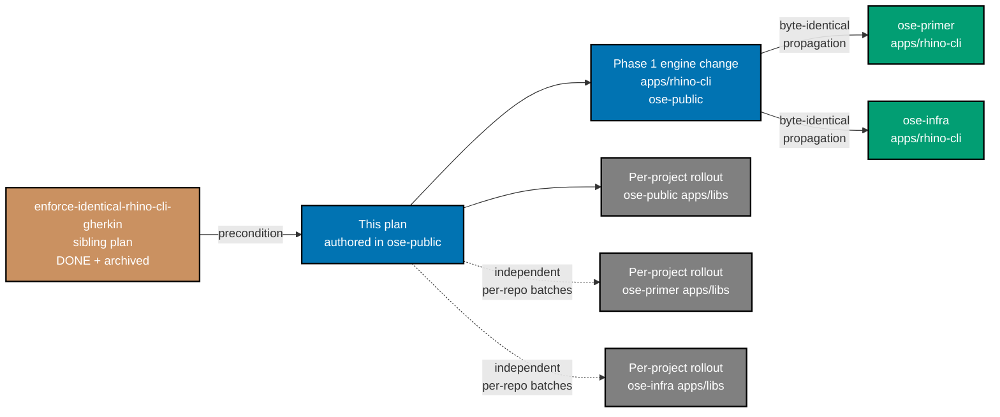
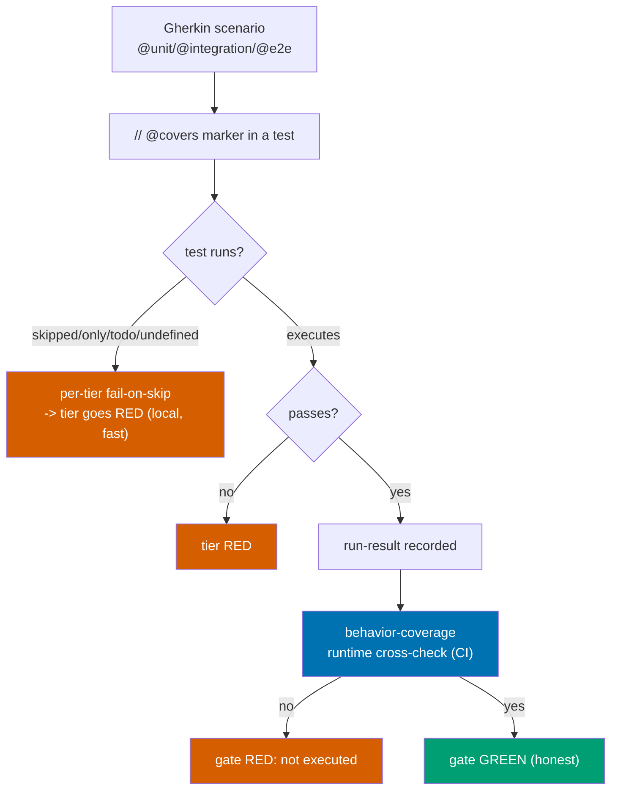

# Technical Design — Enforce Repo-Wide Gherkin Scenario Implementation

## 1. Verified Current State (2026-07-03)

- **Mechanism exists**: `rhino-cli specs behavior-coverage validate` — scenarios tag levels
  (`@unit`/`@integration`/`@e2e`); tests carry `// @covers <spec-path>:<scenario-title>`; gate passes when
  marker-levels == tagged levels. Driven by `repo-config.yml` `coverage.projects`; run at pre-push
  (`specs:behavior:coverage`) + CI (`main-ci` `run-many --all -t … specs:behavior:coverage`). [Repo-grounded]
- **Hole 1 — marker ≠ execution**: the gate checks the marker exists, not that the test ran/passed.
  rhino-cli had 121/228 scenarios skipped while green. No tier configures fail-on-skip. [Repo-grounded]
- **Hole 2 — adoption**: `@covers` markers exist in 8 files, **all rhino-cli, 0 elsewhere**; non-rhino
  specs carry level tags but no markers, yet CI runs the target repo-wide — so `behavior-coverage` is
  either lenient/no-op or would fail for them (Phase-0 determines which). [Repo-grounded]

## 2. Dependency on the rhino-cli plan

This plan **starts from the end-state** of
[`enforce-identical-rhino-cli-gherkin`](../../done/2026-07-04__enforce-identical-rhino-cli-gherkin/README.md):
rhino-cli's suite is fully enforcing, `fail_on_skipped` is on, `@covers` is complete for rhino-cli, and
`test:unit`(mocked) / `test:integration`(temp-fixture) are wired. rhino-cli is therefore the **first
proving consumer** of the runtime cross-check and the reference pattern for every other project.

### 2.1 Dependency and cross-repo propagation topology

The engine (rhino-cli source) is the only byte-identical artifact across the three repos; per-project
`@covers`/level-tag rollout batches are independent per repo because each repo's app/lib set differs.

## 3. Two-part enforcement (Decision: BOTH)

### 3.1 Per-tier fail-on-skip (local, fast)

Covers every language ecosystem across all three repos — `ose-public`'s TS/F#/Rust/Playwright set, plus
the eleven `crud-be-*`, four `crud-fe-*`/`crud-fs-*`, and five polyglot-lib (`golang-commons`,
`clojure-openapi-codegen`, `elixir-{openapi-codegen,cabbage,gherkin}`) projects unique to `ose-primer`
(each polyglot lib reuses the same fail-on-skip mechanism as its matching `crud-be-*` language row
below — no new tool), plus `ose-infra`'s TS/Rust set (already covered by existing rows).

| Tier / tool                            | Where it appears                                                                                                                                                                                          | Fail-on-skip mechanism                                                                                                                                                                                                                                                                            |
| -------------------------------------- | --------------------------------------------------------------------------------------------------------------------------------------------------------------------------------------------------------- | ------------------------------------------------------------------------------------------------------------------------------------------------------------------------------------------------------------------------------------------------------------------------------------------------- |
| cucumber-rs (Rust)                     | `rhino-cli` (all 3 repos)                                                                                                                                                                                 | `.fail_on_skipped()` on the World runner (done for rhino-cli by the dependency plan). [Repo-grounded]                                                                                                                                                                                             |
| Jest / Vitest                          | `ose-public`/`ose-infra` TS apps; `ose-primer`'s `crud-fe-ts-nextjs`, `crud-fe-ts-tanstack-start`, `crud-fs-ts-nextjs`, `crud-be-ts-effect` unit tier, `ts-ui`, `ts-ui-tokens` (libs)                     | CI run forbids `.only` (`--forbid-only` / config), and treats `.skip`/`.todo` as failures via a lint rule or a custom reporter that exits non-zero on skipped. [Unverified until Phase 0]                                                                                                         |
| Playwright                             | all `apps/*-e2e/playwright.config.ts` in all 3 repos                                                                                                                                                      | `forbidOnly: !!process.env.CI` **already configured** in all 11 `apps/*-e2e/playwright.config.ts` in `ose-public` [Repo-grounded]; confirm the same for `ose-primer`'s/`ose-infra`'s own `-e2e` configs in Phase 0; only the missing piece is a reporter/guard that fails the run on `test.skip`. |
| .NET xunit (F#/C#)                     | `ose-public`'s `organiclever-be`/`ose-be`/`crane-cli`/`fsharp-crane-core`; `ose-primer`'s `crud-be-fsharp-giraffe` (`dotnet test --filter Category=Unit`) and `crud-be-csharp-aspnetcore` (`dotnet test`) | No `Ignore`/pending tests in CI; grep-based guard for the xunit `Skip =` attribute (same pattern as Phase 2's existing F# bullet), generalized to both F# and C# test projects. [Unverified until Phase 0]                                                                                        |
| Cargo `#[ignore]` (Rust, non-cucumber) | `ose-primer`'s `crud-be-rust-axum` (`cargo test --lib --test unit`); `ose-infra`'s `coralpolyp-be`                                                                                                        | `cargo test` does not fail on `#[ignore]`d tests by default — grep-based guard (`grep -rn '#\[ignore\]'` returns 0 matches in scope) or `cargo test -- --include-ignored` combined with a diff-based proof. [Unverified until Phase 0]                                                            |
| cucumber-js (TS)                       | `ose-primer`'s `crud-be-ts-effect` BDD suite (`cucumber-js '.../gherkin/**/*.feature'`)                                                                                                                   | cucumber-js supports a `--fail-fast`/strict mode and a `--format` reporter with an undefined/skipped step count; confirm the flag that turns undefined/skipped/pending steps into a non-zero exit. [Unverified until Phase 0]                                                                     |
| Kaocha (Clojure)                       | `ose-primer`'s `crud-be-clojure-pedestal` (`clojure -M:test -m kaocha.runner unit bdd`), `clojure-openapi-codegen` (lib, `kaocha.runner unit`)                                                            | Kaocha's `:kaocha.testable/skip` / pending metadata and its `--fail-fast`/exit-code semantics — confirm via `kaocha.runner --help`/docs whether a skipped test already fails the run or needs a config flag. [Unverified until Phase 0]                                                           |
| ExUnit (Elixir)                        | `ose-primer`'s `crud-be-elixir-phoenix` (`mix test --only unit`), `elixir-{openapi-codegen,cabbage,gherkin}` (libs, `mix test`)                                                                           | ExUnit's `@tag :skip` marks a test excluded, not failed, by default — confirm `mix test --warnings-as-errors` or an `ExUnit.configure(exclude: [])`-style guard that surfaces skipped-tag counts as a failure. [Unverified until Phase 0]                                                         |
| Go `testing`                           | `ose-primer`'s `crud-be-golang-gin` (`go test -run TestUnit`), `golang-commons` (lib)                                                                                                                     | Go's `t.Skip()` marks a test skipped without failing `go test`'s exit code — grep-based guard (`grep -rn 't\.Skip('` returns 0 matches in scope) or a `go test -json` reporter counting skipped tests as a failure. [Unverified until Phase 0]                                                    |
| JUnit5                                 | `ose-public`/`ose-primer`'s `crud-be-java-springboot` (`mvn test`), `crud-be-java-vertx` (`mvn test`), `crud-be-kotlin-ktor` (`./gradlew testUnit`)                                                       | `@Disabled` marks a test skipped without failing Maven/Gradle's default exit code — grep-based guard (`grep -rn '@Disabled'` returns 0 matches in scope) or a Surefire/Gradle test-report parser that fails on any skipped test. [Unverified until Phase 0]                                       |
| pytest                                 | `ose-primer`'s `crud-be-python-fastapi` (`pytest -m unit`)                                                                                                                                                | `@pytest.mark.skip`/`xfail` — `pytest --strict-markers` plus a grep-based guard (`grep -rn '@pytest\.mark\.skip'` returns 0 matches in scope), or a `pytest-json-report`-based check. [Unverified until Phase 0]                                                                                  |
| Dart/Flutter `test`                    | `ose-primer`'s `crud-fe-dart-flutterweb` (`flutter test test/unit`)                                                                                                                                       | The `test`/`flutter_test` package's `skip:` named parameter marks a test skipped without failing the run — grep-based guard (`grep -rn 'skip:\s*true'` returns 0 matches in scope) or a `--reporter json` parser. [Unverified until Phase 0]                                                      |

The exact per-tool switch is confirmed in Phase 0 against each tool's version (verify flags via
`--help`/docs before authoring — do not assume). Where no native strict/forbid-skip flag exists, the
grep-based guard follows the same pattern already proven for `ose-public`'s F# `Skip =` check.

### 3.2 Central runtime cross-check (CI, authoritative)

Upgrade `rhino-cli specs behavior-coverage` (or add `specs behavior-coverage verify-run`) to:

1. Read each tier's **machine-readable run report** (prefer JSON: Jest/Vitest JSON reporter, Playwright
   JSON reporter, cucumber-rs output, F# TRX/JSON).
2. For every scenario with a `@covers` marker at level L, assert the corresponding test **executed and
   passed** at level L in that report.
3. Fail, naming any scenario that is marked-but-not-executed or marked-but-failed.

This is a rhino-cli source change → **byte-identical across the three repos** (propagated per the
dependency plan's boundary; golden-master regenerated).

## 4. Rollout model (per-project, batched, all three repos)

`@covers` + level tags are applied **per repo, to that repo's own apps/libs** (app sets differ across
repos — only the engine is byte-identical). Batches follow **each repo's own** `coverage.projects`
registry — `ose-public`'s 26 projects, `ose-primer`'s 25 (`rhino-cli` + 11 `crud-be-*` + `crud-be-e2e` +
3 `crud-fe-*` + `crud-fe-e2e` + `crud-fs-ts-nextjs` + `golang-commons` + `ts-ui` + `ts-ui-tokens` +
`clojure-openapi-codegen` + `elixir-{openapi-codegen,cabbage,gherkin}`), `ose-infra`'s 8, **59 total,
none left out** — one bounded group per phase, each a green gate. Given the scale and the twelve
distinct language/tool ecosystems `ose-primer`'s `crud-be-*`/`crud-fe-*`/`crud-fs-*` + polyglot-lib set
spans (§3.1), batches are naturally organized **per repo, then by domain within that repo** (e.g., one
phase per `crud-be-*` language, one phase for the `crud-fe-*`/`crud-fs-*` set, one phase for the
polyglot-lib set, mirroring `ose-public`'s existing per-domain batching) so each phase stays a small,
reviewable, single-language-ecosystem unit rather than a cross-language mega-batch. **No defer, no
shortcut** (Decision 4): every scenario in a batch is implemented (a real test that executes and passes)
before that batch's gate — no `@wip`, no `.skip`, no marker-without-a-real-test, no partial batch. A
scenario that cannot be made to pass has its behaviour built or is corrected/removed as an invalid spec
(with rationale in the phase notes) — never parked.

## 5. File Impact (representative)

| Path                                                                                                                                                                                       | Change                                                                            |
| ------------------------------------------------------------------------------------------------------------------------------------------------------------------------------------------ | --------------------------------------------------------------------------------- |
| `apps/rhino-cli/src/application/behavior_coverage/**`                                                                                                                                      | Add the runtime cross-check (byte-identical across 3 repos)                       |
| `apps/rhino-cli/tests/**` + `specs/apps/rhino/**`                                                                                                                                          | Spec/tests for the new cross-check behaviour                                      |
| Jest/Vitest config (`apps/*/…`, per project, all 3 repos)                                                                                                                                  | Fail-on-skip/only in CI                                                           |
| `apps/*-e2e/playwright.config.ts` (all 3 repos)                                                                                                                                            | `forbidOnly` + skip-guard                                                         |
| .NET xunit test projects (F#/C#, `ose-public` + `ose-primer`)                                                                                                                              | Fail-on-ignored / `Skip =` grep guard                                             |
| `ose-primer`'s `crud-be-{clojure-pedestal,elixir-phoenix,golang-gin,java-springboot,java-vertx,kotlin-ktor,python-fastapi,rust-axum,ts-effect}`, `crud-fe-dart-flutterweb` project sources | Per-language fail-on-skip guard (§3.1)                                            |
| `ose-primer`'s `golang-commons`, `clojure-openapi-codegen`, `elixir-{openapi-codegen,cabbage,gherkin}` lib sources                                                                         | Same per-language fail-on-skip guard as the matching `crud-be-*` ecosystem (§3.1) |
| `ose-infra`'s `coralpolyp-be` (Rust)                                                                                                                                                       | Cargo `#[ignore]` fail-on-skip guard                                              |
| `specs/apps/**/*.feature`, `specs/libs/**/*.feature` (per project, all 3 repos)                                                                                                            | Level tags added where missing                                                    |
| test sources across all 59 eligible projects (all 3 repos)                                                                                                                                 | `// @covers` markers added                                                        |
| each repo's own `repo-config.yml` `coverage.projects`                                                                                                                                      | Reviewed; adjust levels only if a project's real tiers differ                     |
| `.husky/pre-push`, `.github/workflows/*` (all 3 repos)                                                                                                                                     | Wire the runtime cross-check into `specs:behavior:coverage`/CI                    |

## 6. Rollback

Per-project, per-phase batches each land as a coherent green commit. If a phase gate fails, `git revert`
that phase's commits — the prior commit is green (fail-on-skip + cross-check already active means "green"
is honest). The engine change (Phase 1) lands before any rollout batch, so rollout batches can be reverted
independently of it.

## 7. Open Questions

- **Non-rhino behavior-coverage today** — does it pass vacuously or would it fail once markers are
  required? Resolved in Phase 0. `[Unverified until Phase 0]`
- **Per-tool JSON reporter availability** for the cross-check at each tool's pinned version — verified in
  Phase 0 via `--help`/docs. `[Unverified until Phase 0]`
