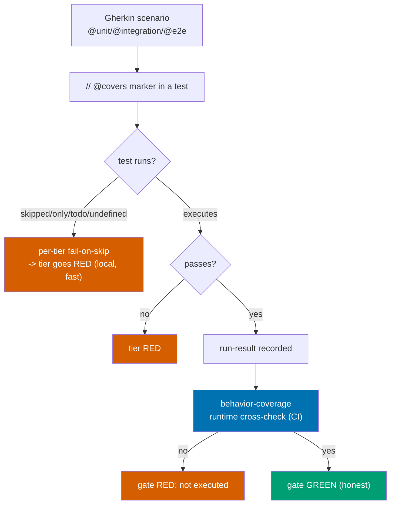

# Technical Design — Enforce Repo-Wide Gherkin Scenario Implementation

## 1. Verified Current State (2026-07-03)

- **Mechanism exists**: `rhino-cli specs behavior-coverage validate` — scenarios tag levels
  (`@unit`/`@integration`/`@e2e`); tests carry `// @covers <spec-path>:<scenario-title>`; gate passes when
  marker-levels == tagged levels. Driven by `repo-config.yml` `coverage.projects`; run at pre-push
  (`specs:coverage`) + CI (`main-ci` `run-many --all -t … specs:behavior:coverage`). [Repo-grounded]
- **Hole 1 — marker ≠ execution**: the gate checks the marker exists, not that the test ran/passed.
  rhino-cli had 121/228 scenarios skipped while green. No tier configures fail-on-skip. [Repo-grounded]
- **Hole 2 — adoption**: `@covers` markers exist in 8 files, **all rhino-cli, 0 elsewhere**; non-rhino
  specs carry level tags but no markers, yet CI runs the target repo-wide — so `behavior-coverage` is
  either lenient/no-op or would fail for them (Phase-0 determines which). [Repo-grounded]

## 2. Dependency on the rhino-cli plan

This plan **starts from the end-state** of
[`enforce-identical-rhino-cli-gherkin`](../enforce-identical-rhino-cli-gherkin/README.md):
rhino-cli's suite is fully enforcing, `fail_on_skipped` is on, `@covers` is complete for rhino-cli, and
`test:unit`(mocked) / `test:integration`(temp-fixture) are wired. rhino-cli is therefore the **first
proving consumer** of the runtime cross-check and the reference pattern for every other project.

## 3. Two-part enforcement (Decision: BOTH)

### 3.1 Per-tier fail-on-skip (local, fast)

| Tier / tool        | Fail-on-skip mechanism                                                                                                                                         |
| ------------------ | -------------------------------------------------------------------------------------------------------------------------------------------------------------- |
| cucumber-rs (Rust) | `.fail_on_skipped()` on the World runner (done for rhino-cli by the dependency plan).                                                                          |
| Jest / Vitest      | CI run forbids `.only` (`--forbid-only` / config), and treats `.skip`/`.todo` as failures via a lint rule or a custom reporter that exits non-zero on skipped. |
| Playwright         | `forbidOnly: true` (config) in CI; a reporter/guard that fails the run on `test.skip`.                                                                         |
| F# test runner     | No `Ignore`/pending tests in CI; runner configured to fail on skipped.                                                                                         |

The exact per-tool switch is confirmed in Phase 0 against each tool's version (verify flags via
`--help`/docs before authoring — do not assume).

### 3.2 Central runtime cross-check (CI, authoritative)

Upgrade `rhino-cli specs behavior-coverage` (or add `specs behavior-coverage verify-run`) to:

1. Read each tier's **machine-readable run report** (prefer JSON: Jest/Vitest JSON reporter, Playwright
   JSON reporter, cucumber-rs output, F# TRX/JSON).
2. For every scenario with a `@covers` marker at level L, assert the corresponding test **executed and
   passed** at level L in that report.
3. Fail, naming any scenario that is marked-but-not-executed or marked-but-failed.

This is a rhino-cli source change → **byte-identical across the three repos** (propagated per the
dependency plan's boundary; golden-master regenerated).

## 4. Rollout model (per-project, batched)

`@covers` + level tags are applied **per repo, to that repo's own apps/libs** (app sets differ across
repos — only the engine is byte-identical). Batches follow the `coverage.projects` registry, one bounded
group per phase, each a green gate. **No defer, no shortcut** (Decision 4): every scenario in a batch is
implemented (a real test that executes and passes) before that batch's gate — no `@wip`, no `.skip`, no
marker-without-a-real-test, no partial batch. A scenario that cannot be made to pass has its behaviour
built or is corrected/removed as an invalid spec (with rationale in the phase notes) — never parked.

## 5. File Impact (representative)

| Path                                                               | Change                                                        |
| ------------------------------------------------------------------ | ------------------------------------------------------------- |
| `apps/rhino-cli/src/application/behavior_coverage/**`              | Add the runtime cross-check (byte-identical across 3 repos)   |
| `apps/rhino-cli/tests/**` + `specs/apps/rhino/**`                  | Spec/tests for the new cross-check behaviour                  |
| Jest/Vitest config (`apps/*/…`, per project)                       | Fail-on-skip/only in CI                                       |
| `apps/*-e2e/playwright.config.ts`                                  | `forbidOnly` + skip-guard                                     |
| F# test projects                                                   | Fail-on-ignored config                                        |
| `specs/apps/**/*.feature`, `specs/libs/**/*.feature` (per project) | Level tags added where missing                                |
| test sources across eligible projects                              | `// @covers` markers added                                    |
| `repo-config.yml` `coverage.projects`                              | Reviewed; adjust levels only if a project's real tiers differ |
| `.husky/pre-push`, `.github/workflows/*`                           | Wire the runtime cross-check into `specs:coverage`/CI         |

## 6. Rollback

Per-project, per-phase batches each land as a coherent green commit. If a phase gate fails, `git revert`
that phase's commits — the prior commit is green (fail-on-skip + cross-check already active means "green"
is honest). The engine change (Phase 1) lands before any rollout batch, so rollout batches can be reverted
independently of it.

## 7. Open Questions

- **Non-rhino behavior-coverage today** — does it pass vacuously or would it fail once markers are
  required? Resolved in Phase 0. `[Unverified until Phase 0]`
- **Per-tool JSON reporter availability** for the cross-check at each tool's pinned version — verified in
  Phase 0 via `--help`/docs. `[Unverified until Phase 0]`
