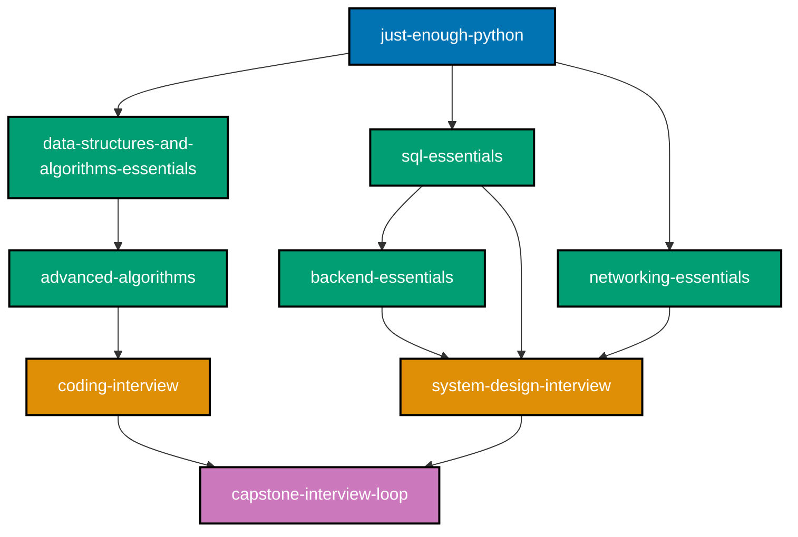
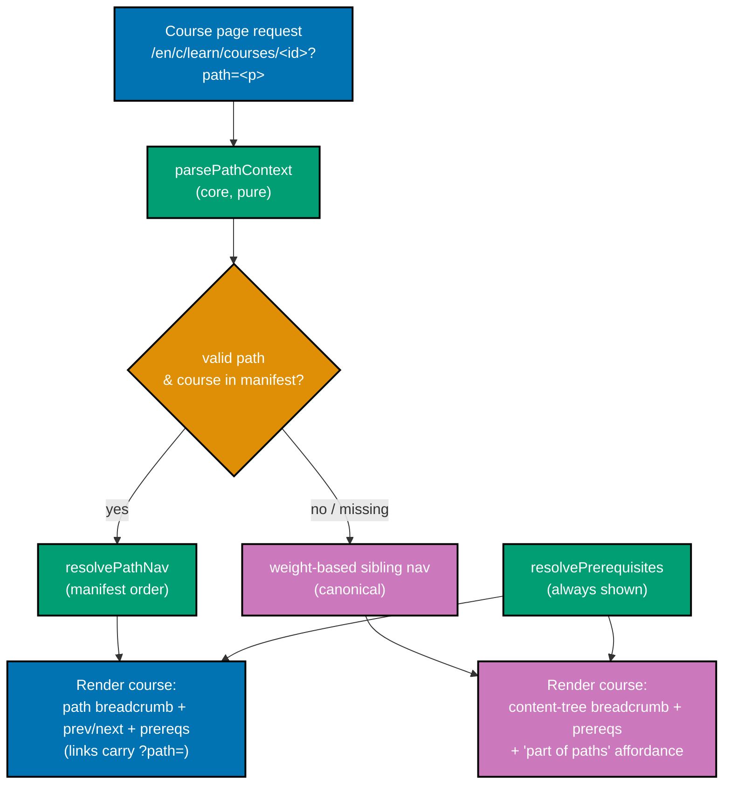

# Technical Docs — Fundamentally Strong Shared Course Library, Four Paths

## Overview

This plan has two technical halves:

1. **A content-architecture change** — replace the single-order "Fundamentally Strong" section with a
   **shared course library**: one canonical, path-neutral body per course (keyed by a stable
   **course ID**), plus **four ordered path manifests** that each compose a **curated subset** of
   those course blocks in a chosen order. This includes authoring **twenty NEW courses** (the original
   fourteen plus six further NEW AI-specific courses added 2026-07-20) **+ nine NEW capstones** (three
   original plus six DD-20 inter-topic capstones), re-homing the 33 already-shipped topics into a
   path-neutral `courses/` home with redirects, and authoring the 61 transferred topics (FS-SE 34–94)
   **native** into `courses/` as the library fills.
2. **A real ayokoding-www frontend change** — a **new** `course-paths` feature (it does not exist yet;
   **Group A builds it**) that carries a client-side **path context** (`?path=<path-id>`) so a course
   page's prev/next, breadcrumb, and **prerequisite display** follow the active path's manifest, with a
   graceful canonical fallback when no path context is present. This is a genuine Next.js feature with
   unit + integration + e2e tests and a `specs/` Gherkin companion.

Because part 2 adds user-facing screens under `apps/`, this is a **UI-bearing plan**: its
UI-design-funnel lives in [prd.md](./prd.md#ui-design-funnel-path-aware-navigation-screens). The
**content** part remains exempt from `specs:coverage` (content under `content/**` is exempt), but the
**navigation feature** is app code and carries a full `specs/` Gherkin companion.

> **Authority note.** **This document and the tracked plan files are the authority** — specifically
> the [Course Library Catalog](#course-library-catalog) (the 121-software-engineer-role-row table,
> 127 with the fourth path's six AI-specific courses), the Decisions Locked prose in
> [`README.md`](./README.md), and [DD-20](#design-decisions) plus [DD-21 through DD-28](#design-decisions)
> (2026-07-20). The rulings were originally derived in two scratch files
> (`local-temp/shared-tracks-rewrite-spec.md` and
> `local-temp/fs-shared-tracks-topic-reconciliation.md` with its 2026-07-19 addendum), plus a third
> (`local-temp-decisions.md`, 2026-07-20, the fourth-path grilling session); all three are
> **gitignored, untracked, and may be cleaned at any time**, so they are recorded here as historical
> provenance only and **must not be consulted as a source of truth during execution**. Every ruling
> they carried is reproduced in tracked files. Where any earlier draft disagreed, the rulings below
> win: **four** paths as of 2026-07-20 (originally three, originally two before that),
> `interview-ready` (was `job-seeking`), `immediately-effective` (was the shipping-first
> `fundamentally-strong`), a `fundamentally-strong` theory-first path, a fourth
> `software-engineer-to-ai-engineer` path (2026-07-20), the `/en/c/learn/…` URL namespace,
> **`prerequisites` on every course**, and **per-role convergence** (not one global endpoint,
> DD-22) as of 2026-07-20.

## Shared-Course-Library Architecture

### Core model — one library, four composing paths, per-role convergence

- **Course = standalone, path-neutral building block.** Its canonical body is authored **once**, lives
  at `apps/ayokoding-www/content/en/learn/courses/<course-id>/`, and renders at
  **`/en/c/learn/courses/<course-id>`**. With no path context it shows its canonical standalone view.
- **Path = ordered manifest composing course IDs.** A path references a **curated subset** of course
  blocks in a chosen order. **Not every course is in every path** — a path freely **omits** courses
  that do not fit its arc (omit-or-create), and any path may **create** a new shared course for a
  genuine gap (available to all paths thereafter). As of 2026-07-20, **course surgery**
  (update/merge/split/create) is also permitted, subject to a four-path blast-radius statement per
  surgery (DD-28).
- **Four paths, one library, per-role convergence (amended 2026-07-20, DD-22).** The founding claim
  that all paths end at the same deep mastery is corrected: paths converge **within a role**, not
  globally — the library now serves **more than one endpoint**. The three `software-engineer` paths
  end at the **same** software-engineering deep mastery (the internals-builds + harness cluster +
  distributed-systems + security-capstone tail); only their **entry point + journey ordering +
  teaching emphasis** differ. The fourth path converges on a **distinct** AI-engineering deep mastery.
  Path landings live at **`/en/c/learn/paths/<first-segment>/<second-segment>`** (the second segment's
  convention is redefined from `<role>` to `<role-transition-or-subject>`, DD-23):
  1. `interview-ready/software-engineer` — experienced SWE re-entering the market: interview/job prep
     **first** → production-effective → deeper. (was `job-seeking`)
  2. `immediately-effective/software-engineer` — editor → one language → **build a real app first** →
     then deepen. (was the shipping-first `fundamentally-strong` path)
  3. `fundamentally-strong/software-engineer` — university-style: **CS-theory / fundamentals first** →
     deeper.
  4. `immediately-effective/software-engineer-to-ai-engineer` (2026-07-20) — assumes an already-working
     software engineer (prerequisites **linked, not included**, DD-24); teaches **building** AI systems
     (not driving them — `agentic-coding` stays a separate axis, DD-21); converges on the fourth,
     distinct AI-engineering endpoint.
- All four are **fresh manifests** — none maps cleanly to the old single spiral order; each is a
  bespoke ordering authored over the library.
- **`fundamentally-strong`** is BOTH the library/section brand AND path #3's ID.

### Course-block schema

Each course block carries this canonical metadata (the body is authored once and never forked):

| Field                           | Meaning                                                                                                                                            |
| ------------------------------- | -------------------------------------------------------------------------------------------------------------------------------------------------- |
| `course-id`                     | Stable kebab-case slug (e.g. `coding-interview`). No numeric order prefix — order is a per-path property, never a body property.                   |
| Canonical body                  | One bundle at `content/en/learn/courses/<course-id>/`, one canonical URL.                                                                          |
| `prerequisites: [course-id, …]` | **EVERY course declares this.** The union of all `prerequisites` edges forms the library's **prerequisite DAG**. Entry-point courses declare `[]`. |
| Format                          | `Primer` / `By Example` / `Annotated-concept` (or a capstone milestone kind).                                                                      |
| Primary language                | The course's primary teaching language (or `none` for concept-only).                                                                               |

Additional rules:

- **Prerequisites are surfaced on the page.** The canonical course page renders its declared
  `prerequisites` (each linking to its own canonical course). This is path-independent — it is the
  body's own honest dependency statement.
- **Manifests must be prerequisite-consistent.** Every path's `courseOrder` must be a **valid
  topological ordering** (a valid entry into the DAG): no course precedes any of its prerequisites
  **within that path's order**. The four paths are four different entry points/orderings into the
  **one** DAG; the three `software-engineer` paths converge on the shared software-engineering
  endpoint, and the fourth path converges on its own AI-engineering endpoint (per-role convergence,
  DD-22). This is a machine-checkable gate (see
  [Manifest integrity invariants](#manifest-integrity-invariants-verified-as-gates--unit-tests)).
- **Per-path framing is a callout, never a body fork.** A path may attach an optional lightweight
  intro/outro framing callout around a shared block; the shared body itself is never modified per path.
- **Variant policy (create only when pedagogy must differ).** The default is one shared, path-neutral
  block. When a path needs a genuinely different **teaching approach** for the same topic (e.g.
  interview-drilled vs university-rigorous vs build-fast), author a **separate course variant** with a
  **distinct course-id**; paths pick the fitting variant. Variants are added **on demand** — this plan
  does not enumerate speculative variants.
- **Path context via `?path=<path-id>`.** Prev/next + breadcrumb follow that path's manifest ordering;
  no context → canonical standalone view.

### Prerequisite DAG (illustrative excerpt)

The full DAG is the union of every course's `prerequisites` edges (see the
[Course Library Catalog](#course-library-catalog)). A representative slice:



Each of the four path manifests is a distinct topological walk over this DAG that respects every edge.
The fourth path's walk is short and AI-specific — it links to, rather than walks, most of this
software-engineer-focused excerpt (DD-24).

### Canonical course home + URL

- **Home**: `apps/ayokoding-www/content/en/learn/courses/<course-id>/`.
- **URL**: `contentUrl` maps a content slug `learn/courses/<course-id>` to `/{locale}/c/learn/courses/<course-id>`
  [Repo-grounded — `apps/ayokoding-www/src/features/content/core/content-url.ts`: `contentUrl("en", "learn/courses/x")` → `/en/c/learn/courses/x`],
  so a course resolves at **`/en/c/learn/courses/<course-id>`**.
- **Migration**: existing bundles live at `content/en/learn/fundamentally-strong/software-engineer/<slug>/`
  today [Repo-grounded]. Re-homing each into `content/en/learn/courses/<course-id>/` is a `git mv` of
  the folder plus a redirect from the old URL (see [Redirects](#redirects)). The old
  `fundamentally-strong/software-engineer/` section name is freed, so the slash-form path IDs never
  clash with a course folder name.

### Path = ordered manifest (manifest format)

- A **path** is a manifest: a **path ID**, a display **title**, a **description**, and an ordered
  **`courseOrder`** list of course IDs.
- **Storage**: each manifest is a standalone data file under
  `apps/ayokoding-www/src/features/course-paths/manifests/` — the loader globs `manifests/**/*.yaml`
  and a **slash in a path ID becomes a nested directory** (e.g.
  `manifests/interview-ready/software-engineer.yaml`, and, as of 2026-07-20,
  `manifests/immediately-effective/software-engineer-to-ai-engineer.yaml`). This data file is the
  **single machine-consumed source of truth** for the path — it is NOT `courseOrder` frontmatter on
  any content `_index.md`. The path landing page renders _from_ this loaded manifest. The path ID's
  second segment names either a **role** (`software-engineer`) or, as of the fourth path, a **role
  transition or subject** — `<role-transition-or-subject>` is now the explicit convention for that
  segment (DD-23), not an accident of the first three paths sharing `software-engineer`.

  ```yaml
  # apps/ayokoding-www/src/features/course-paths/manifests/interview-ready/software-engineer.yaml
  pathId: interview-ready/software-engineer
  title: "Interview-Ready Software Engineer"
  description: "Interview-first track for an experienced engineer re-entering the market."
  courseOrder:
    - just-enough-nvim
    - just-enough-lua
    - extending-neovim
    - just-enough-python
    - capstone-forge-ready
    # … ordered course IDs, prerequisite-consistent …
  ```

- **Human-readable mirror**: the per-path files under `syllabus/paths/` in this plan folder (see
  [syllabus/ structure](#syllabus-folder-structure)) are the human-readable orderings used during
  authoring/review. The machine-consumed source of truth is the nested `manifests/**/*.yaml` data file
  above; the syllabus markdown is a documentation mirror, not what the app loads.
- **Course reference**: each `courseOrder` entry is a course ID string, optionally a mapping
  `{ id, framing?: { intro?, outro? } }` when the path adds a **lightweight per-course framing**
  callout (DD-7). The framing is rendered by the path layer around the shared body; the body itself is
  never modified.
- **Omit-or-create; course surgery permitted (amended 2026-07-20).** A path lists only the courses that
  fit its arc (others are omitted). A path that needs something no course covers triggers creation of a
  new course in the library (available to all paths thereafter). As of 2026-07-20, **course surgery**
  (update/merge/split/create against an _existing_ course) is also permitted — superseding the original
  zero-new-bodies invariant — subject to the four-path blast-radius rule (DD-28): each surgery states
  its blast radius across all four manifests before it is applied, and every affected manifest is
  re-verified prerequisite-consistent afterward.
- **Links-not-included prerequisites (the fourth path, DD-24).** Unlike the first three paths, the
  fourth path's `courseOrder` does not include the shared SWE-fundamentals courses it depends on —
  it **links** to their canonical pages instead, keeping the manifest a short, AI-specific spine.

### Manifest integrity invariants (verified as gates + unit tests)

- Every `courseOrder` ID resolves to an existing course under `courses/<course-id>/` (no dangling ref).
- No course ID appears twice within one manifest.
- **Prerequisite-consistency**: for every course in a manifest, all of its declared `prerequisites`
  that are **also present in that manifest** appear **before** it. (A path may omit a prerequisite only
  if it also omits every course that needs it — enforced as a gate.)
- **Course-surgery blast-radius statement (added 2026-07-20, DD-28)**: any course surgery names every
  manifest it touches before it lands, and each named manifest is re-verified against the invariants
  above afterward.
- No course body is duplicated per path (all manifests reference courses **by ID**, never copy a
  body) — a "no forked body" check.
- Course IDs are stable slugs; a re-home changes a body's URL (with a redirect) but never its ID.

## Path-Aware Navigation UI (ayokoding-www)

`ayokoding-www` is a **Next.js app** [Repo-grounded — `apps/ayokoding-www/next.config.ts`,
`src/app/[locale]/(content)/c/[...slug]/page.tsx`] following the repo's
**functional-core/imperative-shell** feature layout (`src/features/<name>/{core,shell}`)
[Repo-grounded — `src/features/{content,navigation}/{core,shell}`]. The `course-paths` feature is
**new** — no such feature exists today; **Group A creates it** on top of the existing `/c/[...slug]`
route and `content-url.ts`.

### Why the UI must change

Today, reading order is a single global property carried by `weight` frontmatter:
`computePrevNext` groups pages by parent slug and sorts siblings by `weight`, path-independently
[Repo-grounded — `apps/ayokoding-www/src/features/content/core/tree-builder.ts`]. One body cannot
encode four orders. The new model **moves order out of the body and into the manifest**, and makes
prev/next + breadcrumb + prerequisite display **resolve against the active path**.

### New feature: `course-paths` (functional core + imperative shell)

```text
apps/ayokoding-www/src/features/course-paths/          # NEW feature — Group A builds it
├── core/                      # PURE — no IO
│   ├── schemas.ts             # PathManifest zod schema (pathId, title, description, courseOrder[])
│   ├── manifest.ts            # PathManifest type + course-ref normalization (id | {id, framing})
│   ├── path-nav.ts            # resolvePathNav(manifest, courseId) -> {prev, next} (pure)
│   ├── path-context.ts        # parsePathContext(searchParams, manifests) -> pathId | null (validate)
│   ├── prerequisites.ts       # resolvePrerequisites(courseId, index) -> course refs (pure)
│   └── *.test.ts              # unit tests for the pure resolvers + context parser
└── shell/                     # IO / React
    ├── manifest-repository.ts # load manifests/**/*.yaml into validated PathManifest[] (fs)
    ├── manifests/             # SOURCE OF TRUTH — one data file per path (slash path ID → nested dir)
    │   ├── interview-ready/software-engineer.yaml
    │   ├── immediately-effective/software-engineer.yaml
    │   ├── fundamentally-strong/software-engineer.yaml
    │   └── immediately-effective/software-engineer-to-ai-engineer.yaml  # added 2026-07-20
    ├── path-landing.tsx       # renders a path landing page from a manifest (ordered course list)
    ├── path-banner.tsx        # in-path affordance on a course page (path name + position + a11y)
    ├── prerequisites.tsx      # renders a course's prerequisites (links to canonical course pages)
    └── path-course-links.tsx  # "this course is part of: [path A] [path B] [path C]" affordance
```

- **`resolvePathNav(manifest, courseId)`** (pure, core): finds `courseId` in `manifest.courseOrder`;
  returns `{ prev, next }` neighboring course refs (title + id), or `{prev:null,next:null}` when
  `courseId` is not in the manifest (course not part of this path → canonical view).
- **`parsePathContext(searchParams, manifests)`** (pure, core): reads the `path` search param; returns
  the matching `pathId` only when it names a loaded manifest, else `null` (graceful fallback). This is
  the validation gate against invalid/renamed path IDs.
- **`resolvePrerequisites(courseId, index)`** (pure, core): resolves a course's declared
  `prerequisites` course IDs to renderable refs (title + canonical URL). Path-independent; feeds the
  prerequisite display on every course page.
- **`manifest-repository.ts`** (shell): globs each `manifests/**/*.yaml` data file, parses it, and
  validates it through `schemas.ts` into a `PathManifest`; manifests are cached in the content index
  alongside `trees`/`prevNext` [Repo-grounded — `ContentIndex` in
  `apps/ayokoding-www/src/features/content/core/types.ts`]. The `?path=` param selects which loaded
  manifest is active; prev/next then resolves against that manifest's `courseOrder`.

### Routing + path context propagation

- **Course pages** stay at their canonical `/en/c/learn/courses/<course-id>` URL; **path context rides
  in the `?path=<path-id>` query param**, never in the path segment. One canonical URL per course; the
  param is additive and shareable.
- **`c/[...slug]/page.tsx`** [Repo-grounded] reads `searchParams.path`, calls `parsePathContext`, and —
  when a valid path context resolves and the course is in that manifest — renders **path-aware**
  prev/next + breadcrumb; otherwise renders the **canonical** view. `searchParams` makes the route
  dynamic for these pages (or a client component reads the param) — the exact static/dynamic boundary
  is a Group-A implementation decision recorded in delivery.
- **Link propagation**: `contentUrl(locale, slug, pathId?)` gains an optional `pathId` that appends
  `?path=<path-id>` [Repo-grounded — extend `content-url.ts`], so path-aware prev/next and breadcrumb
  links carry the context forward as the reader walks the path.

### Prev/next resolution

- **With path context**: prev/next come from `resolvePathNav(activeManifest, courseId)` — the manifest
  ordering, **not** weight. Links carry `?path=`.
- **Without path context** (canonical/standalone): the existing weight-based sibling prev/next is used
  (or none), exactly as today — no regression for non-path readers
  [Repo-grounded — `apps/ayokoding-www/src/features/navigation/shell/prev-next.tsx`].

### Breadcrumb

- **With path context**: `Home / <Path Title> / <Course Title>` — the path crumb links to the path
  landing page `/en/c/learn/paths/<path-id>` (carrying `?path=`). The old middle "Fundamentally Strong"
  crumb is dropped; the active Path Title stands in.
- **Without path context**: the existing content-tree breadcrumb, unchanged
  [Repo-grounded — `apps/ayokoding-www/src/app/[locale]/(content)/c/[...slug]/page.tsx buildBreadcrumbs`].

### Prerequisite display

- Every course page renders its declared `prerequisites` (from `resolvePrerequisites`) as a semantic
  list of links to the prerequisite courses' canonical pages. This is shown in **both** the canonical
  and path-aware views (it is the body's own honest dependency statement, path-independent). When a
  path context is active, each prerequisite link carries `?path=` so the reader stays in-path.

### Graceful fallback (deep-link / share)

- A course URL shared without `?path=` lands on the **canonical standalone view** — full body,
  content-tree breadcrumb, weight-based (or no) prev/next, prerequisite list — never an error.
- Every course page shows a **"this course is part of: [path A] [path B] [path C]"** affordance
  (`path-course-links.tsx`) so a deep-linked reader can enter any path that lists it. Derived from the
  manifests (which paths list this course ID).
- An **invalid** `?path=` value (unknown/renamed path) is treated as no context (fallback), never a
  crash — enforced by `parsePathContext` + a Gherkin scenario + an e2e test.

### Path landing + paths hub

- **Path landing** (`content/en/learn/paths/<path-id>/_index.md` route rendered by `path-landing.tsx`,
  surfaced at `/en/c/learn/paths/<path-id>`): the thin content `_index.md` supplies only the landing
  prose/SEO anchor; the ordered course list is rendered from the loaded manifest data file
  (`manifests/**/*.yaml`, grouped by the path's phase headings), each course link carrying `?path=`.
  Ordering never lives in the `_index.md` frontmatter.
- **Paths hub** (`content/en/learn/paths/_index.md`, surfaced `/en/c/learn/paths`): a "choose your path"
  screen with **four** path cards (2×2 grid, amended 2026-07-20, DD-23), each built from a loaded
  manifest (title + description + course count). Design in the funnel (prd).

### Accessibility

- Breadcrumb and prev/next remain `nav` landmarks with `aria-label`s [Repo-grounded — existing
  components]; the path crumb marks the current path with `aria-current` where appropriate.
- The path banner, prerequisite list, and "part of paths" affordance are keyboard-operable,
  visible-focus, and colour-contrast WCAG-AA; `html[lang]` stays correct per locale.
- The path landing course list and the prerequisite list are semantic ordered/unordered lists; screen
  readers announce course position and prerequisite relationships.

### Redirects

Old `content/en/learn/fundamentally-strong/software-engineer/<slug>` URLs redirect to the new canonical
`/en/c/learn/courses/<course-id>` via the app's redirect layer [Repo-grounded —
`apps/ayokoding-www/src/redirects/learn-reorg.ts`; precedent
`specs/apps/ayokoding/behavior/ayokoding-www/gherkin/navigation/learn-reorg-redirects.feature`]. One
redirect per re-homed course; verified by the redirect specs + an e2e test.

### Legacy `_index.md` browse coexistence (additive model)

The library/paths model is **additive** — it adds new navigation without removing the old one. The
legacy hand-curated **section browse** (the spiral-ordered `_index.md` section tree under
`apps/ayokoding-www/content/en/learn/fundamentally-strong/**`) MUST keep working. A reader can navigate
the material **the old way** (the ordered `_index.md` section tree) **in addition to** the new way
(`/en/c/learn/paths/<path-id>` path landings + `/en/c/learn/courses/<course-id>` canonical course
pages). Both navigations resolve, side by side.

- **The impacted `_index.md` files are UPDATED, never deleted.** Re-homing topics 1–33 out of
  `.../fundamentally-strong/software-engineer/<slug>/` into `courses/<course-id>/` does not orphan the
  section index. Every entry in the affected section-index files — the parent
  `fundamentally-strong/_index.md`, the spiral-ordered `fundamentally-strong/software-engineer/_index.md`,
  and each per-topic `_index.md` — is **re-pointed to wherever the content now lives**: either the
  re-homed canonical `/en/c/learn/courses/<course-id>` URL directly, or through the redirect layer. No
  dead links, no orphaned section.
- **Two independent navigations over one body set.** The re-homed body is the single canonical source;
  the legacy `_index.md` tree and the new manifest-driven paths both **link to that same canonical
  course page** (the legacy tree via its updated ordered entries, the paths via `courseOrder` +
  `?path=`). Because order lives outside the body (DD-1), the legacy spiral order (carried by the
  `_index.md` tree + `weight`) and the four manifest orders coexist without conflict: a course URL
  without `?path=` renders the canonical view that both the legacy tree and a deep-link reach; the same
  URL with `?path=` renders the path-aware view. No body is forked to serve the two navigations.
- **Enforced as a re-home gate.** delivery.md carries an explicit step in the re-home phase to
  enumerate + update every impacted `_index.md`, with an acceptance check (Gherkin + link-validator
  green + an e2e "old-way browse" nav walk) proving every legacy section-tree link still resolves
  end-to-end after re-homing.

### UI data-flow diagram



### Testing strategy (three levels + specs)

Per the repo's three-level testing standard and TDD mandate, the navigation feature is built
test-first:

- **Unit** (`test:unit`, pure core): `resolvePathNav` (prev/next at boundaries, missing course),
  `parsePathContext` (valid/invalid/missing param), `resolvePrerequisites`, manifest schema
  validation, prerequisite-consistency checker, `contentUrl` with `pathId`.
- **Integration** (`test:integration`): the manifest repository loads `manifests/**/*.yaml` into a
  validated `PathManifest[]`; the content service resolves a course + active path into path-aware
  prev/next; prerequisite resolution across the DAG; redirect resolution old-URL → new-URL.
- **E2E** (`test:e2e`, Playwright): from a path landing page, walk the course order via prev/next
  (param persists); breadcrumb shows the path; prerequisites render and link correctly; deep-link a
  course without `?path=` → canonical view; invalid `?path=` → canonical view; old URL → redirect to
  `courses/<id>`. In `en` — this plan's content locale; the `?path=` mechanism itself is locale-neutral
  (see [brd.md §Business-Scope Non-Goals](./brd.md#business-scope-non-goals)).
- **`specs/` Gherkin companion**: authored under
  `specs/apps/ayokoding/behavior/ayokoding-www/gherkin/course-paths/` (new domain folder beside
  `navigation/`) [Repo-grounded — sibling `navigation/` exists], consumed by `specs:coverage`.

## Course Library Catalog

The library holds **127 courses** (amended 2026-07-20, DD-28 — was 121; see
[Count reconciliation](#design-decisions) at DD-28): **33 re-homed** (shipped topics 1–33) + **61
transferred-native** (FS-SE topics 34–94) + **4 existing capstones** + **29 new** (20 courses + 9
capstones). The **29 new** breaks down as the original **14 courses** + the **fourth path's six
net-new AI-engineering courses** (light eval gate, deep evals, statistics for evals, product patterns
for probabilistic systems, inference serving and model deployment, fine-tuning and adaptation — see
[prd.md's AI-engineering specialization courses](./prd.md#new-course--capstone-specifications) for
the `[Judgment call]`-labeled specifics; full catalog rows below land when the AI path is authored,
DD-27) + **9 capstones**. **Zero merges among the original 121** — every overlap resolved keep-distinct
per the reconciliation rulings recorded in [`README.md`](./README.md) and the **DD-20**
inter-topic-capstone reconciliation below (seven inter-topic capstones — one already live on disk, six
spec'd-but-unscheduled — promoted to first-class catalog/manifest entries; see
[DD-20](#design-decisions)). Course surgery against the original 121 is now permitted (DD-28) and,
when applied, replaces "zero merges" with an explicit blast-radius statement for that surgery.

Each row lists **course-id · origin · format · primary language · prerequisites · one-line scope**.
**Origin**: `E` = existing shipped (1–33, re-homed), `T(n)` = transferred FS-SE topic n
(authored native), `Ecap` = existing capstone, `N` = one of the 29 new. **Order is NOT a catalog
property** — it lives in the four [Path Manifests](#path-manifests). `prerequisites` are the course's
own DAG edges (`—` = entry point). Variants are added **on demand** and are not enumerated here. The
six net-new AI courses are catalogued here by name only until the AI path is authored (DD-27); no
rows are added to the tables below in this pass to avoid inventing course-ids, exact prerequisites, or
scope lines not yet settled.

### Editor & tooling foundations

| Course ID                 | Origin | Format     | Primary language | Prerequisites                         | One-line scope                       |
| ------------------------- | ------ | ---------- | ---------------- | ------------------------------------- | ------------------------------------ |
| `just-enough-nvim`        | E      | Primer     | Neovim           | —                                     | Modal editing, motions, buffers      |
| `just-enough-lua`         | E      | Primer     | Lua              | —                                     | Lua as Neovim's scripting language   |
| `extending-neovim`        | E      | By Example | Lua              | `just-enough-nvim`, `just-enough-lua` | Neovim config, plugins, LSP, keymaps |
| `just-enough-python`      | E      | Primer     | Python           | —                                     | Python syntax, types, idioms         |
| `just-enough-bash`        | E      | Primer     | Bash             | —                                     | Shell scripting, pipes, composition  |
| `version-control-and-git` | E      | By Example | Git              | —                                     | Branching, merging, history          |

### Coding, DS&A & interview technique

| Course ID                                   | Origin | Format            | Primary language  | Prerequisites                                                      | One-line scope                                                     |
| ------------------------------------------- | ------ | ----------------- | ----------------- | ------------------------------------------------------------------ | ------------------------------------------------------------------ |
| `data-structures-and-algorithms-essentials` | E      | By Example        | Python            | `just-enough-python`                                               | Core DS&A, complexity                                              |
| `advanced-algorithms`                       | E      | By Example        | Python            | `data-structures-and-algorithms-essentials`                        | Graphs, DP, advanced techniques                                    |
| `coding-interview`                          | N      | By Example        | Python (agnostic) | `data-structures-and-algorithms-essentials`, `advanced-algorithms` | LeetCode-pattern recognition + narration                           |
| `take-home-and-live-coding`                 | N      | By Example        | Python            | `data-structures-and-algorithms-essentials`                        | Take-home + live/pair technique                                    |
| `object-oriented-programming-essentials`    | E      | By Example        | Python            | `just-enough-python`                                               | Classes, inheritance, polymorphism                                 |
| `object-oriented-design-and-patterns`       | E      | By Example        | Python            | `object-oriented-programming-essentials`                           | SOLID, patterns, refactoring                                       |
| `sql-essentials`                            | E      | By Example        | SQL + Python      | `just-enough-python`                                               | Relational modeling, joins                                         |
| `system-design-interview`                   | N      | Annotated-concept | none              | `backend-essentials`, `networking-essentials`, `sql-essentials`    | Interview rubric + whiteboard flow (forward-links `system-design`) |
| `technical-communication`                   | E      | Annotated-concept | none              | —                                                                  | Docs, proposals, reviews                                           |
| `behavioral-and-leadership-interviews`      | N      | Annotated-concept | none              | —                                                                  | STAR, senior rounds, layoff/gap narrative                          |

### Web & platform productivity

| Course ID                           | Origin | Format            | Primary language    | Prerequisites                                             | One-line scope                                                                                |
| ----------------------------------- | ------ | ----------------- | ------------------- | --------------------------------------------------------- | --------------------------------------------------------------------------------------------- |
| `just-enough-typescript`            | E      | Primer            | TypeScript          | —                                                         | Typed-JS types, tooling, idioms                                                               |
| `frontend-essentials`               | E      | By Example        | TypeScript          | `just-enough-typescript`                                  | Interactive UIs, components, state                                                            |
| `backend-essentials`                | E      | By Example        | Python (PostgreSQL) | `just-enough-python`, `sql-essentials`                    | HTTP backend + persistence (usable slice)                                                     |
| `async-python-and-fastapi-services` | N      | By Example        | Python              | `backend-essentials`, `concurrency-and-parallelism`       | FastAPI + Pydantic + uv/ruff/pyright (defers async concepts to 24, framework internals to 40) |
| `networking-essentials`             | E      | By Example        | Python              | `just-enough-python`                                      | TCP/IP, HTTP, DNS, sockets                                                                    |
| `api-design`                        | T(41)  | By Example        | Python              | `backend-essentials`                                      | REST/GraphQL/gRPC, OpenAPI, versioning                                                        |
| `advanced-frontend`                 | T(47)  | By Example        | TypeScript          | `frontend-essentials`                                     | State mgmt, performance, FE architecture                                                      |
| `self-hosting-essentials`           | N      | By Example        | ops/config          | `backend-essentials`, `networking-essentials`             | One box: containerize, reverse proxy + TLS, PaaS push                                         |
| `backend-at-scale`                  | T(39)  | By Example        | Python              | `backend-essentials`, `api-design`                        | Caching, sharding, queues, scaling                                                            |
| `containers-and-orchestration`      | T(50)  | By Example        | YAML/CLI            | `just-enough-bash`, `backend-essentials`                  | Docker + Kubernetes                                                                           |
| `cloud-and-iac`                     | T(51)  | Annotated-concept | HCL/YAML            | `containers-and-orchestration`                            | Terraform/OpenTofu IaC lifecycle                                                              |
| `cicd-and-release-engineering`      | T(55)  | By Example        | YAML + Python       | `version-control-and-git`, `containers-and-orchestration` | Pipelines, artifacts, release                                                                 |
| `build-automation-and-task-runners` | T(54)  | By Example        | multi-tool          | `just-enough-bash`, `version-control-and-git`             | Build systems, task runners, graphs                                                           |

### Mobile & desktop platforms

| Course ID                       | Origin | Format     | Primary language | Prerequisites                        | One-line scope                         |
| ------------------------------- | ------ | ---------- | ---------------- | ------------------------------------ | -------------------------------------- |
| `just-enough-kotlin`            | T(68)  | Primer     | Kotlin           | —                                    | Kotlin syntax, null-safety, coroutines |
| `android-app-development`       | T(69)  | By Example | Kotlin           | `just-enough-kotlin`                 | Native Android with the SDK            |
| `just-enough-swift`             | T(70)  | Primer     | Swift            | —                                    | Swift syntax, optionals                |
| `ios-app-development`           | T(71)  | By Example | Swift            | `just-enough-swift`                  | Native iOS with the SDK                |
| `just-enough-dart`              | T(72)  | Primer     | Dart             | —                                    | Dart syntax, async, Flutter idioms     |
| `hybrid-app-development`        | T(73)  | By Example | Dart             | `just-enough-dart`                   | Cross-platform from one Dart codebase  |
| `just-enough-csharp`            | T(74)  | Primer     | C#               | —                                    | C# syntax, LINQ, async, .NET           |
| `windows-app-development`       | T(75)  | By Example | C#               | `just-enough-csharp`                 | Native Windows desktop                 |
| `linux-app-development`         | T(76)  | By Example | Python           | `just-enough-python`                 | Native Linux desktop, packaging        |
| `building-production-cli-tools` | T(77)  | By Example | Go + Rust        | `just-enough-go`, `just-enough-rust` | Distributable CLI tools                |

### CS foundations, paradigms & concurrency

| Course ID                      | Origin | Format            | Primary language | Prerequisites                                       | One-line scope                                  |
| ------------------------------ | ------ | ----------------- | ---------------- | --------------------------------------------------- | ----------------------------------------------- |
| `computer-science-foundations` | E      | Annotated-concept | Python           | `just-enough-python`                                | Automata, computability, complexity             |
| `computer-architecture`        | E      | By Example        | C                | `just-enough-c`                                     | CPU, memory, caches, instruction execution      |
| `programming-paradigms`        | E      | By Example        | Python           | `just-enough-python`                                | Imperative/functional/logic survey              |
| `functional-programming`       | E      | By Example        | Python           | `just-enough-python`                                | Pure fns, immutability, HOFs                    |
| `concurrency-and-parallelism`  | E      | By Example        | Python           | `just-enough-python`                                | Threads, async, locks (owns async fundamentals) |
| `just-enough-go`               | T(64)  | Primer            | Go               | —                                                   | Go syntax, goroutines                           |
| `csp-style-concurrency`        | T(65)  | By Example        | Go               | `just-enough-go`, `concurrency-and-parallelism`     | Channels, CSP concurrency                       |
| `just-enough-elixir`           | T(66)  | Primer            | Elixir           | —                                                   | Elixir syntax, pattern matching                 |
| `actor-model-concurrency`      | T(67)  | By Example        | Elixir           | `just-enough-elixir`, `concurrency-and-parallelism` | Actors, supervision trees                       |

### Data depth

| Course ID                                | Origin | Format            | Primary language | Prerequisites                                                 | One-line scope                       |
| ---------------------------------------- | ------ | ----------------- | ---------------- | ------------------------------------------------------------- | ------------------------------------ |
| `advanced-networking`                    | E(29)  | Annotated-concept | Python           | `networking-essentials`                                       | Load balancing, proxies, TLS         |
| `advanced-sql-and-query-performance`     | E(26)  | By Example        | SQL + Python     | `sql-essentials`                                              | Query plans, indexing, tuning        |
| `data-access-orms-and-query-builders`    | E(27)  | By Example        | Python           | `sql-essentials`, `object-oriented-programming-essentials`    | Using ORMs/query builders safely     |
| `build-your-own-orm-and-query-builder`   | E(28)  | By Example        | Python           | `data-access-orms-and-query-builders`                         | Implementing a small ORM             |
| `nosql-databases`                        | T(34)  | By Example        | Python           | `sql-essentials`                                              | Document, KV, column stores          |
| `graph-databases`                        | T(35)  | By Example        | Cypher + Python  | `sql-essentials`                                              | Modeling/querying connected data     |
| `database-internals-and-storage-engines` | T(36)  | By Example        | Python           | `sql-essentials`, `data-structures-and-algorithms-essentials` | B-trees, LSM-trees, WAL              |
| `data-engineering`                       | T(37)  | Annotated-concept | Python           | `sql-essentials`, `backend-essentials`                        | Pipelines, batch/stream, warehousing |
| `search-and-information-retrieval`       | T(38)  | By Example        | Python           | `data-structures-and-algorithms-essentials`                   | Inverted indexes, ranking            |

### Architecture, distributed & AI / harness

| Course ID                                         | Origin | Format            | Primary language | Prerequisites                                                  | One-line scope                                                                                                 |
| ------------------------------------------------- | ------ | ----------------- | ---------------- | -------------------------------------------------------------- | -------------------------------------------------------------------------------------------------------------- |
| `software-architecture`                           | T(42)  | Annotated-concept | Python           | `backend-essentials`, `object-oriented-design-and-patterns`    | Styles, tradeoffs, structuring                                                                                 |
| `domain-driven-design`                            | T(43)  | By Example        | Python           | `object-oriented-design-and-patterns`, `software-architecture` | Bounded contexts, modeling                                                                                     |
| `system-design`                                   | T(44)  | Annotated-concept | Python           | `backend-at-scale`, `networking-essentials`                    | Designing for scale/availability (depth sibling of `system-design-interview`)                                  |
| `event-driven-architecture`                       | T(45)  | By Example        | Python           | `software-architecture`, `backend-essentials`                  | Events, brokers, EDA                                                                                           |
| `distributed-systems`                             | T(46)  | By Example        | Python           | `networking-essentials`, `concurrency-and-parallelism`         | Consensus, replication, CAP                                                                                    |
| `build-your-own-web-framework`                    | T(40)  | By Example        | Python           | `backend-essentials`, `networking-essentials`                  | WSGI/ASGI, router, middleware (demystifies FastAPI)                                                            |
| `build-your-own-reactive-ui`                      | T(48)  | By Example        | TypeScript       | `advanced-frontend`                                            | Reactive UI lib + virtual DOM                                                                                  |
| `software-engineering-practices`                  | E(30)  | Annotated-concept | Python           | `version-control-and-git`, `software-testing`                  | Code review, CI, quality gates                                                                                 |
| `agentic-coding`                                  | E(31)  | Annotated-concept | polyglot         | `version-control-and-git`                                      | Driving AI agents (user/driver side — distinct axis)                                                           |
| `creating-ai-powered-apps`                        | T(56)  | By Example        | Python           | `backend-essentials`, `api-design`                             | **Use an LLM in an app**: RAG, tool-calling, MCP, evals (scope-guard head, DD-11)                              |
| `agentic-ai`                                      | T(57)  | By Example        | Python           | `creating-ai-powered-apps`                                     | **Survey** of agents; forward-links each primitive to the harness cluster (does NOT re-teach at depth — DD-11) |
| `browser-automation-with-cdp`                     | N      | By Example        | Python (CDP)     | `just-enough-python`, `networking-essentials`                  | Chrome DevTools Protocol automation (remotebrowser skill)                                                      |
| `the-agent-loop`                                  | N      | By Example        | Python           | `agentic-ai`                                                   | LLM read-eval-act loop, streaming, stops (build-your-own tier)                                                 |
| `agent-tools-and-mcp`                             | N      | By Example        | Python           | `the-agent-loop`                                               | Tool/function schemas; MCP server + client                                                                     |
| `agent-context-and-memory`                        | N      | Annotated-concept | Python           | `the-agent-loop`                                               | Context budgeting, compaction, memory                                                                          |
| `agent-permissions-and-sandboxing`                | N      | By Example        | Python           | `the-agent-loop`                                               | Approval models, sandboxing, guardrails                                                                        |
| `agent-orchestration-subagents-and-observability` | N      | Annotated-concept | Python           | `agent-tools-and-mcp`, `agent-context-and-memory`              | Subagents, hooks/skills, evals, tracing                                                                        |

### Low-level systems, JVM & languages, internals builds

| Course ID                           | Origin | Format     | Primary language     | Prerequisites                                                     | One-line scope                                             |
| ----------------------------------- | ------ | ---------- | -------------------- | ----------------------------------------------------------------- | ---------------------------------------------------------- |
| `just-enough-c`                     | T(78)  | Primer     | C                    | —                                                                 | Minimal C for the OS/systems topics                        |
| `just-enough-cpp`                   | N      | Primer     | C++                  | `just-enough-c`                                                   | RAII, templates, STL, smart pointers (no FS-SE C++ course) |
| `linux-os`                          | T(79)  | By Example | C + shell            | `just-enough-c`, `just-enough-bash`                               | Processes, syscalls, filesystems                           |
| `windows-os`                        | T(80)  | By Example | C + PowerShell       | `just-enough-c`                                                   | Windows internals, the API                                 |
| `system-programming`                | T(81)  | By Example | C                    | `just-enough-c`, `linux-os`                                       | Close-to-metal C: memory model, manual RM                  |
| `just-enough-rust`                  | T(82)  | Primer     | Rust                 | —                                                                 | Ownership, borrowing, type system                          |
| `modern-system-programming`         | T(83)  | By Example | Rust                 | `just-enough-rust`                                                | Safe systems programming (Rust counterpart of 81)          |
| `just-enough-java`                  | T(84)  | Primer     | Java                 | —                                                                 | Java syntax, JVM, collections                              |
| `enterprise-java-and-the-jvm`       | T(85)  | By Example | Java                 | `just-enough-java`                                                | Spring, JVM ecosystem                                      |
| `lisp`                              | T(86)  | By Example | Scheme + Clojure     | —                                                                 | Macros, homoiconicity                                      |
| `just-enough-fsharp`                | T(87)  | Primer     | F#                   | —                                                                 | DUs, functional-first                                      |
| `type-systems`                      | T(88)  | By Example | OCaml + Haskell + F# | `just-enough-fsharp`, `functional-programming`                    | Algebraic types, inference                                 |
| `compilers-parsers-and-transpilers` | T(89)  | By Example | F#                   | `just-enough-fsharp`, `data-structures-and-algorithms-essentials` | Lexers, parsers, ASTs                                      |
| `build-your-own-git`                | T(90)  | By Example | Python               | `just-enough-python`, `version-control-and-git`                   | Git object model + plumbing                                |
| `build-your-own-database`           | T(91)  | By Example | Python               | `just-enough-python`, `database-internals-and-storage-engines`    | Storage, indexing, transactions                            |
| `build-your-own-raft`               | T(92)  | By Example | Go                   | `just-enough-go`, `distributed-systems`                           | Raft consensus + replicated KV                             |

### Security, ops, quality & delivery

| Course ID                                   | Origin | Format            | Primary language            | Prerequisites                                                  | One-line scope                                                                                                             |
| ------------------------------------------- | ------ | ----------------- | --------------------------- | -------------------------------------------------------------- | -------------------------------------------------------------------------------------------------------------------------- |
| `security-essentials`                       | E(17)  | By Example        | Python                      | `backend-essentials`                                           | Common vulns, auth, secrets                                                                                                |
| `it-and-application-security`               | T(58)  | Annotated-concept | Python                      | `security-essentials`                                          | CIA, STRIDE, OWASP, crypto, identity                                                                                       |
| `offensive-security`                        | T(59)  | By Example        | Python + shell              | `security-essentials`, `networking-essentials`                 | Recon, scanning, exploitation (lab-local)                                                                                  |
| `defensive-security`                        | T(60)  | **By Example**    | Python + shell              | `security-essentials`, `networking-essentials`                 | **Hands-on** generalist blue-team: Sigma-on-ELK/OpenSearch + IR lifecycle + hardening (label fixed — NOT "concept", DD-12) |
| `detection-engineering-and-siem-operations` | N      | By Example        | XML/rules + config + Python | `defensive-security`                                           | **Wazuh-specific deep tier**: decoders, correlation rules, FP tuning, dashboards (specialist — DD-12)                      |
| `vulnerability-management-and-assessment`   | T(61)  | By Example        | Python                      | `security-essentials`                                          | Scanning, triage, remediation at scale, SBOM                                                                               |
| `it-governance-grc`                         | T(62)  | Annotated-concept | none                        | `it-and-application-security`                                  | Governance, risk, compliance, audit                                                                                        |
| `bare-metal-virtualization`                 | T(52)  | By Example        | HCL/YAML/shell              | `containers-and-orchestration`                                 | Proxmox, hypervisors (full-depth sibling of `self-hosting-essentials`)                                                     |
| `self-managed-kubernetes-and-gitops`        | T(53)  | By Example        | YAML/CLI                    | `containers-and-orchestration`, `cicd-and-release-engineering` | Self-owned prod K8s + GitOps                                                                                               |
| `platform-engineering-and-devex`            | T(93)  | Annotated-concept | none                        | `containers-and-orchestration`, `cicd-and-release-engineering` | Internal platforms, golden paths                                                                                           |
| `site-reliability-engineering`              | T(94)  | Annotated-concept | Python                      | `containers-and-orchestration`, `system-design`                | SLOs, observability, IR                                                                                                    |
| `software-testing`                          | E(15)  | By Example        | Python + TS                 | `just-enough-python`, `just-enough-typescript`                 | Unit, integration, E2E (Playwright)                                                                                        |
| `debugging-and-profiling`                   | E(16)  | By Example        | Python + native             | `just-enough-python`                                           | Systematic debugging + profiling                                                                                           |
| `analytics-and-experimentation`             | T(63)  | By Example        | Python                      | `sql-essentials`                                               | Metrics, A/B testing                                                                                                       |
| `information-architecture-and-seo`          | T(49)  | Annotated-concept | HTML                        | `frontend-essentials`                                          | Structuring content, SEO                                                                                                   |
| `software-product-engineering`              | E(32)  | Annotated-concept | none                        | —                                                              | Turning engineering into products                                                                                          |
| `engineering-management`                    | E(33)  | Annotated-concept | none                        | —                                                              | Leading engineers/teams                                                                                                    |
| `project-management`                        | E(9)   | Annotated-concept | none                        | —                                                              | Scoping, planning, tracking                                                                                                |

### Capstones (courses too — each a building block)

| Course ID                                | Origin | Kind                    | Primary language  | Prerequisites                                                                                                                                                                                             | One-line scope                                                                                                                                                                                                                                |
| ---------------------------------------- | ------ | ----------------------- | ----------------- | --------------------------------------------------------------------------------------------------------------------------------------------------------------------------------------------------------- | --------------------------------------------------------------------------------------------------------------------------------------------------------------------------------------------------------------------------------------------- |
| `capstone-forge-ready`                   | Ecap   | Prologue milestone      | multi             | `extending-neovim`, `just-enough-python`, `just-enough-bash`, `version-control-and-git`                                                                                                                   | Reproducible dev forge (nvim + lua + extend)                                                                                                                                                                                                  |
| `capstone-interview-loop`                | N      | Interview milestone     | Python + prose    | `coding-interview`, `take-home-and-live-coding`, `system-design-interview`, `behavioral-and-leadership-interviews`                                                                                        | Full mock loop: coding + system-design + behavioral                                                                                                                                                                                           |
| `capstone-first-working-software`        | Ecap   | Web milestone           | Python + TS       | `frontend-essentials`, `backend-essentials`, `security-essentials`, `software-testing`                                                                                                                    | First secure, tested web app                                                                                                                                                                                                                  |
| `capstone-full-stack-app`                | Ecap   | Full-stack milestone    | TS + Python       | `frontend-essentials`, `backend-essentials`, `sql-essentials`, `api-design`                                                                                                                               | Typed FE ↔ BE ↔ SQL vertical slice                                                                                                                                                                                                            |
| `capstone-build-your-own-coding-agent`   | N      | Harness milestone       | Python            | `agent-tools-and-mcp`, `agent-context-and-memory`, `agent-permissions-and-sandboxing`, `agent-orchestration-subagents-and-observability`                                                                  | Assemble the harness cluster into a coding-agent CLI                                                                                                                                                                                          |
| `capstone-build-your-own-pentest-engine` | N      | Security milestone      | TypeScript        | `offensive-security`, `detection-engineering-and-siem-operations`, `agent-orchestration-subagents-and-observability`, `browser-automation-with-cdp`                                                       | Agentic pentest engine (swarm + MCP + CDP + security chaining) — **lab-local, authorized-scope-only** (inherits `offensive-security`'s rules-of-engagement guard; body must restate scope/authorization limits per OWASP 2026 Agentic Top-10) |
| `capstone-solid-core`                    | Ecap   | Pass-boundary milestone | Python + TS       | `capstone-first-working-software`, `object-oriented-design-and-patterns`, `functional-programming`, `concurrency-and-parallelism`, `advanced-sql-and-query-performance`, `software-engineering-practices` | Re-engineer the Pass-1 app to a SOLID/functional-core professional baseline with a CI gate + ADRs (DD-20; embedded spec in `engineering-management.md`)                                                                                       |
| `capstone-real-world-delivery`           | N      | Full-stack milestone    | Python + TS + IaC | `capstone-solid-core`, `system-design`, `event-driven-architecture`, `containers-and-orchestration`, `cloud-and-iac`, `cicd-and-release-engineering`, `defensive-security`                                | Deploy-as-code, secured, observable delivery of the Pass-2 app — DDD + capacity plan + red/blue-team loop (DD-20; embedded spec in `defensive-security.md`)                                                                                   |
| `capstone-secure-service`                | N      | Security milestone      | Python + shell    | `security-essentials`, `backend-essentials`, `it-and-application-security`, `offensive-security`, `defensive-security`                                                                                    | End-to-end secured HTTP service: OWASP-2025 + OAuth2/OIDC, red-team validated + blue-team detected (DD-20; embedded spec in `defensive-security.md`)                                                                                          |
| `capstone-data-pipeline`                 | N      | Data milestone          | SQL + Python      | `sql-essentials`, `advanced-sql-and-query-performance`, `data-engineering`, `creating-ai-powered-apps`, `backend-essentials`                                                                              | Medallion pipeline (bronze/silver/gold) → governed warehouse → RAG-grounded query interface (DD-20; embedded spec in `defensive-security.md`)                                                                                                 |
| `capstone-concurrency-and-systems`       | N      | Systems milestone       | Go or Elixir + C  | `csp-style-concurrency`, `actor-model-concurrency`, `containers-and-orchestration`, `site-reliability-engineering`                                                                                        | Concurrent, containerized, SRE-instrumented (golden signals + SLO) service (DD-20; embedded spec in `compilers-parsers-and-transpilers.md`)                                                                                                   |
| `capstone-concurrency-showdown`          | N      | Comparison milestone    | Go + Elixir       | `csp-style-concurrency`, `actor-model-concurrency`                                                                                                                                                        | The same problem solved CSP-Go vs actor-Elixir, compared head-to-head (DD-20; embedded spec in `compilers-parsers-and-transpilers.md`)                                                                                                        |
| `capstone-lead-at-altitude`              | N      | Whole-journey milestone | polyglot + prose  | `capstone-concurrency-and-systems`, `capstone-real-world-delivery`, `site-reliability-engineering`, `software-product-engineering`, `engineering-management`                                              | Whole-journey leadership synthesis: SLOs, strategy, prioritization, a six-pass retrospective (DD-20; embedded spec in `site-reliability-engineering.md`)                                                                                      |

**Count check**: 33 re-homed (E) + 61 transferred-native (T) + 4 existing capstones (Ecap) + 23 new
(N: 14 courses + 9 capstones) = **121** among the original software-engineer-role baseline, zero
merges (D8/DD-28 permits course surgery against this 121 going forward, replacing "zero merges" with
an explicit per-surgery blast-radius statement). Plus the fourth path's **6 net-new AI-engineering
courses** (D4/D5/D6, DD-24/DD-25/DD-26) = **127** total catalog (amended 2026-07-20, DD-28). Full
per-course detail (bodies + citations): `syllabus/courses/` and its README; verify against the catalog
table above, the reconciliation rulings in [`README.md`](./README.md), and [DD-20](#design-decisions)
below — all tracked.

## Path Manifests

Each manifest is the **authoritative order** for one path: a **curated, prerequisite-consistent subset
ordering** over the catalog. **Amended 2026-07-20 (DD-22, DD-24) — convergence is now per role, not
global.** The three `software-engineer` paths (`interview-ready`, `immediately-effective`,
`fundamentally-strong`) all reference the same software-engineer-role course IDs (each course lives
once); each of those three **omits** courses that do not fit and may **create** a new shared course for
a genuine gap, and all three **converge on the same software-engineer deep-mastery endpoint** (the
internals-builds + harness cluster + distributed-systems + security-capstone tail). The **fourth path**
(`immediately-effective/software-engineer-to-ai-engineer`) is a **separate, shorter manifest** that
**links to** (does not walk) most of that software-engineer-role tail — its own courses converge on a
distinct AI-engineer endpoint (DD-24). The manifests are the machine-consumed data files under
`apps/ayokoding-www/src/features/course-paths/manifests/**/*.yaml` (nested to mirror each slash path
ID); the human-readable orderings live in `syllabus/paths/`. All four are **fresh orderings** — none
inherits the old single spiral.

> Every ordering below is a **valid topological walk** over the prerequisite DAG in the
> [catalog](#course-library-catalog): no course precedes any of its listed prerequisites. Phase-level
> structure is shown here; the exhaustive per-course orderings (with prereq-chaining notes) live in the
> `syllabus/paths/*.md` mirrors.

### Path `interview-ready/software-engineer` (interview-first)

Experienced SWE re-entering the market. Arc: **interview/job prep first → production-effective →
deeper.** Delivered **first** (Group B MVP, ships end-to-end). Per **DL-13**, this is a **curated spine
plus an optional "Go deeper" tail**, not all-comprehensive: **116 of 121** courses (spine: Prologue
plus Phase 1 plus Phase 2; the rest is the optional Go-deeper tail). **Genuinely omitted** (curriculum
judgment, present only in `fundamentally-strong`): `lisp`, `windows-os`, `just-enough-csharp`,
`windows-app-development`, `linux-app-development` — 5 courses, none a prerequisite of anything
included, so the manifest stays prerequisite-closed.

- **Prologue · Editor Foundations** (skippable for the experienced): `just-enough-nvim` →
  `just-enough-lua` → `extending-neovim` → `just-enough-python` → `just-enough-bash` →
  `version-control-and-git` → `capstone-forge-ready`.
- **Phase 1 · Interview Preparation**: `data-structures-and-algorithms-essentials` →
  `advanced-algorithms` → `coding-interview` → `take-home-and-live-coding` →
  `object-oriented-programming-essentials` → `object-oriented-design-and-patterns` → `sql-essentials`
  → `backend-essentials` → `networking-essentials` → `system-design-interview` →
  `technical-communication` → `behavioral-and-leadership-interviews` → `capstone-interview-loop`.
- **Phase 2 · Production-Effective** (web → cloud — the required spine ends here): `just-enough-typescript` →
  `frontend-essentials` → `advanced-frontend` → `api-design` → `security-essentials` →
  `software-testing` → `concurrency-and-parallelism` → `async-python-and-fastapi-services` →
  `capstone-first-working-software` → `capstone-full-stack-app` → `self-hosting-essentials` →
  `backend-at-scale` → `containers-and-orchestration` → `cloud-and-iac` →
  `cicd-and-release-engineering` → `build-automation-and-task-runners`.
- **Go deeper** (optional tail — shallow → deep, reachable but never required for interview-readiness):
  theory & low-level systems (CS foundations, `just-enough-c`, `computer-architecture`,
  `programming-paradigms`, `functional-programming`, `just-enough-cpp`, `linux-os`,
  `system-programming`, `just-enough-rust`, `modern-system-programming`) → concurrency, JVM & languages
  (incl. `compilers-parsers-and-transpilers` → **`capstone-concurrency-showdown`**, DD-20) → data depth
  → architecture/distributed/internals builds → mobile & CLI platforms → the AI band + harness cluster +
  `browser-automation-with-cdp` + `capstone-build-your-own-coding-agent`, then the pass-boundary
  **`capstone-solid-core`** (DD-20) → the security suite (incl.
  `detection-engineering-and-siem-operations`, `defensive-security` → **`capstone-real-world-delivery`**,
  **`capstone-secure-service`**, **`capstone-data-pipeline`** (DD-20), `capstone-build-your-own-pentest-engine`)
  → ops/platform/quality/product, incl. `site-reliability-engineering` →
  **`capstone-concurrency-and-systems`** (DD-20) and, at the very end of the tail after
  `engineering-management`/`project-management`, the whole-journey-closing
  **`capstone-lead-at-altitude`** (DD-20) — full order in
  [syllabus/paths/manifest-interview-ready-software-engineer.md](./syllabus/paths/manifest-interview-ready-software-engineer.md).

### Path `immediately-effective/software-engineer` (build-fast-first)

Immediately-effective principle. Arc: **editor → one language → BUILD A REAL APP FIRST → then
fundamentals / DS&A / systems depth.** Delivered **second** (Group C), reusing the same courses
reordered — zero body duplication. Per **DL-13**, this is a **build-first spine plus a Deepening
band**, not all-comprehensive: **119 of 121** courses (spine: Stage 1 plus Stage 2; the rest is the
Deepening band). **Genuinely omitted** (curriculum judgment, present only in `fundamentally-strong`):
`lisp`, `windows-os` — 2 courses, neither a prerequisite of anything included.

- **Stage 1 · Editor & tooling** (get set up fast): `just-enough-nvim` → `just-enough-lua` →
  `extending-neovim` → `just-enough-python` → `just-enough-bash` → `version-control-and-git` →
  `capstone-forge-ready`.
- **Stage 2 · One language end-to-end, then BUILD A REAL APP FIRST** (the "immediately effective"
  payoff — the required spine ends here): `just-enough-typescript` → `frontend-essentials` →
  `sql-essentials` → `backend-essentials` → `api-design` → `advanced-frontend` →
  `networking-essentials` → `security-essentials` → `software-testing` →
  `concurrency-and-parallelism` → `async-python-and-fastapi-services` →
  `capstone-first-working-software` → `self-hosting-essentials` → `containers-and-orchestration` →
  `cicd-and-release-engineering` → `cloud-and-iac` → `capstone-full-stack-app`. The reader ships a
  real, deployed, tested, containerized, CI/CD-pipelined app **before** any CS-theory course —
  `containers-and-orchestration`, `cicd-and-release-engineering`, and `cloud-and-iac` are part of this
  **required spine**, not deferred to the Deepening band.
- **Deepening band · CS fundamentals, DS&A, algorithms** (the depth the shipping-first reader earns
  after shipping): `data-structures-and-algorithms-essentials` → `advanced-algorithms` →
  `object-oriented-programming-essentials` → `object-oriented-design-and-patterns` →
  `computer-science-foundations` → `just-enough-c` → `computer-architecture` →
  `programming-paradigms` → `functional-programming`.
- **Deepening band · Concurrency, systems, data, architecture, mobile/desktop, AI/harness, security,
  ops** — the full remaining library ordered shallow → deep, converging on the same endpoint tail as
  the other two software-engineer paths (DD-22): concurrency & language breadth (incl.
  `compilers-parsers-and-transpilers` →
  **`capstone-concurrency-showdown`**, DD-20) → data depth → architecture/distributed/internals builds
  → scale/cloud/platform ops, incl. `site-reliability-engineering` →
  **`capstone-concurrency-and-systems`** (DD-20) → mobile & desktop platforms → the AI band + harness
  cluster + `capstone-build-your-own-coding-agent`, then the pass-boundary **`capstone-solid-core`**
  (DD-20) → the security suite (incl. `detection-engineering-and-siem-operations`,
  `defensive-security` → **`capstone-real-world-delivery`**, **`capstone-secure-service`**,
  **`capstone-data-pipeline`** (DD-20), `capstone-build-your-own-pentest-engine`) →
  quality/product/delivery/leadership, ending with the whole-journey-closing
  **`capstone-lead-at-altitude`** (DD-20) after `engineering-management`/`project-management`. This
  path **omits** the pure interview-technique courses from its core arc (they belong to
  `interview-ready`); a reader who decides to job-hunt can enter those shared courses directly from
  their canonical pages via the optional tail. Full order:
  [syllabus/paths/manifest-immediately-effective-software-engineer.md](./syllabus/paths/manifest-immediately-effective-software-engineer.md).

### Path `fundamentally-strong/software-engineer` (theory-first)

University-style. Arc: **CS-theory / fundamentals first → apply → deeper.** Delivered **third**
(Group D), reusing the same courses reordered — zero body duplication.

- **Stage 1 · Foundations & tooling**: `just-enough-nvim` → `just-enough-lua` → `extending-neovim` →
  `just-enough-python` → `just-enough-bash` → `version-control-and-git` → `capstone-forge-ready`.
- **Stage 2 · CS theory first**: `computer-science-foundations` → `just-enough-c` →
  `computer-architecture` → `data-structures-and-algorithms-essentials` → `advanced-algorithms` →
  `programming-paradigms` → `functional-programming` → `concurrency-and-parallelism` →
  `object-oriented-programming-essentials` → `object-oriented-design-and-patterns`.
- **Stage 3 · Languages & type theory**: `just-enough-typescript` → `just-enough-go` →
  `just-enough-rust` → `just-enough-elixir` → `just-enough-java` → `just-enough-fsharp` →
  `type-systems` → `lisp` → `csp-style-concurrency` → `actor-model-concurrency` →
  `modern-system-programming` → `system-programming`.
- **Stage 4 · Apply the theory plus the converging endpoint**: `frontend-essentials` →
  `backend-essentials` → `sql-essentials` → `networking-essentials` → `api-design` →
  `advanced-frontend` → `security-essentials` → `software-testing` → `capstone-first-working-software`
  → `capstone-full-stack-app` → internals builds (`build-your-own-git`, `build-your-own-database`,
  `build-your-own-raft`) → data depth → architecture/distributed → the AI band plus harness cluster
  plus CDP plus `capstone-build-your-own-coding-agent`, then the pass-boundary
  **`capstone-solid-core`** (DD-20) → scale/cloud/platform ops, incl.
  `site-reliability-engineering` → **`capstone-concurrency-and-systems`** (DD-20) → mobile/desktop
  platforms → the security suite incl. detection-engineering plus `defensive-security` →
  **`capstone-real-world-delivery`**, **`capstone-secure-service`**, **`capstone-data-pipeline`**
  (DD-20), the pentest-engine capstone → ops/quality/product/delivery, ending with the
  whole-journey-closing **`capstone-lead-at-altitude`** (DD-20) after
  `engineering-management`/`project-management` → a final optional interview band
  (`coding-interview`, `take-home-and-live-coding`, `system-design-interview`,
  `behavioral-and-leadership-interviews`, `capstone-interview-loop`). Per **DL-13**, this is the
  **complete-mastery path — all 121 courses**, theory-first ordering (it omits nothing; the interview
  courses sit last rather than first; `capstone-concurrency-showdown` (DD-20) lands earlier, at the end
  of Stage 3's language/concurrency breadth). Full order:
  [syllabus/paths/manifest-fundamentally-strong-software-engineer.md](./syllabus/paths/manifest-fundamentally-strong-software-engineer.md).

### Path `immediately-effective/software-engineer-to-ai-engineer` (fourth path, added 2026-07-20)

Role-transition principle, not an arc over the software-engineer-role baseline. Assumes an
**already-working software engineer** (D4/DD-24) — the manifest is a **short, AI-specific spine**;
prerequisite software-engineer courses it depends on are **linked to their canonical pages, not
included** in `courseOrder`. Delivered as **authoring priority #1** (Group F, immediately after the
`interview-ready` architecture-smoke-test MVP — D7/DD-27), ahead of the `immediately-effective` and
`fundamentally-strong` manifests, because none of its six courses exist on disk yet.

Converges on a **distinct AI-engineer endpoint** (D2/DD-22) — not the software-engineer deep-mastery
tail the other three paths share.

- **Spine (six net-new courses, authoring order per D5/D7)**: [Judgment call: exact `courseOrder`
  and prerequisite-linking targets are decided at authoring time, not fabricated here] — a light eval
  gate early (right after a first working LLM call, before RAG/agents, D5/DD-25) → deep evals after
  agents (absorbing the three scattered evals treatments in `creating-ai-powered-apps`, `agentic-ai`,
  and `agent-orchestration-subagents-and-observability`, D5/DD-25) → statistics for evals, scoped
  tightly to what evals demand (D6/DD-26) → product patterns for probabilistic systems → inference
  serving and model deployment → fine-tuning and adaptation (as a foil against RAG). Full specs (format
  - primary language `[Judgment call]` labels) are in
    [prd.md's AI-engineering specialization courses](./prd.md#new-course--capstone-specifications).
- **Linked, not included**: the shared software-engineer-fundamentals courses this path assumes
  (editor/tooling, one language end-to-end, backend/API basics) are **not** in this manifest's
  `courseOrder` — they are referenced via canonical-page links from the path landing narrative
  (D4/DD-24), keeping the spine short.
- **Relationship to the harness-engineering cluster**: the existing harness cluster
  (`the-agent-loop`, `agent-tools-and-mcp`, `agent-context-and-memory`,
  `agent-permissions-and-sandboxing`, `agent-orchestration-subagents-and-observability`) already
  builds AI-agent internals at a software-engineering level (DD-13); whether this path's manifest
  walks that cluster directly or links to it is decided at authoring time (DD-27), not fixed here.

Full order: not yet authored — lands as
`syllabus/paths/manifest-immediately-effective-software-engineer-to-ai-engineer.md` when Group F
ships (D7/DD-27).

## Design Decisions

- **DD-1 · Order lives in the manifest, not the body.** Reading order is a per-path property carried by
  `courseOrder`, not by a global `weight`. One body cannot encode four orders; moving order to the
  manifest is what enables the shared library. The body keeps a `weight` only for the canonical
  (no-path) sidebar/prev-next fallback and the catalog sort.
- **DD-2 · One canonical body + URL per course; re-home with redirects.** Bodies live at
  `content/en/learn/courses/<course-id>/` and render at `/en/c/learn/courses/<course-id>`. Existing
  bodies move from `fundamentally-strong/software-engineer/<slug>/`; old URLs redirect. Frees the old
  section name for the slash-form path IDs and gives every course one path-neutral home.
- **DD-3 · Path-aware nav via `?path=` client context, not per-path URLs.** A course has exactly one
  URL; the active path rides in a query param. One canonical URL (no duplicate content / SEO split),
  shareable, with a clean fallback when the param is absent.
- **DD-4 · Graceful canonical fallback is first-class.** A course without path context renders a full
  standalone view + prerequisite list + a "part of paths" affordance. Deep-links and shares must never
  break; the canonical view is the existing, already-correct behavior.
- **DD-5 · Three software-engineer paths, one library, one converging endpoint (amended 2026-07-20 by
  DD-22 — see below).** `interview-ready/software-engineer`, `immediately-effective/software-engineer`,
  and `fundamentally-strong/software-engineer` differ only in entry point + ordering + emphasis; all
  end at the same deep mastery. Serving one persona per path without forking any body is exactly what
  the shared library buys. **DD-22 amends the founding claim itself**: convergence is now a per-role
  property, not a single global endpoint — this DD-5 statement still holds for the three
  software-engineer paths, but the library as a whole now serves more than one endpoint.
- **DD-6 · Every course declares `prerequisites` → a prerequisite DAG.** The union of all
  `prerequisites` edges is the library DAG; each manifest must be a valid topological ordering of it
  (a machine-checkable gate); the course page surfaces its prerequisites. The four paths are four
  entry points into the one DAG (amended 2026-07-20 — was three; see DD-22, DD-24). This is the
  structural guarantee that replaces ad-hoc "does this order read smoothly?" judgement with a
  checkable invariant.
- **DD-7 · Omit-or-create; per-path framing is a callout, never a body fork (amended 2026-07-20 by
  DD-28 — see below).** A path omits a course that does not fit and creates a new shared course only
  for a genuine gap; per-path framing is a lightweight intro/outro callout around the shared body.
  Single source of truth per course. **DD-28 supersedes the "create-only, never modify existing"
  half of this invariant**: course surgery (update/merge/split against an _existing_ course) is now
  permitted, subject to a mandatory four-path blast-radius statement.
- **DD-8 · Variant policy — separate course only when pedagogy must differ.** Default is one shared,
  path-neutral block. Author a distinct course-id variant (same topic, different teaching approach)
  only when a path genuinely needs a different pedagogy; paths pick the fitting variant. Variants are
  added **on demand** — no speculative variants are enumerated.
- **DD-9 · Functional-core/imperative-shell for the nav feature.** Pure `resolvePathNav` /
  `parsePathContext` / `resolvePrerequisites` in `core/`; IO manifest loading + React in `shell/`.
  Matches the repo standard and makes the ordering/prereq logic unit-testable without IO.
- **DD-10 · Interview technique is NEW content; fundamentals are shared courses.** The four interview
  modules teach technique; DS&A/OOP/system-design **depth** are library courses every path can use.
  Cleanly separates "technique" (refresh register, `interview-ready`-owned) from "subject depth"
  (shared).
- **DD-11 · AI-band scope-guard (baked in).** `creating-ai-powered-apps` = _use an LLM in an app_;
  `agentic-ai` = a _single survey_ of what an agent is that **forward-links each primitive to its
  harness-cluster course and stops short of build-your-own depth**; the harness cluster
  (`the-agent-loop`, `agent-tools-and-mcp`, `agent-context-and-memory`,
  `agent-permissions-and-sandboxing`, `agent-orchestration-subagents-and-observability`) builds each
  subsystem one-per-course. The cross-reference contract prevents 57 and the cluster from duplicating
  the loop/tools/MCP/memory/evals explanations — the band's largest duplication-creep risk.
- **DD-12 · `detection-engineering-and-siem-operations` kept distinct from `defensive-security`;
  mislabel fixed.** `defensive-security` (60) is **hands-on By-Example** (Sigma-on-ELK/OpenSearch + IR
  - hardening as generalist blue-team breadth) — the catalog's "concept" label was wrong and is
    corrected. `detection-engineering-and-siem-operations` owns the **Wazuh-specific deep tier**
    (decoders, correlation-rule authoring, FP tuning, dashboards) and declares `defensive-security` as
    its prerequisite. Explicit scope lines drawn in both bodies.
- **DD-13 · Harness-engineering cluster as a marquee build-your-own track.** The five harness courses +
  `capstone-build-your-own-coding-agent`, in **Python** (matching `remotebrowser`), sit after the AI
  band so prerequisites precede them. Available to all four paths; central to the three
  software-engineer paths' converging endpoint, and directly relevant to the fourth path's
  build-AI-systems scope (D1/DD-21) — the AI path's own manifest composition, including whether it
  walks or links to this cluster, is decided during that path's authoring (DD-27).
- **DD-14 · Two-altitude splits + gap-closers (retained, all keep-distinct).** Light
  `self-hosting-essentials` vs full-depth `bare-metal-virtualization`; `defensive-security` vs
  `detection-engineering-and-siem-operations` (DD-12); dedicated `just-enough-cpp` on-ramp (prereq
  `just-enough-c`); the `capstone-build-your-own-pentest-engine` security flagship. All are library
  courses; every path decides whether to include them.
- **DD-15 · Build order (locked; amended 2026-07-20 by DD-27 — see below).** Group A (architecture +
  `course-paths` UI — hard prerequisite) → `interview-ready` MVP ships first (re-home 1–33, author the
  4 interview courses + `capstone-interview-loop`, one manifest, deploy) → `immediately-effective`
  manifest → `fundamentally-strong` manifest → backfill topics 34–94 native into `courses/` as the
  library fills. **DD-27 amends steps 2 onward**: the MVP is narrowed to an architecture smoke test
  only (interview-course authoring is no longer bundled into it), and the fourth path is inserted as
  authoring priority #1 immediately after the MVP.
- **DD-16 · Prerequisite-consistency is the audited smoothness property.** Each manifest is a verified
  topological ordering (DD-6); the old ad-hoc SF-1/SF-2 in-body forward-references are **eliminated** by
  making `just-enough-c` a prerequisite of `computer-architecture` and the language primers
  prerequisites of `building-production-cli-tools` (no course now precedes its own prereqs in any path).
- **DD-17 · FS-SE hard dependency removed.** The prior "the FS-SE plan must be DONE first" gate is gone
  — FS-SE is closed (`plans/done/2026-07-19__fundamentally-strong-software-engineer/`) and its Passes
  3–5 scope (topics 34–94 authoring) is **absorbed here** as the Group-E backfill.
- **DD-18 · Proof-of-transfer outcome-anchor (principles, not repo-specifics).** Courses teach durable
  **principles**; the target codebases are **evidence the principles transfer**, never subject matter.
  Path-independent — it justifies the **library**; all four paths inherit it (amended 2026-07-20 — was
  three). See
  [Productive in Target Codebases](#productive-in-target-codebases-proof-of-transfer-outcome-anchor).
- **DD-19 · Additive model — preserve the "old-way" `_index.md` browse.** The new library/paths nav is
  additive: the legacy spiral-ordered section browse under
  `content/en/learn/fundamentally-strong/**` keeps working. Re-homing 1–33 **updates** those
  `_index.md` files (re-points every entry to the re-homed course URLs or via redirects), never deletes
  them, so both navigations resolve over the one canonical body set. Enforced by a re-home gate. See
  [Legacy `_index.md` browse coexistence](#legacy-_indexmd-browse-coexistence-additive-model).
- **DD-20 · Seven inter-topic capstones promoted to first-class catalog/manifest entries (2026-07-19
  reconciliation).** `capstone-solid-core`, `capstone-real-world-delivery`, `capstone-secure-service`,
  `capstone-data-pipeline`, `capstone-concurrency-and-systems`, `capstone-concurrency-showdown`, and
  `capstone-lead-at-altitude` are fully-specified inter-topic capstone specs embedded inside
  `engineering-management.md`, `defensive-security.md` (×3), `compilers-parsers-and-transpilers.md`
  (×2), and `site-reliability-engineering.md` respectively — each with a goal, an
  integrated-concepts checklist, ordered steps, acceptance criteria, and a done bar, indistinguishable
  in rigor from the six capstones the catalog already tracked. `capstone-solid-core` is **already live
  on disk** (`apps/ayokoding-www/content/en/learn/fundamentally-strong/software-engineer/capstone-solid-core/`,
  re-classified `Ecap`); the other six have no legacy home and are authored native (re-classified `N`).
  **Ruling: promote all seven** to the [Course Library Catalog](#course-library-catalog), all three
  path manifests (placed prerequisite-consistently — `capstone-solid-core` at the end of the AI/harness
  band, `capstone-real-world-delivery`/`capstone-secure-service`/`capstone-data-pipeline` right after
  `defensive-security` in the security suite, `capstone-concurrency-and-systems` at the end of the
  scale/ops band (after `site-reliability-engineering`, its true latest prerequisite),
  `capstone-concurrency-showdown` at the end of the concurrency/language band, and
  `capstone-lead-at-altitude` as the whole-journey close after `engineering-management`/
  `project-management`), `syllabus/courses/README.md`'s capstone enumeration, and `delivery.md`'s
  Phase 0 re-home inventory + Phase 5 re-home scope (for `capstone-solid-core`) + Phase 10 Band 8
  native-authoring scope (for the other six). Corrected baseline: **114 → 121 courses, still 0
  merges**. Never fold into a parent course's intra-course capstone or cut — each is a genuine,
  independently-valuable building block with its own stable ID. **Decided 2026-07-19.**

**The following eight decisions (DD-21 through DD-28) were made in the 2026-07-20 fourth-path grilling
session and are folded in verbatim from the session's decision record (`local-temp-decisions.md`,
scratch file, not part of this plan's tracked docs).**

- **DD-21 · Scope: the AI path teaches building AI systems, not driving them (D1).** The fourth path,
  `immediately-effective/software-engineer-to-ai-engineer`, teaches learners to **build** AI systems.
  `agentic-coding` (the practice of using an AI agent to write code faster — the user's side of the
  agent relationship) stays exactly where it is in the library, unchanged, and is explicitly **not**
  the subject of this path — a separate, unrelated axis.
- **DD-22 · Convergence axiom amended: paths converge per role, not globally (D2, amends DD-5).** The
  plan's founding claim — all paths end at the same deep mastery — no longer holds globally. Paths now
  converge **within a role**: the three `software-engineer` paths (`interview-ready`,
  `immediately-effective`, `fundamentally-strong`) still converge on one shared software-engineer
  deep-mastery endpoint (DD-5 continues to hold for those three); the fourth path converges on a
  separate AI-engineer endpoint. The library now serves **more than one endpoint**, and this axiom
  leaves room for future roles without requiring another founding-claim change. Touches (and was
  applied to): `README.md` prose + the paths mermaid diagram, `brd.md`, `prd.md` (including the
  UI-Design-Funnel mockups), `tech-docs.md`, and every other diagram or prose site asserting one
  global endpoint.
- **DD-23 · Path ID registered; second URL segment redefined from `<role>` to
  `<role-transition-or-subject>` (D3).** The fourth path's ID is
  `immediately-effective/software-engineer-to-ai-engineer`
  (`/en/c/learn/paths/immediately-effective/software-engineer-to-ai-engineer`; manifest at
  `apps/ayokoding-www/src/features/course-paths/manifests/immediately-effective/software-engineer-to-ai-engineer.yaml`).
  Registering a role-to-role transition ID surfaced that the second URL segment was never actually
  `<role>` in general — it was `<role>` by accident because only one role existed. The convention is
  now **stated explicitly**: `/en/c/learn/paths/<first-segment>/<role-or-role-transition>`, where the
  first segment is the arc style (`interview-ready` / `immediately-effective` / `fundamentally-strong`)
  and the second segment is either a role (`software-engineer`) or a role-to-role transition
  (`software-engineer-to-ai-engineer`) that names the transition explicitly.
- **DD-24 · Fourth path's entry point: linked, not included, prerequisites (D4).** The manifest assumes
  an **already-working software engineer** and is a **short, AI-specific spine** — prerequisite
  software-engineer courses are **linked** to their canonical pages from the path landing narrative,
  never duplicated into `courseOrder`. This is what "immediately effective" means for a specialization:
  fast because it assumes competence already exists, not because it skips depth.
- **DD-25 · Evals split: an early light gate plus a later deep-evals course (D5).** Resolves a genuine
  ordering disagreement (Huyen-style "evals first" vs. bootcamp-style "evals after building") rather
  than silently picking a side. A **light eval gate** lands early — immediately after a learner's first
  working LLM call, before RAG and agents — answering only "how will you know this works?" A separate
  **deep evals course** lands after agents, covering error analysis, task-specific criteria,
  LLM-as-judge with measured human agreement, CI gating, and judge-scope reliability; it absorbs the
  three scattered evals treatments currently duplicated across `creating-ai-powered-apps` (co-19),
  `agentic-ai` (co-25/co-26), and `agent-orchestration-subagents-and-observability` (Theme D), which
  are trimmed to forward-links rather than gaining a fourth treatment. The scope boundary between the
  two courses is explicit, in the style of the library's existing AI-band scope-guard (DD-11).
- **DD-26 · Statistics-for-evals course authored, scoped tightly (D6).** No statistics or ML course
  exists anywhere in the (pre-amendment) 121-course library. Research verdict: "no ML background
  needed" is credible for training theory (backprop, architectures) but oversold for statistics — judge
  concordance and significance testing are irreducibly statistical. The new course is scoped to exactly
  what evals demand, not a general statistics course; `analytics-and-experimentation` (classical
  product A/B testing) remains a distinct, keep-separate course and may become a sibling or
  prerequisite rather than being merged.
- **DD-27 · Build order amended: the fourth path is authoring priority #1, behind an
  architecture-smoke-test-only MVP (D7, amends DD-15).** Locked order: **Group A** (architecture + UI,
  unchanged hard prerequisite) → **`interview-ready` MVP, narrowed to an architecture smoke test only**
  (ships against topics 1–33, already live on disk; proves routing, manifest loading, `?path` context,
  prev/next, breadcrumb, and prerequisite display against real content, in days not months —
  authoring the 4 NEW interview courses + `capstone-interview-loop` is **no longer bundled into this
  MVP gate**) → **`software-engineer-to-ai-engineer`** (authoring priority #1 for all authoring effort)
  → **`immediately-effective/software-engineer`** manifest → **`fundamentally-strong/software-engineer`**
  manifest → **backfill topics 34–94**. Rationale (preserved from the original build-order decision):
  nothing in the AI path exists on disk (~17 courses); making it literally first — ahead of even the
  MVP — would mean nothing ships until all 17 are authored, with the UI architecture unvalidated the
  entire time. Ordering it immediately after an architecture-smoke-test MVP gives the AI path first
  claim on every unit of real authoring effort while keeping the architecture proven early against
  content that already exists.
- **DD-28 · Course surgery (update / merge / split / create) now permitted; six net-new AI courses
  bring the catalog to 127 (D8, amends the create-only half of DD-7).** Supersedes the "pure manifest
  reuse, zero new bodies beyond genuine gaps" invariant: course surgery against an **existing** course
  is now permitted, not only creation for a genuine gap. **Binding rule — course surgery is a
  four-path change.** Courses are shared; any edit, split, or merge to a course ripples to every
  manifest carrying that course ID. Each surgery **must state its blast radius** across all four
  manifests before it is applied, and every affected manifest must be **re-verified
  prerequisite-consistent** afterward (enforced as a gate — see
  [Manifest integrity invariants](#manifest-integrity-invariants-verified-as-gates--unit-tests)).
  Concretely: the library's evals content, currently triple-taught with no single owner
  (`creating-ai-powered-apps` co-19, `agentic-ai` co-25/co-26,
  `agent-orchestration-subagents-and-observability` Theme D), is extracted into the new owned
  deep-evals course (DD-25) and the three donor courses are trimmed to forward-links — a surgery, not a
  fourth treatment. `agent-permissions-and-sandboxing` (guardrails) is explicitly **not** a surgery
  target — it already has a clear owner and is the library's strongest area. Six net-new courses are
  agreed for the fourth path (light eval gate, deep evals, statistics for evals, product patterns for
  probabilistic systems, inference serving and model deployment, fine-tuning and adaptation — DD-25/
  DD-26), bringing the catalog from the original 121 (114 authored + 7 DD-20 capstones catalogued) to
  **127**. See [Course Library Catalog](#course-library-catalog) for the corrected count breakdown, and
  [Manifest arithmetic sites needing update](#manifest-arithmetic-sites-needing-update-not-edited-here)
  for the `syllabus/paths/` sites this plan-doc pass could not touch (owned separately).

**The following four decisions (DD-29 through DD-32) were added later in the same 2026-07-20
fourth-path grilling session and are folded in verbatim from the session's decision record
(`local-temp-decisions.md`, scratch file, not part of this plan's tracked docs).**

- **DD-29 · Context and harness engineering: name and cite in existing courses, do not add or rename
  any course (D9).** Research verdict, verified against the actual course files: both disciplines are
  already taught, concept-for-concept, by the existing library — they are simply never named.
  `agent-context-and-memory` maps onto what the industry began calling **context engineering** in June
  2025 (Lütke 2025-06-19, Karpathy 2025-06-25, Willison 2025-06-27, and Anthropic's Effective Context
  Engineering methodology, 2025-09-29); the six-course harness cluster (`the-agent-loop`,
  `agent-tools-and-mcp`, `agent-context-and-memory`, `agent-permissions-and-sandboxing`,
  `agent-orchestration-subagents-and-observability`, `capstone-build-your-own-coding-agent`) satisfies
  all four necessary conditions in the only academic definition of an agent harness (arXiv 2606.10106),
  which the industry began calling **harness engineering** from late 2025 (Anthropic 2025-11-26;
  OpenAI; Böckeler/Thoughtworks 2026-04-02). A naming/lineage line citing this is added to
  `agent-context-and-memory` and to the harness cluster + `capstone-build-your-own-coding-agent`, so a
  learner connects the material to job-market vocabulary. The OpenAI/Anthropic-vs-HumanLayer
  containment dispute (whether harness is the umbrella containing context management, or the reverse)
  is cited as **unresolved**, not resolved or adopted as structure. **No course is renamed and no
  course is added** — "harness engineering" is roughly five months old and contested among named
  practitioners; building durable course structure on terminology this unsettled ages the curriculum
  badly.
- **DD-30 · The capstone teaches the METR-vs-Scale-AI dispute as durable epistemic content (D10).**
  `capstone-build-your-own-coding-agent` teaches the contested evidence on whether harness quality even
  matters, as content that survives whatever happens to the vocabulary: **METR** (independent, no
  vendor stake, 2026-02-13) found Claude Code ahead of a generic ReAct scaffold in 50.7% of bootstrap
  samples on Opus 4.5 — a coin flip; **Scale AI / SWE-bench Pro** reports large scaffold-driven swings,
  with native scaffolds exploring roughly 1.5-2× more; the **competence-floor reconciliation** — METR
  compared against a competently built generic baseline while Scale compared against naive ones,
  implying harness quality matters enormously below a competence floor and then flattens — is
  explicitly labelled a **synthesis no single source makes**, not a finding either source reports. The
  unsourced 42%→78% scaffold-swing claim is a **do-not-cite**: it traces to no primary source.
- **DD-31 · Four concept-level additions land inside existing courses, never as new courses (D11).**
  Verified absent by direct file read at decision time, now confirmed present as `co-NN` entries in the
  corresponding course files (each already had mandated example/concept headroom): **cache-aware prefix
  ordering** → `agent-context-and-memory` co-23 (order context by staleness, not logical grouping —
  framed as the vendor-neutral stable-before-variable principle, not tied to Anthropic's explicit
  breakpoints or OpenAI's automatic threshold); **tool-count degradation** → `agent-tools-and-mcp`
  co-23 (tool-selection accuracy declines as available tool count rises, per the Berkeley
  Function-Calling Leaderboard and a GeoEngine benchmark finding a model failing at 46 tools and
  succeeding at 19 — governs when to split a tool surface across subagents); **tool-result token
  efficiency** → `agent-tools-and-mcp` co-24 (a tool's result shape is a context-budget decision;
  promotes the prior unquantified ex-27 aside to a named concept); **train-vs-production permission
  asymmetry** → `agent-permissions-and-sandboxing` co-23 (a training/exploration harness is permissive,
  a production harness restrictive — the distinction is about risk, not model capability, which is why
  it stays durable as models improve). None of the four introduces a new course.
- **DD-32 · Net-new course list locked at exactly 6; context and harness engineering add zero (D12,
  confirms DD-28).** Unchanged from the list DD-28 already catalogs (light eval gate, deep evals,
  statistics for evals, product patterns for probabilistic systems, inference serving and model
  deployment, fine-tuning and adaptation). DD-29 through DD-31 are naming, citation, and concept-level
  work **inside existing courses** — they add zero courses on top. This locks the arithmetic DD-28
  established: **127-course catalog** (121 + 6), not subject to further growth from the context/harness
  naming work. See [Course Library Catalog](#course-library-catalog) and the
  [File Impact](#file-impact-by-delivery-group) Group F row, both of which already state the six-course,
  127-catalog figure consistent with this lock.

## Smoothness Architecture (per-path)

Smoothness is a per-manifest property (each path has its own order), now underwritten by the machine
invariant of DD-6/DD-16. Each manifest must satisfy four levers:

1. **Prereq-chaining (now a hard gate)** — no course precedes any of its declared `prerequisites`
   within the path's order; every `just-enough-<lang>` primer precedes that language's first use. The
   old in-context forward-references (SF-1 `computer-architecture` before `just-enough-c`; SF-2
   `building-production-cli-tools` before its Go/Rust primers) are **removed** by declaring those
   primers as prerequisites — the DAG has no forward edges to soften.
2. **Monotonic-ish difficulty** — each manifest ramps difficulty smoothly; a conceptual phase-boundary
   cliff carries a **bridge** paragraph in the path landing narrative (e.g. `immediately-effective`'s
   Stage 2 shipping → Stage 3 CS depth: "you shipped; now understand why it worked";
   `interview-ready`'s Phase 2 → Phase 3 productivity → deep systems; `fundamentally-strong`'s Stage 3
   theory → Stage 4 application).
3. **Skip / fast-path affordances** — each path renders its persona's fast-path on the path landing:
   `interview-ready` "experienced & job-hunting? start at Phase 1"; `immediately-effective` "already
   know a language? jump to Build A Real App"; `fundamentally-strong` "have a CS degree? skim Stage 2."
4. **Register** — `interview-ready`'s technique modules re-ground a working engineer (refresh register);
   `immediately-effective` and `fundamentally-strong` use the normal first-learn By-Example register.

A **per-path smoothness-review gate** (Group B for `interview-ready`, Group C for
`immediately-effective`, Group D for `fundamentally-strong`) re-verifies all four levers plus
prerequisite-consistency in the landed manifest + bodies before archival, so smoothness cannot silently
regress.

## Productive in Target Codebases (proof-of-transfer outcome-anchor)

**Philosophy.** The library teaches durable **PRINCIPLES**; the target codebases are **evidence the
principles transfer**, never subject matter. No course is "about" a target repo. This anchor is
path-independent — it justifies the **library**, and all four paths inherit it (DD-18, amended
2026-07-20 — was three).

The target codebases and the principle-modules that build each stack skill (the gap-filling NEW courses
— `async-python-and-fastapi-services`, `browser-automation-with-cdp`, the harness cluster,
`just-enough-cpp`, `detection-engineering-and-siem-operations`, `capstone-build-your-own-pentest-engine`
— are library courses every path can include):

- **`ose-public` / `ose-primer` / `ose-infra`** (this workspace family) [Repo-grounded — `AGENTS.md`]
  — Nx monorepo, F#/Giraffe backends, Rust CLIs, Playwright E2E, multi-harness AI-agent binding.
- **`remotebrowser`** [Web-cited — <https://github.com/remotebrowser/remotebrowser>, accessed
  2026-07-18] — async-Python/FastAPI browser-fleet orchestration over CDP + MCP; built by
  `async-python-and-fastapi-services`, `browser-automation-with-cdp`, and the harness cluster.
- **`wazuh/wazuh`** [Web-cited — <https://github.com/wazuh/wazuh>, accessed 2026-07-18] — C/C++
  manager/agent core (C++-dominant, actively developed in C++17–C++20; C is legacy) + XML detection
  ruleset; built by `just-enough-cpp` and `detection-engineering-and-siem-operations`.
- **`anggipradana/vacti` + `anggipradana/vacti-pentest-engine`** [Unverified — maintainer-supplied;
  not publicly discoverable on 2026-07-18 search; treat all specifics as subject to change] — a
  TypeScript/Nx product and its agentic pentest engine; built by the web/monorepo courses + the
  security suite + `capstone-build-your-own-pentest-engine`.

**Citation notes**: `remotebrowser` (Python; `uv` + Podman; CDP-driven isolated Chrome; bundled MCP
server; REST control API) and `wazuh` (open-source XDR+SIEM, OSSEC lineage; manager/agent + indexer +
dashboard; 3000+ XML decoders/rules) facts are drawn from their public GitHub + docs surfaces on the
access date; both are version-sensitive, so the driven NEW courses must re-verify current specifics via
`apps-ayokoding-www-facts-checker` at authoring time. The two `vacti` repos were **not publicly
discoverable** on 2026-07-18 — all their specifics are maintainer-supplied and must never be written as
version-pinned facts; the gap-closer courses are grounded primarily in the publicly verified `wazuh`
target.

## syllabus/ folder structure

Per the rewrite spec §6, this plan's `syllabus/` directory carries the human-readable mirror of the
library and the four paths (amended 2026-07-20, DD-23/DD-28 — was three paths / 121 courses; the
`syllabus/` files themselves are owned and updated separately from this plan-doc pass — see
[Manifest arithmetic sites needing update](#manifest-arithmetic-sites-needing-update-not-edited-here)):

- `syllabus/README.md` — overview of the library + the four paths.
- `syllabus/courses/` + `syllabus/courses/README.md` — the per-course-block detail layer (121 on disk
  today; 127 once the fourth path's six net-new AI courses land, DD-28), one file per course-id, each
  stating origin, format, primary language, `prerequisites`, and scope — the human-readable mirror of
  the [catalog](#course-library-catalog). Seven of the 121 (the DD-20 inter-topic capstones) are
  cataloged with their spec embedded inside a host topic's file rather than a standalone `capstone-*.md`
  file — see [DD-20](#design-decisions).
- `syllabus/paths/` + `syllabus/paths/README.md` — the four path manifests as human-readable orderings
  over the courses (`interview-ready-software-engineer.md`,
  `immediately-effective-software-engineer.md`, `fundamentally-strong-software-engineer.md`, and —
  once authored per the amended build order, DD-27 — `immediately-effective-software-engineer-to-ai-engineer.md`).

These markdown files are documentation mirrors; the machine-consumed source of truth for each path is
the nested `manifests/**/*.yaml` data file in the `course-paths` feature.

### Manifest arithmetic sites needing update (not edited here)

Recorded here so the count reconciliation (121 → 127, DD-28) stays traceable. Each **per-path
composition total** below is scoped to the **software-engineer-role baseline specifically** (correct,
since the fourth path's six net-new AI courses are not software-engineer-role courses, D1/DD-21) and
therefore keeps its **"121" denominator**; the **library-level catalog references** in the same files
now read **127** (the fourth path has landed, so the reconciliation is applied, not pending):

- `syllabus/paths/manifest-interview-ready-software-engineer.md` — "Composition total: 116 of the 121
  software-engineer-role courses (114 + the 7 DD-20 inter-topic capstones, minus the 5
  genuinely-omitted = 121 − 5 = 116)." (per-path denominator, kept)
- `syllabus/paths/manifest-immediately-effective-software-engineer.md` — "Composition total: 119 of
  the 121 software-engineer-role courses (114 + the 7 DD-20 inter-topic capstones, minus the 2
  genuinely-omitted = 121 − 2 = 119)." (per-path denominator, kept)
- `syllabus/paths/manifest-fundamentally-strong-software-engineer.md` — "it includes **all 121
  software-engineer-role courses** in a **theory-first** ordering… the only software-engineer-role path
  that omits nothing." (per-path denominator, kept)
- `syllabus/paths/README.md` — per-path "all 121 software-engineer-role courses" (kept); the
  library-level reference now reads "the 127-course catalog includes seven inter-topic capstones".
- `syllabus/README.md` — the library-level reference now reads "127-course catalog".
- `syllabus/courses/README.md` — the library-level reference now reads "the index of the 127-course
  catalog".

When the fourth path's manifest (`immediately-effective/software-engineer-to-ai-engineer.md`) is
authored, it needs its own composition-total line scoped to the AI-specific spine (short; prerequisites
linked, not included, DD-24) — not a "121"/"127" fraction, since it does not walk the
software-engineer-role baseline.

## File Impact (by delivery group)

`<COURSES>` = `apps/ayokoding-www/content/en/learn/courses/`;
`<PATHS>` = `apps/ayokoding-www/content/en/learn/paths/`;
`<FEAT>` = `apps/ayokoding-www/src/features/course-paths/` (**new feature**);
`<SPECS>` = `specs/apps/ayokoding/behavior/ayokoding-www/gherkin/course-paths/`.

| Group | Target                                                                                                                          | Change                                                                                                        | Files                                                                                                                                                                                                                                                                                                                                                                                                                                                                                                                                                                                                                                                                                                                                                                                                                                              |
| ----- | ------------------------------------------------------------------------------------------------------------------------------- | ------------------------------------------------------------------------------------------------------------- | -------------------------------------------------------------------------------------------------------------------------------------------------------------------------------------------------------------------------------------------------------------------------------------------------------------------------------------------------------------------------------------------------------------------------------------------------------------------------------------------------------------------------------------------------------------------------------------------------------------------------------------------------------------------------------------------------------------------------------------------------------------------------------------------------------------------------------------------------- |
| A     | nav feature (`course-paths`)                                                                                                    | New app code (TDD)                                                                                            | `<FEAT>core/{schemas,manifest,path-nav,path-context,prerequisites}.ts` + tests; `<FEAT>shell/{manifest-repository,path-landing,path-banner,prerequisites,path-course-links}.tsx`; edits to `content-url.ts`, `prev-next.tsx`, `breadcrumb.tsx`, `c/[...slug]/page.tsx`                                                                                                                                                                                                                                                                                                                                                                                                                                                                                                                                                                             |
| A     | specs + redirects                                                                                                               | New Gherkin + redirect config                                                                                 | `<SPECS>*.feature` + `README.md`; `apps/ayokoding-www/src/redirects/learn-reorg.ts` entries for re-homed courses                                                                                                                                                                                                                                                                                                                                                                                                                                                                                                                                                                                                                                                                                                                                   |
| A     | library + paths homes                                                                                                           | New content scaffolding                                                                                       | `<COURSES>_index.md` (library landing); `<PATHS>_index.md` (paths hub / choose-a-path, **four** cards, 2×2 grid — amended 2026-07-20, DD-23)                                                                                                                                                                                                                                                                                                                                                                                                                                                                                                                                                                                                                                                                                                       |
| B     | `interview-ready/software-engineer` (MVP)                                                                                       | Re-home 1–33 + 4 existing capstones + manifest — **architecture smoke test ONLY (amended 2026-07-20, DD-27)** | `git mv` shipped topics 1–33 + the 4 existing capstones (incl. `capstone-solid-core`, DD-20) into `<COURSES><id>/` (+ redirects); **update** legacy `content/en/learn/fundamentally-strong/**/_index.md` section indexes to re-point every entry to the re-homed course URLs (old-way browse still resolves — additive model); author `<FEAT>manifests/interview-ready/software-engineer.yaml` + thin `<PATHS>interview-ready/software-engineer/_index.md` landing anchor; ship end-to-end + deploy. Authoring `coding-interview`, `take-home-and-live-coding`, `system-design-interview`, `behavioral-and-leadership-interviews`, `capstone-interview-loop` is **no longer bundled into this group** (DD-27) — those NEW courses land whenever the `interview-ready` path's remaining authoring is scheduled, without blocking groups F/C/D below |
| F     | `immediately-effective/software-engineer-to-ai-engineer` — **authoring priority #1 (new group, added 2026-07-20, DD-24/DD-27)** | Six net-new AI courses + manifest                                                                             | Author the six net-new courses (light eval gate, deep evals, statistics for evals, product patterns for probabilistic systems, inference serving and model deployment, fine-tuning and adaptation — DD-25/DD-26/DD-28; full catalog rows land at authoring time, see [Course Library Catalog](#course-library-catalog)) into `<COURSES>`; author `<FEAT>manifests/immediately-effective/software-engineer-to-ai-engineer.yaml` (short, AI-specific spine — prerequisites **linked, not included**, DD-24) + thin `<PATHS>immediately-effective/software-engineer-to-ai-engineer/_index.md` landing anchor                                                                                                                                                                                                                                          |
| C     | `immediately-effective/software-engineer`                                                                                       | Manifest over the library                                                                                     | Author `<FEAT>manifests/immediately-effective/software-engineer.yaml` + thin `<PATHS>immediately-effective/software-engineer/_index.md`; author any build-fast-only NEW course as needed                                                                                                                                                                                                                                                                                                                                                                                                                                                                                                                                                                                                                                                           |
| D     | `fundamentally-strong/software-engineer`                                                                                        | Manifest over the library                                                                                     | Author `<FEAT>manifests/fundamentally-strong/software-engineer.yaml` + thin `<PATHS>fundamentally-strong/software-engineer/_index.md`                                                                                                                                                                                                                                                                                                                                                                                                                                                                                                                                                                                                                                                                                                              |
| E     | Backfill topics 34–94                                                                                                           | Author native into `courses/`                                                                                 | Author the 61 transferred bodies + remaining NEW courses/capstones (incl. the deferred 4 interview courses + `capstone-interview-loop`, DD-27) into `<COURSES>`; grow each manifest's `courseOrder` as courses land                                                                                                                                                                                                                                                                                                                                                                                                                                                                                                                                                                                                                                |
| Final | verify / retest / archive                                                                                                       | plan-side + evidence                                                                                          | `evidence/…`; `learnings.md` triage; `git mv` plan → `plans/done/…`; README updates                                                                                                                                                                                                                                                                                                                                                                                                                                                                                                                                                                                                                                                                                                                                                                |

**Net authored surface** (amended 2026-07-20 — six net-new AI courses + a fourth manifest added, DD-28):
the `course-paths` feature (new app code) + 20 new course bundles (the original 14 + the six net-new AI
courses) + 9 new capstone bundles (3 original + 6 DD-20 inter-topic capstones) + 4 path manifests + the
library/paths landing pages. The 33 shipped bodies + `capstone-solid-core` (DD-20) are **moved** (not
rewritten) into `courses/`; the 61 transferred bodies are authored **native** into `courses/` (no legacy
home, no re-home). No `project.json` target changes; no new npm packages beyond the existing content/nav
stack (zod is already used [Repo-grounded — `apps/ayokoding-www` schemas use zod]).

## Dependencies

- **No hard plan dependency** — the prior "FS-SE plan must be DONE first" gate is **removed** (DD-17):
  FS-SE is closed (`plans/done/2026-07-19__fundamentally-strong-software-engineer/`) and its topic
  34–94 authoring is absorbed here as the Group-E backfill.
- **Tooling**: Next.js build (`nx run ayokoding-www:build`), the three-level test targets
  (`test:unit` / `test:integration` / `test:e2e`) [Repo-grounded — `apps/ayokoding-www/project.json`],
  Playwright MCP for manual verification, the ayokoding maker/checker agents, and the markdown/link/
  heading validators, which are invoked as **raw cargo commands, not Nx targets** —
  `cargo run --release --manifest-path apps/rhino-cli/Cargo.toml -- md links validate` and
  `... -- md heading-hierarchy validate` [Repo-grounded — `apps/rhino-cli/src/cli.rs`; wired into the
  pre-commit/pre-push hooks and CI per `AGENTS.md` §Markdown Quality]. **There are no
  `rhino-cli:links:validation` or `rhino-cli:headings:hierarchy-validation` Nx targets** — an earlier
  revision of this line cited both as `[Repo-grounded]`; neither appears among `project.json`'s real
  targets. `delivery.md` already used the correct raw-cargo form throughout.

## Rollback

- **Per-group PRs** (Delivery Mode `worktree-to-pr`) → per-group rollback via
  `git revert <merge-commit-sha>`.
- **Feature revert (Group A)**: the `course-paths` feature is additive; reverting it restores
  weight-based nav (canonical view) with no content loss. Re-homed courses keep working because the
  redirects and `courses/` bodies revert together.
- **Manifest revert (Group B/F/C/D)**: a path manifest is one file; reverting it removes that path's
  landing + `?path=` nav without touching any course body.
- **Re-home revert**: because each re-home is a `git mv` + redirect, reverting restores the old
  `fundamentally-strong/software-engineer/<slug>/` location and drops the redirect atomically.

## Testing / Verification Strategy

- **Nav feature**: unit (pure core, incl. prerequisite-consistency checker), integration (manifest
  loading + service resolution + prereq resolution + redirects), e2e (Playwright path walk + prereq
  links + fallback + redirect), in `en` (this plan's content locale; the nav mechanism itself is
  locale-neutral — see [brd.md §Business-Scope Non-Goals](./brd.md#business-scope-non-goals));
  `specs:coverage` green for the new `course-paths` Gherkin domain.
- **Manifest integrity**: every `courseOrder` ID resolves; no duplicate ID per manifest;
  prerequisite-consistency holds; no forked body — a script + unit test, run as a phase gate.
- **Content**: `nx run ayokoding-www:build` green; link + heading-hierarchy + markdownlint clean; each
  NEW course passes its maker's checker + facts-checker + link-checker.
- **Manual behavioral**: Playwright MCP walks each path landing → course order → prev/next → prereq
  links → fallback, in `en` (this plan's content locale; see
  [brd.md §Business-Scope Non-Goals](./brd.md#business-scope-non-goals)), with committed evidence;
  curl not applicable (no new API).
- **Rule-15 web retest**: path-aware nav is a user-facing change → run the three live-site testers
  before archival (see [delivery.md](./delivery.md)).
