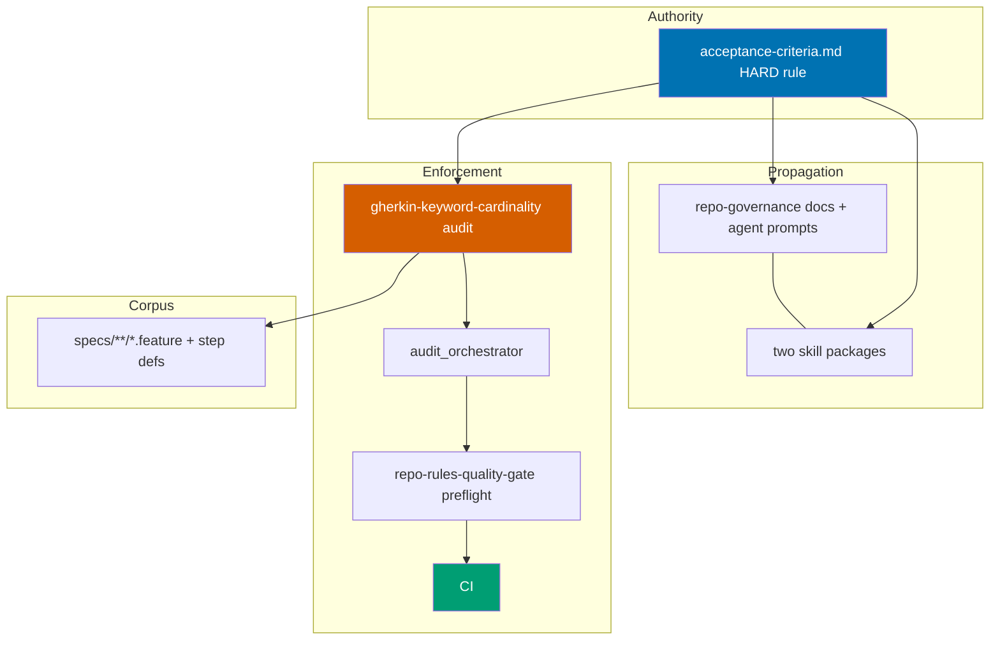

# Technical Documentation — Gherkin Step-Keyword Cardinality Rule

## Architecture Overview

Three coordinated artifacts: (1) governance text, (2) a deterministic Rust linter, and
(3) normalized spec files. The linter is the enforcement backbone; the governance text is
the authority; the spec retrofit brings the corpus into compliance.

## Design Decisions

### DD-1: Deterministic linter as a new rhino-cli audit category

The repo's deterministic governance checks live under
`apps/rhino-cli/src/internal/repo_governance/` as `<name>_audit.rs` modules, each with a
CLI command `apps/rhino-cli/src/commands/governance_<name>_audit.rs` and orchestrator
wiring in `apps/rhino-cli/src/internal/repo_governance/audit_orchestrator.rs`
[Repo-grounded — verified: `emoji_audit.rs`, `governance_emoji_audit.rs`, orchestrator
references at lines 21/49/68/297/375]. The new category `gherkin-keyword-cardinality`
follows the same shape. **Rationale**: reuses the established pattern, gets preflight + CI
wiring for free, and keeps the check deterministic (no AI judgment for the mechanical
cardinality check).

### DD-2: AI judgment criteria added to plan-checker + repo-rules-checker

In addition to the deterministic linter, the rule is added to the AI judgment criteria of
`plan-checker` and `repo-rules-checker` so authored Gherkin in plans (not just
`specs/**/*.feature`) is reviewed. **Rationale**: the deterministic linter scans
`specs/**/*.feature` only; plan `prd.md` Gherkin lives outside that glob.

### DD-3: Per-app phased retrofit with gates

One delivery phase per project that owns `.feature` files. Each phase normalizes the
feature files **and** their step definitions in lockstep, then gates on that project's
`test:unit`/`test:quick` + `spec-coverage validate`. **Rationale**: isolates breakage per
project; a broken binding surfaces at that project's gate, not repo-wide.

### DD-4: Propagation with AND without repo-rules-maker (distinct phases)

The original instruction requires both a `repo-rules-maker`-driven sweep **and** manual
edits. Phase 2 delegates the broad governance sweep to `repo-rules-maker`. Phase 3 edits
the two skill packages **by hand** (no `repo-rules-maker`) and re-syncs bindings via
`npm run generate:bindings`. **Rationale**: explicit requirement; also demonstrates the
rule propagates correctly through both channels.

### DD-5: Graceful zero-offender handling

Many `.feature` files likely already conform (single `When` + `And` is the common
existing pattern) [Judgment call]. Each retrofit phase runs the linter first; if a project
reports zero offenders, the phase makes no edits but still runs its gate. **Rationale**:
the exact per-project violation count is unknown until execution — the executor discovers
offenders via the linter rather than from fabricated counts.

## File Impact

### New files

- `apps/rhino-cli/src/internal/repo_governance/gherkin_keyword_cardinality_audit.rs`
  — _New file_ — the audit logic (parse feature files, flag scenarios with >1 primary
  `Given`/`When`/`Then`, respecting `Background` + `Scenario Outline` exemptions).
- `apps/rhino-cli/src/commands/governance_gherkin_keyword_cardinality_audit.rs`
  — _New file_ — the `repo-governance gherkin-keyword-cardinality` CLI command (mirrors
  `governance_emoji_audit.rs`).

### Modified files (linter wiring)

- `apps/rhino-cli/src/internal/repo_governance/audit_orchestrator.rs` — register the new
  category (module `use`, category id, dispatch arm). [Repo-grounded — orchestrator owns
  category registration]
- `apps/rhino-cli/src/commands/governance_audit.rs` — wire the new category into the
  orchestrator command. [Repo-grounded]
- `apps/rhino-cli/src/commands/mod.rs` (or equivalent command registry) — register the new
  command module. _Verify exact registry file at execution via `Grep`._
- `repo-governance/workflows/repo/repo-rules-quality-gate.md` — add the new category to
  the Step 0.5 deterministic preflight enumeration. [Repo-grounded — preflight defined at
  Step 0.5, lines ~111–130]
- CI workflow under `.github/workflows/` that runs the rhino-cli governance audit — add
  the new category to the audited set. _Verify exact workflow file at execution via
  `Grep` (no direct `repo-governance` match found in `.github/workflows/` at authoring;
  the preflight may be invoked via the quality-gate workflow rather than a dedicated CI
  step)._ [Unverified — confirm CI wiring path at execution]

### Modified files (governance authoring — via repo-rules-maker)

- `repo-governance/development/infra/acceptance-criteria.md` — author the HARD rule +
  normalize illustrative snippets. [Repo-grounded]
- `repo-governance/development/infra/bdd-spec-test-mapping.md` — reference the rule.
  [Repo-grounded]
- `repo-governance/conventions/structure/plans.md` — reference the rule where Gherkin is
  discussed. [Repo-grounded]
- `repo-governance/development/infra/best-practices.md` — reference the rule. [Repo-grounded]
- `repo-governance/development/infra/anti-patterns.md` — add multi-keyword as an
  anti-pattern. [Repo-grounded]
- `.claude/agents/plan-maker.md`, `.claude/agents/plan-checker.md`,
  `.claude/agents/repo-rules-checker.md` — add to prompt / judgment criteria.
  [Repo-grounded — all three agent files exist]

### Modified files (manual propagation — without repo-rules-maker)

- `.claude/skills/plan-writing-gherkin-criteria/SKILL.md` — state the rule + normalize
  snippets. [Repo-grounded]
- `.claude/skills/plan-creating-project-plans/SKILL.md` — reference the rule. [Repo-grounded]
- Secondary bindings (`.opencode/`, `.amazonq/`) regenerated by `npm run generate:bindings`.
  [Repo-grounded — generator documented in CLAUDE.md]

### Modified files (spec retrofit — per-app, discovered at execution)

- `specs/**/*.feature` offenders + their Godog (`apps/ayokoding-cli`, `apps/ose-cli`,
  Go libs) / cucumber-rs (`apps/rhino-cli`) / TS step definitions, discovered via the
  linter. Exact files unknown until the linter runs. [Repo-grounded — 124 feature files
  inventoried; offender set determined at execution]

## Dependencies

- Existing rhino-cli audit framework (`audit_orchestrator.rs`, established category
  pattern). [Repo-grounded]
- `npm run generate:bindings` for secondary-binding re-sync. [Repo-grounded — CLAUDE.md]
- `repo-rules-quality-gate` workflow (strict mode). [Repo-grounded]

## Testing Strategy

- **Linter (Rust)** — TDD: RED unit tests (multi-`When` flagged; `Background` exempt;
  `Scenario Outline`/`Examples` exempt; doc-string/comment edge cases not mis-flagged) →
  GREEN implementation → REFACTOR. Covered by `nx run rhino-cli:test:unit` +
  cucumber-rs where applicable. Each Gherkin acceptance criterion in `prd.md` maps to a
  RED test.
- **Per-app retrofit** — each phase gate runs the project's `test:unit`/`test:quick` +
  `spec-coverage validate` to confirm step bindings still resolve.
- **Repo-wide** — `repo-rules-quality-gate` (strict) preflight runs the linter across
  `specs/**/*.feature` and must report zero findings.

## Rollback

The change is additive (new rule, new linter) plus mechanical spec normalization. Rollback
= `git revert` of the relevant thematic commits. No data migrations, no schema changes.

## Research Note

Web research was **skipped** — this is a purely internal governance + tooling change with
no external library/version/API claims. All factual claims carry `[Repo-grounded]`,
`[Judgment call]`, or `[Unverified]` labels; there are no `[Web-cited]` claims.
