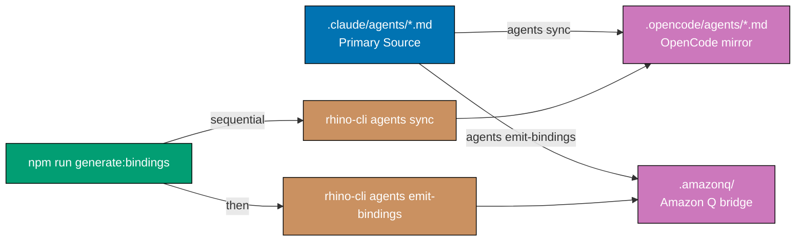
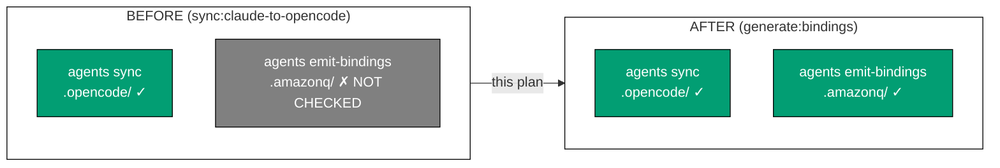

# Technical Documentation: Harness/Vendor Neutrality Blueprint — Phase 1

## Architecture Overview



## Current State (Before)

### package.json scripts (relevant subset) [Repo-grounded]

```json
"sync:claude-to-opencode": "cargo run --release --quiet --manifest-path apps/rhino-cli/Cargo.toml -- agents sync",
"sync:agents":             "cargo run --release --quiet --manifest-path apps/rhino-cli/Cargo.toml -- agents sync --agents-only",
"sync:skills":             "cargo run --release --quiet --manifest-path apps/rhino-cli/Cargo.toml -- agents sync --skills-only",
"sync:dry-run":            "cargo run --release --quiet --manifest-path apps/rhino-cli/Cargo.toml -- agents sync --dry-run",
"validate:config":         "npm run validate:claude && npm run sync:claude-to-opencode && npm run validate:opencode",
"validate:harness-bindings": "cargo run --release --quiet --manifest-path apps/rhino-cli/Cargo.toml -- agents validate-bindings"
```

No npm script wraps `agents emit-bindings`. [Repo-grounded: `package.json`]

### rhino-cli subcommands [Repo-grounded: `apps/rhino-cli/src/cli.rs`]

- `agents sync` → `commands::agents_sync::run` → writes `.opencode/agents/*.md`
- `agents emit-bindings` → `commands::agents_emit_bindings::run` → writes `.amazonq/` bridge

### Files referencing `sync:claude-to-opencode` [Repo-grounded: grep 2026-05-25]

Non-plan, non-generated-reports files:

| File                                                                        | Reference type                                                                            |
| --------------------------------------------------------------------------- | ----------------------------------------------------------------------------------------- |
| `package.json`                                                              | Definition                                                                                |
| `CLAUDE.md`                                                                 | Instruction (×1)                                                                          |
| `repo-governance/development/agents/ai-agents.md`                           | Instruction (×5)                                                                          |
| `repo-governance/development/agents/model-selection.md`                     | Instruction (×2)                                                                          |
| `repo-governance/development/quality/code.md`                               | Instruction (×2)                                                                          |
| `repo-governance/workflows/repo/repo-harness-compatibility-quality-gate.md` | Tool string (×4)                                                                          |
| `repo-governance/workflows/repo/repo-rules-quality-gate.md`                 | Instruction (×1)                                                                          |
| `docs/reference/platform-bindings.md`                                       | Reference (×1)                                                                            |
| `docs/reference/ai-model-benchmarks.md`                                     | Reference (×1)                                                                            |
| `apps/rhino-cli/scripts/validate-cross-vendor-parity.sh`                    | Shell script (×2)                                                                         |
| `.claude/skills/agent-developing-agents/SKILL.md`                           | Skill instruction (×1)                                                                    |
| `.claude/agents/web-research-maker.md`                                      | Reference (×1)                                                                            |
| `.claude/agents/repo-harness-compatibility-fixer.md`                        | Instruction (×8)                                                                          |
| `.claude/agents/repo-harness-compatibility-checker.md`                      | Tool string (×1)                                                                          |
| `.claude/agents/repo-rules-fixer.md`                                        | Instruction (×1)                                                                          |
| `.claude/agents/README.md`                                                  | Instruction (×1)                                                                          |
| `.claude/agents/agent-maker.md`                                             | Description frontmatter (×1)                                                              |
| `.opencode/agents/*`                                                        | Auto-synced mirrors — updated automatically by `generate:bindings` after `.claude/` edits |

Note: `AGENTS.md` has zero occurrences — no edit needed there.

Total: ~32 occurrences across ~17 non-auto-synced files.

## Target State (After)

### package.json scripts (proposed)

```json
"generate:bindings":      "cargo run --release --quiet --manifest-path apps/rhino-cli/Cargo.toml -- agents sync && cargo run --release --quiet --manifest-path apps/rhino-cli/Cargo.toml -- agents emit-bindings",
"sync:agents":             "cargo run --release --quiet --manifest-path apps/rhino-cli/Cargo.toml -- agents sync --agents-only",
"sync:skills":             "cargo run --release --quiet --manifest-path apps/rhino-cli/Cargo.toml -- agents sync --skills-only",
"sync:dry-run":            "cargo run --release --quiet --manifest-path apps/rhino-cli/Cargo.toml -- agents sync --dry-run",
"validate:config":         "npm run validate:claude && npm run generate:bindings && npm run validate:opencode",
"validate:harness-bindings": "cargo run --release --quiet --manifest-path apps/rhino-cli/Cargo.toml -- agents validate-bindings"
```

`sync:claude-to-opencode` is **removed entirely** — no deprecated alias, no passthrough. All
documentation and agent definitions are updated in the same delivery batch so there is no window
where the old name is referenced but absent.

### Why sequential `&&` not parallel

`agents emit-bindings` reads no output from `agents sync`, so they could theoretically run in
parallel. However:

1. Both are fast (< 1s each) — no parallelism benefit
2. Sequential `&&` short-circuits: if `agents sync` fails, `emit-bindings` is not run
3. Sequential order makes debug output readable (no interleaved stdout)

[Judgment call: sequential is correct here]

### Why keep `sync:agents`, `sync:skills`, `sync:dry-run`

These targeted scripts are used during development when only partial regeneration is needed
(e.g., `sync:agents` after changing a single agent without touching skills). They are not
aliases for `generate:bindings` — they are scoped operations. [Judgment call]

## Design Decisions

### Decision 1: Hard-delete `sync:claude-to-opencode` (no deprecated alias)

**Options considered**:

- A: Hard-delete `sync:claude-to-opencode` immediately (chosen)
- B: Keep as deprecated passthrough → `npm run generate:bindings`

**Rationale for A**: All ~27 documentation and agent definition references are updated in the
same delivery batch (Phases 2–3). A grep-verify step confirms zero remaining references before
the commit. Because the rename sweep and the script deletion land together, there is no window
where the old name is referenced but missing — the repo is never in a broken intermediate state.
A deprecated alias would leave dead weight that future checkers flag as a finding, requiring a
follow-up cleanup plan with no benefit. Clean break is simpler. [Judgment call]

### Decision 2: `generate:bindings` runs both sync AND emit-bindings (not emit-bindings-only)

`generate:bindings` must be the single command contributors run after any `.claude/` change.
If it omitted `agents sync`, OpenCode would be stale. Both must run. [Judgment call]

### Decision 3: No changes to `apps/rhino-cli/src/` Rust logic

The Rust CLI subcommands are implementation details. Only the npm wrapper changes. No Rust
code changes, no Cargo.toml changes, no Rust tests to update. This keeps the plan scope tight
and reduces risk. [Judgment call]

## File-Impact Analysis

### `package.json` [MODIFY]

- Add `generate:bindings` entry (new)
- **Delete** `sync:claude-to-opencode` entirely (hard delete — no alias)
- Change `validate:config` to use `generate:bindings` instead of `sync:claude-to-opencode`

### `repo-governance/development/agents/ai-agents.md` [MODIFY]

Three locations reference `sync:claude-to-opencode`. All replace with `generate:bindings`.

### `repo-governance/development/agents/model-selection.md` [MODIFY]

Two locations. Replace with `generate:bindings`.

### `repo-governance/development/quality/code.md` [MODIFY]

Two locations. Replace with `generate:bindings`.

### `repo-governance/workflows/repo/repo-harness-compatibility-quality-gate.md` [MODIFY]

Four locations; Invariant 3 tool string changes from:

```
npm run sync:claude-to-opencode && git diff --quiet .opencode/
```

to:

```
npm run generate:bindings && git diff --quiet .opencode/ .amazonq/
```

This extends the parity check to cover Amazon Q bindings too.

**Before vs after — Phase 0 Invariant 3 coverage**:



### `repo-governance/workflows/repo/repo-rules-quality-gate.md` [MODIFY]

One location. Replace.

### `.claude/agents/repo-harness-compatibility-fixer.md` [MODIFY]

Eight locations (description frontmatter + body instructions). All replace with `generate:bindings`.
After editing, run `npm run generate:bindings` to sync `.opencode/` mirror.

### `.claude/agents/repo-harness-compatibility-checker.md` [MODIFY]

One location (Phase 0 Invariant 3 tool string). Replace.
After editing, run `npm run generate:bindings`.

### `.claude/agents/repo-rules-fixer.md` [MODIFY]

One location. Replace.
After editing, run `npm run generate:bindings`.

### `.claude/agents/README.md` [MODIFY]

One location. Replace.

### `.claude/agents/agent-maker.md` [MODIFY]

One location in description frontmatter. Replace.
After editing, run `npm run generate:bindings`.

### `.claude/agents/web-research-maker.md` [MODIFY]

One location. Replace.
After editing, run `npm run generate:bindings`.

### `.claude/skills/agent-developing-agents/SKILL.md` [MODIFY]

One location in the skill instruction body. Replace with `generate:bindings`.

### `.opencode/agents/*.md` [AUTO-UPDATED]

All `.opencode/` mirrors are regenerated by `npm run generate:bindings` after the `.claude/`
edits above. No manual edits to `.opencode/` files.

### `CLAUDE.md` [MODIFY]

One location (under Platform Binding Examples). Replace with `generate:bindings`.

Note: `AGENTS.md` has zero occurrences of `sync:claude-to-opencode` — no edit needed.

### `docs/reference/platform-bindings.md` [MODIFY]

One location. Replace with `generate:bindings`.

### `docs/reference/ai-model-benchmarks.md` [MODIFY]

One location. Replace with `generate:bindings`.

### `apps/rhino-cli/scripts/validate-cross-vendor-parity.sh` [MODIFY]

Two locations in the shell script that invokes `npm run sync:claude-to-opencode`. Replace both
with `generate:bindings`.

## Dependencies

- No new npm packages
- No new Rust crates
- No new rhino-cli subcommands
- Requires rhino-cli to be buildable (existing dependency: `cargo` installed)

## Rollback

If `generate:bindings` is introduced but breaks something:

1. `git revert` the delivery commits — restores `package.json`, all docs, and agent definitions
   to their pre-plan state in one operation
2. `.opencode/` mirrors can be regenerated by running `cargo run ... -- agents sync` directly
   (the old npm script no longer exists after this plan)

Risk is low — this is a documentation + npm script change with no Rust logic change.

## Quality Gates

After delivery:

```bash
# 1. generate:bindings works end-to-end
npm run generate:bindings

# 2. Both secondary bindings are clean
git diff --quiet .opencode/ .amazonq/

# 3. No stale old name in governance docs and agent definitions
grep -r "sync:claude-to-opencode" repo-governance/ .claude/agents/ CLAUDE.md AGENTS.md | grep -v "generated-reports"
# Expected: zero matches

# 4. validate:config still works
npm run validate:config

# 5. Affected Nx quality gate
npx nx affected -t typecheck lint test:quick spec-coverage

# 6. vendor-audit passes
cargo run --release --quiet --manifest-path apps/rhino-cli/Cargo.toml -- repo-governance vendor-audit repo-governance/
```
