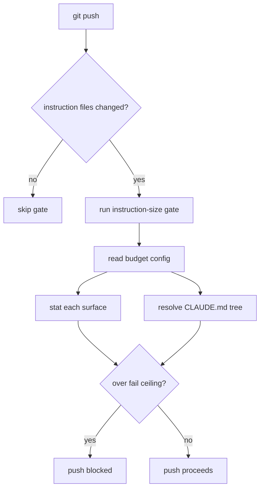

# Technical Documentation — Instruction-File Size-Budget Gate

## 1. The monitored file class ("AGENTS.md-class")

The gate watches **auto-loaded instruction surfaces** — files a harness reads into context
at session start (or per request), verbatim, before any user input. This is the boundary the
budget enforces; on-demand files (agent defs, skill bodies, plan READMEs, `settings.json`)
are **not** in this class.

| Surface / glob                                                | Harness that auto-loads it                                                                  | Exists today?                |
| ------------------------------------------------------------- | ------------------------------------------------------------------------------------------- | ---------------------------- |
| `AGENTS.md`, `**/AGENTS.md`                                   | Codex CLI, Copilot, Cursor, Windsurf, Junie, OpenCode (native); Claude Code (via `@import`) | ✅ root only                 |
| `CLAUDE.md`                                                   | Claude Code                                                                                 | ✅                           |
| Claude **resolved tree** (`CLAUDE.md` + recursive `@imports`) | Claude Code (this is what trips the 40k warning)                                            | ✅ (= CLAUDE.md + AGENTS.md) |
| `CONVENTIONS.md`                                              | Aider (when configured via `read:`)                                                         | ❌ future                    |
| `.github/copilot-instructions.md`                             | GitHub Copilot                                                                              | ❌ future                    |
| `.junie/guidelines.md`, `.junie/AGENTS.md`                    | JetBrains Junie                                                                             | ❌ future                    |
| `.cursor/rules/*.mdc`                                         | Cursor                                                                                      | ❌ future                    |
| `.windsurf/rules/*.md`, `.devin/rules/*.md`                   | Windsurf / Devin                                                                            | ❌ future                    |
| `.amazonq/rules/*.md`                                         | Amazon Q Developer                                                                          | ✅ (generated bridge, 395 B) |

**No-op rule (FR3)**: a glob that matches nothing emits nothing. Future surfaces are
pre-budgeted but never fail until they exist.

**Explicitly NOT monitored** (loaded on demand or never injected): `.claude/agents/*.md`,
`.claude/skills/*/SKILL.md` bodies, `.opencode/agents/*` (generated), `settings.json` /
`opencode.json`, `plans/**`, `CLAUDE.local.md` (gitignored).

## 2. Per-file size budget (the numbers)

Measurement is **bytes** (`fs::metadata().len()`), matching the existing validator. For the
ASCII-dominant instruction files here, bytes ≈ characters.

Each surface has three tiers: `target` (ok, silent), `warn` (reported, non-blocking),
`fail` (blocks pre-push + CI). Tier rule: `size ≤ target` → ok; `target < size ≤ warn`
→ warn; `warn < size ≤ fail` → warn; `size > fail` → fail (mirrors the existing
three-tier `classify`).

| Surface / glob                              | target (B) | warn (B) | **fail (B)** | Binding rationale                                                                                                                      |
| ------------------------------------------- | ---------: | -------: | -----------: | -------------------------------------------------------------------------------------------------------------------------------------- |
| `AGENTS.md`, `**/AGENTS.md`                 |     24,000 |   27,000 |   **30,000** | Codex `project_doc_max_bytes` = 32,768 silent truncation; 30k keeps margin **and** keeps the Claude tree (`+CLAUDE.md` 6.6k) under 40k |
| `CLAUDE.md`                                 |      6,000 |    8,000 |   **10,000** | Thin import shim; should hold only binding details + `@AGENTS.md`                                                                      |
| **resolved tree** (`CLAUDE.md`+`@imports`)  |     30,000 |   34,000 |   **38,000** | Claude Code 40k runtime warning, ≈5% headroom                                                                                          |
| `CONVENTIONS.md`                            |     10,000 |   13,000 |   **16,000** | No harness hard cap; keep lean                                                                                                         |
| `.github/copilot-instructions.md`           |      6,000 |    8,000 |   **10,000** | Copilot soft "≤2 pages"                                                                                                                |
| `.junie/guidelines.md`, `.junie/AGENTS.md`  |      6,000 |    8,000 |   **10,000** | Junie advisory 20–40 lines                                                                                                             |
| `.cursor/rules/*.mdc`                       |      4,000 |    8,000 |   **12,000** | Cursor "keep rules under 500 lines"                                                                                                    |
| `.windsurf/rules/*.md`, `.devin/rules/*.md` |      6,000 |    9,000 |   **12,000** | Windsurf **12,000-char hard cap** (silent drop over budget)                                                                            |
| `.amazonq/rules/*.md`                       |      4,000 |    8,000 |   **12,000** | Generated bridge; must stay tiny                                                                                                       |

### 2.1 Why these recalibrate the existing gate

The current `agents-md-size` thresholds are `target 30,000 / warn 35,000 / fail 40,000`.
That `fail 40,000` is **above** Codex's 32,768 truncation point and lets `AGENTS.md` alone
push the Claude tree past 40k. This plan **tightens `AGENTS.md` to `fail 30,000`** so:

- `30,000 < 32,768` → Codex never truncates `AGENTS.md`.
- `30,000 + CLAUDE.md (6,622) = 36,622 < 38,000` tree ceiling `< 40,000` Claude warning.

The two checks (`AGENTS.md` per-file ceiling **and** resolved-tree ceiling) are independent;
in practice the tighter one governs, which is correct.

### 2.2 Current repo state vs. new budget

| Surface                          | Current | New fail ceiling | Action                                  |
| -------------------------------- | ------: | ---------------: | --------------------------------------- |
| `AGENTS.md`                      |  41,108 |           30,000 | **Trim ~11k+ (Phase 3); target 24k**    |
| `CLAUDE.md`                      |   6,622 |           10,000 | within budget                           |
| resolved tree                    |  47,730 |           38,000 | falls under once `AGENTS.md` is trimmed |
| `.amazonq/rules/00-agents-md.md` |     395 |           12,000 | within budget                           |

## 3. Config file

A committed YAML config (sibling to `env-contract.yaml`), single source of truth for the
budget. Proposed `instruction-size-budget.yaml` at repo root:

```yaml
# Schema: rhino-cli/instruction-size-budget/v1
# Byte thresholds for auto-loaded AI instruction surfaces.
surfaces:
  - glob: "AGENTS.md"
    target: 24000
    warn: 27000
    fail: 30000
  - glob: "**/AGENTS.md"
    target: 24000
    warn: 27000
    fail: 30000
  - glob: "CLAUDE.md"
    target: 6000
    warn: 8000
    fail: 10000
  - glob: ".amazonq/rules/*.md"
    target: 4000
    warn: 8000
    fail: 12000
  # ...future surfaces (no-op until the file exists)
resolved_tree:
  root: "CLAUDE.md"
  target: 30000
  warn: 34000
  fail: 38000
```

**Decision point** (maintainer may override): the byte thresholds above. They are derived
from documented per-harness limits (see [the sources](#9-sources)); a maintainer who
adds `.windsurf/rules` should keep that surface ≤ 12,000.

## 4. Validator design (Rust, TDD)

Generalize, don't replace. Current layout:

- `apps/rhino-cli/src/application/repo_governance/agents_md_size.rs` — `check_agents_md_size`,
  `classify`, the three constants.
- `apps/rhino-cli/src/commands/convention_validate_agents_md_size.rs` — CLI wrapper, output
  modes, `SCHEMA`.
- `convention_audit.rs` — `MEMBERS = ["emoji", "license", "agents-md-size"]`.

Target layout:

- New `application/repo_governance/instruction_size.rs`:
  - `BudgetConfig` (parsed from `instruction-size-budget.yaml`), `Surface { glob, target,
warn, fail }`, `ResolvedTree { root, target, warn, fail }`.
  - `check_instruction_sizes(repo_root, config) -> Vec<InstructionSizeFinding>` — globs each
    surface (skip no-match), stats each file, classifies. `classify(size, target, warn,
fail)` is the existing tier logic, parameterized.
  - `resolve_tree_size(root) -> i64` — read `root`, find `@path` import directives (Claude
    import syntax), recursively sum imported file bytes (depth cap 4, matching Claude),
    classify against `ResolvedTree`.
- Keep `agents_md_size.rs` as a **thin shim**: `check_agents_md_size` delegates to the
  generalized classifier scoped to `AGENTS.md` (preserves the existing tests + alias).
- New `commands/convention_validate_instruction_size.rs` — `text`/`json`/`markdown`,
  `SCHEMA = "rhino-cli/instruction-size/v1"`, exit non-zero if any finding is `fail`.
- `convention_audit.rs` — add `"instruction-size"` to `MEMBERS`; keep `"agents-md-size"` as
  the alias entry (or drop from the audit set and keep only as a standalone alias — decided in
  delivery §I).

**Coverage**: new modules must clear the 90%-line `lang:rust` gate. Unit tests cover each
tier boundary per surface, no-match no-op, resolved-tree summation, and the missing-config
error path. (Per the rhino-cli port convention, the cucumber-rs harness is deferred; unit
tests + the committed Gherkin under `specs/apps/rhino` are the coverage of record.)

## 5. Wiring

### 5.1 Nx target

```json
"instruction-size:validation": {
  "executor": "nx:run-commands",
  "options": {
    "command": "cargo run --release --quiet --manifest-path apps/rhino-cli/Cargo.toml -- convention validate instruction-size"
  },
  "inputs": [
    "{projectRoot}/src/**/*.rs",
    "{workspaceRoot}/instruction-size-budget.yaml",
    "{workspaceRoot}/AGENTS.md",
    "{workspaceRoot}/CLAUDE.md",
    "{workspaceRoot}/.amazonq/rules/*.md"
  ]
}
```

### 5.2 Pre-push hook

Extend the existing `if [ -n "$RANGE" ]; then ... fi` changed-path block (it already gates
`naming:harness-validation`, `vendor-audit-validation`, `parity-validation`, etc. on
`$CHANGED`):

```sh
if echo "$CHANGED" | grep -qE '^(AGENTS\.md$|.*/AGENTS\.md$|CLAUDE\.md$|CONVENTIONS\.md$|\.github/copilot-instructions\.md$|\.junie/|\.cursor/rules/|\.windsurf/rules/|\.devin/rules/|\.amazonq/rules/)'; then
  npx nx run rhino-cli:instruction-size:validation
fi
```

This matches the user's requirement exactly: the gate is **forced at pre-push only when the
push range touches an instruction-file surface**, and is a hard (non-cacheable-skippable)
block.

### 5.3 Pre-commit + CI

Keep the validator as a `convention audit` member so it also runs at pre-commit and in the
markdown/convention CI gate (`markdown-validate.yml` / `commons-quality-gate.yml`) — defense
in depth. Pre-push is the **hard** gate per the user's instruction; pre-commit/CI are
backstops.

## 6. Governance propagation

| Surface                                                                 | Change                                                                                                                                                           | Agent / mechanism              |
| ----------------------------------------------------------------------- | ---------------------------------------------------------------------------------------------------------------------------------------------------------------- | ------------------------------ |
| `repo-governance/conventions/structure/instruction-file-size-budget.md` | **New convention** — file class, budget table, enforcement points, rationale, `Principles Implemented/Respected`                                                 | `repo-rules-maker`             |
| `repo-governance/conventions/README.md`                                 | Index entry for the new convention                                                                                                                               | `repo-rules-maker` propagation |
| `AGENTS.md` "Markdown Quality" / "Cross-Language Lint Gates"            | One-line gate entry + `See` link (no inline expansion — that would re-bloat the file)                                                                            | edit                           |
| `repo-governance/development/infra/nx-targets.md`                       | Add `instruction-size:validation` to the canonical target list                                                                                                   | edit                           |
| `.claude/agents/repo-rules-checker.md` Step 6                           | Rename "AGENTS.md Size Check" → "Instruction-File Size Budget"; deterministic-gate annotation points at `instruction-size`; qualitative bloat across whole class | edit                           |
| `repo-governance/workflows/repo/repo-rules-quality-gate.md`             | Name `instruction-size` among the convention-tier deterministic validators (Step 0.5 paragraph + Step 6 reference)                                               | edit                           |
| `specs/apps/rhino/**`                                                   | Companion Gherkin for the new validator (two-path rule)                                                                                                          | `specs-maker` / hand           |

Per the [propagate-via-maker memory], the convention is authored by `repo-rules-maker` and
**all** reference surfaces are swept (not just the obvious ones), then bindings re-synced
(`npm run generate:bindings`) so `.opencode/` / `.amazonq/` stay in parity.

## 7. Flow



Accessible-palette note: render with the repo's color-blind-safe Mermaid theme per the
[diagrams convention](../../../repo-governance/conventions/formatting/diagrams.md).

## 8. Risks & mitigations

| Risk                                   | Mitigation                                                                                                                                                     |
| -------------------------------------- | -------------------------------------------------------------------------------------------------------------------------------------------------------------- |
| Shipping a gate the repo already fails | Phase 3 trims `AGENTS.md` under 30k **before** the gate is wired green; delivery gates Phase 2→3 ordering                                                      |
| `AGENTS.md` trim loses a rule          | Trim only moves inline-expanded content to its **already-linked** `repo-governance/` home; `repo-rules-checker` + `cross-vendor:parity-validation` catch drift |
| Resolved-tree `@import` parsing wrong  | Unit tests on a fixture `CLAUDE.md` with nested imports; depth cap 4                                                                                           |
| Threshold bikeshedding                 | Numbers live in one YAML; tuning is a reviewed one-line edit, not a code change                                                                                |
| Downstream repos silently diverge      | Phase 6 records an explicit parity hand-off note                                                                                                               |

## 9. Sources

Derived from a web-researched per-harness limit survey (2026-06-26): Claude Code 40k runtime
warning + "≤200 lines" doc target; Codex CLI `project_doc_max_bytes` 32,768 silent
truncation; Windsurf/Devin 12,000-char hard cap; Copilot soft "≤2 pages" (4k cap removed
2026-06); Junie "20–40 lines"; agents.md standard publishes no size guidance. Full citations
in the conversation that spawned this plan; the convention doc (Phase 4) will carry the
durable citation list.
