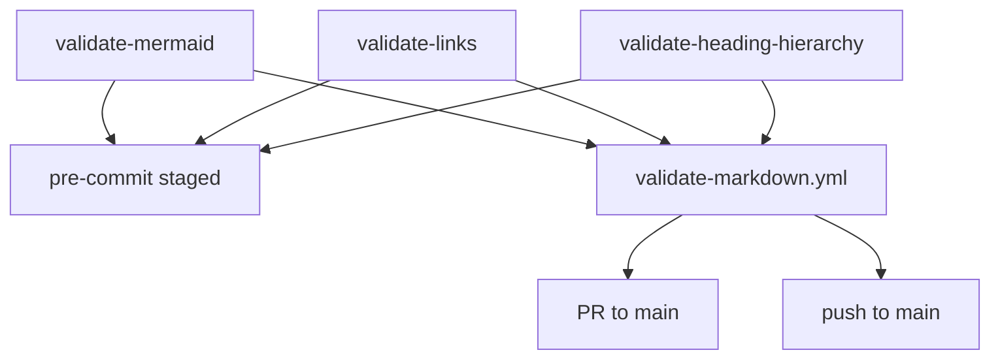

# Technical Documentation — Markdown Gate Coverage Expansion

## Architecture

Three Rust CLI validators plus their wiring. The enforcement layers are unified across all three.



- **Layer 1 — `.husky/pre-commit`** (local, staged-only, blocking): the existing pre-commit suite
  is a Rust subcommand (`rhino-cli git pre-commit`) whose `step7_validate_links` already runs the
  link checker staged-only. [Repo-grounded — `apps/rhino-cli/src/internal/git.rs:409`] This plan
  adds staged-only mermaid and heading-hierarchy steps alongside it; `--no-verify` is the WIP
  escape.
- **Layer 2 — PR CI** and **Layer 3 — push CI** (full scan, blocking): consolidated into a single
  `.github/workflows/validate-markdown.yml` triggered on `pull_request: [main]` + `push: [main]`.

## Component inventory (grounded)

### Gate A — Mermaid

- CLI: `apps/rhino-cli/src/commands/docs_validate_mermaid.rs`; core
  `apps/rhino-cli/src/internal/mermaid.rs`. [Repo-grounded]
- Nx target `validate:mermaid`:
  `cargo run ... -- docs validate-mermaid --max-depth=4 repo-governance/ .claude/`. [Repo-grounded
  — `project.json:167`]
- Pre-push trigger: `.husky/pre-push` runs `validate:mermaid` when a changed file matches
  `^(repo-governance/|\.claude/).*\.md$`. [Repo-grounded — `.husky/pre-push:24`] **This trigger is
  removed by this plan.**
- All companion mermaid work (full-repo scan, inline exemptions, color/structural/correctness
  checks, warnings→blocking) is preserved; only the enforcement layer changes.

### Gate B — Relative-link checker

- Core: `apps/rhino-cli/src/internal/docs/links.rs`. [Repo-grounded]
  - `ScanOptions { repo_root, staged_only, skip_paths }` — `skip_paths` + `filter_skip_paths` EXIST
    and work (prefix match), but the command hardcodes `skip_paths: Vec::new()`. [Repo-grounded —
    `links.rs:52-59,197`, `docs_validate_links.rs:37`]
  - `get_all_markdown_files` scans only `["repo-governance", "docs", ".claude"]` + root `*.md`.
    [Repo-grounded — `links.rs:170`]
  - `validate_file` hard-skips any path containing `.claude/skills/`. [Repo-grounded —
    `links.rs:340`]
  - `resolve_link` strips `#fragment` before resolving — **anchors are never validated**.
    [Repo-grounded — `links.rs:375`]
- CLI: `apps/rhino-cli/src/commands/docs_validate_links.rs` — only `--staged-only` flag today; no
  `--exclude`. [Repo-grounded]

### Gate C — Heading-hierarchy

- Core: `apps/rhino-cli/src/internal/docs/heading_hierarchy.rs` — three kinds (`missing-h1`,
  `duplicate-h1`, `skipped-level`); fence-aware `collect_headings` + `parse_heading_level`.
  [Repo-grounded]
- CLI: `apps/rhino-cli/src/commands/docs_validate_heading_hierarchy.rs` — `DEFAULT_PATHS =
["docs/", "repo-governance/"]`; positional override; uses `NAMING_SKIP_DIRS` for dir skipping.
  [Repo-grounded — `docs_validate_heading_hierarchy.rs:22`, `heading_hierarchy.rs:18`]
- Registered in `cli.rs` as `docs validate-heading-hierarchy` but **wired into NO hook, NO Nx
  target, NO CI**. [Repo-grounded — `cli.rs:206`; grep confirms no target/workflow references it]

### Shared infrastructure

- `NAMING_SKIP_DIRS = ["node_modules", ".git", ".next", "dist", "build", "target"]`. [Repo-grounded
  — `naming.rs:37`]
- Pre-commit suite: `rhino-cli git pre-commit` → `apps/rhino-cli/src/internal/git.rs` `run(deps)`
  with numbered steps; `step7_validate_links` is the link step. [Repo-grounded]
- `markdownlint` config disables MD025 + MD001. [Repo-grounded — `.markdownlint-cli2.jsonc`]
- Existing CI: `.github/workflows/pr-validate-links.yml` runs `docs validate-links` on
  `pull_request` only (checkout → `setup-rust` → run). [Repo-grounded] Note: the `on:` block has
  `types: [opened, synchronize, reopened]` with **no `branches: [main]` restriction** — it fires on
  ALL pull requests regardless of target branch. [Repo-grounded — `pr-validate-links.yml:3-5`] The
  replacement `validate-markdown.yml` is intentionally scoped to `branches: [main]`, which is
  consistent with this repo's Trunk Based Development workflow (all PRs target `main`); PRs
  targeting other branches are not expected and would lose link-validation coverage — this is
  acceptable given TBD policy. `pr-quality-gate.yml` is the affected-language matrix, unchanged by
  this plan. [Repo-grounded]

## Scope Matrix (authoritative)

| Gate                           | Scope                                                                   | Excludes                                 |
| ------------------------------ | ----------------------------------------------------------------------- | ---------------------------------------- |
| Mermaid (flowchart-only)       | repo-wide                                                               | 3 named + noise dirs + inline exemptions |
| Link (+ anchors)               | repo-wide                                                               | 3 named + noise dirs + `.claude/skills/` |
| Heading-hierarchy (PROSE rule) | allowlist: `docs/`, `repo-governance/`, `plans/`(−`done/`), root `*.md` | everything else (default-deny)           |

- **The 3 named exclusions** (link + mermaid; heading default-deny already excludes them):
  `plans/done/`, `apps/ayokoding-web/content/`, `apps/ose-web/content/`.
- **Noise-skip set** (link + mermaid): `node_modules, dist, target, .next, coverage,
generated-reports, local-temp, archived, apps-labs`.

## Design Decisions

### DD-1 — Mermaid: pre-push → pre-commit staged-only

Remove the mermaid block from `.husky/pre-push` (lines 23-25). Add a staged-only mermaid step to
the `rhino-cli git pre-commit` suite in `apps/rhino-cli/src/internal/git.rs`, alongside
`step7_validate_links`. Mermaid checks are per-file (no cross-file dependency), so a staged-only
scan that lints only the changed `*.md` files loses nothing relative to the old pre-push behavior.
The full-repo mermaid scan still runs in CI (Layer 2/3).

- **Option A (chosen)**: add a staged-only mermaid step inside the Rust pre-commit suite, mirroring
  `step7_validate_links`. Keeps all pre-commit logic in one place, testable. [Judgment call]
- **Option B (rejected)**: keep mermaid in a shell hook block at pre-commit. Rejected — splits
  pre-commit logic across shell + Rust, harder to test.

### DD-2 — Link checker: `--exclude` flag

Add a repeatable `--exclude <path>` arg to `ValidateLinksArgs` (clap `#[arg(long = "exclude")]`,
`Vec<String>`), thread it into `ScanOptions.skip_paths` (replacing the hardcoded `Vec::new()`).
`filter_skip_paths` already applies prefix matching. Repo call sites pass the three named
exclusions explicitly (visible, testable) rather than hardcoding them in the validator:

- Nx target / CI / pre-commit invocation:
  `docs validate-links --exclude plans/done --exclude apps/ayokoding-web/content --exclude apps/ose-web/content`.

### DD-3 — Link checker: repo-wide scan minus noise dirs

Change `get_all_markdown_files` from the three hardcoded dirs to a whole-repo walk that skips the
noise-skip set (`node_modules, dist, target, .next, coverage, generated-reports, local-temp,
archived, apps-labs`) and the existing `.git`. Keep the `.claude/skills/` hard-skip in
`validate_file` unchanged. The three named exclusions are NOT baked in here — they arrive via
`--exclude` (DD-2) so they stay visible at call sites.

- **Walk implementation**: reuse `walkdir::WalkDir` over `repo_root` with a `filter_entry` that
  drops any directory whose name is in the noise-skip set (same pattern as
  `heading_hierarchy.rs:69`). [Repo-grounded — pattern exists]

### DD-4 — Link checker: internal-anchor validation (`broken-anchor`)

When a parsed link has a `#fragment`, validate the fragment against the target file's headings:

1. Resolve the target file (existing `resolve_link` already strips the fragment for file
   resolution; capture the fragment separately before stripping).
2. If the file exists, parse its ATX headings with the **shared fence-aware parser** (DD-5).
3. GitHub-slugify each heading title and build the slug set with collision suffixes.
4. If the fragment slug is absent from the set, emit a `BrokenLink` with `category =
"broken-anchor"` (new category; existing `BrokenLink` struct reused — anchors ride the same
   reporting path).

- **Prerequisite — `extract_links` pure-anchor skip**: `links.rs:245` currently contains
  `|| url.starts_with('#')` which causes `extract_links` to discard all `[text](#fragment)` links
  before they reach any validation logic. [Repo-grounded — `links.rs:243-249`] This skip MUST be
  removed (or conditioned to only skip after anchor validation) as part of this DD's implementation.
  Without this change, same-file anchor links are never extracted and scenario 7 of the Gherkin
  acceptance criteria (prd.md) is untestable.
- **Same-file anchors** (`[X](#frag)`): once the pure-anchor skip is removed, `resolve_link`
  already returns the source file for a pure anchor — validate the fragment against the source
  file's own headings.
- **GitHub slug algorithm**: lowercase; strip every character that is not alphanumeric, hyphen, or
  space; convert spaces to hyphens; for duplicate slugs append `-1`, `-2`, … in document order.
  Implemented as a helper in `links.rs` with unit tests over fixture headings.
- **Skip rules preserved**: external URLs, `mailto:`, and placeholder patterns still short-circuit
  before anchor checking (anchors are only checked for links that survive `should_skip_link`).

### DD-5 — Shared fence-aware heading parser (no duplication)

`heading_hierarchy.rs` already has `collect_headings` + `parse_heading_level` + `parse_fence_open`
that correctly ignore headings inside fenced code blocks. [Repo-grounded —
`heading_hierarchy.rs:114-205`] The anchor validator (DD-4) needs the same parse. Factor a shared
helper rather than duplicate:

- **Important**: the existing `collect_headings` returns `Vec<Heading>` where `Heading = { line:
usize, level: usize }` — it does NOT return the heading title. [Repo-grounded —
  `heading_hierarchy.rs:114-144`] The anchor validator needs the title to slugify. This DD therefore
  creates a **NEW function** (e.g. `pub(crate) fn collect_atx_headings(content: &str) ->
Vec<(usize, usize, String)>` returning `(line, level, title)`) that shares the same fence-aware
  parse logic as `collect_headings` but also captures the heading text. This is a refactor +
  extension — it is NOT a direct reuse of `collect_headings` as-is.
- The new function is placed in `heading_hierarchy.rs` or a small shared `docs/headings.rs` module,
  consumed by BOTH `heading_hierarchy.rs` (which needs line+level) and `links.rs` (which needs
  level+title for slugging).
- The refactor MUST be behavior-preserving — all existing `heading_hierarchy.rs` tests stay green.

### DD-6 — Heading-hierarchy: prose-allowlist default-deny

The validator must run ONLY on prose trees and never on prompt/skill artifacts. Implement the
allowlist **inside the validator's file selection**, not merely via CLI args, so a pre-commit
staged-only run that stages a `.claude/agents/*.md` or `SKILL.md` file cannot trip a finding.

- **Allowlist trees**: `docs/`, `repo-governance/`, `plans/` (minus `plans/done/`), and root-level
  `*.md`.
- **Default-deny**: any file not under an allowlist tree is skipped. In particular `.claude/**`,
  `.opencode/**`, `.amazonq/**`, `apps/**`, `libs/**`, `plans/done/`, and the noise-skip set are
  excluded.
- **Implementation**: add an `is_prose_allowlisted(repo_rel_path) -> bool` predicate applied to
  every candidate file in `walk_heading_hierarchy_path` AND in the staged-file path used at
  pre-commit. The pre-commit step computes each staged file's repo-relative path and runs the
  predicate before invoking the checker.
- **`--exclude` flag**: add the same repeatable `--exclude <path>` arg for parity (DD-2 shape),
  applied on top of the allowlist (allowlist first, then subtract excludes).

- **Option A (chosen)**: allowlist predicate inside file selection. Robust against any caller
  (CLI default, positional override, staged-only). [Judgment call]
- **Option B (rejected)**: rely only on passing allowlist paths as CLI positional args. Rejected —
  a staged-only pre-commit run passes individual staged files, so an agent file could slip through
  if the predicate is not also applied per-file.

### DD-7 — Pre-commit suite: add mermaid + heading steps

Extend `apps/rhino-cli/src/internal/git.rs` `run(deps)` with two new staged-only steps mirroring
`step7_validate_links`:

- **Mermaid step**: collect staged `*.md`, run the mermaid validator over them (minus the three
  named exclusions + noise dirs), block on findings.
- **Heading step**: collect staged `*.md`, filter by `is_prose_allowlisted` (DD-6), run the heading
  validator over the survivors, block on findings.

Both steps use the same `staged_only` git-diff mechanism `step7` already uses. Add unit tests for
each step (mirroring the existing `step7`/pre-commit tests).

### DD-8 — Consolidated CI workflow

Create `.github/workflows/validate-markdown.yml` triggered on both events:

```yaml
on:
  pull_request:
    branches: [main]
  push:
    branches: [main]
```

The workflow checks out (`actions/checkout@v6` [Repo-grounded — mirrors `pr-validate-links.yml`]),
sets up Rust (`./.github/actions/setup-rust`, plus
`./.github/actions/setup-node` if invoking via `nx`), and runs all three validators full-scan
(mermaid + links-with-excludes + heading-hierarchy). Then **delete `pr-validate-links.yml`** and
confirm its link check now lives in the consolidated workflow. The dual-trigger pattern is grounded
in the existing `crane-cli-integration.yml`. [Repo-grounded] `pr-quality-gate.yml` is unchanged.

- **Job structure**: one job with sequential steps (or three jobs) — each gate runs independently
  so a failure names which gate failed. Run the validators via `cargo run ... -- docs validate-*`
  directly (matching `pr-validate-links.yml`'s existing style) OR via `nx run` targets if targets
  are added.

### DD-9 — Optional Nx targets

`validate:mermaid` exists. There is no `validate:links` or `validate:heading-hierarchy` Nx target
today. [Repo-grounded — confirmed by grep] This plan MAY add `validate:links` and
`validate:heading-hierarchy` Nx targets (cacheable, with appropriate `inputs`) for symmetry and to
let CI invoke them via `nx`. If added, the CI workflow and pre-commit reference them; if not, CI
invokes `cargo run` directly as `pr-validate-links.yml` does today. The plan implements targets
(cleaner CI + caching). Each target's command passes the three `--exclude` flags (link/mermaid).

## Validator Behavior Matrix (after this plan)

| Validator                    | Scope                                           | New behavior                                                         |
| ---------------------------- | ----------------------------------------------- | -------------------------------------------------------------------- |
| `validate-mermaid`           | repo-wide − 3 named − noise − exemptions        | enforcement moved to pre-commit + CI (no pre-push)                   |
| `validate-links`             | repo-wide − 3 named − noise − `.claude/skills/` | `--exclude` flag; whole-repo scan; `broken-anchor` anchor validation |
| `validate-heading-hierarchy` | prose allowlist (default-deny)                  | un-orphaned; allowlist filter in file selection; `--exclude` flag    |

## File Impact

| File                                                             | Change                                                                                                     | Executor                |
| ---------------------------------------------------------------- | ---------------------------------------------------------------------------------------------------------- | ----------------------- |
| `.husky/pre-push`                                                | Remove the mermaid trigger block (DD-1)                                                                    | `swe-rust-dev`          |
| `apps/rhino-cli/src/internal/git.rs`                             | Add staged-only mermaid + heading-hierarchy pre-commit steps (DD-7); heading step applies prose allowlist  | `swe-rust-dev`          |
| `apps/rhino-cli/src/commands/docs_validate_links.rs`             | Add repeatable `--exclude` arg; thread into `ScanOptions.skip_paths` (DD-2)                                | `swe-rust-dev`          |
| `apps/rhino-cli/src/internal/docs/links.rs`                      | Repo-wide walk minus noise dirs (DD-3); `broken-anchor` category + GitHub-slugify anchor validation (DD-4) | `swe-rust-dev`          |
| `apps/rhino-cli/src/internal/docs/heading_hierarchy.rs`          | Factor shared fence-aware heading parser (DD-5); add prose-allowlist predicate (DD-6)                      | `swe-rust-dev`          |
| `apps/rhino-cli/src/commands/docs_validate_heading_hierarchy.rs` | Add repeatable `--exclude` arg; apply allowlist on top of defaults (DD-6)                                  | `swe-rust-dev`          |
| `apps/rhino-cli/project.json`                                    | Add `validate:links` + `validate:heading-hierarchy` Nx targets; pass `--exclude` flags (DD-9)              | `swe-rust-dev`          |
| `.github/workflows/validate-markdown.yml`                        | **NEW FILE** — dual `pull_request`/`push` to `main`; runs all three gates (DD-8)                           | `swe-rust-dev`          |
| `.github/workflows/pr-validate-links.yml`                        | **DELETE** — migrated into `validate-markdown.yml` (DD-8)                                                  | `swe-rust-dev`          |
| `repo-governance/conventions/formatting/diagrams.md`             | Update mermaid-enforcement description (pre-commit + CI, no pre-push)                                      | `repo-rules-maker`      |
| `repo-governance/conventions/writing/quality.md`                 | Note single-H1 / heading-nesting now enforced for prose via rhino-cli                                      | `repo-rules-maker`      |
| `repo-governance/conventions/formatting/linking.md`              | Note `#fragment` anchor validation is now enforced                                                         | `repo-rules-maker`      |
| Check-inventory / repository-validation docs                     | Add the three markdown gates and the consolidated workflow                                                 | `repo-rules-maker`      |
| Markdown across covered trees                                    | Per-tree fix-all (mermaid findings, broken links/anchors, prose headings)                                  | per-tree (see delivery) |

## Dependencies

- Existing `rhino-cli` toolchain (Rust, `cargo`, Nx). [Repo-grounded]
- CI composite actions `./.github/actions/setup-rust` (and `setup-node` if invoking via `nx`).
  [Repo-grounded — used by existing jobs]
- No new external crates anticipated; slugging + anchor checking reuse existing `regex`/string
  handling and `walkdir`. [Judgment call — confirm during GREEN; any new crate must pass the
  dependency-bump policy]

## Testing Strategy

TDD throughout (Red → Green → Refactor). Each Gherkin scenario in [prd.md](./prd.md) maps to a
test level:

| Acceptance criterion                                      | Test level                                              |
| --------------------------------------------------------- | ------------------------------------------------------- |
| `--exclude` skips named trees / prefix semantics          | Unit (`links.rs`, `docs_validate_links.rs`)             |
| Repo-wide scan minus noise dirs                           | Unit + Integration                                      |
| `broken-anchor` flagged / valid anchor passes             | Unit (`links.rs`)                                       |
| GitHub slug collision suffixes                            | Unit (slug helper, fixture headings)                    |
| Same-file anchor validation                               | Unit                                                    |
| Shared heading-parser refactor is behavior-preserving     | Unit (existing `heading_hierarchy.rs` tests stay green) |
| Heading prose allowlist runs / agent+skill files exempt   | Unit (`heading_hierarchy.rs`)                           |
| `plans/done` + `apps` excluded from heading rules         | Unit                                                    |
| Heading `--exclude` parity                                | Unit                                                    |
| Staged skill file never trips heading rules at pre-commit | Unit (`git.rs` pre-commit step)                         |
| Pre-push has no mermaid trigger                           | Manual / shell inspection                               |
| Pre-commit runs all three gates staged-only               | Unit (`git.rs` steps) + manual                          |
| Consolidated workflow triggers + runs all three gates     | CI verification + YAML inspection                       |
| Legacy link workflow migrated                             | Inspection (`pr-validate-links.yml` deleted)            |
| Per-tree zero findings                                    | Integration (run gates per tree)                        |
| This plan passes its own gates                            | Integration (run gates on `plans/`)                     |

All preexisting unit tests in `links.rs`, `heading_hierarchy.rs`, and `mermaid.rs` MUST remain
green at every phase gate.

## Rollback

Each phase is independently revertable via `git revert` of its thematic commit(s). The link
`--exclude` + scope + anchor changes are one self-contained commit; the heading allowlist + wiring
is another; the pre-commit/pre-push enforcement move is another; the CI consolidation is another.
Reverting the CI consolidation restores `pr-validate-links.yml`; reverting the pre-commit move
restores the pre-push mermaid trigger. The shared-parser refactor (DD-5) is behavior-preserving, so
reverting it (and the anchor feature that depends on it) leaves `heading_hierarchy.rs` functionally
unchanged.
