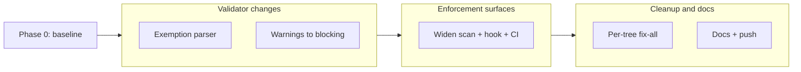

# Mermaid Gate Coverage Expansion

> **Plan type**: Multi-file (five canonical documents). This README is the navigation hub.
> **Status**: In progress (authoring complete; execution pending — do NOT execute from this doc).

## Context

The repository enforces a Mermaid diagram quality gate via the Rust tool
`rhino-cli docs validate-mermaid`, wired into the `validate:mermaid` Nx target and triggered in
the `.husky/pre-push` hook. [Repo-grounded] The gate checks `flowchart`/`graph` blocks for
over-long node labels (`label_too_long`), excessive width (`width_exceeded`), and multiple
diagrams packed into one fence (`multiple_diagrams`), and emits two non-blocking warnings
(`complex_diagram`, `subgraph_dense`).

Beyond those, `repo-governance/conventions/formatting/diagrams.md` codifies several additional
flowchart rules the validator **does not yet enforce** [Repo-grounded — diagrams.md]: never use a
literal `\n` escape in a label (renders as literal `\n`; use ` ` — diagrams.md ~line 1480
"Error 7" / line 1144), never put a `"` inside a `[...]` node label (breaks the parser —
diagrams.md "Error 2: Literal Quotes Inside Node Text", line 1219), keep edge labels ≤20 characters
(edges cannot use ` ` — diagrams.md Rule 3, lines 1147/1565), default to `flowchart LR` (not
`TD`/`TB`/`BT`/`RL`) unless a justified exception applies (diagrams.md line 402), include **exactly
one** color-palette comment per diagram (diagrams.md lines 681/1138), and keep box-drawing
separator widths matched to the longest text line at ≤20 chars (diagrams.md Rule 5, line 1644).
This plan folds all six in as **new validator checks** (flowchart-only, consistent with the
existing structural invariant).

A diagram with 7 over-long node labels was committed in
`plans/in-progress/gherkin-step-keyword-cardinality/README.md` [Repo-grounded] and passed every
gate. Three independent gaps let it through:

1. **Scope gap** — the `validate:mermaid` Nx target hard-codes positional scan paths
   `repo-governance/ .claude/`, so `plans/`, `docs/`, `apps/`, `libs/`, and root instruction
   files are never scanned by the target. [Repo-grounded — `apps/rhino-cli/project.json:170`]
   Separately, the command's own `collect_md_default_dirs()` default list is
   `["docs", "repo-governance", ".claude", "plans"]` + root `*.md` — so even a bare
   `docs validate-mermaid` with no positional args never covers `apps/` or `libs/`.
   [Repo-grounded — `apps/rhino-cli/src/commands/docs_validate_mermaid.rs:186`] This plan
   reconciles BOTH surfaces (target args AND default-dir list) so they are consistent and both
   cover the full repo (Amendment B).
2. **Trigger gap** — the pre-push hook only fires `validate:mermaid` when a changed file matches
   `^(repo-governance/|\.claude/).*\.md$`. [Repo-grounded — `.husky/pre-push:22`] A change under
   `plans/` never trips the gate.
3. **CI gap** — no `.github/workflows/` job runs `validate:mermaid`, so the gate exists only in
   local pre-push and is skippable with `git push --no-verify`. [Repo-grounded — confirmed no
   workflow references `validate:mermaid`] This plan closes the gap with a dedicated
   `pr-validate-mermaid.yml` workflow triggered on BOTH `pull_request` to `main` (blocks PRs) AND
   `push` to `main` (gates direct trunk pushes) — the two CI layers (2 and 3) atop pre-push
   (Layer 1).

Additionally, `repo-governance/conventions/formatting/diagrams.md` inaccurately claims the
validator covers `docs/`. [Repo-grounded — `diagrams.md` coverage claim ~line 438]

A fourth gap is **color**: the convention mandates a canonical color-blind-friendly WCAG AA
palette for diagram fills/strokes/text [Repo-grounded — `diagrams.md` Accessible Color Palette,
lines 574-584], but the validator performs **no color check at all** — off-palette hex literals
(for example `#0072B2`/`#D55E00`/`#009E73` used in place of the palette's
`#0173B2`/`#DE8F05`/`#029E73`) ship undetected. This plan folds in source-level palette
validation for every Mermaid diagram type that lets an author write per-element hex in source.

Per official Mermaid documentation [Web-cited — mermaid.js.org/syntax/*, accessed 2026-06-06:
"classDef className fill:#f9f,stroke:#333,stroke-width:4px;" — flowchart, classDiagram,
stateDiagram/v2, requirementDiagram, and quadrantChart all accept per-element hex via this
`classDef`/`style` mechanism; sequenceDiagram/gantt/pie/gitGraph/journey/timeline/mindmap do
not], the diagram types that allow per-element hex color in **source** (via the identical
`classDef`/`style fill:#hex` mechanism, or inline `color:#hex` for quadrant points) are:
**flowchart/graph, classDiagram, stateDiagram / stateDiagram-v2, requirementDiagram, quadrantChart**.
Types whose color is theme/`themeVariables`-only or RGB-region-only — sequenceDiagram, gantt, pie,
gitGraph, journey, timeline, mindmap — expose **no** per-element hex in source and are therefore
not palette-checkable. `erDiagram` (documented styling renders inconsistently — Mermaid Issue
2673 open) and C4 (`UpdateElementStyle($bgColor="#hex")`, a different syntax) are PARTIAL and
explicitly deferred to a future plan.

## Scope

### In scope

- Expand `validate:mermaid` to scan **all markdown trees**: `repo-governance/`, `.claude/`,
  `plans/`, `docs/`, `apps/`, `libs/`, and root `AGENTS.md` / `CLAUDE.md` / `README.md`.
- **Reconcile `collect_md_default_dirs()`** (Amendment B): add `apps` and `libs` to the
  command's default-dir list, extend `SKIP_DIRS` for generated trees as appropriate, and make the
  Nx target's positional paths and the default-dir list **consistent**.
- Add **six NEW flowchart-only validator checks** (Amendment A), each TDD-shaped:
  `literal_backslash_n` (BLOCKING, never exemptable), `quotes_in_brackets` (BLOCKING, never
  exemptable), `edge_label_too_long` (>20 chars; BLOCKING, exemptable via `allow-edge-label`),
  `non_lr_direction` (BLOCKING, exemptable via `allow-direction`), `palette_comment_count` (exactly
  one palette comment; BLOCKING, never exemptable), `separator_width_mismatch` (BLOCKING, exemptable
  via `allow-separator`).
- Enforce the gate across **three layers**:
  - **Layer 1 — pre-push**: widen the `.husky/pre-push` trigger so `validate:mermaid` fires on
    **any** `*.md` change.
  - **Layer 2 — PR CI**: add a dedicated `.github/workflows/pr-validate-mermaid.yml` workflow
    (mirroring the existing `pr-validate-links.yml`) that runs `validate:mermaid` on
    `pull_request` to `main`, **blocking** the PR on any violation.
  - **Layer 3 — push/main CI**: the same `pr-validate-mermaid.yml` ALSO triggers on `push` to
    `main`, so direct trunk-based pushes (the repo's normal flow, often without a PR) are gated
    too. CI cannot be skipped with `git push --no-verify`.
- Add a **NEW inline exemption directive** (`%% validate-mermaid: allow-<kind>` + mandatory
  `%% reason: <text>`) to the validator, via TDD. Structural kinds only — **color is never
  exemptable**.
- **Promote** the `complex_diagram` and `subgraph_dense` warnings to **blocking** violations.
- Add a **NEW blocking off-palette color check** (`off_palette_color`) that validates every
  `fill:`, `stroke:`, and `color:` hex literal in source against the canonical palette extracted
  from `diagrams.md`. The check runs on the **five eligible diagram types** (flowchart/graph,
  classDiagram, stateDiagram/v2, requirementDiagram, quadrantChart) and is **never exemptable**.
- **Fix-all-now** baseline cleanup, phased one gate per tree, across every newly covered tree.
- Correct `diagrams.md` coverage claim and document the new directive, flowchart-only scope, and
  warnings-now-blocking behavior.

### Out of scope (deferred to a future plan)

- **Structural checks on non-flowchart diagram types** — the `label_too_long`, `width_exceeded`,
  `multiple_diagrams`, `complex_diagram`, and `subgraph_dense` (structural) checks apply **only**
  to `flowchart`/`graph` blocks, unchanged by this plan. classDiagram, stateDiagram/v2,
  requirementDiagram, and quadrantChart receive the **color check only** (no label/width/structural
  checks). sequenceDiagram, gantt, pie, gitGraph, journey, timeline, and mindmap receive **no
  checks at all**. The validator already returns a flowchart count of `0` for non-flowchart blocks
  [Repo-grounded — `apps/rhino-cli/src/internal/mermaid.rs:335`]; this plan preserves and
  explicitly tests that the structural invariant holds while layering color-only validation onto
  the eligible non-flowchart types.
- **`erDiagram` and C4 color validation** — `erDiagram` styling renders inconsistently (Mermaid
  Issue #2673 open) and C4 uses a different `UpdateElementStyle($bgColor="#hex")` syntax. Both are
  PARTIAL and **deferred to a future plan**. [Web-cited — mermaid.js.org, accessed 2026-06-06]
- **Color validation for theme-only diagram types** — sequenceDiagram, gantt, pie, gitGraph,
  journey, timeline, and mindmap expose no per-element source hex (color is theme/`themeVariables`-
  or RGB-region-only); they are not palette-checkable and stay unchecked. [Web-cited —
  mermaid.js.org, accessed 2026-06-06]
- Mermaid **rendering** verification (actual SVG output) — the gate is static-analysis only.
- Migrating the gate to pre-commit — pre-commit stays light; this plan keeps the gate in
  pre-push and adds a CI backstop.

## Approach Summary

The validator gains an inline exemption directive (structure-kinds only, rationale required), a
new blocking off-palette color check across the five eligible diagram types (never exemptable),
**six new flowchart-only checks** (`literal_backslash_n`, `quotes_in_brackets`,
`edge_label_too_long`, `non_lr_direction`, `palette_comment_count`, `separator_width_mismatch`),
the two complexity warnings become blocking, the `collect_md_default_dirs()` default list is
reconciled with the target (Amendment B), the scan widens to the whole repo and is enforced across
**three layers** (pre-push hook for any `*.md`; a dedicated `pr-validate-mermaid.yml` workflow on
`pull_request` to `main`; the same workflow on `push` to `main`), every newly covered tree is cleaned in a gated fix-all
phase (labels, width/structure, off-palette colors, AND the six new kinds — `non_lr_direction`
expected to be the largest single contributor), and `diagrams.md` is corrected last.

## Document Map

| Document                       | Purpose                                                           |
| ------------------------------ | ----------------------------------------------------------------- |
| [brd.md](./brd.md)             | WHY — business rationale, impact, risks                           |
| [prd.md](./prd.md)             | WHAT — personas, user stories, Gherkin acceptance criteria, scope |
| [tech-docs.md](./tech-docs.md) | HOW — architecture, design decisions, file impact, rollback       |
| [delivery.md](./delivery.md)   | DO — phased, gated, executor-tagged checklist                     |

## Research Note

Web research **was performed** for the color-eligibility question: which Mermaid diagram types
permit per-element hex color in source was established against official Mermaid documentation
[Web-cited — mermaid.js.org/syntax/\*, accessed 2026-06-06]. (Earlier drafts of this plan carried
a "research skipped" note for the gate-wiring work, which was all repo-grounded; that note does
not apply to the color requirement, which is web-cited.)

## Dogfooding Note

This plan lives under `plans/`, which the expanded gate will cover. Every Mermaid diagram in
these five documents is authored **by construction** to pass the full expanded validator —
including all six new checks (Amendment A):

- `flowchart LR` only (no `TD`/`TB`/`BT`/`RL`, or a justified `allow-direction` + `reason:`);
- all node labels ≤30 characters; width ≤4 (or a justified `allow-width` + `reason:`);
- **no edge labels >20 characters** (the plan's diagrams avoid edge labels entirely);
- **no literal `\n`** in any label; **no `"` inside any `[...]` node label**;
- **exactly one** color-palette comment per diagram;
- box-drawing separators (if any) matched to the longest text line at ≤20 chars;
- **zero off-palette colors** — approved-palette hex only
  (`#0173B2`, `#DE8F05`, `#029E73`, `#CC78BC`, `#CA9161`, `#000000`, `#FFFFFF`, `#808080`) or no
  color at all.

Because the six new checks do not exist yet, conformance for this plan's own diagrams is achieved
**by construction** (manual authoring to all decided rules); the EXISTING `validate-mermaid`
subset is then run to confirm **0 structural / 0 color** for the currently-implemented checks.
After the new checks land, the executor re-runs the full expanded validator against this plan and
confirms **0 findings of every kind**. The plan validates itself.
