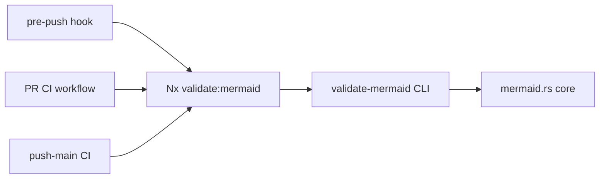

# Technical Documentation — Mermaid Gate Coverage Expansion

## Architecture

The gate is a Rust CLI subcommand plus its wiring. Three layers change:



The three enforcement layers (DD-4) are: **Layer 1** the pre-push hook (local), **Layer 2** the
dedicated `pr-validate-mermaid.yml` on `pull_request` to `main`, and **Layer 3** the same workflow
on `push` to `main`. All three converge on the single `validate:mermaid` Nx target.

### Component inventory (grounded)

- **CLI command**: `apps/rhino-cli/src/commands/docs_validate_mermaid.rs` [Repo-grounded]
  - Args: `--max-label-len` (default 30), `--max-width` (default 4), `--max-depth` (default 0 =
    unlimited), `--max-subgraph-nodes` (default 6). [Repo-grounded — lines 30/33/36/39]
  - `SKIP_DIRS = [".next", "node_modules", ".git"]`. [Repo-grounded — line 46]
  - `collect_md_default_dirs` currently walks `["docs", "repo-governance", ".claude", "plans"]`
    plus root `.md` files. [Repo-grounded — line 186] **Note `apps` and `libs` are absent from
    this default list AND from the wired Nx-target positional args** — so today neither a bare
    `docs validate-mermaid` invocation nor the `validate:mermaid` target scans them. This plan
    closes that gap on BOTH surfaces (see DD-1 and DD-8). [Repo-grounded — line 186 +
    `project.json:170`] Amendment B reconciles `collect_md_default_dirs()` to add `apps` and
    `libs` and extends `SKIP_DIRS`; the `diagrams.md:438` claim ("Run without flags to validate
    all `docs/`, `repo-governance/`, …") describes precisely this default-dir behavior.
    [Repo-grounded — `diagrams.md:438`]
  - Exit logic: returns an error only when `result.violations` is non-empty; warnings do not
    affect exit. [Repo-grounded — lines 104-106]
- **Core library**: `apps/rhino-cli/src/internal/mermaid.rs` [Repo-grounded]
  - `ViolationKind::{LabelTooLong, WidthExceeded, MultipleDiagrams}` (blocking). [Repo-grounded]
  - `WarningKind::{ComplexDiagram, SubgraphDense}` (currently non-blocking). [Repo-grounded]
  - `flowchart_re()` matches `^(flowchart|graph)(\s+(TB|TD|BT|LR|RL))?$`. [Repo-grounded]
  - `parse_diagram` returns flowchart count `0` for non-flowchart blocks; this is the
    structural flowchart-only invariant. [Repo-grounded — line 335]
  - **No color check exists today** — there is no `fill:`/`stroke:`/`color:` palette validation in
    `mermaid.rs`; the existing `ViolationKind` set is `{LabelTooLong, WidthExceeded,
MultipleDiagrams}`. [Repo-grounded — `apps/rhino-cli/src/internal/mermaid.rs:65-67`]
  - Extensive in-file unit tests (byte-for-byte port) that MUST stay green. [Repo-grounded]
- **Color source of truth**: `repo-governance/conventions/formatting/diagrams.md` Accessible Color
  Palette defines the canonical set — Blue `#0173B2`, Orange `#DE8F05`, Teal `#029E73`, Purple
  `#CC78BC`, Brown `#CA9161`, Black `#000000`, White `#FFFFFF`, Gray `#808080`. [Repo-grounded —
  `diagrams.md` lines 574-584] The implementation MUST extract the allowlist from this section, not
  hardcode it from memory.
- **Nx target**: `apps/rhino-cli/project.json` → `validate:mermaid` [Repo-grounded — line 167]
  - Command: `cargo run ... -- docs validate-mermaid --max-depth=4 repo-governance/ .claude/`.
  - `inputs`: `{projectRoot}/src/**/*.rs`, `repo-governance/**/*.md`, `.claude/**/*.md`.
- **Pre-push hook**: `.husky/pre-push` [Repo-grounded]
  - Mermaid trigger at lines 22-24: `grep -qE '^(repo-governance/|\.claude/).*\.md$'`.
- **CI**: a NEW dedicated workflow `.github/workflows/pr-validate-mermaid.yml` [New file]
  - Mirrors `.github/workflows/pr-validate-links.yml` [Repo-grounded — checkout →
    `setup-rust` → run a rhino-cli docs validator] and uses the dual `push:[main]` +
    `pull_request:[main]` trigger pattern from `.github/workflows/crane-cli-integration.yml`
    [Repo-grounded — `crane-cli-integration.yml:3-13`].
  - The existing `.github/workflows/pr-quality-gate.yml` (`on: pull_request`, affected-language
    detect matrix) [Repo-grounded — `pr-quality-gate.yml:3,11-54`] is **unchanged** by this plan;
    DD-4 records why the mermaid gate lives in its own workflow rather than as a job inside it.

## Validator Check Matrix (after this plan)

The validator dispatches checks by diagram type. The 11 flowchart checks (5 preexisting structural +
6 new from Amendment A + the color check) apply to `flowchart`/`graph` only; the color check also
applies to the four other eligible non-flowchart types; all remaining types are skipped.

| Diagram type (source keyword)                                                                    | Checks applied                                                                                                                                                                                                                                                       |
| ------------------------------------------------------------------------------------------------ | -------------------------------------------------------------------------------------------------------------------------------------------------------------------------------------------------------------------------------------------------------------------- |
| `flowchart` / `graph`                                                                            | `label_too_long`, `width_exceeded`, `multiple_diagrams`, `complex_diagram`, `subgraph_dense`, `off_palette_color`, `literal_backslash_n`, `quotes_in_brackets`, `edge_label_too_long`, `non_lr_direction`, `palette_comment_count`, `separator_width_mismatch` (ALL) |
| `classDiagram` / `stateDiagram` / `stateDiagram-v2` / `requirementDiagram` / `quadrantChart`     | `off_palette_color` ONLY                                                                                                                                                                                                                                             |
| `sequenceDiagram`, `gantt`, `pie`, `gitGraph`, `journey`, `timeline`, `mindmap`, `erDiagram`, C4 | skipped (no checks)                                                                                                                                                                                                                                                  |

> **Future work**: extending the bracket-label-oriented checks (`literal_backslash_n`,
> `quotes_in_brackets`) to other diagram types that use bracket labels is deferred — Amendment A
> keeps all six new checks flowchart-only, consistent with the existing structural invariant.

### Exemption Directive Vocabulary (after this plan)

Exemptable kinds — each suppressed by `%% validate-mermaid: allow-<token>` with an adjacent
mandatory `%% reason:` line:

| Kind                       | Directive token          |
| -------------------------- | ------------------------ |
| `width_exceeded`           | `allow-width`            |
| `complex_diagram`          | `allow-complexity`       |
| `subgraph_dense`           | `allow-subgraph-density` |
| `edge_label_too_long`      | `allow-edge-label`       |
| `non_lr_direction`         | `allow-direction`        |
| `separator_width_mismatch` | `allow-separator`        |

NON-exemptable kinds — any `allow-*` directive naming one of these (or any unknown token) MUST be
REJECTED as a hard error, so they cannot be silently bypassed: `label_too_long`,
`multiple_diagrams`, `off_palette_color`, `literal_backslash_n`, `quotes_in_brackets`,
`palette_comment_count`.

## Design Decisions

### DD-1 — Widen scan via explicit positional paths in the Nx target

The Nx target passes explicit positional args, which **override** `collect_md_default_dirs`.
[Repo-grounded — line 65-68: positional args take precedence] Two equivalent options:

- **Option A (chosen)**: pass the full explicit path list in the target command
  (`repo-governance/ .claude/ plans/ docs/ apps/ libs/ AGENTS.md CLAUDE.md README.md`) and widen
  `inputs` to match. Keeps default-dir behavior untouched for other callers; the target is the
  single source of truth for what the gate scans. [Judgment call]
- **Option B (rejected)**: rely on `collect_md_default_dirs` by removing positional args, then
  extend the default list to add `apps`/`libs`/root. Rejected because it changes the no-arg
  default behavior of the command globally, a wider blast radius than the target needs.

`SKIP_DIRS` already excludes `.next`, `node_modules`, `.git`. `.opencode/` is **generated**
(auto-synced from `.claude/`) — it is not added to the scan list; document this exclusion in
`diagrams.md`. Generated `.opencode/` diagrams are byte-equal mirrors of `.claude/` sources, so
scanning `.claude/` already covers their content. [Repo-grounded — `.opencode/` is generated]

### DD-2 — Inline exemption directive: structure-kinds-only, rationale-required

Syntax (parsed per mermaid block, flowchart blocks only):

```text
%% validate-mermaid: allow-width
%% reason: <free text explaining why this diagram is intentionally over budget>
```

- **Exemptable kinds**: `width_exceeded` (`allow-width`), `complex_diagram` (`allow-complexity`),
  `subgraph_dense` (`allow-subgraph-density`), and the three new exemptable kinds from Amendment A
  — `edge_label_too_long` (`allow-edge-label`), `non_lr_direction` (`allow-direction`),
  `separator_width_mismatch` (`allow-separator`). This is the **closed allowlist** of exemptable
  kinds (see the Exemption Directive Vocabulary table above — it is the single source of truth, and
  the directive guard must read from it).
- **NEVER exemptable**: `label_too_long`, `multiple_diagrams`, `off_palette_color` (DD-6),
  `literal_backslash_n`, `quotes_in_brackets`, and `palette_comment_count` (DD-9). Over-long labels
  clip on render; multiple diagrams per fence is always wrong; off-palette color defeats
  accessibility; a literal `\n` renders as garbage; a `"` inside `[...]` breaks the parser; the
  palette-comment count is a correctness/consistency rule. No directive can suppress these.
- **Invalid directive rejection**: any `allow-*` naming a kind NOT in the exemptable allowlist —
  `allow-color`, `allow-label`, `allow-multiple`, `allow-backslash-n`, `allow-quotes`,
  `allow-palette-comment`, or any unknown token — is REJECTED as an unsupported/invalid directive
  (a hard blocking error), so an author cannot bypass a non-exemptable check by typing a
  plausible-looking directive.
- **Rationale REQUIRED**: an `allow-*` directive without an adjacent `%% reason:` line is itself
  a **hard blocking error** (a new violation kind, e.g. `ExemptionMissingReason`). This makes
  exemptions impossible to apply silently.
- **Flowchart-only**: directives on non-flowchart blocks are ignored (the block already yields
  count 0 and no checks run).

Implementation approach: extend block parsing to detect `%%`-comment directive lines within the
fence, associate each `allow-*` with the immediately adjacent `reason:` line, and thread the
exemption set into the per-block validate step so a matched structural violation is suppressed
(or, if reasonless, replaced by the `ExemptionMissingReason` blocking error).

**Phased construction note**: The directive guard is implemented in two delivery phases. Phase 3
establishes the guard with the initial three-token allowlist (`allow-width`, `allow-complexity`,
`allow-subgraph-density`), so at the end of Phase 3 any `allow-edge-label`, `allow-direction`, or
`allow-separator` directive is REJECTED as an unrecognized token. Phase 3B GREEN step (3) extends
the guard's allowlist to add those three tokens. This means Phase 3B RED tests verify that
`allow-edge-label` + reason SUPPRESSES `edge_label_too_long` — those tests fail at RED time both
because the check is not yet implemented AND because the directive is currently rejected (both
are correct RED failures). The single source of truth for the fully-registered allowlist is the
Exemption Directive Vocabulary table above; the guard reads from that registered set at runtime.

### DD-3 — Promote `complex_diagram` and `subgraph_dense` to blocking

Move both from `WarningKind` handling into the blocking path so they contribute to the non-zero
exit, OR keep the `WarningKind` enum but make the exit logic treat them as blocking. Either way,
update `format_text` / reporter wording so they print as errors, and update the exit condition so
their presence (absent a valid exemption) fails the command. The exemption mechanism (DD-2) is
what makes this safe — authors of genuinely complex diagrams add `allow-complexity` /
`allow-subgraph-density` + `reason:`.

**Code string preservation (no rename)**: The existing `WarningKind::SubgraphDense.code()` returns
`"subgraph_density"` [Repo-grounded — `apps/rhino-cli/src/internal/mermaid.rs:87`]. This plan does
**NOT rename** that code string. The variant is promoted to blocking, but its JSON output code
remains `"subgraph_density"` throughout — this is not a breaking change to any tooling that parses
the JSON output. The directive token `allow-subgraph-density` (DD-2 Exemption Directive Vocabulary)
was already named to match the existing code string and requires no change. The check matrix and
prose in this plan use `subgraph_dense` as the **variant/concept name** (matching the Rust enum
variant `WarningKind::SubgraphDense`), not as the JSON code string; the code string stays
`"subgraph_density"` in all output.

### DD-4 — Triple-layer enforcement: pre-push + PR CI + push-to-main CI

The mermaid gate is enforced explicitly across **three layers** so a malformed diagram cannot
reach `main` through any path (local hook, PR, or direct trunk push):

1. **Layer 1 — pre-push hook** (local): widen the `.husky/pre-push` mermaid trigger so
   `npx nx run rhino-cli:validate:mermaid` fires on **any** `*.md` change (not just
   `^(repo-governance/|\.claude/).*\.md$`). [Repo-grounded — `.husky/pre-push:22`] This is the
   fast local feedback loop; it is skippable with `git push --no-verify`, which is exactly why
   layers 2 and 3 exist as non-bypassable backstops.

2. **Layer 2 — PR CI (`pull_request` to `main`)**: add a dedicated GitHub Actions workflow
   `.github/workflows/pr-validate-mermaid.yml` [New file — does not exist yet, confirmed by
   `test -f`]. It runs `npx nx run rhino-cli:validate:mermaid` (the Phase-4-widened full-repo
   target) on every PR targeting `main`, **blocking** the PR on any mermaid violation. The
   workflow MIRRORS the structure of the existing `.github/workflows/pr-validate-links.yml`
   [Repo-grounded — that workflow exists, `on: pull_request`, single job:
   checkout → `setup-rust` → run the rhino-cli validator]: same `actions/checkout@v6`,
   `./.github/actions/setup-node` + `./.github/actions/setup-rust` composite-action setup, and
   `ubuntu-latest` runner.

3. **Layer 3 — push/main CI ("other related CIs", `push` to `main`)**: the **same**
   `pr-validate-mermaid.yml` workflow ALSO triggers on `push: branches: [main]`. The repo's normal
   flow is Trunk Based Development — direct pushes to `main`, often without a PR — so the PR
   trigger alone would leave direct trunk pushes ungated. The dual `on:` block closes that gap.

The combined trigger block is therefore:

```yaml
on:
  pull_request:
    branches: [main]
  push:
    branches: [main]
```

This dual-trigger pattern is grounded in the existing `.github/workflows/crane-cli-integration.yml`
[Repo-grounded — that workflow uses `on: { push: {branches:[main]}, pull_request: {branches:[main]} }`].

**Dedicated-workflow rationale (design choice, stated)**: a focused, separately-named
`pr-validate-mermaid.yml` is preferred over adding a `mermaid-gate` job inside the existing
`pr-quality-gate.yml`. Rationale:

- **Precedent**: `pr-validate-links.yml` already establishes a focused, separately-named PR check
  for a single rhino-cli docs validator (`docs validate-links`). The mermaid gate is the direct
  analogue (`docs validate-mermaid`) and follows the same precedent. [Repo-grounded —
  `pr-validate-links.yml`]
- **Independent trigger surface**: `pr-quality-gate.yml` is `on: pull_request` only and is built
  around an affected-language detect matrix (`detect` job → per-language `typecheck lint test:quick
spec-coverage` jobs split by `tag:lang:*`). [Repo-grounded — `pr-quality-gate.yml:3,11-54`] The
  mermaid gate needs a `push: branches: [main]` trigger too (Layer 3) and runs the full-repo
  `validate:mermaid` target unconditionally (not affected-scoped), so embedding it in the
  affected-matrix workflow would mix two different trigger/scoping models. A dedicated workflow
  keeps each concern clean and independently observable in the Actions UI.

`pr-quality-gate.yml` remains the existing PR gate for code quality and is noted here only to
explain why the mermaid gate lives in its own workflow rather than as a job inside it.

### DD-5 — Preserve and test the flowchart-only invariant

Add an explicit non-regression unit test asserting that a `sequenceDiagram` / `gantt` block yields
zero findings, and that a `classDiagram` / `stateDiagram-v2` block yields **no structural**
findings (it may yield only `off_palette_color`), so the widened scan over `apps/` and `docs/`
(which contain non-flowchart diagrams) never starts misapplying structural checks. This locks in
the existing `parse_diagram` count-0 behavior for structural checks. [Repo-grounded — line 335]

### DD-6 — Off-palette color check (new blocking violation, eligible-type matrix, non-exemptable)

Add a new blocking violation kind `ViolationKind::OffPaletteColor` (code `off_palette_color`). For
every eligible diagram block, scan the source for hex literals appearing after `fill:`, `stroke:`,
and `color:` keys — inside `classDef`, `style`, `:::`-class definitions, and (for quadrantChart)
inline point `color:` — and assert each is a member of the canonical allowlist extracted from
`diagrams.md` (DD source-of-truth above). Any off-palette hex is a blocking violation.

- **Allowlist source**: extract from `diagrams.md` Accessible Color Palette; unit-test the parsed
  set equals the documented 8 colors so drift is caught.
- **Normalization**: uppercase the hex and expand 3-digit shorthand (`#FFF` → `#FFFFFF`) before
  membership comparison, so `#0173b2`, `#0173B2`, and any shorthand compare correctly.
- **Never exemptable**: no directive can suppress `off_palette_color`. An `allow-color` directive
  (or any `allow-*` naming a non-structural kind such as `allow-label`) is REJECTED as an
  unsupported/invalid directive — a hard blocking error — so palette compliance cannot be silently
  bypassed (extends the DD-2 exemptable-set guard).

### DD-7 — Per-diagram-type dispatch matrix

The validator dispatches checks by diagram type. The structural checks remain flowchart-only; the
color check applies to the five eligible types; everything else is skipped.

| Diagram type (source keyword)                                                   | Structural checks (label/width/multiple/complex/subgraph) | `off_palette_color`   | Net result  |
| ------------------------------------------------------------------------------- | --------------------------------------------------------- | --------------------- | ----------- |
| `flowchart` / `graph`                                                           | YES (unchanged)                                           | YES                   | all checks  |
| `classDiagram`                                                                  | NO                                                        | YES                   | color only  |
| `stateDiagram` / `stateDiagram-v2`                                              | NO                                                        | YES                   | color only  |
| `requirementDiagram`                                                            | NO                                                        | YES                   | color only  |
| `quadrantChart`                                                                 | NO                                                        | YES (inline `color:`) | color only  |
| `sequenceDiagram`, `gantt`, `pie`, `gitGraph`, `journey`, `timeline`, `mindmap` | NO                                                        | NO                    | skipped (0) |
| `erDiagram`, C4                                                                 | NO                                                        | NO (deferred)         | skipped (0) |

Implementation note: `flowchart_re()` already identifies flowchart/graph blocks for the structural
path [Repo-grounded — `mermaid.rs:266`]. Add a sibling type classifier that recognizes the
color-eligible non-flowchart keywords and routes them to a color-only validate path, leaving all
other blocks at the existing count-0 skip. The structural checks stay strictly behind the
flowchart classifier; only the color scanner runs for the four additional eligible types.

The eligible-type set is grounded in official Mermaid styling documentation: flowchart/graph,
classDiagram, stateDiagram/v2, requirementDiagram, and quadrantChart all support per-element hex in
source via `classDef`/`style fill:#hex` (or inline `color:#hex` for quadrant points), whereas
sequenceDiagram/gantt/pie/gitGraph/journey/timeline/mindmap expose only theme/`themeVariables`- or
RGB-region-level color. [Web-cited — mermaid.js.org/syntax/\*, accessed 2026-06-06:
"classDef className fill:#f9f,stroke:#333,stroke-width:4px;" — flowchart/graph, classDiagram,
stateDiagram/v2, requirementDiagram, and quadrantChart accept this per-element hex mechanism;
sequenceDiagram/gantt/pie/gitGraph/journey/timeline/mindmap do not]

### DD-8 — Reconcile `collect_md_default_dirs()` with the Nx target (Amendment B)

`collect_md_default_dirs()` defaults to `["docs", "repo-governance", ".claude", "plans"]` + root
`*.md`, omitting `apps` and `libs`; the `validate:mermaid` target overrides it with an even
narrower explicit `repo-governance/ .claude/`. [Repo-grounded —
`apps/rhino-cli/src/commands/docs_validate_mermaid.rs:186` + `project.json:170`] The two surfaces
disagree about what a full scan means, and the `diagrams.md:438` "Run without flags to validate
all `docs/`, `repo-governance/`, …" claim describes precisely the default-dir behavior.
[Repo-grounded — `diagrams.md:438`]

- **Change**: add `apps` and `libs` to the `collect_md_default_dirs()` dir list, so a bare
  `docs validate-mermaid` covers the full repo.
- **`SKIP_DIRS` extension**: `SKIP_DIRS` is currently `[".next", "node_modules", ".git"]`
  [Repo-grounded — line 46]. Extend it for the generated/build trees now reachable under `apps`/
  `libs`: add `dist`, `target` (Rust build output), and `.opencode` (generated mirror). Keep
  `.next`, `node_modules`, `.git`.
- **Consistency choice (stated)**: the Nx target's positional paths (DD-1) and the default-dir
  list MUST cover the same logical set (`repo-governance/`, `.claude/`, `plans/`, `docs/`, `apps/`,
  `libs/`, root files). DD-1 keeps the explicit positional args in the target as the wired source
  of truth (so `inputs` can mirror them precisely for cache correctness), and DD-8 makes the
  no-arg default reach the same trees — neither surface silently under-scans.
- **Test**: a unit test asserts the `collect_md_default_dirs()` result includes files under `apps`
  and `libs` (and still under `docs`/`repo-governance`/`.claude`/`plans`), and excludes the
  extended `SKIP_DIRS`.

### DD-9 — Six new flowchart-only checks (Amendment A)

Add six new check kinds in `apps/rhino-cli/src/internal/mermaid.rs`, each TDD-shaped and wired into
the flowchart validate path, pre-push, the new CI job, and the per-tree fix-all. All six apply to
`flowchart`/`graph` blocks ONLY (consistent with the existing structural flowchart-only invariant).

| New kind                   | Trigger                                                                       | Blocking | Exemptable                 | Convention anchor                  |
| -------------------------- | ----------------------------------------------------------------------------- | -------- | -------------------------- | ---------------------------------- |
| `literal_backslash_n`      | a literal `\n` escape inside any node/edge label                              | YES      | NEVER (`allow-*` rejected) | diagrams.md ~1480 (Error 7) / 1144 |
| `quotes_in_brackets`       | a `"` inside a `[...]` node label                                             | YES      | NEVER (`allow-*` rejected) | diagrams.md Error 2, line 1219     |
| `edge_label_too_long`      | an edge label (`-->text` / `-- text -->`) exceeding 20 chars                  | YES      | YES (`allow-edge-label`)   | diagrams.md Rule 3, 1147/1565      |
| `non_lr_direction`         | a flowchart whose direction is `TD`/`TB`/`BT`/`RL` (not `LR`)                 | YES      | YES (`allow-direction`)    | diagrams.md line 402               |
| `palette_comment_count`    | a flowchart with zero or duplicate color-palette comments (must be EXACTLY 1) | YES      | NEVER (`allow-*` rejected) | diagrams.md 681 / 1138             |
| `separator_width_mismatch` | a box-drawing separator length not matching the longest text line (≤20)       | YES      | YES (`allow-separator`)    | diagrams.md Rule 5, line 1644      |

- **`literal_backslash_n`**: scan node and edge labels for the two-character sequence `\n`. A
  literal `\n` renders as the characters `\n` rather than a line break — always a bug; the
  convention says use `<br/>`. Non-exemptable.
- **`quotes_in_brackets`**: detect a `"` appearing inside a `[...]` node label. This breaks the
  Mermaid parser (diagrams.md "Error 2: Literal Quotes Inside Node Text"). Non-exemptable.
- **`edge_label_too_long`**: measure edge-label text (inside `|...|` or `-- text -->`); >20 chars
  is a violation. Edges cannot use `<br/>`, so the only fixes are shortening or a justified
  `allow-edge-label` + reason.
- **`non_lr_direction`**: read the opening `flowchart`/`graph` directive; any direction other than
  `LR` violates. The justified-exception clause (semantic top-down OR LR-would-exceed-MaxWidth=4) is
  honored via `allow-direction` + mandatory reason. `flowchart_re()` already captures the direction
  token `(TB|TD|BT|LR|RL)` [Repo-grounded — `mermaid.rs` flowchart regex], so the check reads the
  captured group.
- **`palette_comment_count`**: count the color-palette comments (the `%% Color palette:` /
  accessibility comment) in the block; the count must be exactly one. Zero or duplicate violates.
  Non-exemptable.
- **`separator_width_mismatch`**: for a node label using box-drawing separator chars (e.g. `────`),
  compare the separator length to the longest text line in that node (kept ≤20). A mismatch
  violates. This check is mechanically fuzzy, so `allow-separator` + reason covers genuine edge
  cases.

Implementation note: all six run inside the flowchart-only validate path behind the existing
flowchart classifier — they never fire on `classDiagram`, `sequenceDiagram`, or any other type. The
exemptable three (`edge_label_too_long`, `non_lr_direction`, `separator_width_mismatch`) plug into
the DD-2 exemption mechanism; the never-exemptable three (`literal_backslash_n`,
`quotes_in_brackets`, `palette_comment_count`) cause their `allow-*` directives to be rejected as
invalid via the DD-2 directive guard. Add TDD tests per Amendment A: each exemptable kind is
suppressed by its directive+reason; each non-exemptable `allow-*` errors; a directive without
`reason:` errors.

The `non_lr_direction` cleanup is **expected to be the largest single fix-all contributor** — many
existing `flowchart TD`/`flowchart TB` diagrams (including this plan's predecessor and the
gherkin-cardinality plan README) will need conversion to LR or a justified `allow-direction`.
Re-measure per tree at execution; do NOT fabricate counts.

## File Impact

| File                                                   | Change                                                                                                                                                                                                                                                                                                                                           | Executor                          |
| ------------------------------------------------------ | ------------------------------------------------------------------------------------------------------------------------------------------------------------------------------------------------------------------------------------------------------------------------------------------------------------------------------------------------ | --------------------------------- |
| `apps/rhino-cli/src/internal/mermaid.rs`               | Exemption parser, `ExemptionMissingReason` + `OffPaletteColor` kinds, color scanner + allowlist extraction, per-type dispatch matrix, warnings→blocking, **six new checks (DD-9): `literal_backslash_n`, `quotes_in_brackets`, `edge_label_too_long`, `non_lr_direction`, `palette_comment_count`, `separator_width_mismatch`**, invariant tests | `swe-rust-dev`                    |
| `apps/rhino-cli/src/commands/docs_validate_mermaid.rs` | Exit-logic for promoted blocking kinds + `off_palette_color` + the six new blocking kinds; reporter wording; **reconcile `collect_md_default_dirs()` to add `apps`/`libs` + extend `SKIP_DIRS` (DD-8)**                                                                                                                                          | `swe-rust-dev`                    |
| `apps/rhino-cli/project.json`                          | Widen `validate:mermaid` command paths + `inputs`                                                                                                                                                                                                                                                                                                | `swe-rust-dev`                    |
| `.husky/pre-push`                                      | Widen mermaid trigger glob to any `*.md` (Layer 1)                                                                                                                                                                                                                                                                                               | `swe-rust-dev`                    |
| `.github/workflows/pr-validate-mermaid.yml`            | **NEW FILE** — dedicated workflow, dual `pull_request: branches:[main]` + `push: branches:[main]` triggers (Layers 2 & 3), runs `npx nx run rhino-cli:validate:mermaid`; mirrors `pr-validate-links.yml` structure + `crane-cli-integration.yml` dual-trigger (DD-4)                                                                             | `swe-rust-dev`                    |
| `repo-governance/conventions/formatting/diagrams.md`   | Fix coverage claim; document directive, structural-scope, blocking behavior, the five color-eligible types, the non-exemptable color check (palette = source of truth), AND the six new checks with their blocking/exemptable status (DD-9)                                                                                                      | `repo-rules-maker` / `docs-maker` |
| Diagrams across all newly covered trees                | Per-tree fix-all (shorten labels / restructure / exempt structural; replace off-palette colors; convert non-LR directions or exempt; fix `\n`/quotes/edge-labels/palette-comment/separator findings)                                                                                                                                             | per-tree (see delivery)           |

## Dependencies

- Existing `rhino-cli` toolchain (Rust, `cargo`, Nx). [Repo-grounded]
- CI composite actions `./.github/actions/setup-node` and `./.github/actions/setup-rust`.
  [Repo-grounded — used by existing jobs]
- No new external crates anticipated; directive parsing reuses existing regex/string handling.
  [Judgment call — confirm during GREEN; if a crate is needed it must pass the dependency-bump
  policy]

## Testing Strategy

TDD throughout the Rust work (Red → Green → Refactor). Each Gherkin scenario in
[prd.md](./prd.md) maps to a test level:

| Acceptance criterion                                                                        | Test level                           |
| ------------------------------------------------------------------------------------------- | ------------------------------------ |
| Exemption honored / reasonless errors                                                       | Unit (`mermaid.rs` in-file tests)    |
| Label / multiple-diagram never exemptable                                                   | Unit                                 |
| `allow-color` / `allow-label` rejected as invalid                                           | Unit                                 |
| Off-palette fill/stroke/color blocks (flowchart)                                            | Unit                                 |
| On-palette colors pass                                                                      | Unit                                 |
| Off-palette color blocks (classDiagram, stateDiagram-v2, requirementDiagram, quadrantChart) | Unit                                 |
| classDiagram gets color-only (no label/width/structural)                                    | Unit                                 |
| Allowlist parsed from `diagrams.md` equals documented 8 colors                              | Unit                                 |
| Hex case / shorthand normalization                                                          | Unit                                 |
| Theme-only types (sequence, gantt, …) skipped entirely                                      | Unit (non-regression invariant)      |
| Flowchart-only structural invariant                                                         | Unit (non-regression invariant)      |
| Warnings now block                                                                          | Unit                                 |
| `literal_backslash_n` blocks; `allow-backslash-n` rejected                                  | Unit                                 |
| `quotes_in_brackets` blocks; `allow-quotes` rejected                                        | Unit                                 |
| `edge_label_too_long` blocks; `allow-edge-label` + reason suppresses                        | Unit                                 |
| `non_lr_direction` blocks; `allow-direction` + reason suppresses                            | Unit                                 |
| `palette_comment_count` (zero/duplicate) blocks; `allow-palette-comment` rejected           | Unit                                 |
| `separator_width_mismatch` blocks; `allow-separator` + reason suppresses                    | Unit                                 |
| Six new checks fire on flowcharts only (not classDiagram/sequenceDiagram)                   | Unit (non-regression invariant)      |
| `collect_md_default_dirs()` includes `apps`/`libs`, excludes extended `SKIP_DIRS`           | Unit                                 |
| Scope expansion scans all trees                                                             | Integration (run target; inspect)    |
| Pre-push fires on any markdown change                                                       | Manual / shell verification          |
| CI runs the gate                                                                            | CI verification (post-push)          |
| Per-tree zero blocking findings (structural + color)                                        | Integration (run target per tree)    |
| diagrams.md accurate                                                                        | Manual review                        |
| This plan passes its own gate (0 structural / 0 color)                                      | Integration (run target on `plans/`) |

All preexisting in-file unit tests in `mermaid.rs` MUST remain green at every phase gate.

## Rollback

Each phase is independently revertable via `git revert` of its thematic commit(s). The riskiest
change (warnings→blocking) is gated behind the exemption mechanism landing first, so a revert of
the warnings-blocking commit restores non-blocking behavior without touching the parser. The
scan-widening commit is independent of the validator-logic commits and can be reverted alone if
the fix-all backlog proves untenable, restoring the prior `repo-governance/ .claude/` scope. The
color-check commit (DD-6/DD-7) is likewise a self-contained thematic commit: reverting it removes
`off_palette_color` and the per-type color dispatch without touching the structural path or the
exemption parser. The six-new-checks commit (DD-9) and the default-dir reconciliation commit (DD-8)
are each self-contained: reverting DD-9 removes the six new flowchart kinds and their directive
tokens without touching color or the preexisting structural checks; reverting DD-8 restores the
prior `collect_md_default_dirs()` list and `SKIP_DIRS`.
