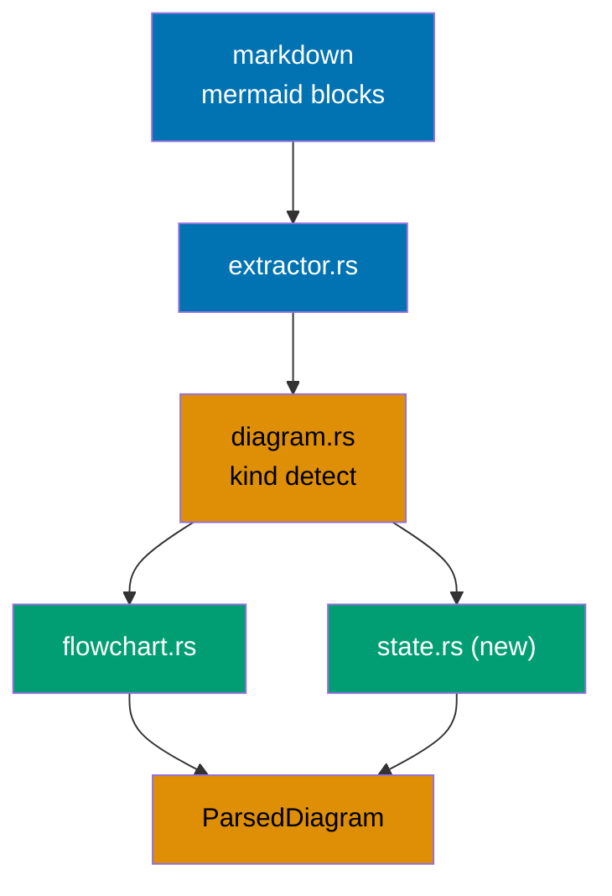
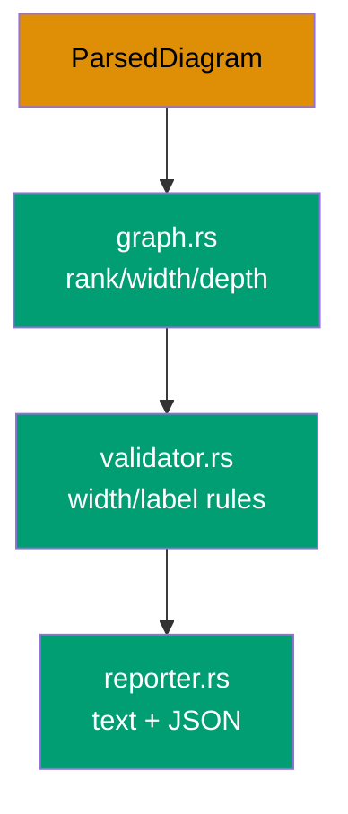
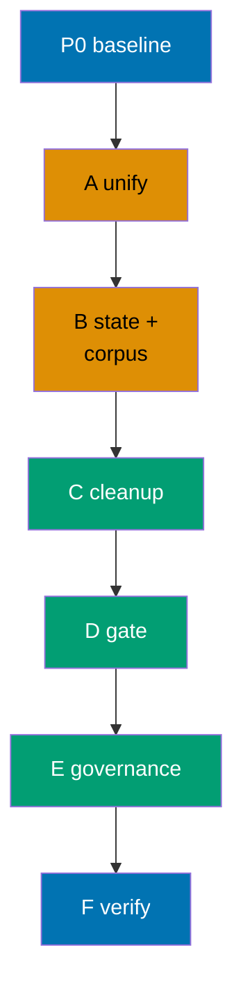

# Mermaid State Diagram Validation (ose-public)

> Reference implementation of the `mermaid-state-diagram-validation` objective.
> ose-public is the upstream-of-record for rhino-cli scaffolding; the ose-primer and
> ose-infra sibling plans mirror this plan's parser semantics.

## Context

The `rhino-cli docs validate-mermaid` command enforces two render-width rules on Mermaid
diagrams: a width rule (`≤4 nodes` on any single rank) and a label rule (`≤30` characters per
` `-separated segment). Today these rules apply **only to flowchart/graph diagrams**. State
diagrams (`stateDiagram-v2` and legacy `stateDiagram`) are never parsed — `parse_diagram` in
`apps/rhino-cli/src/internal/mermaid.rs` returns a node count of `0` for every non-flowchart
header, so all checks are silently skipped. [Repo-grounded:
`apps/rhino-cli/src/internal/mermaid.rs:342-356`]

The triggering defect: an 11-state `stateDiagram-v2 direction LR` chain renders far too wide for a
mobile viewport, yet the validator passes it. State diagrams have become an unguarded escape hatch
from the width discipline every flowchart must obey.

This plan closes that gap in ose-public **and** unifies the validator onto a fresh, kind-agnostic
module design so the three sibling repos (ose-public, ose-primer, ose-infra) cannot diverge again.

## Scope

In scope:

- Refactor `apps/rhino-cli/src/internal/mermaid.rs` (a 1757-line monolith) [Repo-grounded] into the
  fresh unified module design where both diagram parsers emit the same `ParsedDiagram`.
- Add a `state.rs` front-end parser for `stateDiagram-v2` and `stateDiagram` (v1).
- Apply the existing width rule and a label rule (state display labels **and** transition-edge
  labels) to state diagrams.
- Land a shared golden test corpus identical across all three repos.
- Clean up every violating state diagram repo-wide, including `plans/done/` and otherwise
  gate-excluded paths (per D-CLEAN).
- Propagate the new rule into governance (`repo-governance/conventions/formatting/diagrams.md`) and
  re-sync platform bindings.

Out of scope:

- `sequenceDiagram`, `classDiagram`, `erDiagram`, `gitGraph` validation — deferred to a future plan.
- Any change to the `validate:mermaid` Nx target, CLI command, pre-commit, or CI wiring beyond
  state diagrams ceasing to be skipped.
- Changing the gate's scan-exclusion list.

Affected project: `rhino-cli` (`apps/rhino-cli/`).

## Approach Summary

The unifying principle: **both parsers emit the same `ParsedDiagram`**, so the rank/width/label
validation core becomes diagram-kind-agnostic. State support then falls out as a second front-end
feeding the same core.

Delivery is phased and clean-then-gate. See [delivery.md](./delivery.md) for the executable
checklist.

## Documents

- [brd.md](./brd.md) — business rationale (WHY)
- [prd.md](./prd.md) — product requirements and Gherkin acceptance criteria (WHAT)
- [tech-docs.md](./tech-docs.md) — architecture and design decisions (HOW)
- [delivery.md](./delivery.md) — phased TDD delivery checklist (DO)

## Sibling Plans

This plan is one of three in a multi-repo parity run. The sibling repos are independent (not
subdirectories of this repo):

- **ose-primer** — `plans/in-progress/mermaid-state-diagram-validation/README.md` in the
  [`ose-primer`](https://github.com/wahidyankf/ose-primer) repository
  (local path `/Users/wkf/ose-projects/ose-primer/plans/in-progress/mermaid-state-diagram-validation/README.md`).
  Refactor burden: current modular split → fresh modular design + state support.
- **ose-infra** — `plans/in-progress/mermaid-state-diagram-validation/README.md` in the
  `ose-infra` repository
  (local path `/Users/wkf/ose-projects/ose-infra/plans/in-progress/mermaid-state-diagram-validation/README.md`).
  Refactor burden: monolith (version-behind) → fresh modular design + state support.

Parity is locked by a shared golden test corpus (identical fixtures + expected violation JSON in
all three repos) and an identical module design. ose-public is authored first and most detailed;
the siblings mirror its parser semantics.
